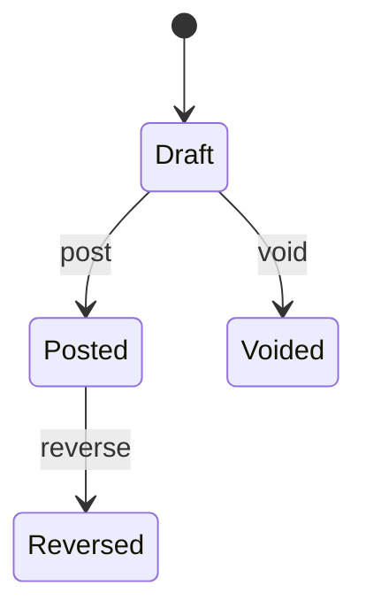
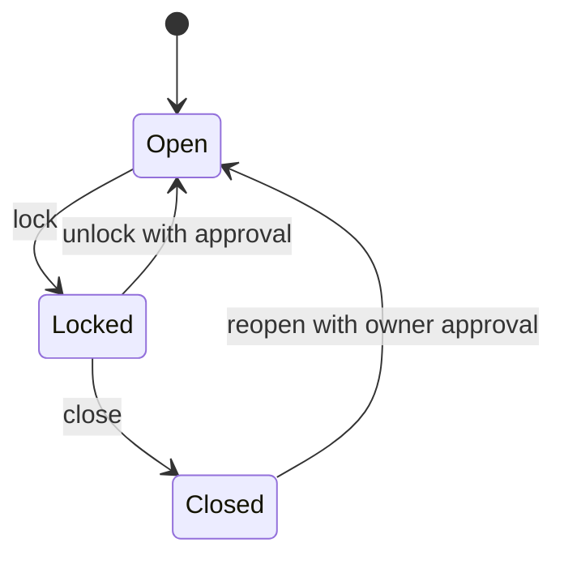
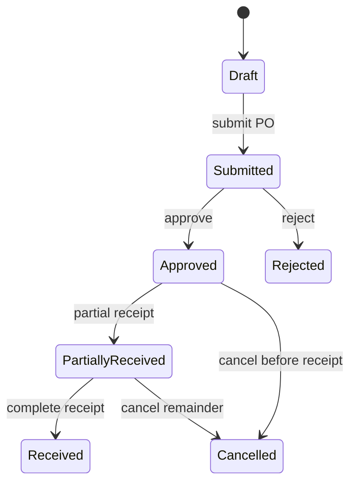
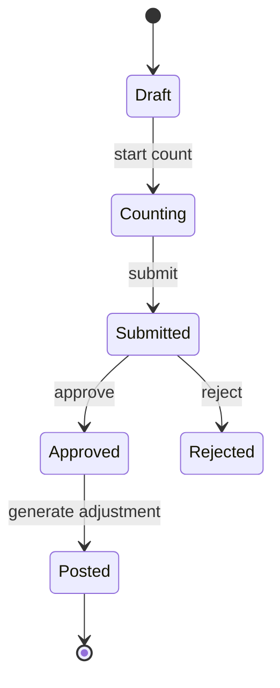
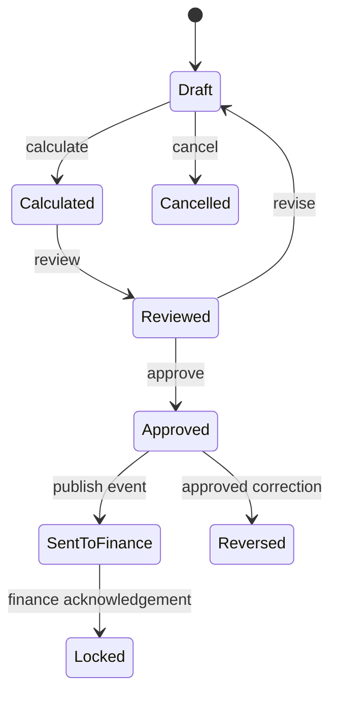
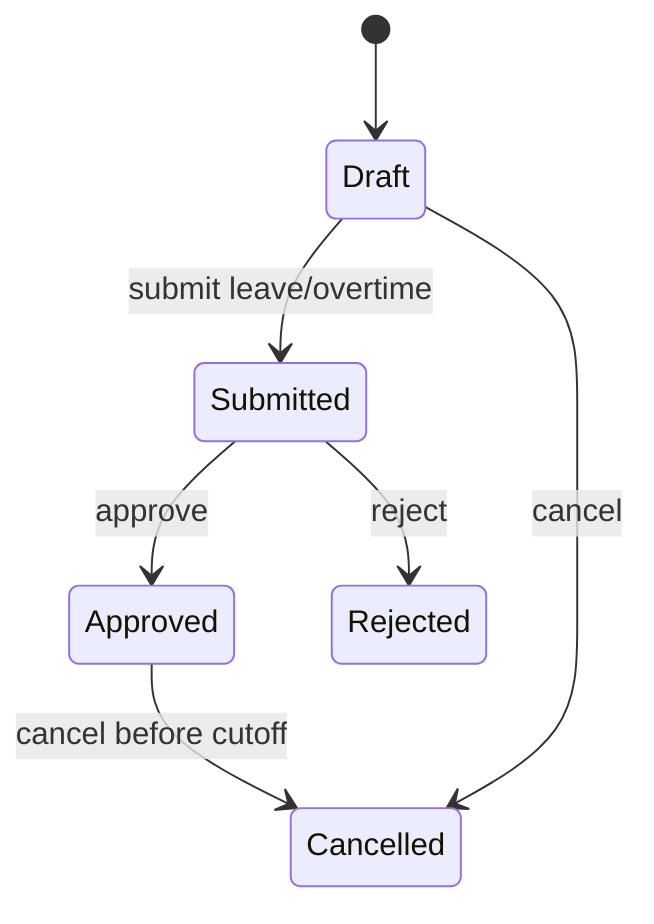

# Business Rules

> Source: aggregated from the "Business Rules" / "Aturan Bisnis" sections of every module document in `docs/03-sad/11-module-master-data.md` through `docs/03-sad/21-module-system.md`, cross-checked against `docs/04-ai-contract/07-module-contract.md` and `docs/04-ai-contract/08-workflow-contract.md`. These rules constrain every implementation; no module may be built in a way that violates them. Where a rule is written in Indonesian in the source document, it is reproduced as-is to avoid altering its meaning through translation.

---

# 1. Master Data (Module 11)

# 12. Business Rules

Master Data merupakan referensi utama bagi seluruh modul sehingga setiap perubahan harus mengikuti aturan bisnis yang ketat.

---

## 12.1 General Rules

- Setiap Master Data memiliki Primary Key (UUID).
- Setiap Master Data memiliki Code yang unik.
- Code tidak boleh diubah setelah data digunakan transaksi.
- Name wajib diisi.
- Status Active menentukan apakah data dapat digunakan.
- Seluruh perubahan harus dicatat pada Audit Trail.

---

## 12.2 Reference Integrity

Master Data yang telah digunakan oleh transaksi tidak boleh dihapus secara permanen.

Contoh:

- Treatment yang sudah digunakan pada EMR.
- Payment Method yang sudah digunakan Billing.
- Supplier yang memiliki Purchase Order.
- Branch yang memiliki Patient.

---

## 12.3 Activation Rule

Data yang tidak aktif:

- Tidak muncul pada dropdown transaksi.
- Tidak dapat dipilih pada transaksi baru.
- Tetap ditampilkan pada histori transaksi.

---

## 12.4 Branch Scope

Sebagian Master Data dapat bersifat:

- Global
- Branch Specific

Contoh:

| Master Data | Scope |
|--------------|--------|
| Treatment Category | Global |
| Treatment | Global |
| Payment Method | Global |
| Tax | Global |
| Promotion | Branch |
| Room | Branch |
| Dental Chair | Branch |
| Doctor Schedule | Branch |
| Province / Regency / District / Village | Global |
| Referral Source | Global |

New this pass: wilayah administratif Indonesia (Provinsi → Kabupaten/Kota → Kecamatan → Kelurahan/Desa) selalu FK berjenjang, tidak pernah teks bebas; setiap level mengacu ke parent-nya. Lihat `docs/03-sad/11-module-master-data.md` §8.5/§11.21–11.25.

---

## 12.5 Transaction Dependency

Master Data tidak boleh diubah apabila perubahan tersebut menyebabkan inkonsistensi transaksi.

Contoh:

- Mengubah Unit Medicine yang telah memiliki stok.
- Mengubah Currency transaksi aktif.
- Menghapus Tax yang digunakan Invoice.

---

---

# 2. Patient (Module 12)

# 5. Business Rules

## 5.1 General Rules

- Setiap pasien hanya memiliki satu Medical Record Number (MRN).
- MRN tidak boleh berubah setelah dibuat.
- Nomor identitas harus unik apabila diisi.
- Pasien dapat memiliki lebih dari satu nomor telepon.
- Pasien dapat memiliki lebih dari satu alamat, namun hanya satu yang ditandai sebagai alamat utama (`isPrimary`).
- Setiap level alamat (Provinsi, Kabupaten/Kota, Kecamatan, Kelurahan/Desa) mengacu pada tabel referensi Master Data — tidak diisi sebagai teks bebas.
- Nomor asuransi, akun Instagram/Facebook/TikTok, dan nomor WhatsApp bersifat opsional dan tidak divalidasi keunikannya.
- Sumber rujukan (referral source) bersifat opsional; jika sumbernya "Staf Klinik", identitas staf perujuk (`referredByUserId`) dicatat. Konsep ini berbeda dari "Referral" klinis pada Modul EMR (rujukan pasien ke spesialis/rumah sakit/laboratorium) — keduanya tidak boleh disatukan.
- Soft Delete hanya dapat dilakukan apabila pasien belum memiliki transaksi klinik.

---

## 5.2 Registration Rules

- Nama pasien wajib diisi.
- Jenis kelamin wajib dipilih.
- Tanggal lahir wajib diisi.
- Nomor telepon minimal satu.
- Sistem harus melakukan pengecekan kemungkinan pasien ganda (duplicate checking).

---

## 5.3 Duplicate Prevention

Sistem melakukan pemeriksaan berdasarkan kombinasi:

- Nama
- Tanggal Lahir
- Nomor Identitas
- Nomor Telepon

Apabila ditemukan data dengan tingkat kemiripan tinggi, sistem menampilkan peringatan kepada petugas sebelum registrasi dilanjutkan.

---

## 5.4 Update Rules

- MRN tidak dapat diubah.
- Riwayat kunjungan tidak boleh dihapus.
- Perubahan data pasien dicatat pada Audit Trail.
- Perubahan identitas pasien hanya dapat dilakukan oleh pengguna yang memiliki izin.

---

## 5.5 Quick Add Patient Rules

- Registrasi cepat (Quick Add Patient) hanya mengharuskan empat field: nama, alamat (teks bebas, bukan alamat berjenjang), nomor telepon, dan nomor identitas.
- Pasien yang dibuat melalui Quick Add tetap mendapatkan MRN dan status `Registered` yang sah — bukan record sementara/placeholder.
- Data yang belum lengkap (alamat berjenjang, kontak darurat, sumber rujukan, dsb.) dapat dilengkapi kemudian melalui alur Update Patient biasa.
- Fitur ini hanya dapat diakses dari layar booking Reservation ketika pencarian pasien tidak menemukan hasil — bukan endpoint registrasi paralel yang berdiri sendiri di luar konteks tersebut.

---

---

# 3. Reservation (Module 13)

# 7. Business Rules

## 7.1 General Rules

- Reservasi hanya dapat dibuat untuk pasien aktif.
- Dokter harus memiliki jadwal praktik.
- Slot waktu tidak boleh melebihi kapasitas.
- Pasien tidak boleh memiliki reservasi aktif pada waktu yang sama.
- Reservasi yang telah selesai tidak dapat diubah.
- Pembatalan dicatat pada Audit Trail.

---

## 7.2 Schedule Rules

- Dokter hanya dapat dipilih pada jadwal aktif.
- Jam reservasi harus berada dalam jam praktik.
- Slot yang penuh tidak dapat dipilih.
- Hari libur dokter tidak dapat digunakan.

---

## 7.3 Check-in Rules

- Check-in hanya dapat dilakukan pada hari kunjungan.
- Pasien yang telah Check-in otomatis masuk ke Queue Module.
- Nomor antrean dibuat saat proses Check-in.

---

## 7.4 Cancellation Rules

- Reservasi yang sudah Check-in tidak dapat dibatalkan.
- Alasan pembatalan wajib diisi.
- Status berubah menjadi **Cancelled**.

---

## 7.5 Reservation Module Enhancement Rules

- Pasien diberi status `NEW` jika belum pernah memiliki reservasi dengan status selain `CANCELLED`/`NO_SHOW`; setelah reservasi pertama tersebut, semua reservasi berikutnya diberi status `OLD`. Penentuan ini wajib dilakukan di server (bukan diturunkan di klien) agar deterministik dan aman terhadap race condition pada pemesanan bersamaan.
- Setiap reservasi menyimpan `patient_type_at_booking` sebagai snapshot pada saat reservasi dibuat — nilai ini tidak diubah lagi setelahnya, meskipun status pasien berubah menjadi `OLD` di kemudian hari, agar laporan historis tetap akurat.
- Quick New Patient Call (form gabungan pendaftaran pasien baru + reservasi) wajib dibungkus dalam satu transaksi database — kegagalan sebagian tidak boleh meninggalkan data pasien tanpa reservasi, atau sebaliknya.
- Laporan Pasien Baru (New Patient Report) memfilter reservasi berdasarkan `patient_type_at_booking = NEW` dan rentang tanggal `reservation_date`, mengikuti zona waktu klinik yang dikonfigurasi.
- Fitur ini tidak mengubah alur Reservasi yang sudah ada (Create/Update/Cancel/Reschedule/Check-in) — seluruhnya adalah kapabilitas tambahan di atas alur tersebut.

### 7.5.1 Reservation Module Addendum #2 (task-295–299)

- Daftar Reservasi (`GET /reservations` sebagaimana dirender `ReservationListView`) menampilkan kolom Nama Pasien dan No. RM, diambil dari snapshot ringan relasi `patient` — bukan entitas Patient penuh.
- Quick Add Patient (registrasi cepat pasien tanpa reservasi) **dihentikan** — digantikan sepenuhnya oleh Quick New Patient Call, yang membuat pasien dan reservasi dalam satu transaksi.
- Quick New Patient Call kini mendukung sumber rujukan (referral source) opsional, dengan validasi yang sama seperti Registrasi Pasien penuh.
- Daftar Reservasi (List) secara default hanya menampilkan reservasi hari ini dan seterusnya; Riwayat Reservasi (History) secara default hanya menampilkan reservasi sebelum hari ini. Pembatasan ini diterapkan di antarmuka (client-side default + batas input tanggal), bukan sebagai aturan wajib di server.
- Laporan Reservasi Selesai (Completed Reservations Report) memfilter reservasi berdasarkan `status = COMPLETED` dan rentang tanggal `reservation_date`, ditampilkan sebagai tabel dan grafik tren harian.

### 7.5.2 Reservation Module Addendum #3 (task-300–304)

- Laporan Reservasi berdasarkan Tipe Pasien menampilkan SEMUA reservasi pada rentang tanggal (bukan hanya pasien baru), dengan perbandingan jumlah dan persentase New vs Old.
- Laporan Reservasi berdasarkan Dokter membandingkan jumlah reservasi seluruh dokter pada rentang tanggal; filter dokter opsional hanya mempersempit tabel, tidak mempersempit grafik perbandingan.
- Reservasi (status BOOKED/CONFIRMED) dapat diubah melalui aksi "Edit" pada Daftar Reservasi — memakai kapabilitas ubah reservasi yang sudah ada sebelumnya (`PUT /reservations/:id`), bukan kapabilitas baru. Data pasien tidak dapat diubah melalui form ini.
- Daftar Reservasi dan Riwayat Reservasi menyediakan pilihan jumlah baris per halaman (10/20/50/100).
- Kartu reservasi pada Kalender Reservasi menampilkan nama dan No. RM pasien.

### 7.5.3 Reservation Module Addendum #4 (task-305–310)

- Laporan Reservasi Selesai (Completed Reservations Report) **diganti nama** menjadi Laporan Reservasi Berdasarkan Status (Reservation By Status Report) — filter `status` yang sebelumnya di-hardcode ke `COMPLETED` kini dapat dipilih pengguna (default tetap `COMPLETED` agar tampilan awal tidak berubah; opsi "All Statuses" menghapus filter sepenuhnya).
- Filter status opsional ditambahkan pula pada Laporan Reservasi berdasarkan Tipe Pasien dan Laporan Reservasi berdasarkan Dokter — berbeda dengan filter `doctorId` pada Laporan per Dokter (yang hanya mempersempit tabel), filter `status` mempersempit tabel maupun grafik ringkasan pada ketiga laporan ini, karena `status` adalah filter lintas-dimensi, bukan dimensi laporan itu sendiri.
- Ketiga laporan reservasi (By Status, By Patient Type, By Doctor) mendapat grafik tren tambahan yang dapat dikelompokkan per Hari atau per Bulan (toggle Day/Month, default Hari) — pada Laporan By Status, grafik tren yang sudah ada digeneralisasi mendukung toggle ini; pada dua laporan lainnya, ini adalah bagian baru yang terpisah dari grafik perbandingan yang sudah ada (New vs Old / per Dokter).

---

---

# 4. Queue (Module 14)

# 21. Business Rules

## Rule 1

Satu pasien hanya boleh memiliki satu Queue aktif pada satu cabang dalam satu hari.

---

## Rule 2

Queue Ticket wajib memiliki Patient.

---

## Rule 3

Reservation yang telah Check-In tidak boleh membuat Queue baru.

---

## Rule 4

Queue hanya dapat dibuat pada tanggal operasional klinik.

---

## Rule 5

Pasien yang telah Completed tidak dapat kembali ke WAITING.

---

## Rule 6

Queue tidak boleh dihapus secara fisik.

Menggunakan Soft Delete.

---

## Rule 7

Queue Number tidak boleh berubah setelah dibuat.

---

## Rule 8

Patient Walk-In harus memiliki Visit Date hari ini.

---

## Rule 9

Status IN_SERVICE hanya dapat dilakukan setelah CALLED.

---

## Rule 10

Billing hanya dapat dibuat apabila Queue COMPLETED.

---

---

# 5. Billing (Module 16)

# 14. Business Rules Overview

Billing mengikuti aturan bisnis berikut.

## Invoice

- Invoice Number harus unik.
- Invoice tidak boleh dihapus secara fisik.
- Invoice yang sudah dibayar tidak dapat diubah.
- Perubahan dilakukan melalui Void atau Refund.

---

## Payment

- Satu Invoice dapat memiliki banyak Payment.
- Payment tidak dapat diubah setelah berhasil.
- Payment gagal tidak mengubah saldo Invoice.

---

## Discount

- Discount dapat berasal dari:
  - Dokter
  - Promosi
  - Membership
  - Manual

- Total discount tidak boleh melebihi total invoice tanpa hak otorisasi khusus.

---

## Refund

- Refund harus memiliki alasan.
- Refund memerlukan approval sesuai nominal.
- Refund menghasilkan Audit Trail.

---

## Deposit

- Deposit dapat digunakan pada invoice berikutnya.
- Deposit tidak boleh bernilai negatif.
- Seluruh penggunaan deposit harus tercatat.

---

---

# 6. Finance (Module 17)

# 3. Domain Model and Business Rules

## 3.1 Bounded Context

Finance owns financial recognition, general ledger, treasury controls, operational expenses, doctor-fee settlement, and accounting close. It consumes source events only after their source transaction reaches a financially valid state.

## 3.2 Aggregates

| Aggregate root | Child entities | Invariants |
|---|---|---|
| `JournalEntry` | `JournalDetail` | At least two lines; total debit = total credit; posted entry immutable |
| `CashAccount` | `CashMovement` | Every movement has a reference, valid date, and allowed account status |
| `Expense` | approval/payment references | Approved before payment; paid amount cannot exceed approved amount |
| `DailyClosing` | reconciliation notes | One cashier/branch/date; variance requires explanation and approval |
| `FinancialPeriod` | close metadata | Only one open period per branch/date range; closed period rejects posting |
| `DoctorFeeSettlement` | fee lines/payment reference | Source fee is settled once; reversal creates an offsetting settlement |

## 3.3 Core Entities

### Account (Chart of Accounts)

An account represents an accounting classification. Required attributes include `code`, `name`, `account_type`, `normal_balance`, `parent_id`, `is_postable`, `is_active`, and optional branch ownership. Account types are `asset`, `liability`, `equity`, `revenue`, and `expense`.

Parent accounts are headings and cannot be posted to. An inactive account cannot be used for a new journal while historical ledger remains visible.

### Journal Entry and Detail

`JournalEntry` is the immutable accounting header: `journal_no`, `journal_date`, `branch_id`, `reference_type`, `reference_id`, `description`, `status`, `posted_at`, `posted_by`, `reversal_of_id`, and audit fields. Its details contain `account_id`, `debit`, `credit`, `description`, optional cost centre, and source line reference.

Journal statuses: `draft`, `posted`, `reversed`, `voided`. Only `draft` can be edited. `voided` is permitted only before posting; a posted entry is corrected through a linked reversing journal.

### Cash Account and Cash Movement

Cash accounts represent physical cash drawers, bank accounts, or approved payment clearing accounts. A movement is an immutable debit/credit operational record linked to a journal and business reference. Movement types are `receipt`, `disbursement`, `transfer_in`, `transfer_out`, `adjustment`, and `refund`.

### Expense

Expenses are operational costs not created by Billing. Types include rent, utility, supplies, maintenance, marketing, transport, administration, and other. Lifecycle: `draft → submitted → approved → paid`; `rejected` and `cancelled` can be reached before payment. A paid expense must have an expense journal and cash movement.

### Doctor Fee Settlement

A settlement groups eligible doctor-fee source records by doctor, branch, and period. Lifecycle: `draft → calculated → approved → paid`; `cancelled` is allowed before paid and `reversed` only through a compensating transaction. It never changes the original doctor-fee source.

## 3.4 Value Objects

| Value object | Rules |
|---|---|
| Money | Non-negative, IDR, scale 2; no float input |
| AccountingDate | Valid date within an open financial period |
| JournalNumber | Server-generated, unique, immutable after posting |
| AccountCode | Unique, uppercase code, hierarchy-compatible |
| Reference | `reference_type` and `reference_id` are both present for automated postings |
| ClosingVariance | Actual cash minus expected cash; reason required when non-zero |

## 3.5 Posting Rules

1. A journal has at least two non-zero detail lines.
2. A line has either debit or credit, never both; its amount is positive.
3. `SUM(debit) = SUM(credit)` is validated in application code and database transaction.
4. Account must be active, postable, and accessible to the journal branch.
5. Journal date must belong to an open period and may not precede the configured back-date limit without approval.
6. `(reference_type, reference_id, posting_type)` is unique for automatic posting to make delivery idempotent.
7. The journal, movement, outbox event, and idempotency record commit atomically.

## 3.6 Standard Posting Templates

Account codes below are logical mappings. Actual account ids are resolved from branch-effective configuration.

| Business event | Debit | Credit |
|---|---|---|
| Cash/QRIS patient payment | Cash/bank/clearing | Patient service revenue and tax payable where applicable |
| Receivable payment (if recognised earlier) | Cash/bank/clearing | Accounts receivable |
| Refund | Refund/contra-revenue or receivable | Cash/bank/clearing |
| Expense payment | Expense account | Cash/bank or accounts payable |
| Cash transfer | Destination cash/bank | Source cash/bank |
| Doctor fee accrual | Doctor fee expense | Doctor fee payable |
| Doctor fee payment | Doctor fee payable | Cash/bank |
| Stock issue/purchase | COGS or inventory | Inventory, payable, or cash according to source event |

The precise recognition point (payment or invoice closure) is configured once per branch and account mapping. It must not be changed retroactively; all changes require an effective date and audit record.

## 3.7 State Machines

---

---

# 7. Warehouse (Module 18)

# 3. Model Domain dan Aturan Bisnis

## 3.1 Bounded Context

Bounded context Warehouse mencakup ketersediaan fisik barang, lokasi penyimpanan, pergerakan, dan bukti asal stok. Satu unit stok dicatat berdasarkan item, gudang, dan—untuk item batch-tracked—batch. Saldo tampilan adalah cache/proyeksi yang hanya berubah melalui transaksi stok resmi.

## 3.2 Aggregate Design

| Aggregate root | Entity/child | Invariant utama |
|---|---|---|
| `PurchaseOrder` | `PurchaseOrderItem` | Kuantitas diterima tidak melebihi ordered kecuali approval over-receipt |
| `GoodsReceipt` | receipt item, batch allocation | Hanya PO approved/open; penerimaan menghasilkan stok masuk sekali |
| `StockBalance` | batch allocation/reservation | `available = current - reserved`; tidak negatif |
| `StockTransfer` | transfer item | Quantity out = quantity in; sumber dan tujuan berbeda |
| `StockOpname` | `StockOpnameItem` | Snapshot dihitung sekali; approval membuat adjustment sekali |
| `StockAdjustment` | adjustment line | Alasan, bukti, dan approval sesuai threshold wajib |

## 3.3 Entitas Utama

### Item

Item merepresentasikan barang yang dapat disimpan atau digunakan: kode, nama, kategori, unit, minimum stock, purchase price referensi, selling price referensi, `is_consumable`, `is_batch_tracked`, `is_expiry_tracked`, dan status aktif. Item nonaktif tidak dapat dipilih untuk transaksi baru, tetapi histori tetap tersedia.

### Warehouse dan Stock Balance

Warehouse adalah lokasi stok fisik pada satu cabang. `StockBalance` menyimpan `current_stock`, `reserved_stock`, dan `available_stock` untuk kombinasi warehouse-item (dan batch bila diperlukan). Nilai `available_stock` dihitung server-side, bukan diterima dari klien.

### Stock Transaction

Stock transaction adalah ledger immutable yang menyimpan `transaction_number`, warehouse, item, batch, type, reference, `qty_in`, `qty_out`, saldo setelah transaksi, tanggal, actor, dan metadata. Tipe mendukung `PURCHASE`, `TREATMENT`, `SALE`, `ADJUSTMENT`, `TRANSFER`, `OPNAME`, `RETURN`, `RESERVATION`, dan `RELEASE_RESERVATION`.

### Purchase Order dan Goods Receipt

PO mengikat supplier, cabang, item, harga, quantity ordered, dan expected date. Goods receipt membuktikan fisik barang diterima dan dapat diterima sebagian. Hanya receipt yang posted menambah stock ledger. Pembatalan PO tidak dapat membatalkan receipt yang sudah posted.

### Item Batch

Batch menyimpan nomor batch/lot, item, warehouse, tanggal terima, expiry date, quantity awal, dan quantity tersisa. Item yang `is_expiry_tracked=true` wajib mempunyai batch dan expiry date pada saat receipt. Batch expired tidak dapat diissue; near-expiry menimbulkan alert sesuai konfigurasi.

### Stock Opname dan Adjustment

Opname merekam snapshot jumlah sistem versus hitung fisik. Setelah diapprove, selisih dikonversi sekali menjadi transaksi `OPNAME`. Adjustment digunakan untuk sebab selain hitung fisik, misalnya rusak, hilang, sample, atau koreksi penerimaan, dan selalu memerlukan alasan serta bukti sesuai kebijakan.

## 3.4 Value Objects

| Value object | Aturan |
|---|---|
| Quantity | `DECIMAL(18,2)`, lebih besar dari nol untuk pergerakan; mengikuti presisi unit |
| StockKey | Kombinasi item, warehouse, dan batch yang valid |
| BatchNumber | Wajib unik pada scope item/warehouse bila batch tracked |
| ExpiryDate | Tanggal valid; tidak boleh sebelum receipt date |
| MovementReference | `reference_type` dan `reference_id` wajib untuk transaksi terintegrasi |
| StockVariance | Physical count dikurangi system snapshot; reason wajib bila tidak nol |

## 3.5 Aturan Saldo dan Concurrency

1. Semua mutasi stok mengunci baris saldo terkait (`SELECT ... FOR UPDATE` atau optimistic version check) di dalam transaksi.
2. `current_stock = previous_current + qty_in - qty_out`; `available_stock = current_stock - reserved_stock`.
3. Stok out hanya boleh menggunakan `available_stock` yang cukup.
4. Setiap event sumber memiliki key unik `(reference_type, reference_id, transaction_type, item_id, batch_id)` untuk mencegah duplikasi.
5. Satu stock transaction hanya memiliki salah satu `qty_in` atau `qty_out` bernilai positif.
6. Posting gagal secara atomik: tidak boleh ada ledger tanpa perubahan saldo atau sebaliknya.
7. Override negative stock harus memiliki permission khusus, alasan, approval, dan alert; default-nya ditolak.

## 3.6 Aturan Batch, Expiry, dan Valuation

- Item batch/expiry-tracked wajib dialokasikan ke batch saat receipt, issue, transfer, return, dan adjustment.
- Algoritma default issue adalah FEFO berdasarkan `expiry_date` terdekat, lalu `received_at` terlama.
- Batch dengan `expiry_date < transaction_date` tidak boleh digunakan atau ditransfer sebagai stok aktif.
- Barang rusak/expired dipindahkan melalui adjustment/return yang memiliki reason code dan bukti.
- Biaya stok menggunakan metode konfigurasi per tenant (default: weighted average). Warehouse menyimpan source cost; Finance adalah otoritas pencatatan nilai/jurnal resmi.

## 3.7 State Machine

---

---

# 8. Human Resource (Module 19)

# 3. Model Domain dan Aturan Bisnis

## 3.1 Bounded Context

HR menangani identitas hubungan kerja, time administration, dan payroll calculation. Status karyawan menentukan kelayakan jadwal, absensi, leave, overtime, dan payroll. HR dapat menautkan employee ke user, tetapi tidak membuat credential atau memberikan role.

## 3.2 Aggregate Design

| Aggregate root | Child/entity | Invariant utama |
|---|---|---|
| `Employee` | position history, salary history, contract, bank account, document, history | Satu employee code unik; perubahan kerja effective-dated |
| `EmployeeSchedule` | shift/room assignment | Tidak ada schedule overlap untuk employee yang sama |
| `Attendance` | correction/approval metadata | Satu attendance harian/shift scope; waktu out tidak sebelum in |
| `LeaveRequest` | leave allocation/approval trail | Kuota cukup dan tanggal tidak overlap dengan approved leave |
| `OvertimeRequest` | approval/payroll link | Durasi valid, tidak overlap, belum dibayar dua kali |
| `PayrollRun` | `PayrollItem` per employee | Satu payroll final per employee-periode; total dapat direproduksi |

## 3.3 Entitas Utama

### Employee

Employee menyimpan `employee_code`, nama, branch/departemen/jabatan utama, employment status, tanggal mulai/berakhir, kontak kerja, user link nullable, dan status aktif. Status: `draft`, `active`, `suspended`, `terminated`, `inactive`. Terminasi tidak menghapus histori, user, payroll, atau audit lama.

### Employment History, Contract, dan Salary

`employee_histories` merekam promosi, perpindahan branch, perubahan department/position, suspension, dan termination dengan effective date serta reason. `employee_contracts` menyimpan contract type, start/end date, status, evidence attachment. `employee_salaries` menyimpan basic salary, allowance baseline, effective date, currency (default IDR), rule version, dan approval metadata. Hanya satu salary record effective untuk employee pada suatu tanggal.

### Schedule dan Attendance

Schedule menyimpan employee, `work_date`, start/end time, shift, room optional, branch, dan status `scheduled`, `off`, `leave`, atau `cancelled`. Attendance menyimpan actual check-in/out, source (`manual`, `device`, `mobile` future), status `present`, `late`, `absent`, `leave`, `sick`, `holiday`, atau `incomplete`, serta correction reason.

### Leave dan Overtime

Leave request memuat jenis cuti, tanggal/durasi, saldo sebelum/sesudah, reason, attachment, approver, dan status `draft`, `submitted`, `approved`, `rejected`, `cancelled`. Overtime menyimpan employee, tanggal, start/end, duration, reason, multiplier/rate snapshot, approver, dan payroll item reference.

### Payroll dan Payroll Item

Payroll run mewakili branch dan periode bayar dengan status `draft`, `calculated`, `reviewed`, `approved`, `sent_to_finance`, `paid` (projection), `locked`, `cancelled`, atau `reversed`. `PayrollItem` adalah snapshot per employee berisi basic salary, allowance, overtime, bonus, deduction, tax/benefit configured, gross, net, rule version, dan sources. Amount memakai `DECIMAL(18,2)`; float dilarang.

## 3.4 Value Objects

| Value object | Aturan |
|---|---|
| EmployeeCode | Unik, generated/validated server-side, immutable setelah active |
| EmploymentPeriod | Start date wajib; end date tidak sebelum start date |
| WorkInterval | End > start; timezone branch digunakan untuk tampilan/rule |
| PayrollPeriod | Range tanggal non-overlap untuk payroll type/branch yang sama |
| Money | IDR default, non-negative, decimal scale 2 |
| LeaveBalance | Tidak boleh negatif tanpa override authorized |
| PayrollRuleVersion | Rule, rate, dan source snapshot dapat direproduksi |

## 3.5 Aturan Bisnis Inti

1. Employee harus active pada date schedule, attendance, overtime, dan payroll item kecuali payout termination yang explicitly allowed.
2. Satu employee tidak boleh memiliki schedule yang overlap pada waktu yang sama, termasuk antar room/branch tanpa multi-assignment policy.
3. Check-out sebelum check-in, attendance duplicate scope, dan attendance pada tanggal future ditolak kecuali import authorized.
4. Leave approved mengubah/alokasikan kuota dan memblok schedule yang bertabrakan; cancellation mengembalikan kuota hanya bila payroll terkait belum locked.
5. Overtime harus approved sebelum masuk payroll dan hanya dapat ditautkan ke satu payroll item.
6. Payroll calculation memakai employee/salary/attendance/leave/overtime data dengan cutoff date dan policy version yang disimpan sebagai snapshot.
7. Employee-periode tidak boleh muncul pada lebih dari satu payroll final dalam scope branch/payroll type; rerun menggunakan draft baru atau adjustment, bukan duplicate final run.
8. Payroll approved/locked tidak dapat diubah atau dihapus. Koreksi menghasilkan adjustment/reversal dengan reference payroll asal.
9. Rekening karyawan tidak dikirim lewat event Payroll; Finance menerima identifier/token yang aman dan hanya data minimum yang diperlukan.

## 3.6 State Machine

---

---

# 9. Reporting & Dashboard (Module 20)

# 3. Model Domain dan Prinsip Metrik

## 3.1 Bounded Context

Reporting memiliki bounded context untuk query, aggregation, snapshot, export, dan metric governance. Ia tidak memiliki aggregate transaksi bisnis. Domain objects utama: `ReportDefinition`, `ReportJob`, `ReportSnapshot`, `DashboardSummary`, `MetricDefinition`, dan `ExportArtifact`.

## 3.2 Aggregate Design

| Aggregate root | Entity/value object | Invariant |
|---|---|---|
| `ReportDefinition` | dimensions, filters, metric version, access policy | Definition version immutable once published |
| `ReportJob` | request, progress, artifact | Requested scope authorised; job idempotent per key |
| `ReportSnapshot` | parameter, watermark, payload/checksum | Snapshot immutable and reproducible |
| `DashboardSummary` | metric points, as-of, freshness state | Data scope/version must be explicit |
| `ExportArtifact` | storage path, expiry, checksum, download record | Only creator/authorised role can download before expiry |

## 3.3 Metric Definition Standard

Setiap metric resmi memiliki:

| Field | Arti |
|---|---|
| `metric_code` | Identifier stabil, misalnya `finance.net_revenue` |
| `name` dan `description` | Label dan penjelasan bisnis |
| `owner_module` | Owner semantic/record source |
| `formula` | Rumus yang terdokumentasi dan versioned |
| `included_states` | State sumber yang diperhitungkan |
| `grain` | Contoh: branch/day/payment atau branch/period/account |
| `dimensions` | Branch, date, service, doctor, payment method, etc. |
| `timezone` | Timezone pembentukan bucket/report |
| `security_classification` | Internal/confidential/restricted |
| `definition_version` | Version untuk reproducibility |

## 3.4 Core Metric Rules

- **Revenue:** untuk financial statement, berasal dari Finance posted revenue journal. Dashboard Billing dapat menunjukkan `collected payment` dari payment sukses tetapi labelnya tidak boleh disamakan dengan accounting revenue.
- **Outstanding:** dihitung dari invoice Billing yang status/remaining balance-nya sesuai definition, tidak dari journal.
- **Visit count:** menggunakan visit final/valid; cancelled/test record dikecualikan menurut filter standard.
- **Waiting time:** interval definisi eksplisit antara check-in dan service start; missing timestamp tidak dihitung dan masuk data-quality count.
- **Stock balance:** dari Warehouse stock balance/posted ledger watermark; reserved dan available dilaporkan terpisah.
- **Payroll:** laporan payroll resmi hanya dari HR payroll approved/locked; data draft dipisahkan sebagai operational worklist.
- **Cash position:** dari Finance posted cash movement/journal, dengan as-of dan account scope jelas.

## 3.5 Time and Branch Rules

Periode laporan dibangun menggunakan timezone branch. Event timestamp disimpan UTC dan dibucket sesuai timezone report. Cross-branch report membutuhkan scope authorisation dan menampilkan timezone/aggregation policy. Date filter bersifat inclusive pada local date, lalu diterjemahkan ke UTC range secara server-side.

## 3.6 Dashboard State

Dashboard state: `fresh`, `refreshing`, `stale`, `partial`, `failed`. State `partial` menampilkan source dataset yang tertinggal; state `failed` tidak boleh menyajikan angka lama sebagai real-time tanpa marker stale. UI selalu menampilkan `dataAsOf` dan status freshness.

---

---

# 10. System Administration (Module 21)

# 3. Model Domain dan Aturan Sistem

## 3.1 Bounded Context

System Administration owns administration metadata and cross-cutting records. Key aggregates: `UserAdministration`, `Role`, `SystemParameter`, `FeatureFlag`, `Menu`, `NotificationTemplate`, `Notification`, `BackgroundJob`, and `AuditLog` (append-only).

## 3.2 Core Entities

### User Administration

User profile holds username/email/display name, employee link optional, status, role assignment, branch assignments, and administration metadata. Account statuses: `invited`, `active`, `suspended`, `locked` (observed from Authentication), `deactivated`. A deactivated user cannot receive new session/token; existing session revocation is requested through Authentication.

### Role, Permission, and Scope

Role groups permissions; permission is the smallest action identifier such as `finance.journal.post` or `report.export.create`. User-role is many-to-many where supported by the schema; `user_branch` defines accessible branches and one default branch. Permission assignment does not override resource ownership/domain rules.

### System Parameter

Parameter consists of namespace/key, typed value, schema version, scope, effective interval, status, encrypted/reference flag, and version history. Scope precedence: `branch` → `clinic` → `global` → default defined by owning module. A parameter has exactly one effective resolved value for a scope/time.

### Feature Flag and Menu

Feature flag controls availability of a named capability with enabled state, scope, effective dates, audience/role condition, and rollout metadata. It must not be used as an authorization bypass. Menu is navigation metadata with hierarchy/order/icon/route and menu-permission mapping. API authorization remains independent from menu visibility.

### Notification and Template

Template defines channel, locale, subject/body variables, classification, enabled state, and version. Notification is a recipient-specific immutable delivery request/status record. Statuses: `queued`, `processing`, `sent`, `delivered`, `failed`, `read`, `cancelled`; `read` applies to in-app acknowledgement and does not imply external delivery.

### Audit Log and Activity Log

Audit log records security-sensitive or state-changing actions with actor, target, action, outcome, before/after safe diff, source module, branch scope, correlation id, and timestamp. Activity log is a user-facing operational timeline and may be less detailed; it never replaces audit log.

### Background Job

Job manages asynchronous operation metadata: type, payload reference, idempotency key, priority, attempts, schedule, status, lease, result/error safe message, and trace/correlation ids. Job statuses: `queued`, `running`, `succeeded`, `retrying`, `failed`, `cancelled`, `dead_letter`.

## 3.3 Aggregate Invariants

| Aggregate | Invariant |
|---|---|
| UserAdministration | Active user has valid authorised branch/role assignment; default branch belongs to user |
| Role | System role cannot be deleted; permission mapping unique |
| SystemParameter | Value validates against schema; effective scope/range does not conflict ambiguously |
| FeatureFlag | Key unique; targeting is deterministic and non-secret; flag cannot grant missing permission |
| Menu | Parent hierarchy acyclic; route unique within active application scope |
| Notification | Rendered recipient/channel data is validated and no duplicate logical delivery on retry |
| AuditLog | Append-only; actor/action/time/outcome mandatory for sensitive action |
| BackgroundJob | One active idempotency key per job purpose; retry does not duplicate side effect |

## 3.4 Configuration Rules

1. Config key uses `module.namespace.key` format, e.g. `warehouse.expiry.warning_days`.
2. Allowed types: string, integer, decimal, boolean, enum, date, duration, JSON object/array validated by JSON Schema, or secret reference.
3. Direct clear-text secret value, executable JavaScript, SQL, shell, HTML, or arbitrary template code is rejected.
4. High-risk config/RBAC/flag changes require maker-checker approval and optional effective time.
5. Config change creates new version; rollback creates a new effective version referencing prior version, not destructive edit.
6. Value cache uses config-version/event invalidation and must fail closed for security-sensitive settings.
7. Owning module validates domain semantic constraints on read/application, including safe defaults when parameter is missing.

## 3.5 User and RBAC Rules

1. Username/email identifiers are unique case-insensitively according to policy.
2. User cannot be deactivated if it would remove the last active break-glass administrator; require explicit protected workflow.
3. Role/permission changes invalidate permission cache and trigger authentication session/claim refresh policy.
4. User may have only one default branch and it must appear in active `user_branch` assignment.
5. Deleting/deactivating a role in use is blocked; reassign users first or preserve as inactive historic role.
6. Built-in system roles/permissions are seeded/versioned and cannot be modified/deleted except supported extensions.
7. Client-supplied role, permission, branch, or menu state is never trusted for authorization.

---

---

# Note on EMR (Module 15)

`docs/03-sad/15-module-emr.md` does not contain a single consolidated "Business Rules" section; its rules are distributed across per-feature sections (Clinical Mapping Rules, Odontogram/Tooth State Machine validation, Prescription rules, etc. — see lines 2036, 2714, 4070, 4672, 5425, 6674, 7239, 7939, 8611 of that file). Rather than risk mis-summarizing clinical logic, implementers must read those sections directly from `docs/03-sad/15-module-emr.md` before building any EMR use case. This is flagged here per the project's "never invent business rules" policy rather than guessed at.

---

# Cross-Cutting Rules (all modules)

The following rules apply globally per `docs/04-ai-contract/01-global-rules.md`, `docs/04-ai-contract/07-module-contract.md`, and `docs/04-ai-contract/08-workflow-contract.md`, and must be respected in addition to the module-specific rules above:

- A module must never access another module's database directly; cross-module data must be obtained through the owning module's service/API or via a published Domain Event.
- Every Create/Update/Delete operation on business data must produce an Audit Trail entry (see `docs/03-sad/02-system-architecture.md` Section 20).
- State transitions defined in a module's lifecycle (e.g. Reservation status, Invoice status, EMR/Visit status) must not be skipped or reordered.
- Business validation must occur in the Application/Domain layer, never solely in the Presentation layer or client-side.
- Financial postings (Billing, Finance, HR Payroll) must be idempotent and must not silently repost after correction — corrections require an explicit reversing/adjusting entry.
