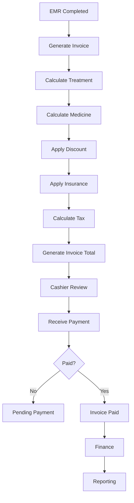

# Feature: Billing

> Source: derived from `docs/03-sad/16-module-billing.md`. Scope and use cases below are extracted directly from that document; no capability is added beyond what it specifies.

---

## Scope

# 3. Scope

## 3.1 In Scope

Billing Module mencakup proses berikut.

### Invoice

- Generate Invoice
- Manual Invoice
- Invoice Detail
- Invoice History

### Payment

- Cash
- Debit Card
- Credit Card
- QRIS
- Bank Transfer
- E-Wallet
- Deposit
- Mixed Payment

### Discount

- Doctor Discount
- Manual Discount
- Promotion
- Membership Discount

### Insurance

- Insurance Coverage
- Company Guarantee
- Partial Insurance

### Refund

- Full Refund
- Partial Refund
- Deposit Refund

### Administration

- Void Invoice
- Cancel Invoice
- Re-open Invoice
- Print Invoice
- Reprint Invoice

### Audit

- Audit Trail
- Activity Log
- Financial Log

---

## 3.2 Out of Scope

Billing Module tidak mencakup:

- General Ledger
- Journal Posting
- Payroll
- Procurement
- Asset Management
- Financial Statement

Seluruh proses tersebut merupakan tanggung jawab Finance Module.

---


---

## Use Cases / Functional Flow

# 13. High Level Workflow

## Billing Flow



---

## Payment Flow

```text
Invoice

↓

Choose Payment Method

↓

Payment Validation

↓

Payment Success

↓

Update Invoice

↓

Generate Receipt

↓

Finance
```

---

