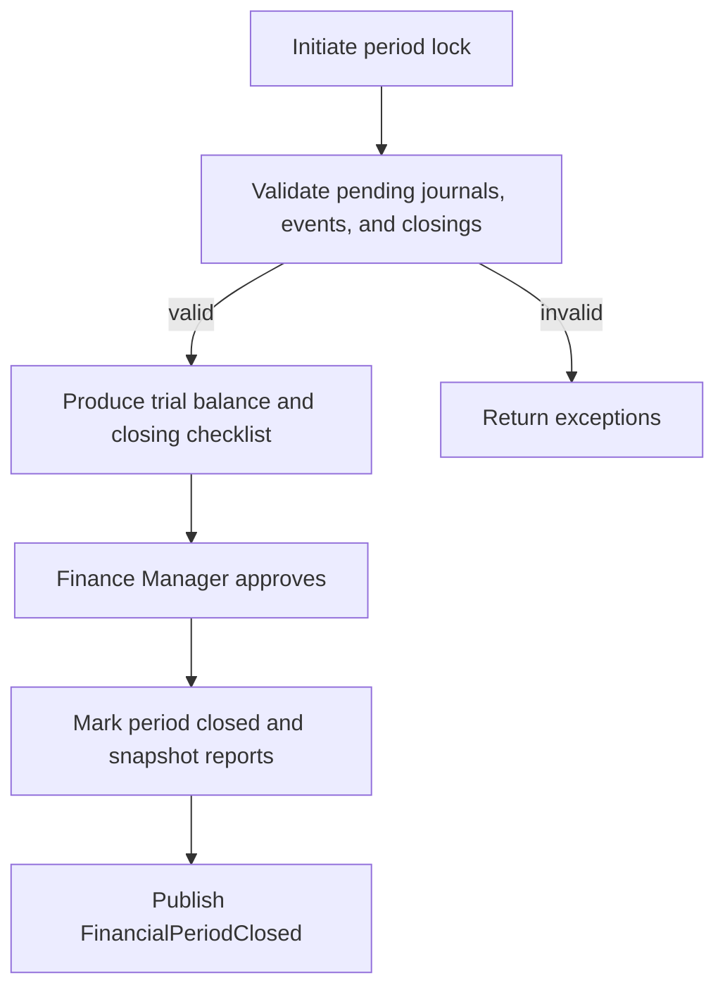

# Feature: Finance

> Source: derived from `docs/03-sad/17-module-finance.md`. Scope and use cases below are extracted directly from that document; no capability is added beyond what it specifies.

---

## Scope

# 1. Introduction and Scope

## 1.1 Overview

Finance is Parakita's accounting and treasury module. It converts validated business events into traceable financial records, manages cash and bank movements, records operational expenses, settles doctor fees, and closes financial periods. Finance is the accounting system of record; Billing remains the source of patient charge and payment detail.

The module uses Indonesian Rupiah (`IDR`) as the initial functional currency. All monetary values are stored as `DECIMAL(18,2)` and calculated with decimal arithmetic; floating-point values are prohibited.

## 1.2 Purpose

The module provides:

- Double-entry journals with an always-balanced ledger.
- Cash and bank accountability by branch and cashier.
- Controlled recording, approval, and payment of expenses.
- Doctor-fee settlement based on approved billing data.
- Daily cash closing and periodic accounting close.
- Auditable financial statements and management reports.

## 1.3 In Scope

| Area | Coverage |
|---|---|
| General ledger | Chart of accounts, journal creation, posting, reversal, ledger inquiry |
| Treasury | Cash/bank accounts, cash movement, transfer, reconciliation, daily closing |
| Income | Automated recognition from Billing and authorised manual income |
| Expense | Expense request, approval, payment, and accounting posting |
| Doctor fee | Calculation review, settlement, payment, and reversal |
| Period | Opening, locking, closing, and reopening with approval |
| Tax | Tax configuration and tax payable/receivable postings |
| Reporting | Trial balance, ledger, income statement, cash flow, expense and closing reports |

## 1.4 Out of Scope

- Creating patient invoices, receiving patient payments, discounts, deposits, insurance claims, and refunds; these are owned by Billing.
- Stock valuation and supplier purchase workflows; these are owned by Warehouse.
- Payroll calculation; this is owned by HR. Finance only receives approved payroll journals when enabled.
- Statutory e-filing, multi-currency revaluation, consolidation, and external accounting-system synchronisation. These are roadmap items.

## 1.5 Design Principles

1. **Double entry by default.** Every posted journal has debit equal to credit.
2. **Immutable posting.** Posted journals, cash movements, and approved closings are never edited or deleted; correction uses a reversal and replacement transaction.
3. **Source ownership.** Finance records a reference to the source transaction and does not mutate its business state.
4. **Branch isolation.** Operational balances and access are filtered by `branch_id`; cross-branch activity requires explicit inter-branch configuration.
5. **Period integrity.** No posting may enter a locked or closed period.
6. **Audit by default.** Creation, approval, posting, reversal, closing, export, and configuration changes are auditable.

---

---

## Use Cases / Functional Flow

# 4. Use Cases and Workflows

## 4.1 Actor Matrix

| Use case | Finance Staff | Finance Manager | Cashier | Clinic Manager | Owner | Administrator |
|---|:---:|:---:|:---:|:---:|:---:|:---:|
| View ledger/reports | ✔ | ✔ | limited | ✔ | ✔ | ✔ |
| Create manual journal | ✔ | ✔ | | | | ✔ |
| Post/reverse journal | | ✔ | | | | ✔ |
| Create/submit expense | ✔ | ✔ | | ✔ | | ✔ |
| Approve expense | | ✔ | | ✔ | | ✔ |
| Pay expense | ✔ | ✔ | | | | ✔ |
| Daily cash close | ✔ | ✔ | ✔ (own shift) | | | ✔ |
| Approve closing variance | | ✔ | | ✔ | | ✔ |
| Close/reopen period | | ✔ | | | ✔ | ✔ |
| Maintain COA mapping | | ✔ | | | | ✔ |

## 4.2 UC-FIN-001 — Post Billing Payment

**Trigger:** Billing publishes a successful `PaymentReceived`/`InvoicePaid` event.

1. Finance validates event schema, branch, payment method mapping, source state, and idempotency key.
2. Finance resolves the configured cash/bank/clearing, revenue, receivable, and tax accounts.
3. It creates a balanced journal and a cash movement when the debit account is a cash account.
4. It records the consumed event and writes `JournalPosted` to the outbox in one transaction.
5. A duplicate event returns the original result without another journal.

If account mapping is absent, the event is marked `failed_configuration`, no partial journal is created, and Finance Manager is notified.

## 4.3 UC-FIN-002 — Create and Post Manual Journal

Manual journals are used only for authorised adjustments, accruals, corrections, or opening balances. Finance Staff saves a draft with date, branch, description, and lines. Finance Manager validates supporting evidence and posts it. The creator cannot approve/post their own manual journal unless the user has an explicit `finance.journal.self_post` override, which is disabled by default.

## 4.4 UC-FIN-003 — Record Expense

1. Finance Staff creates draft expense with category, amount, expense date, vendor/payee, evidence, and expense account.
2. User submits it; approver verifies branch, category, budget policy, evidence, and amount.
3. On approval, Finance may record an accrual or wait for payment, according to the category configuration.
4. On payment, Finance selects an active cash/bank account, creates the payment journal and cash movement, and marks the expense `paid`.

No payment is permitted for rejected, cancelled, or already-paid expenses. Variances between approved and paid amount require a new approval when exceeding the configured tolerance.

## 4.5 UC-FIN-004 — Transfer Cash or Bank

The user creates a transfer between two distinct active cash accounts in the same branch. The system generates one journal and paired `transfer_out`/`transfer_in` movements with the same reference. Inter-branch transfers require the inter-branch clearing accounts and a Finance Manager approval.

## 4.6 UC-FIN-005 — Daily Cash Closing

1. Cashier or Finance selects branch, cashier shift, and closing date.
2. System calculates expected balance from the approved opening balance and posted cash movements.
3. User enters counted cash and denominations, then submits the close.
4. If variance is zero, authorised Finance Staff approves; otherwise, variance reason and Finance Manager approval are mandatory.
5. Approval locks the closing, prevents duplicate closure for the same scope, and emits `DailyClosingApproved`.

Cash closing does not alter previously posted movements. A correction is recorded by an adjustment journal and re-closing workflow, never by editing the approved close.

## 4.7 UC-FIN-006 — Settle Doctor Fee

1. Finance generates a draft settlement for one doctor, branch, and eligible date range.
2. System includes only approved, un-settled fee sources from Billing/EMR according to the configured fee rule.
3. Finance reviews line totals and exclusions; Finance Manager approves the settlement.
4. Payment creates a doctor-fee payable settlement journal and cash/bank movement; source lines become settled atomically.

## 4.8 UC-FIN-007 — Close Financial Period

Preconditions: all mandatory daily closings are approved, deferred source events are resolved, trial balance is balanced, and no draft accounting transaction remains for the period.

Reopening a closed period requires Owner approval, a mandatory reason, and audit logging. The system does not silently repost old data after reopening.

---

