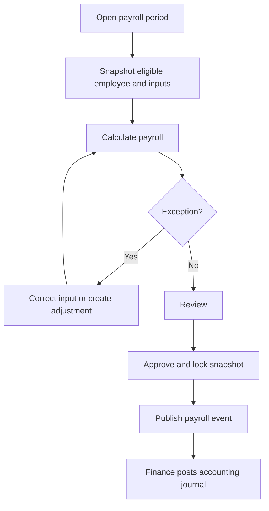

# Feature: Human Resource

> Source: derived from `docs/03-sad/19-module-hr.md`. Scope and use cases below are extracted directly from that document; no capability is added beyond what it specifies.

---

## Scope

# 1. Pendahuluan dan Ruang Lingkup

## 1.1 Overview

Human Resource (HR) mengelola siklus administratif tenaga kerja Parakita: data karyawan, jabatan dan penempatan, kontrak, jadwal kerja, absensi, cuti, lembur, komponen gaji, payroll, dokumen personal, dan riwayat perubahan kerja. Modul ini menyediakan data tenaga kerja yang konsisten bagi Authentication, Reservation, EMR, Finance, dan Reporting.

HR adalah system of record untuk profil dan status kerja karyawan serta hasil payroll. Authentication adalah pemilik kredensial dan role aplikasi; Finance adalah pemilik jurnal serta pembayaran keuangan; EMR adalah pemilik data klinis/layanan; Reporting adalah pemilik proyeksi laporan lintas domain.

## 1.2 Tujuan

- Menyediakan data karyawan yang lengkap, akurat, dan dibatasi oleh akses privasi.
- Mengelola penempatan, jadwal, kehadiran, cuti, dan lembur secara dapat diaudit.
- Menghasilkan payroll yang dapat direproduksi dari input yang telah disetujui.
- Menjaga pemisahan tugas antara penyusun, pemeriksa, approver, dan pembayar payroll.
- Mengirim payroll yang disetujui ke Finance tanpa melakukan posting jurnal langsung.
- Menyediakan laporan SDM dan payroll untuk manajemen.

## 1.3 In Scope

| Area | Cakupan |
|---|---|
| Employee | Identitas kerja, branch, department, position, status, user link, history |
| Employment | Kontrak, salary history, bank account reference, dokumen, effective dating |
| Schedule & attendance | Shift/jadwal, check-in/out, koreksi absensi, status harian |
| Leave & overtime | Pengajuan, approval, saldo/kuota cuti, lembur dan kompensasi |
| Payroll | Payroll period, komponen penghasilan/potongan, approval, payslip, lock |
| Integration | Event payroll ke Finance, availability/employee reference untuk modul lain |
| Reporting | Headcount, attendance, leave, overtime, payroll, turnover projection |

## 1.4 Out of Scope

- Login, password, MFA, dan pemberian role; milik Authentication/System.
- Pembayaran bank, jurnal payroll, pajak pelaporan eksternal, dan rekonsiliasi kas; milik Finance.
- Penjadwalan appointment pasien dan aturan antrian; milik Reservation/Queue.
- Rekam medis, produktivitas tindakan klinis terperinci, atau evaluasi clinical competency; milik EMR.
- Payroll tax engine nasional lengkap, integrasi BPJS/pajak/e-filing, biometric device, dan employee self-service mobile app; roadmap atau integrasi terpisah.

## 1.5 Prinsip Desain

1. **Privacy by design.** Data personal, gaji, rekening, dan dokumen hanya dapat diakses menurut kebutuhan jabatan.
2. **Effective-dated employment data.** Perubahan jabatan, salary, kontrak, branch, dan status tidak menimpa histori.
3. **Payroll is reproducible.** Hasil payroll menyimpan snapshot input/rule sehingga dapat diaudit ulang.
4. **Immutable after approval.** Payroll approved/posted tidak diedit; koreksi memakai payroll adjustment atau reversal cycle.
5. **Segregation of duties.** Creator tidak menyetujui payrollnya sendiri; HR tidak melakukan jurnal Finance.
6. **Branch-aware operation.** Employee assignment, schedule, attendance, payroll, dan laporan dibatasi branch yang authorised.
7. **Audit by default.** Semua perubahan sensitif, approval, export, dan akses data gaji dicatat.

---

---

## Use Cases / Functional Flow

# 4. Use Case dan Workflow

## 4.1 Actor Matrix

| Use case | HR Staff | HR Manager | Employee | Supervisor | Finance | Owner | Administrator |
|---|:---:|:---:|:---:|:---:|:---:|:---:|:---:|
| View self profile/schedule | | | ✔ | | | | ✔ |
| Manage employee/contract | ✔ | ✔ | | | | | ✔ |
| Manage salary/bank data | limited | ✔ | self limited | | read payout ref | | ✔ |
| Create schedule/attendance correction | ✔ | ✔ | self request | ✔ | | | ✔ |
| Submit leave/overtime | ✔ | ✔ | ✔ | ✔ | | | ✔ |
| Approve leave/overtime | | ✔ | | ✔ scope | | | ✔ |
| Calculate payroll | ✔ | ✔ | | | | | ✔ |
| Approve/lock payroll | | ✔ | | | | ✔ | ✔ |
| View/export payroll | limited | ✔ | own payslip | | controlled | ✔ | ✔ |

## 4.2 UC-HR-001 — Create and Activate Employee

1. HR Staff membuat employee draft dengan identitas kerja, branch, department, position, employment start date, dan status kontrak.
2. Sistem memvalidasi employee code, branch/position aktif, kontrak, dan duplikasi identitas yang dikonfigurasi.
3. HR Manager mereview data sensitif dan mengaktifkan employee.
4. Jika user account diperlukan, HR mengirim request/reference ke System; Authentication membuat user secara terpisah lalu mengembalikan user link.
5. Aktivasi menulis employee history dan event `hr.employee.activated.v1`.

## 4.3 UC-HR-002 — Create Schedule and Record Attendance

Schedule dapat dibuat manual atau batch untuk satu branch/shift. Sistem memeriksa employee active, konflik jadwal, dan room assignment optional. Check-in/out dapat direkam oleh authorised staff atau sumber device terintegrasi. Koreksi attendance setelah cutoff memerlukan reason dan approval; record original tetap tersedia pada audit trail.

## 4.4 UC-HR-003 — Leave Request

1. Employee atau HR membuat draft leave dengan type, rentang, reason, dan attachment jika diperlukan.
2. Saat submit, sistem menghitung hari/jam sesuai calendar dan memvalidasi quota, kontrak, schedule overlap, serta cutoff payroll.
3. Supervisor/HR Manager yang authorised approve atau reject.
4. Approval mengalokasikan quota, mengubah schedule terkait menjadi leave, dan menerbitkan notification/event.
5. Pembatalan approved leave setelah payroll lock menghasilkan adjustment request, bukan pembatalan diam-diam.

## 4.5 UC-HR-004 — Overtime Request

Employee/supervisor mengajukan overtime dengan interval kerja, alasan, dan sumber schedule/attendance. Sistem menolak interval invalid/overlap dan menghitung duration sesuai kebijakan break/rounding. Approver memutuskan request; only approved unlinked overtime menjadi kandidat payroll.

## 4.6 UC-HR-005 — Run Payroll

1. HR Staff membuka payroll period untuk branch, payroll type, start/end/cutoff date, dan rule version.
2. Sistem memilih employee eligible serta snapshot salary effective, attendance, approved leave/overtime, allowance, deduction, dan adjustment.
3. Sistem menghitung gross, deduction, net; error per employee dicatat tanpa memposting Finance.
4. HR Staff meninjau exception, membuat adjustment draft jika perlu, lalu mark `reviewed`.
5. HR Manager/Owner approve payroll. Sistem mengunci snapshot, membuat payslip, dan publish `hr.payroll.approved.v1` melalui outbox.
6. Finance memproses event menjadi jurnal/payable dan mengirim acknowledgement; HR menampilkan status integrasi tanpa membuat jurnal sendiri.

## 4.7 UC-HR-006 — Payroll Correction

Jika payroll sudah approved, HR tidak mengedit `PayrollItem` lama. HR membuat adjustment yang menaut ke period/payslip asal, memuat reason dan supporting evidence. Adjustment menjalani review/approval terpisah serta diterbitkan sebagai event Finance yang distinct. Reversal mengikuti pola counter payroll item sehingga histori net salary tetap dapat dijelaskan.

## 4.8 UC-HR-007 — Terminate Employee

HR Manager membuat termination effective date, reason, evidence, dan checklist. Sistem memeriksa schedule future, leave/overtime pending, payroll open, kontrak, user account request, dan handover. Setelah effective, employee tidak dapat dijadwalkan/diabsen normal; histori tetap read-only dan termination payment hanya melalui workflow policy yang authorised.

---

