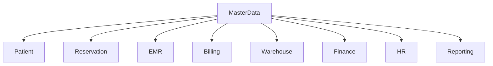

# Feature: Master Data

> Source: derived from `docs/03-sad/11-module-master-data.md`. Scope and use cases below are extracted directly from that document; no capability is added beyond what it specifies.

---

## Scope

# 3. Scope

Modul Master Data mencakup pengelolaan seluruh data referensi yang digunakan oleh modul lain.

## In Scope

- Data Klinik
- Data Cabang
- Data Departemen
- Data Ruangan
- Data Dental Chair
- Data Dokter
- Data Pegawai
- Data Spesialisasi
- Data Treatment
- Data Treatment Category
- Data Medicine
- Data Medical Item
- Data Consumable
- Data Supplier
- Data Insurance
- Data Payment Method
- Data Bank
- Data Tax
- Data Discount
- Data Promotion
- Data Diagnosis Reference
- Data Tooth Condition Reference
- Data Procedure Code
- Data Unit
- Data Currency
- Data Nationality
- Data Religion
- Data Occupation
- Data Education
- Data Wilayah (Provinsi, Kabupaten/Kota, Kecamatan, Kelurahan/Desa)
- Data Sumber Rujukan Pasien (Referral Source)

New this pass (task-285, `docs/06-tasks/task-285.md`): a full 4-level Indonesian administrative-region catalog (Province → Regency → District → Village, each FK'd to its parent), plus a small Referral Source catalog used by Patient (task-287). See `docs/03-sad/11-module-master-data.md` §8.5/§11.21–11.25.

---

## Out of Scope

Modul berikut tidak termasuk dalam Master Data:

- Patient
- Reservation
- Queue
- EMR
- Billing
- Finance
- Warehouse Transaction
- HR Transaction
- Reporting

Master Data hanya menyediakan data referensi yang digunakan oleh modul-modul tersebut.

---


---

## Use Cases / Functional Flow

## 10.1 Master Data Management Flow

```mermaid
flowchart LR

Administrator

-->

Authentication

-->

Master Data Module

-->

Validation

-->

Database

-->

Audit Trail

-->

Response
```

---

## 10.2 CRUD Workflow

```text
Login

↓

Select Master Data

↓

Search / Filter

↓

Create / Update

↓

Business Validation

↓

Save Database

↓

Audit Trail

↓

Success Response
```

---

## 10.3 Cross Module Usage



---

# Summary Part 1

Part 1 menjelaskan ruang lingkup, tujuan, tanggung jawab, dependency, katalog Master Data, hak akses pengguna, serta alur kerja tingkat tinggi dari Module Master Data.

Sebagai **Generic Domain**, modul ini menjadi **Single Source of Truth** untuk seluruh data referensi yang digunakan oleh modul Patient, Reservation, EMR, Billing, Finance, Warehouse, HR, Reporting, dan System. Implementasi modul ini mengikuti prinsip **Clean Architecture**, **Domain Driven Design (DDD)**, **Modular Monolith**, serta mendukung Audit Trail, Soft Delete, Import/Export, dan Role-Based Access Control (RBAC).

# Parakita Software Architecture Document (SAD)

