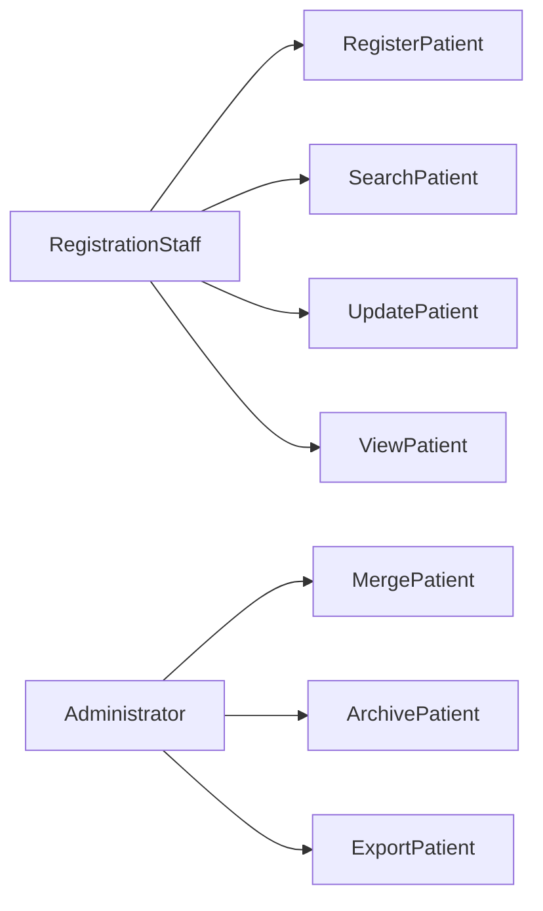

# Feature: Patient

> Source: derived from `docs/03-sad/12-module-patient.md`. Scope and use cases below are extracted directly from that document; no capability is added beyond what it specifies.

---

## Scope

# 2. Scope

Modul Patient mencakup seluruh proses administrasi data pasien sebelum pasien menjalani pelayanan medis.

## In Scope

- Registrasi pasien baru
- Update data pasien
- Pencarian pasien
- Detail pasien
- Riwayat kunjungan
- Riwayat reservasi
- Riwayat tindakan
- Riwayat pembayaran
- Upload foto pasien
- Pengelolaan kontak darurat
- Pengelolaan alamat pasien
- Merge data pasien (Administrator)
- Soft Delete pasien

---

## Out of Scope

Fitur berikut berada pada modul lain.

| Feature | Module |
|----------|--------|
| Appointment | Reservation |
| Queue Number | Queue |
| SOAP | EMR |
| Odontogram | EMR |
| Treatment | EMR |
| Invoice | Billing |
| Payment | Billing |
| Doctor Fee | Finance |

---

---

## Use Cases / Functional Flow

# 9. Use Cases

## 9.1 Overview

Modul Patient memiliki beberapa use case utama yang digunakan oleh petugas registrasi maupun administrator.

---

## 9.2 Use Case List

| Code | Use Case | Actor |
|------|----------|-------|
| UC-PAT-001 | Register Patient | Registration Staff |
| UC-PAT-002 | Search Patient | Registration Staff |
| UC-PAT-003 | View Patient Detail | Registration Staff |
| UC-PAT-004 | Update Patient | Registration Staff |
| UC-PAT-005 | Upload Patient Photo | Registration Staff |
| UC-PAT-006 | Manage Patient Address | Registration Staff |
| UC-PAT-007 | Manage Emergency Contact | Registration Staff |
| UC-PAT-008 | View Visit History | Registration Staff |
| UC-PAT-009 | View Reservation History | Registration Staff |
| UC-PAT-010 | Merge Duplicate Patient | Administrator |
| UC-PAT-011 | Archive Patient | Administrator |
| UC-PAT-012 | Export Patient List | Administrator |

---

## 9.3 Use Case Diagram

---

