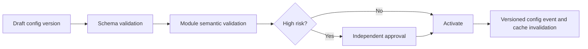

# Feature: System Administration

> Source: derived from `docs/03-sad/21-module-system.md`. Scope and use cases below are extracted directly from that document; no capability is added beyond what it specifies.

---

## Scope

# 1. Pendahuluan dan Ruang Lingkup

## 1.1 Overview

System Administration adalah fondasi lintas-modul Parakita untuk pengelolaan pengguna dan akses, parameter konfigurasi, menu, feature flag, template notifikasi, audit/activity log, attachment metadata, dan background-job governance. Semua domain bisnis bergantung pada kemampuan ini, tetapi tetap mempertahankan ownership atas transaksi masing-masing.

Blueprint membedakan Authentication & Authorization dari System Administration. Dokumen `10-authentication.md` tetap menjadi otoritas untuk password, JWT, refresh token, session, login, dan middleware autentikasi. Modul System mengelola provisioning/deactivation user, konfigurasi RBAC, scope branch, parameter, observability records, dan administrative controls tanpa melakukan bypass terhadap kebijakan Authentication.

## 1.2 Tujuan

- Mengelola user, role, permission, dan akses branch secara aman dan dapat diaudit.
- Menyediakan konfigurasi bertingkat yang tervalidasi, versioned, dan dapat dipulihkan.
- Menyediakan navigasi/menu dan feature flag tanpa menanam policy ke UI saja.
- Menyediakan notification, audit trail, activity log, attachment metadata, serta lifecycle background job.
- Mendukung operasi multi-clinic/multi-branch dengan least privilege dan deny by default.

## 1.3 In Scope

| Area | Cakupan |
|---|---|
| User administration | Provision, link employee, activate/deactivate, branch assignment, force logout request |
| RBAC administration | Role, permission catalog, role-permission, user-role, menu-permission mapping |
| System configuration | Parameter bertingkat, schema/value validation, version/history, effective scope |
| Feature and UI configuration | Feature flag, menu, menu permission, notification template |
| Shared services | Notification inbox, attachment metadata, activity/audit log, background job log |
| Operations | Job retry/cancel, configuration cache invalidation, health/status view, retention jobs |

## 1.4 Out of Scope

- Password hashing, login, MFA, JWT signing, refresh/session/token lifecycle, and account recovery protocol; Authentication owns these.
- Master business data such as patient, service, item, supplier, employee, invoice, journal, stock, or payroll.
- Authorization decision implementation inside a domain action; domain module tetap wajib memeriksa permission/resource ownership.
- Sending high-volume external messages directly from request thread; System creates notification requests/templates while worker/provider integration handles delivery.
- Infrastructure-as-code, secret-manager setup, SIEM, and network policy; deployment/security documents own these, though System exposes operational metadata.

## 1.5 Design Principles

1. **Deny by default.** Tidak ada permission/scope berarti tidak ada akses.
2. **Server-side enforcement.** Menu visibility is convenience; API/domain policy is the authority.
3. **Least privilege and branch isolation.** Scope berasal dari assignment server-side, bukan body client.
4. **Config is data, not arbitrary code.** Parameter and flags use typed schema; no executable expression/script.
5. **Effective dating and auditability.** Perubahan konfigurasi/RBAC bisa ditelusuri, diapprove, dan direstore.
6. **Immutable audit.** Log audit tidak dapat diedit oleh administrator biasa dan tidak boleh memakai soft delete rutin.
7. **Async side effects.** Notifikasi, cache invalidation broadcast, and job processing use durable outbox/queue.
8. **No secret disclosure.** Secrets are referenced from secret store and never returned/exported in clear text.

---

---

## Use Cases / Functional Flow

# 4. Use Case dan Workflow Administrasi

## 4.1 Actor Matrix

| Use case | Administrator | Security Admin | Clinic Manager | Owner | Module Manager | System Worker |
|---|:---:|:---:|:---:|:---:|:---:|:---:|
| View user/menu/config | ✔ | ✔ | scoped | ✔ | scoped | |
| Provision/deactivate user | ✔ | ✔ | request only | | | |
| Manage role/permission | | ✔ | | ✔ approval | | |
| Assign branch | ✔ | ✔ | scoped request | | | |
| Manage own module parameter | | ✔ | | | ✔ scoped | |
| Approve high-risk config | | ✔ | | ✔ | | |
| Manage template/flag | ✔ | ✔ | | ✔ approval | scoped | |
| View audit/job health | ✔ | ✔ | limited | ✔ | | ✔ service |
| Retry/cancel job | ✔ | ✔ | | | | ✔ service |

## 4.2 UC-SYS-001 — Provision User

1. Administrator selects employee (optional), username/email, initial branch assignments, and role(s).
2. System validates identifier uniqueness, employee eligibility, branch active status, role mappings, and maker-checker policy.
3. System creates user with `invited` or `active` state according to Authentication provisioning policy; it never stores a plain password in audit or response.
4. System emits `system.user-provisioned.v1`; Authentication creates/activates credential state through its own flow.
5. Successful completion logs audit/activity record and sends an invitation notification if configured.

## 4.3 UC-SYS-002 — Change Role or Branch Scope

1. Security Admin proposes role/permission or branch assignment change with reason and effective time.
2. System validates protected role, separation of duties, default branch, target branch status, and no self-escalation policy.
3. If approval is required, request remains pending; approver cannot be the maker.
4. On effective time, new assignment commits, permission cache is invalidated, and Authentication receives claim/session refresh request.
5. Audit record contains old/new mappings and correlation id.

## 4.4 UC-SYS-003 — Update System Parameter

1. Module Manager/Administrator creates proposed value in an owned namespace and scope.
2. Schema and module semantic validator run; secret values must be secret references.
3. High-risk changes require second approver and optionally scheduled effective time.
4. Activation writes immutable version, publishes `system.configuration.changed.v1`, and invalidates relevant cache.
5. Rollback creates another version using a previously validated value and records reason.

## 4.5 UC-SYS-004 — Manage Feature Flag

Feature flag creation requires key, owner module, target scope/audience, default safe state, effective period, and rollback plan. Flag evaluation is deterministic by server-side context. Enabling a flag exposes a capability only to users who already pass its API/domain permission. Critical flags have expiry/review date to avoid permanent hidden behavior.

## 4.6 UC-SYS-005 — Notification Template and Delivery

1. Administrator creates versioned template with channel, locale, variable schema, content classification, and preview data.
2. System validates variables/escaping and blocks unsafe content according to channel policy.
3. Domain module requests a notification with template key and approved payload; System renders and queues recipient-specific delivery.
4. Worker sends through provider adapter, records attempts/status, and emits delivery outcome event.
5. Failed transient sends retry idempotently; permanent failure is dead-lettered and visible to authorised staff.

## 4.7 UC-SYS-006 — Inspect Audit and Activity

Authorised user filters audit by date, module, branch, actor, target, action, correlation id, or outcome. Restricted values are redacted. Audit query/export itself produces an audit event. No UI/API permits update/delete of audit log.

## 4.8 UC-SYS-007 — Operate Background Job

Operations user views queue depth, attempts, safe error, and trace. Retry is allowed only for idempotent/retryable job types and retains the same idempotency key. Cancel is best effort: running job checks cancellation signal and any external side effect must use a compensation/idempotency protocol.

---

