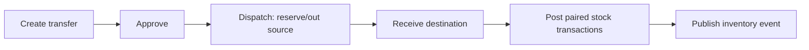

# Feature: Warehouse

> Source: derived from `docs/03-sad/18-module-warehouse.md`. Scope and use cases below are extracted directly from that document; no capability is added beyond what it specifies.

---

## Scope

# 1. Pendahuluan dan Ruang Lingkup

## 1.1 Overview

Warehouse mengelola persediaan barang medis dan nonmedis untuk seluruh cabang Parakita. Modul ini menangani pembelian, penerimaan, penyimpanan, penggunaan material, mutasi antar gudang/cabang, penyesuaian, stock opname, batch/masa kedaluwarsa, dan peringatan stok.

Warehouse adalah **system of record** untuk saldo stok dan riwayat pergerakannya. EMR tetap menjadi pemilik data klinis dan memicu konsumsi material; Billing menjadi pemilik tagihan; Finance menjadi pemilik jurnal keuangan. Warehouse tidak mengubah data dari ketiga modul tersebut.

## 1.2 Tujuan

- Menjamin saldo stok akurat, dapat ditelusuri, dan terisolasi per gudang serta cabang.
- Mengurangi stok otomatis untuk material yang dipakai pada tindakan medis yang final.
- Menyediakan proses purchase-to-receipt yang terkendali.
- Menghindari stok negatif, penggunaan batch kedaluwarsa, dan transaksi duplikat.
- Mendukung stock opname dan adjustment dengan approval serta audit trail.
- Menyediakan data inventory yang valid bagi operasional, Billing, Finance, dan Reporting.

## 1.3 In Scope

| Area | Cakupan |
|---|---|
| Master inventory | Item, kategori, unit, supplier, minimum stock, konfigurasi batch |
| Procurement | Purchase order, approval, penerimaan barang, retur pembelian |
| Stock ledger | Saldo per gudang/item/batch dan transaksi stok immutable |
| Clinical consumption | Pengurangan material dari EMR/treatment yang memenuhi syarat |
| Movement | Transfer gudang/cabang, issue, return, adjustment |
| Stock control | Reservation, stock opname, batch/expiry, low-stock alert |
| Reporting | Kartu stok, saldo, movement, purchase, expiry, opname, valuation projection |

## 1.4 Out of Scope

- Pembuatan tindakan klinis, resep, dan keputusan medis; milik EMR.
- Pembuatan invoice/penagihan pasien; milik Billing.
- Pembayaran supplier, buku besar, dan COGS resmi; milik Finance. Warehouse hanya mengirim event sumber.
- Perencanaan kebutuhan otomatis, integrasi vendor, barcode/RFID perangkat keras, dan inventory konsinyasi; roadmap kecuali dikonfigurasi kemudian.

## 1.5 Prinsip Desain

1. **Ledger-first.** Saldo stok merupakan proyeksi dari transaksi stok yang immutable.
2. **No negative stock.** Stok tersedia tidak boleh kurang dari nol, kecuali kebijakan emergency yang eksplisit, disetujui, dan diaudit.
3. **Source ownership.** Warehouse menerima referensi event dari modul lain dan tidak mengubah state sumber.
4. **Branch and warehouse isolation.** Semua saldo dan akses dibatasi oleh `branch_id` dan `warehouse_id`.
5. **FEFO for expiry-tracked items.** Batch yang kedaluwarsa paling dekat dipilih terlebih dahulu, kecuali pengguna berwenang memilih batch lain dengan alasan.
6. **Correction by counter transaction.** Transaksi stok yang sudah posted tidak diedit/dihapus; koreksi memakai retur, adjustment, atau reversal yang terhubung.
7. **Audit by default.** Approval, penerimaan, adjustment, opname, transfer, override batch, dan perubahan master dicatat.

---

---

## Use Cases / Functional Flow

# 4. Use Case dan Workflow

## 4.1 Actor Matrix

| Use case | Warehouse Staff | Warehouse Manager | Finance | Doctor/Nurse | Clinic Manager | Administrator |
|---|:---:|:---:|:---:|:---:|:---:|:---:|
| Lihat stok/kartu stok | ✔ | ✔ | ✔ | limited | ✔ | ✔ |
| Buat/submit PO | ✔ | ✔ | | | | ✔ |
| Approve/reject PO | | ✔ | | | ✔ | ✔ |
| Terima barang | ✔ | ✔ | | | | ✔ |
| Transfer/issue stock | ✔ | ✔ | | request via EMR | | ✔ |
| Adjustment/opname | ✔ | ✔ | | | | ✔ |
| Approve variance/adjustment | | ✔ | ✔ (financial threshold) | | ✔ | ✔ |
| Kelola item/warehouse | | ✔ | | | | ✔ |
| Export laporan | ✔ | ✔ | ✔ | | ✔ | ✔ |

## 4.2 UC-WHS-001 — Create and Approve Purchase Order

1. Warehouse Staff memilih branch, supplier aktif, warehouse tujuan, item aktif, quantity, unit price, dan expected date.
2. Sistem memvalidasi tidak ada duplicate draft PO supplier/reference dan menghitung total.
3. Staff submit PO; status menjadi `submitted`.
4. Warehouse Manager atau approver sesuai threshold memeriksa supplier, harga, quantity, dan justifikasi lalu approve/reject.
5. Hanya PO `approved`/`partially_received` dapat dipakai untuk goods receipt.

PO tidak menambah stok dan tidak otomatis membuat kewajiban Finance sebelum receipt diposting.

## 4.3 UC-WHS-002 — Receive Goods

1. Petugas memilih PO approved dan warehouse tujuan.
2. Untuk setiap line, masukkan quantity diterima, batch, expiry date, unit cost, dan evidence dokumen penerimaan bila diwajibkan.
3. Sistem menolak quantity nol/negatif, item tidak sesuai PO, batch invalid, atau over-receipt tanpa approval.
4. Posting receipt membuat `PURCHASE` stock transaction, memperbarui saldo/batch secara atomik, dan memperbarui quantity received PO.
5. Sistem menerbitkan `warehouse.goods-receipt.posted.v1` untuk Finance dan Reporting.

## 4.4 UC-WHS-003 — Consume Material from EMR

**Trigger:** EMR menerbitkan `TreatmentMaterialFinalized` setelah tindakan valid/final.

1. Handler memvalidasi event id, branch, visit/treatment, item, quantity, dan gudang sumber.
2. Sistem memilih batch FEFO atau memvalidasi batch yang diminta oleh EMR bila kebijakan mengizinkan.
3. Warehouse mengunci saldo, memastikan stok tersedia, lalu membuat transaksi `TREATMENT` out untuk setiap alokasi batch.
4. Sistem menyimpan inbox record dan mengirim hasil/event `warehouse.material-consumed.v1` secara atomik dengan transaksi.
5. Jika EMR membatalkan/reverse tindakan, event return membuat transaksi `RETURN` yang menaut ke konsumsi asal; batch asal diprioritaskan bila masih valid.

Kegagalan kekurangan stok tidak boleh mengubah EMR secara langsung. Warehouse mengirim status gagal yang dapat ditindaklanjuti melalui workflow klinis/operasional sesuai kebijakan.

## 4.5 UC-WHS-004 — Transfer Stock

Transfer mencakup `draft → submitted → approved → dispatched → received`. Saat dispatch, stok sumber menjadi reserved atau keluar sesuai konfigurasi; pada penerimaan, stok tujuan bertambah. Untuk transfer antar cabang, approval manager dan konfigurasi tujuan wajib tersedia. Tidak ada transfer ke gudang yang sama.

## 4.6 UC-WHS-005 — Stock Adjustment

Adjustment dipakai untuk barang rusak, hilang, expired, sample, koreksi administrasi, atau stock-in non-PO yang telah disetujui. User wajib memilih reason code, arah/quantity, tanggal, warehouse, item/batch, dan bukti untuk threshold yang berlaku. Adjustment baru posted setelah approval sesuai matriks; sistem membuat satu transaksi ledger dan event Finance bila konfigurasi valuation mengharuskannya.

## 4.7 UC-WHS-006 — Stock Opname

1. Warehouse Manager membuka opname untuk gudang/tanggal dan sistem mengambil snapshot saldo.
2. Petugas menghitung fisik; setiap line menyimpan physical count, batch, catatan, dan bukti jika perlu.
3. Saat submit, sistem menghitung variance tanpa mengubah saldo.
4. Approver mereview variance; line bermasalah dapat dikoreksi/dihitung ulang sebelum approval.
5. Approval menghasilkan transaksi `OPNAME` adjustment satu kali dan mengunci dokumen opname.

## 4.8 UC-WHS-007 — Reserve and Release Stock

Reservation opsional digunakan agar permintaan yang sah tidak direbut transaksi lain. Reservation menambah `reserved_stock` dan mengurangi `available_stock` tanpa mengurangi `current_stock`. Release atau expiration mengembalikan available stock. Konsumsi dari reservation harus memakai reference yang sama dan melepaskan reserve dalam transaksi atomik.

---

