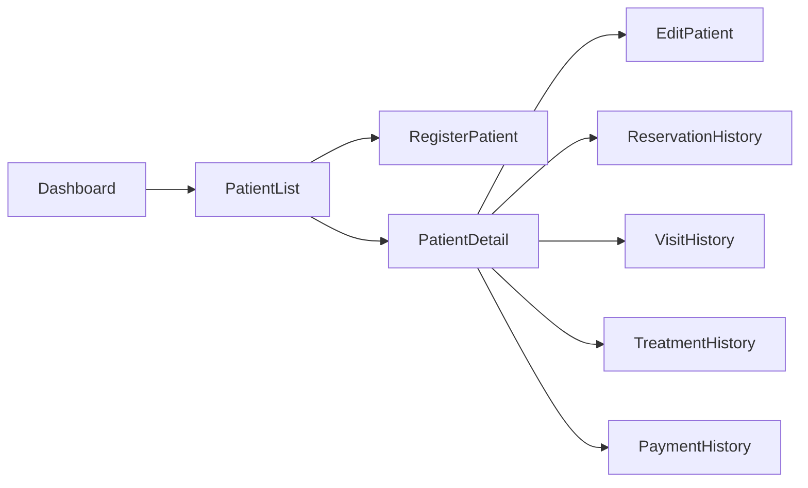

# Navigation

> Source: derived from `docs/03-sad/01-system-overview.md` (Section 3.1 Core Module list, Section 4/5 Stakeholders & Main Modules, Section 7 Business Capability Map), `docs/03-sad/21-module-system.md` (Section 2 — Menu aggregate, Section 6.2 — `/system/menus` API), and `docs/03-sad/12-module-patient.md` Section 13 (the one module with a fully specified navigation example).

---

# 1. Navigation Model

Navigation in Parakita is **not statically hardcoded** in the frontend. Per `docs/03-sad/21-module-system.md` Section 2, navigation is driven by a `Menu` domain aggregate (parent hierarchy, order, icon, route, and a menu-permission mapping) managed through the System Administration module (`GET/POST /system/menus`, `PATCH /system/menus/{menuId}/permissions`).

This means:

- Menu items are configurable, not fixed in frontend code.
- Menu visibility is a **convenience/UX concern only** — it is not a security boundary. API/domain authorization is enforced independently and remains the actual authority (see `docs/03-sad/21-module-system.md` line 59: "Menu visibility is convenience; API/domain policy is the authority").
- Route uniqueness and acyclic parent hierarchy are enforced server-side (`docs/03-sad/21-module-system.md` Section on Aggregate Invariants: "Menu | Parent hierarchy acyclic; route unique within active application scope").

---

# 2. Top-Level Information Architecture

The primary sidebar sections correspond one-to-one with the Core Modules defined in `docs/03-sad/01-system-overview.md` Section 3.1:

| Sidebar Section | Backing Module | Primary Roles (see `docs/03-sad/01-system-overview.md` Section 5) |
|---|---|---|
| Dashboard | Reporting & Dashboard | Owner, Clinic Manager |
| Patient | Patient | Registration Staff, Doctor, Nurse |
| Reservation | Reservation | Registration Staff, Clinic Manager |
| Queue | Queue | Registration Staff, Clinic Manager |
| EMR | EMR | Doctor, Nurse |
| Billing | Billing | Cashier |
| Finance | Finance | Finance Staff, Owner |
| Warehouse | Warehouse | Warehouse Staff |
| Human Resource | Human Resource | Human Resource, Clinic Manager |
| Reporting | Reporting & Dashboard | Owner, Clinic Manager |
| System Administration | System | Administrator |

Which sections a given logged-in user actually sees is resolved at runtime from their Role → Permission → Menu mapping (RBAC, see `docs/03-sad/02-system-architecture.md` Section 17).

---

# 3. Reference Navigation Pattern (Patient Module)

Only the Patient module currently has a fully specified navigation structure in the SAD. It is reproduced below as the pattern other modules' navigation should follow once they receive equivalent design specs (see Section 4 below for what's missing).

# 13. Navigation Structure

## Sidebar Navigation

```text
Patient Management
│
├── Patient List
├── Register Patient
├── Archived Patient
└── Reports (Future)
```

---

## Navigation Flow



---

# Summary Part 2

Part 2 mendefinisikan kebutuhan fungsional Modul Patient, meliputi daftar fitur, use case, hak akses pengguna, workflow bisnis, rancangan halaman antarmuka, dan struktur navigasi. Dokumen ini menjadi acuan implementasi Frontend dan Backend agar seluruh proses pengelolaan pasien berjalan konsisten sesuai prinsip **Clean Architecture**, **Domain Driven Design (DDD)**, **RBAC**, dan **Modular Monolith**.

# Parakita Software Design Document (SDD)

# 12 - Module Patient (Part 3)

| Document Information | |
|----------------------|----------------------------------------------|
| Project | Parakita - Dental Clinic Management System |
| Document | 12 - Module Patient |
| Part | 3 of 5 |
| Version | 1.0.0 |
| Status | Draft |
| Document Type | Module Design Document |
| Architecture | Clean Architecture + Modular Monolith |
| Last Updated | July 2026 |

---

# Table of Contents (Part 3)

14. Domain Model
15. Entity Relationship
16. Data Validation Rules
17. Application Services / Use Cases
18. Repository Interfaces
19. Domain Events

---

# 14. Domain Model

## 14.1 Overview

Patient merupakan **Aggregate Root** pada bounded context **Patient**.

Seluruh perubahan data pasien harus dilakukan melalui Aggregate ini agar seluruh business rule tetap konsisten.

---

## 14.2 Aggregate Structure


---

# 4. Navigation Structure — Remaining Modules (Resolved)

> Status: **proposed design**, not extracted from the SAD (which only specifies Patient's navigation — see §3). Each tree below is derived from that module's `docs/01-prd/features/<module>.md` use-case list and `docs/02-design/pages/<module>.md`. Mark this whole section as design output, not architecture, if referenced from code.

```text
Master Data
├── Data Klinik & Cabang
├── Departemen & Ruangan
├── Dokter & Pegawai
├── Treatment & Treatment Category
├── Medicine / Medical Item / Consumable
├── Supplier & Insurance
└── Payment Method / Tax / Discount / Promotion

Reservation
├── Reservation List
├── Create Reservation
├── Doctor Schedule / Availability
├── Reservation Timeline
└── Reservation History

Queue
├── Queue Dashboard (board)
├── Check-in
└── Queue History

EMR
├── Visit (active)
├── Odontogram
├── SOAP Note
├── Treatment Plan & Procedure
├── Prescription
├── Clinical Attachment / X-Ray
└── Clinical Timeline

Billing
├── Invoice List
├── Generate Invoice
├── Payment
├── Discount / Insurance
└── Refund / Void

Finance
├── General Ledger
├── Cash & Bank (Daily Closing)
├── Expense
├── Doctor Fee Settlement
└── Financial Period

Warehouse
├── Stock Balance / Stock Card
├── Purchase Order
├── Goods Receipt
├── Stock Transfer
├── Stock Adjustment
└── Stock Opname

Human Resource
├── Employee List
├── Schedule & Attendance
├── Leave & Overtime
├── Payroll Run
└── Payroll Register (Reports)

Reporting
├── Executive Dashboard
├── Operational Reports
├── Financial Reports
├── Inventory Reports
├── HR Reports
└── Clinical & Quality Reports

System Administration
├── User Administration
├── Role & Permission
├── Menu & Feature Flag
├── System Parameter
├── Notification Template
└── Audit / Activity Log
```

Each top-level item above maps 1:1 to the "Sidebar Section" rows in §2; sub-items are proposed screens pending confirmation, not yet reflected in a Figma frame per module (see `figma-links.md`).
