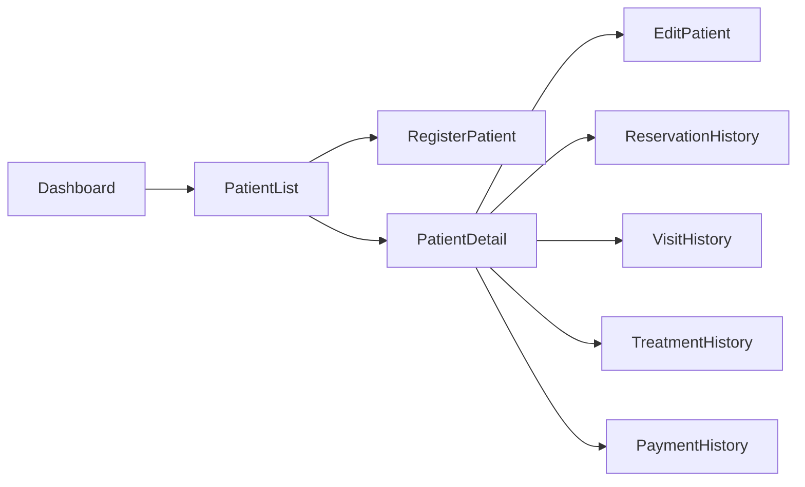

# Navigation

> Source: derived from `docs/03-sad/01-system-overview.md` (Section 3.1 Core Module list, Section 4/5 Stakeholders & Main Modules, Section 7 Business Capability Map), `docs/03-sad/21-module-system.md` (Section 2 — Menu aggregate, Section 6.2 — `/system/menus` API), and `docs/03-sad/12-module-patient.md` Section 13 (the one module with a fully specified navigation example).

---

# 1. Navigation Model

Navigation in Parakita is **not statically hardcoded** in the frontend. Per `docs/03-sad/21-module-system.md` Section 2, navigation is driven by a `Menu` domain aggregate (parent hierarchy, order, icon, route, and a menu-permission mapping) managed through the System Administration module (`GET/POST /system/menus`, `PATCH /system/menus/{menuId}/permissions`).

This means:

- Menu items are configurable, not fixed in frontend code.
- Menu visibility is a **convenience/UX concern only** — it is not a security boundary. API/domain authorization is enforced independently and remains the actual authority (see `docs/03-sad/21-module-system.md` line 59: "Menu visibility is convenience; API/domain policy is the authority").
- Route uniqueness and acyclic parent hierarchy are enforced server-side (`docs/03-sad/21-module-system.md` Section on Aggregate Invariants: "Menu | Parent hierarchy acyclic; route unique within active application scope").

---

# 2. Top-Level Information Architecture

The primary sidebar sections correspond one-to-one with the Core Modules defined in `docs/03-sad/01-system-overview.md` Section 3.1:

| Sidebar Section | Backing Module | Primary Roles (see `docs/03-sad/01-system-overview.md` Section 5) |
|---|---|---|
| Dashboard | Reporting & Dashboard | Owner, Clinic Manager |
| Patient | Patient | Registration Staff, Doctor, Nurse |
| Reservation | Reservation | Registration Staff, Clinic Manager |
| Queue | Queue | Registration Staff, Clinic Manager |
| EMR | EMR | Doctor, Nurse |
| Billing | Billing | Cashier |
| Finance | Finance | Finance Staff, Owner |
| Warehouse | Warehouse | Warehouse Staff |
| Human Resource | Human Resource | Human Resource, Clinic Manager |
| Reporting | Reporting & Dashboard | Owner, Clinic Manager |
| System Administration | System | Administrator |

Which sections a given logged-in user actually sees is resolved at runtime from their Role → Permission → Menu mapping (RBAC, see `docs/03-sad/02-system-architecture.md` Section 17).

**Note (added during the module-by-module redesign pass):** the "Primary Roles" column above is a coarse, sidebar-visibility-level list, not an exhaustive role catalog — several modules' own RBAC sections define finer-grained roles this table doesn't mention: Finance has a separate **Finance Manager** role distinct from Finance Staff (`finance.md` §12, segregation-of-duties gated); HR's Actor Matrix (`hr.md` §6, sourced verbatim from `docs/03-sad/19-module-hr.md` §4.1) has **HR Manager**, **Employee** (self-service), and **Supervisor** (scope-limited approval) alongside HR Staff. Do not treat this table as the full role list when implementing a specific module's permission checks — use that module's own page spec instead.

---

# 3. Reference Navigation Pattern (Patient Module)

Only the Patient module currently has a fully specified navigation structure in the SAD. It is reproduced below as the pattern other modules' navigation should follow once they receive equivalent design specs (see Section 4 below for what's missing).

# 13. Navigation Structure

## Sidebar Navigation

```text
Patient Management
│
├── Patient List
├── Register Patient
├── Archived Patient
└── Reports (Future)
```

---

## Navigation Flow



---

# Summary Part 2

Part 2 mendefinisikan kebutuhan fungsional Modul Patient, meliputi daftar fitur, use case, hak akses pengguna, workflow bisnis, rancangan halaman antarmuka, dan struktur navigasi. Dokumen ini menjadi acuan implementasi Frontend dan Backend agar seluruh proses pengelolaan pasien berjalan konsisten sesuai prinsip **Clean Architecture**, **Domain Driven Design (DDD)**, **RBAC**, dan **Modular Monolith**.

# Parakita Software Design Document (SDD)

# 12 - Module Patient (Part 3)

| Document Information | |
|----------------------|----------------------------------------------|
| Project | Parakita - Dental Clinic Management System |
| Document | 12 - Module Patient |
| Part | 3 of 5 |
| Version | 1.0.0 |
| Status | Draft |
| Document Type | Module Design Document |
| Architecture | Clean Architecture + Modular Monolith |
| Last Updated | July 2026 |

---

# Table of Contents (Part 3)

14. Domain Model
15. Entity Relationship
16. Data Validation Rules
17. Application Services / Use Cases
18. Repository Interfaces
19. Domain Events

---

# 14. Domain Model

## 14.1 Overview

Patient merupakan **Aggregate Root** pada bounded context **Patient**.

Seluruh perubahan data pasien harus dilakukan melalui Aggregate ini agar seluruh business rule tetap konsisten.

---

## 14.2 Aggregate Structure


---

# 4. Navigation Structure — Remaining Modules (Resolved)

> Status: **proposed design**, not extracted from the SAD (which only specifies Patient's navigation — see §3). Each tree below is derived from that module's `docs/01-prd/features/<module>.md` use-case list and `docs/02-design/pages/<module>.md`. Mark this whole section as design output, not architecture, if referenced from code.

```text
Master Data (CONFIRMED — verified against apps/frontend/config/navigation.ts;
see docs/02-design/pages/master-data.md §7. Flat list, not grouped by SAD §8's
4 catalog groups, because only 7 of 28 catalogs are shipped so far — 21 remain
unbuilt, tracked in master-data.md §1.2.)
├── Clinics
├── Branches
├── Doctors
├── Treatment Categories
├── Treatments
├── Payment Methods
├── Tooth Conditions
└── Consent Templates (EMR-owned, permission-gated on emr.consent-template.*
    not masterdata.* — UI-colocated here, not a Master Data catalog)

Reservation (CONFIRMED — verified against apps/frontend/config/navigation.ts;
see docs/02-design/pages/reservation.md §7. Create Reservation, Detail, and
Reschedule/Cancel are reached from within List/Detail, not top-level sidebar
items — Doctor Schedule and Time Slot Selection are inline pickers, not
standalone screens; Reservation History lives under Patient Detail, not here.)
├── List
└── Analytics

Queue (CONFIRMED — verified against apps/frontend/config/navigation.ts;
see docs/02-design/pages/queue.md §7. Single flat link, no sub-items —
Dashboard is an in-page button, not a sidebar entry; "history" is a status
filter on the same board, not a separate screen.)
└── Queue (board/list, view mode set by status filter)

EMR (CONFIRMED, and structurally different from every other module's tree:
NOT a sidebar section at all — no standalone EMR entry exists in
apps/frontend/config/navigation.ts, by design, since there is no Visit List
endpoint. The items below are tabs within one Visit Workspace page
(/emr/visits/{id}), reached only via Queue's "Open Visit" action on a
CALLED entry. See docs/02-design/pages/emr.md §1-§2, §9.)
Visit Workspace tabs: Vital Signs · SOAP Note · Diagnosis · Treatment ·
Medical History · Allergy · Odontogram · Treatment Plan · Periodontal ·
Referral · Follow Up · Attachments · Prescription · Consent · Medical
Certificate
(Clinical Timeline is NOT one of these tabs -- it lives under Patient
Detail instead, see patient.md §12.2 and emr.md §4.)

Billing (CONFIRMED -- verified against apps/frontend/config/navigation.ts;
see docs/02-design/pages/billing.md §1, §6. Flat single link, no sub-items.
Generate Invoice/Payment/Discount/Insurance/Refund/Void below the old tree
mostly do not exist as shipped UI -- Payment is a modal reached from
Invoice Detail, not a sidebar item; Discount/Insurance/Refund/Void have no
shipped UI at all, see billing.md §1's gap list.)
└── Billing (invoice list; detail reached per-row)

Finance (proposed -- no frontend shipped yet, backend fully built and
tested. See docs/02-design/pages/finance.md, sourced from the real
backend route/permission surface, not just SAD prose. Tree revised this
pass to match all 9 functional areas the backend actually exposes.)
├── Chart of Accounts
├── Journal
├── Financial Period
├── Cash & Bank Accounts
├── Cash Transfer
├── Daily Cash Closing
├── Expense
├── Doctor Fee Settlement
├── Account Mappings
└── Financial Reports

Warehouse (proposed -- no frontend shipped yet, backend fully built and
tested. See docs/02-design/pages/warehouse.md, sourced from the real
backend route/permission surface. Tree revised this pass to add the 4
areas the old tree omitted: Item/Supplier/Location catalogs, Reservation,
Batch, and Reports as its own group.)
├── Item / Supplier / Warehouse Location (catalogs)
├── Stock Balance & Ledger
├── Purchase Order
├── Goods Receipt
├── Stock Transfer
├── Stock Adjustment
├── Stock Reservation
├── Stock Opname
├── Batch
└── Reports (Stock Card / Balance / Movements / Purchases / Expiry / Opnames)

Reporting (proposed -- no frontend shipped yet, backend fully built and
tested. See docs/02-design/pages/reporting.md. Real architecture is 5
fixed dashboards + a separate generic report-catalog/job system, not 6
category pages -- there is no HR dashboard route, consistent with HR
having no backend at all.)
├── Dashboards
│   ├── Executive
│   ├── Operations
│   ├── Clinical
│   ├── Finance
│   └── Warehouse
└── Reports (catalog -> on-demand or async job -> snapshot/export)

Human Resource (fully proposed -- no backend or frontend exists at all,
the only such module in this project. See docs/02-design/pages/hr.md.)
├── Employee List
├── Schedule & Attendance
├── Leave & Overtime
├── Payroll Run
└── Payroll Register (Reports)

System Administration (PARTIALLY CONFIRMED -- verified against
apps/frontend/config/navigation.ts; see docs/02-design/pages/system.md
§1, §7. Only the first 2 items below are shipped; the rest have backend
from later Phase 3 epics but no frontend yet.)
├── Users [CONFIRMED]
├── Roles [CONFIRMED]
├── Menu & Feature Flag [proposed, no shipped UI]
├── System Parameter [proposed, no shipped UI]
├── Notification Template [proposed, no shipped UI]
└── Audit / Activity Log [proposed, no shipped UI]
```

Each top-level item above maps 1:1 to the "Sidebar Section" rows in §2. Master Data is now **confirmed** (verified against shipped code, see above); the remaining sections' sub-items are still proposed screens pending confirmation, not yet reflected in a Figma frame per module (see `figma-links.md`).
