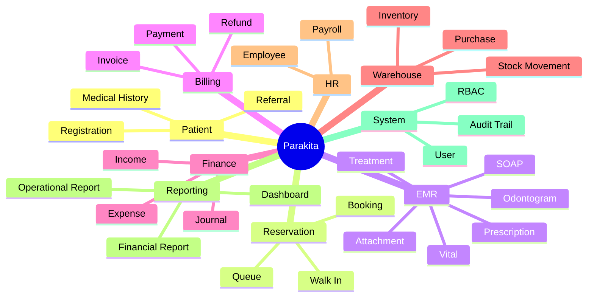
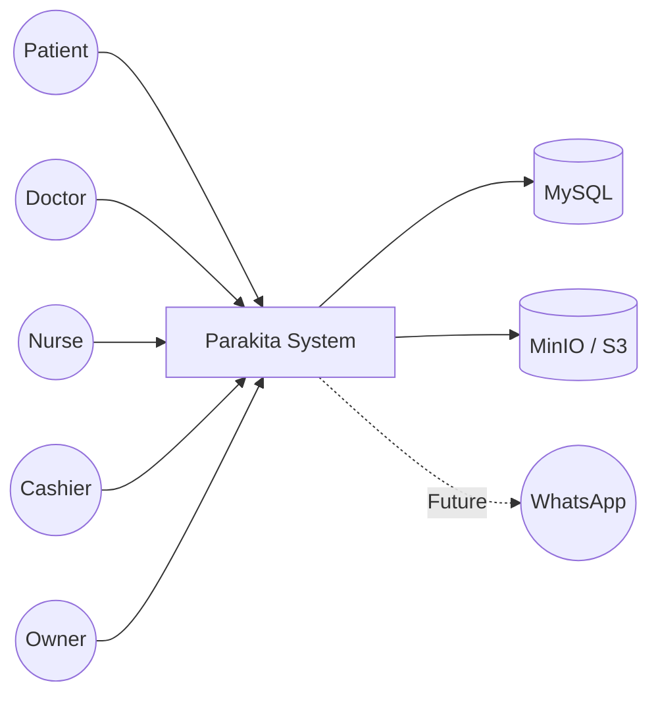
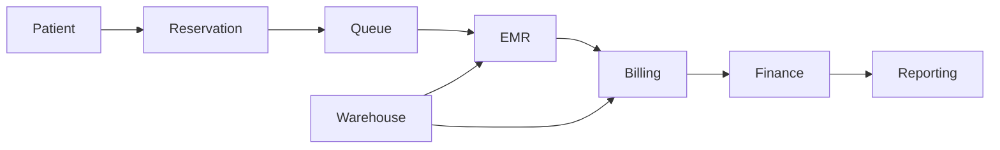
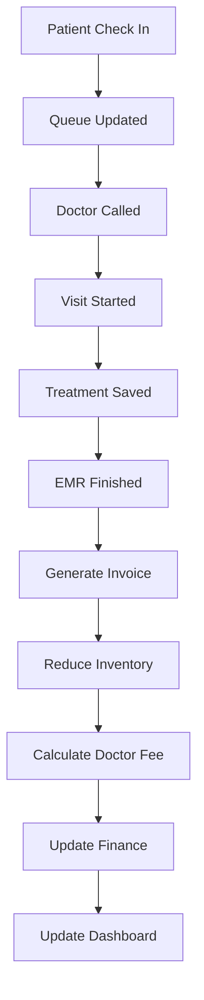
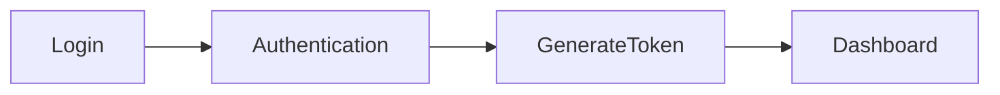
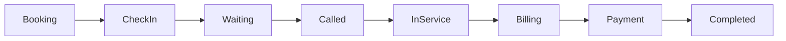
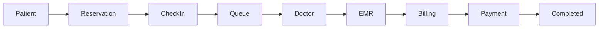

# Parakita Software Architecture Document (SAD)

# 01 - System Overview

---

| Document Information | |
|----------------------|------------------------------------------------|
| Project Name | Parakita - Dental Clinic Management System |
| Document | 01 - System Overview |
| Version | 1.0.0 |
| Status | Draft |
| Document Type | Software Architecture Document (SAD) |
| Architecture Style | Clean Architecture + Modular Monolith |
| Target Platform | Web Application |
| Frontend | Next.js + TypeScript |
| Backend | Express.js + TypeScript |
| Database | MySQL |
| Storage | Amazon S3 / MinIO |
| Prepared By | Solution Architecture Team |
| Reviewed By | - |
| Approved By | - |
| Last Updated | July 2026 |

---

# Document History

| Version | Date | Author | Description |
|----------|------------|----------------------|--------------------------------|
| 1.0.0 | July 2026 | Architecture Team | Initial Draft |

---

# Distribution List

Dokumen ini digunakan sebagai acuan utama oleh seluruh tim pengembangan.

| Role | Purpose |
|------|---------|
| Product Owner | Business Reference |
| Project Manager | Project Planning |
| Solution Architect | Architecture Reference |
| Backend Developer | System Development |
| Frontend Developer | UI Development |
| UI/UX Designer | Business Flow |
| QA Engineer | Test Scenario |
| DevOps Engineer | Infrastructure Planning |
| Management | Executive Overview |

---

# Table of Contents

1. Executive Summary
2. Business Goals
3. Business Scope

> Dokumen ini merupakan Volume 1 dari Blueprint Parakita.

---

# 1. Executive Summary

## 1.1 Background

Parakita merupakan sistem informasi manajemen klinik gigi yang dirancang untuk mengintegrasikan seluruh proses operasional klinik ke dalam satu platform yang modern, terstandarisasi, dan mudah dikembangkan.

Sebagian besar klinik gigi masih mengelola proses bisnis menggunakan kombinasi aplikasi sederhana, spreadsheet, maupun pencatatan manual sehingga menyebabkan:

- Data pasien tidak terpusat.
- Rekam medis sulit ditelusuri.
- Proses reservasi tidak terdokumentasi dengan baik.
- Tidak tersedia informasi waktu tunggu pasien.
- Sulit melakukan evaluasi performa dokter maupun operasional klinik.
- Perhitungan jasa dokter dilakukan secara manual.
- Penggunaan bahan medis tidak terhubung dengan tindakan.
- Laporan operasional membutuhkan proses rekap manual.

Parakita dikembangkan untuk mengatasi permasalahan tersebut melalui sistem yang terintegrasi mulai dari registrasi pasien hingga pelaporan manajemen.

---

## 1.2 Vision

Menjadi platform manajemen klinik gigi modern yang mampu mendukung operasional klinik secara digital, terintegrasi, aman, dan skalabel untuk kebutuhan klinik tunggal maupun jaringan multi-cabang.

---

## 1.3 Mission

Parakita dikembangkan dengan misi sebagai berikut:

- Meningkatkan kualitas pelayanan pasien.
- Mendigitalisasi seluruh proses operasional klinik.
- Menyediakan Electronic Medical Record (EMR) yang lengkap.
- Mengotomatisasi proses administrasi dan keuangan.
- Menyediakan dashboard operasional berbasis data.
- Mendukung pengembangan menuju ekosistem digital kesehatan.

---

## 1.4 Business Value

Implementasi Parakita diharapkan memberikan manfaat berikut.

### Operational Efficiency

- Mengurangi proses administrasi manual.
- Mempercepat proses registrasi pasien.
- Mengurangi duplikasi data.

### Clinical Excellence

- Rekam medis terdokumentasi dengan baik.
- Riwayat tindakan pasien mudah ditelusuri.
- Mendukung penggunaan Odontogram digital.

### Financial Transparency

- Perhitungan invoice otomatis.
- Perhitungan jasa dokter otomatis.
- Audit transaksi lebih mudah.

### Inventory Control

- Penggunaan bahan medis tercatat otomatis.
- Monitoring stok secara real-time.
- Mengurangi kehilangan stok.

### Management Insight

- Dashboard KPI operasional.
- Laporan keuangan.
- Laporan produktivitas dokter.
- Analisis performa klinik.

---

# 2. Business Goals

Parakita dibangun untuk mencapai tujuan strategis berikut.

## 2.1 Operational Goals

- Digitalisasi proses bisnis klinik.
- Mengurangi penggunaan dokumen fisik.
- Mengurangi human error.
- Meningkatkan efisiensi operasional.

---

## 2.2 Clinical Goals

- Menyediakan Electronic Medical Record (EMR).
- Menyediakan Odontogram interaktif.
- Mendukung pencatatan SOAP.
- Menyediakan riwayat tindakan per gigi.

---

## 2.3 Financial Goals

- Otomatisasi Billing.
- Otomatisasi Payment.
- Perhitungan jasa dokter.
- Monitoring pendapatan.
- Monitoring biaya operasional.

---

## 2.4 Operational KPI

Sistem dirancang untuk membantu pencapaian indikator berikut.

| KPI | Target |
|------|---------|
| Average Waiting Time | < 15 menit |
| Average Registration Time | < 5 menit |
| Average Doctor Service Time | Sesuai jenis tindakan |
| Invoice Accuracy | 100% |
| Inventory Accuracy | > 99% |
| Data Availability | 99.9% |

---

# 3. Business Scope

## 3.1 In Scope

Versi pertama Parakita mencakup modul berikut.

### Core Module

- Authentication
- Master Data
- Patient Management
- Reservation
- Queue Management
- Electronic Medical Record (EMR)
- Billing
- Finance
- Warehouse
- Human Resource
- Reporting
- System Administration

---

### Cross Module Features

- Audit Trail
- Activity Log
- Reservation Timeline
- Service Time Tracking
- Interactive Odontogram
- Doctor Discount
- Attachment Management
- Dashboard KPI

---

## 3.2 Out of Scope

Fitur berikut belum termasuk dalam implementasi awal.

- Telemedicine
- Video Consultation
- Marketplace Obat
- Integrasi BPJS
- Payment Gateway
- Mobile Application
- AI Diagnosis
- Business Intelligence

---

## 3.3 Future Scope

Pengembangan jangka panjang meliputi:

- Multi Branch Consolidation
- WhatsApp Integration
- Digital Signature
- e-Prescription
- AI Assisted Diagnosis
- Business Intelligence
- Mobile Doctor Application
- Mobile Patient Application
- Insurance Integration
- Data Warehouse
- Microservices Migration

---

## 3.4 Business Principles

Seluruh pengembangan Parakita mengikuti prinsip berikut.

1. Patient First
2. Digital by Default
3. Paperless Workflow
4. Security by Design
5. Auditability
6. Scalability
7. Maintainability
8. Modular Development
9. Data Driven Decision
10. Cloud Ready

---


# 4. Stakeholders

## 4.1 Stakeholder Overview

Parakita dirancang untuk digunakan oleh berbagai pihak yang terlibat dalam operasional klinik gigi. Setiap stakeholder memiliki kebutuhan, tanggung jawab, serta hak akses yang berbeda sesuai dengan perannya.

| Stakeholder | Primary Responsibility | Main Module |
|--------------|-----------------------|------------|
| Owner | Monitoring bisnis dan pengambilan keputusan | Dashboard, Finance, Reporting |
| Clinic Manager | Mengelola operasional harian klinik | Dashboard, Reservation, HR |
| Administrator | Mengelola konfigurasi sistem | System Administration |
| Registration Staff | Registrasi pasien dan reservasi | Patient, Reservation |
| Doctor | Pemeriksaan pasien dan EMR | EMR |
| Nurse | Membantu dokter selama tindakan | EMR |
| Cashier | Pembayaran dan invoice | Billing |
| Warehouse Staff | Pengelolaan stok | Warehouse |
| Finance Staff | Keuangan | Finance |
| Human Resource | SDM dan Payroll | HR |
| Patient | Penerima layanan | Reservation (Future Portal) |

---

## 4.2 Stakeholder Interaction

```text
                  Owner
                     │
             Clinic Manager
                     │
 ┌──────────┬────────┼────────┬──────────┐
 │          │        │        │          │
Admin   Registration Doctor  Cashier  Warehouse
 │          │        │        │          │
 └──────────┴────────┼────────┴──────────┘
                     │
                  Parakita
                     │
                  Database
```

---

# 5. User Roles & Responsibilities

## 5.1 Overview

Parakita menerapkan **Role Based Access Control (RBAC)** sehingga setiap pengguna hanya dapat mengakses fitur sesuai dengan perannya.

Hak akses dikontrol melalui:

- Role
- Permission
- Menu
- API Permission
- Action Permission

---

## 5.2 Owner

### Purpose

Memantau seluruh aktivitas klinik dan mengambil keputusan bisnis.

### Responsibilities

- Melihat Dashboard
- Melihat Laporan Pendapatan
- Melihat KPI Klinik
- Approval tertentu
- Monitoring seluruh cabang

### Main Modules

- Dashboard
- Reporting
- Finance

---

## 5.3 Clinic Manager

### Responsibilities

- Monitoring Operasional
- Monitoring Reservasi
- Monitoring Dokter
- Monitoring SDM
- Monitoring Antrian

### Main Modules

- Reservation
- Queue
- Dashboard
- HR

---

## 5.4 Administrator

### Responsibilities

- Mengelola User
- Mengelola Role
- Mengelola Permission
- Konfigurasi Sistem
- Master Data

### Main Modules

- System
- Master Data

---

## 5.5 Registration Staff

### Responsibilities

- Registrasi Pasien Baru
- Update Data Pasien
- Membuat Reservasi
- Check In Pasien
- Mengelola Antrian

### Main Modules

- Patient
- Reservation
- Queue

---

## 5.6 Doctor

Dokter merupakan pengguna utama sistem.

### Responsibilities

- Membuka Visit
- Input Vital (opsional)
- Mengisi SOAP
- Memilih Posisi Gigi (Odontogram)
- Menentukan Diagnosis
- Menambahkan Treatment
- Menambahkan Attachment
- Memberikan Doctor Discount
- Menutup Visit

### Main Modules

- EMR

---

## 5.7 Nurse

### Responsibilities

- Input Vital
- Membantu tindakan dokter
- Input penggunaan bahan
- Melengkapi catatan tindakan

### Main Modules

- EMR

---

## 5.8 Cashier

### Responsibilities

- Generate Invoice
- Payment
- Refund
- Discount
- Closing Kasir

### Main Modules

- Billing
- Finance

---

## 5.9 Warehouse Staff

### Responsibilities

- Purchase
- Stock In
- Stock Out
- Stock Adjustment
- Stock Opname

### Main Modules

- Warehouse

---

## 5.10 Finance Staff

### Responsibilities

- Journal
- Income
- Expense
- Cash Flow
- Financial Report

### Main Modules

- Finance

---

## 5.11 Human Resource

### Responsibilities

- Employee
- Attendance
- Leave
- Overtime
- Payroll

### Main Modules

- HR

---

# 6. Responsibility Matrix (RACI)

| Activity | Owner | Manager | Admin | Doctor | Nurse | Cashier |
|-----------|-------|---------|--------|---------|--------|----------|
| Master Data | A | C | R | - | - | - |
| Registration | I | C | C | - | - | - |
| Reservation | I | A | C | - | - | - |
| EMR | I | C | - | R | C | - |
| Billing | I | C | - | - | - | R |
| Finance | A | C | - | - | - | R |
| Reporting | A | R | - | - | - | - |

Keterangan:

- **R** = Responsible
- **A** = Accountable
- **C** = Consulted
- **I** = Informed

---

# 7. Business Capability Map

Business Capability menggambarkan kemampuan utama sistem Parakita dalam mendukung proses bisnis klinik.

```text
Clinic Management
│
├── Patient Management
│   ├── Patient Registration
│   ├── Medical History
│   └── Referral
│
├── Reservation Management
│   ├── Booking
│   ├── Walk In
│   ├── Queue
│   └── Check In
│
├── Medical Services
│   ├── Visit
│   ├── SOAP
│   ├── Odontogram
│   ├── Treatment
│   ├── Prescription
│   └── Attachment
│
├── Billing
│   ├── Invoice
│   ├── Payment
│   ├── Refund
│   └── Deposit
│
├── Finance
│   ├── Income
│   ├── Expense
│   ├── Journal
│   └── Closing
│
├── Warehouse
│   ├── Inventory
│   ├── Purchase
│   ├── Stock Movement
│   └── Stock Opname
│
├── Human Resource
│   ├── Employee
│   ├── Attendance
│   ├── Leave
│   └── Payroll
│
├── Reporting
│   ├── Operational Report
│   ├── Financial Report
│   ├── Medical Report
│   └── Dashboard
│
└── System Administration
    ├── User
    ├── Role
    ├── Permission
    ├── Audit Trail
    └── System Parameter
```

---

## 7.1 Business Capability Diagram (Mermaid)



---

# 8. Architecture Vision

## 8.1 Overview

Parakita dibangun sebagai platform manajemen klinik gigi modern yang mengintegrasikan seluruh proses bisnis klinik ke dalam satu sistem yang terpusat, aman, modular, dan mudah dikembangkan.

Arsitektur sistem dirancang untuk memenuhi kebutuhan klinik saat ini sekaligus memberikan fondasi yang kuat untuk pengembangan jangka panjang, termasuk ekspansi multi-cabang, integrasi dengan layanan eksternal, serta migrasi menuju arsitektur Microservices apabila diperlukan.

Blueprint ini mengadopsi pendekatan **Domain Driven Design (DDD)**, **Clean Architecture**, dan **Modular Monolith** sehingga setiap domain bisnis memiliki batas tanggung jawab (Bounded Context) yang jelas.

---

## 8.2 Architecture Goals

Arsitektur Parakita memiliki tujuan utama sebagai berikut.

### Maintainability

Kode mudah dipelihara dan dikembangkan oleh banyak developer.

### Scalability

Mampu berkembang dari satu klinik menjadi jaringan multi-cabang.

### Reliability

Menjamin konsistensi data transaksi klinik.

### Security

Melindungi seluruh data pasien sesuai prinsip keamanan aplikasi modern.

### Extensibility

Mudah menambahkan modul baru tanpa mengubah modul yang telah berjalan.

### Performance

Mampu melayani banyak pengguna secara bersamaan dengan waktu respon yang tetap optimal.

---

# 9. Architecture Principles

Seluruh pengembangan Parakita mengikuti prinsip-prinsip berikut.

---

## 9.1 Clean Architecture

Business Logic harus independen terhadap framework, database maupun UI.

```
Presentation

↓

Application

↓

Domain

↓

Infrastructure
```

Dengan pendekatan ini perubahan teknologi tidak mempengaruhi aturan bisnis.

---

## 9.2 Modular Monolith

Walaupun seluruh aplikasi berjalan dalam satu deployment, setiap domain dipisahkan menjadi module independen.

Keuntungan:

- Mudah dikembangkan
- Mudah dipelihara
- Tidak terjadi distributed transaction
- Deployment sederhana
- Siap dipecah menjadi Microservices

---

## 9.3 Domain Driven Design (DDD)

Setiap proses bisnis dipisahkan ke dalam Bounded Context.

Bounded Context utama terdiri dari:

- Patient
- Reservation
- Queue
- EMR
- Billing
- Finance
- Warehouse
- Human Resource
- Reporting
- System Administration

---

## 9.4 Event Driven Internal Communication

Business process yang melibatkan banyak domain tidak dilakukan secara langsung tetapi menggunakan Internal Domain Event.

Contoh:

```text
EMR Finished
        │
        ▼
Generate Invoice
        │
        ▼
Reduce Inventory
        │
        ▼
Calculate Doctor Fee
        │
        ▼
Update Finance
        │
        ▼
Update Dashboard
```

Pendekatan ini mengurangi coupling antar modul.

---

## 9.5 API First

Seluruh komunikasi antara Frontend dan Backend menggunakan REST API yang konsisten.

Setiap endpoint memiliki:

- Authentication
- Authorization
- Validation
- Error Handling
- Audit Trail

---

## 9.6 Security by Design

Keamanan menjadi bagian dari desain sistem sejak awal.

Prinsip yang diterapkan:

- JWT Authentication
- Refresh Token
- RBAC
- HTTPS
- Audit Trail
- Soft Delete
- Data Validation

---

## 9.7 Auditability

Seluruh aktivitas penting dicatat.

Contoh:

- Login
- Logout
- Create Patient
- Update EMR
- Payment
- Closing Kasir
- Stock Adjustment

---

# 10. Architecture Decision Record (ADR)

Dokumen Architecture Decision Record menjelaskan keputusan teknis utama yang digunakan dalam pembangunan Parakita.

---

## ADR-001

### Title

Menggunakan Modular Monolith

### Decision

Backend dikembangkan sebagai Modular Monolith.

### Rationale

- Lebih sederhana dibanding Microservices.
- Deployment lebih mudah.
- Tidak membutuhkan distributed transaction.
- Cocok untuk tahap awal pengembangan.

### Future Direction

Siap dimigrasikan menjadi Microservices.

---

## ADR-002

### Title

Menggunakan Clean Architecture

### Decision

Business Logic dipisahkan dari Framework.

### Rationale

- Mudah melakukan unit testing.
- Framework dapat diganti tanpa mengubah Domain.

---

## ADR-003

### Title

Repository Pattern

### Decision

Seluruh akses database menggunakan Repository.

### Rationale

- Mudah testing.
- Konsisten.
- Mudah mengganti ORM.

---

## ADR-004

### Title

Internal Domain Event

### Decision

Menggunakan Event Internal untuk proses lintas modul.

### Rationale

Mengurangi coupling antar module.

---

## ADR-005

### Title

JWT Authentication

### Decision

Menggunakan JWT + Refresh Token.

### Rationale

Lebih aman dan mudah diintegrasikan.

---

## ADR-006

### Title

Object Storage

### Decision

Attachment disimpan pada MinIO atau Amazon S3.

### Rationale

Mengurangi ukuran database.

---

# 11. C4 Model

## 11.1 Level 1 — System Context



Diagram di atas menggambarkan hubungan antara pengguna, sistem Parakita, dan layanan eksternal.

---

## 11.2 Level 2 — Container Diagram

```mermaid
flowchart TB

Browser

↓

Frontend["Next.js Frontend"]

↓

API["Express.js REST API"]

↓

Repository

↓

MySQL

API --> MinIO
```

---

## 11.3 Level 3 — Component Overview

Komponen utama sistem terdiri dari:

- Authentication
- Patient
- Reservation
- Queue
- EMR
- Billing
- Finance
- Warehouse
- HR
- Reporting
- System

---

# 12. High Level Architecture

```mermaid
flowchart TD

Frontend

↓

API

↓

Auth

API --> Patient
API --> Reservation
API --> Queue
API --> EMR
API --> Billing
API --> Warehouse
API --> Finance
API --> HR
API --> Reporting
API --> System

Patient --> Repository
Reservation --> Repository
EMR --> Repository
Billing --> Repository
Warehouse --> Repository
Finance --> Repository

Repository --> MySQL

EMR --> MinIO
```

---

# 13. Domain Driven Design (DDD)

## 13.1 Core Domain

- Patient
- Reservation
- EMR
- Billing
- Finance

---

## 13.2 Supporting Domain

- Warehouse
- Human Resource
- Reporting

---

## 13.3 Generic Domain

- Authentication
- Master Data
- System Administration

---

## 13.4 Bounded Context Dependency



Setiap domain hanya mengetahui domain yang menjadi dependensinya sehingga mengurangi keterikatan antar modul.

---

# 14. Internal Event Flow

Business Process utama dijalankan menggunakan Internal Event.



---

# 15. Integration Principle

## Current Integration

```text
Next.js

↓

REST API

↓

Express.js

↓

MySQL

↓

MinIO
```

---

## Future Integration

```text
WhatsApp

↓

Payment Gateway

↓

Insurance / BPJS

↓

AI Diagnosis

↓

Business Intelligence

↓

Mobile Application
```

---

# 16. Cross Cutting Concerns

Fitur berikut berlaku pada seluruh modul sistem.

- Authentication
- Authorization
- Validation
- Logging
- Audit Trail
- Notification
- Exception Handling
- File Storage
- Pagination
- Search
- Filtering
- Soft Delete
- Configuration
- Localization
- Time Zone Handling

---

# 17. Architecture Quality Attributes

| Attribute | Target |
|------------|----------------------------|
| Availability | 99.9% |
| Performance | API < 500 ms |
| Scalability | Multi Branch Ready |
| Security | OWASP Top 10 Compliance |
| Maintainability | Modular Architecture |
| Reliability | ACID Transaction |
| Observability | Centralized Logging |
| Backup | Daily Backup |
| Disaster Recovery | Recovery Plan Available |
| Auditability | Full Audit Trail |
| Extensibility | Event Driven Architecture |

---


# 20. Module Overview

Bab ini memberikan gambaran umum mengenai seluruh modul utama pada Parakita. Setiap modul dijelaskan secara ringkas untuk memberikan pemahaman mengenai tujuan, ruang lingkup, serta hubungan antar modul. Penjelasan teknis secara lengkap akan dibahas pada dokumen modul masing-masing.

---

# 20.1 Authentication & Authorization

## Purpose

Mengamankan seluruh akses ke dalam sistem menggunakan mekanisme autentikasi dan otorisasi berbasis Role Based Access Control (RBAC).

## Business Function

- Login
- Logout
- Refresh Token
- Change Password
- User Session
- Permission Management

## Scope

- Authentication
- Authorization
- User Session
- Permission

## Dependencies

- User
- Role
- Permission

## Inputs

- Username / Email
- Password

## Outputs

- Access Token
- Refresh Token
- User Profile

## Business Rules

- Semua endpoint wajib melalui Authentication.
- Permission ditentukan berdasarkan Role.
- Refresh Token memiliki masa berlaku tertentu.

## Workflow



## Security Consideration

- JWT
- Refresh Token
- RBAC
- Audit Login

## Future Improvement

- Single Sign-On (SSO)
- Multi Factor Authentication (MFA)

---

# 20.2 Patient Management

## Purpose

Mengelola seluruh informasi pasien sebagai sumber data utama sistem.

## Business Function

- Registrasi pasien
- Pembaruan data pasien
- Riwayat kunjungan
- Riwayat tindakan

## Scope

- Data Pasien
- Kontak
- Medical Alert

## Dependencies

- Reservation
- EMR

## Inputs

- Identitas pasien
- Kontak
- Informasi medis

## Outputs

- Patient Profile
- Medical History

## Business Rules

- Nomor Rekam Medis unik.
- Pasien tidak boleh dihapus apabila memiliki riwayat kunjungan.

## Workflow

```mermaid
flowchart LR

Register --> Verification --> Save Patient
```

## Security Consideration

- Enkripsi data sensitif
- Audit perubahan data

## Future Improvement

- Portal Pasien
- Integrasi e-KTP

---

# 20.3 Reservation Management

## Purpose

Mengelola proses reservasi pasien mulai dari booking hingga selesai pelayanan.

## Business Function

- Booking
- Walk In
- Check In
- Queue
- Timeline
- Service Time Tracking

## Scope

- Reservation
- Queue
- Timeline

## Dependencies

- Patient
- Doctor
- EMR

## Inputs

- Jadwal dokter
- Data pasien

## Outputs

- Reservation
- Queue Number

## Business Rules

Status reservasi:

- BOOKED
- CHECK_IN
- WAITING
- CALLED
- IN_SERVICE
- COMPLETED
- CANCELLED
- NO_SHOW

Seluruh perubahan status menghasilkan Activity Log dan Service Time.

## Workflow



## Security Consideration

- Audit seluruh perubahan status

## Future Improvement

- Online Booking
- WhatsApp Reminder

---

# 20.4 Electronic Medical Record (EMR)

## Purpose

Menyimpan seluruh rekam medis pasien dalam bentuk digital.

## Business Function

- SOAP
- Vital Sign
- Diagnosis
- Odontogram
- Treatment
- Prescription

## Scope

- Visit
- EMR
- Treatment

## Dependencies

- Patient
- Reservation
- Billing

## Inputs

- Pemeriksaan dokter

## Outputs

- Medical Record

## Business Rules

- Satu Visit memiliki satu EMR.
- Dokter dapat memilih posisi gigi pada Odontogram.
- Dokter dapat memberikan Doctor Discount.
- Tindakan akan menghasilkan item Billing.

## Workflow

```mermaid
flowchart LR

Open Visit --> SOAP --> Odontogram --> Treatment --> Save EMR --> Generate Invoice
```

## Security Consideration

- Audit Trail
- Attachment Security

## Future Improvement

- AI Diagnosis
- Voice Dictation

---

# 20.5 Billing

## Purpose

Menghasilkan invoice berdasarkan tindakan yang dilakukan selama kunjungan.

## Business Function

- Invoice
- Payment
- Refund
- Discount

## Dependencies

- EMR
- Finance

## Output

Invoice

## Future Improvement

- Payment Gateway
- QRIS

---

# 20.6 Finance

## Purpose

Mengelola seluruh transaksi keuangan klinik.

## Business Function

- Income
- Expense
- Journal
- Closing

## Dependencies

- Billing

## Output

Financial Report

## Future Improvement

- Accounting Integration

---

# 20.7 Warehouse

## Purpose

Mengelola stok barang dan bahan medis.

## Business Function

- Stock In
- Stock Out
- Stock Adjustment
- Stock Opname

## Dependencies

- EMR
- Purchase

## Output

Inventory Report

## Future Improvement

- Auto Purchase Suggestion

---

# 20.8 Human Resource

## Purpose

Mengelola data karyawan dan payroll.

## Business Function

- Employee
- Attendance
- Leave
- Payroll

## Dependencies

- Finance

## Output

Payroll Report

## Future Improvement

- Fingerprint Integration

---

# 20.9 Reporting & Dashboard

## Purpose

Menyediakan informasi operasional dan analitik bagi manajemen.

## Business Function

- Dashboard
- KPI
- Operational Report
- Financial Report
- Doctor Productivity

## Dependencies

Seluruh modul operasional.

## Output

Dashboard dan laporan.

## Future Improvement

- Business Intelligence
- Predictive Analytics

---

# 20.10 System Administration

## Purpose

Mengelola konfigurasi sistem dan master data.

## Business Function

- User
- Role
- Permission
- Master Data
- System Parameter

## Dependencies

Seluruh modul.

## Output

Konfigurasi sistem.

## Future Improvement

- Multi Tenant
- Dynamic Configuration

---


# 21. End-to-End Business Workflow

Bab ini menjelaskan alur operasional utama Parakita mulai dari pasien melakukan reservasi hingga transaksi selesai dan seluruh data operasional diperbarui.

---

## 21.1 Patient Journey

Secara umum perjalanan pasien di dalam sistem adalah sebagai berikut.



Tahapan tersebut menjadi workflow utama yang akan dijalankan oleh hampir seluruh pasien.

---

# 21.2 Reservation Workflow

Reservation merupakan pintu masuk seluruh proses pelayanan.

```mermaid
flowchart TD

Booking

-->

Check In

-->

Waiting

-->

Called

-->

Doctor In Service

-->

Treatment Finished

-->

Generate Invoice

-->

Payment

-->

Completed
```

### Reservation Status

| Status | Description |
|---------|-------------|
| BOOKED | Reservasi berhasil dibuat |
| CHECK_IN | Pasien hadir |
| WAITING | Menunggu panggilan |
| CALLED | Dipanggil menuju ruang dokter |
| IN_SERVICE | Sedang dilayani dokter |
| COMPLETED | Pelayanan selesai |
| CANCELLED | Reservasi dibatalkan |
| NO_SHOW | Pasien tidak hadir |

---

## 21.3 Reservation Timeline

Seluruh perubahan status akan menghasilkan Activity Log.

| Event | Recorded |
|---------|----------|
| Booking | ✔ |
| Check In | ✔ |
| Waiting | ✔ |
| Called | ✔ |
| Doctor Start | ✔ |
| Treatment Finish | ✔ |
| Billing | ✔ |
| Payment | ✔ |

Setiap aktivitas menyimpan informasi berikut.

- Tanggal & Waktu
- User
- Status Lama
- Status Baru
- Catatan

---

## 21.4 Service Time Tracking

Parakita secara otomatis menghitung durasi pelayanan pada setiap tahapan.

| Stage | Time Recorded |
|--------|---------------|
| Booking Time | ✔ |
| Check In Time | ✔ |
| Waiting Time | ✔ |
| Called Time | ✔ |
| Doctor Start | ✔ |
| Doctor Finish | ✔ |
| Payment Time | ✔ |
| Visit Duration | ✔ |

### KPI yang dihasilkan

- Average Waiting Time
- Average Queue Time
- Average Doctor Service Time
- Average Visit Duration
- Doctor Productivity
- Queue Performance

---

# 22. Clinical Workflow

Workflow klinis dimulai ketika pasien dipanggil oleh dokter.

```mermaid
flowchart LR

Open Visit

-->

Vital Sign

-->

SOAP

-->

Odontogram

-->

Diagnosis

-->

Treatment

-->

Prescription

-->

Save EMR

-->

Generate Invoice
```

---

## 22.1 EMR Components

Setiap kunjungan pasien terdiri dari komponen berikut.

- Vital Sign
- SOAP
- Diagnosis
- Clinical Note
- Interactive Odontogram
- Treatment
- Prescription
- Attachment
- Doctor Discount

---

## 22.2 Interactive Odontogram

Parakita menyediakan Odontogram interaktif untuk membantu dokter menentukan posisi gigi yang akan dilakukan tindakan.

Contoh posisi gigi:

```text
18 17 16 15 14 13 12 11

21 22 23 24 25 26 27 28

---------------------------------

48 47 46 45 44 43 42 41

31 32 33 34 35 36 37 38
```

Dokter dapat:

- Memilih satu atau beberapa gigi.
- Memberikan diagnosis pada setiap gigi.
- Menambahkan tindakan berdasarkan posisi gigi.
- Menambahkan catatan klinis.
- Melihat riwayat tindakan pada gigi yang dipilih.

---

## 22.3 Doctor Discount

Saat menginput tindakan, dokter dapat memberikan diskon khusus.

Diskon tersebut akan:

- Tersimpan pada EMR.
- Diteruskan ke Billing.
- Muncul pada Invoice.
- Dicatat pada Audit Trail.
- Digunakan dalam laporan keuangan.

---

# 23. Internal Business Event

Setiap proses utama akan memicu Internal Event.

```mermaid
flowchart TD

Patient Checked In

-->

Queue Updated

-->

Doctor Called

-->

Visit Started

-->

Treatment Saved

-->

EMR Completed

-->

Generate Invoice

-->

Reduce Inventory

-->

Calculate Doctor Fee

-->

Finance Updated

-->

Dashboard Updated
```

Pendekatan Event Driven ini menjaga keterpisahan antar modul (Loose Coupling) dan memudahkan pengembangan fitur baru.

---

# 24. Integration Overview

## Current Architecture

```mermaid
flowchart LR

Frontend

-->

REST API

-->

Express

-->

MySQL

Express --> MinIO
```

---

## Future Integration

Parakita dirancang agar mudah diintegrasikan dengan layanan eksternal.

- WhatsApp Notification
- Payment Gateway
- BPJS
- Insurance
- Business Intelligence
- AI Clinical Assistant
- Mobile Application

---

# 25. Non-Functional Requirements

## Performance

| Requirement | Target |
|-------------|--------|
| API Response Time | < 500 ms |
| Login Response | < 2 detik |
| Dashboard Loading | < 3 detik |

---

## Availability

| Requirement | Target |
|-------------|--------|
| System Availability | 99.9% |
| Backup | Harian |
| Disaster Recovery | Tersedia |

---

## Security

Parakita menerapkan:

- HTTPS
- JWT Authentication
- Refresh Token
- Role Based Access Control (RBAC)
- Audit Trail
- Soft Delete
- Password Hashing
- Input Validation
- OWASP Top 10 Awareness

---

## Scalability

Sistem dirancang agar mampu mendukung:

- Multi Branch
- Multi Doctor
- Multi Cashier
- Multi Warehouse
- Horizontal Scaling
- Future Microservices Migration

---

## Observability

Sistem menyediakan:

- Audit Log
- Activity Log
- Error Log
- Performance Monitoring
- Health Check Endpoint

---

# 26. Technology Stack

| Layer | Technology |
|---------|------------|
| Frontend | Next.js + TypeScript |
| Backend | Express.js + TypeScript |
| ORM | Prisma ORM |
| Database | MySQL |
| Storage | Amazon S3 / MinIO |
| Authentication | JWT |
| Documentation | OpenAPI (Swagger) |
| Container | Docker |
| Version Control | Git |
| CI/CD | GitHub Actions (Future) |

---

# 27. Development Roadmap

## Phase 1

- Authentication
- Master Data
- Patient
- Reservation
- Queue
- EMR

---

## Phase 2

- Billing
- Finance
- Warehouse
- Reporting

---

## Phase 3

- HR
- Dashboard
- Mobile Application
- WhatsApp Integration

---

## Phase 4

- AI Clinical Assistant
- Business Intelligence
- Multi Tenant
- Microservices Migration

---

# 28. Glossary

| Term | Description |
|------|-------------|
| EMR | Electronic Medical Record |
| SOAP | Subjective, Objective, Assessment, Plan |
| Visit | Satu kali kunjungan pasien |
| Reservation Timeline | Riwayat perubahan status reservasi |
| Service Time | Durasi pelayanan pada setiap tahap |
| Odontogram | Peta posisi gigi |
| Doctor Discount | Diskon yang diberikan dokter |
| Queue | Antrian pasien |
| Visit Duration | Total lama kunjungan pasien |
| Activity Log | Catatan aktivitas sistem |
| Audit Trail | Catatan perubahan data untuk kebutuhan audit |

---

# Closing Statement

Dokumen **01-System Overview** merupakan dokumen tingkat eksekutif yang memberikan gambaran menyeluruh mengenai visi, ruang lingkup, arsitektur, proses bisnis, serta modul utama Parakita.

Dokumen ini menjadi fondasi bagi seluruh dokumen teknis berikutnya, termasuk desain database, spesifikasi API, workflow modul, deployment architecture, dan roadmap pengembangan.