# Parakita Software Architecture Document (SAD)

# 02 - System Architecture (Part 1)

| Item | Value |
|---|---|
| Document | 02-System Architecture |
| Part | 1 of 4 |
| Version | 1.0.0 |
| Status | Draft |

# Table of Contents (Part 1)

1. Document Control & Version History
2. Architectural Goals
3. Architectural Principles
4. C4 Model
5. High Level Architecture
6. Frontend Architecture
7. Backend Architecture
8. Clean Architecture Layer
9. Domain Driven Design
10. Bounded Context

---

# 1. Document Control & Version History

## Purpose
Dokumen ini menjadi referensi arsitektur teknis Parakita dan melengkapi dokumen
**01-system-overview.md**. Fokusnya adalah desain arsitektur, layering,
interaksi modul, dan fondasi implementasi.

## Version History

| Version | Date | Description |
|---|---|---|
|1.0.0|July 2026|Initial Draft|

---

# 2. Architectural Goals

Arsitektur dirancang untuk mencapai:

- Maintainability
- Scalability
- Reliability
- Security
- Performance
- Extensibility

| Goal | Description |
|---|---|
|Maintainability|Modul mudah dikembangkan tanpa memengaruhi modul lain.|
|Scalability|Siap berkembang menjadi multi branch dan microservices.|
|Reliability|Transaksi konsisten dan dapat diaudit.|
|Security|JWT, RBAC, Audit Trail, HTTPS.|
|Performance|Respon API cepat dan efisien.|

---

# 3. Architectural Principles

- Clean Architecture
- Modular Monolith
- Domain Driven Design
- Repository Pattern
- API First
- Event Driven Internal
- Security by Design

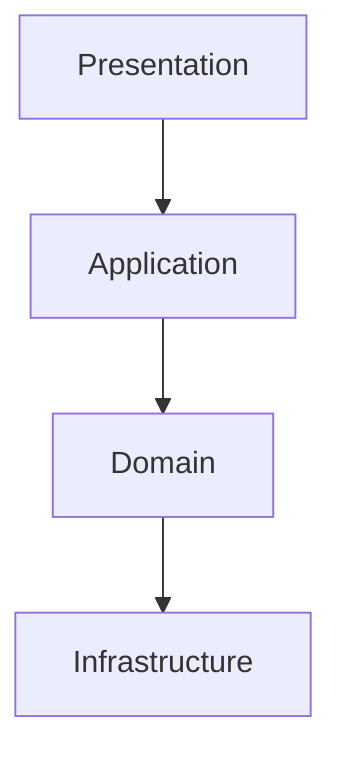

---

# 4. C4 Model

## Level 1 - Context

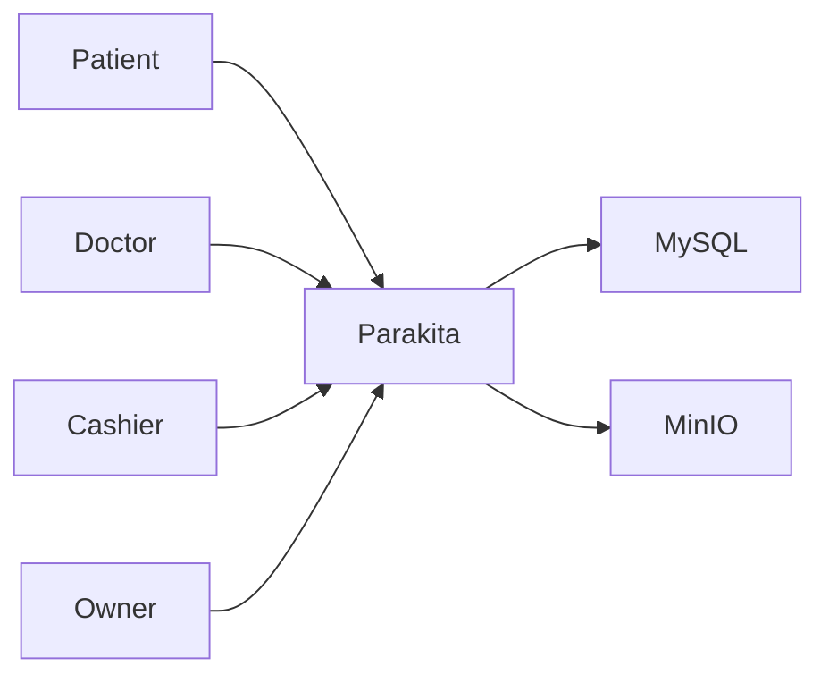

## Level 2 - Container

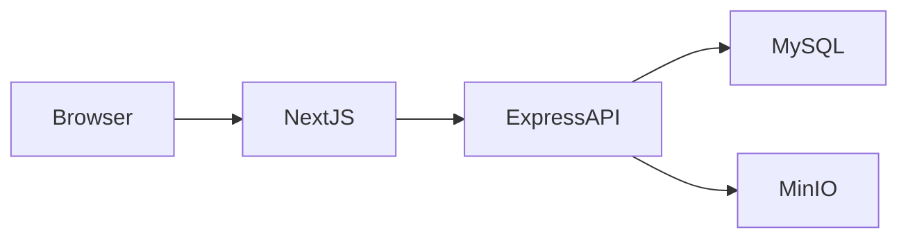

## Level 3 - Component

- Authentication
- Patient
- Reservation
- Queue
- EMR
- Billing
- Finance
- Warehouse
- HR
- Reporting
- System

---

# 5. High Level Architecture

```text
Browser
   │
Next.js
   │ REST API
Express.js
   │
Application Services
   │
Repository Layer
   │
MySQL
   └── MinIO / S3
```

---

# 6. Frontend Architecture

Stack:
- Next.js App Router
- TypeScript
- Tailwind CSS
- React Query
- Zustand

Layer:
- app/
- features/
- shared/
- hooks/
- services/

---

# 7. Backend Architecture

Stack:
- Express.js
- TypeScript
- Prisma ORM
- Modular Monolith

Request Flow:

Controller → DTO → Service → Repository → Prisma → MySQL

---

# 8. Clean Architecture Layer

| Layer | Responsibility |
|---|---|
|Presentation|Controller, Route, Validation|
|Application|Use Cases & Services|
|Domain|Entities & Business Rules|
|Infrastructure|Repository, ORM, Storage|

Dependency Rule:

Presentation → Application → Domain → Infrastructure

---

# 9. Domain Driven Design

Core Domain:
- Patient
- Reservation
- EMR
- Billing
- Finance

Supporting Domain:
- Warehouse
- HR
- Reporting

Generic Domain:
- Authentication
- Master Data
- System

---

# 10. Bounded Context

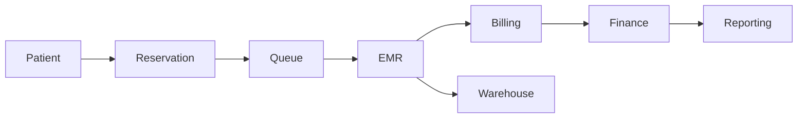

# Parakita Software Architecture Document (SAD)

# 02 - System Architecture (Part 2)

| Document Information | |
|----------------------|----------------------------------------------|
| Project | Parakita - Dental Clinic Management System |
| Document | 02 - System Architecture |
| Part | 2 of 4 |
| Version | 1.0.0 |
| Status | Draft |
| Document Type | Software Architecture Document (SAD) |

---

# Table of Contents (Part 2)

11. Module Dependency Matrix
12. Layer Dependency Rules
13. Repository Pattern
14. Dependency Injection
15. Request Lifecycle
16. Authentication Flow (JWT + Refresh Token)
17. Authorization & RBAC
18. Validation Pipeline
19. Exception Handling
20. Audit Trail

---

# 11. Module Dependency Matrix

## 11.1 Purpose

Seluruh modul pada Parakita memiliki batas tanggung jawab (Bounded Context) yang jelas. Hubungan antar modul hanya dilakukan apabila memang dibutuhkan oleh proses bisnis.

Pendekatan ini bertujuan untuk:

- Mengurangi coupling antar modul
- Mempermudah maintenance
- Mempermudah unit testing
- Mempermudah migrasi menuju Microservices

---

## 11.2 Dependency Matrix

| Module | Depends On | Used By |
|----------|-----------------------|----------------|
| Authentication | System | Semua Modul |
| Master Data | Authentication | Patient, Reservation, EMR |
| Patient | Master Data | Reservation, EMR |
| Reservation | Patient | Queue |
| Queue | Reservation | EMR |
| EMR | Patient, Queue | Billing, Warehouse |
| Billing | EMR | Finance |
| Finance | Billing | Reporting |
| Warehouse | EMR | Reporting |
| HR | Authentication | Reporting |
| Reporting | Semua Modul | Owner |
| System | Authentication | Semua Modul |

---

## 11.3 Dependency Diagram

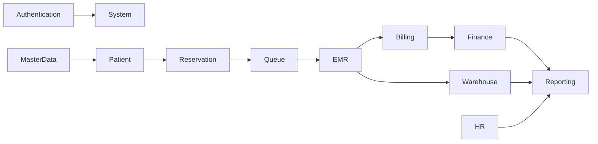

---

## 11.4 Dependency Principle

Setiap module hanya boleh mengakses module yang memang menjadi dependensinya.

Contoh:

✔ EMR boleh mengakses Patient.

✔ Billing boleh mengakses EMR.

✖ Billing tidak boleh langsung mengakses Reservation.

Apabila Billing membutuhkan informasi reservasi maka informasi tersebut diperoleh melalui EMR.

---

# 12. Layer Dependency Rules

## 12.1 Clean Architecture Rule

Dependency hanya mengalir ke arah dalam (Dependency Rule).

```text
Presentation

↓

Application

↓

Domain

↓

Infrastructure
```

Layer di atas tidak boleh diakses secara langsung oleh layer di bawah tanpa melalui layer perantara.

---

## 12.2 Allowed Dependency

| Layer | Can Access |
|--------|----------------|
| Presentation | Application |
| Application | Domain |
| Infrastructure | Domain |
| Repository | Database |
| Controller | Service |

---

## 12.3 Forbidden Dependency

Layer berikut tidak diperbolehkan:

❌ Controller → Database

❌ Controller → ORM

❌ Service → HTTP Request

❌ Entity → Database

❌ Repository → Controller

---

## 12.4 Example

Benar

```text
Controller

↓

Service

↓

Repository

↓

Prisma

↓

MySQL
```

Salah

```text
Controller

↓

Prisma

↓

MySQL
```

---

# 13. Repository Pattern

## 13.1 Purpose

Seluruh akses database dilakukan melalui Repository.

Business Logic tidak boleh mengetahui implementasi ORM.

---

## 13.2 Architecture

```text
Controller

↓

Service

↓

Repository Interface

↓

Repository Implementation

↓

Prisma ORM

↓

MySQL
```

---

## 13.3 Repository Responsibility

Repository bertanggung jawab untuk:

- Query Database
- Pagination
- Filtering
- Transaction
- Mapping Entity

Repository tidak boleh berisi Business Logic.

---

## 13.4 Service Responsibility

Service bertanggung jawab untuk:

- Business Rule
- Validation Bisnis
- Transaction Flow
- Domain Event

---

## 13.5 Repository Diagram

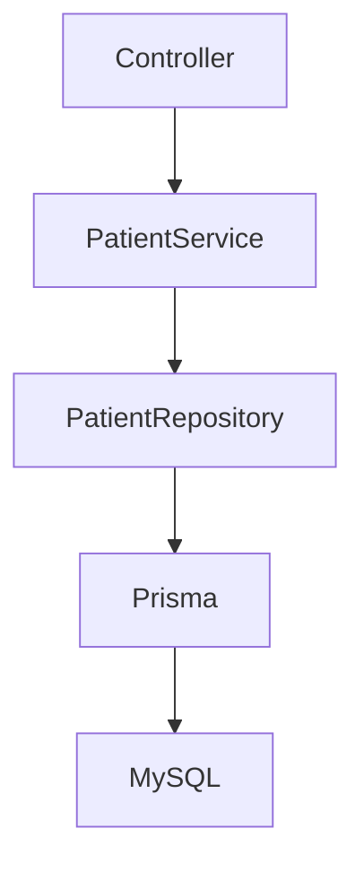

---

# 14. Dependency Injection

## 14.1 Purpose

Dependency Injection digunakan agar implementasi mudah diganti dan mudah diuji.

---

## 14.2 Dependency Flow

```text
Controller

↓

Inject Service

↓

Inject Repository

↓

Inject Database Client
```

---

## 14.3 Benefits

- Loose Coupling
- Testable
- Mock Repository
- Mudah mengganti ORM
- Mudah migrasi ke Microservices

---

## 14.4 Example

PatientController

↓

PatientService

↓

PatientRepository

↓

PrismaRepository

---

# 15. Request Lifecycle

## 15.1 Overview

Setiap request mengikuti alur yang sama.

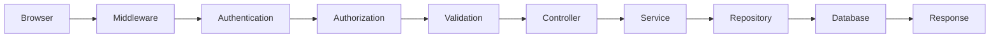

---

## 15.2 Lifecycle Detail

### Step 1

Browser mengirim HTTP Request.

### Step 2

Middleware melakukan logging dan parsing request.

### Step 3

Authentication memvalidasi JWT.

### Step 4

Authorization memeriksa permission.

### Step 5

Validation memvalidasi DTO.

### Step 6

Controller menerima request.

### Step 7

Service menjalankan Business Logic.

### Step 8

Repository mengambil data.

### Step 9

Response dikembalikan ke client.

---

## 15.3 Request Pipeline

```text
Request

↓

Logger

↓

JWT

↓

Permission

↓

Validation

↓

Controller

↓

Service

↓

Repository

↓

Database

↓

JSON Response
```

---

# 16. Authentication Flow

## 16.1 Authentication Overview

Parakita menggunakan:

- JWT Access Token
- Refresh Token
- Password Hash
- Session Tracking

---

## 16.2 Login Flow

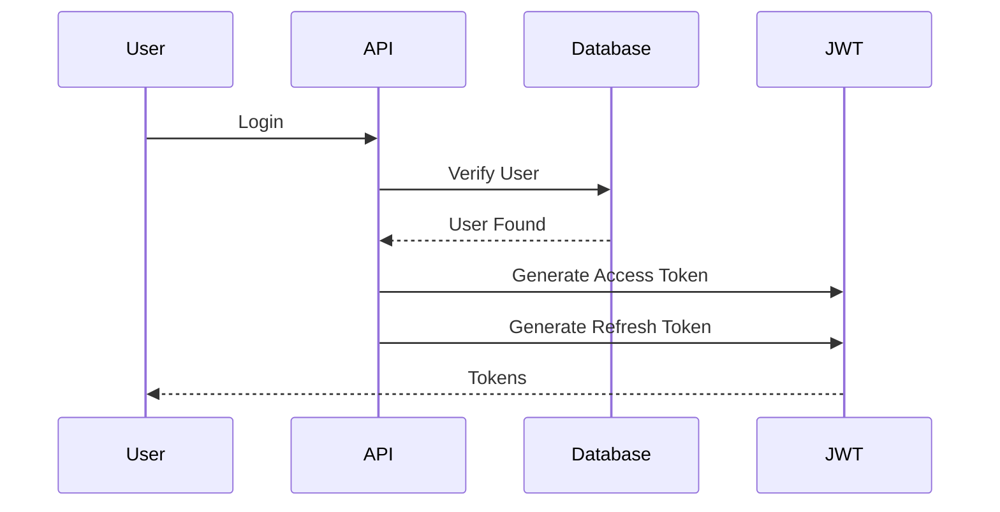

---

## 16.3 Token Lifecycle

```text
Login

↓

Access Token

↓

Expired

↓

Refresh Token

↓

New Access Token
```

---

## 16.4 Security Principle

- Password di-hash.
- Refresh Token disimpan aman.
- Access Token memiliki masa berlaku singkat.
- Logout menghapus Refresh Token.

---

# 17. Authorization & RBAC

## 17.1 Overview

Hak akses menggunakan Role Based Access Control.

```text
User

↓

Role

↓

Permission

↓

API

↓

Controller
```

---

## 17.2 Permission Type

- Read
- Create
- Update
- Delete
- Approve
- Print
- Export
- Closing
- Void
- Cancel

---

## 17.3 Example

Cashier

✔ Payment

✔ Refund

✔ Closing

✖ Edit EMR

---

Doctor

✔ EMR

✔ SOAP

✔ Treatment

✖ Payroll

---

## 17.4 Authorization Flow

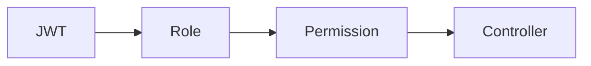

---

# 18. Validation Pipeline

## 18.1 Validation Strategy

Validasi dilakukan sebelum Business Logic dijalankan.

---

## 18.2 Validation Flow

```text
HTTP Request

↓

DTO Validation

↓

Business Validation

↓

Database Validation

↓

Service
```

---

## 18.3 Validation Level

| Level | Purpose |
|--------|---------------------------|
| DTO | Format Data |
| Service | Business Rule |
| Repository | Data Consistency |

---

## 18.4 Example Validation

Patient:

- Nama wajib.
- Nomor HP valid.
- Tanggal lahir valid.

Reservation:

- Dokter tersedia.
- Jadwal belum penuh.

EMR:

- Visit harus aktif.
- Dokter sesuai jadwal.

---

# 19. Exception Handling

## 19.1 Purpose

Seluruh error ditangani secara konsisten agar API memiliki format response yang seragam.

---

## 19.2 Error Flow

```text
Exception

↓

Exception Handler

↓

Logging

↓

JSON Response
```

---

## 19.3 HTTP Error Standard

| Code | Description |
|------|-------------|
| 400 | Validation Error |
| 401 | Unauthorized |
| 403 | Forbidden |
| 404 | Data Not Found |
| 409 | Conflict |
| 422 | Business Validation |
| 500 | Internal Server Error |

---

## 19.4 Error Response

```json
{
  "success": false,
  "message": "Validation Failed",
  "errors": []
}
```

---

# 20. Audit Trail

## 20.1 Overview

Seluruh aktivitas penting dicatat untuk memenuhi kebutuhan keamanan, kepatuhan, dan pelacakan perubahan data.

---

## 20.2 Activity yang Dicatat

- Login
- Logout
- Create Patient
- Update Patient
- Reservation
- Check In
- Open Visit
- Save EMR
- Payment
- Refund
- Stock Adjustment
- Closing Kasir
- User Management

---

## 20.3 Audit Flow

```mermaid
flowchart LR

User Action

-->

Business Process

-->

Audit Logger

-->

Audit Database
```

---

## 20.4 Audit Information

Setiap log audit minimal menyimpan informasi berikut.

| Field | Description |
|--------|-------------|
| Timestamp | Waktu kejadian |
| User ID | Pengguna yang melakukan aksi |
| Module | Modul terkait |
| Action | Jenis aksi |
| Entity | Data yang berubah |
| Entity ID | Identitas data |
| Old Value | Nilai sebelum perubahan |
| New Value | Nilai setelah perubahan |
| IP Address | Alamat IP pengguna |
| User Agent | Informasi perangkat/browser |

---

# Summary Part 2

Part 2 mendefinisikan fondasi implementasi backend Parakita melalui aturan dependency, Repository Pattern, Dependency Injection, Request Lifecycle, Authentication, Authorization, Validation, Exception Handling, dan Audit Trail.

Dokumen ini menjadi acuan utama bagi Backend Developer dalam menjaga konsistensi implementasi arsitektur sesuai prinsip **Clean Architecture** dan **Modular Monolith**.

---

# Parakita Software Architecture Document (SAD)

# 02 - System Architecture (Part 3)

| Document Information | |
|----------------------|----------------------------------------------|
| Project | Parakita - Dental Clinic Management System |
| Document | 02 - System Architecture |
| Part | 3 of 4 |
| Version | 1.0.0 |
| Status | Draft |
| Document Type | Software Architecture Document (SAD) |

---

# Table of Contents (Part 3)

21. Logging Architecture
22. Configuration Management
23. Internal Event Bus
24. Event Catalog
25. Data Flow Architecture
26. Database Access Layer
27. File Storage Architecture
28. Cache Strategy (Future)
29. API Communication

---

# 21. Logging Architecture

## 21.1 Purpose

Logging merupakan komponen penting untuk memastikan seluruh aktivitas sistem dapat dipantau, dianalisis, dan ditelusuri ketika terjadi permasalahan.

Logging tidak hanya digunakan untuk debugging, tetapi juga sebagai bagian dari observability dan audit operasional.

---

## 21.2 Logging Objectives

Tujuan utama logging adalah:

- Monitoring aplikasi
- Error Investigation
- Performance Analysis
- Security Monitoring
- Audit Support

---

## 21.3 Logging Categories

| Category | Description |
|----------|-------------|
| Application Log | Aktivitas aplikasi |
| Access Log | HTTP Request |
| Error Log | Error Runtime |
| Audit Log | Aktivitas User |
| Performance Log | Response Time |
| Security Log | Login & Permission |

---

## 21.4 Logging Flow

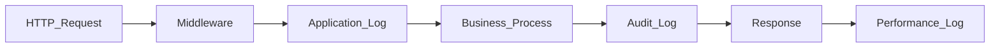

---

## 21.5 Logging Standard

Minimal setiap log menyimpan informasi berikut.

| Field | Description |
|---------|---------------------------|
| Timestamp | Waktu |
| Correlation ID | Request Identifier |
| User ID | User Login |
| Module | Nama Modul |
| Action | Jenis Aktivitas |
| HTTP Method | GET / POST |
| Endpoint | URL API |
| Status Code | HTTP Response |
| Duration | Lama Request |
| IP Address | Client IP |

---

## 21.6 Log Level

| Level | Usage |
|--------|-------------------|
| TRACE | Detail Internal |
| DEBUG | Development |
| INFO | Aktivitas Normal |
| WARN | Warning |
| ERROR | Error |
| FATAL | System Failure |

---

# 22. Configuration Management

## 22.1 Overview

Seluruh konfigurasi aplikasi harus dipisahkan dari Business Logic.

Konfigurasi dikelola menggunakan Environment Variable.

---

## 22.2 Configuration Scope

- Database
- JWT
- Storage
- SMTP
- Upload
- Cache
- CORS
- API Version

---

## 22.3 Configuration Layer

```text
Environment Variable

↓

Configuration Service

↓

Application Module
```

---

## 22.4 Environment Example

```text
APP_NAME

APP_PORT

DATABASE_URL

JWT_SECRET

JWT_REFRESH_SECRET

S3_ENDPOINT

S3_BUCKET

SMTP_HOST
```

---

## 22.5 Configuration Principle

- Tidak ada hardcode credential.
- Seluruh secret menggunakan Environment Variable.
- Configuration dapat berubah tanpa rebuild aplikasi.

---

# 23. Internal Event Bus

## 23.1 Purpose

Komunikasi antar module menggunakan Internal Domain Event.

Pendekatan ini menghasilkan Loose Coupling antar modul.

---

## 23.2 Event Flow

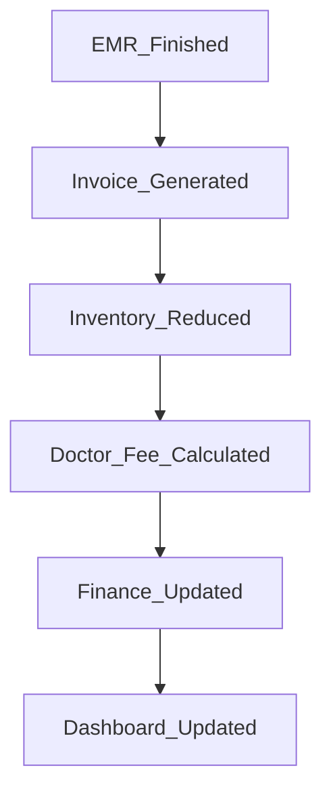

---

## 23.3 Event Benefits

- Modular
- Extensible
- Maintainable
- Reusable
- Future Microservices Ready

---

## 23.4 Event Publisher

Publisher:

- EMR
- Billing
- Finance
- Warehouse
- HR

Subscriber:

- Reporting
- Dashboard
- Notification

---

# 24. Event Catalog

## 24.1 Core Business Event

| Event | Publisher | Subscriber |
|--------|------------|----------------|
| PatientRegistered | Patient | Reporting |
| ReservationCreated | Reservation | Queue |
| PatientCheckedIn | Reservation | Queue |
| QueueCalled | Queue | EMR |
| VisitStarted | EMR | Reporting |
| TreatmentSaved | EMR | Billing |
| EMRFinished | EMR | Billing |
| InvoiceGenerated | Billing | Finance |
| PaymentCompleted | Billing | Finance |
| StockConsumed | Warehouse | Reporting |
| CashierClosed | Finance | Reporting |

---

## 24.2 Event Lifecycle

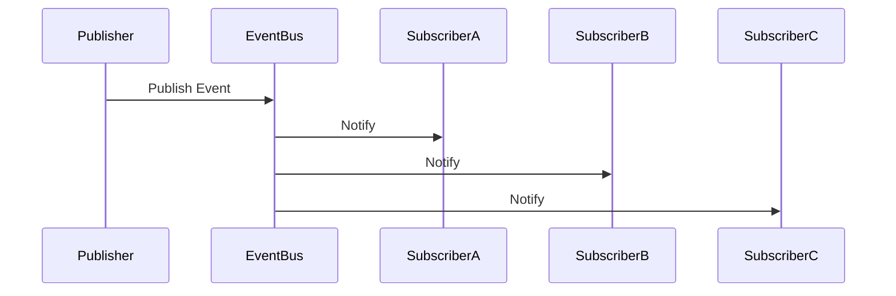

---

# 25. Data Flow Architecture

## 25.1 Overview

Seluruh aliran data mengikuti prinsip Clean Architecture.

---

## 25.2 Request Data Flow

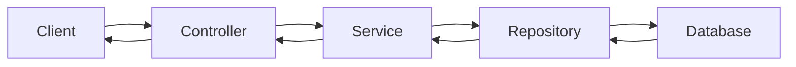

---

## 25.3 Business Data Flow

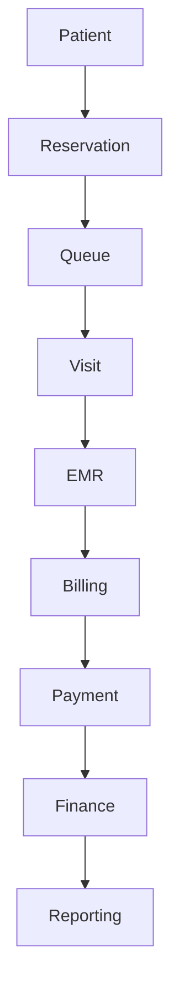

---

## 25.4 Cross Module Data Flow

| Source | Destination |
|----------|----------------|
| Patient | Reservation |
| Reservation | Queue |
| Queue | EMR |
| EMR | Billing |
| Billing | Finance |
| Finance | Reporting |
| Warehouse | Reporting |

---

# 26. Database Access Layer

## 26.1 Purpose

Seluruh akses database dilakukan melalui Repository Layer.

Tidak diperbolehkan Controller mengakses ORM secara langsung.

---

## 26.2 Access Flow

```text
Controller

↓

Service

↓

Repository

↓

Prisma ORM

↓

MySQL
```

---

## 26.3 Transaction Strategy

Business Transaction dilakukan pada Service Layer.

Repository hanya menjalankan operasi database.

---

## 26.4 Repository Responsibility

- Query
- Pagination
- Search
- Filtering
- Transaction Helper
- Soft Delete

---

## 26.5 Database Principle

- ACID Transaction
- Foreign Key
- Index Strategy
- Soft Delete
- Audit Field

---

# 27. File Storage Architecture

## 27.1 Overview

Attachment tidak disimpan di database.

Database hanya menyimpan metadata file.

---

## 27.2 Supported Attachment

- Foto Gigi
- Foto Ronsen
- Dokumen Pendukung
- Profile Image

---

## 27.3 Storage Flow

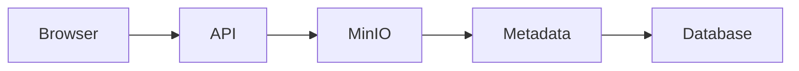

---

## 27.4 File Metadata

| Field | Description |
|---------|----------------|
| File Name | Nama File |
| MIME Type | Jenis File |
| Size | Ukuran |
| Bucket | Storage Bucket |
| Object Key | Storage Path |
| Uploaded By | User |
| Uploaded At | Timestamp |

---

## 27.5 Storage Principle

- Object Storage
- Secure URL
- Private Bucket
- Versioning (Future)
- Virus Scan (Future)

---

# 28. Cache Strategy (Future)

## 28.1 Purpose

Cache digunakan untuk meningkatkan performa pembacaan data yang sering digunakan.

---

## 28.2 Candidate Cache

- Master Data
- Doctor Schedule
- System Parameter
- Dashboard KPI
- Role Permission

---

## 28.3 Future Architecture

```text
Application

↓

Redis Cache

↓

MySQL
```

---

## 28.4 Cache Policy

| Strategy | Description |
|-----------|-------------|
| Cache Aside | Default |
| TTL | Configurable |
| Cache Invalidate | Update Data |
| Warm Up | Startup |

---

# 29. API Communication

## 29.1 Communication Pattern

Frontend dan Backend berkomunikasi menggunakan REST API berbasis JSON.

---

## 29.2 API Flow

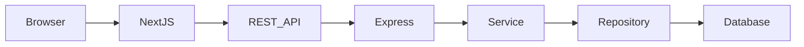

---

## 29.3 API Standard

Seluruh endpoint menggunakan standar berikut.

| Standard | Description |
|-----------|-------------|
| HTTPS | Secure Communication |
| JSON | Request & Response |
| JWT | Authentication |
| RBAC | Authorization |
| Pagination | List Endpoint |
| Validation | DTO Validation |
| Versioning | /api/v1 |

---

## 29.4 Standard Response

### Success

```json
{
  "success": true,
  "message": "Success",
  "data": {}
}
```

### Error

```json
{
  "success": false,
  "message": "Validation Error",
  "errors": []
}
```

---

## 29.5 API Design Principles

- Stateless
- Resource Oriented
- Versioned Endpoint
- Consistent Naming
- Standard HTTP Status Code
- Idempotent Request (jika diperlukan)
- Secure by Default

---

# Summary Part 3

Part 3 menjelaskan komponen teknis lintas modul yang mendukung operasional sistem, meliputi Logging Architecture, Configuration Management, Internal Event Bus, Event Catalog, Data Flow Architecture, Database Access Layer, File Storage Architecture, Cache Strategy, serta standar komunikasi API.

Dokumen ini menjadi acuan implementasi bagi Backend Developer, DevOps Engineer, dan Solution Architect untuk memastikan seluruh modul Parakita memiliki mekanisme komunikasi, observability, dan pengelolaan data yang konsisten.

---


# Parakita Software Architecture Document (SAD)

# 02 - System Architecture (Part 4)

| Document Information | |
|----------------------|----------------------------------------------|
| Project | Parakita - Dental Clinic Management System |
| Document | 02 - System Architecture |
| Part | 4 of 4 |
| Version | 1.0.0 |
| Status | Draft |
| Document Type | Software Architecture Document (SAD) |

---

# Table of Contents (Part 4)

30. Deployment Architecture
31. Infrastructure Diagram
32. Network Architecture
33. Availability Design
34. Scalability Design
35. Security Architecture
36. Observability
37. Architecture Decision Record (ADR)
38. Technology Constraints
39. Risks & Mitigation
40. Future Migration to Microservices

---

# 30. Deployment Architecture

## 30.1 Overview

Parakita dirancang menggunakan arsitektur **Modular Monolith** dengan pendekatan **Clean Architecture**.

Seluruh modul berjalan pada satu backend application namun dipisahkan berdasarkan Domain Driven Design sehingga siap dikembangkan menjadi Microservices di masa depan.

---

## 30.2 Deployment Topology

```mermaid
flowchart TB

Internet

↓

Reverse Proxy (Nginx)

↓

Next.js Frontend

↓

Express.js API

↓

Repository Layer

↓

MySQL

Express.js --> MinIO

Express.js --> SMTP

Express.js --> Redis(Future)
```

---

## 30.3 Deployment Components

| Component | Purpose |
|------------|----------------------------|
| Browser | Client Application |
| Nginx | Reverse Proxy |
| Next.js | Frontend |
| Express.js | REST API |
| MySQL | Primary Database |
| MinIO | Object Storage |
| SMTP | Email Service |
| Redis | Cache (Future) |

---

## 30.4 Container Strategy

Docker digunakan sebagai standar deployment.

Container utama:

- Frontend
- Backend
- Database
- MinIO
- Reverse Proxy

---

# 31. Infrastructure Diagram

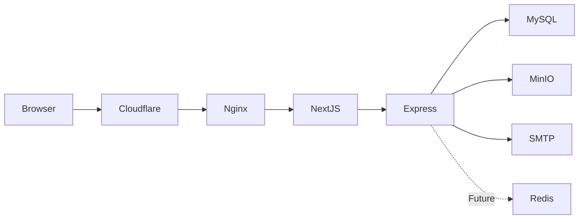

---

## 31.1 Infrastructure Layer

| Layer | Component |
|--------|-----------|
| Client | Browser |
| CDN | Cloudflare |
| Web | Nginx |
| Application | Express.js |
| Database | MySQL |
| Object Storage | MinIO |
| Email | SMTP |
| Cache | Redis (Future) |

---

# 32. Network Architecture

## 32.1 Network Zone

```text
Internet

↓

DMZ

↓

Reverse Proxy

↓

Application Network

↓

Database Network
```

---

## 32.2 Security Zone

| Zone | Description |
|------|-------------|
| Public | Browser |
| Edge | Reverse Proxy |
| Application | API Server |
| Data | Database |
| Storage | MinIO |

---

## 32.3 Communication

| Source | Destination | Protocol |
|----------|--------------|----------|
| Browser | Frontend | HTTPS |
| Frontend | API | HTTPS |
| API | MySQL | TCP |
| API | MinIO | HTTPS |
| API | SMTP | TLS |

---

# 33. Availability Design

## 33.1 Target Availability

| Item | Target |
|------|---------|
| Availability | 99.9% |
| Backup | Daily |
| Recovery | Disaster Recovery Plan |
| Monitoring | 24 x 7 |

---

## 33.2 Backup Strategy

Backup dilakukan terhadap:

- Database
- Attachment
- Configuration
- Audit Log

---

## 33.3 Disaster Recovery

Target Recovery:

| Parameter | Target |
|-----------|--------|
| RPO | < 24 Jam |
| RTO | < 4 Jam |

---

# 34. Scalability Design

## 34.1 Current Architecture

Single Backend Instance

↓

Single Database

↓

Object Storage

---

## 34.2 Future Horizontal Scaling

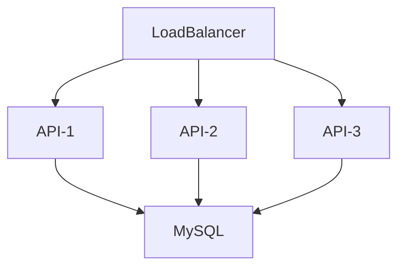

---

## 34.3 Scalability Principle

- Stateless API
- External Object Storage
- Database Index
- Pagination
- Queue Ready
- Event Driven

---

## 34.4 Multi Branch Ready

Sistem dirancang agar seluruh data dapat dipisahkan berdasarkan:

- Clinic
- Branch
- Company

---

# 35. Security Architecture

## 35.1 Security Principle

- Security by Design
- Least Privilege
- Zero Trust
- Defense in Depth

---

## 35.2 Authentication

- JWT
- Refresh Token
- Password Hash
- Session Tracking

---

## 35.3 Authorization

Role Based Access Control

```text
User

↓

Role

↓

Permission

↓

API

↓

Business Logic
```

---

## 35.4 Data Security

Data yang dilindungi:

- Data Pasien
- EMR
- Invoice
- Payroll
- Finance

---

## 35.5 Security Controls

| Control | Purpose |
|----------|---------|
| HTTPS | Encryption |
| JWT | Authentication |
| RBAC | Authorization |
| Audit Trail | Accountability |
| Soft Delete | Data Protection |
| Validation | Input Security |

---

## 35.6 OWASP Awareness

Parakita mengikuti praktik terbaik untuk mengurangi risiko:

- Broken Authentication
- Injection
- XSS
- CSRF
- Sensitive Data Exposure
- Broken Access Control

---

# 36. Observability

## 36.1 Monitoring Components

- Logging
- Metrics
- Audit Trail
- Health Check
- Error Tracking

---

## 36.2 Health Check Endpoint

```text
GET /health

GET /health/database

GET /health/storage
```

---

## 36.3 Metrics

| Metric | Description |
|----------|-------------|
| API Response Time | Performance |
| Active User | Monitoring |
| Login Success | Security |
| Queue Length | Operational |
| Error Rate | Stability |

---

## 36.4 Dashboard Monitoring

Dashboard operasional menampilkan:

- CPU
- Memory
- Database
- API Response
- Storage
- Queue
- Error

---

# 37. Architecture Decision Record (ADR)

## ADR-001

### Decision

Menggunakan Modular Monolith.

### Reason

- Deployment sederhana.
- Tidak membutuhkan distributed transaction.
- Mudah dikembangkan.

---

## ADR-002

Menggunakan Clean Architecture.

---

## ADR-003

Menggunakan Repository Pattern.

---

## ADR-004

Menggunakan Internal Domain Event.

---

## ADR-005

Menggunakan JWT Authentication.

---

## ADR-006

Menggunakan Object Storage (MinIO/S3).

---

## ADR-007

Menggunakan Prisma ORM.

---

## ADR-008

REST API sebagai komunikasi utama.

---

# 38. Technology Constraints

## Frontend

- Next.js
- TypeScript
- TailwindCSS
- React Query
- Zustand

---

## Backend

- Express.js
- TypeScript
- Prisma ORM

---

## Database

- MySQL

---

## Storage

- MinIO
- Amazon S3

---

## DevOps

- Docker
- GitHub
- GitHub Actions (Future)

---

## Documentation

- Markdown
- Mermaid
- OpenAPI

---

# 39. Risks & Mitigation

| Risk | Impact | Mitigation |
|------|---------|------------|
| Database Failure | High | Backup & Recovery |
| Storage Failure | High | Object Storage Replication |
| Token Leakage | High | Short JWT Expiry |
| Human Error | Medium | Audit Trail |
| High Traffic | Medium | Horizontal Scaling |
| Data Corruption | High | ACID Transaction |
| Unauthorized Access | High | RBAC |

---

## 39.1 Technical Risks

- Long Running Transaction
- Deadlock
- Storage Capacity
- API Abuse
- SQL Injection

Seluruh risiko diatasi melalui desain arsitektur, validasi, monitoring, serta prosedur operasional.

---

# 40. Future Migration to Microservices

## 40.1 Migration Strategy

Parakita dikembangkan sebagai **Modular Monolith** sehingga setiap domain nantinya dapat dipisahkan menjadi Microservice tanpa mengubah Business Logic.

---

## 40.2 Candidate Services

```text
API Gateway

├── Authentication Service

├── Patient Service

├── Reservation Service

├── Queue Service

├── EMR Service

├── Billing Service

├── Finance Service

├── Warehouse Service

├── HR Service

├── Reporting Service

└── Notification Service
```

---

## 40.3 Migration Principles

- API Contract First
- Independent Database
- Event Driven Communication
- Backward Compatibility
- Incremental Migration

---

## 40.4 Expected Benefits

- Independent Deployment
- Better Scalability
- Fault Isolation
- Technology Flexibility
- Team Independence

---

# Closing Statement

Dokumen **02-System Architecture** merupakan dokumen teknis utama yang mendefinisikan arsitektur Parakita secara menyeluruh. Dokumen ini menjadi acuan bagi **Solution Architect**, **Backend Developer**, **Frontend Developer**, **DevOps Engineer**, dan **QA Engineer** dalam mengimplementasikan sistem sesuai prinsip **Clean Architecture**, **Domain Driven Design**, dan **Modular Monolith**.

Dokumen ini juga menjadi fondasi bagi dokumen berikutnya:

- **03-clean-architecture.md**
- **04-project-structure.md**
- **05-coding-standard.md**
- **06-database-design.md**
- **07-data-dictionary.md**
- **08-erd.md**
- **09-api-standard.md**

Dengan demikian, seluruh blueprint Parakita memiliki keterkaitan yang konsisten dan dapat digunakan sebagai referensi pengembangan jangka panjang.


# Appendix A - Technology Matrix

## A.1 Frontend Technology

| Component | Technology | Purpose |
|-----------|------------|---------|
| Framework | Next.js App Router | Web Framework |
| Language | TypeScript | Strong Typing |
| Styling | TailwindCSS | UI Styling |
| State Management | Zustand | Global State |
| Server State | React Query | API Cache |
| Form | React Hook Form | Form Handling |
| Validation | Zod | Client Validation |
| HTTP Client | Axios | REST Communication |

---

## A.2 Backend Technology

| Component | Technology |
|-----------|------------|
| Runtime | Node.js |
| Framework | Express.js |
| Language | TypeScript |
| ORM | Prisma |
| Validation | class-validator / Zod |
| Authentication | JWT |
| Documentation | Swagger |
| Testing | Vitest / Jest |

---

## A.3 Infrastructure

| Component | Technology |
|-----------|------------|
| Database | MySQL |
| Object Storage | MinIO / Amazon S3 |
| Reverse Proxy | Nginx |
| Container | Docker |
| Source Control | Git |
| CI/CD | GitHub Actions (Future) |

---

# Appendix B - Folder Mapping

```text
Frontend

app/
features/
components/
hooks/
services/
store/
types/

Backend

src/

 modules/

 patient/

 reservation/

 queue/

 emr/

 billing/

 finance/

 warehouse/

 hr/

 reporting/

 auth/

 system/

 common/

 config/

 middleware/

 shared/
```

---

# Appendix C - Module Responsibility Matrix

| Module | Main Responsibility |
|----------|---------------------|
| Authentication | Login & Security |
| Master Data | Data Referensi |
| Patient | Data Pasien |
| Reservation | Reservasi |
| Queue | Antrian |
| EMR | Rekam Medis |
| Billing | Invoice |
| Finance | Keuangan |
| Warehouse | Inventory |
| HR | SDM |
| Reporting | Dashboard |
| System | Konfigurasi |

---

# Appendix D - Cross Cutting Services

Komponen berikut digunakan oleh seluruh module.

- Logger Service
- Audit Service
- File Service
- Authentication Service
- Authorization Service
- Validation Service
- Notification Service (Future)
- Cache Service (Future)

---

# Appendix E - Internal Event Summary

| Event | Publisher | Subscriber |
|--------|-----------|------------|
| PatientRegistered | Patient | Reporting |
| ReservationCreated | Reservation | Queue |
| QueueCalled | Queue | EMR |
| VisitStarted | EMR | Reporting |
| TreatmentSaved | EMR | Billing |
| InvoiceGenerated | Billing | Finance |
| PaymentCompleted | Billing | Finance |
| StockReduced | Warehouse | Reporting |
| CashierClosed | Finance | Dashboard |

---

# Appendix F - Architecture Checklist

## Clean Architecture

- Controller tidak mengakses database
- Business Rule berada pada Service
- Repository hanya mengakses database
- DTO digunakan pada seluruh endpoint
- Entity tidak bergantung pada framework

---

## Security

- JWT Authentication
- Refresh Token
- RBAC
- HTTPS
- Audit Trail
- Soft Delete
- Password Hashing

---

## Performance

- Pagination
- Database Index
- Optimized Query
- Lazy Loading
- Compression
- Cache Ready

---

## Maintainability

- Modular Monolith
- Domain Driven Design
- Repository Pattern
- Dependency Injection
- Internal Event

---

# Appendix G - Architecture Glossary

| Term | Description |
|------|-------------|
| DDD | Domain Driven Design |
| Bounded Context | Batas domain bisnis |
| EMR | Electronic Medical Record |
| Repository | Lapisan akses database |
| DTO | Data Transfer Object |
| RBAC | Role Based Access Control |
| JWT | JSON Web Token |
| Audit Trail | Riwayat perubahan data |
| Internal Event | Komunikasi antar modul |
| Modular Monolith | Modular dalam satu deployment |

---

# Final Conclusion

Blueprint **02-System Architecture** mendefinisikan seluruh arsitektur teknis Parakita, mulai dari prinsip desain, struktur layer, komunikasi antar modul, deployment, keamanan, observability, hingga strategi migrasi menuju Microservices.

Dokumen ini menjadi referensi utama bagi:

- Solution Architect
- Backend Developer
- Frontend Developer
- DevOps Engineer
- QA Engineer

Seluruh implementasi pada dokumen berikutnya (**03-clean-architecture.md**, **04-project-structure.md**, **05-coding-standard.md**, dan seterusnya) harus mengacu pada prinsip dan keputusan arsitektur yang telah ditetapkan dalam dokumen ini agar konsistensi desain sistem tetap terjaga.