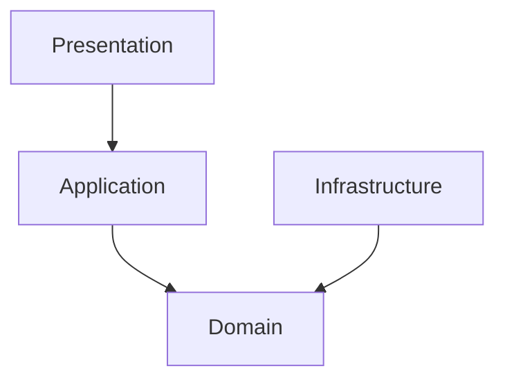
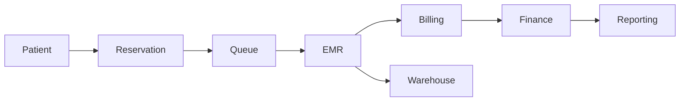
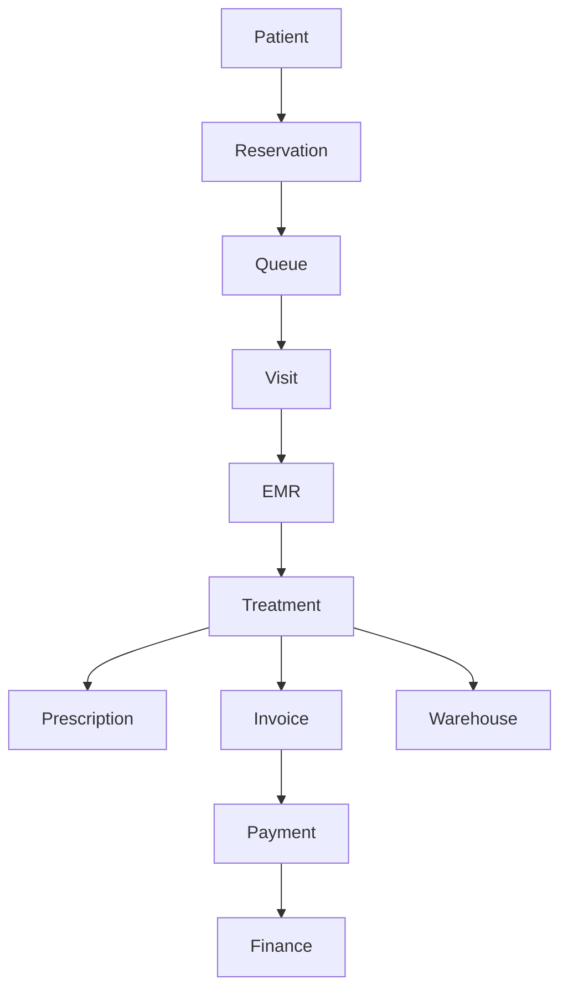

# Parakita Software Architecture Document (SAD)

# 03 - Clean Architecture

| Document Information | |
|----------------------|----------------------------------------------|
| Project | Parakita - Dental Clinic Management System |
| Document | 03 - Clean Architecture |
| Part | 1 of 5 |
| Version | 1.0.0 |
| Status | Draft |
| Document Type | Software Architecture Document (SAD) |
| Architecture Style | Clean Architecture + Domain Driven Design + Modular Monolith |
| Backend | Express.js + TypeScript |
| Frontend | Next.js + TypeScript |
| Last Updated | July 2026 |

---

# Table of Contents (Part 1)

1. Introduction
2. Purpose
3. Scope
4. Target Audience
5. Relationship with Other Documents
6. Architecture Philosophy
7. Clean Architecture Principles
8. SOLID Principles
9. Dependency Rule
10. Separation of Concerns
11. Domain Driven Design Integration

---

# 1. Introduction

## 1.1 Overview

Dokumen ini menjelaskan bagaimana prinsip **Clean Architecture** diterapkan pada pengembangan sistem **Parakita**.

Apabila dokumen **01-System Overview** menjelaskan proses bisnis, dan **02-System Architecture** menjelaskan desain arsitektur sistem secara menyeluruh, maka dokumen ini berfungsi sebagai **panduan implementasi (Implementation Guideline)** yang harus diikuti oleh seluruh developer selama proses pengembangan.

Dokumen ini mendefinisikan standar implementasi mulai dari struktur layer, dependency, use case, repository, entity, event, transaction, hingga pola komunikasi antar modul sehingga seluruh kode memiliki konsistensi yang tinggi.

Dengan adanya standar ini, setiap modul baru akan dibangun menggunakan pola yang sama sehingga kode tetap mudah dipelihara, diuji, dan dikembangkan.

---

## 1.2 Background

Parakita dibangun menggunakan pendekatan **Modular Monolith** dengan **Domain Driven Design (DDD)** dan **Clean Architecture**.

Pendekatan ini dipilih karena mampu memberikan keseimbangan antara:

- Maintainability
- Simplicity
- Scalability
- Testability
- Extensibility

Arsitektur ini memungkinkan seluruh Business Logic tetap independen terhadap framework, database, maupun teknologi lain yang digunakan.

---

## 1.3 Objectives

Dokumen ini memiliki tujuan sebagai berikut.

- Menjadi standar implementasi seluruh module.
- Menjadi acuan seluruh Backend Developer.
- Menjadi referensi Frontend Developer dalam memahami alur backend.
- Menjamin konsistensi struktur kode.
- Mengurangi technical debt.
- Mempermudah proses code review.
- Mempermudah onboarding developer baru.
- Menyiapkan fondasi migrasi menuju Microservices.

---

# 2. Purpose

Dokumen ini dibuat untuk memastikan seluruh implementasi source code mengikuti prinsip yang sama.

Secara khusus dokumen ini bertujuan untuk:

- Menentukan batas tanggung jawab setiap layer.
- Menentukan dependency antar layer.
- Menentukan struktur module.
- Menentukan pola implementasi Use Case.
- Menentukan pola Repository.
- Menentukan standar DTO.
- Menentukan strategi Domain Event.
- Menentukan standar Transaction.
- Menentukan standar Error Handling.
- Menentukan standar Logging.
- Menentukan Best Practice pengembangan.

Dokumen ini merupakan pedoman implementasi dan bukan sekadar referensi konseptual.

---

# 3. Scope

Dokumen ini mencakup implementasi teknis pada seluruh Backend Application Parakita.

Area yang dibahas meliputi:

- Layer Architecture
- Dependency Rule
- Module Organization
- Use Case Pattern
- Repository Pattern
- Domain Model
- DTO
- Validation
- Domain Event
- Transaction
- Logging
- Audit Trail
- Security Layer
- Testing Strategy
- Best Practice

Dokumen ini tidak membahas:

- Business Requirement
- UI/UX
- Database Detail
- API Specification
- Deployment

Seluruh pembahasan tersebut terdapat pada dokumen lain dalam blueprint Parakita.

---

# 4. Target Audience

Dokumen ini digunakan oleh seluruh anggota tim engineering.

| Role | Purpose |
|------|---------|
| Solution Architect | Menentukan standar implementasi |
| Technical Lead | Review arsitektur modul |
| Backend Developer | Implementasi Business Logic |
| Frontend Developer | Memahami alur backend |
| QA Engineer | Memahami alur request |
| DevOps Engineer | Memahami dependency aplikasi |

---

# 5. Relationship with Other Documents

Dokumen Clean Architecture merupakan bagian dari keseluruhan Software Architecture Document (SAD).

```text
01-System Overview
        │
        ▼
Business Architecture

        │

02-System Architecture
        │
        ▼
Technical Architecture

        │

03-Clean Architecture
        │
        ▼
Implementation Guideline

        │

04-Project Structure
        │
        ▼
Folder Organization

        │

05-Coding Standard
        │
        ▼
Coding Convention
```

Hubungan antar dokumen adalah sebagai berikut.

| Document | Focus |
|----------|----------------------------|
|01-System Overview|Business Perspective|
|02-System Architecture|Technical Architecture|
|03-Clean Architecture|Implementation Guideline|
|04-Project Structure|Project Organization|
|05-Coding Standard|Coding Convention|

---

# 6. Architecture Philosophy

## 6.1 Philosophy

Parakita dibangun berdasarkan filosofi bahwa **Business Logic merupakan aset utama aplikasi**.

Framework, ORM, database, maupun library hanyalah alat bantu yang dapat berubah sewaktu-waktu.

Oleh karena itu seluruh aturan bisnis harus ditempatkan pada pusat aplikasi dan tidak bergantung pada teknologi tertentu.

Prinsip tersebut memungkinkan:

- Framework dapat diganti.
- ORM dapat diganti.
- Database dapat diganti.
- API dapat berubah.
- UI dapat berubah.

Tanpa mengubah aturan bisnis.

---

## 6.2 Architecture Vision

Arsitektur Clean Architecture diterapkan untuk mencapai tujuan berikut.

### Independent Business Logic

Business Rule tidak bergantung pada Express.js maupun Prisma.

### High Maintainability

Kode mudah dipelihara oleh banyak developer.

### Testability

Business Logic dapat diuji tanpa database maupun HTTP Server.

### Extensibility

Modul baru dapat ditambahkan tanpa memengaruhi modul lain.

### Microservice Ready

Setiap modul memiliki batas tanggung jawab yang jelas sehingga mudah dipisahkan menjadi layanan independen.

---

## 6.3 Architectural Characteristics

Parakita menerapkan karakteristik berikut.

| Characteristic | Description |
|---------------|-------------|
| Layered | Memisahkan tanggung jawab setiap layer |
| Modular | Domain dipisahkan menjadi module independen |
| Domain Centric | Business Rule menjadi pusat aplikasi |
| Event Driven | Komunikasi lintas modul menggunakan Domain Event |
| API First | Seluruh komunikasi melalui REST API |
| Secure by Design | Keamanan menjadi bagian dari desain sistem |
| Testable | Seluruh Business Logic dapat diuji secara independen |

---

# 7. Clean Architecture Principles

Clean Architecture pada Parakita mengikuti prinsip yang diperkenalkan oleh **Robert C. Martin (Uncle Bob)** dan disesuaikan dengan kebutuhan sistem Modular Monolith.

## 7.1 Core Principle

Dependency selalu mengarah ke pusat aplikasi.

```text
Presentation Layer
        │
        ▼
Application Layer
        │
        ▼
Domain Layer
        ▲
        │
Infrastructure Layer
```

Business Logic tidak mengetahui keberadaan:

- Express.js
- Prisma ORM
- MySQL
- HTTP
- JWT
- MinIO
- Framework lainnya

---

## 7.2 Layer Responsibilities

| Layer | Responsibility |
|--------|----------------|
| Presentation | HTTP Interface dan komunikasi dengan client |
| Application | Orkestrasi Use Case dan Business Flow |
| Domain | Business Rule dan Domain Model |
| Infrastructure | Implementasi teknologi dan akses resource eksternal |

---

## 7.3 Benefits

Implementasi Clean Architecture memberikan manfaat berikut.

- Low Coupling
- High Cohesion
- Easy Testing
- Flexible Technology
- Better Maintainability
- Better Readability
- Better Scalability

---

# 8. SOLID Principles

Seluruh implementasi wajib mengikuti prinsip SOLID.

---

## 8.1 Single Responsibility Principle (SRP)

Setiap class hanya memiliki satu tanggung jawab.

Contoh:

- Controller menangani HTTP Request.
- Use Case menangani satu proses bisnis.
- Repository menangani akses data.
- Validator menangani validasi.

---

## 8.2 Open Closed Principle (OCP)

Class terbuka untuk dikembangkan namun tertutup terhadap perubahan.

Contoh:

Penambahan metode pembayaran baru tidak mengubah implementasi Billing yang telah ada, tetapi dilakukan melalui extension yang sesuai.

---

## 8.3 Liskov Substitution Principle (LSP)

Implementasi Repository harus dapat menggantikan Interface tanpa mengubah perilaku sistem.

Contoh:

```text
IPatientRepository

↓

PatientRepository

↓

PrismaPatientRepository
```

---

## 8.4 Interface Segregation Principle (ISP)

Interface dibuat spesifik sesuai kebutuhan.

Contoh:

```text
IPatientReader

IPatientWriter

IPatientSearch
```

Lebih baik dibanding satu interface besar yang memiliki terlalu banyak tanggung jawab.

---

## 8.5 Dependency Inversion Principle (DIP)

Application Layer bergantung pada abstraction, bukan implementasi.

```text
Use Case

↓

Repository Interface

↓

Repository Implementation
```

Dengan demikian implementasi ORM dapat diganti tanpa mengubah Business Logic.

---

# 9. Dependency Rule

Dependency Rule merupakan aturan paling penting dalam Clean Architecture.

## 9.1 Fundamental Rule

Semua dependency harus mengarah ke dalam (inward).



Domain Layer tidak boleh memiliki dependency terhadap layer lain.

---

## 9.2 Allowed Dependency

| Layer | Allowed Dependency |
|--------|--------------------|
| Presentation | Application |
| Application | Domain |
| Infrastructure | Domain |
| Repository | Database Driver |
| Controller | Use Case / Application Service |

---

## 9.3 Forbidden Dependency

Dependency berikut tidak diperbolehkan.

❌ Controller → Prisma

❌ Controller → Database

❌ Entity → Repository

❌ Entity → Express.js

❌ Domain → HTTP

❌ Domain → ORM

❌ Use Case → Express Request

❌ Repository → Controller

---

## 9.4 Dependency Direction

```text
HTTP Request
      │
      ▼
Controller
      │
      ▼
Use Case
      │
      ▼
Domain
      ▲
      │
Repository
      │
      ▼
Prisma ORM
      │
      ▼
MySQL
```

Dependency selalu bergerak menuju Domain sebagai pusat Business Logic.

---

# 10. Separation of Concerns

Setiap layer memiliki tanggung jawab yang jelas dan tidak boleh mengambil alih tanggung jawab layer lain.

| Layer | Primary Concern |
|--------|-----------------|
| Presentation | HTTP & API |
| Application | Use Case |
| Domain | Business Rule |
| Infrastructure | Persistence & External Service |

---

## 10.1 Responsibility Matrix

| Concern | Layer |
|----------|-------|
| HTTP Request | Presentation |
| Authentication | Presentation |
| Authorization | Presentation |
| Input Validation | Presentation |
| Business Validation | Application |
| Business Rule | Domain |
| Transaction Orchestration | Application |
| Data Persistence | Infrastructure |
| Object Storage | Infrastructure |
| Email | Infrastructure |
| External API | Infrastructure |

---

## 10.2 Benefits

Dengan Separation of Concerns, perubahan pada satu layer tidak akan memengaruhi layer lainnya selama kontrak antarlayer tetap terjaga.

---

# 11. Domain Driven Design Integration

Clean Architecture pada Parakita diimplementasikan bersama pendekatan **Domain Driven Design (DDD)**.

Setiap Business Domain direpresentasikan sebagai module independen dengan batas tanggung jawab (Bounded Context) yang jelas.

## 11.1 Core Domain

- Patient
- Reservation
- EMR
- Billing
- Finance

## 11.2 Supporting Domain

- Warehouse
- Human Resource
- Reporting

## 11.3 Generic Domain

- Authentication
- Master Data
- System Administration

---

## 11.4 Bounded Context



Setiap domain hanya mengetahui domain yang menjadi dependensinya sesuai prinsip **Loose Coupling** dan **High Cohesion**.

---

# Summary Part 1

Part 1 mendefinisikan fondasi penerapan Clean Architecture pada Parakita, meliputi filosofi arsitektur, tujuan implementasi, prinsip Clean Architecture, SOLID, Dependency Rule, Separation of Concerns, serta integrasi dengan Domain Driven Design (DDD).

Seluruh pembahasan pada bagian berikutnya akan mengacu pada prinsip-prinsip yang telah ditetapkan dalam dokumen ini untuk memastikan implementasi seluruh modul tetap konsisten, mudah dipelihara, mudah diuji, dan siap berkembang menuju arsitektur yang lebih besar di masa mendatang.


# Parakita Software Architecture Document (SAD)

# 03 - Clean Architecture

| Document Information | |
|----------------------|----------------------------------------------|
| Project | Parakita - Dental Clinic Management System |
| Document | 03 - Clean Architecture |
| Part | 2 of 5 |
| Version | 1.0.0 |
| Status | Draft |
| Document Type | Software Architecture Document (SAD) |

---

# Table of Contents (Part 2)

12. Layer Architecture Overview
13. Presentation Layer
14. Application Layer
15. Domain Layer
16. Infrastructure Layer
17. Layer Dependency Matrix
18. Module Standard
19. Standard Module Structure

---

# 12. Layer Architecture Overview

## 12.1 Purpose

Clean Architecture pada Parakita membagi aplikasi ke dalam beberapa layer yang memiliki tanggung jawab berbeda.

Pemisahan ini bertujuan agar:

- Business Logic tidak bergantung pada framework.
- Database dapat diganti tanpa memengaruhi Business Rule.
- Framework dapat diganti tanpa mengubah Domain.
- Testing dapat dilakukan secara independen.
- Setiap layer memiliki tanggung jawab yang jelas.

---

## 12.2 Layer Diagram

```mermaid
flowchart TD

Presentation

↓

Application

↓

Domain

↑

Infrastructure
```

Relationship antar layer:

| Layer | Purpose |
|--------|---------------------------|
| Presentation | HTTP Interface |
| Application | Business Flow |
| Domain | Business Rule |
| Infrastructure | Technical Implementation |

---

## 12.3 Layer Responsibility

```text
Client
   │
   ▼
Presentation Layer
   │
   ▼
Application Layer
   │
   ▼
Domain Layer
   ▲
   │
Infrastructure Layer
```

Setiap request selalu melewati urutan tersebut.

---

# 13. Presentation Layer

## 13.1 Overview

Presentation Layer merupakan pintu masuk seluruh request dari client.

Layer ini hanya bertugas menerima request, melakukan validasi awal, menjalankan autentikasi dan otorisasi, kemudian meneruskan request ke Application Layer.

Presentation Layer **tidak boleh berisi Business Logic**.

---

## 13.2 Responsibilities

Presentation Layer bertanggung jawab terhadap:

- HTTP Routing
- Controller
- Middleware
- Authentication
- Authorization
- DTO Validation
- Response Formatting
- Exception Translation

---

## 13.3 Components

```text
Presentation

├── Routes
├── Controller
├── Middleware
├── Request DTO
├── Response DTO
├── Validator
└── Exception Filter
```

---

## 13.4 Request Flow

```mermaid
flowchart LR

Browser

-->

Route

-->

Middleware

-->

Authentication

-->

Authorization

-->

Validation

-->

Controller

-->

Application Layer
```

---

## 13.5 Controller Responsibility

Controller hanya bertugas:

- menerima request
- membaca parameter
- membaca query
- membaca body
- memanggil Use Case
- mengembalikan response

Controller **tidak boleh**:

- query database
- menghitung bisnis
- membuat transaksi
- memanggil Prisma
- mengakses Entity secara langsung

---

## 13.6 Example

Benar

```text
Controller

↓

CreatePatientUseCase
```

Salah

```text
Controller

↓

Prisma

↓

Database
```

---

## 13.7 Do & Don't

### Do

✔ Validasi Request

✔ Memanggil Use Case

✔ Mengembalikan Response

✔ Mapping DTO

---

### Don't

✖ Business Logic

✖ Database Query

✖ Transaction

✖ Business Validation

✖ Domain Calculation

---

# 14. Application Layer

## 14.1 Overview

Application Layer merupakan inti orkestrasi proses bisnis.

Layer ini menghubungkan Presentation dengan Domain.

Seluruh alur bisnis (Business Flow) didefinisikan di sini.

---

## 14.2 Responsibilities

Application Layer bertanggung jawab terhadap:

- Use Case
- Service
- Transaction Flow
- Repository Coordination
- Domain Event Publishing
- Business Validation
- Response Mapping

---

## 14.3 Components

```text
Application

├── Use Cases
├── Services
├── Commands
├── Queries
├── Mapper
└── Event Publisher
```

---

## 14.4 Use Case Pattern

Satu Use Case mewakili satu proses bisnis.

Contoh:

```text
CreatePatient

UpdatePatient

DeletePatient

RegisterReservation

CheckInPatient

StartVisit

FinishTreatment

GenerateInvoice

CompletePayment
```

---

## 14.5 Application Flow

```mermaid
flowchart TD

Controller

-->

Use Case

-->

Repository

-->

Domain

-->

Repository

-->

Response
```

---

## 14.6 Responsibilities Matrix

| Activity | Application |
|-----------|-------------|
| Business Flow | ✔ |
| Transaction | ✔ |
| Validation Bisnis | ✔ |
| Publish Event | ✔ |
| Query Database | Melalui Repository |
| HTTP | ✖ |

---

## 14.7 Do & Don't

### Do

✔ Business Flow

✔ Use Case

✔ Transaction

✔ Event Publishing

---

### Don't

✖ HTTP

✖ ORM

✖ Express Request

✖ Prisma Client

---

# 15. Domain Layer

## 15.1 Overview

Domain Layer merupakan pusat seluruh Business Rule.

Seluruh aturan bisnis harus berada pada layer ini.

Layer ini **tidak mengetahui** Express.js, Prisma, maupun Database.

---

## 15.2 Responsibilities

Domain bertanggung jawab terhadap:

- Entity
- Value Object
- Aggregate
- Domain Service
- Domain Event
- Business Rule

---

## 15.3 Components

```text
Domain

├── Entities
├── Value Objects
├── Aggregates
├── Domain Services
├── Repository Interface
├── Domain Event
└── Specifications
```

---

## 15.4 Domain Principle

Domain Layer harus:

- Pure TypeScript
- Tanpa ORM
- Tanpa HTTP
- Tanpa Database
- Tanpa Framework

---

## 15.5 Example

Entity:

```text
Patient
```

Rule:

```text
Patient harus memiliki minimal satu nomor identitas.
```

Rule tersebut berada pada Domain.

Bukan pada Controller.

Bukan pada Repository.

---

## 15.6 Do & Don't

### Do

✔ Business Rule

✔ Domain Logic

✔ Entity

✔ Value Object

---

### Don't

✖ SQL

✖ HTTP

✖ Prisma

✖ Validation HTTP

✖ Express

---

# 16. Infrastructure Layer

## 16.1 Overview

Infrastructure Layer berisi implementasi teknologi.

Layer ini menangani komunikasi dengan resource eksternal.

---

## 16.2 Responsibilities

Infrastructure bertanggung jawab terhadap:

- Database
- ORM
- Object Storage
- Email
- Cache
- Logger
- Queue
- External API

---

## 16.3 Components

```text
Infrastructure

├── Prisma Repository
├── Database
├── Cache
├── Storage
├── Mail
├── Event Bus
├── Logger
└── External Service
```

---

## 16.4 Database Flow

```mermaid
flowchart TD

UseCase

-->

Repository Interface

-->

Repository Implementation

-->

Prisma ORM

-->

MySQL
```

---

## 16.5 Principle

Infrastructure boleh mengetahui Domain.

Tetapi Domain tidak boleh mengetahui Infrastructure.

---

## 16.6 Do & Don't

### Do

✔ Query Database

✔ Upload File

✔ Email

✔ Cache

✔ API Integration

---

### Don't

✖ Business Rule

✖ Business Validation

✖ HTTP Response

---

# 17. Layer Dependency Matrix

## 17.1 Allowed Dependency

| Layer | Can Access |
|--------|------------|
| Presentation | Application |
| Application | Domain |
| Infrastructure | Domain |
| Repository | Database |
| Controller | Use Case |

---

## 17.2 Forbidden Dependency

| Invalid Dependency | Reason |
|-------------------|--------|
| Controller → Prisma | Melanggar Clean Architecture |
| Controller → Database | Tight Coupling |
| Repository → Controller | Circular Dependency |
| Entity → HTTP | Domain harus independen |
| Entity → Prisma | Domain tidak bergantung ORM |
| Use Case → Express Request | Business Logic tidak boleh mengetahui framework |

---

## 17.3 Complete Dependency Diagram


---

# 18. Module Standard

Seluruh Business Domain di Parakita wajib mengikuti standar struktur yang sama.

Setiap module merupakan representasi dari satu **Bounded Context**.

Contoh module:

```text
Authentication

Master Data

Patient

Reservation

Queue

EMR

Billing

Finance

Warehouse

Human Resource

Reporting

System
```

---

## 18.1 Module Independence

Setiap module harus:

- Memiliki Business Rule sendiri.
- Memiliki Repository sendiri.
- Memiliki DTO sendiri.
- Memiliki Validator sendiri.
- Memiliki Event sendiri.
- Tidak mengakses database module lain secara langsung.

Komunikasi lintas modul dilakukan melalui:

- Application Service
- Domain Event
- Public Interface

---

# 19. Standard Module Structure

Seluruh module wajib mengikuti struktur berikut.

```text
patient/

├── presentation/
│   ├── routes/
│   ├── controllers/
│   ├── dto/
│   ├── validators/
│   └── responses/
│
├── application/
│   ├── use-cases/
│   ├── services/
│   ├── commands/
│   ├── queries/
│   ├── mappers/
│   └── events/
│
├── domain/
│   ├── entities/
│   ├── value-objects/
│   ├── repositories/
│   ├── services/
│   ├── specifications/
│   └── events/
│
├── infrastructure/
│   ├── repositories/
│   ├── persistence/
│   ├── storage/
│   └── integrations/
│
├── constants/
├── types/
├── index.ts
```

---

## 19.1 Design Principles

Struktur tersebut dirancang agar:

- Mudah dipahami.
- Konsisten antar module.
- Mudah dilakukan code review.
- Mudah diuji.
- Mudah dipisahkan menjadi Microservices.

---

# Summary Part 2

Part 2 menjelaskan implementasi setiap layer dalam Clean Architecture, mulai dari **Presentation Layer**, **Application Layer**, **Domain Layer**, hingga **Infrastructure Layer** beserta tanggung jawab, batasan, aturan dependency, dan standar struktur modul.

Dokumen ini menjadi acuan utama bagi seluruh developer dalam membangun setiap module Parakita secara konsisten sesuai prinsip **Clean Architecture**, **Domain Driven Design (DDD)**, dan **Modular Monolith**, sehingga seluruh Business Logic tetap independen terhadap framework maupun teknologi yang digunakan.


# Parakita Software Architecture Document (SAD)

# 03 - Clean Architecture

| Document Information | |
|----------------------|----------------------------------------------|
| Project | Parakita - Dental Clinic Management System |
| Document | 03 - Clean Architecture |
| Part | 3 of 5 |
| Version | 1.0.0 |
| Status | Draft |
| Document Type | Software Architecture Document (SAD) |

---

# Table of Contents (Part 3)

20. Request Lifecycle
21. Use Case Pattern
22. Repository Pattern
23. DTO Standard
24. Validation Strategy
25. Mapping Strategy
26. Dependency Injection
27. Service Pattern

---

# 20. Request Lifecycle

## 20.1 Overview

Seluruh request pada Parakita mengikuti alur eksekusi yang konsisten agar setiap layer menjalankan tanggung jawabnya masing-masing sesuai prinsip Clean Architecture.

Setiap request harus melewati proses:

1. Authentication
2. Authorization
3. Validation
4. Controller
5. Use Case
6. Domain
7. Repository
8. Database
9. Response Mapping

---

## 20.2 Complete Request Flow

```mermaid
flowchart TD

Client

-->

REST API

-->

Route

-->

Authentication

-->

Authorization

-->

Validation

-->

Controller

-->

Use Case

-->

Repository Interface

-->

Repository Implementation

-->

Prisma ORM

-->

Database

Database

-->

Repository

-->

Use Case

-->

Response DTO

-->

Controller

-->

JSON Response
```

---

## 20.3 Layer Responsibility

| Stage | Responsibility |
|--------|----------------|
| Route | Endpoint Registration |
| Middleware | Authentication & Authorization |
| Validator | Input Validation |
| Controller | Request Handling |
| Use Case | Business Flow |
| Repository | Data Access |
| Database | Persistence |
| Mapper | Response Transformation |

---

## 20.4 Request Flow Principle

Business Logic **selalu** dimulai pada Use Case.

Controller hanya menjadi adapter antara HTTP dengan Application Layer.

---

# 21. Use Case Pattern

## 21.1 Overview

Use Case merupakan implementasi dari satu proses bisnis.

Satu Use Case hanya menangani **satu business capability**.

---

## 21.2 Naming Convention

Gunakan format berikut.

```text
CreatePatientUseCase

UpdatePatientUseCase

DeletePatientUseCase

SearchPatientUseCase

CheckInPatientUseCase

CompleteTreatmentUseCase

GenerateInvoiceUseCase

CompletePaymentUseCase
```

---

## 21.3 Standard Flow

```mermaid
flowchart TD

Input DTO

-->

Business Validation

-->

Load Entity

-->

Business Rule

-->

Repository

-->

Publish Event

-->

Response DTO
```

---

## 21.4 Standard Structure

```text
application/

└── use-cases/

    ├── create-patient/

    │     ├── create-patient.usecase.ts

    │     ├── create-patient.request.ts

    │     └── create-patient.response.ts

    │

    ├── update-patient/

    ├── delete-patient/

    └── search-patient/
```

---

## 21.5 Use Case Responsibility

Use Case bertanggung jawab terhadap:

- Business Flow
- Transaction Coordination
- Business Validation
- Calling Repository
- Calling Domain Service
- Publish Event

---

## 21.6 Use Case Must NOT

- Parsing HTTP Request
- Query Prisma langsung
- Return Express Response
- Mengetahui JWT
- Mengetahui Express

---

## 21.7 Best Practice

✔ One Use Case = One Business Process

✔ Stateless

✔ Idempotent jika memungkinkan

✔ Mudah di Unit Test

---

# 22. Repository Pattern

## 22.1 Overview

Repository merupakan abstraction antara Domain dengan Database.

Domain hanya mengenal Repository Interface.

Infrastructure menyediakan implementasinya.

---

## 22.2 Architecture

```mermaid
flowchart LR

UseCase

-->

IPatientRepository

-->

PatientRepository

-->

Prisma ORM

-->

Database
```

---

## 22.3 Repository Interface

Lokasi:

```text
domain/

repositories/
```

Contoh:

```text
IPatientRepository
```

---

## 22.4 Repository Implementation

Lokasi:

```text
infrastructure/

repositories/
```

Contoh:

```text
PatientRepository
```

---

## 22.5 Repository Responsibilities

Repository hanya bertugas:

- Query
- Insert
- Update
- Delete
- Pagination
- Transaction Helper

---

## 22.6 Repository Must NOT

Repository tidak boleh:

- Business Validation
- Authentication
- Authorization
- HTTP Parsing
- Response Mapping

---

## 22.7 Repository Naming

```text
PatientRepository

ReservationRepository

InvoiceRepository

FinanceRepository
```

Interface:

```text
IPatientRepository

IReservationRepository

IInvoiceRepository
```

---

# 23. DTO Standard

## 23.1 Overview

DTO digunakan sebagai media pertukaran data antar layer.

DTO **bukan Entity**.

DTO tidak memiliki Business Logic.

---

## 23.2 DTO Types

| DTO | Purpose |
|------|---------|
| Request DTO | Input API |
| Response DTO | Output API |
| Internal DTO | Antar Service |
| Event DTO | Payload Event |

---

## 23.3 Standard Flow

```mermaid
flowchart TD

HTTP Request

-->

Request DTO

-->

Use Case

-->

Entity

-->

Response DTO

-->

JSON
```

---

## 23.4 Naming Convention

```text
CreatePatientRequest

UpdatePatientRequest

PatientResponse

PatientSummaryResponse

InvoiceResponse

ReservationResponse
```

---

## 23.5 Principle

DTO harus:

- Immutable
- Serializable
- Tidak memiliki Business Rule
- Tidak mengetahui Database

---

# 24. Validation Strategy

## 24.1 Validation Layer

Validation dilakukan secara bertingkat.

```mermaid
flowchart TD

HTTP Validation

-->

Business Validation

-->

Database Validation
```

---

## 24.2 Validation Type

### HTTP Validation

Dilakukan menggunakan:

- class-validator
- class-transformer

Contoh:

- Required Field
- Format Email
- Minimum Length

---

### Business Validation

Dilakukan pada Use Case.

Contoh:

- Pasien tidak boleh memiliki dua nomor rekam medis.
- Dokter harus aktif.
- Jadwal tidak boleh bentrok.

---

### Database Validation

Dilakukan Repository.

Contoh:

- Unique Constraint
- Foreign Key
- Optimistic Lock

---

## 24.3 Validation Responsibility

| Validation | Layer |
|------------|-------|
| Required Field | Presentation |
| Format | Presentation |
| Business Rule | Application |
| Domain Rule | Domain |
| Database Constraint | Infrastructure |

---

# 25. Mapping Strategy

## 25.1 Purpose

Mapping digunakan untuk memisahkan Entity dari Response DTO.

Entity **tidak pernah** dikirim langsung ke Client.

---

## 25.2 Mapping Flow

```mermaid
flowchart LR

Entity

-->

Mapper

-->

Response DTO

-->

JSON
```

---

## 25.3 Mapper Responsibility

Mapper bertugas:

- Entity → Response DTO
- Request DTO → Entity
- Entity → Event DTO

---

## 25.4 Benefits

- Loose Coupling
- Better Security
- Flexible Response
- Versioning Friendly

---

# 26. Dependency Injection

## 26.1 Overview

Seluruh dependency harus menggunakan Dependency Injection (DI) agar implementasi mudah diuji dan tidak bergantung pada kelas konkret.

---

## 26.2 Dependency Flow

```mermaid
flowchart TD

Controller

-->

Use Case

-->

Repository Interface

-->

Repository Implementation
```

---

## 26.3 Principle

Gunakan Interface sebagai dependency.

Benar:

```text
CreatePatientUseCase

↓

IPatientRepository
```

Salah:

```text
CreatePatientUseCase

↓

PrismaClient
```

---

## 26.4 Benefits

- Easy Unit Test
- Easy Mocking
- Loose Coupling
- Easy Maintenance

---

# 27. Service Pattern

## 27.1 Overview

Service digunakan untuk menampung logika yang digunakan oleh beberapa Use Case namun bukan merupakan Domain Rule murni.

Service berada pada Application Layer.

---

## 27.2 Responsibilities

Application Service dapat digunakan untuk:

- File Upload
- Notification
- PDF Generation
- Barcode Generation
- QR Code Generation
- Email Sending
- SMS Gateway
- WhatsApp Integration

---

## 27.3 Domain Service vs Application Service

| Domain Service | Application Service |
|----------------|---------------------|
| Business Rule | Technical Workflow |
| Domain Layer | Application Layer |
| Pure Business | Integration Process |

---

## 27.4 Best Practice

Gunakan Service hanya jika:

- Digunakan lebih dari satu Use Case.
- Tidak cocok ditempatkan pada Entity.
- Tidak termasuk Repository.
- Tidak bergantung pada HTTP.

---

# Summary Part 3

Part 3 menjelaskan pola implementasi inti pada Application Layer, meliputi Request Lifecycle, Use Case Pattern, Repository Pattern, DTO Standard, Validation Strategy, Mapping Strategy, Dependency Injection, dan Service Pattern.

Dengan standar ini, seluruh proses bisnis di Parakita memiliki alur implementasi yang seragam, sehingga setiap modul dibangun menggunakan pola yang konsisten, mudah diuji, mudah dipelihara, serta tetap independen dari framework maupun teknologi infrastruktur.


# Parakita Software Architecture Document (SAD)

# 03 - Clean Architecture

| Document Information | |
|----------------------|----------------------------------------------|
| Project | Parakita - Dental Clinic Management System |
| Document | 03 - Clean Architecture |
| Part | 4 of 5 |
| Version | 1.0.0 |
| Status | Draft |
| Document Type | Software Architecture Document (SAD) |

---

# Table of Contents (Part 4)

28. Domain Model
29. Entity
30. Value Object
31. Aggregate
32. Domain Service
33. Domain Event
34. Event Driven Communication
35. Transaction Management

---

# 28. Domain Model

## 28.1 Overview

Domain Model merupakan representasi dari proses bisnis nyata (Real World Business Process) di dalam aplikasi.

Pada Parakita, setiap Domain Model dibangun berdasarkan kebutuhan operasional klinik gigi, bukan berdasarkan struktur database.

Domain menjadi pusat dari seluruh Business Rule.

Diagram hubungan Domain adalah sebagai berikut.



---

## 28.2 Domain Characteristics

Seluruh Domain Model harus memenuhi karakteristik berikut.

| Characteristic | Description |
|---------------|-------------|
| Independent | Tidak bergantung framework |
| Rich Model | Memiliki Business Behavior |
| Consistent | Menjaga konsistensi data |
| Testable | Mudah diuji |
| Maintainable | Mudah dikembangkan |

---

## 28.3 Domain Responsibilities

Domain bertanggung jawab terhadap:

- Business Rule
- Business Behavior
- Business Validation
- Domain Event
- Aggregate Consistency

Domain **tidak bertanggung jawab** terhadap:

- HTTP
- Database
- Prisma
- Authentication
- Response API

---

# 29. Entity

## 29.1 Definition

Entity adalah objek bisnis yang memiliki identitas unik (Identity) dan siklus hidup (Lifecycle).

Entity tetap dianggap sebagai objek yang sama walaupun atributnya berubah.

Contoh Entity pada Parakita:

- Patient
- Doctor
- Reservation
- Visit
- EMR
- Invoice
- Payment
- Employee
- Warehouse Item

---

## 29.2 Entity Characteristics

Setiap Entity memiliki:

- Identity
- Attributes
- Business Behavior
- Business Rules
- Lifecycle

---

## 29.3 Entity Example

```text
Patient

Identity
- patientId

Attributes
- medicalRecordNumber
- fullName
- birthDate
- gender

Behavior
- activate()
- deactivate()
- updateAddress()
- verifyIdentity()
```

---

## 29.4 Entity Rules

Entity boleh:

✔ Memiliki Method

✔ Memiliki Validation

✔ Memiliki Business Rule

Entity tidak boleh:

✖ Query Database

✖ HTTP Request

✖ Prisma Client

✖ External API

---

## 29.5 Best Practice

Entity harus menjaga dirinya sendiri agar selalu berada dalam kondisi valid (Always Valid Entity).

---

# 30. Value Object

## 30.1 Definition

Value Object adalah objek yang tidak memiliki Identity.

Objek dianggap sama apabila seluruh nilainya sama.

---

## 30.2 Examples

```text
Money

Address

PhoneNumber

EmailAddress

MedicalRecordNumber

BloodPressure

Temperature

BodyWeight
```

---

## 30.3 Characteristics

Value Object:

- Immutable
- Comparable by Value
- No Identity
- Self Validation

---

## 30.4 Example

```text
Money

Currency = IDR

Amount = 250000
```

Jika nilai sama maka kedua object dianggap sama.

---

## 30.5 Benefits

- Better Validation
- Strong Type
- Reusable
- Safer Business Logic

---

# 31. Aggregate

## 31.1 Definition

Aggregate adalah kumpulan Entity dan Value Object yang diperlakukan sebagai satu kesatuan transaksi.

Aggregate memiliki satu pintu masuk yang disebut Aggregate Root.

---

## 31.2 Example

```text
Patient Aggregate

Patient
│
├── Contact
├── Insurance
├── Allergy
└── Medical History
```

Aggregate Root:

```
Patient
```

---

## 31.3 Reservation Aggregate

```text
Reservation

├── Schedule
├── Queue
├── Doctor
└── Room
```

---

## 31.4 Rules

Semua perubahan terhadap Aggregate harus dilakukan melalui Aggregate Root.

Tidak boleh mengubah Child Entity secara langsung.

---

## 31.5 Benefits

Aggregate menjaga:

- Data Consistency
- Transaction Boundary
- Business Integrity

---

# 32. Domain Service

## 32.1 Overview

Tidak semua Business Logic cocok ditempatkan pada Entity.

Business Logic yang melibatkan beberapa Entity ditempatkan pada Domain Service.

---

## 32.2 Example

```text
ScheduleAvailabilityService

MedicalFeeCalculator

InvoiceCalculator

DiscountCalculator

InsuranceClaimService
```

---

## 32.3 Characteristics

Domain Service:

- Stateless
- Pure Business
- Tidak mengetahui Database
- Tidak mengetahui HTTP

---

## 32.4 Responsibilities

Domain Service bertanggung jawab terhadap:

- Business Calculation
- Complex Business Rule
- Cross Entity Logic

---

## 32.5 Example

```
InvoiceCalculator

↓

Treatment

↓

Discount

↓

Tax

↓

Insurance

↓

Final Amount
```

---

# 33. Domain Event

## 33.1 Overview

Parakita menggunakan Domain Event untuk mengurangi ketergantungan antar module.

Perubahan penting pada Domain dipublikasikan sebagai Event.

---

## 33.2 Standard Event

```text
PatientRegistered

PatientUpdated

ReservationCreated

ReservationCancelled

PatientCheckedIn

VisitStarted

TreatmentAdded

TreatmentCompleted

PrescriptionCreated

InvoiceGenerated

InvoicePaid

PaymentCompleted

StockReduced

StockAdjusted

EmployeeCreated

PayrollCalculated
```

---

## 33.3 Event Structure

Setiap Event minimal memiliki:

```text
Event ID

Event Name

Occurred At

Aggregate ID

Payload

Version
```

---

## 33.4 Naming Convention

Gunakan bentuk Past Tense.

Benar:

```
PatientRegistered

InvoiceGenerated

PaymentCompleted
```

Salah:

```
RegisterPatient

GenerateInvoice

PayInvoice
```

---

## 33.5 Benefits

Domain Event memberikan:

- Loose Coupling
- Better Scalability
- Audit Capability
- Future Microservice Support

---

# 34. Event Driven Communication

## 34.1 Overview

Komunikasi antar module tidak dilakukan dengan saling mengakses Repository.

Komunikasi dilakukan menggunakan Domain Event.

---

## 34.2 Event Flow

```mermaid
flowchart LR

Reservation

-->

ReservationCreated Event

-->

Queue Module

-->

EMR Module

-->

Billing Module
```

---

## 34.3 Publish & Subscribe

```text
Reservation Module

↓

Publish

↓

ReservationCreated

↓

Subscriber

↓

Queue Module

↓

Billing Module

↓

Notification Module
```

---

## 34.4 Event Principle

Publisher tidak mengetahui siapa Subscriber.

Subscriber hanya mengetahui Event.

Dengan demikian module tetap memiliki Loose Coupling.

---

## 34.5 Event Delivery

Pada Modular Monolith, Event dipublikasikan melalui Internal Event Bus.

Di masa depan Event Bus dapat diganti menjadi:

- RabbitMQ
- Kafka
- NATS
- Google Pub/Sub

Tanpa mengubah Business Rule.

---

# 35. Transaction Management

## 35.1 Overview

Seluruh transaksi bisnis harus dikelola oleh Application Layer.

Repository hanya membantu eksekusi transaksi terhadap database.

---

## 35.2 Transaction Boundary

Satu Business Process = Satu Transaction.

Contoh:

```text
Register Patient

↓

Create Patient

↓

Generate Medical Record

↓

Create Audit Log

↓

Publish Event

↓

Commit
```

---

## 35.3 Reservation Transaction

```mermaid
flowchart TD

Start

↓

Create Reservation

↓

Generate Queue Number

↓

Reserve Doctor Schedule

↓

Create Timeline

↓

Publish Event

↓

Commit
```

Jika salah satu langkah gagal maka seluruh transaksi dibatalkan (Rollback).

---

## 35.4 Transaction Rules

Transaction digunakan untuk:

- Create
- Update
- Delete

Tidak digunakan untuk:

- Query
- Search
- Reporting

---

## 35.5 Rollback Strategy

Rollback dilakukan apabila:

- Business Validation gagal
- Domain Rule gagal
- Database gagal
- External Service gagal (jika bersifat wajib)

---

## 35.6 Idempotency

Untuk operasi yang berpotensi dipanggil ulang (misalnya pembayaran atau sinkronisasi eksternal), Use Case harus mendukung mekanisme idempotensi agar tidak menghasilkan data ganda.

Contoh:

- Payment Callback
- Insurance Callback
- Webhook Integration

---

## 35.7 Compensation Strategy

Untuk proses yang melibatkan layanan eksternal dan tidak dapat dibungkus dalam satu transaksi database, gunakan pola **Compensating Action**.

Contoh:

```text
Create Invoice

↓

Send e-Invoice

↓

Failure

↓

Retry

↓

Still Failed

↓

Create Compensation Task

↓

Notify Administrator
```

---

# Summary Part 4

Part 4 membahas implementasi Domain Driven Design (DDD) pada Parakita, meliputi Domain Model, Entity, Value Object, Aggregate, Domain Service, Domain Event, Event Driven Communication, dan Transaction Management.

Seluruh komponen tersebut menjadi fondasi Business Logic aplikasi. Dengan menempatkan aturan bisnis pada Domain dan memanfaatkan Event sebagai mekanisme komunikasi antar modul, arsitektur Parakita tetap memiliki **High Cohesion**, **Loose Coupling**, **Consistency**, dan **Microservice Readiness**, sehingga siap berkembang tanpa mengorbankan maintainability maupun kualitas kode.

# Parakita Software Architecture Document (SAD)

# 03 - Clean Architecture

| Document Information | |
|----------------------|----------------------------------------------|
| Project | Parakita - Dental Clinic Management System |
| Document | 03 - Clean Architecture |
| Part | 5 of 5 |
| Version | 1.0.0 |
| Status | Draft |
| Document Type | Software Architecture Document (SAD) |

---

# Table of Contents (Part 5)

36. Logging Strategy
37. Audit Trail
38. Error Handling Strategy
39. Security Layer
40. Testing Strategy
41. Patient Module (Golden Reference)
42. Best Practices
43. Anti Pattern
44. Microservice Readiness
45. Conclusion

---

# 36. Logging Strategy

## 36.1 Overview

Logging merupakan bagian penting dalam observability sistem. Seluruh aktivitas aplikasi harus dapat ditelusuri (traceable) untuk mendukung debugging, monitoring, audit, dan analisis performa.

Logging **bukan** hanya mencatat error, tetapi juga mencatat aktivitas penting sistem.

---

## 36.2 Logging Objectives

- Troubleshooting
- Monitoring
- Performance Analysis
- Audit Support
- Security Investigation
- Business Analytics

---

## 36.3 Log Categories

| Log Type | Purpose |
|-----------|---------|
| Access Log | Mencatat seluruh HTTP Request |
| Application Log | Aktivitas aplikasi |
| Business Log | Aktivitas bisnis |
| Security Log | Login, Logout, Permission |
| Performance Log | Durasi proses |
| Error Log | Exception |
| Audit Log | Perubahan data |

---

## 36.4 Correlation ID

Setiap request wajib memiliki Correlation ID.

```text
Browser

↓

API Gateway

↓

Request ID

↓

Controller

↓

Service

↓

Repository

↓

Logger
```

Contoh:

```
X-Correlation-ID

5fe8f7f1-aab4-4b67-9fd2-2291d53d9d80
```

Seluruh log yang berasal dari request tersebut menggunakan Correlation ID yang sama.

---

## 36.5 Structured Logging

Gunakan format JSON.

Contoh:

```json
{
  "timestamp":"2026-07-31T09:00:00Z",
  "level":"INFO",
  "module":"Patient",
  "action":"Create Patient",
  "userId":"USR001",
  "correlationId":"..."
}
```

---

# 37. Audit Trail

## 37.1 Purpose

Audit Trail digunakan untuk mencatat seluruh perubahan data penting.

Audit berbeda dengan Logging.

Audit digunakan untuk memenuhi kebutuhan:

- Compliance
- Legal
- Security
- Traceability

---

## 37.2 Audit Scope

Wajib diaudit:

- Create
- Update
- Delete
- Login
- Logout
- Password Reset
- Permission Change
- Payment
- Medical Record Update
- Stock Adjustment

---

## 37.3 Audit Record

Minimal berisi:

```text
Audit ID

Entity

Entity ID

Action

Old Value

New Value

User

Timestamp

IPAddress

Correlation ID
```

---

## 37.4 Audit Flow

```mermaid
flowchart LR

Use Case

-->

Repository

-->

Save Entity

-->

Audit Service

-->

Audit Table
```

---

## 37.5 Audit Principle

Audit tidak boleh mengganggu Business Transaction.

Apabila penyimpanan audit gagal, mekanisme retry atau asynchronous processing dapat digunakan.

---

# 38. Error Handling Strategy

## 38.1 Overview

Seluruh exception harus menggunakan standar yang konsisten.

Application tidak boleh melempar error bawaan JavaScript secara langsung ke client.

---

## 38.2 Exception Hierarchy

```text
ApplicationException

├── ValidationException

├── AuthenticationException

├── AuthorizationException

├── NotFoundException

├── ConflictException

├── BusinessException

├── ExternalServiceException

└── InfrastructureException
```

---

## 38.3 Error Response

Seluruh API menggunakan format berikut.

```json
{
  "success": false,
  "code": "PATIENT_NOT_FOUND",
  "message": "Patient not found",
  "correlationId": "...",
  "timestamp": "..."
}
```

---

## 38.4 Principle

Jangan mengembalikan:

- Stack Trace
- SQL Error
- Prisma Error
- Internal Exception

ke client.

---

## 38.5 Error Mapping

| Exception | HTTP |
|-----------|------|
| Validation | 400 |
| Authentication | 401 |
| Authorization | 403 |
| Not Found | 404 |
| Conflict | 409 |
| Business | 422 |
| System | 500 |

---

# 39. Security Layer

## 39.1 Security Principle

Security diterapkan pada seluruh layer aplikasi.

---

## 39.2 Authentication

Menggunakan:

- JWT Access Token
- Refresh Token
- Session Validation

---

## 39.3 Authorization

Menggunakan:

- RBAC (Role Based Access Control)
- Permission Based Access
- Resource Ownership

---

## 39.4 Data Protection

Data sensitif harus:

- Dienkripsi saat disimpan jika diperlukan
- Dienkripsi saat transmisi (HTTPS/TLS)
- Tidak ditampilkan penuh pada log

Contoh:

```
********1234
```

---

## 39.5 Audit Security

Aktivitas berikut wajib dicatat:

- Login
- Logout
- Password Change
- Role Update
- Failed Login
- Token Revocation

---

## 39.6 API Security

Minimal menggunakan:

- HTTPS
- JWT
- Rate Limiter
- Helmet
- CORS
- Request Validation

---

# 40. Testing Strategy

## 40.1 Testing Pyramid

```mermaid
graph TD

E2E

Integration Test

Unit Test
```

---

## 40.2 Test Layer

| Layer | Type |
|---------|------|
| Controller | Integration Test |
| Use Case | Unit Test |
| Domain | Unit Test |
| Repository | Integration Test |
| API | E2E Test |

---

## 40.3 Coverage Target

| Layer | Target |
|--------|-------|
| Domain | 90% |
| Use Case | 90% |
| Repository | 80% |
| Controller | 80% |

---

## 40.4 Unit Test Principle

Unit Test tidak boleh bergantung pada:

- Database
- HTTP
- Prisma
- Redis
- External API

Gunakan Mock atau Stub.

---

# 41. Patient Module (Golden Reference)

Dokumen ini menetapkan **Patient Module** sebagai referensi implementasi standar untuk seluruh modul lain di Parakita.

---

## 41.1 Folder Structure

```text
patient/

presentation/
    routes/
    controllers/
    dto/
    validators/
    responses/

application/
    use-cases/
    services/
    mappers/
    events/

domain/
    entities/
    value-objects/
    repositories/
    services/
    events/

infrastructure/
    repositories/
    persistence/

constants/

types/

index.ts
```

---

## 41.2 Request Flow

```mermaid
flowchart TD

HTTP Request

↓

Route

↓

Controller

↓

CreatePatientUseCase

↓

Patient Entity

↓

Repository

↓

Prisma

↓

Database

↓

Response DTO

↓

HTTP Response
```

---

## 41.3 Use Case Example

```
CreatePatient

↓

Validate Request

↓

Check Duplicate Identity

↓

Generate Medical Record Number

↓

Create Entity

↓

Save Repository

↓

Publish PatientRegistered Event

↓

Return PatientResponse
```

---

## 41.4 Module Checklist

Setiap module WAJIB memiliki:

- Entity
- Repository Interface
- Repository Implementation
- DTO
- Validator
- Mapper
- Use Case
- Controller
- Route
- Event
- Unit Test

---

# 42. Best Practices

## Architecture

✔ Business Rule berada di Domain.

✔ Controller tetap tipis (Thin Controller).

✔ Gunakan Use Case untuk setiap proses bisnis.

✔ Repository hanya menangani persistence.

✔ Gunakan Dependency Injection.

✔ Gunakan Domain Event untuk komunikasi lintas modul.

✔ Seluruh response menggunakan DTO.

✔ Seluruh validation dilakukan sesuai layer.

✔ Seluruh perubahan penting menghasilkan Audit Trail.

✔ Seluruh exception menggunakan standar yang sama.

---

# 43. Anti Pattern

Implementasi berikut **dilarang**.

## Controller Berisi Business Logic

```
Controller

↓

Prisma

↓

Business Rule
```

---

## Repository Melakukan Validation

Repository tidak boleh memvalidasi aturan bisnis.

---

## Entity Mengetahui Database

Entity tidak boleh menggunakan Prisma maupun SQL.

---

## Use Case Mengetahui HTTP

Use Case tidak boleh menggunakan:

- Express Request
- Express Response

---

## Circular Dependency

Module tidak boleh saling bergantung secara langsung.

Gunakan Event atau Public Interface.

---

# 44. Microservice Readiness

## 44.1 Objective

Walaupun Parakita dibangun sebagai Modular Monolith, setiap module dipersiapkan agar dapat dipisahkan menjadi Microservice.

---

## 44.2 Migration Strategy

```mermaid
graph TD

Patient Module

-->

Patient Service

Reservation Module

-->

Reservation Service

EMR Module

-->

EMR Service

Billing Module

-->

Billing Service

Finance Module

-->

Finance Service
```

---

## 44.3 Readiness Criteria

Setiap module harus:

- Memiliki Business Rule sendiri.
- Memiliki Repository sendiri.
- Tidak mengakses database module lain.
- Berkomunikasi melalui Event.
- Memiliki API Contract yang jelas.
- Tidak memiliki Circular Dependency.

---

## 44.4 Future Architecture

```text
Today

Modular Monolith

↓

Tomorrow

Hybrid Modular

↓

Future

Microservices
```

Dengan pendekatan ini, proses migrasi dapat dilakukan secara bertahap tanpa melakukan penulisan ulang (rewrite) Business Logic.

---

# 45. Conclusion

Dokumen **03 - Clean Architecture** merupakan pedoman implementasi resmi bagi seluruh tim engineering Parakita.

Dokumen ini mendefinisikan standar arsitektur mulai dari struktur layer, dependency, pola Use Case, Repository, Domain Model, Domain Event, Logging, Audit Trail, Error Handling, Security, hingga strategi pengujian dan kesiapan migrasi ke Microservices.

Seluruh developer diwajibkan mengikuti standar yang dijelaskan pada dokumen ini agar setiap modul memiliki konsistensi implementasi, kualitas kode yang tinggi, serta mudah dipelihara dan dikembangkan.

Dengan menggabungkan prinsip **Clean Architecture**, **Domain Driven Design (DDD)**, dan **Modular Monolith**, Parakita memperoleh fondasi arsitektur yang:

- Maintainable
- Scalable
- Testable
- Secure
- Extensible
- Enterprise Ready
- Microservice Ready

Dokumen ini menjadi referensi utama implementasi teknis dan harus digunakan bersama dengan:

- **01-system-overview.md**
- **02-system-architecture.md**
- **04-project-structure.md**
- **05-coding-standard.md**

untuk membentuk standar pengembangan perangkat lunak Parakita secara menyeluruh.

---
**End of Document**