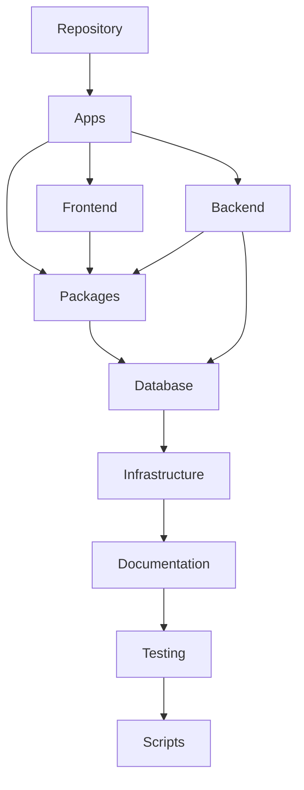
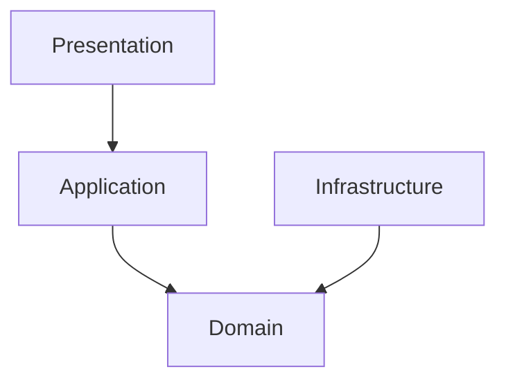
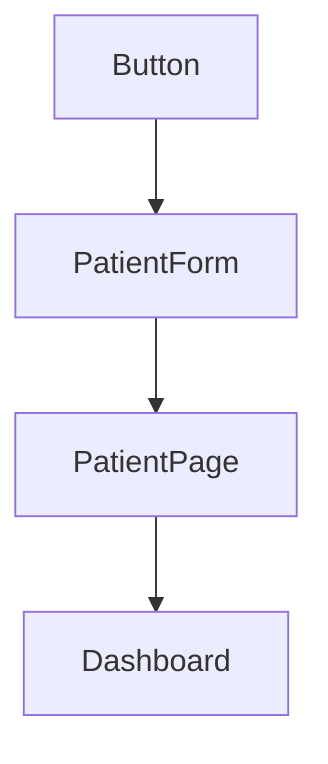
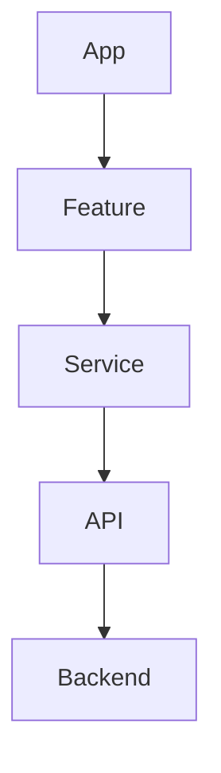
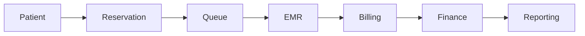

# Parakita Software Architecture Document (SAD)

# 04 - Project Structure

| Document Information | |
|----------------------|----------------------------------------------|
| Project | Parakita - Dental Clinic Management System |
| Document | 04 - Project Structure |
| Part | 1 of 5 |
| Version | 1.0.0 |
| Status | Draft |
| Document Type | Software Architecture Document (SAD) |
| Architecture Style | Clean Architecture + Domain Driven Design + Modular Monolith |
| Frontend | Next.js + TypeScript |
| Backend | Express.js + TypeScript |
| Last Updated | July 2026 |

---

# Table of Contents (Part 1)

1. Introduction
2. Purpose
3. Scope
4. Relationship with Other Documents
5. Project Organization Principles
6. Repository Strategy
7. Monorepo Structure
8. Repository Directory Overview
9. Development Workflow
10. Repository Governance

---

# 1. Introduction

## 1.1 Overview

Dokumen ini mendefinisikan standar organisasi project **Parakita** mulai dari tingkat repository hingga struktur direktori utama.

Apabila:

- **01-System Overview** menjelaskan kebutuhan bisnis,
- **02-System Architecture** menjelaskan desain arsitektur,
- **03-Clean Architecture** menjelaskan pola implementasi,

maka dokumen ini menjelaskan **bagaimana seluruh source code disusun secara fisik di dalam repository**.

Dengan adanya standar struktur project, seluruh developer akan menggunakan organisasi folder yang sama sehingga project tetap konsisten walaupun dikembangkan oleh banyak tim.

---

## 1.2 Background

Seiring bertambahnya jumlah module dan developer, struktur project yang tidak terorganisir akan menyebabkan berbagai permasalahan seperti:

- Sulit menemukan source code.
- Banyak folder memiliki fungsi yang tumpang tindih.
- Dependency antar module menjadi tidak jelas.
- Sulit melakukan code review.
- Onboarding developer baru membutuhkan waktu lebih lama.
- Risiko terjadinya circular dependency semakin besar.

Oleh karena itu Parakita menetapkan standar struktur project sejak awal pengembangan.

---

## 1.3 Objectives

Dokumen ini bertujuan untuk:

- Menstandarkan organisasi repository.
- Menentukan struktur folder frontend dan backend.
- Menentukan lokasi setiap jenis source code.
- Menjaga konsistensi implementasi antar developer.
- Mendukung Clean Architecture dan Domain Driven Design.
- Mempermudah maintenance jangka panjang.
- Mempermudah scaling project.

---

# 2. Purpose

Project Structure menjadi acuan resmi seluruh tim engineering dalam mengorganisasikan source code.

Dokumen ini memastikan bahwa:

- Seluruh module memiliki struktur yang seragam.
- Tidak terjadi duplikasi folder.
- Dependency antar module tetap terkontrol.
- Penempatan file selalu konsisten.
- Repository mudah dipahami oleh developer baru.

Dokumen ini merupakan **Implementation Standard** dan wajib diikuti pada seluruh proses pengembangan.

---

# 3. Scope

Dokumen ini membahas organisasi project pada level repository dan direktori utama.

Topik yang dicakup meliputi:

- Repository Layout
- Monorepo Structure
- Frontend Project
- Backend Project
- Shared Library
- Configuration
- Documentation
- Testing Directory
- Build Output
- Assets
- Environment
- Project Governance

Pembahasan detail mengenai struktur backend, frontend, dan module akan dijelaskan pada bagian selanjutnya.

---

# 4. Relationship with Other Documents

Dokumen Project Structure merupakan kelanjutan dari dokumen arsitektur sebelumnya.

```text
01-System Overview
        │
        ▼
Business Perspective

        │

02-System Architecture
        │
        ▼
Technical Architecture

        │

03-Clean Architecture
        │
        ▼
Implementation Guideline

        │

04-Project Structure
        │
        ▼
Repository Organization

        │

05-Coding Standard
        │
        ▼
Coding Convention
```

| Document | Focus |
|----------|--------------------------------------|
| 01-System Overview | Business Architecture |
| 02-System Architecture | Technical Architecture |
| 03-Clean Architecture | Clean Architecture Guideline |
| 04-Project Structure | Repository & Folder Organization |
| 05-Coding Standard | Coding Convention |

Project Structure menjadi penghubung antara desain arsitektur dan implementasi source code.

---

# 5. Project Organization Principles

Seluruh repository Parakita dibangun berdasarkan prinsip-prinsip berikut.

## 5.1 Consistency

Seluruh module menggunakan struktur folder yang sama sehingga developer dapat berpindah antar module tanpa harus mempelajari organisasi baru.

---

## 5.2 Separation of Concerns

Source code dipisahkan berdasarkan tanggung jawabnya.

Contoh:

- Frontend terpisah dari Backend.
- Dokumentasi terpisah dari implementasi.
- Konfigurasi dipisahkan dari Business Logic.
- Shared Library dipisahkan dari Domain Module.

---

## 5.3 Modular Organization

Setiap Business Domain ditempatkan sebagai module yang berdiri sendiri.

Contoh:

```text
Patient
Reservation
Queue
EMR
Billing
Finance
Warehouse
HR
Reporting
System
```

Masing-masing module memiliki struktur internal yang konsisten dan independen.

---

## 5.4 Scalability

Struktur project dirancang agar tetap mudah dikelola ketika jumlah source code berkembang menjadi puluhan hingga ratusan ribu baris.

Organisasi folder tidak bergantung pada ukuran project saat ini, tetapi telah dipersiapkan untuk kebutuhan jangka panjang.

---

## 5.5 Maintainability

Seluruh developer harus dapat:

- menemukan file dengan cepat,
- memahami lokasi implementasi,
- melakukan perubahan tanpa memengaruhi module lain.

---

## 5.6 Technology Independence

Organisasi repository tidak bergantung pada framework tertentu.

Apabila di masa depan Express.js, Next.js, atau ORM diganti, struktur project tetap dapat dipertahankan dengan perubahan minimal.

---

# 6. Repository Strategy

## 6.1 Repository Model

Parakita menggunakan pendekatan **Monorepo**.

Seluruh komponen aplikasi berada dalam satu repository sehingga versioning, development, dan deployment dapat dikelola secara terpusat.

Keuntungan pendekatan ini antara lain:

- Konsistensi versi.
- Dependency lebih mudah dikelola.
- Refactoring lintas aplikasi lebih aman.
- Dokumentasi selalu selaras dengan implementasi.
- CI/CD lebih sederhana.

---

## 6.2 High Level Repository

```text
Parakita Repository
│
├── Frontend Application
├── Backend Application
├── Shared Library
├── Documentation
├── Database
├── Infrastructure
├── Scripts
├── Testing
└── Configuration
```

Seluruh komponen berada dalam satu repository namun tetap dipisahkan berdasarkan tanggung jawab masing-masing.

---

# 7. Monorepo Structure

Struktur repository tingkat atas ditetapkan sebagai berikut.

```text
parakita/

├── apps/
│   ├── frontend/
│   └── backend/
│
├── packages/
│   ├── shared/
│   ├── ui/
│   ├── config/
│   ├── types/
│   └── utils/
│
├── docs/
│
├── database/
│
├── infrastructure/
│
├── scripts/
│
├── tests/
│
├── .github/
│
├── .env.example
├── package.json
├── tsconfig.base.json
├── turbo.json          (optional)
└── README.md
```

Setiap direktori memiliki tanggung jawab yang jelas dan tidak boleh digunakan di luar ruang lingkupnya.

---

# 8. Repository Directory Overview

| Directory | Responsibility |
|-----------|------------------------------------------------|
| apps | Source code aplikasi utama |
| packages | Shared library yang digunakan bersama |
| docs | Dokumentasi proyek dan arsitektur |
| database | Schema, migration, dan seed database |
| infrastructure | Docker, deployment, monitoring |
| scripts | Automation script |
| tests | Integration & End-to-End Testing |
| .github | CI/CD Workflow |
| package.json | Workspace dependency |
| tsconfig.base.json | Shared TypeScript configuration |

Diagram hubungan direktori utama:



---

# 9. Development Workflow

Seluruh pengembangan mengikuti alur berikut.

```text
Requirement

↓

Architecture

↓

Project Structure

↓

Module Development

↓

Testing

↓

Code Review

↓

CI/CD

↓

Deployment
```

Dengan alur ini, struktur project selalu menjadi fondasi sebelum implementasi dimulai.

---

# 10. Repository Governance

Untuk menjaga konsistensi repository, seluruh developer wajib mengikuti aturan berikut.

### Repository Rules

- Tidak membuat folder baru tanpa kebutuhan yang jelas.
- Tidak menyimpan Business Logic di luar module yang sesuai.
- Tidak mencampurkan source code dengan dokumentasi.
- Tidak menyimpan file hasil build ke dalam repository.
- Tidak melakukan duplikasi utility yang sudah tersedia pada Shared Library.

### Review Checklist

Sebelum Pull Request disetujui, reviewer harus memastikan:

- Struktur folder sesuai standar.
- Lokasi file sudah benar.
- Tidak ada circular dependency.
- Tidak ada folder yang tidak digunakan.
- Tidak ada source code yang melanggar struktur project.

---

# Summary Part 1

Part 1 mendefinisikan fondasi organisasi repository Parakita, mulai dari tujuan, prinsip penyusunan project, strategi Monorepo, struktur direktori tingkat atas, hingga tata kelola repository.

Bagian ini menjadi acuan utama bagi seluruh tim engineering sebelum membahas struktur Backend, Frontend, Shared Library, serta standar organisasi module pada bagian berikutnya.

# Parakita Software Architecture Document (SAD)

# 04 - Project Structure

| Document Information | |
|----------------------|----------------------------------------------|
| Project | Parakita - Dental Clinic Management System |
| Document | 04 - Project Structure |
| Part | 2 of 5 |
| Version | 1.0.0 |
| Status | Draft |
| Document Type | Software Architecture Document (SAD) |
| Architecture Style | Clean Architecture + Domain Driven Design + Modular Monolith |
| Backend | Express.js + TypeScript |
| Last Updated | July 2026 |

---

# Table of Contents (Part 2)

11. Backend Project Structure
12. Backend Layer Organization
13. Backend Module Structure
14. Shared Backend Components
15. Infrastructure Organization
16. Configuration Structure
17. Module Registration
18. Backend Dependency Rules
19. Backend Directory Standards
20. Summary

---

# 11. Backend Project Structure

## 11.1 Overview

Backend Parakita dibangun menggunakan **Express.js**, **TypeScript**, **Clean Architecture**, **Domain Driven Design (DDD)**, dan **Modular Monolith**.

Seluruh Business Domain dipisahkan menjadi module independen sehingga setiap domain memiliki batas tanggung jawab (Bounded Context) yang jelas.

Struktur backend dirancang agar:

- mudah dipelihara,
- mudah diuji,
- mudah dikembangkan,
- siap dipecah menjadi Microservices di masa depan.

---

## 11.2 Backend Directory Layout

```text
backend/

├── src/
│
├── modules/
│
├── shared/
│
├── infrastructure/
│
├── config/
│
├── bootstrap/
│
├── routes/
│
├── middleware/
│
├── database/
│
├── tests/
│
├── app.ts
└── server.ts
```

Direktori di atas merupakan struktur standar yang wajib digunakan oleh seluruh Backend Developer.

---

## 11.3 Responsibility Matrix

| Directory | Responsibility |
|------------|---------------------------------------------|
| src | Entry point aplikasi |
| modules | Business Domain |
| shared | Komponen bersama |
| infrastructure | Implementasi teknologi |
| config | Konfigurasi aplikasi |
| bootstrap | Inisialisasi aplikasi |
| routes | Global Route |
| middleware | Middleware global |
| database | Database & ORM |
| tests | Unit & Integration Test |

---

# 12. Backend Layer Organization

Seluruh backend mengikuti struktur Clean Architecture.

```text
Backend

│

├── Presentation Layer

├── Application Layer

├── Domain Layer

└── Infrastructure Layer
```

---

## 12.1 Layer Mapping

| Layer | Location |
|--------|--------------------------|
| Presentation | modules/*/presentation |
| Application | modules/*/application |
| Domain | modules/*/domain |
| Infrastructure | modules/*/infrastructure |

---

## 12.2 Layer Dependency



Dependency hanya diperbolehkan mengikuti arah di atas.

---

# 13. Backend Module Structure

Setiap Business Module wajib memiliki struktur folder yang identik.

Contoh menggunakan module **Patient**.

```text
modules/

└── patient/

    ├── presentation/

    ├── application/

    ├── domain/

    ├── infrastructure/

    ├── index.ts

    └── README.md
```

---

## 13.1 Presentation Layer

```text
presentation/

├── controllers/

├── routes/

├── dto/

├── validators/

├── requests/

├── responses/

└── middlewares/
```

Presentation Layer bertanggung jawab terhadap:

- HTTP Request
- Controller
- DTO
- Validation
- Response Mapping

Presentation Layer **tidak boleh** berisi Business Logic.

---

## 13.2 Application Layer

```text
application/

├── use-cases/

├── services/

├── commands/

├── queries/

├── mappers/

├── handlers/

└── events/
```

Application Layer mengatur:

- Business Flow
- Transaction Flow
- Use Case
- Publish Event
- Coordination Repository

---

## 13.3 Domain Layer

```text
domain/

├── entities/

├── value-objects/

├── repositories/

├── services/

├── events/

├── exceptions/

├── specifications/

└── interfaces/
```

Domain Layer hanya berisi Business Rule.

Tidak diperbolehkan menggunakan:

- Express
- Prisma
- Database
- HTTP Request
- HTTP Response

---

## 13.4 Infrastructure Layer

```text
infrastructure/

├── persistence/

├── repositories/

├── orm/

├── storage/

├── integrations/

├── event-bus/

└── cache/
```

Infrastructure menangani seluruh komunikasi dengan resource eksternal.

---

## 13.5 Complete Module Structure

```text
patient/

├── presentation/
│
│   ├── controllers/
│   ├── routes/
│   ├── dto/
│   ├── validators/
│   ├── requests/
│   └── responses/
│
├── application/
│
│   ├── use-cases/
│   ├── services/
│   ├── commands/
│   ├── queries/
│   ├── handlers/
│   └── events/
│
├── domain/
│
│   ├── entities/
│   ├── value-objects/
│   ├── repositories/
│   ├── services/
│   ├── events/
│   ├── exceptions/
│   └── specifications/
│
├── infrastructure/
│
│   ├── repositories/
│   ├── persistence/
│   ├── storage/
│   ├── integrations/
│   └── cache/
│
├── index.ts
└── README.md
```

Seluruh module wajib mengikuti struktur tersebut.

---

# 14. Shared Backend Components

Komponen yang digunakan bersama ditempatkan pada folder **shared**.

```text
shared/

├── auth/

├── audit/

├── cache/

├── constants/

├── decorators/

├── dto/

├── enums/

├── errors/

├── events/

├── exceptions/

├── interfaces/

├── logger/

├── pagination/

├── response/

├── security/

├── types/

├── utils/

└── validation/
```

---

## 14.1 Shared Principle

Shared hanya berisi komponen yang benar-benar digunakan oleh lebih dari satu module.

Tidak diperbolehkan menaruh Business Logic pada folder ini.

---

# 15. Infrastructure Organization

Infrastructure berisi implementasi teknologi yang digunakan oleh seluruh aplikasi.

```text
infrastructure/

├── database/

├── prisma/

├── storage/

├── cache/

├── email/

├── queue/

├── scheduler/

├── event-bus/

├── monitoring/

├── logging/

└── external-services/
```

---

## 15.1 Infrastructure Responsibility

Infrastructure menangani:

- Prisma Client
- Object Storage
- SMTP
- Redis
- Queue
- Event Bus
- Logging
- Monitoring
- Third Party API

---

# 16. Configuration Structure

Seluruh konfigurasi aplikasi dipisahkan dari Business Logic.

```text
config/

├── app.config.ts

├── database.config.ts

├── auth.config.ts

├── storage.config.ts

├── mail.config.ts

├── cors.config.ts

├── cache.config.ts

├── logger.config.ts

└── index.ts
```

---

## Configuration Principle

- Tidak ada hardcoded configuration.
- Menggunakan Environment Variable.
- Mudah diganti tanpa rebuild aplikasi.

---

# 17. Module Registration

Setiap module memiliki entry point sendiri.

Contoh:

```text
modules/

├── patient/
│
│   └── index.ts
│
├── reservation/
│
│   └── index.ts
│
├── emr/
│
│   └── index.ts
```

Seluruh module kemudian diregistrasikan pada bootstrap aplikasi.

```text
Bootstrap

↓

Register Module

↓

Initialize Route

↓

Initialize Dependency

↓

Application Ready
```

Pendekatan ini memudahkan penambahan module baru tanpa mengubah struktur aplikasi secara signifikan.

---

# 18. Backend Dependency Rules

Untuk menjaga konsistensi Clean Architecture, dependency antar folder harus mengikuti aturan berikut.

| Source | Allowed Dependency |
|---------|--------------------|
| Presentation | Application |
| Application | Domain |
| Infrastructure | Domain |
| Shared | Tidak bergantung pada Module |
| Module | Shared |
| Bootstrap | Semua Module |

---

## Forbidden Dependency

Berikut dependency yang tidak diperbolehkan.

```text
Controller

→ Prisma ❌

Controller

→ Database ❌

Domain

→ Express ❌

Domain

→ ORM ❌

Repository

→ Controller ❌
```

---

# 19. Backend Directory Standards

Setiap folder harus memiliki fungsi yang jelas.

| Folder | Standard |
|----------|----------------------------------------|
| controllers | Satu controller per resource |
| dto | Request & Response DTO |
| validators | Input Validation |
| use-cases | Satu Use Case per file |
| entities | Satu Entity per file |
| repositories | Interface atau Implementation |
| services | Domain/Application Service |
| events | Domain Event |
| exceptions | Custom Exception |
| integrations | Third Party Integration |

---

## Backend Naming Convention

```text
CreatePatientUseCase.ts

PatientController.ts

PatientRepository.ts

PatientEntity.ts

PatientCreatedEvent.ts

PatientValidator.ts
```

Seluruh penamaan menggunakan **PascalCase** untuk class/file utama agar konsisten di seluruh project.

---

# 20. Summary

Part 2 mendefinisikan struktur lengkap Backend Project Parakita, mulai dari organisasi direktori, pembagian layer Clean Architecture, struktur standar setiap Business Module, komponen bersama (Shared), Infrastructure, Configuration, hingga aturan dependency dan standar penamaan.

Dokumen ini menjadi acuan utama bagi seluruh Backend Developer agar implementasi setiap module memiliki struktur yang konsisten, mudah dipelihara, mudah diuji, dan siap berkembang seiring bertambahnya kompleksitas sistem.


# Parakita Software Architecture Document (SAD)

# 04 - Project Structure

| Document Information | |
|----------------------|----------------------------------------------|
| Project | Parakita - Dental Clinic Management System |
| Document | 04 - Project Structure |
| Part | 3 of 5 |
| Version | 1.0.0 |
| Status | Draft |
| Document Type | Software Architecture Document (SAD) |
| Architecture Style | Clean Architecture + Domain Driven Design + Modular Monolith |
| Frontend | Next.js + TypeScript |
| Last Updated | July 2026 |

---

# Table of Contents (Part 3)

21. Frontend Project Structure
22. Frontend Layer Organization
23. Feature Module Structure
24. Shared Frontend Components
25. UI Component Organization
26. State Management Structure
27. API Service Structure
28. Assets Organization
29. Frontend Dependency Rules
30. Summary

---

# 21. Frontend Project Structure

## 21.1 Overview

Frontend Parakita dibangun menggunakan:

- Next.js (App Router)
- TypeScript
- React
- Tailwind CSS
- TanStack Query
- Zustand

Walaupun frontend tidak menerapkan Clean Architecture secara ketat seperti backend, struktur project tetap mengadopsi prinsip:

- Separation of Concerns
- Feature-Based Organization
- Reusable Components
- Modular Development

Pendekatan ini memastikan source code tetap mudah dipelihara ketika aplikasi berkembang menjadi ratusan halaman.

---

## 21.2 Frontend Directory Layout

```text
frontend/

├── app/
├── features/
├── components/
├── hooks/
├── services/
├── stores/
├── lib/
├── styles/
├── public/
├── types/
├── utils/
├── config/
├── middleware.ts
└── next.config.ts
```

---

## 21.3 Responsibility Matrix

| Directory | Responsibility |
|------------|--------------------------------|
| app | App Router |
| features | Business Feature |
| components | Shared UI Components |
| hooks | Custom React Hooks |
| services | API Communication |
| stores | Global State |
| lib | Third-party Wrapper |
| styles | Global Style |
| public | Static Assets |
| types | Shared TypeScript Types |
| utils | Utility Functions |
| config | Frontend Configuration |

---

# 22. Frontend Layer Organization

Frontend dipisahkan menjadi beberapa layer logis.

```text
UI Layer

↓

Feature Layer

↓

Service Layer

↓

API Layer
```

---

## 22.1 Layer Description

| Layer | Responsibility |
|--------|----------------|
| UI | Rendering |
| Feature | Business Feature |
| Service | API Interaction |
| API | HTTP Client |

---

## 22.2 Request Flow

```mermaid
flowchart TD

Page

-->

Feature

-->

Service

-->

API Client

-->

Backend API
```

---

## 22.3 Layer Principle

UI tidak boleh mengakses API secara langsung.

Seluruh komunikasi harus melalui Service Layer.

```text
Component

↓

Service

↓

API Client

↓

Backend
```

Pendekatan ini menjaga konsistensi implementasi seluruh aplikasi.

---

# 23. Feature Module Structure

Seluruh fitur frontend mengikuti struktur yang sama.

Contoh menggunakan module **Patient**.

```text
features/

└── patient/

    ├── components/

    ├── pages/

    ├── hooks/

    ├── services/

    ├── types/

    ├── utils/

    └── index.ts
```

---

## 23.1 Components

Berisi komponen UI yang hanya digunakan oleh feature tersebut.

Contoh:

```text
PatientForm

PatientCard

PatientTable

PatientFilter

PatientHistory
```

---

## 23.2 Hooks

Hook khusus untuk feature.

```text
usePatients()

usePatient()

useCreatePatient()

useUpdatePatient()
```

---

## 23.3 Services

Seluruh komunikasi API untuk feature.

```text
patient.service.ts

patient.query.ts

patient.mutation.ts
```

Service tidak boleh berisi rendering UI.

---

## 23.4 Types

TypeScript Interface dan Type.

```text
Patient.ts

PatientDTO.ts

PatientResponse.ts
```

---

## 23.5 Utilities

Helper yang hanya digunakan oleh feature tersebut.

```text
patientFormatter.ts

patientValidator.ts
```

---

## 23.6 Complete Feature Structure

```text
patient/

├── components/
│
├── hooks/
│
├── pages/
│
├── services/
│
├── types/
│
├── utils/
│
└── index.ts
```

---

# 24. Shared Frontend Components

Komponen yang digunakan lebih dari satu feature ditempatkan pada folder **components**.

```text
components/

├── layout/

├── navigation/

├── form/

├── table/

├── modal/

├── dialog/

├── card/

├── button/

├── badge/

├── avatar/

├── input/

├── dropdown/

├── calendar/

├── loading/

├── empty-state/

├── charts/

└── icons/
```

---

## 24.1 Shared Principle

Komponen Shared harus:

- Reusable
- Generic
- Tidak bergantung pada Business Module
- Tidak memanggil API secara langsung

---

# 25. UI Component Organization

Komponen UI dibagi berdasarkan tingkat penggunaannya.

```text
Component

│

├── Primitive Component

├── Composite Component

├── Feature Component

└── Page Component
```

---

## 25.1 Component Hierarchy



---

## 25.2 Component Classification

| Level | Example |
|---------|------------------------|
| Primitive | Button |
| Basic | Input |
| Composite | Search Filter |
| Feature | Patient Form |
| Page | Patient Page |

---

# 26. State Management Structure

State dibedakan berdasarkan cakupan penggunaannya.

```text
stores/

├── auth.store.ts

├── ui.store.ts

├── notification.store.ts

├── sidebar.store.ts

└── theme.store.ts
```

---

## 26.1 State Categories

| Category | Example |
|----------|--------------------------|
| Global | Authentication |
| Global | Theme |
| Global | Sidebar |
| Feature | Patient Filter |
| Local | Modal State |

---

## 26.2 State Principle

Gunakan state sekecil mungkin.

Prioritas penggunaan:

1. Local State
2. URL State
3. TanStack Query
4. Zustand Global Store

State global hanya digunakan apabila benar-benar dibutuhkan lintas halaman.

---

# 27. API Service Structure

Seluruh komunikasi API dipusatkan pada folder **services**.

```text
services/

├── api/

├── auth/

├── patient/

├── reservation/

├── emr/

├── billing/

├── finance/

├── warehouse/

├── reporting/

└── system/
```

---

## 27.1 API Client

```text
services/

└── api/

    ├── client.ts

    ├── interceptor.ts

    ├── auth.ts

    └── response.ts
```

---

## 27.2 Service Responsibility

Service bertanggung jawab terhadap:

- HTTP Request
- Token Management
- Error Mapping
- API Response
- File Upload

Service tidak boleh melakukan rendering UI.

---

# 28. Assets Organization

Static asset ditempatkan pada folder **public**.

```text
public/

├── images/

├── icons/

├── illustrations/

├── logo/

├── favicon/

└── fonts/
```

---

## 28.1 Styles Organization

```text
styles/

├── globals.css

├── variables.css

├── typography.css

├── animation.css

└── theme.css
```

---

## 28.2 Utility Structure

```text
utils/

├── formatter/

├── validators/

├── date/

├── currency/

├── string/

├── file/

└── helpers/
```

Utility harus bersifat umum dan tidak bergantung pada Business Module.

---

# 29. Frontend Dependency Rules

Dependency antar folder mengikuti aturan berikut.



---

## 29.1 Allowed Dependency

| Source | Can Access |
|----------|-------------------------|
| App | Feature |
| Feature | Service |
| Feature | Shared Component |
| Service | API Client |
| Shared Component | Utility |
| Hook | Service |

---

## 29.2 Forbidden Dependency

Berikut dependency yang tidak diperbolehkan.

```text
Page

→ Axios ❌

Component

→ Fetch API ❌

Component

→ Local Storage ❌

Shared Component

→ Business Module ❌

Utility

→ React Component ❌
```

---

## 29.3 Naming Convention

```text
PatientForm.tsx

PatientTable.tsx

usePatient.ts

patient.service.ts

patient.query.ts

patient.types.ts

patient.utils.ts
```

Standar ini menjaga konsistensi seluruh project frontend.

---

# 30. Summary

Part 3 mendefinisikan struktur lengkap Frontend Project Parakita, meliputi organisasi direktori Next.js, pembagian layer aplikasi, struktur Feature Module, komponen bersama (Shared Components), State Management, API Service, Assets, serta aturan dependency antar folder.

Dengan standar ini, seluruh Frontend Developer memiliki acuan yang konsisten dalam membangun fitur baru, menjaga keterpisahan tanggung jawab, meningkatkan reusability komponen, dan memastikan struktur aplikasi tetap mudah dipelihara seiring bertambahnya kompleksitas sistem.


# Parakita Software Architecture Document (SAD)

# 04 - Project Structure

| Document Information | |
|----------------------|----------------------------------------------|
| Project | Parakita - Dental Clinic Management System |
| Document | 04 - Project Structure |
| Part | 4 of 5 |
| Version | 1.0.0 |
| Status | Draft |
| Document Type | Software Architecture Document (SAD) |
| Architecture Style | Clean Architecture + Domain Driven Design + Modular Monolith |
| Last Updated | July 2026 |

---

# Table of Contents (Part 4)

31. Naming Convention
32. File Organization Standards
33. Import Rules
34. Dependency Rules
35. Module Template
36. Shared Package Standards
37. Project Scalability Guidelines
38. Architecture Compliance Checklist
39. Summary

---

# 31. Naming Convention

## 31.1 Overview

Seluruh source code Parakita wajib mengikuti standar penamaan yang konsisten.

Standar ini bertujuan untuk:

- meningkatkan readability,
- mempermudah pencarian file,
- mengurangi inkonsistensi,
- mempermudah proses code review.

---

## 31.2 General Naming Rules

| Item | Convention | Example |
|-------|------------|---------------------------|
| Folder | kebab-case | patient-history |
| File Utility | kebab-case | date-helper.ts |
| React Component | PascalCase | PatientCard.tsx |
| Class | PascalCase | PatientService |
| Interface | PascalCase | PatientRepository |
| Type | PascalCase | PatientResponse |
| Enum | PascalCase | PaymentStatus |
| Function | camelCase | createPatient() |
| Variable | camelCase | patientName |
| Constant | UPPER_SNAKE_CASE | MAX_UPLOAD_SIZE |
| Environment | UPPER_SNAKE_CASE | DATABASE_URL |

---

## 31.3 Backend Naming

### Entity

```text
Patient.ts

Reservation.ts

Invoice.ts
```

---

### Repository

```text
PatientRepository.ts

InvoiceRepository.ts
```

---

### Use Case

```text
CreatePatientUseCase.ts

UpdatePatientUseCase.ts

DeletePatientUseCase.ts
```

---

### Controller

```text
PatientController.ts

BillingController.ts
```

---

### Event

```text
PatientCreatedEvent.ts

InvoicePaidEvent.ts
```

---

### DTO

```text
CreatePatientRequest.ts

CreatePatientResponse.ts
```

---

## 31.4 Frontend Naming

### Component

```text
PatientCard.tsx

PatientTable.tsx

PaymentDialog.tsx
```

---

### Hook

```text
usePatient.ts

useInvoice.ts

useReservation.ts
```

---

### Store

```text
auth.store.ts

theme.store.ts

sidebar.store.ts
```

---

### Service

```text
patient.service.ts

billing.service.ts
```

---

### Query

```text
patient.query.ts

invoice.query.ts
```

---

### Mutation

```text
patient.mutation.ts

billing.mutation.ts
```

---

# 32. File Organization Standards

## 32.1 One Responsibility Per File

Setiap file hanya memiliki satu tanggung jawab.

Contoh:

```text
PatientController.ts

↓

Hanya berisi PatientController
```

Tidak diperbolehkan:

```text
PatientController

InvoiceController

ReservationController
```

berada dalam satu file.

---

## 32.2 One Primary Class Per File

```text
CreatePatientUseCase.ts

↓

class CreatePatientUseCase
```

Nama file harus sama dengan class utama yang dikandungnya.

---

## 32.3 One Component Per File

```text
PatientCard.tsx

↓

PatientCard Component
```

---

## 32.4 Folder Grouping

Folder dikelompokkan berdasarkan tanggung jawab, bukan berdasarkan tipe teknologi.

Benar:

```text
patient/

reservation/

billing/
```

Kurang disarankan:

```text
controllers/

models/

services/

routes/
```

untuk keseluruhan aplikasi karena akan menghasilkan folder yang sangat besar dan sulit dikelola.

---

# 33. Import Rules

## 33.1 Overview

Seluruh import harus mengikuti arah dependency yang telah ditetapkan oleh Clean Architecture.

Import yang melanggar dependency dianggap sebagai pelanggaran arsitektur.

---

## 33.2 Allowed Import

```text
Presentation

↓

Application

↓

Domain
```

Infrastructure boleh mengakses Domain.

---

## 33.3 Forbidden Import

Tidak diperbolehkan:

```text
Domain

↓

Express
```

```text
Domain

↓

Prisma
```

```text
Controller

↓

Prisma
```

```text
Shared Component

↓

Business Module
```

---

## 33.4 Absolute Import

Gunakan alias path dibanding relative import yang panjang.

Benar:

```typescript
import { Patient } from "@/modules/patient/domain/entities";
```

Kurang disarankan:

```typescript
import { Patient } from "../../../../../../modules/patient/domain/entities";
```

---

## 33.5 Import Order

Gunakan urutan berikut.

```text
1. Node Module

2. Third Party Library

3. Internal Shared Library

4. Module

5. Relative Import
```

Contoh:

```typescript
import fs from "node:fs";

import express from "express";

import { logger } from "@/shared/logger";

import { PatientService } from "@/modules/patient";

import "./styles.css";
```

---

# 34. Dependency Rules

## 34.1 Module Dependency

Hubungan antar module mengikuti prinsip **Loose Coupling**.



---

## 34.2 Dependency Principle

Setiap module:

- memiliki Domain sendiri,
- memiliki Repository sendiri,
- memiliki Use Case sendiri,
- memiliki Event sendiri.

Tidak diperbolehkan mengakses database module lain secara langsung.

---

## 34.3 Shared Dependency

Seluruh module boleh menggunakan:

```text
shared/

config/

utils/

types/

constants/
```

Namun Shared tidak boleh mengetahui Business Module.

---

## 34.4 Circular Dependency

Circular dependency tidak diperbolehkan.

Salah:

```text
Patient

↓

Billing

↓

Finance

↓

Patient
```

Benar:

```text
Patient

↓

Billing

↓

Finance
```

atau menggunakan Domain Event sebagai mekanisme komunikasi.

---

## 34.5 Cross Module Communication

Komunikasi lintas module hanya melalui:

- Public Application Service
- Domain Event
- Shared Contract
- Shared DTO

Tidak diperbolehkan mengakses internal folder module lain.

---

# 35. Module Template

Seluruh module baru wajib mengikuti template berikut.

```text
module-name/

├── presentation/
│
│   ├── controllers/
│   ├── routes/
│   ├── dto/
│   ├── validators/
│   └── responses/
│
├── application/
│
│   ├── use-cases/
│   ├── services/
│   ├── commands/
│   ├── queries/
│   └── events/
│
├── domain/
│
│   ├── entities/
│   ├── repositories/
│   ├── services/
│   ├── events/
│   ├── exceptions/
│   └── value-objects/
│
├── infrastructure/
│
│   ├── repositories/
│   ├── persistence/
│   ├── integrations/
│   └── cache/
│
├── index.ts
│
└── README.md
```

---

## Module Development Checklist

Sebelum sebuah module dinyatakan selesai, pastikan telah memiliki:

- Presentation Layer
- Application Layer
- Domain Layer
- Infrastructure Layer
- Repository Interface
- Repository Implementation
- DTO
- Validation
- Unit Test
- Integration Test
- README Module

---

# 36. Shared Package Standards

Shared Package hanya berisi kode yang digunakan oleh lebih dari satu module.

Contoh:

```text
shared/

├── auth/

├── cache/

├── constants/

├── enums/

├── errors/

├── logger/

├── response/

├── security/

├── types/

├── utils/

└── validation/
```

---

## Shared Package Rules

Shared Package tidak boleh berisi:

- Business Logic
- Business Entity
- Business Validation
- Business Service
- Domain Rule

Shared Package hanya berisi komponen umum.

---

# 37. Project Scalability Guidelines

Struktur project dirancang agar tetap stabil ketika jumlah module bertambah.

Target yang dapat didukung:

| Item | Capacity |
|------|---------:|
| Business Module | >50 |
| Source Files | >10.000 |
| REST Endpoint | >1.000 |
| Developer | >100 |
| Workspace | Multi Team |

---

## Future Expansion

Apabila di masa depan dibutuhkan Microservices, maka setiap module dapat dipindahkan menjadi repository terpisah dengan perubahan minimal karena struktur internalnya telah independen.

---

# 38. Architecture Compliance Checklist

Sebelum Pull Request disetujui, reviewer harus memverifikasi hal berikut.

| Checklist | Status |
|------------|--------|
| Struktur folder sesuai standar | □ |
| Naming Convention sesuai | □ |
| Tidak ada Circular Dependency | □ |
| Tidak ada Business Logic di Controller | □ |
| Tidak ada ORM pada Domain | □ |
| Tidak ada duplikasi Utility | □ |
| Shared Package digunakan dengan benar | □ |
| Layer Clean Architecture dipatuhi | □ |
| Unit Test tersedia | □ |
| Documentation diperbarui | □ |

Checklist ini menjadi bagian dari proses Code Review dan Quality Assurance.

---

# 39. Summary

Part 4 menetapkan standar implementasi struktur project pada level source code, meliputi aturan penamaan (Naming Convention), organisasi file, aturan import, dependency antar module, template module baru, standar Shared Package, serta checklist kepatuhan arsitektur.

Dengan mengikuti standar ini, seluruh repository Parakita akan memiliki struktur yang konsisten, mudah dipahami, mudah dipelihara, dan siap berkembang menjadi sistem berskala enterprise tanpa kehilangan kualitas implementasi maupun konsistensi arsitektur.

# Parakita Software Architecture Document (SAD)

# 04 - Project Structure

| Document Information | |
|----------------------|----------------------------------------------|
| Project | Parakita - Dental Clinic Management System |
| Document | 04 - Project Structure |
| Part | 5 of 5 |
| Version | 1.0.0 |
| Status | Draft |
| Document Type | Software Architecture Document (SAD) |
| Architecture Style | Clean Architecture + Domain Driven Design + Modular Monolith |
| Frontend | Next.js + TypeScript |
| Backend | Express.js + TypeScript |
| Last Updated | July 2026 |

---

# Table of Contents (Part 5)

40. Documentation Structure
41. Testing Structure
42. Environment Structure
43. Build & Deployment Structure
44. Logging & Monitoring Structure
45. Repository Maintenance
46. Best Practices
47. Future Evolution
48. Conclusion

---

# 40. Documentation Structure

## 40.1 Overview

Dokumentasi merupakan bagian dari source code dan harus dikelola bersama repository.

Seluruh dokumentasi teknis ditempatkan pada folder **docs/** sehingga mudah ditemukan dan selalu sinkron dengan implementasi aplikasi.

---

## 40.2 Documentation Directory

```text
docs/

├── architecture/
│
├── api/
│
├── database/
│
├── deployment/
│
├── guides/
│
├── decisions/
│
├── modules/
│
├── changelog/
│
└── README.md
```

---

## 40.3 Documentation Responsibility

| Directory | Purpose |
|-----------|-------------------------------|
| architecture | Software Architecture Document |
| api | API Specification |
| database | ERD & Database Design |
| deployment | Deployment Guide |
| guides | Developer Guide |
| decisions | Architecture Decision Record (ADR) |
| modules | Business Module Documentation |
| changelog | Release Notes |

---

## 40.4 Documentation Principle

Setiap perubahan besar pada arsitektur, struktur project, maupun Business Module harus diikuti dengan pembaruan dokumentasi.

Dokumentasi dianggap sebagai bagian dari proses pengembangan dan wajib direview bersama source code.

---

# 41. Testing Structure

## 41.1 Overview

Seluruh pengujian ditempatkan pada struktur yang konsisten agar mudah dipelihara dan diintegrasikan dengan proses Continuous Integration (CI).

---

## 41.2 Testing Directory

```text
tests/

├── unit/

├── integration/

├── contract/

├── e2e/

├── fixtures/

├── mocks/

├── factories/

└── helpers/
```

---

## 41.3 Testing Scope

| Test Type | Purpose |
|------------|--------------------------------|
| Unit Test | Menguji fungsi dan class |
| Integration Test | Menguji integrasi antar layer |
| Contract Test | Memastikan kontrak API tetap konsisten |
| End-to-End Test | Menguji alur bisnis dari awal hingga akhir |

---

## 41.4 Test Data

Data pengujian dipisahkan dari implementasi utama.

```text
fixtures/

patients.json

reservation.json

invoice.json
```

---

## 41.5 Testing Principle

- Test tidak boleh bergantung pada data produksi.
- Test harus dapat dijalankan secara independen.
- Setiap Use Case memiliki Unit Test.
- Endpoint utama memiliki Integration Test.
- Business Flow utama memiliki End-to-End Test.

---

# 42. Environment Structure

## 42.1 Environment Files

Konfigurasi aplikasi dipisahkan berdasarkan lingkungan (environment).

```text
.env

.env.local

.env.development

.env.test

.env.staging

.env.production

.env.example
```

---

## 42.2 Environment Variables

Contoh kategori konfigurasi.

```text
Application

Database

Authentication

Storage

Email

Cache

Queue

Monitoring

Logging

Security
```

---

## 42.3 Environment Principle

- Tidak ada kredensial yang di-hardcode.
- File `.env.example` wajib diperbarui ketika ada variabel baru.
- Nilai sensitif tidak boleh dikomit ke repository.

---

# 43. Build & Deployment Structure

## 43.1 Infrastructure Directory

Seluruh kebutuhan deployment ditempatkan pada folder **infrastructure/**.

```text
infrastructure/

├── docker/

├── nginx/

├── kubernetes/

├── terraform/

├── monitoring/

├── logging/

├── backup/

└── scripts/
```

---

## 43.2 Build Output

Hasil build dipisahkan dari source code.

Contoh:

```text
backend/

dist/

frontend/

.next/

coverage/
```

Direktori hasil build tidak boleh disimpan ke dalam Git.

---

## 43.3 CI/CD Pipeline

```mermaid
flowchart LR

Developer

-->

Git Repository

-->

CI Pipeline

-->

Build

-->

Unit Test

-->

Integration Test

-->

Artifact

-->

Deployment

-->

Production
```

---

## 43.4 Deployment Principle

Pipeline deployment harus bersifat:

- Automated
- Repeatable
- Traceable
- Versioned
- Reversible (Rollback)

---

# 44. Logging & Monitoring Structure

## 44.1 Logging

Seluruh aktivitas aplikasi dicatat menggunakan mekanisme logging yang terpusat.

Kategori log:

```text
Application Log

Audit Log

Access Log

Error Log

Security Log
```

---

## 44.2 Monitoring

Monitoring digunakan untuk menjaga stabilitas aplikasi.

Komponen yang dipantau meliputi:

- API Availability
- Database
- Queue
- Background Job
- Storage
- Memory Usage
- CPU Usage
- Response Time

---

## 44.3 Monitoring Directory

```text
monitoring/

├── dashboards/

├── alerts/

├── metrics/

└── health-check/
```

---

# 45. Repository Maintenance

## 45.1 Repository Health

Repository harus dijaga agar tetap bersih dan mudah dipelihara.

Aktivitas yang dilakukan secara berkala:

- Menghapus kode yang tidak digunakan.
- Menghapus dependency yang sudah tidak dipakai.
- Memperbarui package.
- Memastikan dokumentasi tetap relevan.
- Melakukan refactoring sesuai kebutuhan.

---

## 45.2 Git Ignore

Direktori berikut tidak boleh disimpan ke repository.

```text
node_modules/

dist/

.next/

coverage/

logs/

tmp/

.cache/
```

---

## 45.3 Pull Request Checklist

Sebelum Pull Request dibuat, developer harus memastikan:

- Build berhasil.
- Lint tidak menghasilkan error.
- Seluruh test lulus.
- Dokumentasi diperbarui.
- Struktur folder sesuai standar.
- Tidak ada file sementara yang ikut dikomit.

---

# 46. Best Practices

## 46.1 Project Organization

- Ikuti struktur folder yang telah ditentukan.
- Jangan membuat folder baru tanpa alasan yang jelas.
- Hindari duplikasi source code.
- Gunakan Shared Library bila memungkinkan.

---

## 46.2 Module Development

- Satu Business Domain satu module.
- Jangan mengakses internal module lain secara langsung.
- Gunakan Public Interface atau Domain Event untuk komunikasi lintas module.
- Pisahkan Business Logic dari Framework.

---

## 46.3 Code Organization

- Satu class per file.
- Satu React Component per file.
- Gunakan nama yang deskriptif.
- Hindari file dengan tanggung jawab yang terlalu banyak.

---

## 46.4 Documentation

- Perbarui dokumentasi setiap ada perubahan arsitektur.
- Tambahkan README pada module yang kompleks.
- Dokumentasikan keputusan arsitektur penting melalui ADR.

---

# 47. Future Evolution

Struktur project Parakita dirancang untuk mendukung pertumbuhan jangka panjang.

Tahapan evolusi yang telah dipertimbangkan meliputi:

### Phase 1

Single Repository

↓

Modular Monolith

---

### Phase 2

Modular Monolith

↓

Independent Module

---

### Phase 3

Independent Module

↓

Microservices

---

### Phase 4

Microservices

↓

Cloud Native Platform

---

## Future Readiness

Struktur project ini telah disiapkan untuk mendukung:

- Multi Team Development
- Multi Repository (jika diperlukan)
- Event Driven Architecture
- Service Mesh
- Container Orchestration
- Horizontal Scaling
- Continuous Delivery

Perubahan menuju arsitektur tersebut dapat dilakukan secara bertahap tanpa mengubah struktur internal setiap Business Module.

---

# 48. Conclusion

Dokumen **04 – Project Structure** mendefinisikan standar organisasi repository dan source code sebagai implementasi praktis dari prinsip-prinsip yang telah dijelaskan pada dokumen **03 – Clean Architecture**.

Standar ini memastikan bahwa seluruh project Parakita memiliki struktur yang:

- Konsisten.
- Mudah dipahami.
- Mudah dipelihara.
- Mudah diuji.
- Mudah dikembangkan.
- Siap mendukung kolaborasi multi developer.
- Siap berevolusi menuju arsitektur berskala enterprise.

Dengan mengikuti struktur yang telah ditetapkan, seluruh tim engineering memiliki acuan yang sama dalam mengembangkan, meninjau, dan memelihara aplikasi, sehingga kualitas implementasi dapat dipertahankan sepanjang siklus hidup proyek.

---

# Summary Part 5

Part 5 melengkapi dokumen **Project Structure** dengan standar pengelolaan dokumentasi, pengujian, konfigurasi environment, proses build dan deployment, logging, monitoring, pemeliharaan repository, serta pedoman pengembangan jangka panjang.

Bersama Part 1 hingga Part 4, dokumen ini menjadi referensi utama organisasi repository Parakita dan fondasi implementasi seluruh source code yang konsisten, terstruktur, dan siap berkembang menuju platform enterprise.