# Parakita Software Architecture Document (SAD)

# 08 - Entity Relationship Diagram (ERD)

| Document Information | |
|----------------------|----------------------------------------------|
| Project | Parakita - Dental Clinic Management System |
| Document | 08 - Entity Relationship Diagram (ERD) |
| Part | 1 of 5 |
| Version | 1.0.0 |
| Status | Draft |
| Document Type | Database Design Documentation |
| Database | MySQL |
| Last Updated | July 2026 |

---

# Table of Contents (Part 1)

1. Introduction
2. Purpose
3. Scope
4. ERD Design Principles
5. Database Overview
6. Core Business Domains
7. High Level Entity Relationship
8. Module Relationship Matrix
9. Naming Convention
10. Entity Classification

---

# 1. Introduction

## 1.1 Overview

Dokumen ini mendefinisikan **Entity Relationship Diagram (ERD)** dari sistem Parakita.

ERD menjadi representasi visual dan konseptual dari struktur data yang digunakan oleh seluruh modul aplikasi. Dokumen ini melengkapi:

- 06 - Database Design
- 07 - Data Dictionary

Apabila Database Design menjelaskan struktur tabel secara detail, maka dokumen ini menjelaskan hubungan antar entitas beserta cardinality dan dependency.

---

## 1.2 Objectives

Dokumen ini bertujuan untuk:

- Menjelaskan hubungan antar entity.
- Menjadi acuan implementasi database.
- Mempermudah developer memahami relasi data.
- Menjadi referensi pembuatan migration.
- Menjadi acuan pembuatan Prisma Schema.
- Mendukung proses maintenance database.

---

# 2. Purpose

ERD digunakan sebagai blueprint hubungan data pada seluruh modul Parakita.

Dokumen ini digunakan oleh:

| Role | Purpose |
|------|---------|
| Solution Architect | Database Architecture |
| Backend Developer | Repository & ORM Implementation |
| Frontend Developer | Memahami Relasi Data |
| QA Engineer | Test Scenario |
| DBA | Database Maintenance |

---

# 3. Scope

ERD mencakup seluruh domain utama Parakita.

## Core Module

- Authentication
- Master Data
- Patient
- Reservation
- Queue
- EMR
- Billing
- Finance
- Warehouse
- Human Resource
- Reporting
- System

---

## Cross Module

- Audit Trail
- Attachment
- Notification (Future)
- Dashboard

---

# 4. ERD Design Principles

Seluruh desain relasi database mengikuti prinsip berikut.

- Third Normal Form (3NF)
- Referential Integrity
- Foreign Key Constraint
- Soft Delete Support
- Audit Fields
- UUID Primary Key
- Consistent Naming Convention
- Modular by Business Domain

---

# 5. Database Overview

Database Parakita dibangun menggunakan pendekatan Modular Monolith.

Setiap Business Domain memiliki sekumpulan entity yang saling berhubungan tetapi tetap memiliki batas tanggung jawab yang jelas.

```text
Authentication

↓

Master Data

↓

Patient

↓

Reservation

↓

Queue

↓

EMR

↓

Billing

↓

Finance

↓

Reporting
```

Warehouse dan Human Resource berada pada domain pendukung dan memiliki relasi terhadap modul tertentu sesuai kebutuhan bisnis.

---

# 6. Core Business Domains

| Domain | Primary Entity |
|---------|----------------|
| Authentication | User |
| Master Data | Branch |
| Patient | Patient |
| Reservation | Reservation |
| Queue | Queue |
| EMR | Visit |
| Billing | Invoice |
| Finance | Payment |
| Warehouse | Item |
| HR | Employee |
| Reporting | Dashboard Snapshot |
| System | Audit Log |

---

# 7. High Level Entity Relationship

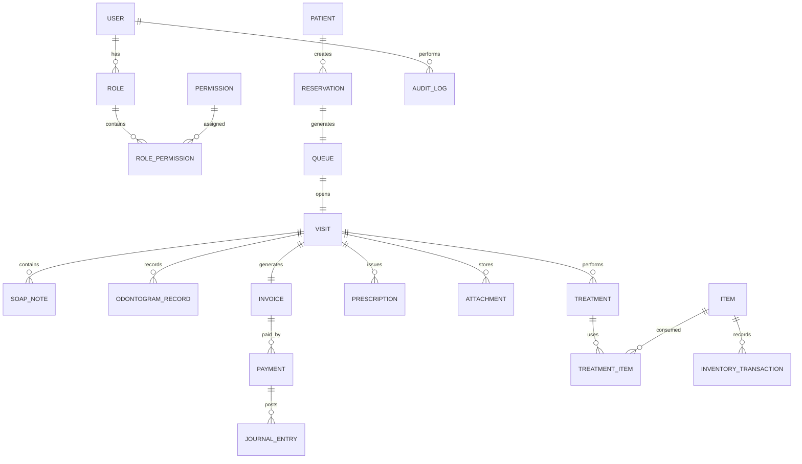

---

# 8. Module Relationship Matrix

| Module | Related Module |
|----------|------------------------------|
| Authentication | System |
| Master Data | Patient, HR |
| Patient | Reservation, EMR |
| Reservation | Queue |
| Queue | EMR |
| EMR | Billing, Warehouse |
| Billing | Finance |
| Finance | Reporting |
| Warehouse | EMR |
| HR | Reporting |
| System | Semua Modul |

---

# 9. Naming Convention

## Table

Menggunakan format:

```text
snake_case
```

Contoh:

```text
patients

reservations

queues

visits

treatments

payments
```

---

## Primary Key

Seluruh tabel menggunakan:

```text
id
```

dengan tipe UUID.

---

## Foreign Key

Format:

```text
<nama_entity>_id
```

Contoh:

```text
patient_id

reservation_id

visit_id

doctor_id

invoice_id
```

---

# 10. Entity Classification

Entity dikelompokkan berdasarkan fungsi bisnis.

| Category | Description |
|----------|-------------|
| Master Entity | Data referensi utama |
| Transaction Entity | Data transaksi |
| Detail Entity | Rincian transaksi |
| Mapping Entity | Many-to-Many |
| Audit Entity | Riwayat perubahan |
| Configuration Entity | Konfigurasi sistem |

---

## Example Classification

| Entity | Category |
|---------|----------|
| Patient | Master |
| Reservation | Transaction |
| Visit | Transaction |
| Treatment | Detail |
| Treatment Item | Detail |
| Invoice | Transaction |
| Payment | Transaction |
| Inventory Transaction | Transaction |
| Role Permission | Mapping |
| Audit Log | Audit |
| System Parameter | Configuration |

---

# Summary Part 1

Part 1 mendefinisikan fondasi Entity Relationship Diagram (ERD) Parakita, meliputi tujuan dokumen, ruang lingkup, prinsip desain ERD, domain bisnis utama, hubungan antar modul, konvensi penamaan, klasifikasi entity, serta gambaran hubungan data tingkat tinggi.

Pada **Part 2** akan dibahas **ERD detail untuk Authentication, Master Data, Patient, Reservation, dan Queue**, lengkap dengan diagram Mermaid ERD dan penjelasan cardinality setiap relasi.

# Parakita Software Architecture Document (SAD)

# 08 - Entity Relationship Diagram (ERD)

| Document Information | |
|----------------------|----------------------------------------------|
| Project | Parakita - Dental Clinic Management System |
| Document | 08 - Entity Relationship Diagram (ERD) |
| Part | 2 of 5 |
| Version | 1.0.0 |
| Status | Draft |
| Document Type | Database Design Documentation |
| Database | MySQL |
| Last Updated | July 2026 |

---

# Table of Contents (Part 2)

11. Authentication Module ERD
12. Master Data Module ERD
13. Patient Module ERD
14. Reservation Module ERD
15. Queue Module ERD

---

# 11. Authentication Module ERD

## 11.1 Overview

Authentication Module bertanggung jawab terhadap proses autentikasi, otorisasi, Role Based Access Control (RBAC), dan manajemen session pengguna.

Entity utama:

- User
- Role
- Permission
- Role Permission
- User Role
- Refresh Token

---

## 11.2 Entity Relationship

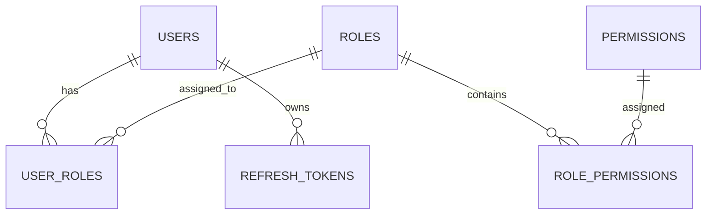

---

## 11.3 Cardinality

| Parent | Child | Relationship |
|---------|-------|--------------|
| User | User Role | One to Many |
| Role | User Role | One to Many |
| Role | Role Permission | One to Many |
| Permission | Role Permission | One to Many |
| User | Refresh Token | One to Many |

---

## 11.4 Main Entities

### users

```text
id
branch_id
employee_id
username
password_hash
email
status
last_login_at
```

---

### roles

```text
id
code
name
description
```

---

### permissions

```text
id
module
action
description
```

---

### role_permissions

```text
role_id
permission_id
```

---

### user_roles

```text
user_id
role_id
```

---

### refresh_tokens

```text
id
user_id
token
expired_at
revoked_at
```

---

# 12. Master Data Module ERD

## 12.1 Overview

Master Data digunakan sebagai referensi seluruh transaksi sistem.

Entity utama:

- Branch
- Clinic
- Doctor
- Treatment Category
- Treatment
- Item Category
- Unit
- Supplier
- Insurance
- Payment Method

---

## 12.2 Entity Relationship

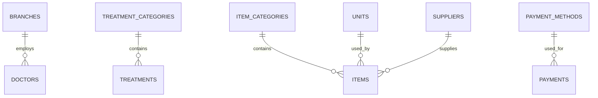

---

## 12.3 Cardinality

| Parent | Child |
|----------|----------------|
| Branch | Doctor |
| Treatment Category | Treatment |
| Item Category | Item |
| Unit | Item |
| Supplier | Item |
| Payment Method | Payment |

---

## 12.4 Main Entities

### branches

```text
id
code
name
address
phone
status
```

---

### doctors

```text
id
branch_id
specialization_id
name
sip_number
status
```

---

### treatments

```text
id
category_id
code
name
duration
price
doctor_fee
```

---

### items

```text
id
category_id
unit_id
supplier_id
code
name
minimum_stock
```

---

# 13. Patient Module ERD

## 13.1 Overview

Patient Module menjadi pusat seluruh data pasien.

Seluruh modul klinik akan berelasi dengan Patient.

---

## 13.2 Entity Relationship

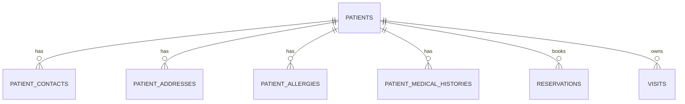

---

## 13.3 Cardinality

| Parent | Child |
|---------|-------|
| Patient | Contact |
| Patient | Address |
| Patient | Allergy |
| Patient | Medical History |
| Patient | Reservation |
| Patient | Visit |

---

## 13.4 Main Entities

### patients

```text
id
medical_record_number
nik
full_name
gender
birth_date
phone
email
blood_type
status
```

---

### patient_contacts

```text
id
patient_id
contact_name
relationship
phone
```

---

### patient_addresses

```text
id
patient_id
province
city
district
postal_code
address
```

---

### patient_allergies

```text
id
patient_id
allergy_type
description
```

---

### patient_medical_histories

```text
id
patient_id
disease
diagnosed_at
notes
```

---

# 14. Reservation Module ERD

## 14.1 Overview

Reservation mengelola seluruh proses booking pasien sebelum pelayanan dilakukan.

---

## 14.2 Entity Relationship

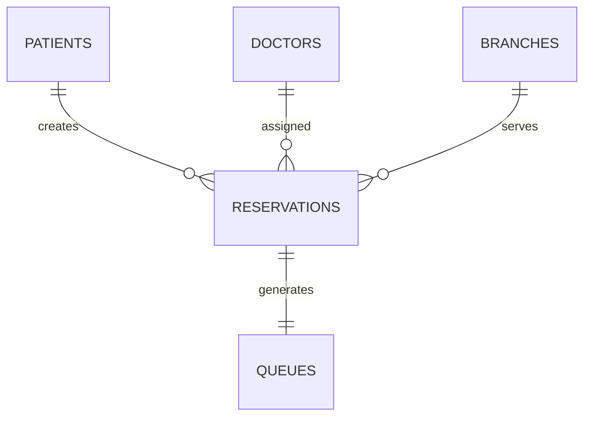

---

## 14.3 Cardinality

| Parent | Child |
|----------|----------------|
| Patient | Reservation |
| Doctor | Reservation |
| Branch | Reservation |
| Reservation | Queue |

---

## 14.4 Main Entities

### reservations

```text
id
patient_id
doctor_id
branch_id
reservation_number
reservation_date
reservation_time
visit_type
status
remarks
```

---

## 14.5 Reservation Lifecycle

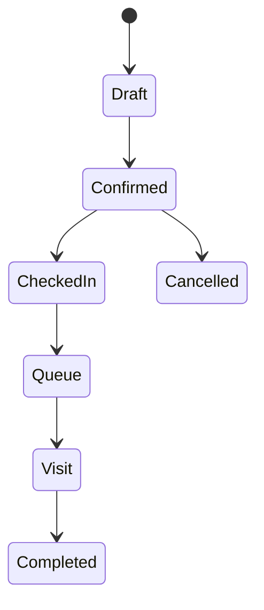

---

# 15. Queue Module ERD

## 15.1 Overview

Queue Module mengelola nomor antrian pasien sampai dokter membuka kunjungan (Visit).

---

## 15.2 Entity Relationship

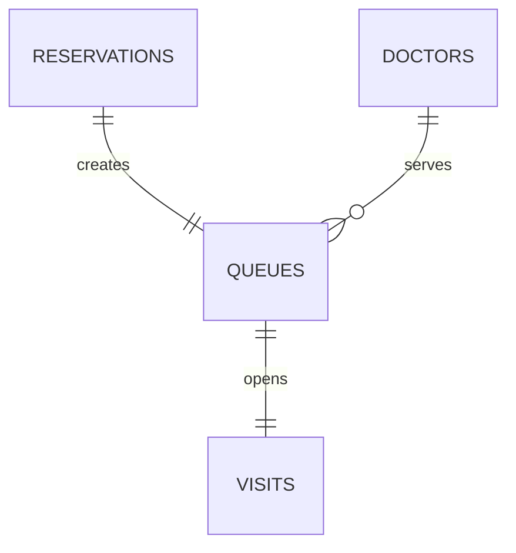

---

## 15.3 Cardinality

| Parent | Child |
|----------|----------------|
| Reservation | Queue |
| Doctor | Queue |
| Queue | Visit |

---

## 15.4 Main Entities

### queues

```text
id
reservation_id
doctor_id
queue_number
queue_date
called_at
served_at
finished_at
status
```

---

## 15.5 Queue Status Flow

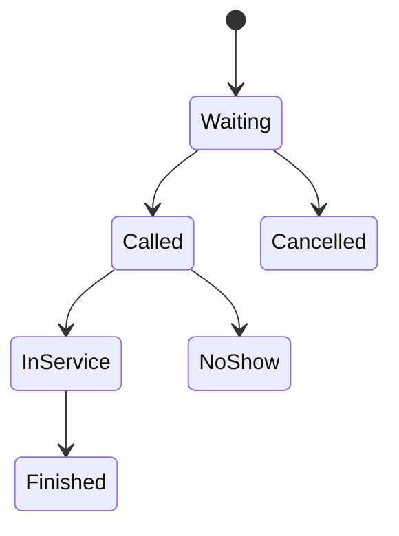

---

# Cross Module Relationship Summary

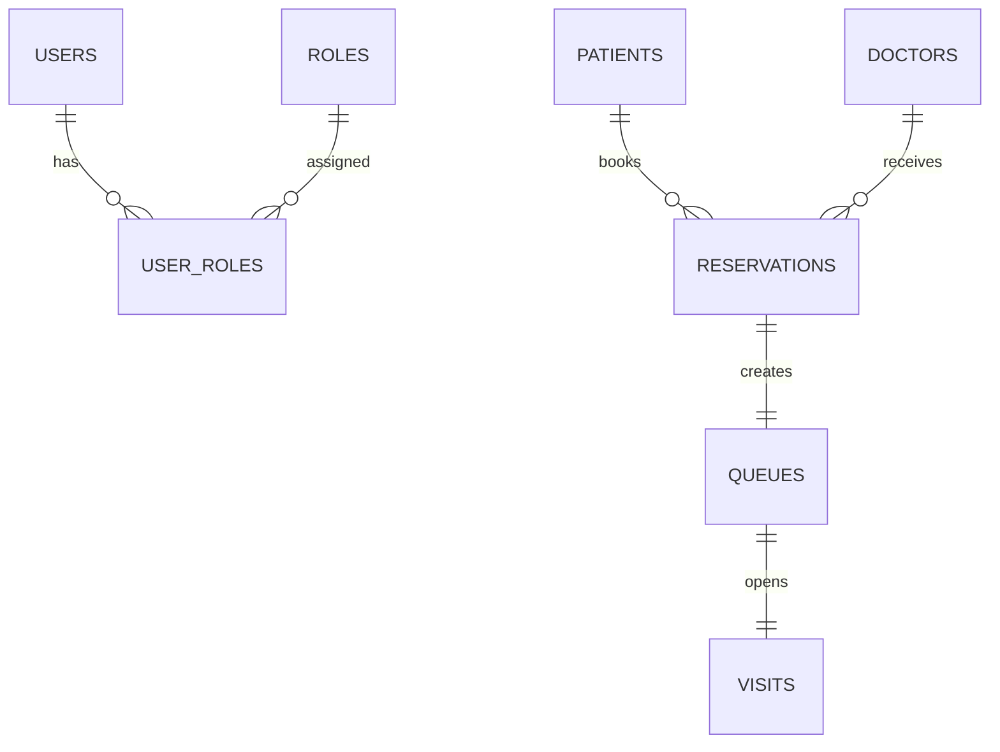

---

# Summary Part 2

Part 2 menjelaskan ERD untuk modul **Authentication**, **Master Data**, **Patient**, **Reservation**, dan **Queue**, termasuk hubungan antar entitas, cardinality, entity utama, serta lifecycle proses reservasi dan antrian.

Pada **Part 3** akan dibahas **ERD Electronic Medical Record (EMR)** yang mencakup **Visit, SOAP, Vital Sign, Odontogram, Diagnosis, Treatment, Prescription, Attachment**, beserta relasi lengkap antar entity klinis.

# Parakita Software Architecture Document (SAD)

# 08 - Entity Relationship Diagram (ERD)

| Document Information | |
|----------------------|----------------------------------------------|
| Project | Parakita - Dental Clinic Management System |
| Document | 08 - Entity Relationship Diagram (ERD) |
| Part | 3 of 5 |
| Version | 1.0.0 |
| Status | Draft |
| Document Type | Database Design Documentation |
| Database | MySQL |
| Last Updated | July 2026 |

---

# Table of Contents (Part 3)

16. EMR Module Overview
17. Visit Entity Relationship
18. Clinical Documentation ERD
19. Treatment & Clinical Procedure ERD
20. Clinical Attachment ERD
21. EMR Complete Relationship

---

# 16. EMR Module Overview

## 16.1 Overview

Electronic Medical Record (EMR) merupakan inti dari sistem Parakita.

Seluruh aktivitas pelayanan medis dimulai ketika pasien dipanggil dari antrian dan dokter membuka **Visit**.

EMR menyimpan seluruh informasi klinis pasien mulai dari:

- Visit
- Vital Sign
- SOAP
- Odontogram
- Diagnosis
- Treatment
- Prescription
- Clinical Note
- Attachment

---

## 16.2 Main Entities

| Entity | Description |
|---------|-------------|
| Visit | Kunjungan pasien |
| Vital Sign | Pemeriksaan awal |
| SOAP Note | Catatan SOAP |
| Odontogram Record | Kondisi gigi |
| Diagnosis | Diagnosis pasien |
| Treatment | Tindakan medis |
| Treatment Item | Material yang digunakan |
| Prescription | Resep obat |
| Clinical Attachment | Foto & Dokumen |

---

# 17. Visit Entity Relationship

## 17.1 Overview

Visit menjadi Aggregate Root pada seluruh transaksi EMR.

Seluruh data klinis selalu berelasi dengan Visit.

---

## 17.2 Entity Relationship

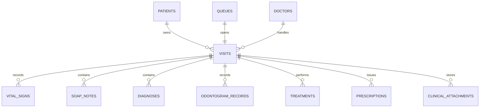

---

## 17.3 Cardinality

| Parent | Child | Relationship |
|---------|-------|--------------|
| Patient | Visit | One to Many |
| Queue | Visit | One to One |
| Doctor | Visit | One to Many |
| Visit | Vital Sign | One to Many |
| Visit | SOAP Note | One to Many |
| Visit | Diagnosis | One to Many |
| Visit | Treatment | One to Many |
| Visit | Prescription | One to Many |
| Visit | Attachment | One to Many |

---

## 17.4 Main Entity

### visits

```text
id
patient_id
queue_id
doctor_id
visit_number
visit_date
visit_status
chief_complaint
doctor_notes
started_at
finished_at
```

---

# 18. Clinical Documentation ERD

## 18.1 Overview

Dokumentasi klinis terdiri dari pemeriksaan awal, SOAP, diagnosis, serta pencatatan kondisi gigi.

---

## 18.2 Entity Relationship

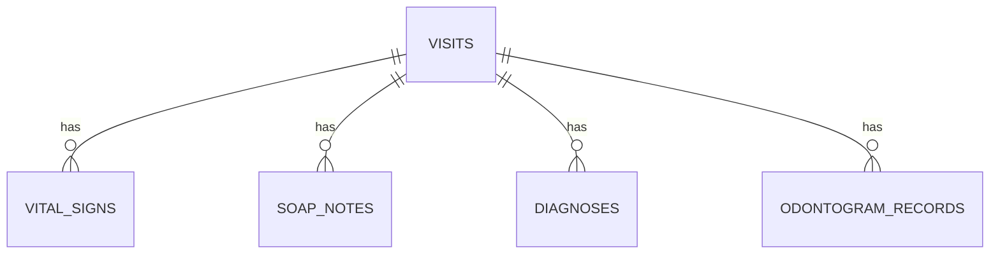

---

## 18.3 Vital Sign

### vital_signs

```text
id
visit_id
blood_pressure
pulse_rate
temperature
respiration_rate
weight
height
recorded_at
```

---

## 18.4 SOAP Note

### soap_notes

```text
id
visit_id
subjective
objective
assessment
plan
created_by
```

---

## 18.5 Diagnosis

### diagnoses

```text
id
visit_id
icd_code
diagnosis_name
diagnosis_type
notes
```

---

## 18.6 Odontogram

### odontogram_records

```text
id
visit_id
tooth_number
surface
condition
treatment_plan
notes
```

---

## 18.7 Clinical Documentation Flow

```mermaid
flowchart LR

Visit

-->

Vital Sign

-->

SOAP

-->

Diagnosis

-->

Odontogram
```

---

# 19. Treatment & Clinical Procedure ERD

## 19.1 Overview

Treatment merupakan tindakan medis yang dilakukan selama Visit.

Satu Visit dapat memiliki banyak Treatment.

Setiap Treatment dapat menggunakan banyak Item.

---

## 19.2 Entity Relationship

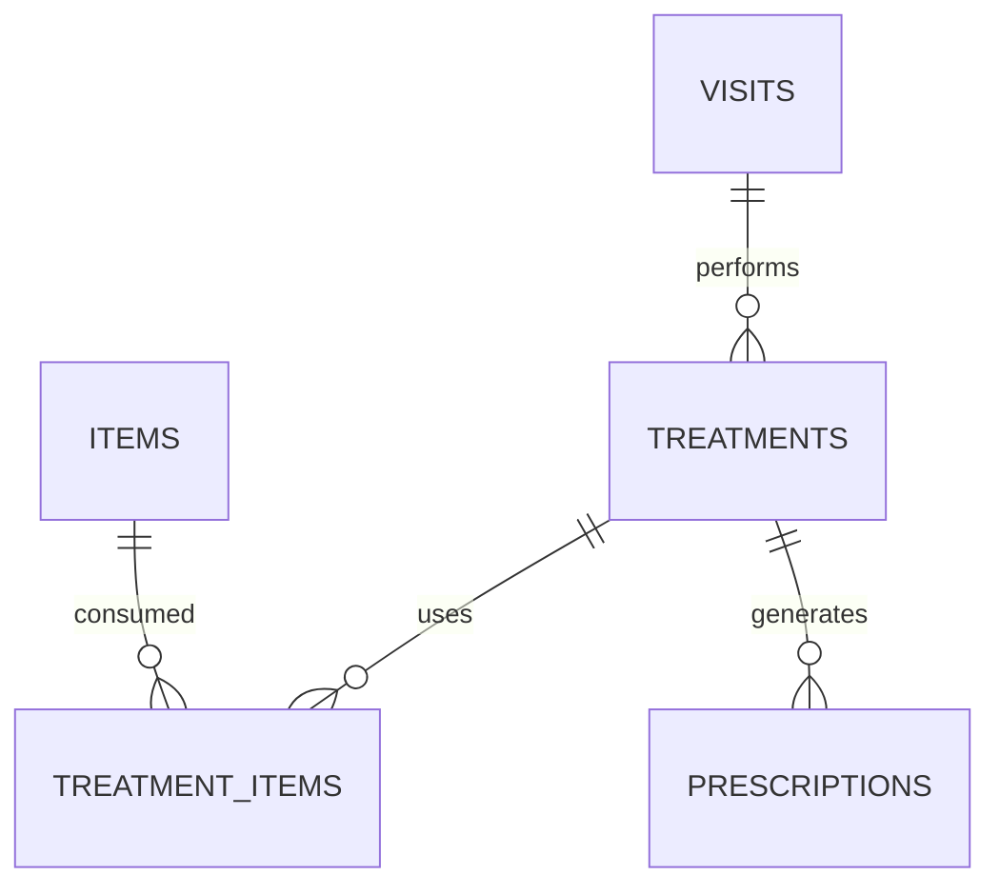

---

## 19.3 Cardinality

| Parent | Child |
|----------|----------------|
| Visit | Treatment |
| Treatment | Treatment Item |
| Item | Treatment Item |
| Treatment | Prescription |

---

## 19.4 Main Entities

### treatments

```text
id
visit_id
treatment_id
tooth_number
doctor_fee
price
discount
subtotal
notes
```

---

### treatment_items

```text
id
treatment_id
item_id
quantity
unit_cost
total_cost
```

---

### prescriptions

```text
id
visit_id
medicine_id
dosage
frequency
duration
instruction
```

---

## 19.5 Treatment Flow

```mermaid
flowchart LR

Visit

-->

Treatment

-->

Treatment Item

-->

Prescription

-->

Billing
```

---

# 20. Clinical Attachment ERD

## 20.1 Overview

Seluruh file pendukung pelayanan medis disimpan sebagai attachment.

File fisik berada pada Object Storage (MinIO/S3), sedangkan database hanya menyimpan metadata.

---

## 20.2 Entity Relationship

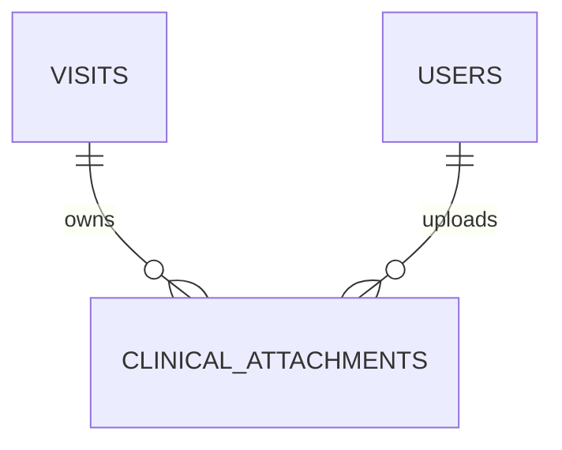

---

## 20.3 Main Entity

### clinical_attachments

```text
id
visit_id
uploaded_by
file_name
object_key
mime_type
file_size
bucket_name
uploaded_at
```

---

## 20.4 Supported File

- Foto Gigi
- Foto Intra Oral
- Foto Extra Oral
- X-Ray
- Panorama
- CBCT
- Surat Rujukan
- Dokumen Pendukung

---

# 21. EMR Complete Relationship

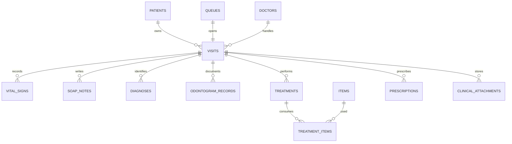

---

# EMR Aggregate Root

```text
Visit
│
├── Vital Sign
├── SOAP Note
├── Diagnosis
├── Odontogram
├── Treatment
│      └── Treatment Item
├── Prescription
└── Clinical Attachment
```

---

# Summary Part 3

Part 3 menjelaskan **Entity Relationship Diagram (ERD)** untuk modul **Electronic Medical Record (EMR)**, yang berpusat pada entity **Visit** sebagai **Aggregate Root**. Seluruh data klinis seperti **Vital Sign**, **SOAP Note**, **Diagnosis**, **Odontogram**, **Treatment**, **Treatment Item**, **Prescription**, dan **Clinical Attachment** memiliki relasi langsung terhadap Visit.

Pada **Part 4** akan dibahas ERD untuk modul **Billing**, **Finance**, dan **Warehouse**, termasuk hubungan antara **Invoice**, **Payment**, **Journal**, **Inventory Transaction**, **Purchase**, serta integrasinya dengan proses pelayanan medis.

# Parakita Software Architecture Document (SAD)

# 08 - Entity Relationship Diagram (ERD)

| Document Information | |
|----------------------|----------------------------------------------|
| Project | Parakita - Dental Clinic Management System |
| Document | 08 - Entity Relationship Diagram (ERD) |
| Part | 4 of 5 |
| Version | 1.0.0 |
| Status | Draft |
| Document Type | Database Design Documentation |
| Database | MySQL |
| Last Updated | July 2026 |

---

# Table of Contents (Part 4)

22. Billing Module ERD
23. Finance Module ERD
24. Warehouse Module ERD
25. Cross Module Financial Flow
26. Inventory Integration
27. Financial & Inventory Relationship

---

# 22. Billing Module ERD

## 22.1 Overview

Billing Module bertanggung jawab menghasilkan invoice berdasarkan tindakan medis yang telah diselesaikan pada modul EMR.

Entity utama:

- Invoice
- Invoice Detail
- Invoice Discount
- Payment
- Refund

---

## 22.2 Entity Relationship

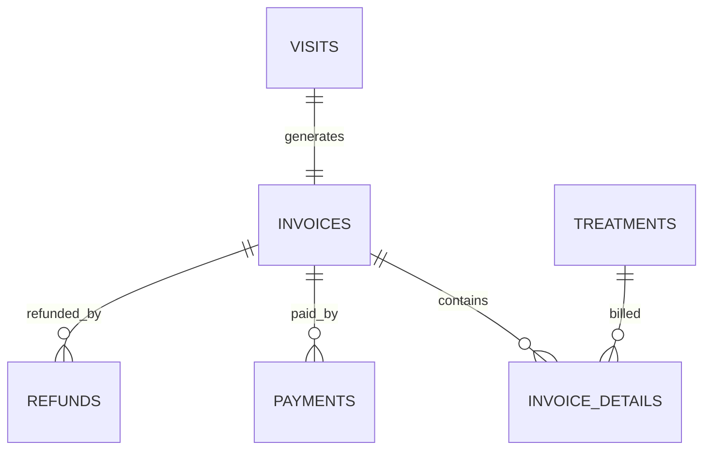

---

## 22.3 Cardinality

| Parent | Child | Relationship |
|---------|-------|--------------|
| Visit | Invoice | One to One |
| Invoice | Invoice Detail | One to Many |
| Treatment | Invoice Detail | One to Many |
| Invoice | Payment | One to Many |
| Invoice | Refund | One to Many |

---

## 22.4 Main Entities

### invoices

```text
id
visit_id
invoice_number
invoice_date
subtotal
discount
tax
grand_total
payment_status
status
```

---

### invoice_details

```text
id
invoice_id
treatment_id
description
quantity
unit_price
discount
subtotal
```

---

### payments

```text
id
invoice_id
payment_method_id
payment_number
payment_date
amount
reference_number
status
```

---

### refunds

```text
id
invoice_id
refund_number
refund_date
amount
reason
approved_by
```

---

## 22.5 Billing Lifecycle

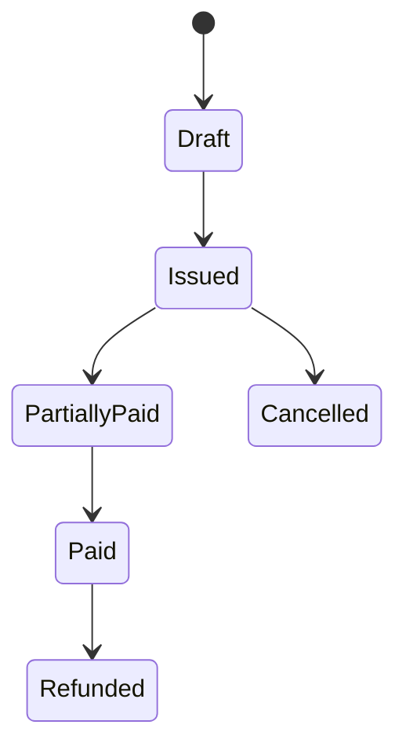

---

# 23. Finance Module ERD

## 23.1 Overview

Finance Module mencatat seluruh transaksi keuangan yang berasal dari pembayaran, refund, maupun transaksi operasional klinik.

Entity utama:

- Cash Transaction
- Journal
- Journal Detail
- Account
- Cash Closing

---

## 23.2 Entity Relationship

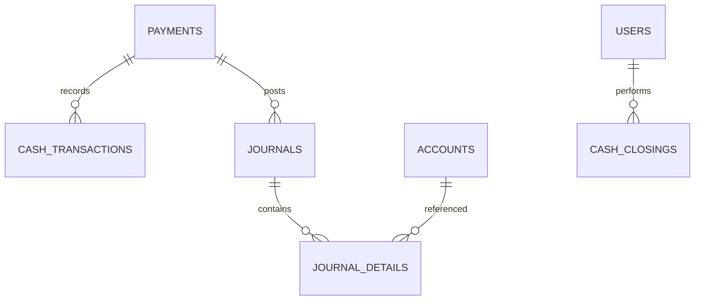

---

## 23.3 Cardinality

| Parent | Child |
|----------|----------------|
| Payment | Cash Transaction |
| Payment | Journal |
| Journal | Journal Detail |
| Account | Journal Detail |
| User | Cash Closing |

---

## 23.4 Main Entities

### cash_transactions

```text
id
payment_id
transaction_date
transaction_type
amount
remarks
```

---

### journals

```text
id
journal_number
journal_date
reference_type
reference_id
description
```

---

### journal_details

```text
id
journal_id
account_id
debit
credit
description
```

---

### accounts

```text
id
account_code
account_name
account_type
parent_id
```

---

### cash_closings

```text
id
closing_date
cashier_id
opening_balance
closing_balance
difference
status
```

---

## 23.5 Finance Flow

```mermaid
flowchart LR

Payment

-->

Cash Transaction

-->

Journal

-->

Journal Detail

-->

Financial Report
```

---

# 24. Warehouse Module ERD

## 24.1 Overview

Warehouse Module mengelola seluruh stok barang medis maupun non medis.

Setiap penggunaan material selama tindakan medis akan menghasilkan transaksi stok.

---

## 24.2 Entity Relationship

```mermaid
erDiagram

ITEMS ||--o{ INVENTORY_TRANSACTIONS : records

ITEMS ||--o{ PURCHASE_DETAILS : purchased

PURCHASES ||--o{ PURCHASE_DETAILS : contains

SUPPLIERS ||--o{ PURCHASES : supplies

TREATMENT_ITEMS ||--o{ INVENTORY_TRANSACTIONS : consumes
```

---

## 24.3 Cardinality

| Parent | Child |
|----------|----------------|
| Supplier | Purchase |
| Purchase | Purchase Detail |
| Item | Purchase Detail |
| Item | Inventory Transaction |
| Treatment Item | Inventory Transaction |

---

## 24.4 Main Entities

### purchases

```text
id
supplier_id
purchase_number
purchase_date
status
total_amount
```

---

### purchase_details

```text
id
purchase_id
item_id
quantity
unit_cost
subtotal
```

---

### inventory_transactions

```text
id
item_id
transaction_type
reference_type
reference_id
quantity
stock_before
stock_after
transaction_date
```

---

## 24.5 Inventory Transaction Type

- Purchase
- Stock In
- Stock Out
- Treatment Usage
- Adjustment
- Stock Opname
- Transfer
- Return

---

## 24.6 Warehouse Flow

```mermaid
flowchart LR

Purchase

-->

Stock In

-->

Available Stock

-->

Treatment Usage

-->

Stock Out
```

---

# 25. Cross Module Financial Flow

## 25.1 Business Flow

```mermaid
flowchart LR

Visit

-->

Treatment

-->

Invoice

-->

Payment

-->

Journal

-->

Finance Report
```

---

## 25.2 Cross Module Relationship

```mermaid
erDiagram

VISITS ||--|| INVOICES : generates

INVOICES ||--o{ PAYMENTS : receives

PAYMENTS ||--o{ JOURNALS : creates

JOURNALS ||--o{ JOURNAL_DETAILS : contains

ACCOUNTS ||--o{ JOURNAL_DETAILS : mapped
```

---

# 26. Inventory Integration

## 26.1 Business Flow

Material yang digunakan pada Treatment akan otomatis mengurangi stok inventory.

```mermaid
flowchart LR

Treatment

-->

Treatment Item

-->

Inventory Transaction

-->

Current Stock

-->

Inventory Report
```

---

## 26.2 Cross Module Relationship

```mermaid
erDiagram

TREATMENTS ||--o{ TREATMENT_ITEMS : contains

ITEMS ||--o{ TREATMENT_ITEMS : uses

TREATMENT_ITEMS ||--o{ INVENTORY_TRANSACTIONS : creates
```

---

# 27. Financial & Inventory Relationship

```mermaid
erDiagram

VISITS ||--|| INVOICES : generates

INVOICES ||--o{ PAYMENTS : receives

PAYMENTS ||--o{ JOURNALS : posts

JOURNALS ||--o{ JOURNAL_DETAILS : contains

TREATMENTS ||--o{ TREATMENT_ITEMS : uses

ITEMS ||--o{ INVENTORY_TRANSACTIONS : records

SUPPLIERS ||--o{ PURCHASES : supplies

PURCHASES ||--o{ PURCHASE_DETAILS : contains
```

---

# Billing Aggregate

```text
Invoice
│
├── Invoice Detail
├── Payment
└── Refund
```

---

# Finance Aggregate

```text
Journal
│
├── Journal Detail
├── Cash Transaction
└── Cash Closing
```

---

# Warehouse Aggregate

```text
Item
│
├── Purchase Detail
├── Inventory Transaction
└── Treatment Item
```

---

# Summary Part 4

Part 4 menjelaskan **Entity Relationship Diagram (ERD)** untuk modul **Billing**, **Finance**, dan **Warehouse**. Dokumen ini mencakup hubungan antar entity seperti **Invoice**, **Payment**, **Journal**, **Cash Transaction**, **Purchase**, **Inventory Transaction**, serta integrasi otomatis antara penggunaan material pada **Treatment** dengan pengurangan stok dan pencatatan transaksi keuangan.

Pada **Part 5** akan dibahas ERD untuk **Human Resource (HR)**, **Reporting**, **System Administration**, **Audit Trail**, serta **Complete Enterprise ERD** yang menggabungkan seluruh modul Parakita menjadi satu diagram hubungan data terpadu.


# Parakita Software Architecture Document (SAD)

# 08 - Entity Relationship Diagram (ERD)

| Document Information | |
|----------------------|----------------------------------------------|
| Project | Parakita - Dental Clinic Management System |
| Document | 08 - Entity Relationship Diagram (ERD) |
| Part | 5 of 5 |
| Version | 1.0.0 |
| Status | Draft |
| Document Type | Database Design Documentation |
| Database | MySQL |
| Last Updated | July 2026 |

---

# Table of Contents (Part 5)

28. Human Resource Module ERD
29. Reporting Module ERD
30. System Administration ERD
31. Audit Trail ERD
32. Complete Enterprise ERD
33. Database Relationship Summary
34. Design Best Practices

---

# 28. Human Resource Module ERD

## 28.1 Overview

Human Resource (HR) Module mengelola seluruh data pegawai klinik yang digunakan oleh berbagai modul seperti Authentication, Reservation, EMR, Billing, dan Finance.

Entity utama:

- Employee
- Position
- Department
- Schedule
- Attendance

---

## 28.2 Entity Relationship

```mermaid
erDiagram

DEPARTMENTS ||--o{ POSITIONS : contains

POSITIONS ||--o{ EMPLOYEES : assigned

EMPLOYEES ||--o{ EMPLOYEE_SCHEDULES : has

EMPLOYEES ||--o{ ATTENDANCES : records

EMPLOYEES ||--|| USERS : linked
```

---

## 28.3 Cardinality

| Parent | Child | Relationship |
|---------|-------|--------------|
| Department | Position | One to Many |
| Position | Employee | One to Many |
| Employee | Schedule | One to Many |
| Employee | Attendance | One to Many |
| Employee | User | One to One |

---

## 28.4 Main Entities

### employees

```text
id
employee_number
branch_id
department_id
position_id
full_name
phone
email
hire_date
employment_status
```

---

### employee_schedules

```text
id
employee_id
work_date
shift
start_time
end_time
status
```

---

### attendances

```text
id
employee_id
attendance_date
check_in
check_out
attendance_status
```

---

# 29. Reporting Module ERD

## 29.1 Overview

Reporting Module merupakan read-only module yang mengambil data dari berbagai domain untuk menghasilkan laporan operasional dan manajemen.

Entity utama:

- Report Snapshot
- Dashboard Summary
- Report Job

---

## 29.2 Entity Relationship

```mermaid
erDiagram

REPORT_JOBS ||--o{ REPORT_SNAPSHOTS : generates

REPORT_SNAPSHOTS ||--o{ DASHBOARD_SUMMARIES : aggregates

USERS ||--o{ REPORT_JOBS : executes
```

---

## 29.3 Main Entities

### report_jobs

```text
id
report_name
generated_by
started_at
finished_at
status
```

---

### report_snapshots

```text
id
report_job_id
snapshot_date
module
data_version
```

---

### dashboard_summaries

```text
id
snapshot_id
metric_name
metric_value
display_order
```

---

## 29.4 Data Source

Reporting memperoleh data dari:

- Patient
- Reservation
- EMR
- Billing
- Finance
- Warehouse
- Human Resource

Tidak ada transaksi langsung pada modul Reporting.

---

# 30. System Administration ERD

## 30.1 Overview

System Administration mengelola konfigurasi global aplikasi.

Entity utama:

- System Parameter
- Menu
- Feature Flag
- Notification Template

---

## 30.2 Entity Relationship

```mermaid
erDiagram

SYSTEM_PARAMETERS ||--o{ FEATURE_FLAGS : controls

MENUS ||--o{ MENU_PERMISSIONS : secured

PERMISSIONS ||--o{ MENU_PERMISSIONS : grants

NOTIFICATION_TEMPLATES ||--o{ SYSTEM_PARAMETERS : references
```

---

## 30.3 Main Entities

### system_parameters

```text
id
parameter_key
parameter_value
description
```

---

### feature_flags

```text
id
feature_name
is_enabled
environment
```

---

### notification_templates

```text
id
template_code
channel
subject
content
status
```

---

# 31. Audit Trail ERD

## 31.1 Overview

Audit Trail mencatat seluruh aktivitas pengguna sebagai bagian dari keamanan dan kepatuhan sistem.

Entity ini bersifat generic dan dapat digunakan oleh seluruh modul.

---

## 31.2 Entity Relationship

```mermaid
erDiagram

USERS ||--o{ AUDIT_LOGS : performs

AUDIT_LOGS ||--o{ AUDIT_DETAILS : contains
```

---

## 31.3 Main Entities

### audit_logs

```text
id
user_id
module
entity_name
entity_id
action
ip_address
user_agent
created_at
```

---

### audit_details

```text
id
audit_log_id
field_name
old_value
new_value
```

---

## 31.4 Supported Action

- Login
- Logout
- Create
- Update
- Delete
- Restore
- Approve
- Reject
- Print
- Export
- Import

---

# 32. Complete Enterprise ERD

## 32.1 High Level Enterprise Relationship

```mermaid
erDiagram

USERS ||--o{ USER_ROLES : has
ROLES ||--o{ USER_ROLES : assigned

EMPLOYEES ||--|| USERS : linked

PATIENTS ||--o{ RESERVATIONS : books
DOCTORS ||--o{ RESERVATIONS : receives

RESERVATIONS ||--|| QUEUES : creates

QUEUES ||--|| VISITS : opens

VISITS ||--o{ SOAP_NOTES : records
VISITS ||--o{ DIAGNOSES : diagnoses
VISITS ||--o{ ODONTOGRAM_RECORDS : records
VISITS ||--o{ TREATMENTS : performs

TREATMENTS ||--o{ TREATMENT_ITEMS : consumes

ITEMS ||--o{ TREATMENT_ITEMS : used

VISITS ||--|| INVOICES : generates

INVOICES ||--o{ PAYMENTS : receives

PAYMENTS ||--o{ JOURNALS : posts

JOURNALS ||--o{ JOURNAL_DETAILS : contains

ITEMS ||--o{ INVENTORY_TRANSACTIONS : records

SUPPLIERS ||--o{ PURCHASES : supplies

PURCHASES ||--o{ PURCHASE_DETAILS : contains

USERS ||--o{ AUDIT_LOGS : performs
```

---

## 32.2 Complete Business Flow

```mermaid
flowchart LR

Patient

-->

Reservation

-->

Queue

-->

Visit

-->

Treatment

-->

Invoice

-->

Payment

-->

Journal

-->

Financial Report
```

---

## 32.3 Inventory Flow

```mermaid
flowchart LR

Supplier

-->

Purchase

-->

Inventory

-->

Treatment

-->

Inventory Transaction

-->

Stock Report
```

---

# 33. Database Relationship Summary

## 33.1 Aggregate Root

| Aggregate | Root Entity |
|------------|-------------|
| Authentication | User |
| Patient | Patient |
| Reservation | Reservation |
| Queue | Queue |
| EMR | Visit |
| Billing | Invoice |
| Finance | Journal |
| Warehouse | Item |
| Human Resource | Employee |
| Reporting | Report Snapshot |
| System | System Parameter |
| Audit | Audit Log |

---

## 33.2 Cross Module Dependency

| Module | Depends On |
|----------|-----------------------------|
| Authentication | HR |
| Patient | Master Data |
| Reservation | Patient, Doctor |
| Queue | Reservation |
| EMR | Queue |
| Billing | EMR |
| Finance | Billing |
| Warehouse | EMR |
| Reporting | Semua Modul |
| Audit | Semua Modul |

---

## 33.3 Estimated Entity Count

| Module | Approx. Entity |
|----------|---------------:|
| Authentication | 6 |
| Master Data | 18 |
| Patient | 8 |
| Reservation | 4 |
| Queue | 2 |
| EMR | 12 |
| Billing | 5 |
| Finance | 6 |
| Warehouse | 8 |
| Human Resource | 6 |
| Reporting | 3 |
| System | 5 |
| Audit | 2 |
| **Total** | **≈ 85 Entity** |

---

# 34. Design Best Practices

## 34.1 Database Principles

Seluruh entity mengikuti prinsip:

- Third Normal Form (3NF)
- UUID sebagai Primary Key
- Foreign Key Constraint
- Soft Delete (`deleted_at`)
- Audit Fields (`created_at`, `updated_at`, `created_by`, `updated_by`)
- Timestamp menggunakan UTC
- Referential Integrity
- Consistent Naming Convention (`snake_case`)

---

## 34.2 Aggregate Boundary

Setiap modul memiliki **Aggregate Root** yang menjadi pintu masuk seluruh perubahan data.

Contoh:

```text
Patient
└── Reservation
    └── Queue
        └── Visit
            ├── SOAP Note
            ├── Diagnosis
            ├── Odontogram
            ├── Treatment
            │   └── Treatment Item
            └── Prescription
```

---

## 34.3 Cross Module Communication

Interaksi antar modul dilakukan melalui:

- Application Service
- Repository Interface
- Domain Event
- Read Model

Tidak diperbolehkan melakukan akses langsung ke tabel internal modul lain yang melanggar batas **Bounded Context**.

---

# Final Summary

Dokumen **08 - Entity Relationship Diagram (ERD)** mendefinisikan keseluruhan hubungan data pada sistem **Parakita Dental Clinic Management System**.

Dokumen ini melengkapi:

- **06 - Database Design** (desain fisik tabel)
- **07 - Data Dictionary** (definisi atribut)
- **03 - Clean Architecture** (batas domain dan aggregate)

ERD ini menggambarkan hubungan antar **±85 entity** yang tersebar pada modul **Authentication**, **Master Data**, **Patient**, **Reservation**, **Queue**, **EMR**, **Billing**, **Finance**, **Warehouse**, **Human Resource**, **Reporting**, **System Administration**, dan **Audit Trail**.

Dokumen ini menjadi acuan utama dalam implementasi **Prisma Schema**, pembuatan **Migration**, pengembangan **Repository**, validasi **Foreign Key**, serta menjaga konsistensi struktur database sesuai pendekatan **Clean Architecture**, **Domain Driven Design (DDD)**, dan **Modular Monolith**.

