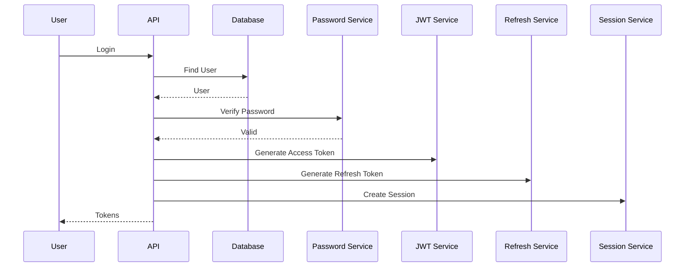
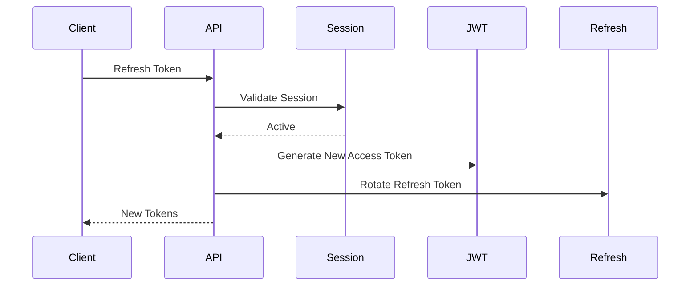
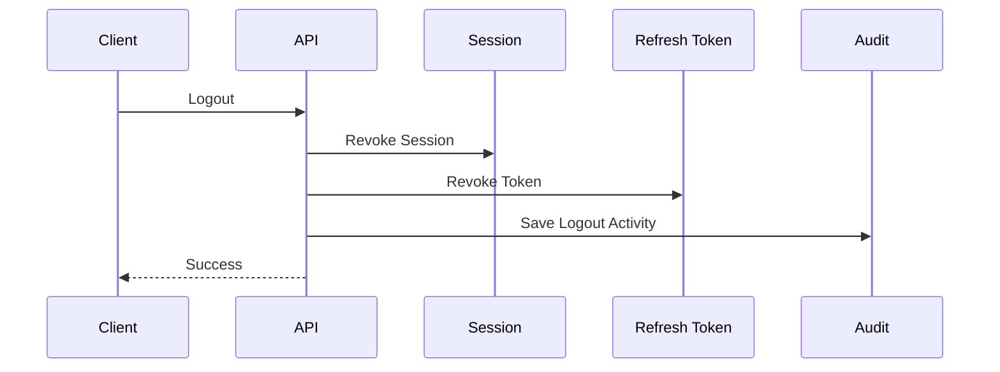
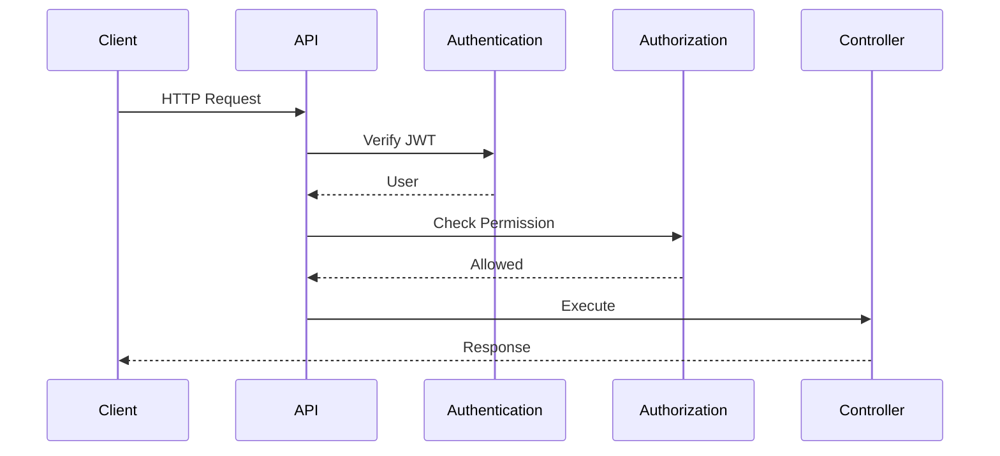

# Parakita Software Architecture Document (SAD)

# 10 - Authentication & Authorization

| Document Information | |
|----------------------|----------------------------------------------|
| Project | Parakita - Dental Clinic Management System |
| Document | 10 - Authentication & Authorization |
| Part | 1 of 5 |
| Version | 1.0.0 |
| Status | Draft |
| Document Type | Security Architecture Document |
| Architecture Style | JWT + Refresh Token + RBAC |
| Backend | Express.js + TypeScript |
| Frontend | Next.js + TypeScript |
| Last Updated | July 2026 |

---

# Table of Contents (Part 1)

1. Introduction
2. Objectives
3. Scope
4. Security Principles
5. Authentication Architecture
6. Authentication Components
7. Identity Model
8. User Lifecycle
9. Login Flow
10. Token Architecture

---

# 1. Introduction

## 1.1 Overview

Dokumen ini menjelaskan standar implementasi **Authentication** dan **Authorization**
yang digunakan pada seluruh modul Parakita.

Dokumen ini menjadi acuan bagi seluruh Backend Developer dan Frontend Developer
agar seluruh mekanisme login, session management, permission, serta keamanan API
diimplementasikan secara konsisten.

Dokumen ini melengkapi pembahasan pada:

- 02-System Architecture
- 03-Clean Architecture
- 05-Coding Standard
- 09-API Standard

---

## 1.2 Purpose

Dokumen ini bertujuan untuk:

- Menentukan standar autentikasi.
- Menentukan standar otorisasi.
- Menentukan lifecycle token.
- Menentukan standar session.
- Menentukan standar refresh token.
- Menentukan RBAC.
- Menentukan security flow.
- Menentukan best practice keamanan.

---

## 1.3 Objectives

Authentication dirancang agar memenuhi karakteristik berikut.

- Secure by Default
- Stateless API
- Multi Device Ready
- Session Tracking
- Audit Friendly
- Easily Extensible
- OWASP Friendly

---

# 2. Scope

Dokumen ini mencakup seluruh proses keamanan aplikasi.

Area yang dibahas meliputi:

- Login
- Logout
- Refresh Token
- JWT
- Session
- User Identity
- Role
- Permission
- API Authentication
- Authorization
- Password
- Security Policy
- Audit Authentication

Dokumen ini tidak membahas:

- OAuth
- SSO
- LDAP
- MFA (Future)
- Social Login

---

# 3. Security Principles

Seluruh mekanisme Authentication mengikuti prinsip berikut.

## 3.1 Security by Design

Keamanan merupakan bagian dari desain sistem sejak awal.

---

## 3.2 Least Privilege

User hanya diberikan hak akses minimum sesuai pekerjaannya.

---

## 3.3 Zero Trust

Seluruh request harus divalidasi.

Tidak ada request yang dipercaya secara otomatis.

---

## 3.4 Stateless Authentication

Backend tidak menyimpan Access Token.

Seluruh request harus membawa JWT.

---

## 3.5 Session Awareness

Walaupun menggunakan JWT, sistem tetap melacak session aktif
menggunakan Refresh Token.

---

# 4. Authentication Architecture

## 4.1 High Level Architecture

```mermaid
flowchart LR

Browser

-->

NextJS

-->

REST API

-->

Authentication Middleware

-->

Authorization Middleware

-->

Controller

-->

Application Layer

-->

Repository

-->

MySQL
```

---

## 4.2 Authentication Components

Authentication terdiri dari beberapa komponen.

| Component | Responsibility |
|------------|----------------|
| Login API | Autentikasi pengguna |
| JWT Service | Generate & Verify Token |
| Refresh Token Service | Kelola Refresh Token |
| Session Service | Kelola Session Login |
| Password Service | Hash & Verify Password |
| Authorization Middleware | Validasi Permission |
| Audit Service | Mencatat aktivitas login |

---

## 4.3 Authentication Pipeline

```text
Login Request

↓

Validate Credential

↓

Verify Password

↓

Generate JWT

↓

Generate Refresh Token

↓

Store Session

↓

Return Token

↓

Authenticated Request
```

---

# 5. Authentication Components

## 5.1 Login API

Bertugas:

- Validasi username/email
- Verifikasi password
- Membuat Access Token
- Membuat Refresh Token
- Membuat Session

---

## 5.2 JWT Service

Bertanggung jawab terhadap:

- Generate Access Token
- Verify Access Token
- Decode Token
- Validate Signature
- Validate Expiration

---

## 5.3 Refresh Token Service

Bertanggung jawab terhadap:

- Generate Refresh Token
- Rotate Refresh Token
- Revoke Refresh Token
- Validate Refresh Token

---

## 5.4 Password Service

Bertanggung jawab terhadap:

- Password Hash
- Password Verify
- Password Policy
- Password Upgrade

---

## 5.5 Session Service

Mengelola:

- Active Session
- Device Information
- Login Time
- Logout
- Session Revocation

---

# 6. Identity Model

Setiap user memiliki identitas unik.

## 6.1 Identity Structure

```text
User

↓

Employee

↓

Role

↓

Permission
```

---

## 6.2 Identity Components

| Component | Description |
|------------|-------------|
| User ID | Primary Identity |
| Username | Login Identifier |
| Email | Alternative Login |
| Employee | Data Pegawai |
| Role | Hak Akses |
| Permission | Detail Hak Akses |

---

## 6.3 User Status

User memiliki status berikut.

| Status | Description |
|----------|----------------|
| Active | Dapat Login |
| Inactive | Tidak dapat Login |
| Locked | Akun Dikunci |
| Suspended | Dinonaktifkan Sementara |
| Deleted | Soft Delete |

---

# 7. User Lifecycle

## 7.1 Lifecycle Overview

```mermaid
flowchart LR

Created

-->

Activated

-->

First Login

-->

Active

-->

Password Changed

-->

Inactive

-->

Locked

-->

Deleted
```

---

## 7.2 Lifecycle Rules

### Created

User dibuat oleh Administrator.

---

### Activated

User dapat melakukan login.

---

### Locked

User tidak dapat login.

---

### Deleted

User dihapus secara Soft Delete.

---

# 8. Login Flow

## 8.1 Login Sequence



---

## 8.2 Login Validation

Login hanya berhasil apabila:

- User ditemukan
- User aktif
- Password benar
- Akun tidak dikunci

---

## 8.3 Login Result

Response berhasil berisi:

- Access Token
- Refresh Token
- Expired Time
- User Profile
- Role
- Permission Summary

---

# 9. Token Architecture

## 9.1 Token Types

Parakita menggunakan dua jenis token.

| Token | Purpose |
|---------|------------------------|
| Access Token | Autentikasi API |
| Refresh Token | Membuat Access Token Baru |

---

## 9.2 Token Lifetime

| Token | Lifetime |
|---------|----------|
| Access Token | 15 Menit |
| Refresh Token | 30 Hari |

Nilai di atas merupakan default dan dapat dikonfigurasi melalui environment variable.

---

## 9.3 Token Flow

```mermaid
flowchart LR

Login

-->

Access Token

-->

API Request

-->

Expired

-->

Refresh Token

-->

New Access Token
```

---

## 9.4 JWT Payload

Minimal payload JWT terdiri dari:

| Claim | Description |
|---------|----------------|
| sub | User ID |
| username | Username |
| role | Role Aktif |
| sessionId | Session Identifier |
| iat | Issued At |
| exp | Expired At |

---

# Summary Part 1

Part 1 menjelaskan fondasi Authentication Parakita, meliputi tujuan keamanan, prinsip Security by Design, arsitektur autentikasi, komponen utama, model identitas pengguna, lifecycle user, alur login, serta arsitektur JWT dan Refresh Token.

Bagian selanjutnya akan membahas implementasi **JWT Service, Refresh Token Rotation, Session Management, Logout, Password Policy, RBAC, Permission Matrix, Middleware, Security Hardening, dan Audit Authentication** secara lebih rinci.

# Parakita Software Architecture Document (SAD)

# 10 - Authentication & Authorization

| Document Information | |
|----------------------|----------------------------------------------|
| Project | Parakita - Dental Clinic Management System |
| Document | 10 - Authentication & Authorization |
| Part | 2 of 5 |
| Version | 1.0.0 |
| Status | Draft |
| Document Type | Security Architecture Document |

---

# Table of Contents (Part 2)

11. JWT Service
12. Access Token
13. Refresh Token
14. Token Rotation Strategy
15. Session Management
16. Logout Flow
17. Password Policy
18. Password Hashing
19. Credential Validation
20. Forgot Password

---

# 11. JWT Service

## 11.1 Purpose

JWT Service bertanggung jawab terhadap seluruh proses pembuatan,
validasi, dan verifikasi Access Token.

JWT digunakan sebagai mekanisme autentikasi stateless untuk seluruh
REST API Parakita.

---

## 11.2 Responsibilities

JWT Service memiliki tanggung jawab berikut.

- Generate Access Token
- Verify JWT Signature
- Validate Expiration
- Decode Payload
- Validate Claims
- Extract User Identity

---

## 11.3 JWT Flow

```mermaid
flowchart LR

Login

-->

JWT Service

-->

Generate Token

-->

Client

-->

API Request

-->

Verify JWT

-->

Authenticated User
```

---

## 11.4 JWT Configuration

| Configuration | Default |
|---------------|----------|
| Algorithm | HS256 |
| Access Token Expiry | 15 Minutes |
| Secret | Environment Variable |
| Issuer | Parakita API |
| Audience | Parakita Client |

---

## 11.5 JWT Claims

Minimal JWT Claim:

| Claim | Description |
|--------|-------------|
| sub | User ID |
| username | Username |
| role | Active Role |
| sessionId | Session Identifier |
| clinicId | Active Clinic |
| iat | Issued At |
| exp | Expired At |

---

# 12. Access Token

## 12.1 Purpose

Access Token digunakan untuk mengakses seluruh endpoint API yang
memerlukan autentikasi.

Access Token tidak disimpan di database.

---

## 12.2 Characteristics

| Property | Value |
|-----------|--------|
| Stateless | Yes |
| Stored Server Side | No |
| Lifetime | 15 Minutes |
| Signed | Yes |
| Revocable | Melalui Session |

---

## 12.3 Request Example

```http
GET /api/v1/patients

Authorization: Bearer eyJhbGciOi...
```

---

## 12.4 Validation Process

```mermaid
flowchart TD

HTTP Request

-->

Extract Bearer Token

-->

Verify Signature

-->

Validate Expired

-->

Load Session

-->

Authenticated
```

---

## 12.5 Validation Rules

Token dianggap valid apabila:

- Signature valid
- Belum expired
- Session masih aktif
- User masih aktif
- Role masih aktif

---

# 13. Refresh Token

## 13.1 Purpose

Refresh Token digunakan untuk memperoleh Access Token baru tanpa
melakukan login ulang.

---

## 13.2 Characteristics

| Property | Value |
|-----------|--------|
| Lifetime | 30 Days |
| Rotation | Enabled |
| Stored Database | Yes |
| Device Bound | Yes |
| Revocable | Yes |

---

## 13.3 Stored Information

Refresh Token disimpan bersama informasi berikut.

| Field | Description |
|--------|-------------|
| Session ID | Session Identifier |
| User ID | User |
| Device ID | Client Device |
| Device Name | Browser / Device |
| IP Address | Login IP |
| Refresh Token Hash | Token Hash |
| Expired At | Expiration |
| Last Used At | Last Refresh |

---

## 13.4 Refresh Flow



---

# 14. Token Rotation Strategy

## 14.1 Overview

Setiap proses refresh akan menghasilkan pasangan token baru.

Refresh Token lama akan dinonaktifkan.

---

## 14.2 Rotation Flow

```mermaid
flowchart LR

Old Refresh Token

-->

Validate

-->

Generate New Token

-->

Revoke Old Token

-->

Save New Token

-->

Return Token
```

---

## 14.3 Benefits

- Mengurangi risiko token dicuri
- Mencegah replay attack
- Mendukung session tracking
- Mempermudah revocation

---

## 14.4 Token Reuse Detection

Apabila Refresh Token yang telah direvoke digunakan kembali:

- Session langsung dinonaktifkan.
- Seluruh Refresh Token pada session tersebut dicabut.
- Audit Security dicatat.
- User diwajibkan login ulang.

---

# 15. Session Management

## 15.1 Overview

Walaupun Access Token bersifat stateless, sistem tetap melacak login
menggunakan Session.

---

## 15.2 Session Information

| Field | Description |
|--------|-------------|
| Session ID | Identifier |
| User ID | Owner |
| Login Time | Login Timestamp |
| Last Activity | Activity Time |
| Device Name | Browser |
| Device Type | Desktop / Mobile |
| IP Address | Login IP |
| Status | Active / Revoked |

---

## 15.3 Session Lifecycle

```mermaid
flowchart LR

Login

-->

Session Created

-->

Authenticated

-->

Refresh

-->

Logout

-->

Session Revoked
```

---

## 15.4 Multi Device Support

Satu user dapat memiliki beberapa session aktif.

Contoh:

- Chrome Desktop
- Firefox Desktop
- Edge Desktop
- Mobile Browser

Masing-masing memiliki Refresh Token tersendiri.

---

## 15.5 Session Revocation

Session dapat dinonaktifkan melalui:

- Logout
- Admin Force Logout
- Password Change
- Suspended User
- Token Reuse Detection

---

# 16. Logout Flow

## 16.1 Overview

Logout bertujuan mengakhiri session pengguna.

---

## 16.2 Logout Sequence



---

## 16.3 Logout Rules

Saat logout:

- Refresh Token dicabut.
- Session dinonaktifkan.
- Access Token akan kedaluwarsa secara alami.
- Aktivitas logout dicatat pada Audit Trail.

---

## 16.4 Force Logout

Administrator dapat melakukan:

- Logout semua device
- Logout device tertentu
- Revoke seluruh session user

---

# 17. Password Policy

## 17.1 Purpose

Password Policy memastikan seluruh akun memiliki tingkat keamanan minimum.

---

## 17.2 Minimum Requirement

| Rule | Value |
|------|--------|
| Minimum Length | 8 Character |
| Maximum Length | 64 Character |
| Uppercase | Required |
| Lowercase | Required |
| Number | Required |
| Special Character | Required |

---

## 17.3 Forbidden Password

Password tidak boleh:

- Sama dengan Username
- Sama dengan Email
- Mengandung Nama User
- Password umum (123456, password, admin)

---

## 17.4 Password Expiration

Secara default password tidak memiliki masa berlaku.

Fitur Password Expiration dapat diaktifkan melalui konfigurasi sistem.

---

# 18. Password Hashing

## 18.1 Algorithm

Password disimpan menggunakan algoritma hashing yang kuat.

Default:

- bcrypt

---

## 18.2 Password Flow

```mermaid
flowchart LR

Plain Password

-->

Hash

-->

Database

-->

Verify

-->

Authenticated
```

---

## 18.3 Security Rules

- Password tidak pernah disimpan dalam bentuk plaintext.
- Password hash tidak pernah dikirim ke client.
- Password tidak dicatat pada log aplikasi.

---

# 19. Credential Validation

## 19.1 Login Validation

Login berhasil apabila:

- User ditemukan.
- Password benar.
- User aktif.
- Role aktif.
- Akun tidak dikunci.

---

## 19.2 Failed Login

Apabila login gagal:

- Tambah Failed Login Counter.
- Catat Audit Login.
- Kembalikan pesan generik.
- Jangan mengungkapkan penyebab spesifik.

---

## 19.3 Account Lock Policy

Contoh kebijakan:

| Condition | Action |
|-----------|--------|
| 5 Gagal Login | Lock 15 Menit |
| 10 Gagal Login | Memerlukan Reset Password |

Nilai ini dapat dikonfigurasi melalui System Parameter.

---

# 20. Forgot Password

## 20.1 Overview

Forgot Password memungkinkan pengguna melakukan reset password secara aman.

---

## 20.2 Reset Flow

```mermaid
flowchart LR

Request Reset

-->

Generate Reset Token

-->

Send Email

-->

Open Link

-->

Validate Token

-->

Change Password

-->

Revoke All Session

-->

Success
```

---

## 20.3 Security Rules

- Reset Token hanya dapat digunakan satu kali.
- Reset Token memiliki masa berlaku.
- Seluruh session lama dicabut setelah password berubah.
- Aktivitas reset password dicatat pada Audit Trail.

---

# Summary Part 2

Part 2 membahas implementasi teknis mekanisme autentikasi Parakita, meliputi **JWT Service**, **Access Token**, **Refresh Token**, **Token Rotation Strategy**, **Session Management**, **Logout Flow**, **Password Policy**, **Password Hashing**, **Credential Validation**, dan **Forgot Password**. Standar ini memastikan proses autentikasi aman, stateless, mendukung multi-device, serta memenuhi prinsip **Security by Design** dan **OWASP Best Practices**.

# Parakita Software Architecture Document (SAD)

# 10 - Authentication & Authorization

| Document Information | |
|----------------------|----------------------------------------------|
| Project | Parakita - Dental Clinic Management System |
| Document | 10 - Authentication & Authorization |
| Part | 3 of 5 |
| Version | 1.0.0 |
| Status | Draft |
| Document Type | Security Architecture Document |

---

# Table of Contents (Part 3)

21. Authorization Overview
22. Role Based Access Control (RBAC)
23. Permission Model
24. Permission Matrix
25. Authorization Middleware
26. API Authorization Flow
27. Resource Ownership
28. Dynamic Permission Evaluation
29. Permission Caching
30. Security Audit

---

# 21. Authorization Overview

## 21.1 Purpose

Authorization menentukan apakah pengguna yang telah berhasil
diautentikasi memiliki hak untuk mengakses resource tertentu.

Authentication menjawab:

> "Siapa pengguna?"

Authorization menjawab:

> "Apa yang boleh dilakukan pengguna?"

---

## 21.2 Authorization Principles

Parakita menerapkan prinsip berikut:

- Least Privilege
- Explicit Permission
- Deny by Default
- Role Based Access Control
- Resource Level Authorization

---

## 21.3 Authorization Flow

```mermaid
flowchart LR

Request

-->

Authentication

-->

Identify User

-->

Load Role

-->

Load Permission

-->

Permission Check

-->

Controller
```

---

## 21.4 Authorization Components

| Component | Responsibility |
|------------|----------------|
| JWT | User Identity |
| Role Service | Active Role |
| Permission Service | User Permission |
| Authorization Middleware | Permission Validation |
| Resource Guard | Ownership Validation |
| Audit Service | Authorization Log |

---

# 22. Role Based Access Control (RBAC)

## 22.1 Overview

Parakita menggunakan **Role Based Access Control (RBAC)** sebagai
mekanisme utama pemberian hak akses.

User memperoleh permission melalui Role yang dimilikinya.

---

## 22.2 RBAC Model

```mermaid
flowchart TD

User

-->

Role

-->

Permission

-->

API

-->

Business Process
```

---

## 22.3 Role Hierarchy

```text
Owner

↓

Clinic Manager

↓

Administrator

↓

Doctor

↓

Nurse

↓

Registration

↓

Cashier

↓

Warehouse

↓

Finance

↓

HR
```

Role bersifat independen.

Hierarchy digunakan untuk ilustrasi tingkat tanggung jawab,
bukan pewarisan permission secara otomatis.

---

## 22.4 Standard Roles

| Role | Description |
|------|-------------|
| Owner | Monitoring seluruh klinik |
| Clinic Manager | Operasional klinik |
| Administrator | Pengelola sistem |
| Registration | Registrasi pasien |
| Doctor | Pelayanan medis |
| Nurse | Asisten dokter |
| Cashier | Billing & Payment |
| Warehouse | Inventory |
| Finance | Keuangan |
| HR | Human Resource |

---

# 23. Permission Model

## 23.1 Overview

Permission merupakan hak akses paling kecil
yang diberikan kepada Role.

---

## 23.2 Permission Structure

```text
Module

↓

Feature

↓

Action
```

Contoh:

```text
Patient

↓

Patient Profile

↓

Update
```

---

## 23.3 Standard Actions

Seluruh modul menggunakan aksi standar berikut.

| Action | Description |
|----------|----------------------|
| View | Melihat Data |
| Create | Membuat Data |
| Update | Mengubah Data |
| Delete | Menghapus Data |
| Approve | Persetujuan |
| Cancel | Membatalkan |
| Void | Membatalkan Transaksi |
| Print | Cetak |
| Export | Export Data |
| Closing | Closing Harian |

---

## 23.4 Permission Code

Gunakan format:

```text
module.action
```

Contoh:

```text
patient.view

patient.create

patient.update

patient.delete

reservation.create

reservation.cancel

billing.payment

billing.refund

finance.closing

system.user.update
```

---

# 24. Permission Matrix

## 24.1 Overview

Setiap Role memiliki kombinasi permission yang berbeda.

---

## 24.2 Example Matrix

| Permission | Doctor | Cashier | Registration | Admin |
|------------|:-------:|:--------:|:------------:|:------:|
| patient.view | ✔ | ✔ | ✔ | ✔ |
| patient.create | ✔ | ✖ | ✔ | ✔ |
| patient.update | ✔ | ✖ | ✔ | ✔ |
| reservation.create | ✖ | ✖ | ✔ | ✔ |
| reservation.cancel | ✖ | ✖ | ✔ | ✔ |
| emr.update | ✔ | ✖ | ✖ | ✔ |
| billing.payment | ✖ | ✔ | ✖ | ✔ |
| billing.refund | ✖ | ✔ | ✖ | ✔ |
| finance.closing | ✖ | ✖ | ✖ | ✔ |

---

## 24.3 Principle

Permission diberikan berdasarkan:

- Job Responsibility
- Business Requirement
- Security Policy

---

# 25. Authorization Middleware

## 25.1 Purpose

Middleware melakukan validasi permission
sebelum Controller dijalankan.

---

## 25.2 Middleware Flow

```mermaid
flowchart TD

Request

-->

JWT Verify

-->

Load User

-->

Load Permission

-->

Permission Check

-->

Allow

-->

Controller
```

---

## 25.3 Validation Order

1. JWT Valid
2. Session Active
3. User Active
4. Role Active
5. Permission Available
6. Resource Ownership (Jika diperlukan)

---

## 25.4 Failed Authorization

Apabila permission tidak tersedia:

- Return HTTP 403
- Simpan Audit Log
- Jangan menjalankan Business Logic

---

# 26. API Authorization Flow

## 26.1 Complete Flow



---

## 26.2 HTTP Status

| Status | Description |
|---------|-------------|
| 401 | Authentication Failed |
| 403 | Permission Denied |

---

## 26.3 Permission Annotation

Contoh:

```text
GET /patients

Permission:
patient.view
```

```text
POST /patients

Permission:
patient.create
```

```text
DELETE /patients/:id

Permission:
patient.delete
```

---

# 27. Resource Ownership

## 27.1 Overview

Selain Role dan Permission,
beberapa resource memerlukan validasi kepemilikan data.

---

## 27.2 Example

Doctor hanya dapat:

- Mengedit EMR miliknya.
- Menyelesaikan Visit yang ditanganinya.
- Menambahkan Treatment pada Visit aktif.

---

## 27.3 Ownership Validation

```mermaid
flowchart LR

Permission Valid

-->

Load Resource

-->

Owner Check

-->

Access Granted
```

---

## 27.4 Ownership Rules

Contoh:

| Resource | Validation |
|----------|------------|
| EMR | Doctor Assigned |
| Visit | Doctor Assigned |
| Attachment | Owner Visit |
| Queue | Active Clinic |

---

# 28. Dynamic Permission Evaluation

## 28.1 Purpose

Tidak semua permission cukup divalidasi berdasarkan Role.

Beberapa kondisi membutuhkan evaluasi tambahan.

---

## 28.2 Dynamic Rules

Contoh:

- Visit masih aktif.
- Invoice belum dibayar.
- Queue belum dipanggil.
- User berada pada clinic aktif.

---

## 28.3 Evaluation Flow

```mermaid
flowchart TD

Permission

-->

Business Rule

-->

Resource Rule

-->

Allowed
```

---

# 29. Permission Caching

## 29.1 Purpose

Permission dapat di-cache
untuk mengurangi query database.

---

## 29.2 Cache Content

- Role
- Permission List
- Menu
- API Permission

---

## 29.3 Cache Invalidation

Cache diperbarui apabila:

- Role berubah.
- Permission berubah.
- User dipindahkan Role.
- Login ulang.

---

## 29.4 Future Enhancement

Pada implementasi mendatang,
permission cache dapat dipindahkan ke Redis.

---

# 30. Security Audit

## 30.1 Overview

Seluruh aktivitas authorization dicatat
untuk kebutuhan audit dan investigasi.

---

## 30.2 Logged Activities

- Login Success
- Login Failed
- Logout
- Permission Denied
- Session Revoked
- Password Changed
- Password Reset
- Force Logout
- Role Changed
- Permission Changed

---

## 30.3 Audit Information

| Field | Description |
|--------|-------------|
| Timestamp | Waktu |
| User ID | Pengguna |
| Session ID | Session |
| Module | Modul |
| Permission | Permission |
| Endpoint | API |
| HTTP Method | Method |
| Result | Allowed / Denied |
| IP Address | Client IP |
| User Agent | Browser |

---

## 30.4 Security Monitoring

Security Audit digunakan untuk:

- Investigasi insiden
- Monitoring akses
- Compliance
- Analisis keamanan
- Deteksi penyalahgunaan akun

---

# Summary Part 3

Part 3 mendefinisikan mekanisme **Authorization** pada Parakita, meliputi **Role Based Access Control (RBAC)**, model permission, permission matrix, authorization middleware, API authorization flow, resource ownership, dynamic permission evaluation, permission caching, dan security audit. Seluruh mekanisme ini memastikan bahwa setiap pengguna hanya dapat mengakses fitur dan data sesuai peran serta aturan bisnis yang berlaku.

# Parakita Software Architecture Document (SAD)

# 10 - Authentication & Authorization

| Document Information | |
|----------------------|----------------------------------------------|
| Project | Parakita - Dental Clinic Management System |
| Document | 10 - Authentication & Authorization |
| Part | 4 of 5 |
| Version | 1.0.0 |
| Status | Draft |
| Document Type | Security Architecture Document |

---

# Table of Contents (Part 4)

31. API Security
32. Authentication Middleware
33. Authorization Middleware
34. Security Headers
35. Rate Limiting
36. Brute Force Protection
37. Session Security
38. Security Logging
39. Exception Handling
40. Security Best Practices

---

# 31. API Security

## 31.1 Overview

Seluruh endpoint REST API Parakita wajib dilindungi menggunakan mekanisme keamanan yang konsisten.

Keamanan API merupakan kombinasi dari:

- HTTPS
- JWT Authentication
- RBAC Authorization
- Input Validation
- Audit Trail
- Rate Limiting

---

## 31.2 Security Layer

```mermaid
flowchart LR

Client

-->

HTTPS

-->

Authentication

-->

Authorization

-->

Validation

-->

Controller

-->

Business Logic
```

---

## 31.3 Endpoint Classification

| Endpoint | Authentication | Authorization |
|----------|----------------|---------------|
| Login | No | No |
| Refresh Token | Yes (Refresh Token) | No |
| Logout | Yes | No |
| Public Health | No | No |
| Protected API | Yes | Yes |
| Administration | Yes | Yes |

---

## 31.4 Protected Resources

Seluruh endpoint berikut wajib menggunakan Authentication.

- Patient
- Reservation
- Queue
- EMR
- Billing
- Finance
- Warehouse
- HR
- Reporting
- System

---

# 32. Authentication Middleware

## 32.1 Purpose

Authentication Middleware memastikan seluruh request
berasal dari user yang telah berhasil login.

---

## 32.2 Middleware Flow

```mermaid
flowchart TD

Incoming Request

-->

Read Authorization Header

-->

Extract Bearer Token

-->

Verify JWT

-->

Load Session

-->

Attach User Context

-->

Next Middleware
```

---

## 32.3 Responsibilities

Authentication Middleware bertanggung jawab untuk:

- Membaca Authorization Header
- Memverifikasi JWT
- Memastikan Session aktif
- Memuat informasi user
- Menambahkan User Context ke Request

---

## 32.4 Failure Response

Apabila autentikasi gagal:

| Condition | HTTP |
|-----------|------|
| Token Missing | 401 |
| Invalid Token | 401 |
| Token Expired | 401 |
| Session Revoked | 401 |
| User Inactive | 401 |

---

# 33. Authorization Middleware

## 33.1 Purpose

Authorization Middleware memvalidasi bahwa user memiliki
permission untuk mengakses endpoint.

---

## 33.2 Middleware Flow

```mermaid
flowchart TD

Authenticated User

-->

Load Permission

-->

Permission Check

-->

Resource Check

-->

Execute Controller
```

---

## 33.3 Responsibilities

Authorization Middleware melakukan:

- Validasi Permission
- Validasi Role
- Validasi Clinic
- Validasi Resource Ownership
- Logging Authorization

---

## 33.4 Permission Denied

Apabila user tidak memiliki permission:

```http
HTTP/1.1 403 Forbidden
```

Response:

```json
{
  "success": false,
  "message": "Permission denied",
  "errors": []
}
```

---

# 34. Security Headers

## 34.1 Overview

Server wajib mengirimkan security header
untuk mengurangi risiko serangan umum.

---

## 34.2 Recommended Headers

| Header | Purpose |
|----------|---------------------------|
| X-Frame-Options | Clickjacking Protection |
| X-Content-Type-Options | MIME Sniffing Protection |
| Referrer-Policy | Referrer Control |
| Content-Security-Policy | XSS Protection |
| Strict-Transport-Security | HTTPS Enforcement |
| Permissions-Policy | Browser Feature Restriction |

---

## 34.3 Example Response

```http
X-Frame-Options: DENY

X-Content-Type-Options: nosniff

Strict-Transport-Security: max-age=31536000
```

---

# 35. Rate Limiting

## 35.1 Purpose

Rate Limiting digunakan untuk membatasi jumlah request
dalam periode tertentu.

---

## 35.2 Strategy

| Endpoint | Limit |
|-----------|-------|
| Login | 5 / Minute |
| Refresh Token | 20 / Minute |
| API | 300 / Minute |
| Upload | 30 / Minute |

---

## 35.3 Flow

```mermaid
flowchart LR

Request

-->

Rate Limiter

-->

Allowed

-->

API
```

---

## 35.4 Exceeded Limit

Jika limit terlampaui:

```http
HTTP/1.1 429 Too Many Requests
```

---

# 36. Brute Force Protection

## 36.1 Purpose

Melindungi akun dari percobaan login berulang.

---

## 36.2 Protection Rules

- Failed Login Counter
- Temporary Account Lock
- Progressive Delay
- Audit Logging

---

## 36.3 Lock Strategy

| Failed Attempt | Action |
|---------------|--------|
| 5 | Lock 15 Minutes |
| 10 | Require Password Reset |
| 20 | Administrator Review |

---

## 36.4 Login Flow

```mermaid
flowchart TD

Login

-->

Password Validation

-->

Failed

-->

Increase Counter

-->

Limit Reached?

-->

Lock Account
```

---

# 37. Session Security

## 37.1 Session Principle

Session digunakan sebagai kontrol terhadap Refresh Token.

---

## 37.2 Session Validation

Setiap refresh request memeriksa:

- Session Status
- User Status
- Device Status
- Expiration
- Refresh Token Hash

---

## 37.3 Device Tracking

Informasi device yang disimpan:

| Field | Description |
|--------|-------------|
| Device ID | Identifier |
| Device Name | Browser |
| Operating System | OS |
| IP Address | Client IP |
| Login Time | Login Timestamp |
| Last Activity | Last Request |

---

## 37.4 Session Expiration

Session berakhir apabila:

- Logout
- Password Changed
- Admin Revoked
- Refresh Token Expired
- User Suspended

---

# 38. Security Logging

## 38.1 Purpose

Seluruh aktivitas keamanan dicatat
untuk monitoring dan investigasi.

---

## 38.2 Logged Events

- Login Success
- Login Failed
- Logout
- Token Refresh
- Permission Denied
- Password Changed
- Password Reset
- Session Revoked
- Account Locked
- Force Logout

---

## 38.3 Security Log Structure

| Field | Description |
|--------|-------------|
| Timestamp | Event Time |
| Event Type | Security Event |
| User ID | User |
| Session ID | Session |
| IP Address | Client |
| User Agent | Browser |
| Result | Success / Failed |
| Description | Detail |

---

## 38.4 Correlation ID

Seluruh Security Event menggunakan
Correlation ID yang sama dengan HTTP Request
agar proses investigasi lebih mudah dilakukan.

---

# 39. Exception Handling

## 39.1 Overview

Seluruh error keamanan harus menggunakan
format response yang konsisten.

---

## 39.2 Error Response

```json
{
  "success": false,
  "message": "Unauthorized",
  "errors": []
}
```

---

## 39.3 Standard Status Code

| HTTP | Description |
|------|-------------|
| 400 | Invalid Request |
| 401 | Authentication Failed |
| 403 | Permission Denied |
| 404 | Resource Not Found |
| 409 | Session Conflict |
| 429 | Too Many Requests |
| 500 | Internal Server Error |

---

## 39.4 Security Principle

Response error tidak boleh
mengungkapkan informasi sensitif seperti:

- Password salah
- User tidak ditemukan
- JWT Secret
- Stack Trace
- SQL Error

Gunakan pesan yang bersifat generik.

---

# 40. Security Best Practices

## 40.1 Authentication

- Gunakan HTTPS.
- Access Token berumur pendek.
- Refresh Token menggunakan Rotation.
- Simpan Secret pada Environment Variable.

---

## 40.2 Authorization

- Terapkan Least Privilege.
- Validasi permission pada setiap endpoint.
- Gunakan Resource Ownership bila diperlukan.
- Jangan mempercayai data dari client.

---

## 40.3 Password

- Gunakan bcrypt.
- Jangan pernah menyimpan plaintext password.
- Terapkan Password Policy.
- Catat perubahan password pada Audit Trail.

---

## 40.4 API Security

- Validasi seluruh input.
- Terapkan Rate Limiting.
- Gunakan Security Header.
- Hindari informasi sensitif pada response error.
- Audit seluruh aktivitas keamanan.

---

## 40.5 Development Guidelines

Developer wajib:

- Menggunakan Middleware Authentication.
- Menggunakan Middleware Authorization.
- Tidak melakukan bypass security.
- Mengikuti standar Coding dan Clean Architecture.
- Menambahkan Audit Log untuk aktivitas sensitif.

---

# Summary Part 4

Part 4 menjelaskan implementasi keamanan pada level API, meliputi **Authentication Middleware**, **Authorization Middleware**, **Security Headers**, **Rate Limiting**, **Brute Force Protection**, **Session Security**, **Security Logging**, **Exception Handling**, serta **Security Best Practices**. Standar ini memastikan seluruh endpoint Parakita terlindungi secara konsisten sesuai prinsip **Security by Design**, **Least Privilege**, dan **OWASP Security Guidelines**.


# Parakita Software Architecture Document (SAD)

# 10 - Authentication & Authorization

| Document Information | |
|----------------------|----------------------------------------------|
| Project | Parakita - Dental Clinic Management System |
| Document | 10 - Authentication & Authorization |
| Part | 5 of 5 |
| Version | 1.0.0 |
| Status | Draft |
| Document Type | Security Architecture Document |

---

# Table of Contents (Part 5)

41. Database Design
42. Environment Configuration
43. Security Configuration
44. Authentication Sequence Diagrams
45. Testing Strategy
46. Monitoring & Alerting
47. Future Enhancements
48. Best Practices
49. Checklist
50. Summary

---

# 41. Database Design

## 41.1 Overview

Authentication memerlukan beberapa tabel untuk mendukung
session management, refresh token, audit, serta password reset.

---

## 41.2 Authentication Tables

| Table | Purpose |
|---------|---------------------------|
| users | Data User Login |
| roles | Daftar Role |
| permissions | Permission Master |
| role_permissions | Relasi Role & Permission |
| user_sessions | Session Login |
| refresh_tokens | Refresh Token |
| password_reset_tokens | Password Reset |
| audit_logs | Audit Security |

---

## 41.3 Entity Relationship

```mermaid
erDiagram

USERS ||--o{ USER_SESSIONS : has

USERS ||--o{ REFRESH_TOKENS : owns

USERS ||--o{ PASSWORD_RESET_TOKENS : requests

ROLES ||--o{ USERS : assigned

ROLES ||--o{ ROLE_PERMISSIONS : contains

PERMISSIONS ||--o{ ROLE_PERMISSIONS : mapped
```

---

## 41.4 Session Table Example

| Column | Description |
|----------|----------------|
| id | UUID |
| user_id | User |
| device_id | Device |
| device_name | Browser |
| ip_address | Client IP |
| login_at | Login Time |
| last_activity | Last Activity |
| revoked_at | Revoked Time |
| status | Active / Revoked |

---

# 42. Environment Configuration

## 42.1 Required Environment Variables

```text
JWT_SECRET=

JWT_EXPIRES_IN=15m

REFRESH_TOKEN_EXPIRES_IN=30d

PASSWORD_SALT_ROUNDS=12

LOGIN_MAX_ATTEMPT=5

ACCOUNT_LOCK_MINUTES=15

SESSION_TIMEOUT=30d
```

---

## 42.2 Environment Principle

Seluruh konfigurasi keamanan harus disimpan
pada Environment Variable.

Tidak boleh di-hardcode pada source code.

---

## 42.3 Secret Management

Secret berikut wajib dijaga kerahasiaannya.

- JWT Secret
- Encryption Key
- Database Password
- SMTP Password
- Storage Credential

---

# 43. Security Configuration

## 43.1 JWT Configuration

| Property | Recommendation |
|-----------|----------------|
| Algorithm | HS256 |
| Secret Length | ≥ 256 bit |
| Expiration | 15 Minutes |
| Refresh Rotation | Enabled |

---

## 43.2 Password Configuration

| Property | Value |
|-----------|-------|
| Hash Algorithm | bcrypt |
| Salt Rounds | 12 |
| Plain Password Storage | Forbidden |

---

## 43.3 Session Configuration

| Property | Value |
|-----------|-------|
| Multi Device | Enabled |
| Session Revocation | Enabled |
| Device Tracking | Enabled |
| Activity Logging | Enabled |

---

## 43.4 API Security Configuration

| Configuration | Status |
|---------------|--------|
| HTTPS Only | Required |
| CORS | Enabled |
| Rate Limiting | Enabled |
| Security Headers | Enabled |
| Audit Trail | Enabled |

---

# 44. Authentication Sequence Diagrams

## 44.1 Login

```mermaid
sequenceDiagram

Client->>API: Login

API->>User Repository: Find User

User Repository-->>API: User

API->>Password Service: Verify Password

Password Service-->>API: Valid

API->>JWT Service: Generate Access Token

API->>Refresh Service: Generate Refresh Token

API->>Session Repository: Create Session

API-->>Client: Tokens
```

---

## 44.2 Refresh Token

```mermaid
sequenceDiagram

Client->>API: Refresh Token

API->>Session Repository: Validate Session

Session Repository-->>API: Active

API->>Refresh Service: Rotate Token

Refresh Service-->>API: New Refresh Token

API->>JWT Service: Generate Access Token

API-->>Client: New Tokens
```

---

## 44.3 Logout

```mermaid
sequenceDiagram

Client->>API: Logout

API->>Session Repository: Revoke Session

API->>Refresh Repository: Revoke Token

API->>Audit Service: Save Audit

API-->>Client: Success
```

---

# 45. Testing Strategy

## 45.1 Authentication Test

Skenario pengujian Authentication meliputi:

- Login berhasil
- Login gagal
- Password salah
- User tidak aktif
- Session dicabut
- Token kedaluwarsa
- Refresh Token berhasil
- Refresh Token gagal
- Logout berhasil

---

## 45.2 Authorization Test

Skenario pengujian Authorization meliputi:

- Permission valid
- Permission tidak tersedia
- Role tidak aktif
- Resource Ownership valid
- Resource Ownership tidak valid

---

## 45.3 Security Test

Pengujian keamanan mencakup:

- Brute Force Protection
- Token Reuse Detection
- Session Revocation
- Rate Limiting
- Security Header
- HTTPS Enforcement

---

## 45.4 Automated Testing

Jenis pengujian yang direkomendasikan.

| Test Type | Purpose |
|-----------|----------|
| Unit Test | Service & Middleware |
| Integration Test | Login Flow |
| API Test | Endpoint Security |
| End-to-End Test | User Authentication |
| Security Test | Vulnerability Detection |

---

# 46. Monitoring & Alerting

## 46.1 Monitoring

Authentication harus dimonitor secara berkala.

Metrik yang dipantau:

- Login Success Rate
- Login Failed Rate
- Active Session
- Token Refresh Count
- Permission Denied
- Locked Account
- Password Reset

---

## 46.2 Alert

Sistem dapat mengirim notifikasi apabila:

- Login gagal berulang
- Brute Force terdeteksi
- Banyak Session dibuat
- Token Reuse terdeteksi
- Akun Administrator dikunci

---

## 46.3 Dashboard

Dashboard keamanan minimal menampilkan:

- Active User
- Active Session
- Failed Login
- Locked Account
- Permission Denied
- Top Login IP
- Login History

---

# 47. Future Enhancements

Fitur berikut direncanakan untuk pengembangan berikutnya.

## Authentication

- Multi Factor Authentication (MFA)
- Biometric Authentication
- Passwordless Login
- WebAuthn

---

## Authorization

- Attribute Based Access Control (ABAC)
- Dynamic Policy Engine
- Temporary Permission
- Delegated Access

---

## Security

- Single Sign-On (SSO)
- OAuth2
- OpenID Connect
- LDAP Integration
- Device Trust Management
- Risk Based Authentication

---

# 48. Best Practices

Seluruh implementasi Authentication wajib mengikuti praktik berikut.

## Authentication

- Gunakan Access Token berumur pendek.
- Terapkan Refresh Token Rotation.
- Revoke Session saat Password berubah.
- Gunakan HTTPS pada seluruh endpoint.

---

## Authorization

- Terapkan Deny by Default.
- Validasi Permission pada setiap endpoint.
- Terapkan Resource Ownership bila diperlukan.
- Jangan mempercayai Role yang dikirim client.

---

## Logging

- Audit seluruh aktivitas sensitif.
- Jangan mencatat Password.
- Jangan mencatat Refresh Token.
- Hindari mencatat JWT secara penuh.

---

## Development

- Gunakan Dependency Injection.
- Ikuti Clean Architecture.
- Gunakan Repository Pattern.
- Gunakan Middleware untuk keamanan.
- Hindari Hardcoded Secret.

---

# 49. Implementation Checklist

## Authentication

- [ ] Login API
- [ ] Logout API
- [ ] Refresh Token API
- [ ] JWT Service
- [ ] Session Service
- [ ] Password Service
- [ ] Password Reset

---

## Authorization

- [ ] Role Management
- [ ] Permission Management
- [ ] Authorization Middleware
- [ ] Resource Ownership
- [ ] Permission Cache

---

## Security

- [ ] HTTPS
- [ ] Rate Limiting
- [ ] Security Header
- [ ] Audit Trail
- [ ] Brute Force Protection
- [ ] Token Rotation
- [ ] Session Revocation
- [ ] Security Monitoring

---

## Testing

- [ ] Unit Test
- [ ] Integration Test
- [ ] API Test
- [ ] Security Test
- [ ] End-to-End Test

---

# 50. Summary

Dokumen **10 - Authentication & Authorization** mendefinisikan standar implementasi keamanan pada Parakita mulai dari proses **Authentication**, **Authorization**, **JWT**, **Refresh Token**, **Session Management**, **Role Based Access Control (RBAC)**, **Permission Management**, **API Security**, hingga **Monitoring** dan **Audit Trail**.

Seluruh mekanisme dirancang mengikuti prinsip:

- Security by Design
- Least Privilege
- Zero Trust
- Stateless Authentication
- Session Awareness
- Defense in Depth

Dengan mengikuti standar ini, seluruh modul dalam Parakita akan memiliki mekanisme keamanan yang konsisten, mudah dipelihara, siap diaudit, serta mendukung pengembangan sistem yang skalabel sesuai prinsip **Clean Architecture**, **Domain Driven Design (DDD)**, dan **Modular Monolith**.

---

# End of Document

**Document Status:** Draft v1.0.0

**Next Document:** **11 - Authorization Matrix & Access Control** *(atau dokumen berikutnya sesuai roadmap arsitektur Parakita).*

