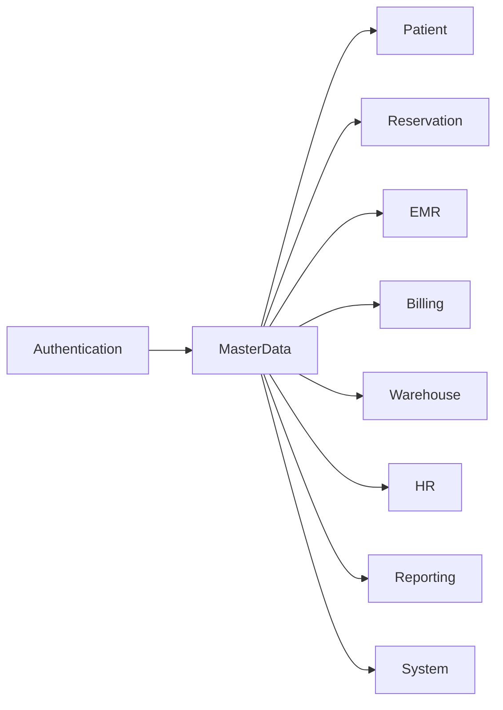
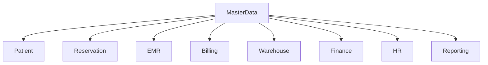
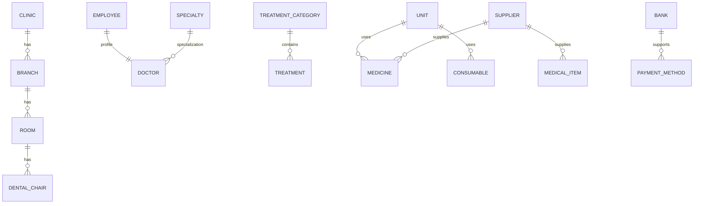
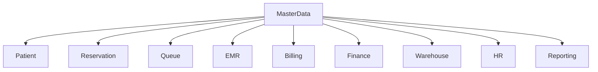
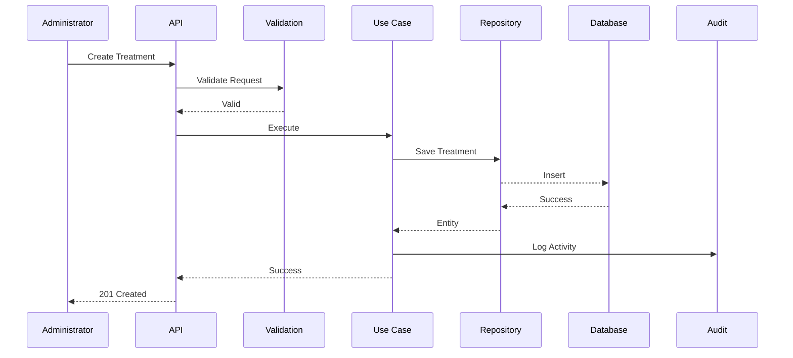
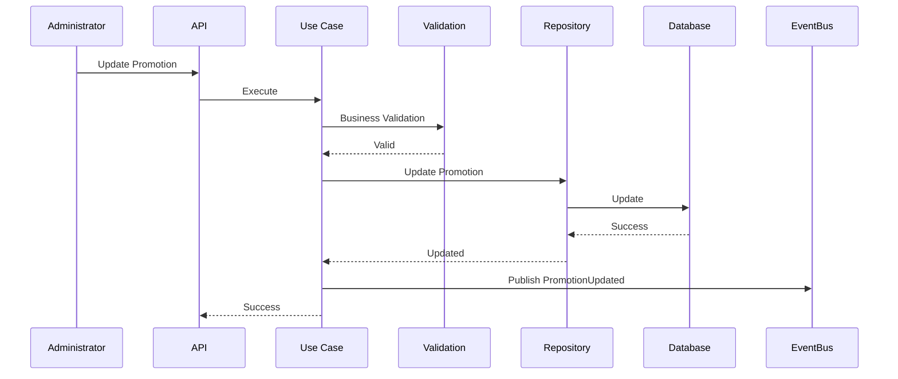
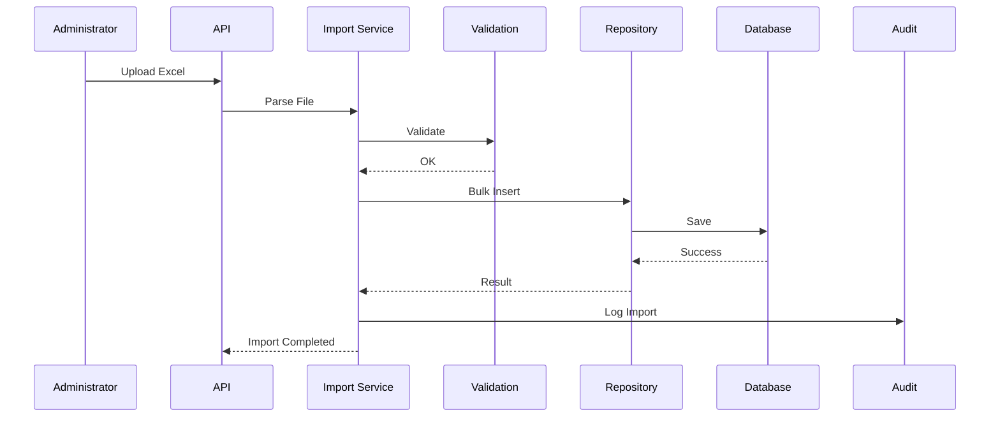

# Parakita Software Architecture Document (SAD)

# 11 - Module Master Data

| Document Information | |
|----------------------|----------------------------------------------|
| Project | Parakita - Dental Clinic Management System |
| Document | 11 - Module Master Data |
| Part | 1 of 4 |
| Version | 1.0.0 |
| Status | Draft |
| Document Type | Module Design Specification |
| Architecture Style | Clean Architecture + Domain Driven Design + Modular Monolith |
| Last Updated | July 2026 |

---

# Table of Contents (Part 1)

1. Introduction
2. Purpose
3. Scope
4. Module Overview
5. Business Objectives
6. Module Responsibilities
7. Module Dependency
8. Master Data Catalog
9. User Roles & Permissions
10. High Level Workflow

---

# 1. Introduction

## 1.1 Overview

Master Data merupakan salah satu **Generic Domain** pada Parakita yang menyediakan data referensi yang digunakan oleh seluruh modul bisnis.

Seluruh data yang bersifat konfiguratif dan jarang berubah dikelola melalui modul ini sehingga setiap modul menggunakan sumber data yang sama (Single Source of Truth).

Modul ini menjadi fondasi bagi proses operasional mulai dari registrasi pasien, reservasi, pemeriksaan dokter, billing, warehouse, hingga reporting.

---

## 1.2 Purpose

Tujuan utama modul Master Data adalah:

- Menyediakan data referensi terpusat.
- Menjaga konsistensi data antar modul.
- Mengurangi duplikasi data.
- Mempermudah konfigurasi sistem.
- Mendukung pengembangan multi-branch.
- Mempermudah audit dan maintenance.

---

## 1.3 Design Principles

Modul Master Data mengikuti prinsip berikut:

- Single Source of Truth
- Reusable Data
- Configurable
- Auditable
- Soft Delete
- Version Ready
- API First
- Secure by Default

---

# 2. Purpose

Dokumen ini menjelaskan desain fungsional dan teknis dari Module Master Data.

Dokumen ini menjadi referensi bagi:

- Solution Architect
- Backend Developer
- Frontend Developer
- QA Engineer
- Product Owner

Dokumen ini melengkapi blueprint arsitektur dan menjadi acuan implementasi modul Master Data sesuai prinsip **Clean Architecture**, **Domain Driven Design (DDD)**, dan **Modular Monolith**.

---

# 3. Scope

Modul Master Data mencakup pengelolaan seluruh data referensi yang digunakan oleh modul lain.

## In Scope

- Data Klinik
- Data Cabang
- Data Departemen
- Data Ruangan
- Data Dental Chair
- Data Dokter
- Data Pegawai
- Data Spesialisasi
- Data Treatment
- Data Treatment Category
- Data Medicine
- Data Medical Item
- Data Consumable
- Data Supplier
- Data Insurance
- Data Payment Method
- Data Bank
- Data Tax
- Data Discount
- Data Promotion
- Data Diagnosis Reference
- Data Tooth Condition Reference
- Data Procedure Code
- Data Unit
- Data Currency
- Data Nationality
- Data Religion
- Data Occupation
- Data Education

---

## Out of Scope

Modul berikut tidak termasuk dalam Master Data:

- Patient
- Reservation
- Queue
- EMR
- Billing
- Finance
- Warehouse Transaction
- HR Transaction
- Reporting

Master Data hanya menyediakan data referensi yang digunakan oleh modul-modul tersebut.

---

# 4. Module Overview

## 4.1 Overview

Master Data merupakan modul dasar yang menjadi dependency bagi hampir seluruh modul pada sistem Parakita.

Perubahan terhadap Master Data akan langsung memengaruhi proses bisnis yang menggunakan data tersebut.

Karena itu setiap perubahan harus melalui validasi, audit trail, dan pengaturan hak akses yang ketat.

---

## 4.2 Module Position

```text
                 Authentication
                        │
                        ▼
                 Master Data
      ┌─────────┼──────────┬─────────────┐
      ▼         ▼          ▼             ▼
   Patient  Reservation    EMR       Warehouse
      │         │           │             │
      └─────────┴──────┬────┴─────────────┘
                       ▼
                    Billing
                       │
                       ▼
                    Finance
                       │
                       ▼
                    Reporting
```

---

## 4.3 Module Characteristics

| Item | Value |
|------|--------|
| Domain Type | Generic Domain |
| Architecture | Clean Architecture |
| Database | MySQL |
| API | REST API |
| Authentication | JWT |
| Authorization | RBAC |
| Audit Trail | Enabled |
| Soft Delete | Enabled |
| Import Data | Supported |
| Export Data | Supported |

---

# 5. Business Objectives

Master Data dikembangkan untuk mencapai tujuan berikut.

## 5.1 Centralized Reference Data

Seluruh data referensi hanya disimpan pada satu lokasi sehingga digunakan secara konsisten oleh seluruh modul.

---

## 5.2 Standardization

Menjamin seluruh proses bisnis menggunakan standar data yang sama.

Contoh:

- Nama Treatment
- Kategori Treatment
- Payment Method
- Supplier
- Insurance
- Medical Item

---

## 5.3 Configurability

Administrator dapat melakukan perubahan konfigurasi tanpa perlu melakukan perubahan kode aplikasi.

---

## 5.4 Scalability

Mendukung penambahan cabang baru, dokter baru, treatment baru, maupun metode pembayaran baru tanpa perubahan arsitektur.

---

## 5.5 Data Integrity

Menjamin referensi yang digunakan oleh transaksi selalu valid, aktif, dan konsisten.

---

# 6. Module Responsibilities

Modul Master Data bertanggung jawab terhadap:

- Menyimpan seluruh data referensi.
- Menyediakan API referensi.
- Menjaga konsistensi data.
- Menyediakan pencarian data.
- Menyediakan filtering.
- Menyediakan pagination.
- Menyediakan import data.
- Menyediakan export data.
- Menyediakan audit trail.
- Menyediakan soft delete.
- Menyediakan validasi referensi.

---

## Responsibility Matrix

| Responsibility | Master Data |
|----------------|-------------|
| CRUD Master Data | ✔ |
| Validation | ✔ |
| Audit Trail | ✔ |
| Import | ✔ |
| Export | ✔ |
| Soft Delete | ✔ |
| Business Transaction | ✖ |
| Billing | ✖ |
| Finance | ✖ |
| EMR | ✖ |

---

# 7. Module Dependency

## 7.1 Incoming Dependency

Modul yang menggunakan Master Data:

- Patient
- Reservation
- Queue
- EMR
- Billing
- Finance
- Warehouse
- HR
- Reporting
- System

---

## 7.2 Outgoing Dependency

Master Data bergantung pada:

- Authentication
- System Parameter
- Audit Trail

---

## 7.3 Dependency Diagram



---

# 8. Master Data Catalog

## 8.1 Clinical Master Data

| Master Data | Description |
|--------------|-------------|
| Clinic | Data Klinik |
| Branch | Data Cabang |
| Department | Departemen |
| Room | Ruangan |
| Dental Chair | Kursi Perawatan |
| Doctor | Data Dokter |
| Specialty | Spesialisasi Dokter |
| Treatment | Daftar Tindakan |
| Treatment Category | Kategori Tindakan |
| Diagnosis Reference | Referensi Diagnosis |
| Tooth Condition | Referensi Kondisi Gigi |

---

## 8.2 Inventory Master Data

| Master Data | Description |
|--------------|-------------|
| Medicine | Obat |
| Medical Item | Alat Medis |
| Consumable | Bahan Habis Pakai |
| Supplier | Supplier |
| Unit | Satuan |

---

## 8.3 Financial Master Data

| Master Data | Description |
|--------------|-------------|
| Payment Method | Metode Pembayaran |
| Bank | Data Bank |
| Tax | Pajak |
| Discount | Diskon |
| Promotion | Promosi |

---

## 8.4 General Master Data

| Master Data | Description |
|--------------|-------------|
| Occupation | Pekerjaan |
| Education | Pendidikan |
| Religion | Agama |
| Nationality | Kewarganegaraan |
| Currency | Mata Uang |

---

# 9. User Roles & Permissions

| Role | Read | Create | Update | Delete | Import | Export |
|------|------|--------|--------|--------|--------|--------|
| Owner | ✔ | ✖ | ✖ | ✖ | ✖ | ✔ |
| Clinic Manager | ✔ | ✔ | ✔ | ✖ | ✔ | ✔ |
| Administrator | ✔ | ✔ | ✔ | ✔ | ✔ | ✔ |
| Doctor | Read Only | ✖ | ✖ | ✖ | ✖ | ✖ |
| Registration Staff | Read Only | ✖ | ✖ | ✖ | ✖ | ✖ |
| Cashier | Read Only | ✖ | ✖ | ✖ | ✖ | ✖ |
| Warehouse Staff | Read Inventory | ✖ | ✖ | ✖ | ✖ | ✖ |
| Finance Staff | Read Financial | ✖ | ✖ | ✖ | ✖ | ✖ |

---

## Permission Notes

Perubahan terhadap Master Data yang telah digunakan oleh transaksi harus mengikuti aturan:

- Tidak diperbolehkan Hard Delete.
- Menggunakan Soft Delete.
- Mencatat Audit Trail.
- Memvalidasi relasi data sebelum perubahan.
- Mencegah penghapusan data yang masih digunakan oleh transaksi aktif.

---

# 10. High Level Workflow

## 10.1 Master Data Management Flow

```mermaid
flowchart LR

Administrator

-->

Authentication

-->

Master Data Module

-->

Validation

-->

Database

-->

Audit Trail

-->

Response
```

---

## 10.2 CRUD Workflow

```text
Login

↓

Select Master Data

↓

Search / Filter

↓

Create / Update

↓

Business Validation

↓

Save Database

↓

Audit Trail

↓

Success Response
```

---

## 10.3 Cross Module Usage



---

# Summary Part 1

Part 1 menjelaskan ruang lingkup, tujuan, tanggung jawab, dependency, katalog Master Data, hak akses pengguna, serta alur kerja tingkat tinggi dari Module Master Data.

Sebagai **Generic Domain**, modul ini menjadi **Single Source of Truth** untuk seluruh data referensi yang digunakan oleh modul Patient, Reservation, EMR, Billing, Finance, Warehouse, HR, Reporting, dan System. Implementasi modul ini mengikuti prinsip **Clean Architecture**, **Domain Driven Design (DDD)**, **Modular Monolith**, serta mendukung Audit Trail, Soft Delete, Import/Export, dan Role-Based Access Control (RBAC).

# Parakita Software Architecture Document (SAD)

# 11 - Module Master Data

| Document Information | |
|----------------------|----------------------------------------------|
| Project | Parakita - Dental Clinic Management System |
| Document | 11 - Module Master Data |
| Part | 2 of 4 |
| Version | 1.0.0 |
| Status | Draft |
| Document Type | Module Design Specification |

---

# Table of Contents (Part 2)

11. Master Data Detail
- Clinic
- Branch
- Department
- Room
- Dental Chair
- Doctor
- Employee
- Specialty
- Treatment Category
- Treatment
- Medicine
- Medical Item
- Consumable
- Supplier
- Insurance
- Payment Method
- Bank
- Tax
- Discount
- Promotion

---

# 11. Master Data Detail

## 11.1 Clinic

### Purpose

Menyimpan informasi identitas klinik yang digunakan sebagai identitas utama sistem.

### Business Rules

- Minimal terdapat satu Clinic.
- Satu Clinic dapat memiliki banyak Branch.
- Clinic tidak dapat dihapus apabila masih memiliki Branch aktif.
- Logo klinik bersifat opsional.
- Clinic Code harus unik.

### Main Attributes

| Field | Type | Required |
|---------|------|----------|
| Code | String | ✔ |
| Name | String | ✔ |
| Legal Name | String | ✔ |
| Tax Number | String | ✔ |
| Email | String | ✔ |
| Phone | String | ✔ |
| Address | Text | ✔ |
| Logo | File | Optional |
| Status | Boolean | ✔ |

---

## 11.2 Branch

### Purpose

Menyimpan data cabang klinik.

### Business Rules

- Branch berada di bawah satu Clinic.
- Branch Code unik.
- Branch dapat dinonaktifkan.
- Default Branch ditentukan melalui System Parameter.
- Branch tidak boleh dihapus apabila memiliki transaksi.

### Main Attributes

| Field | Type |
|---------|------|
| Branch Code | String |
| Branch Name | String |
| Clinic ID | UUID |
| Address | Text |
| Phone | String |
| Email | String |
| Time Zone | String |
| Status | Boolean |

---

## 11.3 Department

### Purpose

Mengelompokkan area operasional dalam klinik.

### Example

- Registration
- Doctor
- Nursing
- Pharmacy
- Warehouse
- Finance
- HR
- Management

### Business Rules

- Department Name unik.
- Department dapat dinonaktifkan.
- Digunakan oleh Employee dan Reporting.

---

## 11.4 Room

### Purpose

Menyimpan data ruangan operasional klinik.

### Example

- Room 1
- Room 2
- Surgery Room
- X-Ray Room
- Sterilization Room

### Business Rules

- Room berada pada satu Branch.
- Room Name unik dalam satu Branch.
- Room dapat memiliki banyak Dental Chair.

---

## 11.5 Dental Chair

### Purpose

Menyimpan data kursi perawatan yang digunakan dalam proses reservasi dan EMR.

### Business Rules

- Chair berada pada satu Room.
- Chair Number unik dalam satu Room.
- Chair dapat diaktifkan atau dinonaktifkan.
- Digunakan pada penjadwalan dokter.

### Main Attributes

| Field | Type |
|---------|------|
| Chair Code | String |
| Chair Name | String |
| Room ID | UUID |
| Status | Boolean |

---

## 11.6 Doctor

### Purpose

Menyimpan profil dokter yang memberikan pelayanan medis.

### Business Rules

- Doctor terhubung dengan Employee.
- Memiliki minimal satu Specialty.
- Memiliki Practice Schedule.
- Dapat bekerja pada lebih dari satu Branch.
- Status Active wajib sebelum dapat menerima reservasi.

### Main Attributes

| Field | Type |
|---------|------|
| Doctor Code | String |
| Employee ID | UUID |
| STR Number | String |
| SIP Number | String |
| Specialty ID | UUID |
| Join Date | Date |
| Status | Boolean |

---

## 11.7 Employee

### Purpose

Menyimpan data seluruh pegawai klinik.

### Business Rules

- Employee Code unik.
- Employee dapat memiliki User Account.
- Employee dapat dipetakan ke Department.
- Digunakan oleh HR Module.

### Example Position

- Dentist
- Nurse
- Receptionist
- Cashier
- Finance
- Warehouse Staff
- Administrator

---

## 11.8 Specialty

### Purpose

Referensi spesialisasi dokter.

### Example

- General Dentist
- Orthodontist
- Prosthodontist
- Endodontist
- Periodontist
- Oral Surgeon
- Pediatric Dentist

### Business Rules

- Specialty Name unik.
- Digunakan oleh Doctor.

---

## 11.9 Treatment Category

### Purpose

Mengelompokkan tindakan medis berdasarkan jenis layanan.

### Example

- Consultation
- Preventive
- Restoration
- Endodontic
- Orthodontic
- Surgery
- Cosmetic

### Business Rules

- Category Name unik.
- Digunakan oleh Treatment.

---

## 11.10 Treatment

### Purpose

Menyimpan seluruh tindakan medis yang dapat dipilih pada EMR dan Billing.

### Business Rules

- Treatment berada pada satu Category.
- Memiliki Default Price.
- Dapat menggunakan Inventory.
- Dapat dihitung Doctor Fee.
- Dapat diberikan Discount.
- Dapat dinonaktifkan tanpa menghapus histori transaksi.

### Main Attributes

| Field | Type |
|---------|------|
| Treatment Code | String |
| Treatment Name | String |
| Category ID | UUID |
| Duration | Integer |
| Price | Decimal |
| Doctor Fee Type | Enum |
| Doctor Fee Value | Decimal |
| Active | Boolean |

---

## 11.11 Medicine

### Purpose

Referensi obat yang digunakan pada tindakan maupun resep.

### Business Rules

- Medicine Code unik.
- Memiliki Unit.
- Memiliki Purchase Price.
- Memiliki Selling Price.
- Dapat memiliki Minimum Stock.

### Main Attributes

| Field | Type |
|---------|------|
| Medicine Code | String |
| Medicine Name | String |
| Generic Name | String |
| Unit ID | UUID |
| Purchase Price | Decimal |
| Selling Price | Decimal |
| Active | Boolean |

---

## 11.12 Medical Item

### Purpose

Referensi alat medis yang digunakan dalam operasional klinik.

### Example

- Mirror
- Forceps
- Excavator
- Scaler
- Surgical Kit

### Business Rules

- Dapat memiliki Serial Number.
- Dapat dikategorikan sebagai Asset.
- Digunakan oleh Warehouse.

---

## 11.13 Consumable

### Purpose

Menyimpan data bahan habis pakai.

### Example

- Gloves
- Cotton Roll
- Composite Resin
- Etchant
- Bonding Agent
- Needle
- Syringe

### Business Rules

- Memiliki Unit.
- Digunakan oleh Treatment.
- Mengurangi stok saat tindakan selesai.

---

## 11.14 Supplier

### Purpose

Menyimpan data pemasok obat dan alat medis.

### Main Attributes

| Field | Type |
|---------|------|
| Supplier Code | String |
| Supplier Name | String |
| Contact Person | String |
| Phone | String |
| Email | String |
| Address | Text |
| NPWP | String |
| Status | Boolean |

### Business Rules

- Supplier Code unik.
- Supplier tidak boleh dihapus apabila memiliki Purchase Order.

---

## 11.15 Insurance

### Purpose

Referensi perusahaan asuransi yang bekerja sama dengan klinik.

### Business Rules

- Insurance Code unik.
- Dapat memiliki banyak Corporate Agreement.
- Digunakan pada registrasi pasien dan billing.

---

## 11.16 Payment Method

### Purpose

Menyimpan metode pembayaran yang tersedia.

### Example

- Cash
- Debit Card
- Credit Card
- Bank Transfer
- QRIS
- E-Wallet

### Business Rules

- Payment Method dapat diaktifkan/nonaktifkan.
- Digunakan oleh Billing.

---

## 11.17 Bank

### Purpose

Referensi bank yang digunakan dalam transaksi keuangan.

### Example

- BCA
- Mandiri
- BNI
- BRI
- CIMB Niaga

### Business Rules

- Bank Code unik.
- Digunakan oleh Finance dan Billing.

---

## 11.18 Tax

### Purpose

Referensi pajak yang digunakan pada transaksi.

### Main Attributes

| Field | Type |
|---------|------|
| Tax Code | String |
| Tax Name | String |
| Percentage | Decimal |
| Active | Boolean |

### Business Rules

- Persentase harus berada pada rentang 0–100%.
- Digunakan oleh Billing.

---

## 11.19 Discount

### Purpose

Menyimpan konfigurasi diskon standar.

### Example

- Employee Discount
- Member Discount
- Promotional Discount
- Senior Citizen Discount

### Business Rules

- Discount dapat berupa Percentage atau Fixed Amount.
- Memiliki periode berlaku.
- Dapat dibatasi berdasarkan Treatment.

---

## 11.20 Promotion

### Purpose

Mengelola program promosi klinik.

### Example

- Scaling Package
- Whitening Promo
- Orthodontic Package
- New Patient Promo

### Business Rules

- Promotion memiliki Start Date dan End Date.
- Promotion dapat berlaku pada Branch tertentu.
- Promotion dapat dikombinasikan sesuai kebijakan klinik.
- Promotion dapat dinonaktifkan tanpa menghapus histori transaksi.

---

# Summary Part 2

Part 2 menjelaskan seluruh Master Data utama yang digunakan dalam sistem Parakita, meliputi data organisasi, sumber daya klinik, tenaga medis, layanan, inventaris, keuangan, dan promosi. Setiap master data memiliki tujuan, atribut utama, serta business rules yang menjadi acuan implementasi pada Backend, Frontend, Database, dan API agar seluruh modul menggunakan referensi data yang konsisten.

# Parakita Software Architecture Document (SAD)

# 11 - Module Master Data

| Document Information | |
|----------------------|----------------------------------------------|
| Project | Parakita - Dental Clinic Management System |
| Document | 11 - Module Master Data |
| Part | 3 of 4 |
| Version | 1.0.0 |
| Status | Draft |
| Document Type | Module Design Specification |

---

# Table of Contents (Part 3)

12. Business Rules
13. Validation Rules
14. CRUD Flow
15. Approval Flow
16. Versioning Strategy
17. Audit Trail
18. Soft Delete Policy
19. Import & Export
20. Master Data Relationship

---

# 12. Business Rules

Master Data merupakan referensi utama bagi seluruh modul sehingga setiap perubahan harus mengikuti aturan bisnis yang ketat.

---

## 12.1 General Rules

- Setiap Master Data memiliki Primary Key (UUID).
- Setiap Master Data memiliki Code yang unik.
- Code tidak boleh diubah setelah data digunakan transaksi.
- Name wajib diisi.
- Status Active menentukan apakah data dapat digunakan.
- Seluruh perubahan harus dicatat pada Audit Trail.

---

## 12.2 Reference Integrity

Master Data yang telah digunakan oleh transaksi tidak boleh dihapus secara permanen.

Contoh:

- Treatment yang sudah digunakan pada EMR.
- Payment Method yang sudah digunakan Billing.
- Supplier yang memiliki Purchase Order.
- Branch yang memiliki Patient.

---

## 12.3 Activation Rule

Data yang tidak aktif:

- Tidak muncul pada dropdown transaksi.
- Tidak dapat dipilih pada transaksi baru.
- Tetap ditampilkan pada histori transaksi.

---

## 12.4 Branch Scope

Sebagian Master Data dapat bersifat:

- Global
- Branch Specific

Contoh:

| Master Data | Scope |
|--------------|--------|
| Treatment Category | Global |
| Treatment | Global |
| Payment Method | Global |
| Tax | Global |
| Promotion | Branch |
| Room | Branch |
| Dental Chair | Branch |
| Doctor Schedule | Branch |

---

## 12.5 Transaction Dependency

Master Data tidak boleh diubah apabila perubahan tersebut menyebabkan inkonsistensi transaksi.

Contoh:

- Mengubah Unit Medicine yang telah memiliki stok.
- Mengubah Currency transaksi aktif.
- Menghapus Tax yang digunakan Invoice.

---

# 13. Validation Rules

## 13.1 Required Validation

Field wajib diisi sesuai jenis Master Data.

Contoh:

| Master Data | Required Field |
|--------------|----------------|
| Clinic | Code, Name |
| Branch | Code, Name |
| Treatment | Code, Name, Category |
| Medicine | Code, Name, Unit |
| Supplier | Code, Name |
| Bank | Code, Name |

---

## 13.2 Unique Validation

Field berikut harus unik.

| Entity | Unique Field |
|---------|--------------|
| Clinic | Clinic Code |
| Branch | Branch Code |
| Department | Department Name |
| Room | Room Code |
| Chair | Chair Code |
| Doctor | Doctor Code |
| Employee | Employee Code |
| Treatment | Treatment Code |
| Medicine | Medicine Code |
| Supplier | Supplier Code |
| Bank | Bank Code |
| Tax | Tax Code |

---

## 13.3 Business Validation

### Treatment

- Harga tidak boleh negatif.
- Durasi minimal 1 menit.
- Doctor Fee tidak boleh melebihi harga treatment.

---

### Medicine

- Purchase Price ≥ 0
- Selling Price ≥ Purchase Price
- Unit wajib dipilih.

---

### Promotion

- Start Date ≤ End Date.
- Tidak boleh overlap apabila Promotion bersifat Exclusive.

---

### Discount

- Percentage maksimal 100%.
- Fixed Amount tidak boleh negatif.

---

### Tax

- Nilai pajak berada pada rentang 0–100%.

---

## 13.4 Delete Validation

Sebelum Soft Delete dilakukan, sistem harus memeriksa:

- Apakah data digunakan transaksi.
- Apakah data menjadi Foreign Key.
- Apakah data masih aktif digunakan modul lain.

---

# 14. CRUD Flow

## 14.1 Create Flow

```mermaid
flowchart LR

User

-->

Authentication

-->

Authorization

-->

Validation

-->

Create Master Data

-->

Save Database

-->

Audit Trail

-->

Success
```

---

## 14.2 Update Flow

```mermaid
flowchart LR

Search Data

-->

Edit

-->

Business Validation

-->

Save

-->

Audit Trail

-->

Response
```

---

## 14.3 Delete Flow

```mermaid
flowchart LR

Find Data

-->

Dependency Check

-->

Soft Delete

-->

Audit Trail

-->

Success
```

---

## 14.4 Read Flow

```text
Search

↓

Filter

↓

Sorting

↓

Pagination

↓

Response
```

---

# 15. Approval Flow

Sebagian Master Data dapat memerlukan proses persetujuan sebelum perubahan berlaku.

---

## 15.1 Approval Candidate

- Promotion
- Discount
- Tax
- Treatment Price
- Doctor Fee Configuration

---

## 15.2 Approval Workflow

```mermaid
flowchart LR

Administrator

-->

Submit

-->

Manager Approval

-->

Approved

-->

Publish

-->

Audit Trail
```

---

## 15.3 Approval Status

| Status | Description |
|----------|-------------|
| Draft | Belum diajukan |
| Submitted | Menunggu Approval |
| Approved | Berlaku |
| Rejected | Ditolak |
| Archived | Tidak Aktif |

---

# 16. Versioning Strategy

Master Data mendukung versioning untuk data tertentu yang memiliki histori perubahan.

---

## 16.1 Versioned Data

- Treatment Price
- Tax
- Promotion
- Discount
- Doctor Fee

---

## 16.2 Version Rules

- Setiap perubahan membuat versi baru.
- Versi lama tetap tersimpan.
- Histori dapat ditampilkan.
- Transaksi menggunakan versi yang berlaku saat transaksi dibuat.

---

## 16.3 Example

```text
Treatment Scaling

Version 1
Rp300.000

↓

Version 2
Rp350.000

↓

Invoice Lama
Tetap menggunakan Rp300.000
```

---

# 17. Audit Trail

Seluruh aktivitas Master Data dicatat secara otomatis.

---

## 17.1 Logged Activity

- Create
- Update
- Delete
- Import
- Export
- Approve
- Reject
- Restore

---

## 17.2 Audit Information

| Field | Description |
|---------|-------------|
| Timestamp | Waktu |
| User | Pengguna |
| Module | Master Data |
| Entity | Nama Master |
| Entity ID | UUID |
| Action | CRUD |
| Old Value | Sebelum |
| New Value | Sesudah |
| IP Address | Client |
| User Agent | Browser |

---

## 17.3 Audit Flow

```mermaid
flowchart LR

CRUD

-->

Audit Logger

-->

Audit Database
```

---

# 18. Soft Delete Policy

Master Data menggunakan Soft Delete.

---

## 18.1 Principle

Data tidak dihapus secara fisik.

Field berikut digunakan:

```text
deleted_at

deleted_by
```

---

## 18.2 Benefits

- Histori tetap tersedia.
- Mendukung Audit.
- Tidak merusak Foreign Key.
- Mempermudah Restore.

---

## 18.3 Restore Flow

```text
Deleted Data

↓

Restore

↓

Validation

↓

Active Again
```

---

# 19. Import & Export

## 19.1 Supported Import

- Excel (.xlsx)
- CSV

---

## 19.2 Supported Export

- Excel
- CSV
- PDF (Report)

---

## 19.3 Import Workflow

```mermaid
flowchart LR

Upload File

-->

Template Validation

-->

Business Validation

-->

Import Database

-->

Audit Trail

-->

Result
```

---

## 19.4 Import Validation

Sistem memvalidasi:

- Duplicate Code
- Required Field
- Invalid Format
- Invalid Reference
- Existing Data

---

## 19.5 Export Features

Export mendukung:

- Search Result
- Filter Result
- Selected Data
- All Data

---

# 20. Master Data Relationship

## 20.1 Relationship Diagram



---

## 20.2 Cross Module Usage

| Master Data | Used By |
|--------------|---------|
| Branch | Patient, Reservation, Billing |
| Room | Reservation |
| Dental Chair | Reservation, EMR |
| Doctor | Reservation, EMR |
| Treatment | EMR, Billing |
| Medicine | EMR, Warehouse |
| Consumable | EMR, Warehouse |
| Supplier | Warehouse |
| Payment Method | Billing |
| Tax | Billing |
| Promotion | Billing |
| Discount | Billing |

---

# Summary Part 3

Part 3 mendefinisikan aturan bisnis, validasi, alur CRUD, mekanisme approval, versioning, audit trail, soft delete, import/export, serta hubungan antar Master Data. Standar ini memastikan seluruh data referensi tetap konsisten, dapat diaudit, aman terhadap perubahan, dan dapat digunakan secara bersama oleh seluruh modul dalam sistem Parakita.

# Parakita Software Architecture Document (SAD)

# 11 - Module Master Data

| Document Information | |
|----------------------|----------------------------------------------|
| Project | Parakita - Dental Clinic Management System |
| Document | 11 - Module Master Data |
| Part | 4 of 4 |
| Version | 1.0.0 |
| Status | Draft |
| Document Type | Module Design Specification |

---

# Table of Contents (Part 5)

30. Database Tables
31. Domain Events
32. Integration with Other Modules
33. Sequence Diagrams
34. Future Enhancement
35. Summary

---

# 30. Database Tables

## 30.1 Master Tables

| Table | Description |
|--------|-------------|
| mst_clinics | Data klinik |
| mst_branches | Data cabang |
| mst_departments | Departemen |
| mst_rooms | Ruangan |
| mst_dental_chairs | Kursi perawatan |
| mst_specialties | Spesialisasi dokter |
| mst_doctors | Dokter |
| mst_employees | Pegawai |
| mst_treatment_categories | Kategori tindakan |
| mst_treatments | Master tindakan |
| mst_medicines | Master obat |
| mst_medical_items | Master alat medis |
| mst_consumables | Master bahan habis pakai |
| mst_suppliers | Supplier |
| mst_insurances | Asuransi |
| mst_payment_methods | Metode pembayaran |
| mst_banks | Bank |
| mst_taxes | Pajak |
| mst_discounts | Diskon |
| mst_promotions | Promosi |
| mst_units | Satuan |
| mst_currencies | Mata uang |
| mst_religions | Agama |
| mst_nationalities | Kewarganegaraan |
| mst_occupations | Pekerjaan |
| mst_educations | Pendidikan |

---

## 30.2 Shared Columns

Seluruh tabel Master Data menggunakan standar kolom berikut.

| Column | Type | Description |
|---------|------|-------------|
| id | UUID | Primary Key |
| code | VARCHAR | Business Code |
| name | VARCHAR | Nama Master |
| description | TEXT | Keterangan |
| is_active | BOOLEAN | Status aktif |
| created_at | DATETIME | Waktu dibuat |
| created_by | UUID | Dibuat oleh |
| updated_at | DATETIME | Waktu diperbarui |
| updated_by | UUID | Diperbarui oleh |
| deleted_at | DATETIME | Soft Delete |
| deleted_by | UUID | Soft Delete User |

---

## 30.3 Index Recommendation

| Table | Index |
|---------|-------|
| mst_branches | clinic_id |
| mst_rooms | branch_id |
| mst_dental_chairs | room_id |
| mst_doctors | employee_id |
| mst_treatments | category_id |
| mst_medicines | supplier_id |
| mst_payment_methods | code |
| mst_promotions | start_date, end_date |

---

## 30.4 Foreign Key Overview

```text
Clinic
    │
    └── Branch
            │
            ├── Room
            │      │
            │      └── Dental Chair
            │
            └── Doctor Schedule

Treatment Category
        │
        └── Treatment

Supplier
      ├── Medicine
      └── Medical Item
```

---

# 31. Domain Events

Master Data menggunakan Domain Event untuk memberi tahu modul lain ketika terjadi perubahan data referensi.

---

## 31.1 Event List

| Event | Trigger |
|---------|----------|
| ClinicCreated | Klinik baru dibuat |
| ClinicUpdated | Klinik diperbarui |
| BranchCreated | Cabang dibuat |
| BranchUpdated | Cabang diperbarui |
| DoctorCreated | Dokter dibuat |
| DoctorUpdated | Dokter diperbarui |
| TreatmentCreated | Treatment dibuat |
| TreatmentUpdated | Treatment diperbarui |
| MedicineCreated | Obat dibuat |
| MedicineUpdated | Obat diperbarui |
| PromotionActivated | Promosi aktif |
| PromotionExpired | Promosi berakhir |
| DiscountUpdated | Diskon berubah |
| PaymentMethodUpdated | Metode pembayaran berubah |

---

## 31.2 Event Payload Example

```json
{
  "event": "TreatmentUpdated",
  "entityId": "uuid",
  "code": "TRT001",
  "name": "Scaling",
  "updatedBy": "administrator",
  "updatedAt": "2026-07-31T10:00:00Z"
}
```

---

## 31.3 Event Consumer

| Event | Consumer Module |
|---------|----------------|
| BranchUpdated | Patient |
| DoctorUpdated | Reservation |
| DoctorUpdated | EMR |
| TreatmentUpdated | EMR |
| TreatmentUpdated | Billing |
| PromotionActivated | Billing |
| PaymentMethodUpdated | Billing |
| SupplierUpdated | Warehouse |

---

# 32. Integration with Other Modules

## 32.1 Integration Matrix

| Module | Integration |
|----------|-------------|
| Authentication | Authorization & Permission |
| Patient | Branch, Insurance |
| Reservation | Branch, Doctor, Chair |
| Queue | Branch |
| EMR | Doctor, Treatment, Medicine |
| Billing | Treatment, Discount, Promotion, Tax |
| Finance | Bank, Payment Method |
| Warehouse | Supplier, Medicine, Consumable |
| HR | Employee, Department |
| Reporting | Seluruh Master Data |

---

## 32.2 Integration Diagram



---

## 32.3 Public Services

Modul Master Data menyediakan service yang dapat digunakan modul lain.

| Service | Description |
|----------|-------------|
| Branch Service | Validasi cabang |
| Doctor Service | Data dokter |
| Treatment Service | Informasi tindakan |
| Medicine Service | Data obat |
| Supplier Service | Supplier |
| Payment Service | Metode pembayaran |
| Promotion Service | Promo aktif |
| Tax Service | Pajak aktif |

---

# 33. Sequence Diagrams

## 33.1 Create Treatment



---

## 33.2 Update Promotion



---

## 33.3 Import Master Data



---

# 34. Future Enhancement

## 34.1 Planned Features

- Dynamic Master Data Configuration
- Multi Language Master Data
- Configurable Lookup Table
- Master Data Approval Workflow
- Bulk Update
- Bulk Activation
- Bulk Deactivation
- Data Synchronization Antar Cabang
- API Cache Layer
- Real-time Event Notification

---

## 34.2 Performance Optimization

Rencana optimasi:

- Redis Cache
- Read Replica Database
- Lazy Loading
- Query Optimization
- Full Text Search
- Background Import Job

---

## 34.3 Scalability Plan

Master Data dirancang agar mudah dipisahkan menjadi layanan independen apabila sistem berkembang menjadi arsitektur Microservices.

Strategi yang disiapkan meliputi:

- Independent REST API
- Event-Driven Communication
- Separate Database
- Distributed Cache
- Centralized Configuration Service

---

# 35. Summary

Module Master Data merupakan **Generic Domain** yang menjadi fondasi seluruh aplikasi Parakita.

Seluruh data referensi yang digunakan oleh modul Patient, Reservation, Queue, EMR, Billing, Finance, Warehouse, HR, Reporting, dan System dikelola secara terpusat melalui modul ini.

Karakteristik utama modul meliputi:

- Single Source of Truth
- Centralized Reference Management
- Clean Architecture
- Domain Driven Design (DDD)
- Modular Monolith
- REST API First
- Audit Trail
- Soft Delete
- Import & Export
- Version Ready
- Domain Event Integration
- Role-Based Access Control (RBAC)

Dengan adanya standar ini, seluruh modul dalam Parakita dapat menggunakan data referensi yang konsisten, mudah dipelihara, aman terhadap perubahan, mudah diaudit, serta siap dikembangkan menuju arsitektur yang lebih besar di masa depan tanpa mengubah fondasi bisnis yang telah dibangun.

---

# End of Document

**Document:** 11 - Module Master Data  
**Total Parts:** 5  
**Status:** Draft v1.0.0