# Parakita Software Design Document (SDD)

# 12 - Module Patient (Part 1)

| Document Information | |
|----------------------|----------------------------------------------|
| Project | Parakita - Dental Clinic Management System |
| Document | 12 - Module Patient |
| Part | 1 of 5 |
| Version | 1.0.0 |
| Status | Draft |
| Document Type | Module Design Document |
| Architecture | Clean Architecture + Modular Monolith |
| Last Updated | July 2026 |

---

# Table of Contents (Part 1)

1. Purpose
2. Scope
3. Module Responsibilities
4. Business Process Overview
5. Business Rules
6. Patient Lifecycle
7. Patient Status

---

# 1. Purpose

## 1.1 Overview

Modul **Patient** merupakan pusat pengelolaan seluruh informasi pasien dalam sistem Parakita.

Seluruh proses yang berhubungan dengan identitas pasien akan menggunakan data yang berasal dari modul ini.

Modul Patient menjadi sumber data utama (Single Source of Truth) yang digunakan oleh berbagai modul lain, seperti:

- Reservation
- Queue
- Electronic Medical Record (EMR)
- Billing
- Finance
- Reporting

Modul ini memastikan bahwa setiap pasien memiliki identitas yang unik, riwayat kunjungan yang terdokumentasi dengan baik, dan data yang konsisten di seluruh sistem.

---

## 1.2 Objectives

Tujuan utama modul Patient adalah:

- Mengelola data master pasien.
- Menghindari duplikasi data pasien.
- Menyediakan Medical Record Number (MRN) yang unik.
- Menyimpan informasi identitas pasien secara lengkap.
- Menyediakan riwayat kunjungan pasien.
- Menjadi referensi utama seluruh proses klinik.

---

## 1.3 Relationship with Other Modules

```text
Authentication
        │
        ▼
Master Data
        │
        ▼
Patient
        │
 ┌──────┼──────────┬───────────┐
 ▼      ▼          ▼           ▼
Reservation Queue  EMR      Billing
                           │
                           ▼
                        Finance
                           │
                           ▼
                       Reporting
```

---

# 2. Scope

Modul Patient mencakup seluruh proses administrasi data pasien sebelum pasien menjalani pelayanan medis.

## In Scope

- Registrasi pasien baru
- Update data pasien
- Pencarian pasien
- Detail pasien
- Riwayat kunjungan
- Riwayat reservasi
- Riwayat tindakan
- Riwayat pembayaran
- Upload foto pasien
- Pengelolaan kontak darurat
- Pengelolaan alamat pasien (berjenjang: Provinsi, Kabupaten/Kota, Kecamatan, Kelurahan/Desa — referensi Master Data)
- Pencatatan sumber rujukan pasien (referral source)
- Registrasi cepat pasien (Quick Add Patient) dari layar Reservasi
- Merge data pasien (Administrator)
- Soft Delete pasien

---

## Out of Scope

Fitur berikut berada pada modul lain.

| Feature | Module |
|----------|--------|
| Appointment | Reservation |
| Queue Number | Queue |
| SOAP | EMR |
| Odontogram | EMR |
| Treatment | EMR |
| Invoice | Billing |
| Payment | Billing |
| Doctor Fee | Finance |

---

# 3. Module Responsibilities

Modul Patient bertanggung jawab terhadap seluruh data identitas pasien yang digunakan sepanjang siklus pelayanan klinik.

## Responsibilities

- Menyimpan identitas pasien
- Menghasilkan Medical Record Number (MRN)
- Menjaga keunikan data pasien
- Menyimpan data kontak
- Menyimpan alamat
- Menyimpan informasi demografi
- Menyediakan pencarian pasien
- Menyediakan riwayat kunjungan
- Menyediakan informasi pasien untuk modul lain

---

## Not Responsible

Modul Patient **tidak bertanggung jawab** terhadap:

- Reservasi pasien
- Nomor antrian
- Pemeriksaan dokter
- Rekam medis
- Billing
- Pembayaran
- Perhitungan jasa dokter

Seluruh proses tersebut berada pada bounded context masing-masing sesuai prinsip Domain Driven Design (DDD).

---

# 4. Business Process Overview

## 4.1 Patient Registration

```mermaid
flowchart LR

Patient

-->

Registration

-->

Validate Identity

-->

Generate MRN

-->

Save Patient

-->

Patient Created
```

Langkah proses:

1. Petugas melakukan registrasi pasien.
2. Sistem memvalidasi data wajib.
3. Sistem memeriksa kemungkinan data pasien sudah ada.
4. Sistem menghasilkan Medical Record Number (MRN).
5. Data pasien disimpan.
6. Pasien siap melakukan reservasi atau check-in.

---

## 4.2 Existing Patient

```mermaid
flowchart LR

Search Patient

-->

Patient Found

-->

Update (Optional)

-->

Reservation
```

---

## 4.3 Update Patient

```mermaid
flowchart LR

Open Patient

-->

Edit Information

-->

Validation

-->

Save Changes
```

---

## 4.4 Patient Search

Pencarian pasien dapat dilakukan berdasarkan:

- Medical Record Number (MRN)
- Nama pasien
- Nomor Identitas (NIK/Passport)
- Nomor Telepon
- Tanggal Lahir
- Email

Sistem mendukung kombinasi filter untuk mempercepat proses pencarian.

---

# 5. Business Rules

## 5.1 General Rules

- Setiap pasien hanya memiliki satu Medical Record Number (MRN).
- MRN tidak boleh berubah setelah dibuat.
- Nomor identitas harus unik apabila diisi.
- Pasien dapat memiliki lebih dari satu nomor telepon.
- Pasien dapat memiliki lebih dari satu alamat, namun hanya satu yang ditandai sebagai alamat utama (`isPrimary`).
- Setiap level alamat (Provinsi, Kabupaten/Kota, Kecamatan, Kelurahan/Desa) mengacu pada tabel referensi Master Data — tidak diisi sebagai teks bebas, agar dapat digunakan untuk pencarian dan pelaporan wilayah yang konsisten.
- Nomor asuransi (insurance number), akun Instagram, Facebook, TikTok, dan nomor WhatsApp bersifat opsional dan tidak divalidasi keunikannya.
- Sumber rujukan (referral source) bersifat opsional. Jika diisi, sistem mencatat jenis sumber (mis. Google, Instagram, Facebook, TikTok, Teman, Datang Sendiri, Alodokter, Lain-lain) dan — khusus untuk sumber yang berasal dari staf klinik (dokter, perawat, pegawai) — mencatat identitas staf yang memberi rujukan (`referredByUserId`). Konsep ini berbeda dari "Referral" klinis pada Modul EMR (rujukan pasien ke spesialis/rumah sakit/laboratorium dari sebuah Visit); keduanya tidak boleh disatukan.
- Soft Delete hanya dapat dilakukan apabila pasien belum memiliki transaksi klinik.

---

## 5.2 Registration Rules

- Nama pasien wajib diisi.
- Jenis kelamin wajib dipilih.
- Tanggal lahir wajib diisi.
- Nomor telepon minimal satu.
- Sistem harus melakukan pengecekan kemungkinan pasien ganda (duplicate checking).

---

## 5.3 Duplicate Prevention

Sistem melakukan pemeriksaan berdasarkan kombinasi:

- Nama
- Tanggal Lahir
- Nomor Identitas
- Nomor Telepon

Apabila ditemukan data dengan tingkat kemiripan tinggi, sistem menampilkan peringatan kepada petugas sebelum registrasi dilanjutkan.

---

## 5.4 Update Rules

- MRN tidak dapat diubah.
- Riwayat kunjungan tidak boleh dihapus.
- Perubahan data pasien dicatat pada Audit Trail.
- Perubahan identitas pasien hanya dapat dilakukan oleh pengguna yang memiliki izin.

---

# 6. Patient Lifecycle

Siklus hidup data pasien pada Parakita mengikuti alur berikut.

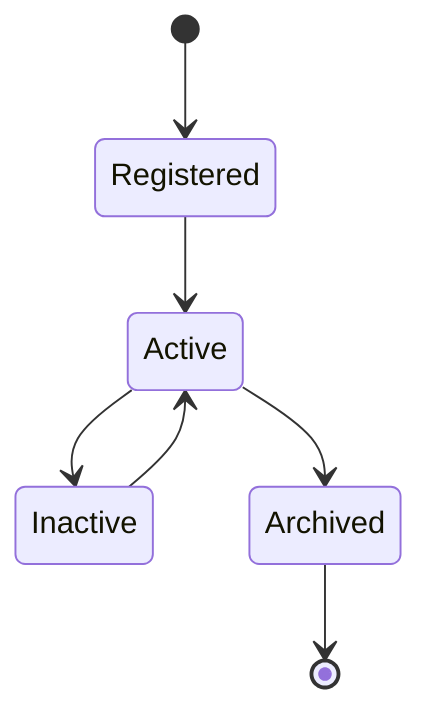

---

## Lifecycle Description

| State | Description |
|--------|-------------|
| Registered | Pasien baru selesai didaftarkan |
| Active | Pasien aktif menggunakan layanan klinik |
| Inactive | Tidak memiliki kunjungan dalam periode tertentu |
| Archived | Data diarsipkan sesuai kebijakan retensi |

---

# 7. Patient Status

Status pasien digunakan untuk menunjukkan kondisi administratif pasien.

| Status | Description |
|---------|-------------|
| Registered | Pasien telah terdaftar tetapi belum pernah berkunjung |
| Active | Pasien aktif |
| Inactive | Tidak aktif dalam periode tertentu |
| Archived | Data pasien telah diarsipkan |
| Deceased | Pasien telah meninggal (opsional) |

---

## Status Transition

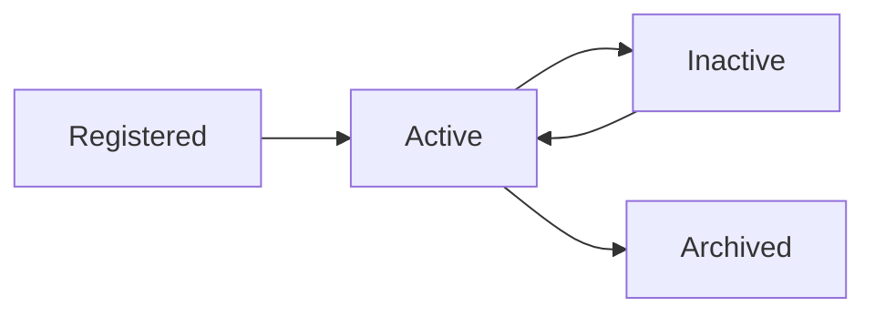

---

# Summary Part 1

Part 1 menjelaskan tujuan, ruang lingkup, tanggung jawab, proses bisnis, aturan bisnis, lifecycle, dan status pasien pada modul **Patient**. Modul ini menjadi **Single Source of Truth** untuk seluruh identitas pasien dan menyediakan data utama yang digunakan oleh modul Reservation, Queue, EMR, Billing, Finance, serta Reporting sesuai prinsip **Clean Architecture**, **Domain Driven Design (DDD)**, dan **Modular Monolith**.

# Parakita Software Design Document (SDD)

# 12 - Module Patient (Part 2)

| Document Information | |
|----------------------|----------------------------------------------|
| Project | Parakita - Dental Clinic Management System |
| Document | 12 - Module Patient |
| Part | 2 of 5 |
| Version | 1.0.0 |
| Status | Draft |
| Document Type | Module Design Document |
| Architecture | Clean Architecture + Modular Monolith |
| Last Updated | July 2026 |

---

# Table of Contents (Part 2)

8. Functional Requirements
9. Use Cases
10. User Roles & Permissions
11. Workflow Diagram
12. UI Pages
13. Navigation Structure

---

# 8. Functional Requirements

## 8.1 Overview

Modul Patient menyediakan seluruh fungsi yang diperlukan untuk mengelola data pasien mulai dari registrasi hingga pengelolaan riwayat pasien.

---

## 8.2 Functional Requirement List

| ID | Requirement | Priority |
|----|-------------|----------|
| FR-PAT-001 | Registrasi pasien baru | High |
| FR-PAT-002 | Generate Medical Record Number (MRN) | High |
| FR-PAT-003 | Melihat daftar pasien | High |
| FR-PAT-004 | Pencarian pasien | High |
| FR-PAT-005 | Filter pasien | High |
| FR-PAT-006 | Melihat detail pasien | High |
| FR-PAT-007 | Mengubah data pasien | High |
| FR-PAT-008 | Upload foto pasien | Medium |
| FR-PAT-009 | Mengelola alamat pasien | High |
| FR-PAT-010 | Mengelola kontak darurat | Medium |
| FR-PAT-011 | Melihat riwayat kunjungan | High |
| FR-PAT-012 | Melihat riwayat reservasi | High |
| FR-PAT-013 | Melihat riwayat tindakan | High |
| FR-PAT-014 | Melihat riwayat pembayaran | Medium |
| FR-PAT-015 | Merge data pasien | Medium |
| FR-PAT-016 | Soft Delete pasien | Low |
| FR-PAT-017 | Export daftar pasien | Medium |
| FR-PAT-018 | Mengisi nomor asuransi dan akun media sosial (Instagram/Facebook/TikTok/WhatsApp) | Low |
| FR-PAT-019 | Mencatat sumber rujukan pasien (referral source) | Medium |
| FR-PAT-020 | Registrasi cepat pasien (Quick Add Patient) dari layar Reservasi | High |

---

## 8.3 Search Capability

Pencarian pasien mendukung parameter berikut:

- Medical Record Number (MRN)
- Nama pasien
- Nomor Identitas (NIK / Passport)
- Nomor Telepon
- Email
- Tanggal Lahir
- Jenis Kelamin
- Status Pasien

Filter dapat digunakan secara bersamaan untuk mempersempit hasil pencarian.

---

## 8.4 Pagination

Seluruh halaman daftar pasien menggunakan standar pagination sistem.

Parameter:

| Parameter | Description |
|-----------|-------------|
| page | Nomor halaman |
| limit | Jumlah data |
| sort | Pengurutan |
| order | asc / desc |
| keyword | Kata pencarian |

---

# 9. Use Cases

## 9.1 Overview

Modul Patient memiliki beberapa use case utama yang digunakan oleh petugas registrasi maupun administrator.

---

## 9.2 Use Case List

| Code | Use Case | Actor |
|------|----------|-------|
| UC-PAT-001 | Register Patient | Registration Staff |
| UC-PAT-002 | Search Patient | Registration Staff |
| UC-PAT-003 | View Patient Detail | Registration Staff |
| UC-PAT-004 | Update Patient | Registration Staff |
| UC-PAT-005 | Upload Patient Photo | Registration Staff |
| UC-PAT-006 | Manage Patient Address | Registration Staff |
| UC-PAT-007 | Manage Emergency Contact | Registration Staff |
| UC-PAT-008 | View Visit History | Registration Staff |
| UC-PAT-009 | View Reservation History | Registration Staff |
| UC-PAT-010 | Merge Duplicate Patient | Administrator |
| UC-PAT-011 | Archive Patient | Administrator |
| UC-PAT-012 | Export Patient List | Administrator |
| UC-PAT-013 | Record Patient Referral Source | Registration Staff |
| UC-PAT-014 | Quick Add Patient (from Reservation) | Registration Staff |

---

## 9.3 Use Case Diagram

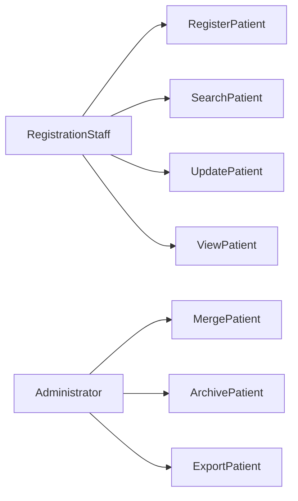

---

# 10. User Roles & Permissions

## 10.1 Access Matrix

| Feature | Admin | Registration | Doctor | Nurse | Cashier |
|----------|:----:|:------------:|:------:|:------:|:--------:|
| View Patient | ✔ | ✔ | ✔ | ✔ | ✔ |
| Create Patient | ✔ | ✔ | ✖ | ✖ | ✖ |
| Update Patient | ✔ | ✔ | ✖ | ✖ | ✖ |
| Upload Photo | ✔ | ✔ | ✖ | ✖ | ✖ |
| Merge Patient | ✔ | ✖ | ✖ | ✖ | ✖ |
| Archive Patient | ✔ | ✖ | ✖ | ✖ | ✖ |
| Export Patient | ✔ | ✔ | ✖ | ✖ | ✖ |

---

## 10.2 Permission Codes

| Permission | Description |
|------------|-------------|
| patient.read | Melihat data pasien |
| patient.create | Registrasi pasien |
| patient.update | Mengubah data pasien |
| patient.delete | Soft delete pasien |
| patient.merge | Merge pasien |
| patient.export | Export data pasien |
| patient.photo.upload | Upload foto pasien |
| patient.history.read | Melihat riwayat pasien |

Catatan: pencatatan sumber rujukan (UC-PAT-013) dan Quick Add Patient (UC-PAT-014) menggunakan permission yang sudah ada (`patient.update` dan `patient.create`) — tidak ada permission baru yang dibuat khusus, karena kedua fitur ini adalah bagian dari alur registrasi/pembaruan pasien yang sudah dikontrol permission tersebut, bukan kapabilitas administratif terpisah.

---

## 10.3 Authorization Rules

- Seluruh endpoint memerlukan autentikasi JWT.
- Hak akses menggunakan Role Based Access Control (RBAC).
- Permission diperiksa sebelum Use Case dijalankan.
- Semua aktivitas dicatat pada Audit Trail.

---

# 11. Workflow Diagram

## 11.1 New Patient Registration

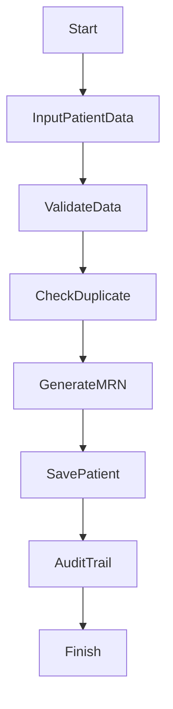

---

## 11.2 Existing Patient

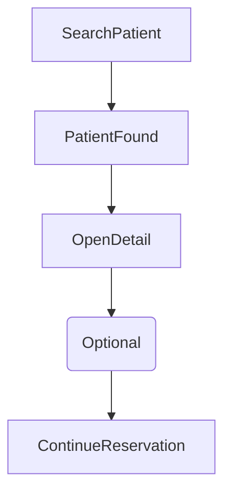

---

## 11.3 Merge Duplicate Patient

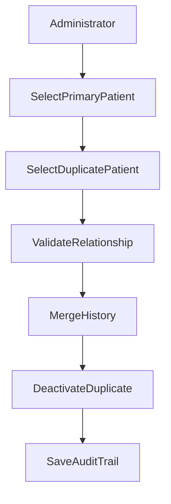

---

# 12. UI Pages

## 12.1 Patient Module Pages

| Page | Purpose |
|------|---------|
| Patient List | Menampilkan seluruh pasien |
| Register Patient | Registrasi pasien baru |
| Patient Detail | Informasi lengkap pasien |
| Edit Patient | Mengubah data pasien |
| Visit History | Riwayat kunjungan |
| Reservation History | Riwayat reservasi |
| Treatment History | Riwayat tindakan |
| Payment History | Riwayat pembayaran |
| Merge Patient | Penggabungan pasien |
| Patient Archive | Data pasien yang diarsipkan |

---

## 12.2 Patient Detail Tabs

```text
Patient Detail

├── Profile
├── Identity
├── Address
├── Emergency Contact
├── Reservation History
├── Visit History
├── Treatment History
├── Payment History
├── Attachments
└── Audit Trail
```

---

## 12.3 Patient List Actions

| Action | Description |
|---------|-------------|
| View | Melihat detail pasien |
| Edit | Mengubah data pasien |
| Register Reservation | Membuat reservasi |
| View History | Melihat riwayat pasien |
| Upload Photo | Mengunggah foto pasien |
| Export | Export data |
| Archive | Arsipkan pasien |

---

# 13. Navigation Structure

## Sidebar Navigation

```text
Patient Management
│
├── Patient List
├── Register Patient
├── Archived Patient
└── Reports (Future)
```

---

## Navigation Flow

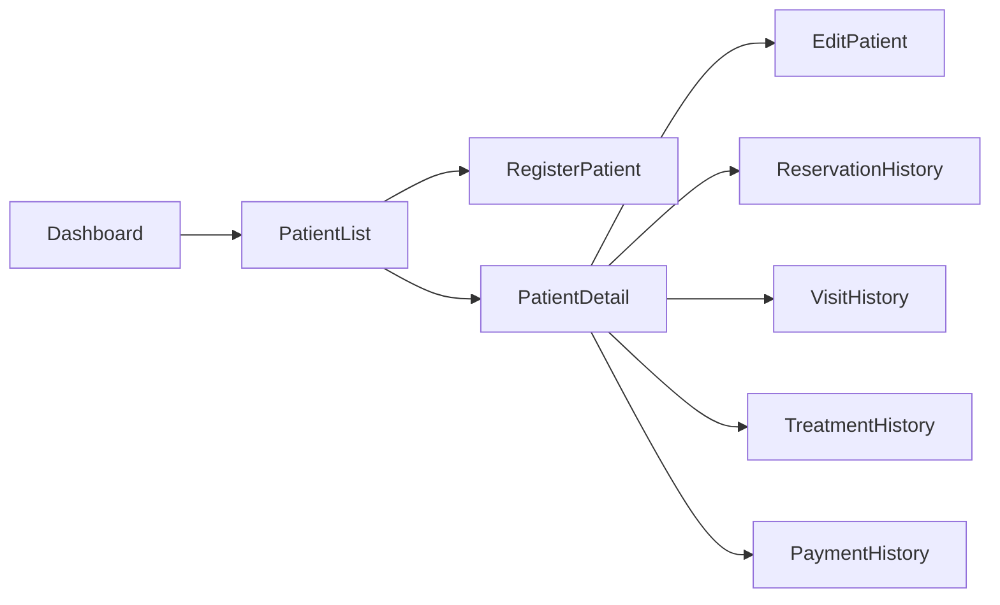

---

# Summary Part 2

Part 2 mendefinisikan kebutuhan fungsional Modul Patient, meliputi daftar fitur, use case, hak akses pengguna, workflow bisnis, rancangan halaman antarmuka, dan struktur navigasi. Dokumen ini menjadi acuan implementasi Frontend dan Backend agar seluruh proses pengelolaan pasien berjalan konsisten sesuai prinsip **Clean Architecture**, **Domain Driven Design (DDD)**, **RBAC**, dan **Modular Monolith**.

# Parakita Software Design Document (SDD)

# 12 - Module Patient (Part 3)

| Document Information | |
|----------------------|----------------------------------------------|
| Project | Parakita - Dental Clinic Management System |
| Document | 12 - Module Patient |
| Part | 3 of 5 |
| Version | 1.0.0 |
| Status | Draft |
| Document Type | Module Design Document |
| Architecture | Clean Architecture + Modular Monolith |
| Last Updated | July 2026 |

---

# Table of Contents (Part 3)

14. Domain Model
15. Entity Relationship
16. Data Validation Rules
17. Application Services / Use Cases
18. Repository Interfaces
19. Domain Events

---

# 14. Domain Model

## 14.1 Overview

Patient merupakan **Aggregate Root** pada bounded context **Patient**.

Seluruh perubahan data pasien harus dilakukan melalui Aggregate ini agar seluruh business rule tetap konsisten.

---

## 14.2 Aggregate Structure

```text
Patient (Aggregate Root)
│
├── PatientIdentity
├── PatientAddress
├── EmergencyContact
├── PatientPhoto
├── InsuranceInformation (Future)
└── PatientPreferences (Future)
```

---

## 14.3 Core Entity

### Patient

Merupakan entity utama yang menyimpan identitas pasien.

| Property | Type | Description |
|-----------|------|-------------|
| id | UUID | Primary Key |
| medicalRecordNumber | String | Nomor Rekam Medis (MRN) |
| fullName | String | Nama lengkap pasien |
| gender | Enum | Jenis kelamin |
| dateOfBirth | Date | Tanggal lahir |
| placeOfBirth | String | Tempat lahir |
| bloodType | Enum | Golongan darah |
| maritalStatus | Enum | Status pernikahan |
| religionId | UUID | Referensi master agama |
| occupationId | UUID | Referensi master pekerjaan |
| identityType | Enum | Jenis identitas |
| identityNumber | String | Nomor identitas |
| phoneNumber | String | Nomor telepon utama |
| email | String | Email |
| status | Enum | Status pasien |
| photoUrl | String | Lokasi foto profil pasien |
| insuranceNumber | String | Nomor asuransi (opsional, tidak divalidasi format/keunikan) |
| instagramHandle | String | Username Instagram (opsional) |
| facebookHandle | String | Username/URL Facebook (opsional) |
| tiktokHandle | String | Username TikTok (opsional) |
| whatsappNumber | String | Nomor WhatsApp (opsional, dapat berbeda dari phoneNumber utama) |
| referralSourceId | UUID | Referensi ke katalog sumber rujukan (Master Data), nullable |
| referredByUserId | UUID | Referensi ke `User` (staf) yang memberi rujukan, nullable — hanya diisi ketika `referralSourceId` menunjuk ke jenis sumber "Staf Klinik" |
| createdAt | Timestamp | Waktu dibuat |
| updatedAt | Timestamp | Waktu diubah |

---

## 14.4 Value Objects

Patient menggunakan beberapa Value Object untuk menjaga konsistensi data.

```text
PatientIdentity
PatientAddress
EmergencyContact
PhoneNumber
EmailAddress
MedicalRecordNumber
```

---

## 14.5 Referral Source (disambiguation)

`referralSourceId`/`referredByUserId` pada Patient mencatat **dari mana pasien mengetahui klinik** (marketing/lead source) pada saat registrasi — jenisnya dikelola sebagai katalog Master Data (lihat `docs/03-sad/11-module-master-data.md`), bukan entity milik Modul Patient sendiri, mengikuti pola referensi yang sama seperti `religionId`/`occupationId`.

Ini **bukan** entity `Referral` yang sudah ada pada Modul EMR (rujukan klinis pasien ke spesialis/rumah sakit/laboratorium, dibuat dari sebuah Visit). Kedua konsep memakai kata "referral" dalam bahasa Inggris sehari-hari tetapi merepresentasikan hal yang sepenuhnya berbeda; implementasi tidak boleh menyatukan atau menamai ulang salah satu agar bertabrakan dengan yang lain.

---

# 15. Entity Relationship

## 15.1 Entity Diagram

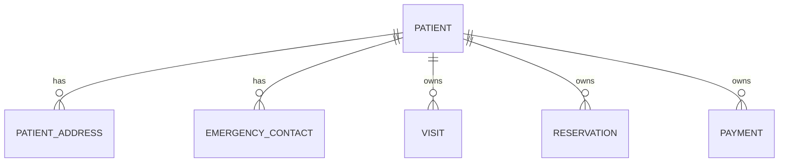

---

## 15.2 Relationships

| Entity | Relationship | Description |
|----------|-------------|-------------|
| Patient Address | One To Many | Pasien memiliki banyak alamat |
| Emergency Contact | One To Many | Banyak kontak darurat |
| Referral Source (Master Data) | Many To One | Setiap pasien mengacu ke maksimal satu entri katalog sumber rujukan; katalog dimiliki oleh Master Data, bukan Patient |
| Reservation | One To Many | Banyak reservasi |
| Visit | One To Many | Banyak kunjungan |
| Invoice | One To Many | Banyak invoice |
| Payment | One To Many | Banyak pembayaran |

---

## 15.3 Aggregate Boundary

```text
Patient Aggregate
│
├── Patient
├── Patient Address
├── Emergency Contact
└── Patient Photo
```

Reservation, Visit, Billing dan EMR berada pada bounded context masing-masing dan hanya mereferensikan `patientId`.

---

# 16. Data Validation Rules

## 16.1 Required Fields

| Field | Required |
|--------|----------|
| Full Name | ✔ |
| Gender | ✔ |
| Date of Birth | ✔ |
| Phone Number | ✔ |
| Identity Type | Optional |
| Identity Number | Optional |
| Address | ✔ |

---

## 16.2 Business Validation

- MRN harus unik.
- Nomor identitas tidak boleh digunakan oleh pasien lain.
- Nomor telepon tidak boleh kosong.
- Email harus valid apabila diisi.
- Tanggal lahir tidak boleh lebih besar dari tanggal hari ini.
- Pasien minimal memiliki satu alamat aktif.
- Status Archived tidak dapat digunakan untuk reservasi baru.

---

## 16.3 Duplicate Detection Rules

Sistem melakukan pemeriksaan kemungkinan data ganda berdasarkan:

- Nama lengkap
- Tanggal lahir
- Nomor identitas
- Nomor telepon

Jika ditemukan tingkat kemiripan tinggi, sistem memberikan peringatan sebelum registrasi disimpan.

---

## 16.4 Merge Validation

Merge pasien hanya dapat dilakukan apabila:

- Dilakukan oleh Administrator.
- Kedua data mengacu pada orang yang sama.
- Riwayat transaksi dapat dipindahkan.
- Seluruh proses tercatat pada Audit Trail.

---

# 17. Application Services / Use Cases

## 17.1 Use Case List

```text
CreatePatientUseCase
UpdatePatientUseCase
GetPatientUseCase
SearchPatientUseCase
UploadPatientPhotoUseCase
MergePatientUseCase
ArchivePatientUseCase
RestorePatientUseCase
GetPatientHistoryUseCase
ExportPatientUseCase
QuickAddPatientUseCase
```

`QuickAddPatientUseCase` is a distinct, reduced-field use case (`fullName`, `address` free text, `phoneNumber`, `identityNumber` only) — not a variant of `CreatePatientUseCase`'s full validation path. It exists for the Reservation booking screen, where a walk-in/unregistered patient needs to be created in-flow without leaving the booking form. A patient created this way still receives a real MRN and a `status` of `Registered`, and can later be completed via the normal `UpdatePatientUseCase` once the rest of their profile (address detail, emergency contact, referral source, etc.) is known. Referral source and the new profile fields (insurance number, social media handles) are captured through the existing `CreatePatientUseCase`/`UpdatePatientUseCase` as additional optional fields — no separate use case is needed for those.

---

## 17.2 Responsibilities

| Use Case | Responsibility |
|----------|----------------|
| CreatePatient | Registrasi pasien baru |
| UpdatePatient | Mengubah data pasien |
| SearchPatient | Pencarian pasien |
| GetPatient | Detail pasien |
| MergePatient | Penggabungan data pasien |
| ArchivePatient | Mengarsipkan pasien |
| RestorePatient | Mengaktifkan kembali pasien |
| ExportPatient | Export daftar pasien |

---

## 17.3 Use Case Flow

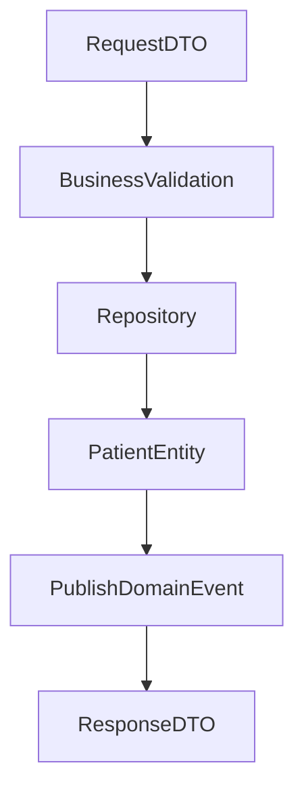

---

# 18. Repository Interfaces

## 18.1 Overview

Repository merupakan kontrak antara Domain Layer dan Infrastructure Layer sesuai prinsip Clean Architecture.

---

## 18.2 Interface

```text
IPatientRepository
```

---

## 18.3 Standard Methods

| Method | Description |
|----------|-------------|
| findById() | Cari berdasarkan ID |
| findByMRN() | Cari berdasarkan MRN |
| findByIdentityNumber() | Cari berdasarkan identitas |
| search() | Pencarian pasien |
| create() | Simpan pasien baru |
| update() | Ubah data pasien |
| archive() | Arsipkan pasien |
| restore() | Aktifkan kembali pasien |
| merge() | Merge pasien |
| exists() | Cek keberadaan pasien |

---

## 18.4 Repository Flow

```mermaid
flowchart LR

Controller

-->

UseCase

-->

IPatientRepository

-->

PatientRepository

-->

Prisma ORM

-->

MySQL
```

---

# 19. Domain Events

## 19.1 Overview

Modul Patient menerbitkan Domain Event yang dapat digunakan oleh modul lain tanpa menciptakan dependency langsung.

---

## 19.2 Event Catalog

| Event | Trigger | Subscriber |
|--------|----------|------------|
| PatientRegistered | Registrasi selesai | Reservation, Reporting |
| PatientUpdated | Data berubah | Reporting |
| PatientMerged | Merge selesai | Reservation, EMR, Billing |
| PatientArchived | Arsip pasien | Reporting |
| PatientRestored | Restore pasien | Reporting |

---

## 19.3 Event Flow

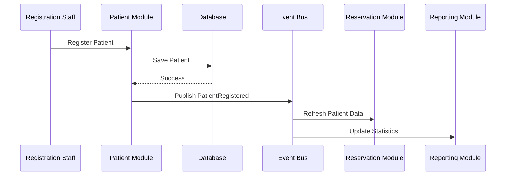

---

## 19.4 Event Payload Example

```json
{
  "event": "PatientRegistered",
  "patientId": "uuid",
  "medicalRecordNumber": "MRN000001",
  "fullName": "John Doe",
  "registeredAt": "2026-07-31T09:00:00Z"
}
```

---

# Summary Part 3

Part 3 mendefinisikan model domain Modul Patient, termasuk Aggregate Root, entity, value object, relasi antar entitas, aturan validasi data, daftar Application Use Case, kontrak Repository, serta Domain Event yang digunakan untuk integrasi dengan modul Reservation, EMR, Billing, dan Reporting. Desain ini mengikuti prinsip **Clean Architecture**, **Domain Driven Design (DDD)**, dan **Modular Monolith** sehingga business logic tetap terisolasi, mudah diuji, dan siap dikembangkan.

# Parakita Software Design Document (SDD)

# 12 - Module Patient (Part 4)

| Document Information | |
|----------------------|----------------------------------------------|
| Project | Parakita - Dental Clinic Management System |
| Document | 12 - Module Patient |
| Part | 4 of 5 |
| Version | 1.0.0 |
| Status | Draft |
| Document Type | Module Design Document |
| Architecture | Clean Architecture + Modular Monolith |
| Last Updated | July 2026 |

---

# Table of Contents (Part 4)

20. API Specification
21. Request & Response DTO
22. Integration with Other Modules
23. Audit Trail
24. Error Handling
25. Sequence Diagram

---

# 20. API Specification

## 20.1 Overview

Seluruh endpoint pada Modul Patient mengikuti standar REST API yang telah didefinisikan pada dokumen **09-api-standard.md**.

Base URL

```text
/api/v1/patients
```

Semua endpoint:

- menggunakan JWT Authentication
- menggunakan RBAC Authorization
- menggunakan JSON Request/Response
- mendukung Audit Trail

---

## 20.2 Endpoint List

| Method | Endpoint | Description |
|----------|-------------------------|-----------------------------|
| GET | /patients | Daftar pasien |
| GET | /patients/{id} | Detail pasien |
| POST | /patients | Registrasi pasien |
| POST | /patients/quick-add | Registrasi cepat pasien (nama, alamat bebas, telepon, nomor identitas) — dipanggil dari layar Reservasi |
| PUT | /patients/{id} | Update pasien |
| PATCH | /patients/{id}/archive | Arsip pasien |
| PATCH | /patients/{id}/restore | Restore pasien |
| POST | /patients/merge | Merge pasien |
| POST | /patients/photo | Upload foto |
| GET | /patients/{id}/history | Riwayat pasien |
| GET | /patients/export | Export pasien |

---

## 20.3 Query Parameters

### GET /patients

| Parameter | Type | Description |
|------------|------|-------------|
| page | Number | Nomor halaman |
| limit | Number | Jumlah data |
| keyword | String | Kata pencarian |
| status | String | Status pasien |
| gender | String | Jenis kelamin |
| orderBy | String | Field sorting |
| order | String | ASC / DESC |

---

## 20.4 Standard Response

### Success Response

```json
{
  "success": true,
  "message": "Success",
  "data": {}
}
```

---

### Validation Error

```json
{
  "success": false,
  "message": "Validation Error",
  "errors": [
    {
      "field": "fullName",
      "message": "Full Name is required"
    }
  ]
}
```

---

# 21. Request & Response DTO

## 21.1 CreatePatientRequest

```json
{
  "fullName": "John Doe",
  "gender": "MALE",
  "dateOfBirth": "1998-08-10",
  "placeOfBirth": "Jakarta",
  "phoneNumber": "08123456789",
  "email": "john@example.com",
  "identityType": "NIK",
  "identityNumber": "317xxxxxxxxxxxxx",
  "insuranceNumber": "BPJS-000123456",
  "instagramHandle": "@johndoe",
  "facebookHandle": null,
  "tiktokHandle": null,
  "whatsappNumber": "08123456789",
  "referralSourceId": "uuid",
  "referredByUserId": null,
  "address": {
    "provinceId": "uuid",
    "regencyId": "uuid",
    "districtId": "uuid",
    "villageId": "uuid",
    "postalCode": "40111",
    "addressLine": "Jl. Contoh No. 10"
  }
}
```

`insuranceNumber`, the four social handles, `referralSourceId`, and `referredByUserId` are all optional. `referredByUserId` is only meaningful when `referralSourceId` points at the "Staf Klinik" catalog entry (see §14.5) — the client should hide/disable it otherwise, and the server does not require it even then.

---

## 21.1a QuickAddPatientRequest

```json
{
  "fullName": "John Doe",
  "address": "Jl. Contoh No. 10, Bandung",
  "phoneNumber": "08123456789",
  "identityNumber": "317xxxxxxxxxxxxx"
}
```

Deliberately flat and minimal — `address` here is a plain string, not the structured `provinceId/regencyId/districtId/villageId` object used by `CreatePatientRequest`. The resulting patient can be completed later via `UpdatePatientRequest`.

---

## 21.2 UpdatePatientRequest

```json
{
  "fullName": "John Doe",
  "phoneNumber": "081298765432",
  "email": "john.doe@example.com",
  "insuranceNumber": "BPJS-000123456",
  "whatsappNumber": "08123456789",
  "address": {
    "provinceId": "uuid",
    "regencyId": "uuid",
    "districtId": "uuid",
    "villageId": "uuid",
    "postalCode": "40111",
    "addressLine": "Jl. Contoh Baru No. 25"
  }
}
```

---

## 21.3 PatientResponse

```json
{
  "id": "uuid",
  "medicalRecordNumber": "MRN000001",
  "fullName": "John Doe",
  "gender": "MALE",
  "dateOfBirth": "1998-08-10",
  "phoneNumber": "08123456789",
  "status": "ACTIVE"
}
```

---

## 21.4 PatientDetailResponse

```json
{
  "id": "uuid",
  "medicalRecordNumber": "MRN000001",
  "identity": {},
  "profile": {},
  "addresses": [],
  "emergencyContacts": [],
  "visitHistory": [],
  "reservationHistory": [],
  "paymentHistory": []
}
```

---

## 21.5 DTO Naming Convention

```text
CreatePatientRequest

UpdatePatientRequest

PatientResponse

PatientSummaryResponse

PatientDetailResponse

PatientHistoryResponse
```

---

# 22. Integration with Other Modules

## 22.1 Dependency Overview

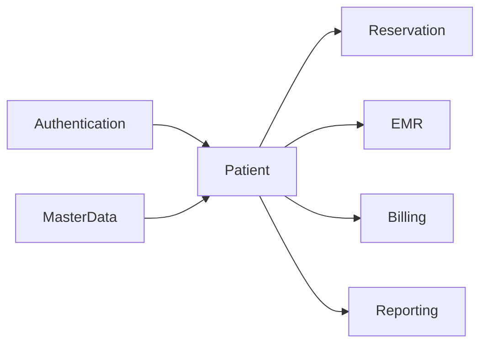

---

## 22.2 Module Integration Matrix

| Module | Purpose |
|----------|----------------------------|
| Authentication | Authentication & Authorization |
| Master Data | Referensi Agama, Pekerjaan, Wilayah (Provinsi/Kabupaten-Kota/Kecamatan/Kelurahan), Sumber Rujukan (Referral Source) |
| Reservation | Registrasi reservasi |
| Queue | Informasi pasien pada antrian |
| EMR | Rekam medis pasien |
| Billing | Identitas pasien pada invoice |
| Reporting | Statistik pasien |

---

## 22.3 Integration Rules

- Modul lain hanya mengakses Patient melalui Application Service atau Repository Interface yang dipublikasikan.
- Tidak diperbolehkan melakukan query langsung ke tabel modul Patient.
- Seluruh komunikasi lintas modul menggunakan kontrak yang stabil atau Domain Event.

---

## 22.4 Published Events

| Event | Published To |
|---------|--------------|
| PatientRegistered | Reservation, Reporting |
| PatientUpdated | Reporting |
| PatientMerged | Reservation, EMR, Billing |
| PatientArchived | Reporting |
| PatientRestored | Reporting |

---

# 23. Audit Trail

## 23.1 Overview

Seluruh aktivitas penting pada Modul Patient wajib dicatat untuk memenuhi kebutuhan audit dan pelacakan perubahan data.

---

## 23.2 Audited Activities

- Create Patient
- Update Patient
- Archive Patient
- Restore Patient
- Merge Patient
- Upload Photo
- Update Address
- Update Emergency Contact

---

## 23.3 Audit Data

| Field | Description |
|---------|-------------|
| Timestamp | Waktu aktivitas |
| User ID | Pengguna |
| Module | Patient |
| Action | Jenis aktivitas |
| Entity | Patient |
| Entity ID | Patient ID |
| Old Value | Nilai sebelumnya |
| New Value | Nilai terbaru |
| IP Address | IP pengguna |
| User Agent | Browser / Device |

---

## 23.4 Audit Flow

```mermaid
flowchart LR

User

-->

Patient Module

-->

Audit Logger

-->

Audit Database
```

---

# 24. Error Handling

## 24.1 Validation Errors

| HTTP Code | Description |
|------------|-------------|
| 400 | Invalid Request |
| 401 | Unauthorized |
| 403 | Forbidden |
| 404 | Patient Not Found |
| 409 | Duplicate Patient |
| 422 | Business Validation Failed |
| 500 | Internal Server Error |

---

## 24.2 Business Errors

| Code | Message |
|------|-------------------------------|
| PATIENT_NOT_FOUND | Patient not found |
| DUPLICATE_PATIENT | Possible duplicate patient |
| INVALID_DATE_OF_BIRTH | Invalid date of birth |
| DUPLICATE_IDENTITY | Identity number already exists |
| PATIENT_ARCHIVED | Patient has been archived |
| MERGE_NOT_ALLOWED | Patient merge is not allowed |

---

## 24.3 Standard Error Response

```json
{
  "success": false,
  "message": "Duplicate Patient",
  "code": "DUPLICATE_PATIENT",
  "errors": []
}
```

---

# 25. Sequence Diagram

## 25.1 Register Patient

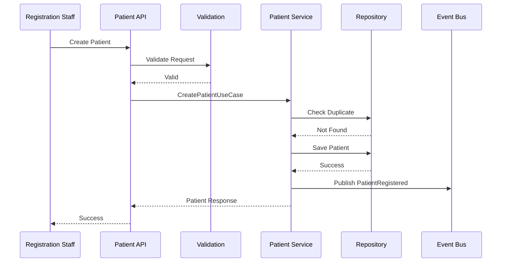

---

## 25.2 Update Patient

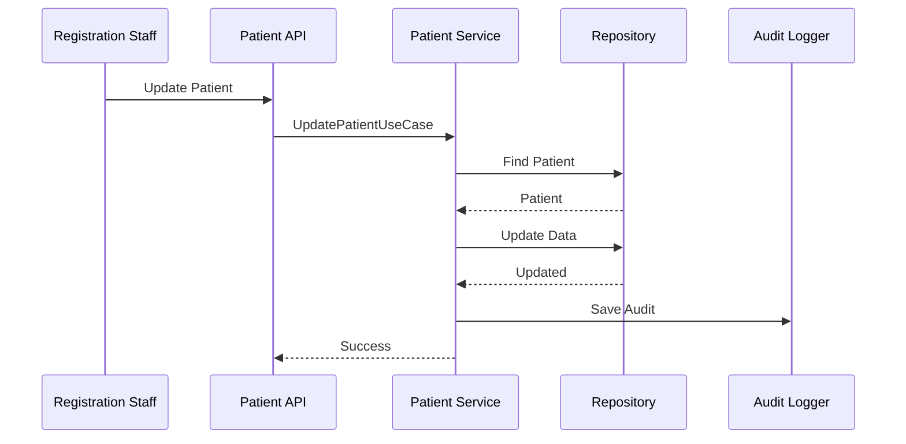

---

## 25.3 Merge Patient

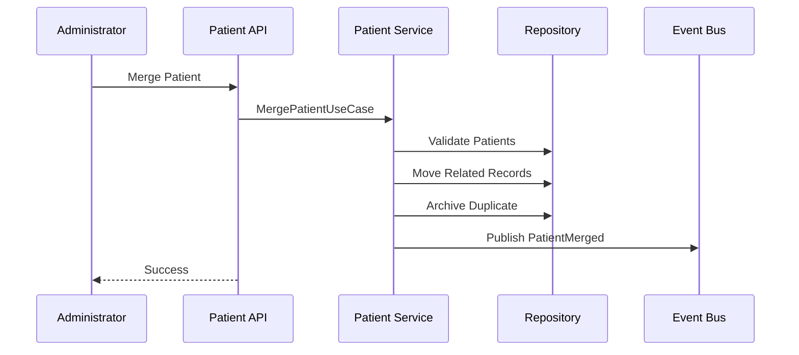

---

# Summary Part 4

Part 4 mendefinisikan spesifikasi REST API, struktur Request dan Response DTO, integrasi Modul Patient dengan modul lain, mekanisme Audit Trail, standar Error Handling, serta Sequence Diagram untuk proses utama seperti registrasi, pembaruan, dan penggabungan data pasien. Dokumen ini menjadi acuan implementasi Backend API agar konsisten dengan standar **API First**, **Clean Architecture**, **RBAC**, dan **Modular Monolith** yang digunakan pada Parakita.

# Parakita Software Design Document (SDD)

# 12 - Module Patient (Part 5)

| Document Information | |
|----------------------|----------------------------------------------|
| Project | Parakita - Dental Clinic Management System |
| Document | 12 - Module Patient |
| Part | 5 of 5 |
| Version | 1.0.0 |
| Status | Draft |
| Document Type | Module Design Document |
| Architecture | Clean Architecture + Modular Monolith |
| Last Updated | July 2026 |

---

# Table of Contents (Part 5)

26. Database Tables
27. Index Strategy
28. Performance Consideration
29. Security
30. Future Enhancements
31. Summary

---

# 26. Database Tables

## 26.1 Overview

Modul Patient memiliki beberapa tabel utama yang digunakan untuk menyimpan informasi pasien beserta data pendukungnya.

---

## 26.2 Table List

| Table | Purpose |
|---------|-------------------------------|
| patients | Data utama pasien |
| patient_addresses | Alamat pasien |
| patient_emergency_contacts | Kontak darurat pasien |
| patient_photos | Foto pasien |
| patient_merge_logs | Riwayat merge pasien |
| patient_audit_logs | Audit perubahan data pasien |

Katalog sumber rujukan (referral source types) dan tabel wilayah (provinces/regencies/districts/villages) **dimiliki oleh Master Data**, bukan Patient — lihat `docs/03-sad/11-module-master-data.md`. Tabel `patients` hanya menyimpan FK ke katalog tersebut (`referral_source_id`, `province_id`, dst.), sesuai aturan modul-boundary bahwa Patient tidak boleh memiliki tabel referensi lintas-modul-nya sendiri.

---

## 26.3 Table Relationship

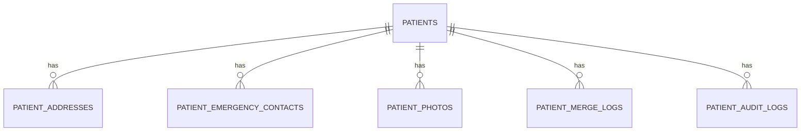

---

## 26.4 Patients Table

| Column | Type | Description |
|----------|------|-------------|
| id | UUID | Primary Key |
| medical_record_number | VARCHAR(30) | Unique MRN |
| full_name | VARCHAR(200) | Nama pasien |
| gender | ENUM | Jenis kelamin |
| date_of_birth | DATE | Tanggal lahir |
| identity_type | ENUM | Jenis identitas |
| identity_number | VARCHAR(50) | Nomor identitas |
| phone_number | VARCHAR(30) | Nomor telepon utama |
| email | VARCHAR(150) | Email |
| status | ENUM | Status pasien |
| photo_url | VARCHAR(255) | Lokasi foto profil pasien (nullable) |
| insurance_number | VARCHAR(50) | Nomor asuransi, opsional, tidak unik |
| instagram_handle | VARCHAR(100) | Username Instagram, opsional |
| facebook_handle | VARCHAR(100) | Username/URL Facebook, opsional |
| tiktok_handle | VARCHAR(100) | Username TikTok, opsional |
| whatsapp_number | VARCHAR(30) | Nomor WhatsApp, opsional |
| referral_source_id | UUID | FK ke katalog Master Data (nullable) |
| referred_by_user_id | UUID | FK ke `users` (nullable, hanya untuk sumber "Staf Klinik") |
| created_at | DATETIME | Dibuat pada |
| updated_at | DATETIME | Diubah pada |

---

## 26.5 Patient Addresses Table

| Column | Type |
|---------|------|
| id | UUID |
| patient_id | UUID |
| province_id | UUID — FK ke Master Data `provinces` |
| regency_id | UUID — FK ke Master Data `regencies` (Kabupaten/Kota) |
| district_id | UUID — FK ke Master Data `districts` (Kecamatan) |
| village_id | UUID — FK ke Master Data `villages` (Kelurahan/Desa) |
| postal_code | VARCHAR(10) |
| address_line | TEXT |
| is_primary | BOOLEAN — tepat satu baris `true` per pasien, ditegakkan di application layer |

Definisi ini adalah definisi tunggal dan otoritatif untuk `patient_addresses` — lihat `docs/03-sad/07-data-dictionary.md` §12.4, yang sebelumnya mendefinisikan tabel yang sama dengan kolom teks bebas (`city`/`province` VARCHAR) dan sekarang diselaraskan mengikuti definisi FK-based ini.

---

## 26.6 Emergency Contact Table

| Column | Type |
|----------|------|
| id | UUID |
| patient_id | UUID |
| full_name | VARCHAR(200) |
| relationship | VARCHAR(100) |
| phone_number | VARCHAR(30) |
| address | TEXT |

---

# 27. Index Strategy

## 27.1 Primary Index

| Table | Index |
|---------|-------|
| patients | PK(id) |
| patient_addresses | PK(id) |
| patient_emergency_contacts | PK(id) |

---

## 27.2 Unique Index

| Table | Index |
|----------|----------------------------|
| patients | medical_record_number |
| patients | identity_number (nullable unique) |

---

## 27.3 Search Index

| Column | Purpose |
|----------|---------------------------|
| full_name | Patient Search |
| phone_number | Quick Search |
| medical_record_number | Fast Lookup |
| identity_number | Identity Lookup |
| created_at | Reporting |

---

## 27.4 Composite Index

| Columns | Purpose |
|----------|--------------------------|
| status + full_name | Patient List |
| status + created_at | Reporting |
| gender + date_of_birth | Analytics |

---

# 28. Performance Consideration

## 28.1 Pagination

Daftar pasien menggunakan server-side pagination.

Default:

```text
Page Size : 20

Maximum : 100
```

---

## 28.2 Lazy Loading

Riwayat berikut tidak dimuat secara otomatis ketika membuka detail pasien.

- Reservation History
- Visit History
- Treatment History
- Payment History
- Audit Trail

Data diambil secara terpisah saat tab terkait dibuka.

---

## 28.3 Search Optimization

Strategi optimasi pencarian:

- Indexed Search
- Partial Match untuk nama pasien
- Exact Match untuk MRN
- Exact Match untuk nomor identitas
- Query Pagination
- Database Index Optimization

---

## 28.4 Caching Strategy

Data berikut dapat menggunakan cache.

| Data | Cache Duration |
|---------|---------------|
| Patient Detail | 5 Minutes |
| Patient Summary | 5 Minutes |
| Patient Statistics | 15 Minutes |

Cache harus dihapus ketika terjadi perubahan data pasien.

---

# 29. Security

## 29.1 Authentication

Seluruh endpoint menggunakan:

- JWT Authentication
- Access Token
- Refresh Token

---

## 29.2 Authorization

Permission menggunakan RBAC.

Contoh:

```text
patient.read

patient.create

patient.update

patient.delete

patient.merge

patient.export
```

---

## 29.3 Data Protection

Data sensitif harus mendapatkan perlindungan tambahan.

Contoh:

- Nomor Identitas
- Email
- Nomor Telepon
- Alamat
- Nomor Asuransi
- Akun Media Sosial (Instagram/Facebook/TikTok/WhatsApp)

Strategi:

- Masking pada UI tertentu
- HTTPS Only
- Audit Trail
- Access Control
- Encryption at Rest (apabila diperlukan)

---

## 29.4 File Upload Security

Foto pasien harus memenuhi ketentuan berikut.

- Format JPG, JPEG, PNG, atau WEBP
- Maksimum 5 MB
- Validasi MIME Type
- Rename file secara otomatis menggunakan UUID
- Simpan pada Object Storage
- Tidak mengizinkan eksekusi file

---

## 29.5 Audit Compliance

Seluruh aktivitas berikut wajib diaudit.

- Registrasi pasien
- Update data pasien
- Merge pasien
- Archive pasien
- Restore pasien
- Upload foto
- Perubahan alamat
- Perubahan kontak darurat

---

# 30. Future Enhancements

Fitur berikut direncanakan untuk versi berikutnya.

| Feature | Description |
|----------|-----------------------------|
| Family Relationship | Hubungan antar anggota keluarga |
| Patient Portal | Portal pasien |
| Digital Consent | Persetujuan digital |
| Insurance Integration | Integrasi API BPJS/Asuransi (verifikasi eligibilitas, klaim) — berbeda dari `insuranceNumber` (§14.3), yang hanya kolom teks bebas tanpa validasi/integrasi apa pun |
| National Health Integration | Integrasi SATUSEHAT / platform nasional |
| Biometric Identification | Sidik jari / Face Recognition |
| QR Code Patient Card | Kartu pasien digital |
| Multi-language Profile | Dukungan multi bahasa |
| AI Duplicate Detection | Deteksi pasien ganda menggunakan AI |
| Patient Risk Flag | Penanda alergi, penyakit kronis, atau kondisi khusus |

---

# 31. Summary

Modul **Patient** merupakan salah satu **Core Domain** pada sistem Parakita yang bertanggung jawab sebagai **Single Source of Truth** untuk seluruh identitas pasien.

Dokumen ini mendefinisikan:

- Tujuan dan ruang lingkup modul
- Business Process
- Business Rules
- Functional Requirements
- Use Case
- Domain Model
- Repository Contract
- Domain Event
- REST API
- DTO
- Database Design
- Security
- Performance Strategy
- Integrasi lintas modul

Dengan mengikuti standar **Clean Architecture**, **Domain Driven Design (DDD)**, dan **Modular Monolith**, implementasi Modul Patient akan memiliki karakteristik:

- Business Logic terisolasi dari framework
- Mudah diuji (Testable)
- Mudah dipelihara (Maintainable)
- Mudah dikembangkan (Extensible)
- Konsisten dengan seluruh modul Parakita
- Siap berkembang menuju arsitektur Microservices apabila dibutuhkan di masa mendatang.

---

# End of Document

**Document Completed**

**12 - Module Patient**

Version **1.0.0**