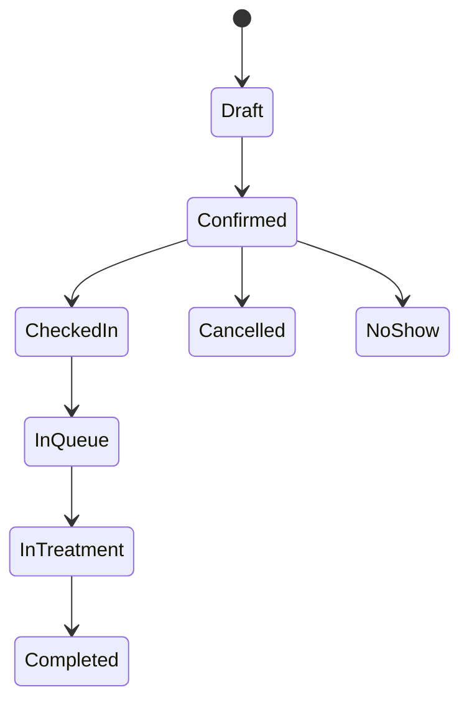
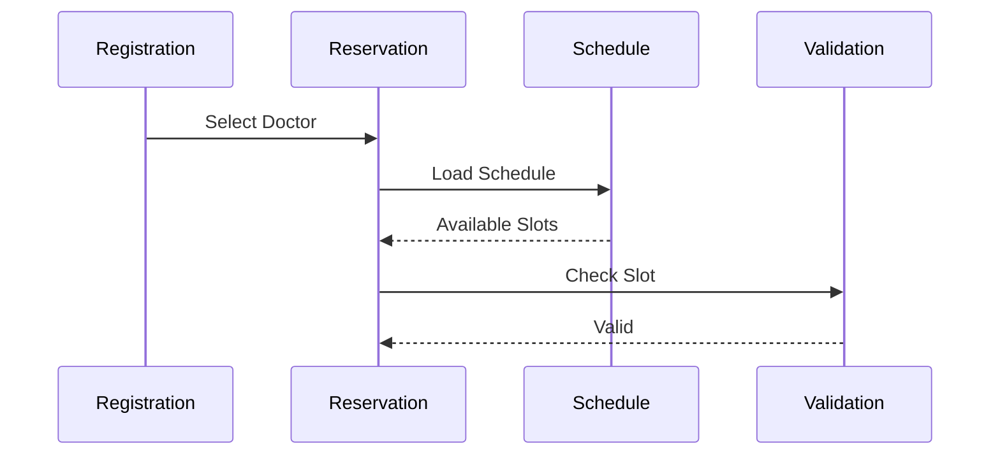
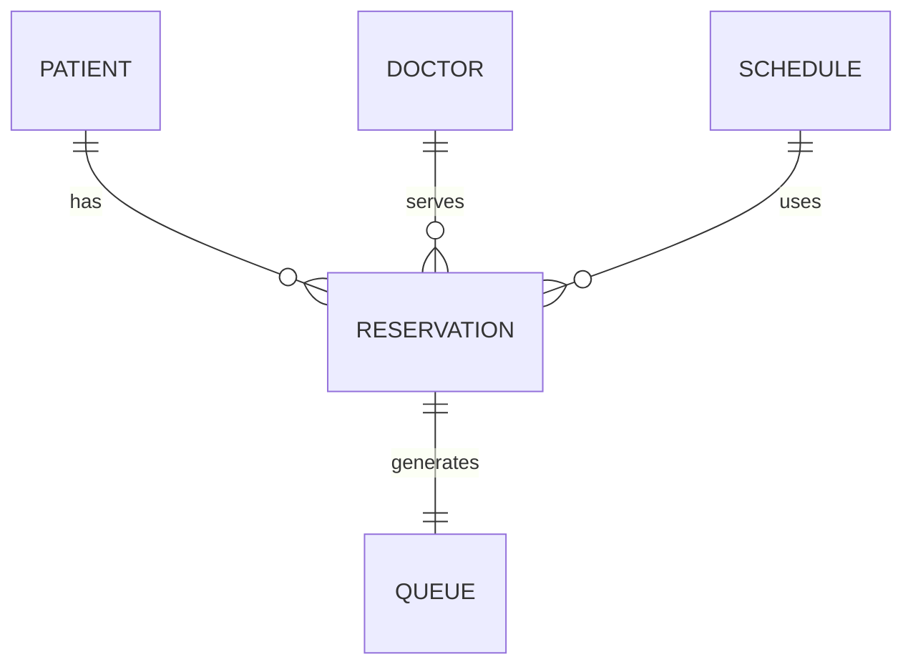
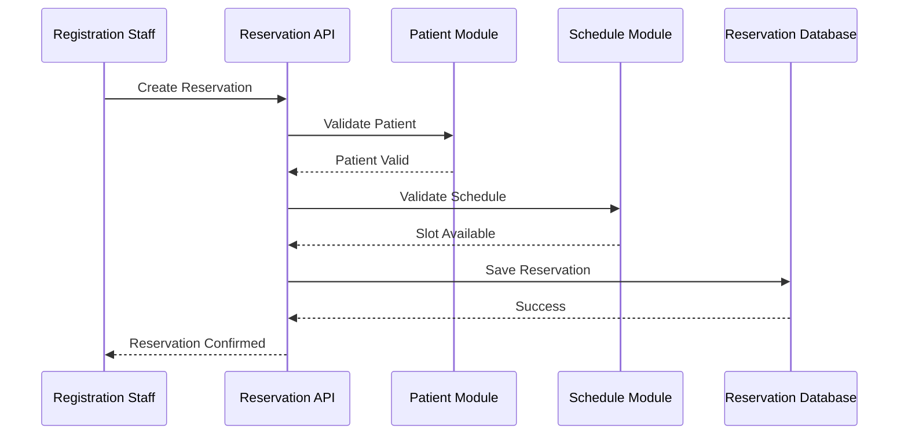
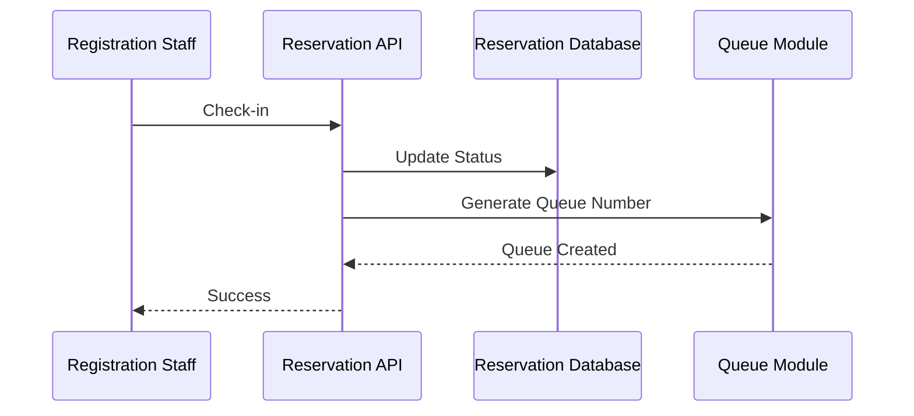
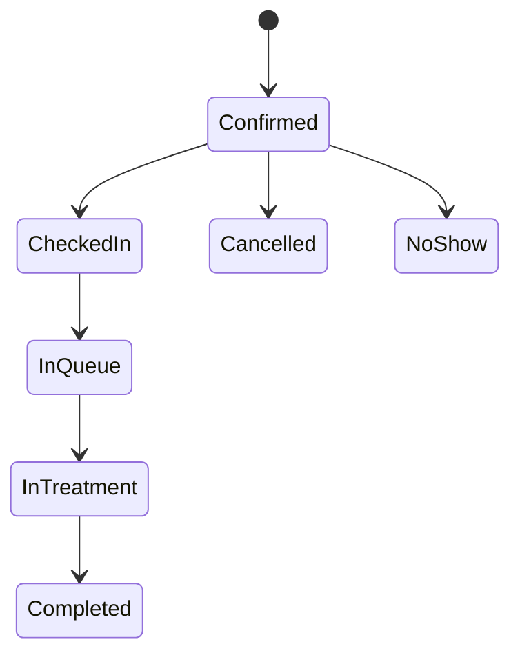

# Parakita Software Architecture Document (SAD)

# 13 - Module Reservation

| Document Information | |
|----------------------|----------------------------------------------|
| Project | Parakita - Dental Clinic Management System |
| Document | 13 - Module Reservation |
| Part | 1 of 5 |
| Version | 1.0.0 |
| Status | Draft |
| Document Type | Module Design Specification |
| Related Modules | Patient, Queue, EMR, Master Data, Authentication |
| Last Updated | July 2026 |

---

# Table of Contents (Part 1)

1. Module Overview
2. Objectives
3. Scope
4. Stakeholders
5. Reservation Business Process
6. Reservation Status Lifecycle
7. Business Rules
8. Reservation Types
9. Reservation Sources
10. Reservation Workflow

---

# 1. Module Overview

## 1.1 Introduction

Reservation Module merupakan salah satu **Core Module** pada Parakita yang bertanggung jawab mengelola seluruh proses pemesanan jadwal kunjungan pasien ke klinik.

Modul ini menjadi penghubung antara **Patient Management**, **Doctor Schedule**, **Queue Management**, dan **Electronic Medical Record (EMR)**.

Reservation dapat dibuat untuk pasien baru maupun pasien lama melalui berbagai sumber reservasi, seperti registrasi langsung di klinik (Walk-in), telepon, WhatsApp (future), maupun Portal Pasien (future).

---

## 1.2 Purpose

Modul Reservation bertujuan untuk:

- Mengelola jadwal kunjungan pasien.
- Menghindari bentrok jadwal dokter.
- Mengoptimalkan utilisasi ruang praktik.
- Mengurangi waktu tunggu pasien.
- Menjadi dasar pembentukan antrian pasien.
- Menyediakan histori reservasi pasien.
- Mendukung monitoring operasional klinik.

---

## 1.3 Module Position

```text
Patient
    │
    ▼
Reservation
    │
    ▼
Queue
    │
    ▼
EMR
    │
    ▼
Billing
```

Reservation hanya dapat dibuat untuk pasien yang telah terdaftar pada sistem.

---

# 2. Objectives

Modul Reservation dikembangkan untuk mencapai tujuan berikut.

## 2.1 Operational Objectives

- Mempermudah proses booking pasien.
- Menyediakan jadwal dokter secara real-time.
- Mengurangi antrean manual.
- Mempercepat proses registrasi.

---

## 2.2 Clinical Objectives

- Memastikan pasien memperoleh jadwal dokter yang tepat.
- Mengurangi konflik jadwal praktik.
- Menjamin kesiapan layanan klinik sebelum pasien datang.

---

## 2.3 Business Objectives

- Meningkatkan tingkat kehadiran pasien (Attendance Rate).
- Mengurangi No Show.
- Mengoptimalkan utilisasi dokter.
- Menyediakan data historis reservasi untuk analisis bisnis.

---

# 3. Scope

## 3.1 In Scope

Modul Reservation mencakup fitur berikut:

- Create Reservation
- Update Reservation
- Cancel Reservation
- Reschedule Reservation
- Walk-in Registration
- Check Availability
- Doctor Schedule Validation
- Reservation Search
- Reservation Timeline
- Reservation History
- Check-in Patient
- Queue Generation
- Reservation Notes

---

## 3.2 Out of Scope

Fitur berikut belum termasuk dalam implementasi versi pertama.

- Online Payment
- WhatsApp Reminder
- SMS Reminder
- Patient Self Booking
- Google Calendar Synchronization
- Telemedicine Appointment
- Multi Clinic Booking

---

## 3.3 Future Scope

Pengembangan berikut direncanakan pada versi selanjutnya.

- Mobile Patient Booking
- WhatsApp Integration
- Automatic Reminder
- AI Schedule Recommendation
- Waiting List
- Online Reschedule
- Calendar Synchronization
- Multi Branch Reservation

---

# 4. Stakeholders

| Role | Responsibility |
|------|----------------|
| Registration Staff | Membuat dan mengelola reservasi |
| Clinic Manager | Monitoring jadwal dan kapasitas |
| Doctor | Melihat jadwal praktik |
| Nurse | Melihat daftar pasien |
| Patient (Future) | Melakukan booking mandiri |
| Administrator | Konfigurasi parameter reservasi |

---

## 4.1 Primary Users

### Registration Staff

Bertanggung jawab melakukan:

- Registrasi pasien
- Booking appointment
- Reschedule
- Cancellation
- Check-in pasien

---

### Doctor

Dokter dapat:

- Melihat jadwal praktik
- Melihat daftar pasien hari ini
- Mengetahui status kedatangan pasien

---

### Clinic Manager

Manager dapat:

- Monitoring kepadatan jadwal
- Monitoring No Show
- Monitoring utilisasi dokter
- Monitoring performa reservasi

---

# 5. Reservation Business Process

Reservation mengikuti alur bisnis berikut.

```mermaid
flowchart LR

Patient

-->

Reservation

-->

Schedule Validation

-->

Reservation Confirmed

-->

Patient Check In

-->

Queue

-->

EMR
```

---

## 5.1 Business Flow

1. Pasien dipilih atau didaftarkan.
2. Sistem menampilkan jadwal dokter.
3. Petugas memilih tanggal dan jam kunjungan.
4. Sistem memvalidasi ketersediaan slot.
5. Reservasi disimpan.
6. Nomor reservasi dibuat.
7. Pada hari kunjungan pasien melakukan Check-in.
8. Sistem membuat nomor antrean.
9. Pasien masuk ke proses pemeriksaan.

---

# 6. Reservation Status Lifecycle

Status reservasi berubah sesuai proses bisnis.



---

## 6.1 Reservation Status

| Status | Description |
|---------|-------------|
| Draft | Reservasi sedang dibuat |
| Confirmed | Reservasi telah dikonfirmasi |
| Checked In | Pasien hadir dan telah registrasi |
| In Queue | Menunggu dipanggil |
| In Treatment | Sedang diperiksa dokter |
| Completed | Pemeriksaan selesai |
| Cancelled | Reservasi dibatalkan |
| No Show | Pasien tidak hadir |

---

# 7. Business Rules

## 7.1 General Rules

- Reservasi hanya dapat dibuat untuk pasien aktif.
- Dokter harus memiliki jadwal praktik.
- Slot waktu tidak boleh melebihi kapasitas.
- Pasien tidak boleh memiliki reservasi aktif pada waktu yang sama.
- Reservasi yang telah selesai tidak dapat diubah.
- Pembatalan dicatat pada Audit Trail.

---

## 7.2 Schedule Rules

- Dokter hanya dapat dipilih pada jadwal aktif.
- Jam reservasi harus berada dalam jam praktik.
- Slot yang penuh tidak dapat dipilih.
- Hari libur dokter tidak dapat digunakan.

---

## 7.3 Check-in Rules

- Check-in hanya dapat dilakukan pada hari kunjungan.
- Pasien yang telah Check-in otomatis masuk ke Queue Module.
- Nomor antrean dibuat saat proses Check-in.

---

## 7.4 Cancellation Rules

- Reservasi yang sudah Check-in tidak dapat dibatalkan.
- Alasan pembatalan wajib diisi.
- Status berubah menjadi **Cancelled**.

---

# 8. Reservation Types

Parakita mendukung beberapa jenis reservasi.

| Type | Description |
|------|-------------|
| Appointment | Reservasi dengan jadwal tertentu |
| Walk-in | Pasien datang tanpa reservasi |
| Follow Up | Kontrol lanjutan |
| Emergency | Kasus darurat |
| Consultation | Konsultasi awal |

---

## 8.1 Appointment

Reservasi dengan tanggal dan jam yang telah ditentukan sebelumnya.

---

## 8.2 Walk-in

Pasien datang langsung ke klinik tanpa melakukan booking sebelumnya.

---

## 8.3 Follow Up

Reservasi yang dibuat sebagai tindak lanjut dari kunjungan sebelumnya.

---

## 8.4 Emergency

Pasien dengan kondisi yang membutuhkan penanganan segera sesuai kebijakan klinik.

---

## 8.5 Consultation

Reservasi khusus untuk konsultasi awal atau pemeriksaan tanpa tindakan langsung.

---

# 9. Reservation Sources

Reservasi dapat berasal dari beberapa sumber.

| Source | Version |
|----------|----------|
| Front Desk | Current |
| Walk-in | Current |
| Phone Call | Current |
| WhatsApp | Future |
| Patient Portal | Future |
| Mobile App | Future |
| API Integration | Future |

---

## Source Flow

```text
Front Desk
Phone
Walk-in
Future Portal
Future Mobile

        │

        ▼

Reservation Module

        │

        ▼

Doctor Schedule Validation

        │

        ▼

Confirmed Reservation
```

---

# 10. Reservation Workflow

Diagram berikut menggambarkan alur utama proses reservasi.

```mermaid
flowchart TD

Start

-->

Search Patient

-->

Patient Exists?

Patient Exists? -->|No| Register Patient

Patient Exists? -->|Yes| Select Patient

Register Patient --> Select Patient

Select Patient --> Select Doctor

Select Doctor --> Select Schedule

Select Schedule --> Validate Availability

Validate Availability --> Reservation Available?

Reservation Available? -->|No| Select Another Slot

Reservation Available? -->|Yes| Save Reservation

Save Reservation --> Generate Reservation Number

Generate Reservation Number --> Reservation Confirmed

Reservation Confirmed --> End
```

---

# Summary Part 1

Part 1 mendefinisikan fondasi **Reservation Module** yang mencakup tujuan, ruang lingkup, stakeholder, proses bisnis, siklus status reservasi, aturan bisnis, jenis reservasi, sumber reservasi, dan workflow utama. Modul ini menjadi penghubung utama antara **Patient**, **Queue**, dan **EMR**, serta memastikan proses penjadwalan pasien berjalan secara terstruktur, konsisten, dan sesuai prinsip **Clean Architecture**, **Domain Driven Design (DDD)**, serta **Modular Monolith** yang diterapkan pada Parakita.

# Parakita Software Architecture Document (SAD)

# 13 - Module Reservation

| Document Information | |
|----------------------|----------------------------------------------|
| Project | Parakita - Dental Clinic Management System |
| Document | 13 - Module Reservation |
| Part | 2 of 5 |
| Version | 1.0.0 |
| Status | Draft |
| Document Type | Module Design Specification |

---

# Table of Contents (Part 2)

11. Functional Requirements
12. Create Reservation
13. Update Reservation
14. Search & Filter
15. Doctor Schedule Validation
16. Time Slot Management
17. Walk-in Registration
18. Reschedule & Cancellation

---

# 11. Functional Requirements

## 11.1 Overview

Reservation Module menyediakan seluruh fungsi yang dibutuhkan untuk mengelola jadwal kunjungan pasien mulai dari pembuatan reservasi hingga proses check-in.

---

## 11.2 Functional List

| Code | Feature | Description |
|------|----------|-------------|
| RSV-001 | Create Reservation | Membuat reservasi baru |
| RSV-002 | Update Reservation | Mengubah informasi reservasi |
| RSV-003 | Cancel Reservation | Membatalkan reservasi |
| RSV-004 | Reschedule Reservation | Mengubah jadwal reservasi |
| RSV-005 | Search Reservation | Pencarian reservasi |
| RSV-006 | Reservation Detail | Melihat detail reservasi |
| RSV-007 | Doctor Availability | Melihat jadwal dokter |
| RSV-008 | Check Availability | Validasi slot jadwal |
| RSV-009 | Walk-in Registration | Registrasi pasien datang langsung |
| RSV-010 | Check-in Patient | Mengubah reservasi menjadi antrean |
| RSV-011 | Reservation Timeline | Riwayat perubahan status |
| RSV-012 | Reservation History | Riwayat reservasi pasien |

---

## 11.3 Functional Dependency

```text
Patient Module
        │
        ▼
Reservation Module
        │
        ▼
Queue Module
        │
        ▼
EMR Module
```

---

# 12. Create Reservation

## 12.1 Overview

Create Reservation digunakan untuk membuat jadwal kunjungan pasien.

---

## 12.2 Actor

- Registration Staff
- Administrator

---

## 12.3 Preconditions

- User telah login.
- Pasien telah terdaftar.
- Dokter aktif.
- Jadwal dokter tersedia.

---

## 12.4 Input Data

| Field | Required |
|---------|----------|
| Patient | ✔ |
| Doctor | ✔ |
| Reservation Date | ✔ |
| Time Slot | ✔ |
| Reservation Type | ✔ |
| Complaint | Optional |
| Notes | Optional |

---

## 12.5 Process Flow

```mermaid
flowchart TD

Select Patient

-->

Select Doctor

-->

Select Date

-->

Select Time Slot

-->

Validate Schedule

-->

Save Reservation

-->

Generate Reservation Number

-->

Completed
```

---

## 12.6 Validation Rules

- Pasien harus aktif.
- Dokter tersedia.
- Slot belum penuh.
- Tanggal tidak boleh di masa lalu.
- Jam sesuai jadwal praktik.
- Tidak ada reservasi aktif yang bentrok.

---

## 12.7 Output

- Reservation Number
- Reservation Status = Confirmed
- Audit Trail
- Reservation Timeline

---

# 13. Update Reservation

## 13.1 Overview

Digunakan untuk memperbarui informasi reservasi sebelum pasien melakukan Check-in.

---

## 13.2 Editable Fields

| Field | Editable |
|---------|----------|
| Doctor | ✔ |
| Date | ✔ |
| Time Slot | ✔ |
| Complaint | ✔ |
| Notes | ✔ |
| Reservation Type | ✔ |

---

## 13.3 Restrictions

Reservasi tidak dapat diubah apabila:

- Sudah Check-in
- Sedang dalam antrean
- Pemeriksaan telah dimulai
- Status Completed
- Status Cancelled

---

## 13.4 Update Flow

```mermaid
flowchart TD

Open Reservation

-->

Modify Data

-->

Validate Schedule

-->

Save Changes

-->

Update Timeline

-->

Audit Log
```

---

# 14. Search & Filter

## 14.1 Search Fields

Pengguna dapat melakukan pencarian berdasarkan:

- Reservation Number
- Patient Name
- Medical Record Number
- Mobile Phone
- Doctor
- Reservation Date

---

## 14.2 Filter

| Filter | Description |
|----------|-------------|
| Status | Confirmed, Checked-in, Cancelled, dll |
| Doctor | Dokter tertentu |
| Reservation Type | Appointment, Walk-in |
| Source | Front Desk, Phone |
| Date Range | Rentang tanggal |
| Branch (Future) | Multi cabang |

---

## 14.3 Sorting

- Reservation Date
- Reservation Time
- Patient Name
- Created Date
- Doctor Name

---

## 14.4 Pagination

Default:

- 20 data per halaman

Options:

- 20
- 50
- 100

---

# 15. Doctor Schedule Validation

## 15.1 Purpose

Memastikan reservasi hanya dapat dibuat pada jadwal praktik dokter yang valid.

---

## 15.2 Validation Sequence



---

## 15.3 Validation Rules

Sistem harus memvalidasi:

- Dokter aktif.
- Jadwal tersedia.
- Tidak sedang cuti.
- Bukan hari libur.
- Slot belum penuh.
- Tidak terjadi double booking.

---

## 15.4 Validation Result

| Result | Action |
|---------|--------|
| Valid | Reservasi dapat disimpan |
| Invalid | Menampilkan pesan kesalahan |
| Full | Pilih slot lain |
| Doctor Leave | Pilih dokter lain |

---

# 16. Time Slot Management

## 16.1 Overview

Time Slot merupakan pembagian waktu praktik dokter yang dapat dipilih saat membuat reservasi.

---

## 16.2 Slot Configuration

Contoh:

| Time | Capacity |
|--------|---------|
| 08:00 | 1 |
| 08:30 | 1 |
| 09:00 | 1 |
| 09:30 | 1 |
| 10:00 | 1 |

---

## 16.3 Slot Status

| Status | Description |
|---------|-------------|
| Available | Masih dapat dipilih |
| Reserved | Sudah dipesan |
| Full | Kapasitas habis |
| Closed | Tidak tersedia |

---

## 16.4 Slot Calculation

Jumlah slot tersedia dihitung berdasarkan:

```text
Total Capacity

-

Confirmed Reservation

-

Checked-in Reservation

=

Available Slot
```

---

# 17. Walk-in Registration

## 17.1 Overview

Walk-in Registration digunakan ketika pasien datang langsung ke klinik tanpa melakukan reservasi sebelumnya.

---

## 17.2 Workflow

```mermaid
flowchart TD

Patient Arrives

-->

Search Patient

-->

Patient Exists?

Patient Exists? -->|No| Register Patient

Patient Exists? -->|Yes| Continue

Register Patient --> Continue

Continue --> Select Doctor

Select Doctor --> Check Slot

Check Slot --> Create Reservation

Create Reservation --> Check-in

Check-in --> Queue
```

---

## 17.3 Business Rules

- Tanggal reservasi otomatis menggunakan tanggal hari ini.
- Reservation Type = Walk-in.
- Source = Walk-in.
- Check-in dapat langsung dilakukan.
- Nomor antrean dibuat setelah Check-in.

---

# 18. Reschedule & Cancellation

## 18.1 Reschedule Reservation

Reschedule digunakan apabila pasien ingin mengubah jadwal kunjungan.

---

### Validation

- Belum Check-in.
- Slot baru tersedia.
- Dokter masih aktif.
- Jadwal baru valid.

---

### Process

```mermaid
flowchart LR

Old Reservation

-->

Select New Schedule

-->

Validate

-->

Update Reservation

-->

Timeline

-->

Audit Trail
```

---

## 18.2 Cancel Reservation

Pembatalan reservasi dapat dilakukan sebelum pasien melakukan Check-in.

---

### Cancellation Rules

- Wajib mengisi alasan pembatalan.
- Status berubah menjadi **Cancelled**.
- Slot kembali tersedia.
- Dicatat pada Audit Trail.
- Dicatat pada Reservation Timeline.

---

### Cancellation Flow

```mermaid
flowchart TD

Open Reservation

-->

Cancel

-->

Input Reason

-->

Confirm

-->

Update Status

-->

Release Slot

-->

Audit Log
```

---

## 18.3 Business Validation

Reservasi **tidak dapat dibatalkan** apabila:

- Sudah Check-in.
- Sedang antre.
- Pemeriksaan sudah dimulai.
- Status Completed.

---

# Summary Part 2

Part 2 menjelaskan kebutuhan fungsional Reservation Module, meliputi pembuatan, perubahan, pencarian, validasi jadwal dokter, pengelolaan time slot, registrasi **Walk-in**, proses **Reschedule**, serta **Cancellation**. Seluruh proses mengikuti prinsip **Clean Architecture**, menggunakan validasi bisnis sebelum perubahan data dilakukan, serta menghasilkan **Audit Trail** dan **Reservation Timeline** untuk menjaga integritas data dan kemudahan pelacakan aktivitas.

# Parakita Software Architecture Document (SAD)

# 13 - Module Reservation

| Document Information | |
|----------------------|----------------------------------------------|
| Project | Parakita - Dental Clinic Management System |
| Document | 13 - Module Reservation |
| Part | 3 of 5 |
| Version | 1.0.0 |
| Status | Draft |
| Document Type | Module Design Specification |

---

# Table of Contents (Part 3)

19. Data Model
20. API Specification
21. Request & Response DTO
22. Validation Rules
23. Sequence Diagram
24. State Diagram
25. Domain Event Flow

---

# 19. Data Model

## 19.1 Overview

Reservation Module menggunakan satu entitas utama yaitu **Reservation** yang berelasi dengan beberapa modul lain seperti **Patient**, **Doctor**, **Schedule**, dan **Queue**.

---

## 19.2 Entity Relationship



---

## 19.3 Reservation Entity

| Field | Type | Description |
|---------|------|-------------|
| id | UUID | Primary Key |
| reservationNumber | String | Nomor reservasi |
| patientId | UUID | Referensi pasien |
| doctorId | UUID | Dokter yang dipilih |
| scheduleId | UUID | Jadwal dokter |
| reservationDate | Date | Tanggal kunjungan |
| startTime | Time | Jam mulai |
| endTime | Time | Jam selesai |
| reservationType | Enum | Jenis reservasi |
| reservationSource | Enum | Sumber reservasi |
| status | Enum | Status reservasi |
| complaint | Text | Keluhan utama |
| notes | Text | Catatan tambahan |
| checkedInAt | Datetime | Waktu Check-in |
| cancelledReason | Text | Alasan pembatalan |
| cancelledAt | Datetime | Waktu pembatalan |
| createdBy | UUID | User pembuat |
| createdAt | Datetime | Waktu dibuat |
| updatedBy | UUID | User terakhir mengubah |
| updatedAt | Datetime | Waktu perubahan |

---

## 19.4 Reservation Relationships

| Related Module | Relationship |
|----------------|-------------|
| Patient | Many to One |
| Doctor | Many to One |
| Schedule | Many to One |
| Queue | One to One |
| User | Many to One |

---

# 20. API Specification

## 20.1 REST Endpoint

| Method | Endpoint | Description |
|----------|-------------------------------|----------------------------|
| GET | /api/v1/reservations | List Reservation |
| GET | /api/v1/reservations/{id} | Reservation Detail |
| POST | /api/v1/reservations | Create Reservation |
| PUT | /api/v1/reservations/{id} | Update Reservation |
| PATCH | /api/v1/reservations/{id}/check-in | Check-in Patient |
| PATCH | /api/v1/reservations/{id}/cancel | Cancel Reservation |
| PATCH | /api/v1/reservations/{id}/reschedule | Reschedule Reservation |
| DELETE | /api/v1/reservations/{id} | Soft Delete (Admin Only) |

---

## 20.2 Availability API

| Method | Endpoint | Description |
|----------|-----------------------------------------|------------------------|
| GET | /api/v1/doctors/{id}/availability | Doctor Availability |
| GET | /api/v1/doctors/{id}/time-slots | Available Time Slots |

---

## 20.3 Search Parameters

| Parameter | Description |
|------------|-------------|
| keyword | Nama pasien / nomor reservasi |
| doctorId | Filter dokter |
| status | Filter status |
| reservationType | Filter jenis reservasi |
| reservationSource | Filter sumber reservasi |
| dateFrom | Tanggal awal |
| dateTo | Tanggal akhir |
| page | Nomor halaman |
| limit | Jumlah data |

---

# 21. Request & Response DTO

## 21.1 Create Reservation Request

```json
{
  "patientId": "uuid",
  "doctorId": "uuid",
  "scheduleId": "uuid",
  "reservationDate": "2026-08-10",
  "startTime": "09:00",
  "reservationType": "APPOINTMENT",
  "complaint": "Sakit gigi",
  "notes": "Pasien baru"
}
```

---

## 21.2 Reservation Response

```json
{
  "id": "uuid",
  "reservationNumber": "RSV-20260810-0001",
  "status": "CONFIRMED",
  "patient": {},
  "doctor": {},
  "schedule": {},
  "reservationDate": "2026-08-10",
  "startTime": "09:00",
  "reservationType": "APPOINTMENT"
}
```

---

## 21.3 Check-in Response

```json
{
  "reservationNumber": "RSV-20260810-0001",
  "status": "CHECKED_IN",
  "queueNumber": "A-015",
  "checkedInAt": "2026-08-10T08:45:00"
}
```

---

## 21.4 Standard Success Response

```json
{
  "success": true,
  "message": "Success",
  "data": {}
}
```

---

## 21.5 Standard Error Response

```json
{
  "success": false,
  "message": "Validation Failed",
  "errors": []
}
```

---

# 22. Validation Rules

## 22.1 Request Validation

| Field | Rule |
|---------|---------------------------|
| patientId | Required |
| doctorId | Required |
| scheduleId | Required |
| reservationDate | Required |
| reservationType | Required |
| complaint | Max 500 karakter |
| notes | Max 1000 karakter |

---

## 22.2 Business Validation

Sistem harus memastikan bahwa:

- Pasien masih aktif.
- Dokter aktif.
- Jadwal dokter aktif.
- Slot masih tersedia.
- Tidak ada bentrok jadwal.
- Pasien tidak memiliki reservasi aktif pada waktu yang sama.
- Tanggal reservasi tidak berada di masa lalu.

---

## 22.3 Database Validation

- Foreign Key Patient.
- Foreign Key Doctor.
- Foreign Key Schedule.
- Reservation Number unik.
- Optimistic Lock saat update.

---

# 23. Sequence Diagram

## 23.1 Create Reservation



---

## 23.2 Check-in Patient



---

# 24. State Diagram



---

## 24.1 State Transition Rules

| From | To |
|-------|----------------|
| Confirmed | Checked In |
| Checked In | In Queue |
| In Queue | In Treatment |
| In Treatment | Completed |
| Confirmed | Cancelled |
| Confirmed | No Show |

---

## Invalid Transition

Tidak diperbolehkan:

- Completed → Confirmed
- Cancelled → Checked In
- No Show → In Treatment
- Completed → Cancelled

---

# 25. Domain Event Flow

Reservation Module menerbitkan Domain Event untuk komunikasi lintas modul.

---

## 25.1 Published Events

| Event | Trigger | Subscriber |
|--------|---------------------------|----------------|
| ReservationCreated | Reservasi berhasil dibuat | Queue |
| ReservationUpdated | Reservasi diperbarui | Reporting |
| ReservationRescheduled | Jadwal diubah | Queue |
| ReservationCancelled | Reservasi dibatalkan | Queue |
| PatientCheckedIn | Check-in berhasil | Queue |
| QueueGenerated | Nomor antrean dibuat | EMR |
| ReservationCompleted | Pemeriksaan selesai | Reporting |

---

## 25.2 Event Flow

```mermaid
flowchart LR

Create Reservation

-->

ReservationCreated

-->

Queue Module

-->

Patient Check-in

-->

PatientCheckedIn

-->

Generate Queue

-->

QueueGenerated

-->

EMR Module
```

---

## 25.3 Internal Event Bus

```text
Reservation Module
        │
        ▼
Internal Event Bus
        │
 ┌──────┼─────────┐
 ▼      ▼         ▼
Queue  Reporting  EMR
```

---

## 25.4 Event Payload Example

```json
{
  "event": "ReservationCreated",
  "reservationId": "uuid",
  "reservationNumber": "RSV-20260810-0001",
  "patientId": "uuid",
  "doctorId": "uuid",
  "reservationDate": "2026-08-10",
  "startTime": "09:00",
  "status": "CONFIRMED",
  "occurredAt": "2026-08-10T08:00:00Z"
}
```

---

# Summary Part 3

Part 3 mendefinisikan model data Reservation, spesifikasi REST API, struktur Request/Response DTO, aturan validasi, sequence diagram proses reservasi dan check-in, state diagram perubahan status, serta mekanisme **Domain Event** yang menghubungkan Reservation Module dengan **Queue**, **EMR**, dan **Reporting**. Seluruh desain mengikuti prinsip **API First**, **Clean Architecture**, **Domain Driven Design (DDD)**, dan **Modular Monolith** yang menjadi standar implementasi Parakita.

# Parakita Software Architecture Document (SAD)

# 13 - Module Reservation

| Document Information | |
|----------------------|----------------------------------------------|
| Project | Parakita - Dental Clinic Management System |
| Document | 13 - Module Reservation |
| Part | 4 of 5 |
| Version | 1.0.0 |
| Status | Draft |
| Document Type | Module Design Specification |

---

# Table of Contents (Part 4)

26. Permission Matrix
27. Audit Trail
28. Notification Flow
29. Integration with Queue Module
30. Integration with Patient Module
31. Error Handling
32. Business Scenarios

---

# 26. Permission Matrix

## 26.1 Overview

Akses terhadap Reservation Module dikendalikan menggunakan **Role Based Access Control (RBAC)**.

Setiap pengguna hanya dapat menjalankan fungsi sesuai permission yang dimiliki.

---

## 26.2 Permission List

| Permission | Description |
|------------|-------------|
| reservation.view | Melihat daftar reservasi |
| reservation.create | Membuat reservasi |
| reservation.update | Mengubah reservasi |
| reservation.cancel | Membatalkan reservasi |
| reservation.reschedule | Mengubah jadwal reservasi |
| reservation.checkin | Melakukan Check-in |
| reservation.delete | Soft Delete reservasi |
| reservation.export | Export data reservasi |

---

## 26.3 Role Permission Matrix

| Role | View | Create | Update | Cancel | Reschedule | Check-in | Export |
|------|:----:|:------:|:------:|:------:|:-----------:|:---------:|:------:|
| Administrator | ✔ | ✔ | ✔ | ✔ | ✔ | ✔ | ✔ |
| Registration Staff | ✔ | ✔ | ✔ | ✔ | ✔ | ✔ | ✔ |
| Clinic Manager | ✔ | ✔ | ✔ | ✔ | ✔ | ✔ | ✔ |
| Doctor | ✔ | - | - | - | - | - | - |
| Nurse | ✔ | - | - | - | - | - | - |
| Cashier | ✔ | - | - | - | - | - | - |

---

## 26.4 Authorization Flow

```mermaid
flowchart LR

User

-->

JWT Authentication

-->

Role Validation

-->

Permission Validation

-->

Reservation API
```

---

# 27. Audit Trail

## 27.1 Overview

Seluruh aktivitas penting pada Reservation Module harus dicatat sebagai Audit Trail.

Audit Trail digunakan untuk:

- Keamanan sistem
- Pelacakan perubahan data
- Kepatuhan operasional
- Investigasi insiden

---

## 27.2 Audited Activities

| Activity | Logged |
|----------|:------:|
| Create Reservation | ✔ |
| Update Reservation | ✔ |
| Cancel Reservation | ✔ |
| Reschedule Reservation | ✔ |
| Check-in Patient | ✔ |
| Soft Delete | ✔ |
| Restore Data (Future) | ✔ |

---

## 27.3 Audit Information

| Field | Description |
|--------|-------------|
| Timestamp | Waktu aktivitas |
| User ID | Pengguna |
| Module | Reservation |
| Action | Jenis aktivitas |
| Reservation ID | Identitas reservasi |
| Reservation Number | Nomor reservasi |
| Old Value | Data sebelum perubahan |
| New Value | Data sesudah perubahan |
| IP Address | IP pengguna |
| User Agent | Browser atau perangkat |

---

## 27.4 Audit Flow

```mermaid
flowchart TD

User Action

-->

Reservation Service

-->

Audit Logger

-->

Audit Database
```

---

# 28. Notification Flow

## 28.1 Overview

Pada versi pertama, notifikasi bersifat internal.

Integrasi dengan WhatsApp, SMS, dan Email direncanakan pada versi berikutnya.

---

## 28.2 Notification Events

| Event | Current | Future |
|--------|:-------:|:------:|
| Reservation Created | Internal | WhatsApp |
| Reservation Updated | Internal | WhatsApp |
| Reservation Cancelled | Internal | WhatsApp |
| Reservation Rescheduled | Internal | WhatsApp |
| Reminder H-1 | - | WhatsApp |
| Reminder H-0 | - | WhatsApp |
| No Show Notification | Internal | Email |

---

## 28.3 Notification Flow

```mermaid
flowchart LR

Reservation Event

-->

Notification Service

-->

Internal Notification

-.Future.->

WhatsApp

-.Future.->

Email

-.Future.->

SMS
```

---

## 28.4 Future Notification Features

- Appointment Reminder
- Follow-up Reminder
- Reschedule Notification
- Cancellation Notification
- Doctor Schedule Change Notification

---

# 29. Integration with Queue Module

## 29.1 Overview

Reservation Module menjadi sumber utama pembentukan antrean pasien.

Nomor antrean dibuat setelah pasien melakukan Check-in.

---

## 29.2 Integration Flow

```mermaid
flowchart TD

Reservation Confirmed

-->

Patient Check-in

-->

Generate Queue

-->

Queue Module

-->

Waiting Queue
```

---

## 29.3 Data Sent to Queue

| Field | Description |
|--------|-------------|
| Reservation ID | Identitas reservasi |
| Reservation Number | Nomor reservasi |
| Patient ID | Identitas pasien |
| Doctor ID | Dokter tujuan |
| Queue Date | Tanggal antrean |
| Queue Type | Appointment / Walk-in |
| Priority | Prioritas antrean |

---

## 29.4 Business Rules

- Queue hanya dibuat setelah Check-in.
- Satu reservasi menghasilkan satu antrean.
- Queue mengikuti dokter yang dipilih.
- Queue dibatalkan apabila reservasi dibatalkan sebelum Check-in.

---

# 30. Integration with Patient Module

## 30.1 Overview

Reservation Module bergantung pada Patient Module untuk validasi identitas pasien.

---

## 30.2 Integration Diagram

```mermaid
flowchart LR

Reservation

-->

Patient Module

-->

Patient Validation

-->

Reservation
```

---

## 30.3 Validation

Sebelum reservasi dibuat, sistem harus memastikan:

- Pasien tersedia.
- Pasien aktif.
- Medical Record Number valid.
- Pasien tidak dihapus (Soft Delete).

---

## 30.4 Shared Information

| Data | Source |
|-------|--------|
| Patient ID | Patient Module |
| Medical Record Number | Patient Module |
| Patient Name | Patient Module |
| Date of Birth | Patient Module |
| Mobile Phone | Patient Module |

---

# 31. Error Handling

## 31.1 Error Strategy

Reservation Module menggunakan standar respons error yang konsisten di seluruh API.

---

## 31.2 HTTP Status Code

| Code | Description |
|------|-------------|
| 400 | Bad Request |
| 401 | Unauthorized |
| 403 | Forbidden |
| 404 | Reservation Not Found |
| 409 | Schedule Conflict |
| 422 | Business Validation Failed |
| 500 | Internal Server Error |

---

## 31.3 Business Errors

| Code | Message |
|------|---------|
| RSV-001 | Reservation not found |
| RSV-002 | Doctor schedule unavailable |
| RSV-003 | Time slot already reserved |
| RSV-004 | Patient already has active reservation |
| RSV-005 | Reservation already checked in |
| RSV-006 | Reservation already completed |
| RSV-007 | Reservation already cancelled |
| RSV-008 | Invalid reservation status |
| RSV-009 | Reservation date is in the past |

---

## 31.4 Error Response

```json
{
  "success": false,
  "message": "Time slot already reserved.",
  "errorCode": "RSV-003",
  "errors": []
}
```

---

# 32. Business Scenarios

## Scenario 1 — Create Reservation

```text
Registration Staff

↓

Search Patient

↓

Select Doctor

↓

Select Time Slot

↓

Validate Schedule

↓

Save Reservation

↓

Reservation Confirmed
```

---

## Scenario 2 — Walk-in Patient

```text
Patient Arrives

↓

Search Patient

↓

Register Patient (if needed)

↓

Create Walk-in Reservation

↓

Check-in

↓

Generate Queue

↓

Waiting Queue
```

---

## Scenario 3 — Reschedule Reservation

```text
Open Reservation

↓

Select New Schedule

↓

Validate Availability

↓

Update Reservation

↓

Reservation Updated
```

---

## Scenario 4 — Cancel Reservation

```text
Open Reservation

↓

Input Cancellation Reason

↓

Confirm Cancellation

↓

Release Time Slot

↓

Reservation Cancelled
```

---

## Scenario 5 — Check-in Patient

```text
Open Reservation

↓

Validate Reservation Status

↓

Check-in Patient

↓

Generate Queue Number

↓

Waiting Queue
```

---

## Scenario 6 — No Show Patient

```text
Reservation Confirmed

↓

Patient Does Not Arrive

↓

Clinic Closing Time Reached

↓

Update Status = No Show

↓

Audit Trail

↓

Reporting
```

---

# Summary Part 4

Part 4 menjelaskan aspek operasional Reservation Module, meliputi **Role & Permission**, **Audit Trail**, **Notification Flow**, integrasi dengan **Queue Module** dan **Patient Module**, standar **Error Handling**, serta berbagai skenario bisnis utama seperti pembuatan reservasi, **Walk-in**, **Reschedule**, **Cancellation**, **Check-in**, dan **No Show**. Seluruh proses dirancang agar konsisten dengan prinsip **RBAC**, **Auditability**, **API Standard**, **Clean Architecture**, dan **Modular Monolith** yang diterapkan pada Parakita.

# Parakita Software Architecture Document (SAD)

# 13 - Module Reservation

| Document Information | |
|----------------------|----------------------------------------------|
| Project | Parakita - Dental Clinic Management System |
| Document | 13 - Module Reservation |
| Part | 5 of 5 |
| Version | 1.0.0 |
| Status | Draft |
| Document Type | Module Design Specification |

---

# Table of Contents (Part 5)

33. User Interface Guidelines
34. Reporting & Dashboard
35. Key Performance Indicators (KPI)
36. Test Scenarios
37. Future Enhancements
38. Module Summary

---

# 33. User Interface Guidelines

## 33.1 Overview

Reservation Module dirancang agar proses registrasi pasien dapat dilakukan dengan cepat, sederhana, dan meminimalkan kesalahan input.

Antarmuka harus memudahkan petugas Front Desk dalam mengelola jadwal kunjungan pasien dengan jumlah klik seminimal mungkin.

---

## 33.2 Main Screens

| Screen | Description |
|----------|-------------|
| Reservation List | Daftar seluruh reservasi |
| Create Reservation | Form membuat reservasi |
| Reservation Detail | Detail reservasi |
| Edit Reservation | Mengubah reservasi |
| Doctor Schedule | Jadwal praktik dokter |
| Time Slot Selection | Pemilihan slot waktu |
| Check-in | Registrasi kedatangan pasien |
| Reservation History | Riwayat reservasi pasien |

---

## 33.3 Reservation List

Kolom yang ditampilkan:

- Reservation Number
- Reservation Date
- Reservation Time
- Patient Name
- Medical Record Number
- Doctor
- Reservation Type
- Status
- Source
- Created By

---

## 33.4 Quick Actions

Setiap baris reservasi menyediakan aksi cepat:

- View Detail
- Edit
- Reschedule
- Cancel
- Check-in
- Print (Future)

---

## 33.5 Color Standard

| Status | Color |
|---------|-------|
| Confirmed | Blue |
| Checked In | Green |
| In Queue | Orange |
| In Treatment | Purple |
| Completed | Gray |
| Cancelled | Red |
| No Show | Dark Red |

---

## 33.6 UX Guidelines

- Form maksimal 1 halaman.
- Gunakan pencarian pasien dengan autocomplete.
- Tampilkan slot yang tersedia secara real-time.
- Slot penuh tidak dapat dipilih.
- Tampilkan konfirmasi sebelum pembatalan.
- Tampilkan notifikasi sukses atau gagal setelah setiap aksi.

---

# 34. Reporting & Dashboard

## 34.1 Reservation Dashboard

Dashboard menyediakan ringkasan aktivitas reservasi harian.

---

## 34.2 Dashboard Widgets

| Widget | Description |
|----------|-------------|
| Today's Reservations | Jumlah reservasi hari ini |
| Checked-in Patients | Jumlah pasien Check-in |
| Waiting Queue | Pasien menunggu |
| Completed Visits | Pemeriksaan selesai |
| Cancelled Reservations | Reservasi dibatalkan |
| No Show | Pasien tidak hadir |

---

## 34.3 Reports

Laporan yang tersedia:

- Daily Reservation Report
- Doctor Reservation Report
- Reservation by Type
- Reservation by Source
- Cancellation Report
- No Show Report
- Walk-in Report
- Follow-up Report

---

## 34.4 Export Format

Mendukung ekspor:

- Excel (.xlsx)
- CSV (.csv)
- PDF (.pdf)

---

## 34.5 Analytics

Informasi analitik meliputi:

- Reservation Trend
- Peak Hour Analysis
- Doctor Utilization
- Appointment Conversion
- Walk-in Ratio
- Cancellation Trend
- No Show Trend

---

# 35. Key Performance Indicators (KPI)

## 35.1 Operational KPI

| KPI | Description |
|------|-------------|
| Total Reservations | Jumlah reservasi |
| Daily Reservation | Reservasi harian |
| Weekly Reservation | Reservasi mingguan |
| Monthly Reservation | Reservasi bulanan |

---

## 35.2 Service KPI

| KPI | Target |
|------|--------|
| Check-in Success Rate | ≥ 95% |
| Reservation Completion Rate | ≥ 90% |
| No Show Rate | ≤ 5% |
| Cancellation Rate | ≤ 10% |
| Schedule Conflict | 0 |

---

## 35.3 Doctor KPI

- Appointment per Doctor
- Doctor Utilization
- Average Daily Patient
- Peak Practice Hour
- Follow-up Ratio

---

## 35.4 Management KPI

- Reservation Growth
- Walk-in Percentage
- Online Booking Percentage (Future)
- Patient Return Rate
- Average Reservation Lead Time

---

# 36. Test Scenarios

## 36.1 Functional Test

| Test Case | Expected Result |
|------------|----------------|
| Create Reservation | Success |
| Update Reservation | Success |
| Cancel Reservation | Status berubah menjadi Cancelled |
| Reschedule | Jadwal berhasil diperbarui |
| Check-in | Queue berhasil dibuat |
| Walk-in | Reservasi berhasil dibuat |
| Search Reservation | Data ditemukan |
| Export Report | File berhasil dibuat |

---

## 36.2 Validation Test

| Scenario | Expected Result |
|-----------|----------------|
| Slot penuh | Ditolak |
| Jadwal dokter tidak aktif | Ditolak |
| Tanggal di masa lalu | Ditolak |
| Double booking | Ditolak |
| Pasien tidak aktif | Ditolak |

---

## 36.3 Integration Test

| Module | Test |
|----------|------|
| Patient | Validasi pasien |
| Queue | Generate antrean |
| EMR | Membuka kunjungan |
| Authentication | Validasi login |
| Authorization | Validasi permission |
| Reporting | Sinkronisasi laporan |

---

## 36.4 Performance Test

Target performa sistem:

| Activity | Target |
|----------|--------|
| Reservation Search | < 1 detik |
| Create Reservation | < 2 detik |
| Check-in | < 2 detik |
| Reservation Detail | < 1 detik |
| Dashboard Loading | < 3 detik |

---

# 37. Future Enhancements

## 37.1 Phase 2

- WhatsApp Appointment Reminder
- SMS Reminder
- Email Reminder
- Online Patient Booking
- Patient Portal

---

## 37.2 Phase 3

- Mobile Application
- Doctor Mobile App
- Self Check-in
- QR Code Check-in
- Digital Queue Display
- Waiting List Management

---

## 37.3 Phase 4

- AI Slot Recommendation
- AI No Show Prediction
- Calendar Synchronization
- Google Calendar Integration
- Outlook Calendar Integration
- Multi Branch Reservation

---

## 37.4 Long-term Vision

Reservation Module akan berkembang menjadi **Central Appointment Management System** yang mampu mengelola seluruh reservasi lintas cabang, berbagai kanal pemesanan, serta mendukung integrasi dengan layanan eksternal secara real-time.

---

# 38. Module Summary

## 38.1 Overview

Reservation Module merupakan salah satu **Core Domain** dalam Parakita yang mengelola seluruh proses penjadwalan kunjungan pasien, mulai dari pembuatan reservasi hingga pasien masuk ke proses antrean dan pemeriksaan.

---

## 38.2 Responsibilities

Reservation Module bertanggung jawab untuk:

- Mengelola Appointment
- Mengelola Walk-in
- Mengelola Follow-up
- Validasi Jadwal Dokter
- Validasi Time Slot
- Mengelola Reschedule
- Mengelola Cancellation
- Melakukan Check-in
- Mengirim event ke Queue Module
- Menyediakan histori reservasi
- Mendukung pelaporan operasional

---

## 38.3 Module Integration

```text
Patient
      │
      ▼
Reservation
      │
      ▼
Queue
      │
      ▼
EMR
      │
      ▼
Billing
      │
      ▼
Finance
```

---

## 38.4 Architecture Compliance

Reservation Module mengikuti standar arsitektur Parakita:

- Clean Architecture
- Domain Driven Design (DDD)
- Modular Monolith
- Repository Pattern
- CQRS-ready Design
- RESTful API Standard
- Event-driven Module Communication
- Audit Trail
- Role Based Access Control (RBAC)

---

## 38.5 Benefits

Implementasi Reservation Module memberikan manfaat:

- Penjadwalan pasien lebih terstruktur.
- Mengurangi konflik jadwal dokter.
- Mempercepat proses registrasi.
- Mengoptimalkan utilisasi dokter.
- Mendukung pembentukan antrean secara otomatis.
- Menyediakan data historis yang lengkap.
- Menjadi fondasi integrasi dengan EMR, Billing, dan Reporting.

---

# 39. Reservation Module Enhancement (Post-Roadmap Addendum, task-290–294)

> Sourced from `docs/reservation-feature-addendum.md` (a user-supplied feature brief with 4 UI reference screenshots) and reconciled against this SAD's own existing entity model (§19.3), enums (§6.1, §8, §9), API surface (§20), and workflow (§10, §17), plus the already-implemented schema in `apps/backend/prisma/schema.prisma`'s `Reservation`/`Patient` models — not invented independently of them. Documented the same way Patient's own addendum was (`docs/03-sad/12-module-patient.md`, task-284–289): docs first, no code in this pass. Epic code **RE** ("Reservation" + "Enhancement"), mirroring **PE**'s mnemonic pattern — outside the Phase 1–6 alphabetic roadmap sequence, since Phase 1 is already shipped.

## 39.1 Scope

Five new capabilities on top of the existing Reservation module:

1. **Patient Type Categorization** (New vs. Old) — a badge/filter on reservations and the Patients list.
2. **New Patient Date-Range Report** — a report screen scoped to New-Patient reservations.
3. **Quick New Patient Call** — a single combined form (patient + reservation, one transaction) for phone/walk-in intake of a not-yet-registered caller.
4. **Reservation Calendar (Agenda) View** — a Day/Week/Month/Agenda calendar screen.
5. **Reservation History** — a dedicated history/list screen with status-summary bar, filters, and search.

**Explicitly out of scope for this pass:** any change to the existing `/reservations` list/detail/create/cancel/reschedule/check-in endpoints beyond what's needed to support the above; CSV/PDF export implementation (flagged, see §39.4); calendar sync/Google Calendar/Outlook integration (already Future Scope per §3.3/§37.3, unaffected by this addendum).

## 39.2 Data Model Changes

**`patient` table** (see `docs/03-sad/12-module-patient.md` for the authoritative Patient entity) gains two columns, owned and written **only** by the Patient module:

| Field | Type | Notes |
|---|---|---|
| `patient_type` | `ENUM('NEW','OLD')` | Not a performance cache — a **derived, snapshot-recomputed** value needed so the Patients list and reservation cards can render the badge without a join/subquery against `reservation` on every render (justifies DB-010's "measurable performance requirement" bar). Defaults `NEW` at patient creation. |
| `first_reservation_at` | `DATETIME`, nullable | Set once, on the patient's first non-cancelled/non-no-show reservation. Never overwritten afterward. |

**`reservation` table** gains one column:

| Field | Type | Notes |
|---|---|---|
| `patient_type_at_booking` | `ENUM('NEW','OLD')`, not null | **Not** a duplicate of the existing `source` column (`ReservationSource`: `WALK_IN/PHONE/WHATSAPP/WEBSITE/MOBILE_APP`, already implemented) — a genuinely distinct concept (patient lifecycle stage, not intake channel). Named `patient_type_at_booking`, not `patient_type` or `source`, specifically to avoid the naming collision the brief's own `source` proposal would have caused against the already-shipped `ReservationSource` enum. This is a **snapshot at booking time**, not a live-recomputed value — required so historical reports stay accurate after the same patient's later bookings retag them `OLD` (§39.5, Rule 2). |

**Cross-module write direction (MOD-003, module-contract.md):** Reservation must never write directly to `patient.patient_type`/`patient.first_reservation_at` — those are Patient's own columns. On reservation creation, the Reservation module publishes the existing `RESERVATION_CREATED_EVENT` (already implemented, `docs/03-sad/13-module-reservation.md` §22 / `apps/backend/src/modules/reservation/domain/events/ReservationEvents.ts`) with `patientId` in its payload; the Patient module subscribes and updates its own two columns in response — the same event-subscription pattern already established between Reservation and Queue (`PATIENT_CHECKED_IN_EVENT` → `CreateQueueUseCase`). `patient_type_at_booking` on the Reservation side is computed synchronously, inside `CreateReservationUseCase`/the new Quick Call use case, by querying `IPatientRepository`/`IReservationRepository` — no event needed for that half, since it's Reservation's own column.

**Pre-existing data-dictionary conflict, not resolved here:** `docs/03-sad/07-data-dictionary.md` §13.1's `reservation` table (8 columns: id/reservation_number/reservation_date/reservation_time/patient_id/doctor_id/branch_id/status/notes) is materially thinner than both this SAD's own §19.3 entity model and the already-implemented Prisma schema (which additionally has `schedule_id`, `reservation_type`, `source`, `complaint`, `checked_in_at`, `cancelled_reason`, `cancelled_at`, full audit columns, and `treatment_plan_item_id`). Per GLOBAL-011, this pre-existing contradiction is **not silently resolved** by this addendum — `patient_type_at_booking` is specified against the actually-implemented schema (ground truth, since it's live and tested), and the data-dictionary's own reconciliation is flagged as a separate outstanding documentation debt in §39.7.

## 39.3 New Use Cases

| Code | Name | Notes |
|---|---|---|
| RSV-014 | Determine Patient Type At Booking | Server-side only (per addendum's own §2.2 requirement) — checks for any prior reservation with `status NOT IN (CANCELLED, NO_SHOW)`. Runs inside RSV-001 (Create Reservation), RSV-013 (Quick Add Patient's caller flow), and RSV-016 (Quick New Patient Call) — not a standalone endpoint. |
| RSV-015 | List Reservations By Patient Type (filter) | Extends RSV-004 (Reservation List & Search) with a `patientType` filter param — not a new endpoint. |
| RSV-016 | Quick New Patient Call | New — see §39.4. Distinct from RSV-013 Quick Add Patient (`docs/03-sad/12-module-patient.md` §17.1/§21.1a, task-289): RSV-013 creates only the patient record and hands control back to the existing booking form for a second, separate `POST /reservations` call; RSV-016 creates the patient **and** the reservation in one atomic transaction from one form, per the brief's explicit "single form, one submit" and "one DB transaction" requirements (§2.2). Both remain available; RSV-016 is the faster path for a caller who's ready to book immediately, RSV-013 is for a caller who isn't (e.g. booking details still pending). |
| RSV-017 | New Patient Date-Range Report | New — see §39.4. |
| RSV-018 | Reservation History (list view) | Distinct from the existing per-patient "Reservation History" Patient Detail tab (`docs/02-design/pages/patient.md` §12.2) — this is a clinic-wide, filterable history screen, not scoped to one patient. Backed by the existing `GET /reservations` endpoint with additional filters (§39.4), not a new read model. |

## 39.4 New/Extended API Endpoints

| Method | Path | Notes |
|---|---|---|
| `GET /api/v1/reservations` | *(extended)* | Adds `patientType` (`NEW`\|`OLD`) as a documented filter param, alongside the existing `keyword/doctorId/status/reservationType/reservationSource/dateFrom/dateTo` set (§20.3) — closes the API-066 "undocumented filter field" gap in advance rather than shipping an undocumented one. |
| `POST /api/v1/reservations/quick-call` | New | Body: `{ fullName, address, phoneNumber, identityNumber, doctorId, reservationDate, startTime, complaint? }` — the patient fields mirror `QuickAddPatientRequest` (`docs/03-sad/12-module-patient.md` §21.1a) exactly, plus the reservation-booking fields from `CreateReservationRequest` (§21.1 equivalent in this SAD). Single transaction: create-or-reuse-patient (duplicate check against `identityNumber`, same as RSV-013) → create reservation → tag `patient_type_at_booking=NEW` → publish `RESERVATION_CREATED_EVENT`. Response: `ReservationResponse` (existing shape) with the created/matched `patientId` included. |
| `GET /api/v1/reports/reservations/new-patients` | New | Query: `dateFrom`, `dateTo` (required), plus the existing pagination/sort params (API-055–071). Returns reservations where `patient_type_at_booking = NEW` within the range, plus a `summary` object (`totalNewPatients`, `topProcedure`, `conversionRate` — completed vs. cancelled/no-show ratio, per the brief's §22–29 wording). **CSV/PDF export is flagged `NOT DEFINED IN SAD` for this pass** — per API-105/106, any export must be an async job (`202` + `jobId`), matching the existing Reporting module's export pattern (`docs/03-sad/22-module-reporting.md`), not a new synchronous-download endpoint; wiring it to that existing job infrastructure is left to the implementing task rather than specified here, since it depends on Reporting-module internals outside this addendum's read-only research pass. |

No changes to `POST /reservations`, `PUT /reservations/{id}`, `PATCH .../check-in`, `PATCH .../cancel`, `PATCH .../reschedule`, or `DELETE /reservations/{id}` — all five features layer on top of those, none require modifying them.

## 39.5 Business Rules

See `docs/01-prd/business-rules.md` §7.5 "Reservation Module Enhancement Rules" for the authoritative rule list (mirrors this section; PRD is priority 3, this SAD is priority 5 — content kept identical, PRD copy added in the same documentation pass per this project's own established convention of keeping both in sync).

## 39.6 New/Proposed Screens (Design — flagged, not built)

`docs/02-design/pages/reservation.md` gets a new §8 covering these three screens at spec depth; summarized here for SAD completeness:

1. **Reservation Calendar (Agenda)** — `/reservations/calendar`. Day/Week/Month/Agenda toggle, mini-month date picker, list grouped by day when in Agenda mode. **This does not exist anywhere in the current design docs or shipped code** — the only prior calendar-adjacent UI is the inline `TimeSlotPicker` used by Create/Reschedule (§3, §33.6), which is a slot-picker, not a calendar/agenda view. Built fresh, informed by (not copied verbatim from) the brief's reference screenshot `docs/images/reservation calender view.PNG`.
2. **New Patient Report** — `/reports/new-patients` (or `/reservations/reports/new-patients` — placement TBD by whichever task specs Reporting-module navigation; both are consistent with existing `report.*`/`reservation.*` permission-namespace conventions). Date-range picker with presets (Today/This Week/This Month/Last 30 Days/Custom), summary stat cards, results table, export action (disabled/hidden until the async-export wiring from §39.4 exists).
3. **Reservation History** — `/reservations/history`. Status-summary bar, filters (Status/Patient Type/Date Range/Procedure), search box, card list. **Important correction to the source brief:** the brief's own text says this screen "mirrors the existing Care Plan History screen layout" — **no such screen exists anywhere in this codebase's design docs, SAD, or shipped frontend** (confirmed: zero matches for "Care Plan" across `docs/02-design` and `docs/03-sad`). The brief's 2nd reference screenshot (`Reservation History plan'.PNG`) appears to be from an unrelated demo application ("DentalCare Pro"), not this project. This screen is therefore designed **fresh** in this pass, using that screenshot only as a loose visual reference for card density/layout, not as evidence of a pre-existing Parakita pattern to mirror.

The Quick New Patient Call form (RSV-016) reuses `docs/02-design/pages/patient.md`'s existing form-field patterns (task-289's Quick Add modal) plus the existing Create Reservation form's Doctor/Date/Time-Slot fields (§3) — no new component pattern, a straight merge of the two existing ones into one modal, triggered from the same "Search Patient returns no results" moment as task-289's Quick Add Patient, offered as an alternative/adjacent action rather than a replacement (§39.7 flags the remaining product decision here).

## 39.7 Ambiguities and Gaps Reported

1. **Two similar-but-distinct "no results found" actions on the same screen.** Once RSV-016 (Quick New Patient Call) ships alongside the already-implemented task-289 Quick Add Patient modal, the Reservation booking screen's "no patients found" state will offer two entry points (quick-add-then-continue vs. one-shot quick-call). Which one is primary/default, and how they're visually distinguished, is a product/UX decision **not resolved by this documentation pass** — flagged for the implementing task rather than guessed.
2. **`reservation` data-dictionary vs. implemented-schema conflict** (§39.2) — pre-existing, not introduced by this addendum, but now directly relevant since `patient_type_at_booking` needs a canonical column list to attach to. Recommend a follow-up docs-only task to reconcile `docs/03-sad/07-data-dictionary.md` §13.1 against the real Prisma schema, independent of this addendum.
3. **New Patient Report placement** (`/reports/...` vs. `/reservations/...`) — left open in §39.6, pending whichever task actually specs Reporting-module navigation depth for this addition.
4. **CSV/PDF export for the New Patient Report** — deferred to the async-export job pattern per API-105/106; not specified end-to-end in this pass (§39.4).
5. **"Pending Requests" terminology.** The brief's reference screenshots show a "Pending Requests" tab/state. This SAD's actual `ReservationStatus` enum (§6.1, and as implemented) has no `PENDING`/`DRAFT` value — the closest existing state is `BOOKED` (a reservation that exists but hasn't been checked in yet). This addendum does **not** introduce a new status value; "Pending Requests" in any new UI should be read as "reservations with `status = BOOKED`," not a new lifecycle state, unless a future task makes an explicit, justified case for adding one.

---

# 40. Reservation Module Addendum #2 (task-295–299)

> Second post-roadmap addendum on top of §39 (Epic RE, task-290–294, already implemented and shipped — commit `b8466ff`). Requested directly by the product owner after using Epic RE in practice; documented and implemented in the same pass (not a docs-only research cycle like §39's origin), following the exact same numbered-use-case / new-endpoint / data-model-change structure §39 established. Epic code **RE2** ("Reservation Enhancement" continuation).

## 40.1 Scope

Seven requests, grouped into five capabilities:

1. **Patient MRN/Name on Reservation List** (task-295) — closes the SAD §33.3 gap (Patient Name/MRN were always spec'd as List columns but never implemented; `ReservationListView.tsx`'s own long-standing comment flagged this exact gap).
2. **Referral Source on Quick New Patient Call** (task-296) — RSV-016 (§39.3) gains the same `referralSourceId`/`referredByUserId` fields `CreatePatientRequest` already has (`docs/03-sad/12-module-patient.md` §21.1/§14.5).
3. **Retire Quick Add Patient** (task-297) — resolves §39.7 item 1's open UX question by removing one of the two "no results found" actions entirely, rather than picking a primary. RSV-013 (Quick Add Patient, task-289) is **superseded and removed**: RSV-016 (Quick New Patient Call) already covers the same "caller not in the system" case in one atomic step, making RSV-013 a strict subset of RSV-016's capability. `POST /patients/quick-add` is removed from the API surface.
4. **Reservation List / History date split** (task-298) — List (`GET /reservations` as rendered by `ReservationListView`) now defaults to and is bounded to `reservationDate >= today` ("now and next"); History (`/reservations/history`, RSV-018) now defaults to and is bounded to `reservationDate < today` ("past only"). Split is by date, not status — a still-`BOOKED` reservation whose date has passed is History's concern, not List's.
5. **Completed Reservations Report** (task-299) — a new report (RSV-019) parallel to RSV-017 (New Patient Report, §39.4), scoped to `status = COMPLETED` instead of `patient_type_at_booking = NEW`, with a day-by-day trend chart in addition to the table (the New Patient Report has no chart; this is the first Reservation-module report to pair a table with a `TrendChart`).

**Explicitly out of scope:** any further change to `POST/PUT/PATCH /reservations*` beyond RSV-016 gaining two optional fields; a backend-enforced (vs. UI-bounded) List/History date split (see §40.3); CSV/PDF export for the new Completed Reservations Report (same async-job deferral as RSV-017, API-105/106).

## 40.2 Data Model Changes

No schema/migration changes. Every requirement in this addendum is a query-shape or presentation change over already-existing columns:

- **Patient MRN/Name on List**: `GET /reservations`'s `search()` read now joins (Prisma `include`) a lightweight `{ medicalRecordNo, patientName }` projection of the existing `patient` relation — not a schema change, and not a full Patient entity embed (per the same "don't duplicate cross-module entities beyond what's needed" principle §21.2/`ReservationMapper.ts`'s own doc comment already establishes). Returned as `patientMrn`/`patientFullName` on `ReservationResponse`, both `null` on any response that doesn't join the relation (create/update/cancel/checkIn/detail).
- **Referral Source on Quick Call**: reuses the existing `patient.referral_source_id`/`referred_by_user_id` columns (`docs/03-sad/12-module-patient.md` §26.4, task-287) — RSV-016 now populates them the same way RSV-011 (Create Patient) already does, including the same `PATIENT_REFERRAL_SOURCE_INVALID` validation (module-boundary-respecting read via `IReferralSourceRepository`, same precedent as Create/Update Patient).
- **List/History date split**: no new column — both screens already send `dateFrom`/`dateTo` to the existing `GET /reservations` filter (§20.3); this addendum only changes each screen's *default* values and the range each screen's date inputs allow the user to pick (see §40.3 for why this is UI-bounded, not server-enforced).
- **Completed Reservations Report**: `findAllInDateRange` (already extended once, for `patientType`, in §39.2) gains a second optional filter param, `status`, following that exact precedent.

## 40.3 New/Extended Use Cases

| Code | Name | Notes |
|---|---|---|
| RSV-016 | Quick New Patient Call *(extended)* | Gains optional `referralSourceId`/`referredByUserId`, validated the same way RSV-011 (Create Patient) validates them. |
| RSV-019 | Completed Reservations Report | New — parallel structure to RSV-017 (§39.3/§39.4): `search({status:'COMPLETED', dateFrom, dateTo})` for the paginated table, `findAllInDateRange(..., status:'COMPLETED')` for a `summary.trend` day-by-day count, reusing RSV-060's existing date-bucketing helper (`groupByDate`, `ReservationAnalyticsUseCase`) rather than a new implementation. |

**RSV-013 (Quick Add Patient) — retired.** `POST /patients/quick-add`, its use case, DTO, and the "Quick Add Patient" UI affordance on the booking screen's Search Patient no-results state are all removed. `docs/03-sad/12-module-patient.md` §21.1a's Quick Add Patient Request spec should be read as historical/superseded, not a currently-live endpoint.

**List/History split is deliberately UI-bounded, not server-enforced:** `GET /reservations` itself is unchanged — it still accepts any `dateFrom`/`dateTo` a caller sends. `ReservationListView.tsx` and `ReservationHistoryPage.tsx` each set their own default filter value and clamp their own date-input `min`/`max` (today for List's lower bound, yesterday for History's upper bound) client-side. This was a deliberate scope decision, not an oversight: a hard server-side constraint would also block legitimate cross-cutting reads (e.g. RSV-017/RSV-019's reports, which query arbitrary ranges through the same endpoint) from ever seeing a mix of past-and-future rows.

## 40.4 New/Extended API Endpoints

| Method | Path | Notes |
|---|---|---|
| `GET /api/v1/reservations` | *(extended, response shape only)* | `ReservationResponse` gains `patientMrn: string \| null` and `patientFullName: string \| null`. No new query params. |
| `POST /api/v1/reservations/quick-call` | *(extended)* | Body gains optional `referralSourceId`, `referredByUserId`. |
| `POST /api/v1/patients/quick-add` | **Removed** | See §40.3. |
| `GET /api/v1/reports/reservations/completed` | New | Query: `dateFrom`, `dateTo` (required) + existing pagination/sort params. Response: paginated `ReservationResponse[]` (status always `COMPLETED`) + `summary: { totalCompleted, trend: DateCountPoint[] }`. New permission `report.reservation.completed.read`, following the `report.reservation.<name>.read` convention RSV-017 already established. |

## 40.5 New/Proposed Screens

- **Reservation List** (`/reservations`) and **Reservation History** (`/reservations/history`) — both existing screens (§33, §39.6), no new routes. List gains a Patient column (name + MRN) and defaults/clamps its date filters to today-onward. History gains the same Patient column on its cards and defaults/clamps to before-today.
- **Quick New Patient Call modal** — gains the same Referral Source (+ conditional "Staf yang merujuk") field pair `docs/02-design/pages/patient.md` §14 already specs for Patient Registration, via a shared component rather than a duplicated implementation.
- **Completed Reservations Report** — `/reports/completed-reservations`. Date-range picker with the same presets as the New Patient Report (§39.6), one summary stat card (Total Completed), a `TrendChart` (day-by-day completed count), and a results table (Reservation No., Patient, Date, Time, Procedure, Staff).

## 40.6 Ambiguities and Gaps Reported

1. **§39.7 item 1 (two similar "no results found" actions) is now resolved** — by removal of one, per the product owner's explicit direction, not by a UX decision between them.
2. **List/History's UI-only date bound is soft, not absolute.** A sufficiently determined user could still reach a past reservation through List (e.g. by navigating directly to `/reservations/{id}` from a link) or bypass the date-input `min`/`max` via devtools. This is accepted as within scope for a filtering/default-view convenience feature, not a security or data-integrity boundary — flagged so a future task doesn't mistake it for one.

---

# 41. Reservation Module Addendum #3 (task-300–304)

> Third post-roadmap addendum on top of §39 (Epic RE, task-290–294) and §40 (Addendum #2, task-295–299), both shipped. Five more requests from using the module in practice, documented and implemented in the same pass.

## 41.1 Scope

1. **Report Reservation by Patient Type** (task-300) — a new comparison report over ALL reservations in a date range (not filtered to NEW, unlike RSV-017), with a New-vs-Old count/percentage breakdown and chart.
2. **Report Reservation by Doctor** (task-301) — a new comparison report across all doctors in a date range, with an optional doctor filter that narrows only the results table, never the comparison chart.
3. **Edit Reservation** (task-302) — the backend (`PUT /reservations/:id`, `reservation.update`) and the frontend mutation hook already existed with zero UI consumer; this adds an Edit link to the Reservation List (shown only for BOOKED/CONFIRMED rows) and the edit page/form itself.
4. **Configurable page size** (task-303) — the shared `Pagination` component gains an optional page-size selector (10/20/50/100), used by both Reservation List and History. Pagination itself was already correctly implemented (real un-paginated totals) — this was the one genuine gap.
5. **Patient MRN/Name on Reservation Calendar** (task-304) — the Calendar's entries already had this data available (same `search()`-backed endpoint as List, per §40.2) but didn't render it.

**Explicitly out of scope:** any change to `GET /reservations`'s existing filter/response contract beyond what task-300/301's own report endpoints need; adding Edit to the Reservation Detail page (scoped to List only, per explicit request); a server-enforced page-size cap beyond the existing `ListQueryDto` `@Max(100)` validation already in place.

## 41.2 Data Model Changes

None. Every requirement is a new read-only report endpoint, a UI surface over an already-existing write endpoint, or a frontend-only rendering/pagination change.

## 41.3 New Use Cases

| Code | Name | Notes |
|---|---|---|
| RSV-020 | Reservation by Patient Type Report | New. `search()` (unfiltered by patientType) for the paginated table + `findAllInDateRange` (unfiltered) grouped into `{newCount, oldCount, newPercentage, oldPercentage, breakdown}` for the comparison chart. Distinct from RSV-017 (New Patient Report), which filters to NEW only. |
| RSV-021 | Reservation by Doctor Report | New. `search()` (optionally filtered by `doctorId`, reusing that existing filter) for the paginated table + `findAllInDateRange` (always unfiltered by doctor) grouped into `[{doctorId, count}]` for the comparison chart — the doctor filter narrows only the table, never the chart, so a single-doctor drill-down never distorts the cross-doctor comparison. |
| RSV-002 | Update Reservation *(new UI, no use-case change)* | `UpdateReservationUseCase` (task-032) already existed and already enforces a BOOKED/CONFIRMED-only guard; this addendum gives it its first real UI (Edit link on the List + a new edit form), not a behavior change. |

## 41.4 New/Extended API Endpoints

| Method | Path | Notes |
|---|---|---|
| `GET /api/v1/reports/reservations/by-patient-type` | New | Query: `dateFrom`, `dateTo` (required) + pagination/sort. Response: paginated `ReservationResponse[]` (both patient types) + `summary: { newCount, oldCount, newPercentage, oldPercentage, breakdown }`. New permission `report.reservation.patient-type.read`. |
| `GET /api/v1/reports/reservations/by-doctor` | New | Query: `dateFrom`, `dateTo` (required), `doctorId` (optional) + pagination/sort. Response: paginated `ReservationResponse[]` + `summary: { totalDoctors, breakdown: [{doctorId, count}] }`. New permission `report.reservation.doctor.read`. |
| `PUT /api/v1/reservations/:id` | *(unchanged, newly consumed)* | No API change — task-302 is purely a new frontend consumer of this already-shipped endpoint. |

## 41.5 New/Proposed Screens

- **Reservations by Patient Type** — `/reports/by-patient-type`. Same date-preset shell as the other Reservation-module reports (§39.6/§40.5), two summary cards (New count/%, Old count/%), a `TrendChart` used categorically (`type` on the x-axis, not a date) comparing the two bars, results table with the existing Patient Type Badge column.
- **Reservations by Doctor** — `/reports/by-doctor`. Same shell + an optional Doctor filter, a `TrendChart` comparing all doctors (doctor names resolved client-side via the existing `useDoctors()` pattern), results table.
- **Reservation Edit** — `/reservations/{id}/edit`. Adapted from the existing Create Reservation form's Doctor/Date/`TimeSlotPicker`/Type/Complaint/Notes fields (the exact editable-field set `UpdateReservationRequestDto` accepts) — Patient is not editable, since the backend contract has no field for it. Shows a plain "cannot be edited" message instead of the form when the reservation's status has moved past BOOKED/CONFIRMED.
- **Reservation List / History** — both existing screens gain a page-size selector next to their existing Previous/Next pagination controls.
- **Reservation Calendar** — existing screen, its entry cards gain a Patient Name/MRN line.

## 41.6 Ambiguities and Gaps Reported

None new. The one open question from §39.7/§40.6 that touched this addendum (§39.7 item 1) was already resolved by §40's Quick Add Patient retirement, unrelated to task-300–304.

---

# 42. Reservation Module Addendum #4 (task-305–310)

> Fourth post-roadmap addendum on top of §39 (Epic RE, task-290–294), §40 (Addendum #2, task-295–299), and §41 (Addendum #3, task-300–304), all shipped. Three more requests from using the three reservation report pages in practice, documented and implemented in the same pass.

## 42.1 Scope

1. **Rename "Completed Reservations" → "Reservation By Status"** (task-305) — the report's hardcoded `status: 'COMPLETED'` filter (§40.3, RSV-019) becomes a caller-supplied one, defaulting to `COMPLETED` when omitted so the report's original default view is unchanged; an explicit "All Statuses" selection clears the filter entirely. Full rename: permission key, route, all class/file names, nav label.
2. **Status filter on By Patient Type / By Doctor** (task-306/307) — the same optional `status` filter added to RSV-020/RSV-021 (§41.3), unfiltered by default (unlike RSV-019, which defaults to `COMPLETED`). Unlike `doctorId` on RSV-021 (which narrows only the table, per §41.3's own note), `status` narrows both the table and the summary/chart on all three reports — it's a cross-cutting filter, not the report's own grouping dimension.
3. **Day/Month trend section on all three reports** (task-308/309/310) — RSV-019's existing day-only trend chart is generalized to respect a new `groupBy: 'day' | 'month'` param (default `day`); RSV-020/RSV-021 each gain a new, separate "Trend Over Time" chart+table section (their existing New-vs-Old / per-doctor comparison charts are untouched).

**Explicitly out of scope:** a shared status-label/badge component (no such component exists anywhere in the frontend today — every screen, e.g. `ReservationListView.tsx`, declares its own local status→tone map and renders the raw enum string; this addendum follows that same decentralized convention rather than introducing one); week-level grouping (Day/Month only, per explicit request); any change to `GET /reservations` itself (all three reports are separate report endpoints).

## 42.2 Data Model Changes

None. Every requirement is a query-shape change on the three existing report use cases, reusing the already-existing `status` param on `IReservationRepository.search()`/`findAllInDateRange()` (added in §40.2 for RSV-019, generalized here into a caller-supplied filter on all three reports) plus a new month-granularity sibling of the existing `groupByDate` helper (`groupByMonth`, same `ReservationAnalyticsUseCase.ts` export, `.slice(0, 7)` bucket key instead of `.slice(0, 10)`).

## 42.3 New/Extended Use Cases

| Code | Name | Notes |
|---|---|---|
| RSV-019 | Reservation By Status Report *(renamed, extended)* | `status` is now an optional caller-supplied filter (default `COMPLETED`, `ALL` clears it) instead of hardcoded, applied identically to both the paginated table and the `summary`/trend read so they always agree. `summary.total` replaces `summary.totalCompleted`. `groupBy` switches the existing trend between day/month buckets. |
| RSV-020 | Reservation by Patient Type Report *(extended)* | Gains optional `status` (narrows both the table and the New/Old breakdown) and `groupBy`, plus a new `summary.trend` computed from the same `findAllInDateRange` array already fetched for the breakdown — no extra query. |
| RSV-021 | Reservation by Doctor Report *(extended)* | Gains optional `status` (narrows both the table and `summary.breakdown`, unlike `doctorId` which only narrows the table) and `groupBy`, plus a new `summary.trend` computed the same way — unfiltered by `doctorId`, consistent with `breakdown`'s existing convention. |

## 42.4 New/Extended API Endpoints

| Method | Path | Notes |
|---|---|---|
| `GET /api/v1/reports/reservations/by-status` | *(renamed from `/reports/reservations/completed`)* | New query params `status` (optional, default `COMPLETED`, `ALL` clears it), `groupBy` (`day`\|`month`, default `day`). Response `summary.total` replaces `summary.totalCompleted`. New permission `report.reservation.by-status.read` replaces `report.reservation.completed.read`. |
| `GET /api/v1/reports/reservations/by-patient-type` | *(extended)* | New optional query params `status`, `groupBy`. Response `summary` gains `trend: DateCountPoint[]`. |
| `GET /api/v1/reports/reservations/by-doctor` | *(extended)* | New optional query params `status`, `groupBy` (independent of the existing `doctorId`). Response `summary` gains `trend: DateCountPoint[]`. |

## 42.5 New/Proposed Screens

- **Reservation By Status** — `/reports/by-status` (renamed from `/reports/completed-reservations`). Same shell as before, plus a Status `<Select>` (All Statuses + the 8 `ReservationStatus` values, default `COMPLETED`) and a Day/Month `<Select>` next to the date-range picker; the summary card label and existing trend chart both reflect the selected status/granularity.
- **Reservations by Patient Type** / **Reservations by Doctor** — both existing screens (§41.5) gain the same Status + Day/Month selects, plus a new "Trend Over Time" `Card`+`TrendChart` section below their existing comparison chart.

## 42.6 Ambiguities and Gaps Reported

None new.

---

# Final Summary

Dokumen **13 - Module Reservation** mendefinisikan desain lengkap Reservation Module sebagai pusat pengelolaan appointment pada Parakita. Dokumen ini mencakup proses bisnis, kebutuhan fungsional, model data, API, validasi, workflow, integrasi lintas modul, keamanan, audit trail, pelaporan, KPI, skenario pengujian, hingga roadmap pengembangan di masa depan. Seluruh rancangan disusun mengikuti prinsip **Clean Architecture**, **Domain Driven Design (DDD)**, **Modular Monolith**, serta standar dokumentasi yang digunakan pada seluruh blueprint Parakita sehingga siap menjadi acuan implementasi backend maupun frontend.

