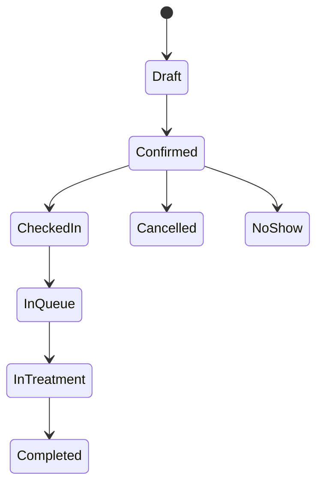
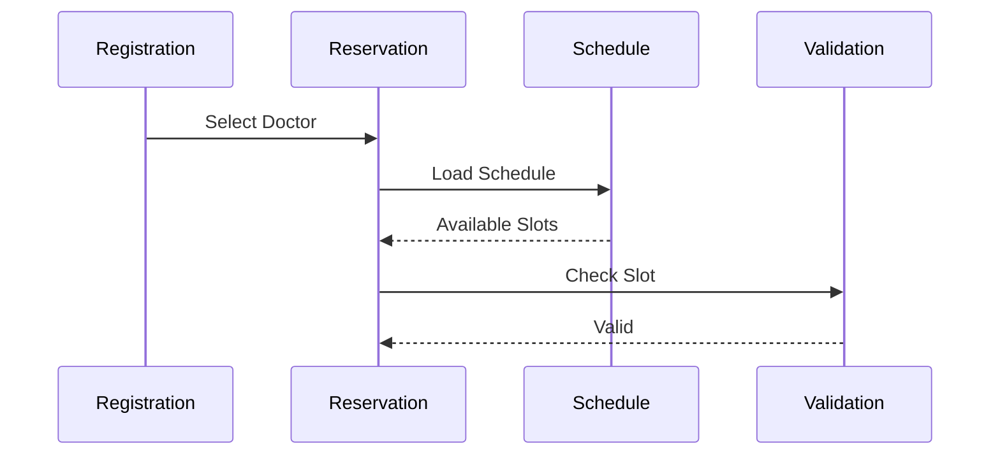
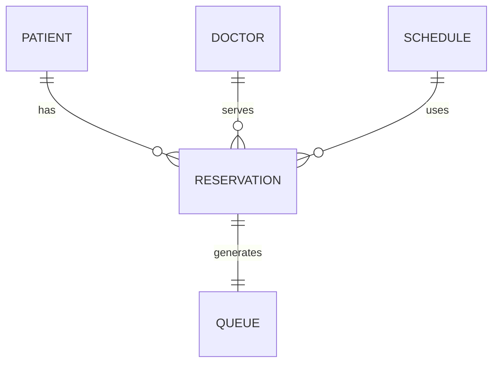
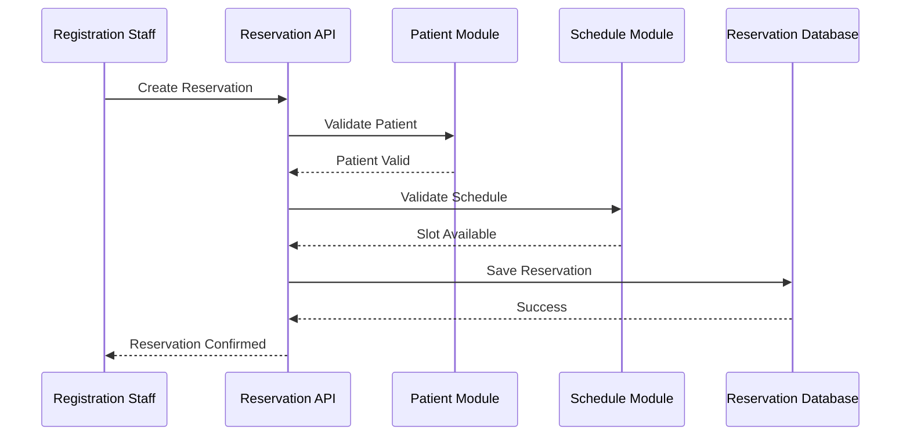
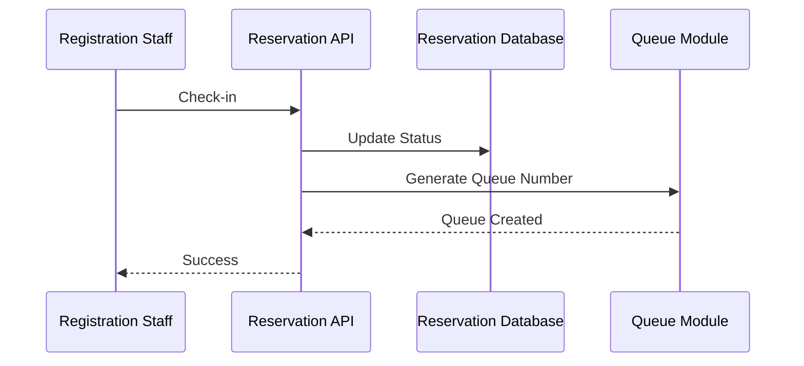
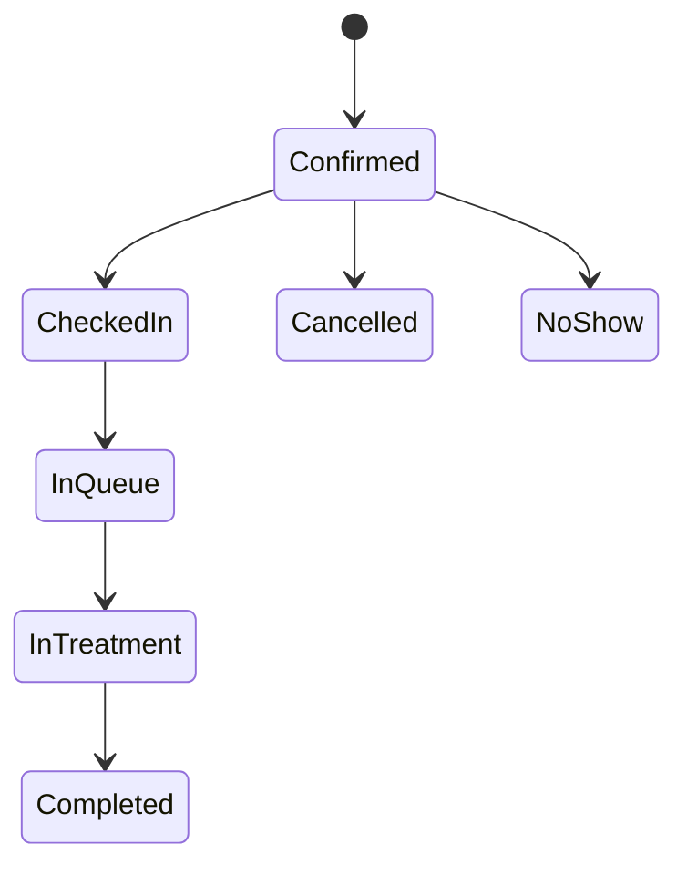

# Parakita Software Architecture Document (SAD)

# 13 - Module Reservation

| Document Information | |
|----------------------|----------------------------------------------|
| Project | Parakita - Dental Clinic Management System |
| Document | 13 - Module Reservation |
| Part | 1 of 5 |
| Version | 1.0.0 |
| Status | Draft |
| Document Type | Module Design Specification |
| Related Modules | Patient, Queue, EMR, Master Data, Authentication |
| Last Updated | July 2026 |

---

# Table of Contents (Part 1)

1. Module Overview
2. Objectives
3. Scope
4. Stakeholders
5. Reservation Business Process
6. Reservation Status Lifecycle
7. Business Rules
8. Reservation Types
9. Reservation Sources
10. Reservation Workflow

---

# 1. Module Overview

## 1.1 Introduction

Reservation Module merupakan salah satu **Core Module** pada Parakita yang bertanggung jawab mengelola seluruh proses pemesanan jadwal kunjungan pasien ke klinik.

Modul ini menjadi penghubung antara **Patient Management**, **Doctor Schedule**, **Queue Management**, dan **Electronic Medical Record (EMR)**.

Reservation dapat dibuat untuk pasien baru maupun pasien lama melalui berbagai sumber reservasi, seperti registrasi langsung di klinik (Walk-in), telepon, WhatsApp (future), maupun Portal Pasien (future).

---

## 1.2 Purpose

Modul Reservation bertujuan untuk:

- Mengelola jadwal kunjungan pasien.
- Menghindari bentrok jadwal dokter.
- Mengoptimalkan utilisasi ruang praktik.
- Mengurangi waktu tunggu pasien.
- Menjadi dasar pembentukan antrian pasien.
- Menyediakan histori reservasi pasien.
- Mendukung monitoring operasional klinik.

---

## 1.3 Module Position

```text
Patient
    │
    ▼
Reservation
    │
    ▼
Queue
    │
    ▼
EMR
    │
    ▼
Billing
```

Reservation hanya dapat dibuat untuk pasien yang telah terdaftar pada sistem.

---

# 2. Objectives

Modul Reservation dikembangkan untuk mencapai tujuan berikut.

## 2.1 Operational Objectives

- Mempermudah proses booking pasien.
- Menyediakan jadwal dokter secara real-time.
- Mengurangi antrean manual.
- Mempercepat proses registrasi.

---

## 2.2 Clinical Objectives

- Memastikan pasien memperoleh jadwal dokter yang tepat.
- Mengurangi konflik jadwal praktik.
- Menjamin kesiapan layanan klinik sebelum pasien datang.

---

## 2.3 Business Objectives

- Meningkatkan tingkat kehadiran pasien (Attendance Rate).
- Mengurangi No Show.
- Mengoptimalkan utilisasi dokter.
- Menyediakan data historis reservasi untuk analisis bisnis.

---

# 3. Scope

## 3.1 In Scope

Modul Reservation mencakup fitur berikut:

- Create Reservation
- Update Reservation
- Cancel Reservation
- Reschedule Reservation
- Walk-in Registration
- Check Availability
- Doctor Schedule Validation
- Reservation Search
- Reservation Timeline
- Reservation History
- Check-in Patient
- Queue Generation
- Reservation Notes

---

## 3.2 Out of Scope

Fitur berikut belum termasuk dalam implementasi versi pertama.

- Online Payment
- WhatsApp Reminder
- SMS Reminder
- Patient Self Booking
- Google Calendar Synchronization
- Telemedicine Appointment
- Multi Clinic Booking

---

## 3.3 Future Scope

Pengembangan berikut direncanakan pada versi selanjutnya.

- Mobile Patient Booking
- WhatsApp Integration
- Automatic Reminder
- AI Schedule Recommendation
- Waiting List
- Online Reschedule
- Calendar Synchronization
- Multi Branch Reservation

---

# 4. Stakeholders

| Role | Responsibility |
|------|----------------|
| Registration Staff | Membuat dan mengelola reservasi |
| Clinic Manager | Monitoring jadwal dan kapasitas |
| Doctor | Melihat jadwal praktik |
| Nurse | Melihat daftar pasien |
| Patient (Future) | Melakukan booking mandiri |
| Administrator | Konfigurasi parameter reservasi |

---

## 4.1 Primary Users

### Registration Staff

Bertanggung jawab melakukan:

- Registrasi pasien
- Booking appointment
- Reschedule
- Cancellation
- Check-in pasien

---

### Doctor

Dokter dapat:

- Melihat jadwal praktik
- Melihat daftar pasien hari ini
- Mengetahui status kedatangan pasien

---

### Clinic Manager

Manager dapat:

- Monitoring kepadatan jadwal
- Monitoring No Show
- Monitoring utilisasi dokter
- Monitoring performa reservasi

---

# 5. Reservation Business Process

Reservation mengikuti alur bisnis berikut.

```mermaid
flowchart LR

Patient

-->

Reservation

-->

Schedule Validation

-->

Reservation Confirmed

-->

Patient Check In

-->

Queue

-->

EMR
```

---

## 5.1 Business Flow

1. Pasien dipilih atau didaftarkan.
2. Sistem menampilkan jadwal dokter.
3. Petugas memilih tanggal dan jam kunjungan.
4. Sistem memvalidasi ketersediaan slot.
5. Reservasi disimpan.
6. Nomor reservasi dibuat.
7. Pada hari kunjungan pasien melakukan Check-in.
8. Sistem membuat nomor antrean.
9. Pasien masuk ke proses pemeriksaan.

---

# 6. Reservation Status Lifecycle

Status reservasi berubah sesuai proses bisnis.



---

## 6.1 Reservation Status

| Status | Description |
|---------|-------------|
| Draft | Reservasi sedang dibuat |
| Confirmed | Reservasi telah dikonfirmasi |
| Checked In | Pasien hadir dan telah registrasi |
| In Queue | Menunggu dipanggil |
| In Treatment | Sedang diperiksa dokter |
| Completed | Pemeriksaan selesai |
| Cancelled | Reservasi dibatalkan |
| No Show | Pasien tidak hadir |

---

# 7. Business Rules

## 7.1 General Rules

- Reservasi hanya dapat dibuat untuk pasien aktif.
- Dokter harus memiliki jadwal praktik.
- Slot waktu tidak boleh melebihi kapasitas.
- Pasien tidak boleh memiliki reservasi aktif pada waktu yang sama.
- Reservasi yang telah selesai tidak dapat diubah.
- Pembatalan dicatat pada Audit Trail.

---

## 7.2 Schedule Rules

- Dokter hanya dapat dipilih pada jadwal aktif.
- Jam reservasi harus berada dalam jam praktik.
- Slot yang penuh tidak dapat dipilih.
- Hari libur dokter tidak dapat digunakan.

---

## 7.3 Check-in Rules

- Check-in hanya dapat dilakukan pada hari kunjungan.
- Pasien yang telah Check-in otomatis masuk ke Queue Module.
- Nomor antrean dibuat saat proses Check-in.

---

## 7.4 Cancellation Rules

- Reservasi yang sudah Check-in tidak dapat dibatalkan.
- Alasan pembatalan wajib diisi.
- Status berubah menjadi **Cancelled**.

---

# 8. Reservation Types

Parakita mendukung beberapa jenis reservasi.

| Type | Description |
|------|-------------|
| Appointment | Reservasi dengan jadwal tertentu |
| Walk-in | Pasien datang tanpa reservasi |
| Follow Up | Kontrol lanjutan |
| Emergency | Kasus darurat |
| Consultation | Konsultasi awal |

---

## 8.1 Appointment

Reservasi dengan tanggal dan jam yang telah ditentukan sebelumnya.

---

## 8.2 Walk-in

Pasien datang langsung ke klinik tanpa melakukan booking sebelumnya.

---

## 8.3 Follow Up

Reservasi yang dibuat sebagai tindak lanjut dari kunjungan sebelumnya.

---

## 8.4 Emergency

Pasien dengan kondisi yang membutuhkan penanganan segera sesuai kebijakan klinik.

---

## 8.5 Consultation

Reservasi khusus untuk konsultasi awal atau pemeriksaan tanpa tindakan langsung.

---

# 9. Reservation Sources

Reservasi dapat berasal dari beberapa sumber.

| Source | Version |
|----------|----------|
| Front Desk | Current |
| Walk-in | Current |
| Phone Call | Current |
| WhatsApp | Future |
| Patient Portal | Future |
| Mobile App | Future |
| API Integration | Future |

---

## Source Flow

```text
Front Desk
Phone
Walk-in
Future Portal
Future Mobile

        │

        ▼

Reservation Module

        │

        ▼

Doctor Schedule Validation

        │

        ▼

Confirmed Reservation
```

---

# 10. Reservation Workflow

Diagram berikut menggambarkan alur utama proses reservasi.

```mermaid
flowchart TD

Start

-->

Search Patient

-->

Patient Exists?

Patient Exists? -->|No| Register Patient

Patient Exists? -->|Yes| Select Patient

Register Patient --> Select Patient

Select Patient --> Select Doctor

Select Doctor --> Select Schedule

Select Schedule --> Validate Availability

Validate Availability --> Reservation Available?

Reservation Available? -->|No| Select Another Slot

Reservation Available? -->|Yes| Save Reservation

Save Reservation --> Generate Reservation Number

Generate Reservation Number --> Reservation Confirmed

Reservation Confirmed --> End
```

---

# Summary Part 1

Part 1 mendefinisikan fondasi **Reservation Module** yang mencakup tujuan, ruang lingkup, stakeholder, proses bisnis, siklus status reservasi, aturan bisnis, jenis reservasi, sumber reservasi, dan workflow utama. Modul ini menjadi penghubung utama antara **Patient**, **Queue**, dan **EMR**, serta memastikan proses penjadwalan pasien berjalan secara terstruktur, konsisten, dan sesuai prinsip **Clean Architecture**, **Domain Driven Design (DDD)**, serta **Modular Monolith** yang diterapkan pada Parakita.

# Parakita Software Architecture Document (SAD)

# 13 - Module Reservation

| Document Information | |
|----------------------|----------------------------------------------|
| Project | Parakita - Dental Clinic Management System |
| Document | 13 - Module Reservation |
| Part | 2 of 5 |
| Version | 1.0.0 |
| Status | Draft |
| Document Type | Module Design Specification |

---

# Table of Contents (Part 2)

11. Functional Requirements
12. Create Reservation
13. Update Reservation
14. Search & Filter
15. Doctor Schedule Validation
16. Time Slot Management
17. Walk-in Registration
18. Reschedule & Cancellation

---

# 11. Functional Requirements

## 11.1 Overview

Reservation Module menyediakan seluruh fungsi yang dibutuhkan untuk mengelola jadwal kunjungan pasien mulai dari pembuatan reservasi hingga proses check-in.

---

## 11.2 Functional List

| Code | Feature | Description |
|------|----------|-------------|
| RSV-001 | Create Reservation | Membuat reservasi baru |
| RSV-002 | Update Reservation | Mengubah informasi reservasi |
| RSV-003 | Cancel Reservation | Membatalkan reservasi |
| RSV-004 | Reschedule Reservation | Mengubah jadwal reservasi |
| RSV-005 | Search Reservation | Pencarian reservasi |
| RSV-006 | Reservation Detail | Melihat detail reservasi |
| RSV-007 | Doctor Availability | Melihat jadwal dokter |
| RSV-008 | Check Availability | Validasi slot jadwal |
| RSV-009 | Walk-in Registration | Registrasi pasien datang langsung |
| RSV-010 | Check-in Patient | Mengubah reservasi menjadi antrean |
| RSV-011 | Reservation Timeline | Riwayat perubahan status |
| RSV-012 | Reservation History | Riwayat reservasi pasien |

---

## 11.3 Functional Dependency

```text
Patient Module
        │
        ▼
Reservation Module
        │
        ▼
Queue Module
        │
        ▼
EMR Module
```

---

# 12. Create Reservation

## 12.1 Overview

Create Reservation digunakan untuk membuat jadwal kunjungan pasien.

---

## 12.2 Actor

- Registration Staff
- Administrator

---

## 12.3 Preconditions

- User telah login.
- Pasien telah terdaftar.
- Dokter aktif.
- Jadwal dokter tersedia.

---

## 12.4 Input Data

| Field | Required |
|---------|----------|
| Patient | ✔ |
| Doctor | ✔ |
| Reservation Date | ✔ |
| Time Slot | ✔ |
| Reservation Type | ✔ |
| Complaint | Optional |
| Notes | Optional |

---

## 12.5 Process Flow

```mermaid
flowchart TD

Select Patient

-->

Select Doctor

-->

Select Date

-->

Select Time Slot

-->

Validate Schedule

-->

Save Reservation

-->

Generate Reservation Number

-->

Completed
```

---

## 12.6 Validation Rules

- Pasien harus aktif.
- Dokter tersedia.
- Slot belum penuh.
- Tanggal tidak boleh di masa lalu.
- Jam sesuai jadwal praktik.
- Tidak ada reservasi aktif yang bentrok.

---

## 12.7 Output

- Reservation Number
- Reservation Status = Confirmed
- Audit Trail
- Reservation Timeline

---

# 13. Update Reservation

## 13.1 Overview

Digunakan untuk memperbarui informasi reservasi sebelum pasien melakukan Check-in.

---

## 13.2 Editable Fields

| Field | Editable |
|---------|----------|
| Doctor | ✔ |
| Date | ✔ |
| Time Slot | ✔ |
| Complaint | ✔ |
| Notes | ✔ |
| Reservation Type | ✔ |

---

## 13.3 Restrictions

Reservasi tidak dapat diubah apabila:

- Sudah Check-in
- Sedang dalam antrean
- Pemeriksaan telah dimulai
- Status Completed
- Status Cancelled

---

## 13.4 Update Flow

```mermaid
flowchart TD

Open Reservation

-->

Modify Data

-->

Validate Schedule

-->

Save Changes

-->

Update Timeline

-->

Audit Log
```

---

# 14. Search & Filter

## 14.1 Search Fields

Pengguna dapat melakukan pencarian berdasarkan:

- Reservation Number
- Patient Name
- Medical Record Number
- Mobile Phone
- Doctor
- Reservation Date

---

## 14.2 Filter

| Filter | Description |
|----------|-------------|
| Status | Confirmed, Checked-in, Cancelled, dll |
| Doctor | Dokter tertentu |
| Reservation Type | Appointment, Walk-in |
| Source | Front Desk, Phone |
| Date Range | Rentang tanggal |
| Branch (Future) | Multi cabang |

---

## 14.3 Sorting

- Reservation Date
- Reservation Time
- Patient Name
- Created Date
- Doctor Name

---

## 14.4 Pagination

Default:

- 20 data per halaman

Options:

- 20
- 50
- 100

---

# 15. Doctor Schedule Validation

## 15.1 Purpose

Memastikan reservasi hanya dapat dibuat pada jadwal praktik dokter yang valid.

---

## 15.2 Validation Sequence



---

## 15.3 Validation Rules

Sistem harus memvalidasi:

- Dokter aktif.
- Jadwal tersedia.
- Tidak sedang cuti.
- Bukan hari libur.
- Slot belum penuh.
- Tidak terjadi double booking.

---

## 15.4 Validation Result

| Result | Action |
|---------|--------|
| Valid | Reservasi dapat disimpan |
| Invalid | Menampilkan pesan kesalahan |
| Full | Pilih slot lain |
| Doctor Leave | Pilih dokter lain |

---

# 16. Time Slot Management

## 16.1 Overview

Time Slot merupakan pembagian waktu praktik dokter yang dapat dipilih saat membuat reservasi.

---

## 16.2 Slot Configuration

Contoh:

| Time | Capacity |
|--------|---------|
| 08:00 | 1 |
| 08:30 | 1 |
| 09:00 | 1 |
| 09:30 | 1 |
| 10:00 | 1 |

---

## 16.3 Slot Status

| Status | Description |
|---------|-------------|
| Available | Masih dapat dipilih |
| Reserved | Sudah dipesan |
| Full | Kapasitas habis |
| Closed | Tidak tersedia |

---

## 16.4 Slot Calculation

Jumlah slot tersedia dihitung berdasarkan:

```text
Total Capacity

-

Confirmed Reservation

-

Checked-in Reservation

=

Available Slot
```

---

# 17. Walk-in Registration

## 17.1 Overview

Walk-in Registration digunakan ketika pasien datang langsung ke klinik tanpa melakukan reservasi sebelumnya.

---

## 17.2 Workflow

```mermaid
flowchart TD

Patient Arrives

-->

Search Patient

-->

Patient Exists?

Patient Exists? -->|No| Register Patient

Patient Exists? -->|Yes| Continue

Register Patient --> Continue

Continue --> Select Doctor

Select Doctor --> Check Slot

Check Slot --> Create Reservation

Create Reservation --> Check-in

Check-in --> Queue
```

---

## 17.3 Business Rules

- Tanggal reservasi otomatis menggunakan tanggal hari ini.
- Reservation Type = Walk-in.
- Source = Walk-in.
- Check-in dapat langsung dilakukan.
- Nomor antrean dibuat setelah Check-in.

---

# 18. Reschedule & Cancellation

## 18.1 Reschedule Reservation

Reschedule digunakan apabila pasien ingin mengubah jadwal kunjungan.

---

### Validation

- Belum Check-in.
- Slot baru tersedia.
- Dokter masih aktif.
- Jadwal baru valid.

---

### Process

```mermaid
flowchart LR

Old Reservation

-->

Select New Schedule

-->

Validate

-->

Update Reservation

-->

Timeline

-->

Audit Trail
```

---

## 18.2 Cancel Reservation

Pembatalan reservasi dapat dilakukan sebelum pasien melakukan Check-in.

---

### Cancellation Rules

- Wajib mengisi alasan pembatalan.
- Status berubah menjadi **Cancelled**.
- Slot kembali tersedia.
- Dicatat pada Audit Trail.
- Dicatat pada Reservation Timeline.

---

### Cancellation Flow

```mermaid
flowchart TD

Open Reservation

-->

Cancel

-->

Input Reason

-->

Confirm

-->

Update Status

-->

Release Slot

-->

Audit Log
```

---

## 18.3 Business Validation

Reservasi **tidak dapat dibatalkan** apabila:

- Sudah Check-in.
- Sedang antre.
- Pemeriksaan sudah dimulai.
- Status Completed.

---

# Summary Part 2

Part 2 menjelaskan kebutuhan fungsional Reservation Module, meliputi pembuatan, perubahan, pencarian, validasi jadwal dokter, pengelolaan time slot, registrasi **Walk-in**, proses **Reschedule**, serta **Cancellation**. Seluruh proses mengikuti prinsip **Clean Architecture**, menggunakan validasi bisnis sebelum perubahan data dilakukan, serta menghasilkan **Audit Trail** dan **Reservation Timeline** untuk menjaga integritas data dan kemudahan pelacakan aktivitas.

# Parakita Software Architecture Document (SAD)

# 13 - Module Reservation

| Document Information | |
|----------------------|----------------------------------------------|
| Project | Parakita - Dental Clinic Management System |
| Document | 13 - Module Reservation |
| Part | 3 of 5 |
| Version | 1.0.0 |
| Status | Draft |
| Document Type | Module Design Specification |

---

# Table of Contents (Part 3)

19. Data Model
20. API Specification
21. Request & Response DTO
22. Validation Rules
23. Sequence Diagram
24. State Diagram
25. Domain Event Flow

---

# 19. Data Model

## 19.1 Overview

Reservation Module menggunakan satu entitas utama yaitu **Reservation** yang berelasi dengan beberapa modul lain seperti **Patient**, **Doctor**, **Schedule**, dan **Queue**.

---

## 19.2 Entity Relationship



---

## 19.3 Reservation Entity

| Field | Type | Description |
|---------|------|-------------|
| id | UUID | Primary Key |
| reservationNumber | String | Nomor reservasi |
| patientId | UUID | Referensi pasien |
| doctorId | UUID | Dokter yang dipilih |
| scheduleId | UUID | Jadwal dokter |
| reservationDate | Date | Tanggal kunjungan |
| startTime | Time | Jam mulai |
| endTime | Time | Jam selesai |
| reservationType | Enum | Jenis reservasi |
| reservationSource | Enum | Sumber reservasi |
| status | Enum | Status reservasi |
| complaint | Text | Keluhan utama |
| notes | Text | Catatan tambahan |
| checkedInAt | Datetime | Waktu Check-in |
| cancelledReason | Text | Alasan pembatalan |
| cancelledAt | Datetime | Waktu pembatalan |
| createdBy | UUID | User pembuat |
| createdAt | Datetime | Waktu dibuat |
| updatedBy | UUID | User terakhir mengubah |
| updatedAt | Datetime | Waktu perubahan |

---

## 19.4 Reservation Relationships

| Related Module | Relationship |
|----------------|-------------|
| Patient | Many to One |
| Doctor | Many to One |
| Schedule | Many to One |
| Queue | One to One |
| User | Many to One |

---

# 20. API Specification

## 20.1 REST Endpoint

| Method | Endpoint | Description |
|----------|-------------------------------|----------------------------|
| GET | /api/v1/reservations | List Reservation |
| GET | /api/v1/reservations/{id} | Reservation Detail |
| POST | /api/v1/reservations | Create Reservation |
| PUT | /api/v1/reservations/{id} | Update Reservation |
| PATCH | /api/v1/reservations/{id}/check-in | Check-in Patient |
| PATCH | /api/v1/reservations/{id}/cancel | Cancel Reservation |
| PATCH | /api/v1/reservations/{id}/reschedule | Reschedule Reservation |
| DELETE | /api/v1/reservations/{id} | Soft Delete (Admin Only) |

---

## 20.2 Availability API

| Method | Endpoint | Description |
|----------|-----------------------------------------|------------------------|
| GET | /api/v1/doctors/{id}/availability | Doctor Availability |
| GET | /api/v1/doctors/{id}/time-slots | Available Time Slots |

---

## 20.3 Search Parameters

| Parameter | Description |
|------------|-------------|
| keyword | Nama pasien / nomor reservasi |
| doctorId | Filter dokter |
| status | Filter status |
| reservationType | Filter jenis reservasi |
| reservationSource | Filter sumber reservasi |
| dateFrom | Tanggal awal |
| dateTo | Tanggal akhir |
| page | Nomor halaman |
| limit | Jumlah data |

---

# 21. Request & Response DTO

## 21.1 Create Reservation Request

```json
{
  "patientId": "uuid",
  "doctorId": "uuid",
  "scheduleId": "uuid",
  "reservationDate": "2026-08-10",
  "startTime": "09:00",
  "reservationType": "APPOINTMENT",
  "complaint": "Sakit gigi",
  "notes": "Pasien baru"
}
```

---

## 21.2 Reservation Response

```json
{
  "id": "uuid",
  "reservationNumber": "RSV-20260810-0001",
  "status": "CONFIRMED",
  "patient": {},
  "doctor": {},
  "schedule": {},
  "reservationDate": "2026-08-10",
  "startTime": "09:00",
  "reservationType": "APPOINTMENT"
}
```

---

## 21.3 Check-in Response

```json
{
  "reservationNumber": "RSV-20260810-0001",
  "status": "CHECKED_IN",
  "queueNumber": "A-015",
  "checkedInAt": "2026-08-10T08:45:00"
}
```

---

## 21.4 Standard Success Response

```json
{
  "success": true,
  "message": "Success",
  "data": {}
}
```

---

## 21.5 Standard Error Response

```json
{
  "success": false,
  "message": "Validation Failed",
  "errors": []
}
```

---

# 22. Validation Rules

## 22.1 Request Validation

| Field | Rule |
|---------|---------------------------|
| patientId | Required |
| doctorId | Required |
| scheduleId | Required |
| reservationDate | Required |
| reservationType | Required |
| complaint | Max 500 karakter |
| notes | Max 1000 karakter |

---

## 22.2 Business Validation

Sistem harus memastikan bahwa:

- Pasien masih aktif.
- Dokter aktif.
- Jadwal dokter aktif.
- Slot masih tersedia.
- Tidak ada bentrok jadwal.
- Pasien tidak memiliki reservasi aktif pada waktu yang sama.
- Tanggal reservasi tidak berada di masa lalu.

---

## 22.3 Database Validation

- Foreign Key Patient.
- Foreign Key Doctor.
- Foreign Key Schedule.
- Reservation Number unik.
- Optimistic Lock saat update.

---

# 23. Sequence Diagram

## 23.1 Create Reservation



---

## 23.2 Check-in Patient



---

# 24. State Diagram



---

## 24.1 State Transition Rules

| From | To |
|-------|----------------|
| Confirmed | Checked In |
| Checked In | In Queue |
| In Queue | In Treatment |
| In Treatment | Completed |
| Confirmed | Cancelled |
| Confirmed | No Show |

---

## Invalid Transition

Tidak diperbolehkan:

- Completed → Confirmed
- Cancelled → Checked In
- No Show → In Treatment
- Completed → Cancelled

---

# 25. Domain Event Flow

Reservation Module menerbitkan Domain Event untuk komunikasi lintas modul.

---

## 25.1 Published Events

| Event | Trigger | Subscriber |
|--------|---------------------------|----------------|
| ReservationCreated | Reservasi berhasil dibuat | Queue |
| ReservationUpdated | Reservasi diperbarui | Reporting |
| ReservationRescheduled | Jadwal diubah | Queue |
| ReservationCancelled | Reservasi dibatalkan | Queue |
| PatientCheckedIn | Check-in berhasil | Queue |
| QueueGenerated | Nomor antrean dibuat | EMR |
| ReservationCompleted | Pemeriksaan selesai | Reporting |

---

## 25.2 Event Flow

```mermaid
flowchart LR

Create Reservation

-->

ReservationCreated

-->

Queue Module

-->

Patient Check-in

-->

PatientCheckedIn

-->

Generate Queue

-->

QueueGenerated

-->

EMR Module
```

---

## 25.3 Internal Event Bus

```text
Reservation Module
        │
        ▼
Internal Event Bus
        │
 ┌──────┼─────────┐
 ▼      ▼         ▼
Queue  Reporting  EMR
```

---

## 25.4 Event Payload Example

```json
{
  "event": "ReservationCreated",
  "reservationId": "uuid",
  "reservationNumber": "RSV-20260810-0001",
  "patientId": "uuid",
  "doctorId": "uuid",
  "reservationDate": "2026-08-10",
  "startTime": "09:00",
  "status": "CONFIRMED",
  "occurredAt": "2026-08-10T08:00:00Z"
}
```

---

# Summary Part 3

Part 3 mendefinisikan model data Reservation, spesifikasi REST API, struktur Request/Response DTO, aturan validasi, sequence diagram proses reservasi dan check-in, state diagram perubahan status, serta mekanisme **Domain Event** yang menghubungkan Reservation Module dengan **Queue**, **EMR**, dan **Reporting**. Seluruh desain mengikuti prinsip **API First**, **Clean Architecture**, **Domain Driven Design (DDD)**, dan **Modular Monolith** yang menjadi standar implementasi Parakita.

# Parakita Software Architecture Document (SAD)

# 13 - Module Reservation

| Document Information | |
|----------------------|----------------------------------------------|
| Project | Parakita - Dental Clinic Management System |
| Document | 13 - Module Reservation |
| Part | 4 of 5 |
| Version | 1.0.0 |
| Status | Draft |
| Document Type | Module Design Specification |

---

# Table of Contents (Part 4)

26. Permission Matrix
27. Audit Trail
28. Notification Flow
29. Integration with Queue Module
30. Integration with Patient Module
31. Error Handling
32. Business Scenarios

---

# 26. Permission Matrix

## 26.1 Overview

Akses terhadap Reservation Module dikendalikan menggunakan **Role Based Access Control (RBAC)**.

Setiap pengguna hanya dapat menjalankan fungsi sesuai permission yang dimiliki.

---

## 26.2 Permission List

| Permission | Description |
|------------|-------------|
| reservation.view | Melihat daftar reservasi |
| reservation.create | Membuat reservasi |
| reservation.update | Mengubah reservasi |
| reservation.cancel | Membatalkan reservasi |
| reservation.reschedule | Mengubah jadwal reservasi |
| reservation.checkin | Melakukan Check-in |
| reservation.delete | Soft Delete reservasi |
| reservation.export | Export data reservasi |

---

## 26.3 Role Permission Matrix

| Role | View | Create | Update | Cancel | Reschedule | Check-in | Export |
|------|:----:|:------:|:------:|:------:|:-----------:|:---------:|:------:|
| Administrator | ✔ | ✔ | ✔ | ✔ | ✔ | ✔ | ✔ |
| Registration Staff | ✔ | ✔ | ✔ | ✔ | ✔ | ✔ | ✔ |
| Clinic Manager | ✔ | ✔ | ✔ | ✔ | ✔ | ✔ | ✔ |
| Doctor | ✔ | - | - | - | - | - | - |
| Nurse | ✔ | - | - | - | - | - | - |
| Cashier | ✔ | - | - | - | - | - | - |

---

## 26.4 Authorization Flow

```mermaid
flowchart LR

User

-->

JWT Authentication

-->

Role Validation

-->

Permission Validation

-->

Reservation API
```

---

# 27. Audit Trail

## 27.1 Overview

Seluruh aktivitas penting pada Reservation Module harus dicatat sebagai Audit Trail.

Audit Trail digunakan untuk:

- Keamanan sistem
- Pelacakan perubahan data
- Kepatuhan operasional
- Investigasi insiden

---

## 27.2 Audited Activities

| Activity | Logged |
|----------|:------:|
| Create Reservation | ✔ |
| Update Reservation | ✔ |
| Cancel Reservation | ✔ |
| Reschedule Reservation | ✔ |
| Check-in Patient | ✔ |
| Soft Delete | ✔ |
| Restore Data (Future) | ✔ |

---

## 27.3 Audit Information

| Field | Description |
|--------|-------------|
| Timestamp | Waktu aktivitas |
| User ID | Pengguna |
| Module | Reservation |
| Action | Jenis aktivitas |
| Reservation ID | Identitas reservasi |
| Reservation Number | Nomor reservasi |
| Old Value | Data sebelum perubahan |
| New Value | Data sesudah perubahan |
| IP Address | IP pengguna |
| User Agent | Browser atau perangkat |

---

## 27.4 Audit Flow

```mermaid
flowchart TD

User Action

-->

Reservation Service

-->

Audit Logger

-->

Audit Database
```

---

# 28. Notification Flow

## 28.1 Overview

Pada versi pertama, notifikasi bersifat internal.

Integrasi dengan WhatsApp, SMS, dan Email direncanakan pada versi berikutnya.

---

## 28.2 Notification Events

| Event | Current | Future |
|--------|:-------:|:------:|
| Reservation Created | Internal | WhatsApp |
| Reservation Updated | Internal | WhatsApp |
| Reservation Cancelled | Internal | WhatsApp |
| Reservation Rescheduled | Internal | WhatsApp |
| Reminder H-1 | - | WhatsApp |
| Reminder H-0 | - | WhatsApp |
| No Show Notification | Internal | Email |

---

## 28.3 Notification Flow

```mermaid
flowchart LR

Reservation Event

-->

Notification Service

-->

Internal Notification

-.Future.->

WhatsApp

-.Future.->

Email

-.Future.->

SMS
```

---

## 28.4 Future Notification Features

- Appointment Reminder
- Follow-up Reminder
- Reschedule Notification
- Cancellation Notification
- Doctor Schedule Change Notification

---

# 29. Integration with Queue Module

## 29.1 Overview

Reservation Module menjadi sumber utama pembentukan antrean pasien.

Nomor antrean dibuat setelah pasien melakukan Check-in.

---

## 29.2 Integration Flow

```mermaid
flowchart TD

Reservation Confirmed

-->

Patient Check-in

-->

Generate Queue

-->

Queue Module

-->

Waiting Queue
```

---

## 29.3 Data Sent to Queue

| Field | Description |
|--------|-------------|
| Reservation ID | Identitas reservasi |
| Reservation Number | Nomor reservasi |
| Patient ID | Identitas pasien |
| Doctor ID | Dokter tujuan |
| Queue Date | Tanggal antrean |
| Queue Type | Appointment / Walk-in |
| Priority | Prioritas antrean |

---

## 29.4 Business Rules

- Queue hanya dibuat setelah Check-in.
- Satu reservasi menghasilkan satu antrean.
- Queue mengikuti dokter yang dipilih.
- Queue dibatalkan apabila reservasi dibatalkan sebelum Check-in.

---

# 30. Integration with Patient Module

## 30.1 Overview

Reservation Module bergantung pada Patient Module untuk validasi identitas pasien.

---

## 30.2 Integration Diagram

```mermaid
flowchart LR

Reservation

-->

Patient Module

-->

Patient Validation

-->

Reservation
```

---

## 30.3 Validation

Sebelum reservasi dibuat, sistem harus memastikan:

- Pasien tersedia.
- Pasien aktif.
- Medical Record Number valid.
- Pasien tidak dihapus (Soft Delete).

---

## 30.4 Shared Information

| Data | Source |
|-------|--------|
| Patient ID | Patient Module |
| Medical Record Number | Patient Module |
| Patient Name | Patient Module |
| Date of Birth | Patient Module |
| Mobile Phone | Patient Module |

---

# 31. Error Handling

## 31.1 Error Strategy

Reservation Module menggunakan standar respons error yang konsisten di seluruh API.

---

## 31.2 HTTP Status Code

| Code | Description |
|------|-------------|
| 400 | Bad Request |
| 401 | Unauthorized |
| 403 | Forbidden |
| 404 | Reservation Not Found |
| 409 | Schedule Conflict |
| 422 | Business Validation Failed |
| 500 | Internal Server Error |

---

## 31.3 Business Errors

| Code | Message |
|------|---------|
| RSV-001 | Reservation not found |
| RSV-002 | Doctor schedule unavailable |
| RSV-003 | Time slot already reserved |
| RSV-004 | Patient already has active reservation |
| RSV-005 | Reservation already checked in |
| RSV-006 | Reservation already completed |
| RSV-007 | Reservation already cancelled |
| RSV-008 | Invalid reservation status |
| RSV-009 | Reservation date is in the past |

---

## 31.4 Error Response

```json
{
  "success": false,
  "message": "Time slot already reserved.",
  "errorCode": "RSV-003",
  "errors": []
}
```

---

# 32. Business Scenarios

## Scenario 1 — Create Reservation

```text
Registration Staff

↓

Search Patient

↓

Select Doctor

↓

Select Time Slot

↓

Validate Schedule

↓

Save Reservation

↓

Reservation Confirmed
```

---

## Scenario 2 — Walk-in Patient

```text
Patient Arrives

↓

Search Patient

↓

Register Patient (if needed)

↓

Create Walk-in Reservation

↓

Check-in

↓

Generate Queue

↓

Waiting Queue
```

---

## Scenario 3 — Reschedule Reservation

```text
Open Reservation

↓

Select New Schedule

↓

Validate Availability

↓

Update Reservation

↓

Reservation Updated
```

---

## Scenario 4 — Cancel Reservation

```text
Open Reservation

↓

Input Cancellation Reason

↓

Confirm Cancellation

↓

Release Time Slot

↓

Reservation Cancelled
```

---

## Scenario 5 — Check-in Patient

```text
Open Reservation

↓

Validate Reservation Status

↓

Check-in Patient

↓

Generate Queue Number

↓

Waiting Queue
```

---

## Scenario 6 — No Show Patient

```text
Reservation Confirmed

↓

Patient Does Not Arrive

↓

Clinic Closing Time Reached

↓

Update Status = No Show

↓

Audit Trail

↓

Reporting
```

---

# Summary Part 4

Part 4 menjelaskan aspek operasional Reservation Module, meliputi **Role & Permission**, **Audit Trail**, **Notification Flow**, integrasi dengan **Queue Module** dan **Patient Module**, standar **Error Handling**, serta berbagai skenario bisnis utama seperti pembuatan reservasi, **Walk-in**, **Reschedule**, **Cancellation**, **Check-in**, dan **No Show**. Seluruh proses dirancang agar konsisten dengan prinsip **RBAC**, **Auditability**, **API Standard**, **Clean Architecture**, dan **Modular Monolith** yang diterapkan pada Parakita.

# Parakita Software Architecture Document (SAD)

# 13 - Module Reservation

| Document Information | |
|----------------------|----------------------------------------------|
| Project | Parakita - Dental Clinic Management System |
| Document | 13 - Module Reservation |
| Part | 5 of 5 |
| Version | 1.0.0 |
| Status | Draft |
| Document Type | Module Design Specification |

---

# Table of Contents (Part 5)

33. User Interface Guidelines
34. Reporting & Dashboard
35. Key Performance Indicators (KPI)
36. Test Scenarios
37. Future Enhancements
38. Module Summary

---

# 33. User Interface Guidelines

## 33.1 Overview

Reservation Module dirancang agar proses registrasi pasien dapat dilakukan dengan cepat, sederhana, dan meminimalkan kesalahan input.

Antarmuka harus memudahkan petugas Front Desk dalam mengelola jadwal kunjungan pasien dengan jumlah klik seminimal mungkin.

---

## 33.2 Main Screens

| Screen | Description |
|----------|-------------|
| Reservation List | Daftar seluruh reservasi |
| Create Reservation | Form membuat reservasi |
| Reservation Detail | Detail reservasi |
| Edit Reservation | Mengubah reservasi |
| Doctor Schedule | Jadwal praktik dokter |
| Time Slot Selection | Pemilihan slot waktu |
| Check-in | Registrasi kedatangan pasien |
| Reservation History | Riwayat reservasi pasien |

---

## 33.3 Reservation List

Kolom yang ditampilkan:

- Reservation Number
- Reservation Date
- Reservation Time
- Patient Name
- Medical Record Number
- Doctor
- Reservation Type
- Status
- Source
- Created By

---

## 33.4 Quick Actions

Setiap baris reservasi menyediakan aksi cepat:

- View Detail
- Edit
- Reschedule
- Cancel
- Check-in
- Print (Future)

---

## 33.5 Color Standard

| Status | Color |
|---------|-------|
| Confirmed | Blue |
| Checked In | Green |
| In Queue | Orange |
| In Treatment | Purple |
| Completed | Gray |
| Cancelled | Red |
| No Show | Dark Red |

---

## 33.6 UX Guidelines

- Form maksimal 1 halaman.
- Gunakan pencarian pasien dengan autocomplete.
- Tampilkan slot yang tersedia secara real-time.
- Slot penuh tidak dapat dipilih.
- Tampilkan konfirmasi sebelum pembatalan.
- Tampilkan notifikasi sukses atau gagal setelah setiap aksi.

---

# 34. Reporting & Dashboard

## 34.1 Reservation Dashboard

Dashboard menyediakan ringkasan aktivitas reservasi harian.

---

## 34.2 Dashboard Widgets

| Widget | Description |
|----------|-------------|
| Today's Reservations | Jumlah reservasi hari ini |
| Checked-in Patients | Jumlah pasien Check-in |
| Waiting Queue | Pasien menunggu |
| Completed Visits | Pemeriksaan selesai |
| Cancelled Reservations | Reservasi dibatalkan |
| No Show | Pasien tidak hadir |

---

## 34.3 Reports

Laporan yang tersedia:

- Daily Reservation Report
- Doctor Reservation Report
- Reservation by Type
- Reservation by Source
- Cancellation Report
- No Show Report
- Walk-in Report
- Follow-up Report

---

## 34.4 Export Format

Mendukung ekspor:

- Excel (.xlsx)
- CSV (.csv)
- PDF (.pdf)

---

## 34.5 Analytics

Informasi analitik meliputi:

- Reservation Trend
- Peak Hour Analysis
- Doctor Utilization
- Appointment Conversion
- Walk-in Ratio
- Cancellation Trend
- No Show Trend

---

# 35. Key Performance Indicators (KPI)

## 35.1 Operational KPI

| KPI | Description |
|------|-------------|
| Total Reservations | Jumlah reservasi |
| Daily Reservation | Reservasi harian |
| Weekly Reservation | Reservasi mingguan |
| Monthly Reservation | Reservasi bulanan |

---

## 35.2 Service KPI

| KPI | Target |
|------|--------|
| Check-in Success Rate | ≥ 95% |
| Reservation Completion Rate | ≥ 90% |
| No Show Rate | ≤ 5% |
| Cancellation Rate | ≤ 10% |
| Schedule Conflict | 0 |

---

## 35.3 Doctor KPI

- Appointment per Doctor
- Doctor Utilization
- Average Daily Patient
- Peak Practice Hour
- Follow-up Ratio

---

## 35.4 Management KPI

- Reservation Growth
- Walk-in Percentage
- Online Booking Percentage (Future)
- Patient Return Rate
- Average Reservation Lead Time

---

# 36. Test Scenarios

## 36.1 Functional Test

| Test Case | Expected Result |
|------------|----------------|
| Create Reservation | Success |
| Update Reservation | Success |
| Cancel Reservation | Status berubah menjadi Cancelled |
| Reschedule | Jadwal berhasil diperbarui |
| Check-in | Queue berhasil dibuat |
| Walk-in | Reservasi berhasil dibuat |
| Search Reservation | Data ditemukan |
| Export Report | File berhasil dibuat |

---

## 36.2 Validation Test

| Scenario | Expected Result |
|-----------|----------------|
| Slot penuh | Ditolak |
| Jadwal dokter tidak aktif | Ditolak |
| Tanggal di masa lalu | Ditolak |
| Double booking | Ditolak |
| Pasien tidak aktif | Ditolak |

---

## 36.3 Integration Test

| Module | Test |
|----------|------|
| Patient | Validasi pasien |
| Queue | Generate antrean |
| EMR | Membuka kunjungan |
| Authentication | Validasi login |
| Authorization | Validasi permission |
| Reporting | Sinkronisasi laporan |

---

## 36.4 Performance Test

Target performa sistem:

| Activity | Target |
|----------|--------|
| Reservation Search | < 1 detik |
| Create Reservation | < 2 detik |
| Check-in | < 2 detik |
| Reservation Detail | < 1 detik |
| Dashboard Loading | < 3 detik |

---

# 37. Future Enhancements

## 37.1 Phase 2

- WhatsApp Appointment Reminder
- SMS Reminder
- Email Reminder
- Online Patient Booking
- Patient Portal

---

## 37.2 Phase 3

- Mobile Application
- Doctor Mobile App
- Self Check-in
- QR Code Check-in
- Digital Queue Display
- Waiting List Management

---

## 37.3 Phase 4

- AI Slot Recommendation
- AI No Show Prediction
- Calendar Synchronization
- Google Calendar Integration
- Outlook Calendar Integration
- Multi Branch Reservation

---

## 37.4 Long-term Vision

Reservation Module akan berkembang menjadi **Central Appointment Management System** yang mampu mengelola seluruh reservasi lintas cabang, berbagai kanal pemesanan, serta mendukung integrasi dengan layanan eksternal secara real-time.

---

# 38. Module Summary

## 38.1 Overview

Reservation Module merupakan salah satu **Core Domain** dalam Parakita yang mengelola seluruh proses penjadwalan kunjungan pasien, mulai dari pembuatan reservasi hingga pasien masuk ke proses antrean dan pemeriksaan.

---

## 38.2 Responsibilities

Reservation Module bertanggung jawab untuk:

- Mengelola Appointment
- Mengelola Walk-in
- Mengelola Follow-up
- Validasi Jadwal Dokter
- Validasi Time Slot
- Mengelola Reschedule
- Mengelola Cancellation
- Melakukan Check-in
- Mengirim event ke Queue Module
- Menyediakan histori reservasi
- Mendukung pelaporan operasional

---

## 38.3 Module Integration

```text
Patient
      │
      ▼
Reservation
      │
      ▼
Queue
      │
      ▼
EMR
      │
      ▼
Billing
      │
      ▼
Finance
```

---

## 38.4 Architecture Compliance

Reservation Module mengikuti standar arsitektur Parakita:

- Clean Architecture
- Domain Driven Design (DDD)
- Modular Monolith
- Repository Pattern
- CQRS-ready Design
- RESTful API Standard
- Event-driven Module Communication
- Audit Trail
- Role Based Access Control (RBAC)

---

## 38.5 Benefits

Implementasi Reservation Module memberikan manfaat:

- Penjadwalan pasien lebih terstruktur.
- Mengurangi konflik jadwal dokter.
- Mempercepat proses registrasi.
- Mengoptimalkan utilisasi dokter.
- Mendukung pembentukan antrean secara otomatis.
- Menyediakan data historis yang lengkap.
- Menjadi fondasi integrasi dengan EMR, Billing, dan Reporting.

---

# Final Summary

Dokumen **13 - Module Reservation** mendefinisikan desain lengkap Reservation Module sebagai pusat pengelolaan appointment pada Parakita. Dokumen ini mencakup proses bisnis, kebutuhan fungsional, model data, API, validasi, workflow, integrasi lintas modul, keamanan, audit trail, pelaporan, KPI, skenario pengujian, hingga roadmap pengembangan di masa depan. Seluruh rancangan disusun mengikuti prinsip **Clean Architecture**, **Domain Driven Design (DDD)**, **Modular Monolith**, serta standar dokumentasi yang digunakan pada seluruh blueprint Parakita sehingga siap menjadi acuan implementasi backend maupun frontend.

