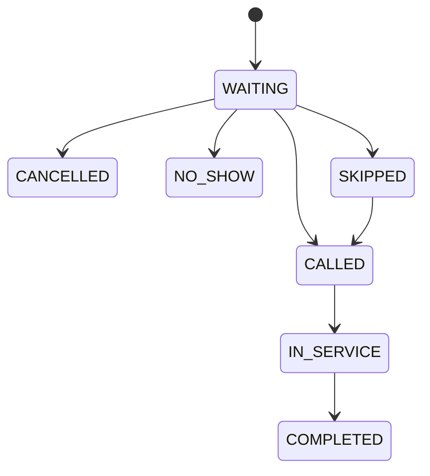
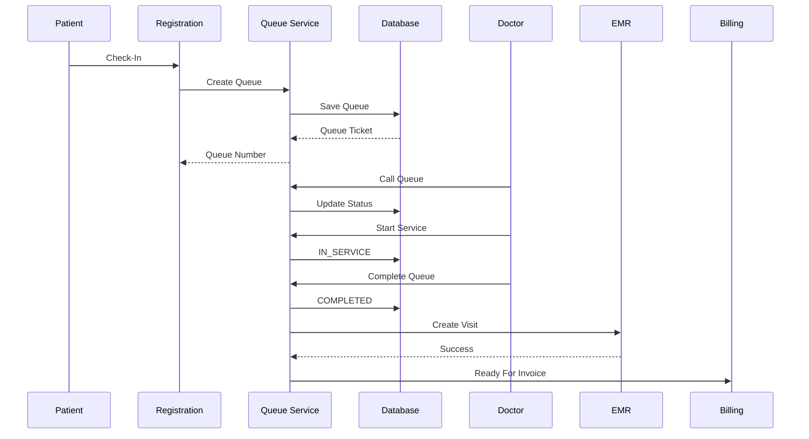

# Parakita Software Architecture Document (SAD)

# 14 - Module Queue

| Document Information | |
|----------------------|----------------------------------------------|
| Project | Parakita - Dental Clinic Management System |
| Document | 14 - Module Queue |
| Part | 1 of 6 |
| Version | 1.0.0 |
| Status | Draft |
| Document Type | Module Design Specification |
| Module | Queue Management |
| Architecture | Clean Architecture + Domain Driven Design + Modular Monolith |
| Backend | Express.js + TypeScript |
| Frontend | Next.js |
| Database | MySQL 8.x |
| Last Updated | July 2026 |

---

# Table of Contents (Part 1)

1. Introduction
2. Purpose
3. Scope
4. Relationship with Other Documents
5. Queue Module Overview
6. Business Objectives
7. Module Responsibilities
8. Module Dependency
9. Queue Business Concept
10. Queue Types
11. Queue Lifecycle
12. Queue Workflow Overview
13. Queue Actors
14. Queue Terminology
15. High Level Architecture
16. Summary

---

# 1. Introduction

## 1.1 Overview

Queue Module merupakan salah satu **Core Operational Module** pada sistem Parakita.

Module ini bertanggung jawab mengelola seluruh proses antrian pasien mulai dari pasien melakukan **check-in**, mendapatkan nomor antrian, menunggu pelayanan, dipanggil oleh dokter, hingga proses pelayanan selesai.

Queue Management menjadi penghubung antara beberapa bounded context utama:

- Patient
- Reservation
- Registration
- Doctor Service
- Electronic Medical Record (EMR)
- Billing

Tanpa Queue Module, proses operasional klinik tidak dapat berjalan secara terstruktur karena seluruh aktivitas pelayanan pasien dimulai dari antrian.

---

## 1.2 Background

Pada sebagian besar klinik gigi, masalah operasional yang sering muncul adalah:

- Nomor antrian ditulis manual.
- Pasien reservasi bercampur dengan pasien walk-in.
- Sulit mengetahui siapa pasien berikutnya.
- Dokter tidak mengetahui jumlah pasien yang menunggu.
- Tidak ada data waktu tunggu.
- Tidak tersedia statistik pelayanan.

Queue Module dikembangkan untuk menyelesaikan seluruh permasalahan tersebut melalui sistem digital yang terintegrasi.

---

## 1.3 Objectives

Dokumen ini bertujuan untuk:

- Menjelaskan desain Queue Module.
- Menjadi acuan implementasi Backend.
- Menjadi referensi Frontend.
- Menentukan business rule antrian.
- Menentukan alur operasional pasien.
- Menentukan integrasi dengan Reservation dan EMR.

---

# 2. Purpose

Queue Module memiliki tujuan sebagai berikut.

## Operational

- Menghasilkan nomor antrian otomatis.
- Mengelola urutan pelayanan pasien.
- Mengurangi waktu tunggu.
- Menghindari konflik antrian.
- Mendukung multi dokter.

## Monitoring

- Menampilkan antrian secara real-time.
- Mengukur waiting time.
- Mengukur service time.
- Menghasilkan KPI operasional.

## Integration

- Terintegrasi dengan Reservation.
- Terintegrasi dengan Patient.
- Terintegrasi dengan EMR.
- Terintegrasi dengan Billing.

---

# 3. Scope

## In Scope

Queue Module mencakup:

- Queue Number Generator
- Patient Check-In
- Walk-in Queue
- Reservation Queue
- Queue Calling
- Queue Recall
- Queue Skip
- Queue Cancel
- Queue Complete
- Waiting Time Tracking
- Service Time Tracking
- Queue Dashboard
- Queue History

## Out of Scope

Queue Module tidak mencakup:

- Pendaftaran pasien baru
- Booking reservasi
- Pemeriksaan dokter
- Input tindakan medis
- Pembayaran
- Stock management

Seluruh fungsi tersebut berada pada module lain.

---

# 4. Relationship with Other Documents

Queue Module merupakan implementasi dari beberapa dokumen sebelumnya.

```text
01-System Overview
        │
        ▼
Business Requirement

        │

02-System Architecture
        │
        ▼
Module Architecture

        │

03-Clean Architecture
        │
        ▼
Implementation Pattern

        │

06-Database Design
        │
        ▼
Queue Tables

        │

09-API Standard
        │
        ▼
REST Endpoint

        │

12-Patient Module
        │
        ▼
Patient Registration

        │

13-Reservation Module
        │
        ▼
Appointment

        │

14-Queue Module
```

---

# 5. Queue Module Overview

Queue Module merupakan domain yang mengatur urutan pelayanan pasien.

Diagram konseptual:

```text
Patient

        │

Reservation / Walk-In

        │

Check-In

        │

Queue Ticket

        │

Waiting Queue

        │

Doctor Calling

        │

Medical Service

        │

EMR

        │

Billing
```

Queue hanya berlaku untuk **kunjungan pada tanggal tertentu**.

Setiap kunjungan menghasilkan satu Queue Ticket.

---

# 6. Business Objectives

Queue Module memiliki beberapa sasaran bisnis.

## 6.1 Reduce Waiting Time

Mengurangi waktu tunggu pasien.

Target KPI:

- Waiting Time < 15 menit
- Registration < 5 menit
- Doctor Idle Time seminimal mungkin

---

## 6.2 Improve Patient Experience

Pasien memperoleh:

- Nomor antrian otomatis
- Informasi status antrian
- Estimasi waktu tunggu
- Kepastian urutan pelayanan

---

## 6.3 Improve Clinic Efficiency

Management dapat melihat:

- Total pasien hari ini
- Pasien menunggu
- Pasien dipanggil
- Pasien selesai
- Dokter aktif
- Dokter idle

---

## 6.4 Support Multi Branch

Queue bersifat independen untuk setiap cabang.

Contoh:

```text
Branch Jakarta

A001

A002

A003

------------------

Branch Bandung

A001

A002

A003
```

Nomor antrian tidak saling bertabrakan.

---

# 7. Module Responsibilities

| Responsibility | Queue |
|----------------|-------|
| Generate Queue Number | ✔ |
| Check-In | ✔ |
| Queue Dashboard | ✔ |
| Waiting Time | ✔ |
| Service Time | ✔ |
| Queue History | ✔ |
| Reservation | ✖ |
| EMR | ✖ |
| Billing | ✖ |
| Inventory | ✖ |

---

# 8. Module Dependency

## Incoming Dependency

Module yang menggunakan Queue:

- Reservation
- Registration
- Doctor
- Nurse
- Dashboard
- Reporting

## Outgoing Dependency

Queue membutuhkan data dari:

- Authentication
- Master Data
- Patient
- Reservation
- Branch
- Doctor

---

# 9. Queue Business Concept

Queue Ticket merupakan representasi kunjungan pasien.

Relasi bisnis:

```text
Patient

↓

Reservation (Optional)

↓

Check-In

↓

Queue Ticket

↓

Visit

↓

EMR

↓

Invoice

↓

Payment
```

Setiap Queue Ticket hanya boleh menghasilkan satu Visit.

---

# 10. Queue Types

Parakita mendukung beberapa jenis antrian.

## 10.1 Reservation Queue

Pasien sudah memiliki jadwal.

Contoh:

- Kontrol
- Scaling
- Tambal gigi
- Konsultasi

---

## 10.2 Walk-In Queue

Pasien datang langsung.

Tidak memiliki Appointment sebelumnya.

---

## 10.3 Emergency Queue

Pasien prioritas tinggi.

Memiliki hak untuk mendahului antrian biasa sesuai kebijakan klinik.

---

## 10.4 VIP Queue (Optional)

Dapat diaktifkan apabila klinik memiliki layanan premium.

---

# 11. Queue Lifecycle

Setiap Queue Ticket mengalami perubahan status.

```text
WAITING

↓

CALLED

↓

IN_SERVICE

↓

COMPLETED
```

Alternatif:

```text
WAITING

↓

NO_SHOW
```

atau

```text
WAITING

↓

CANCELLED
```

Lifecycle ini akan menjadi dasar validasi pada seluruh endpoint Queue API.

---

# 12. Queue Workflow Overview

```mermaid
flowchart LR

Patient

-->

Registration

-->

Check In

-->

Generate Queue

-->

Waiting

-->

Doctor Call

-->

Treatment

-->

Completed
```

Workflow ini berlaku baik untuk pasien reservasi maupun walk-in.

---

# 13. Queue Actors

| Actor | Responsibility |
|--------|----------------|
| Registration Staff | Check-In dan membuat antrian |
| Doctor | Memanggil pasien dan memulai pelayanan |
| Nurse | Membantu perubahan status pelayanan |
| Cashier | Melihat status selesai sebelum billing |
| Clinic Manager | Monitoring dashboard |
| Administrator | Konfigurasi sistem |

---

# 14. Queue Terminology

| Term | Description |
|------|-------------|
| Queue Ticket | Nomor antrian pasien |
| Check-In | Konfirmasi kedatangan pasien |
| Waiting | Pasien sedang menunggu |
| Called | Pasien dipanggil |
| In Service | Sedang diperiksa dokter |
| Completed | Pelayanan selesai |
| No Show | Pasien tidak hadir |
| Recall | Memanggil ulang pasien |
| Skip | Melewati urutan sementara |

---

# 15. High Level Architecture

```text
Frontend (Next.js)

        │

REST API

        │

Queue Controller

        │

Queue Service

        │

Queue Repository

        │

MySQL
```

Implementasi mengikuti pola **Clean Architecture** dan **Repository Pattern** sehingga Queue Module tidak bergantung langsung pada ORM maupun framework.

---

# 16. Summary

Part 1 menjelaskan fondasi Queue Module mulai dari tujuan bisnis, ruang lingkup, konsep antrian, jenis antrian, lifecycle, aktor, dependency, hingga arsitektur tingkat tinggi.

# Parakita Software Architecture Document (SAD)

# 14 - Module Queue

| Document Information | |
|----------------------|----------------------------------------------|
| Project | Parakita - Dental Clinic Management System |
| Document | 14 - Module Queue |
| Part | 2 of 6 |
| Version | 1.0.0 |
| Status | Draft |
| Document Type | Module Design Specification |
| Module | Queue Management |
| Architecture | Clean Architecture + Domain Driven Design + Modular Monolith |
| Last Updated | July 2026 |

---

# Table of Contents (Part 2)

17. Queue Numbering Strategy
18. Queue Configuration
19. Queue Status Management
20. Queue Priority Management
21. Business Rules
22. Validation Rules
23. Queue State Transition
24. Queue Scheduling
25. Queue Capacity
26. Queue Performance Metrics
27. Queue Dashboard Metrics
28. Exception Handling
29. Queue Configuration Parameters
30. Summary

---

# 17. Queue Numbering Strategy

## 17.1 Overview

Setiap pasien yang melakukan **Check-In** akan memperoleh nomor antrian secara otomatis.

Nomor antrian dihasilkan berdasarkan konfigurasi masing-masing cabang dan poli sehingga tidak terjadi duplikasi.

Queue Number bersifat:

- Unik
- Berurutan
- Mudah dibaca
- Reset setiap hari
- Independent per Branch
- Independent per Clinic

---

## 17.2 Numbering Format

Format default:

```text
PREFIX + Running Number
```

Contoh:

```text
A001
A002
A003
...
A120
```

Alternatif format:

```text
DG-001

DRG-001

P001

G001
```

Seluruh format dapat dikonfigurasi melalui System Parameter.

---

## 17.3 Reset Policy

Nomor antrian di-reset berdasarkan:

- Branch
- Clinic
- Queue Type
- Queue Date

Contoh:

```text
01 Januari

A001
A002
A003

-------------------

02 Januari

A001
A002
```

---

## 17.4 Queue Number Generator

Pseudo Flow

```text
Receive Check-In

↓

Get Branch

↓

Get Queue Prefix

↓

Read Last Queue Number

↓

Increment

↓

Save Queue Ticket

↓

Return Queue Number
```

Nomor antrian harus dihasilkan dalam satu transaksi database untuk menghindari race condition.

---

# 18. Queue Configuration

Queue Module menyediakan konfigurasi yang dapat diubah tanpa perubahan kode.

## 18.1 Queue Settings

| Parameter | Description |
|-----------|-------------|
| Queue Prefix | Prefix nomor antrian |
| Daily Reset | Reset nomor setiap hari |
| Maximum Queue | Maksimum pasien per hari |
| Auto Recall | Recall otomatis |
| Recall Count | Maksimal recall |
| Allow Skip | Mengizinkan skip |
| Allow Walk-In | Mengizinkan pasien tanpa reservasi |
| Enable Emergency | Mengaktifkan antrian prioritas |

---

## 18.2 Branch Configuration

Setiap cabang dapat memiliki konfigurasi berbeda.

Contoh:

```text
Branch Jakarta

Prefix : A

Maximum Queue : 150

---------------------

Branch Bandung

Prefix : B

Maximum Queue : 250
```

---

## 18.3 Doctor Configuration

Dokter dapat memiliki:

- Queue sendiri
- Shared Queue
- Multi Chair Queue

Konfigurasi ditentukan saat setup dokter.

---

# 19. Queue Status Management

Queue Ticket memiliki lifecycle yang jelas.

## Available Status

| Status | Description |
|---------|-------------|
| WAITING | Menunggu dipanggil |
| CALLED | Dipanggil dokter |
| IN_SERVICE | Sedang diperiksa |
| COMPLETED | Pelayanan selesai |
| CANCELLED | Dibatalkan |
| NO_SHOW | Pasien tidak hadir |
| SKIPPED | Dilewati sementara |

---

## Status Description

### WAITING

Pasien selesai check-in.

Belum dipanggil dokter.

---

### CALLED

Dokter telah memanggil pasien.

Masih menunggu pasien masuk ruang tindakan.

---

### IN_SERVICE

Dokter mulai melakukan pemeriksaan.

EMR dapat mulai diinput.

---

### COMPLETED

Pelayanan selesai.

Billing dapat diproses.

---

### CANCELLED

Antrian dibatalkan oleh petugas.

Tidak dapat diproses kembali.

---

### NO_SHOW

Pasien tidak datang setelah beberapa kali dipanggil.

Status ini digunakan untuk analisis operasional.

---

### SKIPPED

Pasien dilewati sementara.

Masih dapat dipanggil kembali.

---

# 20. Queue Priority Management

## 20.1 Overview

Queue tidak selalu diproses berdasarkan urutan nomor.

Priority Engine dapat mengubah urutan pelayanan.

---

## Priority Order

```text
1. Emergency

2. VIP

3. Reservation

4. Walk-In
```

Dalam kategori yang sama digunakan prinsip:

```text
FIFO
(First In First Out)
```

---

## Emergency Example

```text
Waiting

A001

A002

A003

Emergency Patient

↓

Served First

↓

A001

↓

A002
```

Seluruh perubahan prioritas dicatat dalam Audit Trail.

---

# 21. Business Rules

## Rule 1

Satu pasien hanya boleh memiliki satu Queue aktif pada satu cabang dalam satu hari.

---

## Rule 2

Queue Ticket wajib memiliki Patient.

---

## Rule 3

Reservation yang telah Check-In tidak boleh membuat Queue baru.

---

## Rule 4

Queue hanya dapat dibuat pada tanggal operasional klinik.

---

## Rule 5

Pasien yang telah Completed tidak dapat kembali ke WAITING.

---

## Rule 6

Queue tidak boleh dihapus secara fisik.

Menggunakan Soft Delete.

---

## Rule 7

Queue Number tidak boleh berubah setelah dibuat.

---

## Rule 8

Patient Walk-In harus memiliki Visit Date hari ini.

---

## Rule 9

Status IN_SERVICE hanya dapat dilakukan setelah CALLED.

---

## Rule 10

Billing hanya dapat dibuat apabila Queue COMPLETED.

---

# 22. Validation Rules

Saat Check-In sistem melakukan validasi berikut.

## Patient Validation

- Patient aktif
- Tidak duplicate
- Tidak dihapus

---

## Reservation Validation

Jika menggunakan Appointment.

Validasi:

- Status Reservation
- Tanggal
- Branch
- Doctor

---

## Queue Validation

Tidak boleh terdapat:

```text
Patient

↓

WAITING

↓

Branch yang sama

↓

Tanggal yang sama
```

---

## Doctor Validation

Pastikan dokter:

- Aktif
- Sedang praktik
- Tidak cuti
- Tidak dinonaktifkan

---

# 23. Queue State Transition



Status yang tidak terdapat pada diagram dianggap tidak valid.

---

# 24. Queue Scheduling

Queue Module mendukung:

## Scheduled Queue

Pasien dengan reservasi.

## Immediate Queue

Walk-in.

## Hybrid Queue

Menggabungkan Reservation dan Walk-In berdasarkan prioritas.

---

## Queue Algorithm

Secara default digunakan:

```text
Priority Queue

↓

FIFO
```

Implementasi dapat diperluas menjadi:

- Dynamic Priority
- AI Prediction
- Estimated Waiting Time

---

# 25. Queue Capacity

Setiap dokter memiliki kapasitas pelayanan.

Contoh:

| Doctor | Capacity |
|---------|----------|
| Dr. Andi | 30 |
| Dr. Budi | 25 |
| Dr. Sinta | 40 |

Jika kapasitas tercapai:

- Menolak Walk-In
- Menawarkan dokter lain
- Menawarkan jadwal lain

---

# 26. Queue Performance Metrics

Queue Module menghitung KPI secara otomatis.

## Waiting Time

```text
Called At

-

Check-In Time
```

---

## Service Time

```text
Completed At

-

Started At
```

---

## Total Visit Time

```text
Completed

-

Check-In
```

---

## Queue Throughput

Jumlah pasien yang selesai dilayani per hari.

---

# 27. Queue Dashboard Metrics

Dashboard menyediakan informasi real-time.

## Queue Summary

- Waiting
- Called
- In Service
- Completed
- Cancelled
- No Show

---

## Doctor Summary

- Doctor Active
- Doctor Idle
- Average Service Time
- Queue per Doctor

---

## Branch Summary

- Total Patient Today
- Average Waiting Time
- Queue Capacity
- Completion Rate

---

# 28. Exception Handling

Queue Module menangani kondisi khusus.

## Duplicate Queue

Response:

```text
409 Conflict
```

---

## Doctor Offline

Queue tetap tersimpan.

Petugas dapat memindahkan pasien ke dokter lain.

---

## Branch Closed

Queue baru tidak dapat dibuat.

---

## Queue Full

Response:

```text
Maximum Queue Reached
```

---

## Invalid Status

State Transition yang tidak valid menghasilkan:

```text
400 Bad Request
```

---

# 29. Queue Configuration Parameters

Parameter disimpan pada `system_parameters`.

| Parameter | Default |
|-----------|---------|
| queue_prefix | A |
| daily_reset | true |
| max_queue | 200 |
| allow_skip | true |
| allow_walkin | true |
| recall_limit | 3 |
| emergency_enabled | true |
| vip_enabled | false |
| queue_algorithm | PRIORITY_FIFO |

Seluruh parameter dapat diubah oleh Administrator tanpa deployment ulang aplikasi.

---

# 30. Summary

Part 2 mendefinisikan aturan inti (core business rules) dari Queue Module, meliputi strategi penomoran antrian, konfigurasi sistem, manajemen status, prioritas layanan, validasi, kapasitas, KPI operasional, serta mekanisme penanganan kondisi khusus.

Dokumen ini menjadi dasar implementasi pada **Queue Service**, **Queue Repository**, dan **Queue Controller**. Pada **Part 3** akan dibahas implementasi proses operasional secara end-to-end, termasuk **Patient Check-In**, **Walk-In Flow**, **Reservation Queue Flow**, **Doctor Calling**, **Recall**, **Skip**, **Transfer Queue**, **Complete Queue**, beserta **Activity Sequence Diagram** dan **Business Workflow** secara rinci.

# Parakita Software Architecture Document (SAD)

# 14 - Module Queue

| Document Information | |
|----------------------|----------------------------------------------|
| Project | Parakita - Dental Clinic Management System |
| Document | 14 - Module Queue |
| Part | 3 of 6 |
| Version | 1.0.0 |
| Status | Draft |
| Document Type | Module Design Specification |
| Module | Queue Management |
| Architecture | Clean Architecture + Domain Driven Design + Modular Monolith |
| Last Updated | July 2026 |

---

# Table of Contents (Part 3)

31. Operational Workflow
32. Patient Check-In Flow
33. Reservation Queue Flow
34. Walk-In Queue Flow
35. Queue Dashboard Flow
36. Doctor Calling Flow
37. Queue Recall Flow
38. Queue Skip Flow
39. Queue Transfer Flow
40. Queue Completion Flow
41. Queue Cancellation Flow
42. No Show Handling
43. Multi Doctor Queue
44. Multi Chair Queue
45. Queue Display Monitor
46. Business Sequence Diagram
47. Activity Logging
48. Summary

---

# 31. Operational Workflow

Queue Module mengelola seluruh aktivitas operasional pasien sejak datang ke klinik hingga selesai mendapatkan pelayanan.

Workflow utama:

```text
Patient Arrival

↓

Registration

↓

Check-In

↓

Generate Queue Ticket

↓

Waiting Queue

↓

Doctor Call

↓

Patient Enter Room

↓

Treatment

↓

Complete Queue

↓

EMR

↓

Billing
```

Workflow ini menjadi standar pada seluruh cabang Parakita.

---

# 32. Patient Check-In Flow

## Overview

Check-In merupakan proses konfirmasi bahwa pasien telah hadir di klinik.

Check-In dapat dilakukan untuk:

- Pasien Reservasi
- Pasien Walk-In

---

## Preconditions

Sebelum Check-In dilakukan:

- Patient harus aktif.
- Branch aktif.
- Jadwal praktik tersedia.
- Tidak memiliki Queue aktif.

---

## Workflow

```text
Patient Arrives

↓

Search Patient

↓

Verify Reservation (Optional)

↓

Select Doctor

↓

Select Clinic / Poli

↓

Generate Queue

↓

Print Queue Ticket

↓

Patient Waiting
```

---

## Business Rules

- Check-In hanya dapat dilakukan satu kali.
- Queue Number langsung dibuat.
- Queue Date menggunakan tanggal operasional.
- Queue Status = WAITING.

---

# 33. Reservation Queue Flow

## Overview

Pasien yang telah melakukan Appointment akan menggunakan Reservation Queue.

Reservation berubah menjadi Queue setelah proses Check-In.

---

## Flow

```text
Reservation

↓

Patient Arrives

↓

Check-In

↓

Generate Queue

↓

Waiting
```

---

## Validation

Sistem melakukan validasi:

- Reservation aktif.
- Belum dibatalkan.
- Belum Check-In.
- Dokter masih praktik.
- Branch sesuai.

---

## Queue Creation

Queue akan mengambil informasi dari Reservation:

```text
Doctor

Clinic

Visit Date

Branch

Priority

Patient
```

---

# 34. Walk-In Queue Flow

## Overview

Walk-In adalah pasien yang datang langsung tanpa Reservation.

---

## Flow

```text
Patient

↓

Registration

↓

Select Doctor

↓

Generate Queue

↓

Waiting
```

---

## Validation

Walk-In wajib:

- Memiliki Patient Record.
- Dokter tersedia.
- Kapasitas belum penuh.

---

## Queue Position

Walk-In mengikuti aturan Priority Engine.

Secara default:

```text
Reservation

↓

Walk-In
```

Namun dapat diubah melalui konfigurasi.

---

# 35. Queue Dashboard Flow

Dashboard diperbarui secara real-time.

## Registration Dashboard

Menampilkan:

- Waiting
- Called
- Completed
- Cancelled

---

## Doctor Dashboard

Menampilkan:

- Next Patient
- Waiting Queue
- Estimated Waiting Time

---

## Manager Dashboard

Menampilkan:

- Total Queue
- Average Waiting
- Doctor Performance
- Branch Performance

---

# 36. Doctor Calling Flow

## Overview

Dokter memanggil pasien berikutnya.

---

## Workflow

```text
Doctor

↓

Click "Call"

↓

Queue Status

↓

CALLED

↓

Voice Display

↓

Patient Enters Room
```

---

## Validation

Dokter hanya dapat memanggil:

- WAITING Queue
- Branch sendiri
- Dokter sendiri

---

## Queue History

Saat dipanggil sistem menyimpan:

```text
Called At

Called By

Call Number
```

---

# 37. Queue Recall Flow

Recall digunakan apabila pasien belum datang setelah dipanggil.

---

## Flow

```text
CALLED

↓

Recall

↓

CALLED
```

---

## Configuration

Parameter:

```text
Maximum Recall = 3
```

Contoh:

```text
Call #1

↓

No Response

↓

Recall #2

↓

Recall #3

↓

No Show
```

---

## Audit

Seluruh Recall disimpan.

| Data |
|------|
| Queue |
| Recall Number |
| Recall Time |
| User |

---

# 38. Queue Skip Flow

Dokter dapat melewati pasien sementara.

---

## Flow

```text
WAITING

↓

Skip

↓

SKIPPED
```

---

Pasien berikutnya dipanggil.

```text
A001

↓

Skip

↓

A002
```

---

## Business Rule

Queue SKIPPED masih dapat:

- Recall
- Call Again
- Complete

Tidak perlu membuat Queue baru.

---

# 39. Queue Transfer Flow

Transfer dilakukan apabila pasien dipindahkan.

Transfer dapat berupa:

- Dokter
- Poli
- Dental Chair

---

## Doctor Transfer

```text
Doctor A

↓

Transfer

↓

Doctor B
```

---

## Chair Transfer

```text
Chair 1

↓

Chair 3
```

---

## Validation

Transfer hanya diperbolehkan jika:

- Queue belum selesai.
- Dokter tujuan aktif.
- Chair tersedia.

---

## Audit

Sistem menyimpan:

- Previous Doctor
- New Doctor
- Previous Chair
- New Chair
- Reason

---

# 40. Queue Completion Flow

Setelah tindakan selesai.

Workflow:

```text
IN_SERVICE

↓

Complete

↓

COMPLETED
```

---

## Effects

Saat Queue selesai:

- Visit dibuat.
- EMR dapat diproses.
- Billing dapat dibuat.

---

## Completion Data

| Data |
|------|
| Started At |
| Completed At |
| Service Duration |
| Doctor |
| Nurse |

---

# 41. Queue Cancellation Flow

Queue dapat dibatalkan.

Contoh:

- Pasien pulang.
- Salah dokter.
- Salah branch.

---

## Workflow

```text
WAITING

↓

Cancel

↓

CANCELLED
```

---

## Business Rules

Cancelled Queue:

- Tidak dapat dipanggil.
- Tidak dapat Complete.
- Tidak dapat Billing.

---

# 42. No Show Handling

Pasien dianggap No Show apabila:

- Tidak hadir setelah seluruh Recall.
- Tidak melakukan konfirmasi.

---

Workflow:

```text
CALLED

↓

Recall

↓

Recall

↓

Recall

↓

NO_SHOW
```

---

## No Show Report

Management dapat melihat:

- Total No Show
- Doctor
- Branch
- Patient

Sebagai KPI operasional.

---

# 43. Multi Doctor Queue

Parakita mendukung beberapa mode antrian.

## Dedicated Queue

Setiap dokter memiliki Queue sendiri.

```text
Doctor A

A001

A002

Doctor B

B001

B002
```

---

## Shared Queue

Semua dokter menggunakan Queue yang sama.

```text
Q001

↓

Doctor Available
```

---

## Dynamic Queue

Sistem memilih dokter berdasarkan:

- Idle Time
- Workload
- Capacity

Future Enhancement.

---

# 44. Multi Chair Queue

Pada klinik besar.

Satu dokter dapat menggunakan beberapa Dental Chair.

```text
Doctor A

↓

Chair 1

Chair 2

Chair 3
```

Queue menyimpan informasi Chair.

---

## Chair Status

- Available
- Occupied
- Cleaning
- Maintenance

---

# 45. Queue Display Monitor

Queue Module menyediakan API untuk Display Monitor.

Informasi yang ditampilkan:

```text
Now Serving

↓

A025
```

---

Waiting Queue:

```text
A026

A027

A028
```

---

Display dapat digunakan untuk:

- TV Lobby
- Web Monitor
- Android TV

---

# 46. Business Sequence Diagram



---

# 47. Activity Logging

Seluruh aktivitas Queue dicatat.

| Activity | Logged |
|----------|--------|
| Check-In | ✔ |
| Queue Created | ✔ |
| Queue Called | ✔ |
| Recall | ✔ |
| Skip | ✔ |
| Transfer | ✔ |
| Complete | ✔ |
| Cancel | ✔ |
| No Show | ✔ |

---

## Audit Fields

Setiap aktivitas memiliki:

```text
User

Branch

IP Address

Timestamp

Old Status

New Status

Reason
```

---

# 48. Summary

Part 3 menjelaskan proses operasional Queue Module secara end-to-end, mulai dari **Patient Check-In**, **Reservation Queue**, **Walk-In Queue**, **Doctor Calling**, **Recall**, **Skip**, **Transfer**, **Completion**, hingga **No Show Handling**. Selain itu, dijelaskan pula dukungan untuk **Multi Doctor Queue**, **Multi Chair Queue**, **Queue Display Monitor**, **Business Sequence Diagram**, dan **Activity Logging**.


# Parakita Software Architecture Document (SAD)

# 14 - Module Queue

| Document Information | |
|----------------------|----------------------------------------------|
| Project | Parakita - Dental Clinic Management System |
| Document | 14 - Module Queue |
| Part | 4 of 6 |
| Version | 1.0.0 |
| Status | Draft |
| Document Type | Module Design Specification |
| Module | Queue Management |
| Architecture | Clean Architecture + Domain Driven Design + Modular Monolith |
| Backend | Express.js + TypeScript |
| ORM | TypeORM |
| Database | MySQL 8.x |
| Last Updated | July 2026 |

---

# Table of Contents (Part 4)

49. Database Design
50. Entity Relationship
51. Database Index Strategy
52. Queue Entity
53. Queue History Entity
54. Queue Call Entity
55. Queue Configuration Entity
56. REST API Specification
57. DTO Design
58. Repository Layer
59. Application Service
60. Use Case List
61. Domain Events
62. Module Integration
63. Error Handling
64. Summary

---

# 49. Database Design

## 49.1 Overview

Queue Module menggunakan beberapa tabel utama untuk memisahkan data transaksi, histori, dan aktivitas.

Pendekatan ini mengikuti prinsip:

- Single Responsibility
- Auditability
- High Performance
- Future Scalability

---

## 49.2 Tables

| Table | Purpose |
|---------|----------------------------|
| queue_tickets | Data antrian aktif |
| queue_histories | Riwayat perubahan status |
| queue_calls | Riwayat pemanggilan pasien |
| queue_configurations | Konfigurasi antrian |
| queue_display_logs | Riwayat tampilan display (optional) |

---

# 50. Entity Relationship

```text
patients
      │
      │
      ▼
queue_tickets
      │
      ├──────────────┐
      ▼              ▼
queue_histories   queue_calls
      │
      ▼
visits
      │
      ▼
emr
      │
      ▼
invoice
```

Queue menjadi penghubung utama antara Reservation dan EMR.

---

# 51. Database Index Strategy

## queue_tickets

Primary Key

```text
PK(id)
```

Unique Index

```text
UK(branch_id, queue_date, queue_number)
```

Composite Index

```text
IDX(branch_id, queue_date)

IDX(status, queue_date)

IDX(doctor_id, status)

IDX(patient_id)

IDX(reservation_id)
```

---

## queue_histories

```text
IDX(queue_id)

IDX(changed_at)

IDX(changed_by)
```

---

## queue_calls

```text
IDX(queue_id)

IDX(called_at)
```

---

# 52. Queue Entity

## queue_tickets

Purpose

Menyimpan antrian utama.

---

### Columns

| Column | Type | Description |
|----------|------|----------------|
| id | UUID | Primary Key |
| branch_id | UUID | Cabang |
| clinic_id | UUID | Poli |
| doctor_id | UUID | Dokter |
| chair_id | UUID Nullable | Dental Chair |
| patient_id | UUID | Pasien |
| reservation_id | UUID Nullable | Appointment |
| visit_date | DATE | Tanggal pelayanan |
| queue_number | VARCHAR(20) | Nomor antrian |
| queue_prefix | VARCHAR(10) | Prefix |
| queue_type | ENUM | WALK_IN / RESERVATION / EMERGENCY |
| priority | INT | Prioritas |
| status | ENUM | Queue Status |
| checked_in_at | DATETIME | Check-In |
| called_at | DATETIME Nullable | Dipanggil |
| started_at | DATETIME Nullable | Mulai layanan |
| completed_at | DATETIME Nullable | Selesai |
| cancelled_at | DATETIME Nullable | Batal |
| notes | TEXT Nullable | Catatan |
| created_at | DATETIME | Audit |
| created_by | UUID | Audit |
| updated_at | DATETIME | Audit |
| updated_by | UUID | Audit |
| deleted_at | DATETIME Nullable | Soft Delete |
| deleted_by | UUID Nullable | Soft Delete |

---

## Business Rules

- Queue Number immutable.
- Queue Date immutable.
- Queue Status mengikuti State Machine.
- Soft Delete wajib digunakan.

---

# 53. Queue History Entity

## queue_histories

Purpose

Mencatat seluruh perubahan status Queue.

---

### Columns

| Column | Type |
|----------|------|
| id | UUID |
| queue_id | UUID |
| previous_status | ENUM |
| current_status | ENUM |
| reason | VARCHAR(255) |
| changed_by | UUID |
| changed_at | DATETIME |

---

### Example

```text
WAITING

↓

CALLED

↓

IN_SERVICE

↓

COMPLETED
```

Seluruh perubahan disimpan.

---

# 54. Queue Call Entity

## queue_calls

Purpose

Menyimpan histori pemanggilan pasien.

---

### Columns

| Column |
|---------|
| id |
| queue_id |
| recall_number |
| called_by |
| called_at |

---

### Example

```text
Call #1

Call #2

Call #3
```

Data digunakan untuk:

- Recall
- No Show
- Analytics

---

# 55. Queue Configuration Entity

## queue_configurations

Purpose

Konfigurasi Queue per Branch.

---

### Columns

| Column |
|---------|
| id |
| branch_id |
| queue_prefix |
| max_queue |
| recall_limit |
| allow_skip |
| allow_walkin |
| priority_algorithm |
| created_at |
| updated_at |

---

# 56. REST API Specification

Base URL

```http
/api/v1/queues
```

---

## Create Queue

```http
POST /api/v1/queues
```

Request

```json
{
  "patientId":"uuid",
  "doctorId":"uuid",
  "clinicId":"uuid",
  "reservationId":"uuid"
}
```

---

## Get Queue List

```http
GET /api/v1/queues
```

Query

```text
?page=1

&limit=20

&status=WAITING

&doctorId=

&branchId=

&visitDate=
```

---

## Get Queue Detail

```http
GET /api/v1/queues/{id}
```

---

## Call Queue

```http
PATCH /api/v1/queues/{id}/call
```

---

## Recall Queue

```http
PATCH /api/v1/queues/{id}/recall
```

---

## Skip Queue

```http
PATCH /api/v1/queues/{id}/skip
```

---

## Start Service

```http
PATCH /api/v1/queues/{id}/start
```

---

## Complete Queue

```http
PATCH /api/v1/queues/{id}/complete
```

---

## Cancel Queue

```http
PATCH /api/v1/queues/{id}/cancel
```

---

## Transfer Queue

```http
PATCH /api/v1/queues/{id}/transfer
```

---

## Queue Dashboard

```http
GET /api/v1/queues/dashboard
```

---

# 57. DTO Design

## CreateQueueRequest

```typescript
patientId: string;

doctorId: string;

clinicId: string;

reservationId?: string;
```

Validation

```text
Patient Required

Doctor Required

Clinic Required
```

---

## TransferQueueRequest

```typescript
doctorId?: string;

chairId?: string;

reason: string;
```

---

## QueueFilterRequest

```typescript
status?

doctorId?

branchId?

visitDate?

page?

limit?
```

---

# 58. Repository Layer

```text
QueueRepository
```

---

## Methods

```typescript
create()

update()

findById()

findWaitingQueue()

findDoctorQueue()

findPatientQueue()

findTodayQueue()

findDashboard()

complete()

cancel()

transfer()

call()

recall()

skip()
```

---

# 59. Application Service

QueueService

bertanggung jawab terhadap seluruh Business Logic.

---

## Responsibilities

- Generate Queue Number
- Validation
- Queue State Transition
- Waiting Time Calculation
- Recall Validation
- Capacity Validation
- Dashboard Summary

---

## Queue Number Generation

```text
Get Configuration

↓

Read Last Queue

↓

Increment

↓

Persist
```

---

# 60. Use Case List

| Use Case | Description |
|----------|-------------|
| Create Queue | Membuat antrian |
| Check-In Patient | Konfirmasi kedatangan |
| Call Queue | Memanggil pasien |
| Recall Queue | Memanggil ulang |
| Skip Queue | Melewati pasien |
| Transfer Queue | Pindah dokter/chair |
| Complete Queue | Menyelesaikan layanan |
| Cancel Queue | Membatalkan antrian |
| Get Dashboard | Dashboard Queue |
| Get Waiting Queue | Daftar tunggu |
| Get Queue History | Riwayat |

---

# 61. Domain Events

Queue Module menghasilkan Domain Event.

## Events

```text
QueueCreated

QueueCalled

QueueRecalled

QueueSkipped

QueueStarted

QueueCompleted

QueueCancelled

QueueTransferred
```

---

## Event Consumers

Reservation

EMR

Billing

Reporting

Notification

Audit Log

---

# 62. Module Integration

## Reservation

```text
Reservation

↓

Check-In

↓

Queue
```

---

## EMR

```text
Queue Completed

↓

Visit

↓

EMR
```

---

## Billing

```text
Treatment Finished

↓

Invoice
```

---

## Dashboard

```text
Queue

↓

Realtime Dashboard
```

---

## Notification

Future Integration

```text
WhatsApp

SMS

Email

Push Notification
```

---

# 63. Error Handling

## Validation Error

```http
400 Bad Request
```

Contoh

```text
Patient already has active queue.
```

---

## Queue Not Found

```http
404 Not Found
```

---

## Invalid State

```http
409 Conflict
```

Contoh

```text
Queue already completed.
```

---

## Capacity Full

```http
422 Unprocessable Entity
```

---

## Unauthorized

```http
401 Unauthorized
```

---

## Forbidden

```http
403 Forbidden
```

---

# Clean Architecture Folder Structure

```text
modules/

└── queue/

    ├── presentation/

    │   ├── controllers/

    │   ├── routes/

    │   ├── validators/

    │   └── dto/

    │
    ├── application/

    │   ├── services/

    │   ├── use-cases/

    │   ├── mappers/

    │   └── handlers/

    │
    ├── domain/

    │   ├── entities/

    │   ├── repositories/

    │   ├── value-objects/

    │   ├── events/

    │   └── services/

    │
    └── infrastructure/

        ├── persistence/

        │   ├── entities/

        │   ├── migrations/

        │   └── repositories/

        │
        ├── messaging/

        └── cache/
```

---

# Queue Service Dependencies

```text
Queue Module

│

├── Authentication Module

├── Patient Module

├── Reservation Module

├── Master Data Module

├── EMR Module

├── Billing Module

├── Notification Module

└── Reporting Module
```

Queue Module **boleh membaca** data dari module lain melalui **Application Service** atau **Repository Interface**, namun **tidak boleh melakukan manipulasi langsung terhadap data domain lain**. Hal ini menjaga prinsip **Bounded Context** dan **Clean Architecture**.

---

# Queue Module Events Flow

```text
Create Queue
      │
      ▼
QueueCreated
      │
      ├────────► Dashboard Update
      ├────────► Activity Log
      └────────► Notification (Future)

Call Queue
      │
      ▼
QueueCalled
      │
      ├────────► Queue Display
      ├────────► Voice Announcement
      └────────► Activity Log

Complete Queue
      │
      ▼
QueueCompleted
      │
      ├────────► Create Visit
      ├────────► Enable EMR
      ├────────► Enable Billing
      ├────────► Reporting
      └────────► KPI Calculation
```

---

# 64. Summary

Part 4 mendefinisikan implementasi teknis **Queue Module** sesuai standar **Clean Architecture** dan **Domain Driven Design** yang digunakan pada blueprint Parakita. Dokumen ini mencakup desain database, struktur entity, strategi indexing, spesifikasi REST API, DTO, Repository Pattern, Application Service, Domain Events, serta integrasi dengan **Reservation**, **EMR**, **Billing**, **Dashboard**, dan **Notification**.

Dengan rancangan ini, Queue Module siap diimplementasikan menggunakan **Express.js + TypeScript + TypeORM**, mendukung **Modular Monolith**, **multi-branch**, **multi-doctor**, **multi-chair**, dan siap dikembangkan menjadi arsitektur event-driven di masa mendatang.

# Parakita Software Architecture Document (SAD)

# 14 - Module Queue

| Document Information | |
|----------------------|----------------------------------------------|
| Project | Parakita - Dental Clinic Management System |
| Document | 14 - Module Queue |
| Part | 5 of 6 |
| Version | 1.0.0 |
| Status | Final Draft |
| Document Type | Module Design Specification |
| Module | Queue Management |
| Architecture | Clean Architecture + Domain Driven Design + Modular Monolith |
| Last Updated | July 2026 |

---

# Table of Contents (Part 5)

65. Security & Authorization

66. Audit Trail

67. Activity Logging

68. Queue Dashboard Analytics

69. Reporting

70. Notification Integration

71. Performance Optimization

72. Cache Strategy

73. Scalability

74. Monitoring & Observability

75. Backup & Disaster Recovery

76. Testing Strategy

77. Best Practices

78. Future Enhancement

79. Conclusion

---

# 65. Security & Authorization

## 65.1 Overview

Queue Module menggunakan Role Based Access Control (RBAC).

Setiap endpoint wajib melalui:

- JWT Authentication
- Permission Middleware
- Branch Access Validation

---

## 65.2 Roles

| Role | Permission |
|------|------------|
| Administrator | Full Access |
| Clinic Manager | View & Manage Queue |
| Registration Staff | Check-In, Create Queue |
| Doctor | Call, Recall, Start, Complete |
| Nurse | Update Queue Status |
| Cashier | View Completed Queue |
| Owner | Dashboard & Reporting |

---

## 65.3 Permission Matrix

| Action | Admin | Manager | Registration | Doctor | Nurse | Cashier |
|---------|:----:|:-------:|:------------:|:------:|:-----:|:--------:|
| Create Queue | ✔ | ✔ | ✔ | ✖ | ✖ | ✖ |
| Call Queue | ✔ | ✔ | ✖ | ✔ | ✔ | ✖ |
| Recall Queue | ✔ | ✔ | ✖ | ✔ | ✔ | ✖ |
| Skip Queue | ✔ | ✔ | ✖ | ✔ | ✔ | ✖ |
| Transfer Queue | ✔ | ✔ | ✖ | ✔ | ✔ | ✖ |
| Cancel Queue | ✔ | ✔ | ✔ | ✖ | ✖ | ✖ |
| Complete Queue | ✔ | ✔ | ✖ | ✔ | ✔ | ✖ |
| View Dashboard | ✔ | ✔ | ✔ | ✔ | ✔ | ✔ |

---

## 65.4 Branch Isolation

Seluruh query Queue wajib difilter berdasarkan:

```text
Branch ID
```

Contoh:

```sql
WHERE branch_id = :currentBranch
```

Pengguna tidak diperbolehkan mengakses Queue milik cabang lain kecuali memiliki hak akses lintas cabang.

---

# 66. Audit Trail

Seluruh perubahan Queue harus tercatat.

## Audit Fields

```text
Activity ID

Queue ID

Branch

User

Role

Action

Old Value

New Value

Reason

IP Address

Device

Request ID

Created At
```

---

## Logged Activities

- Queue Created
- Queue Called
- Queue Recalled
- Queue Skipped
- Queue Started
- Queue Completed
- Queue Cancelled
- Queue Transferred
- Queue Deleted (Soft Delete)

---

## Example

```text
09:15

Registration

Create Queue

↓

A023

↓

WAITING
```

---

# 67. Activity Logging

Selain Audit Trail, sistem menyimpan Activity Log untuk monitoring operasional.

## Sample Log

```text
Doctor Budi

Called Queue

A021

09:15:20
```

---

## Structured Log

```json
{
  "requestId":"REQ-20260731-001",
  "userId":"USR001",
  "branchId":"BR001",
  "module":"Queue",
  "action":"CALL_QUEUE",
  "queueNumber":"A021",
  "timestamp":"2026-07-31T09:15:20Z"
}
```

---

# 68. Queue Dashboard Analytics

Dashboard diperbarui secara real-time.

## Today Summary

- Total Queue
- Waiting
- Called
- In Service
- Completed
- Cancelled
- No Show

---

## Doctor Summary

| Doctor | Waiting | In Service | Completed |
|---------|---------|------------|------------|
| Dr. A | 4 | 1 | 16 |
| Dr. B | 2 | 0 | 20 |

---

## Average Waiting Time

```text
Waiting Time

=

Called At

-

Checked In
```

---

## Average Service Time

```text
Completed

-

Started
```

---

## Completion Rate

```text
Completed Queue

/

Total Queue
```

---

## No Show Rate

```text
No Show

/

Total Queue
```

---

# 69. Reporting

Queue Module menyediakan data untuk laporan operasional.

## Daily Report

- Total Patient
- Waiting Time
- Service Time
- Queue per Doctor

---

## Monthly Report

- Doctor Productivity
- Queue Trend
- Peak Hour
- Average Waiting Time

---

## Annual Report

- Total Visit
- Service Performance
- Queue Growth
- Branch Comparison

---

## Export

Mendukung:

- Excel
- PDF
- CSV

---

# 70. Notification Integration

## Internal Notification

Saat Queue dipanggil:

```text
Display Monitor

↓

Doctor Dashboard

↓

Nurse Dashboard
```

---

## Future Notification

Pasien dapat menerima:

- WhatsApp
- SMS
- Email
- Push Notification

Contoh:

```text
Nomor Anda A021

Silakan menuju

Ruang 3
```

---

# 71. Performance Optimization

Queue merupakan modul dengan transaksi tinggi.

## Optimization

- Composite Index
- Pagination
- Projection Query
- Lazy Loading
- Query Builder
- Optimistic Locking

---

## Read Pattern

Dashboard hanya membaca:

```text
Today's Queue
```

Bukan seluruh histori.

---

## Write Pattern

Update dilakukan secara incremental.

Contoh:

```sql
UPDATE queue_tickets

SET status='CALLED'

WHERE id=...
```

---

# 72. Cache Strategy

Cache digunakan untuk data yang sering diakses.

## Redis Cache

Data yang dapat di-cache:

- Queue Dashboard
- Waiting Queue
- Queue Configuration
- Doctor Capacity

---

## Cache TTL

| Data | TTL |
|------|------|
| Dashboard | 10 detik |
| Waiting Queue | 5 detik |
| Configuration | 30 menit |
| Master Data | 1 jam |

---

## Cache Invalidation

Cache dihapus ketika:

- Queue dibuat
- Queue dipanggil
- Queue selesai
- Queue dibatalkan

---

# 73. Scalability

Queue Module dirancang untuk mendukung:

- Multi Branch
- Multi Clinic
- Multi Doctor
- Multi Chair
- Ribuan Queue per hari

---

## Estimated Capacity

| Resource | Capacity |
|-----------|----------|
| Branch | 100+ |
| Doctor | 2.000+ |
| Queue / Day | 100.000+ |
| Patient | 5.000.000+ |

---

## Future Architecture

Saat trafik meningkat, Queue Service dapat dipisahkan menjadi service tersendiri tanpa mengubah Domain Layer.

---

# 74. Monitoring & Observability

Queue Module harus mendukung observability.

## Metrics

- Queue Count
- Waiting Queue
- Average Waiting
- Error Rate
- API Latency

---

## Logging

Menggunakan:

- Pino Logger
- Request ID
- Correlation ID

---

## Health Check

```http
GET /health
```

Memastikan:

- Database
- Redis
- Queue Module
- API

---

# 75. Backup & Disaster Recovery

Queue merupakan data transaksi penting.

## Backup

- Daily Full Backup
- Hourly Incremental Backup
- Binary Log

---

## Recovery

Target:

| Metric | Target |
|---------|---------|
| RPO | < 15 menit |
| RTO | < 1 jam |

---

## Data Integrity

Menggunakan:

- ACID Transaction
- Foreign Key
- Soft Delete
- Audit Trail

---

# 76. Testing Strategy

## Unit Test

Target:

- Queue Service
- Repository
- Validation
- Number Generator

Coverage minimal:

```text
90%
```

---

## Integration Test

Meliputi:

- Queue + Reservation
- Queue + EMR
- Queue + Billing

---

## API Test

Seluruh endpoint diuji menggunakan:

- Postman
- Newman
- Supertest

---

## Load Test

Target:

- 500 Concurrent User
- 5.000 Queue Request/Jam
- Response Time < 300 ms

---

# 77. Best Practices

## Coding

- SOLID Principle
- Repository Pattern
- DTO Validation
- Dependency Injection

---

## Database

- Soft Delete
- UUID Primary Key
- Composite Index
- Audit Fields

---

## API

- RESTful
- Versioning
- Standard Response
- Idempotent Operation

---

## Security

- JWT
- RBAC
- Audit Trail
- Request ID
- HTTPS

---

# 78. Future Enhancement

Roadmap pengembangan Queue Module:

## Phase 1

- Digital Queue
- Dashboard
- Multi Doctor

---

## Phase 2

- Voice Calling
- WhatsApp Reminder
- TV Queue Display

---

## Phase 3

- Self Check-In Kiosk
- QR Code Check-In
- Mobile Queue Tracking

---

## Phase 4

- AI Waiting Time Prediction
- Dynamic Queue Balancing
- Automatic Doctor Assignment
- Machine Learning Queue Forecast

---

# 79. Conclusion

Queue Module merupakan **Core Operational Module** yang menjadi pusat pengelolaan alur pelayanan pasien di Parakita.

Dengan implementasi **Clean Architecture**, **Domain Driven Design**, dan **Modular Monolith**, modul ini memiliki karakteristik:

- Mendukung multi-cabang, multi-poli, multi-dokter, dan multi-chair.
- Mengelola seluruh siklus hidup antrian dari **Check-In** hingga **Completed**.
- Terintegrasi penuh dengan **Patient**, **Reservation**, **EMR**, **Billing**, **Reporting**, dan **Notification**.
- Menyediakan **Audit Trail**, **Activity Log**, **KPI Operasional**, serta **Dashboard Real-time**.
- Siap dikembangkan menjadi arsitektur **Event-Driven** atau **Microservices** di masa depan tanpa perubahan besar pada Domain Layer.

---

# Appendix A - Queue Status Matrix

| Current Status | Allowed Next Status |
|---------------|---------------------|
| WAITING | CALLED, SKIPPED, CANCELLED |
| CALLED | IN_SERVICE, NO_SHOW |
| SKIPPED | CALLED, CANCELLED |
| IN_SERVICE | COMPLETED |
| COMPLETED | - |
| CANCELLED | - |
| NO_SHOW | - |

---

# Appendix B - Queue KPIs

| KPI | Target |
|------|---------|
| Registration Time | < 5 menit |
| Average Waiting Time | < 15 menit |
| Average Service Time | < 30 menit |
| Queue Completion Rate | > 95% |
| No Show Rate | < 5% |
| API Response Time | < 300 ms |
| Queue Availability | 99.9% |

---

**End of Document**

**14-module-queue.md**

# Parakita Software Architecture Document (SAD)

# 14 - Module Queue

| Document Information | |
|----------------------|----------------------------------------------|
| Project | Parakita - Dental Clinic Management System |
| Document | 14 - Module Queue |
| Part | 6 of 6 (Enterprise Implementation Guide) |
| Version | 1.0.0 |
| Status | Architecture Extension |
| Architecture | Clean Architecture + DDD + Modular Monolith |
| Backend | Express.js + TypeScript |
| Frontend | Next.js |
| Database | MySQL |
| Realtime | Socket.IO |
| Cache | Redis |

---

# Table of Contents (Part 6)

80. Swimlane BPMN

81. Sequence Diagram

82. Domain Class Diagram

83. Queue Module ERD

84. OpenAPI 3.1 Specification

85. TypeORM Migration

86. Repository Interface

87. Application Service Interface

88. Domain Events

89. Outbox Pattern

90. Redis Cache Strategy

91. Cache Key Convention

92. Real-time Architecture

93. WebSocket Events

94. Queue Display Architecture

95. Scalability Notes

---

# 80. Swimlane BPMN

## Reservation Queue

```text
Patient

        |

        | Arrive

        v

Registration

        |

Check Reservation

        |

Check In

        |

Generate Queue

        |

        v

Queue Module

        |

Queue Ticket

        |

        v

Doctor

        |

Call Queue

        |

Start Service

        |

Complete

        |

        v

EMR

        |

Billing
```

---

## Walk-In Queue

```text
Patient

↓

Registration

↓

Patient Search

↓

Create Visit

↓

Queue Module

↓

Waiting Queue

↓

Doctor

↓

Treatment

↓

Billing
```

---

## Queue Recall BPMN

```text
Doctor

↓

Call Queue

↓

Patient Respond ?

      |

  +---+---+

  |       |

Yes      No

 |        |

Start    Recall

Service    |

           |

      Max Recall?

        |

   +----+----+

   |         |

  Yes       No

   |         |

No Show   Recall Again
```

---

# 81. Sequence Diagram

## Create Queue

```mermaid
sequenceDiagram

participant Receptionist

participant QueueController

participant QueueService

participant QueueRepository

participant Database

Receptionist->>QueueController: POST /queues

QueueController->>QueueService: createQueue()

QueueService->>QueueRepository: save()

QueueRepository->>Database: INSERT queue_ticket

Database-->>QueueRepository: success

QueueRepository-->>QueueService

QueueService-->>QueueController

QueueController-->>Receptionist: Queue Ticket
```

---

## Call Queue

```mermaid
sequenceDiagram

Doctor->>QueueController: PATCH /call

QueueController->>QueueService

QueueService->>QueueRepository

QueueRepository->>Database

Database-->>QueueRepository

QueueRepository-->>QueueService

QueueService-->>Doctor
```

---

## Recall Queue

```mermaid
sequenceDiagram

Doctor->>QueueService

QueueService->>QueueRepository

QueueRepository->>Database

QueueService->>Notification

Notification-->>Patient
```

---

## Skip Queue

```mermaid
sequenceDiagram

Doctor

->>QueueService

QueueService

->>QueueRepository

QueueRepository

->>Database

Database

-->>QueueRepository

QueueRepository

-->>QueueService
```

---

## Transfer Queue

```mermaid
sequenceDiagram

Doctor

->>QueueService

QueueService

->>Doctor Repository

QueueService

->>Queue Repository

QueueService

->>Audit Log
```

---

## Complete Queue

```mermaid
sequenceDiagram

Doctor

->>QueueService

QueueService

->>QueueRepository

QueueService

->>Visit Module

QueueService

->>EMR Module

QueueService

->>Billing Module

Billing

-->>Success
```

---

# 82. Domain Class Diagram

```mermaid
classDiagram

class QueueTicket{

+UUID id

+String queueNumber

+QueueStatus status

+QueueType type

+Priority priority

+Date checkedInAt

+Date calledAt

+Date startedAt

+Date completedAt

+complete()

+cancel()

+call()

+skip()

}

class QueueHistory{

+UUID id

+QueueStatus oldStatus

+QueueStatus newStatus

+Date changedAt

}

class QueueCall{

+UUID id

+Integer recall

+Date calledAt

}

QueueTicket "1"

o-- "*"

QueueHistory

QueueTicket "1"

o-- "*"

QueueCall
```

---

# 83. Queue Module ERD

```text
patients

    |

    |

queue_tickets

    |

+----------+

|          |

|          |

queue_calls

queue_histories

    |

    |

visits

    |

emr

    |

invoice
```

---

# 84. OpenAPI 3.1 Specification

## Create Queue

```yaml
POST /api/v1/queues

requestBody:

required: true

content:

application/json:

schema:

$ref: '#/components/schemas/CreateQueueRequest'
```

---

## Response

```yaml
201:

description: Queue Created

content:

application/json:

schema:

$ref: '#/components/schemas/QueueResponse'
```

---

## QueueResponse

```yaml
type: object

properties:

success:

type: boolean

data:

$ref: '#/components/schemas/Queue'
```

---

## Queue Schema

```yaml
Queue:

type: object

properties:

id:

type: string

queueNumber:

type: string

status:

type: string

doctorId:

type: string

patientId:

type: string
```

---

# 85. TypeORM Migration

```typescript
export class CreateQueueTickets1690000000000

implements MigrationInterface {

public async up(queryRunner: QueryRunner): Promise<void> {

await queryRunner.createTable(

new Table({

name: "queue_tickets",

columns: [

{

name: "id",

type: "char",

length: "36",

isPrimary: true

},

{

name: "queue_number",

type: "varchar",

length: "20"

},

{

name: "status",

type: "varchar",

length: "30"

},

{

name: "patient_id",

type: "char",

length: "36"

},

{

name: "doctor_id",

type: "char",

length: "36"

},

{

name: "created_at",

type: "datetime"

}

]

})

);

}

}
```

---

# 86. Repository Interface

```typescript
export interface QueueRepository {

create(

queue: QueueTicket

): Promise<QueueTicket>;

update(

queue: QueueTicket

): Promise<void>;

findById(

id: string

): Promise<QueueTicket | null>;

findWaitingQueue(

doctorId: string

): Promise<QueueTicket[]>;

call(

id: string

): Promise<void>;

recall(

id: string

): Promise<void>;

skip(

id: string

): Promise<void>;

complete(

id: string

): Promise<void>;

cancel(

id: string

): Promise<void>;

transfer(

id: string,

doctorId: string

): Promise<void>;

}
```

---

# 87. Application Service Interface

```typescript
export interface QueueService {

createQueue()

callQueue()

recallQueue()

skipQueue()

transferQueue()

cancelQueue()

completeQueue()

calculateWaitingTime()

getDashboard()

}
```

---

# 88. Domain Events

Queue menghasilkan Domain Event.

```text
QueueCreated

QueueCalled

QueueRecalled

QueueSkipped

QueueStarted

QueueTransferred

QueueCompleted

QueueCancelled

QueueNoShow
```

---

## Event Payload

```json
{
  "eventId":"uuid",
  "eventName":"QueueCompleted",
  "aggregateId":"queue-id",
  "branchId":"branch-id",
  "patientId":"patient-id",
  "doctorId":"doctor-id",
  "occurredAt":"2026-07-31T10:20:00Z",
  "version":1
}
```

---

# 89. Outbox Pattern

```text
Transaction

↓

Update Queue

↓

Insert Outbox Event

↓

Commit

↓

Event Publisher

↓

RabbitMQ / Kafka (Future)

↓

Consumer

↓

EMR

Billing

Notification

Reporting
```

Outbox Table

```text
outbox_events

id

aggregate_type

aggregate_id

event_name

payload

status

retry_count

created_at

published_at
```

---

# 90. Redis Cache Strategy

Queue Dashboard merupakan data yang sering dibaca.

Menggunakan Redis.

```text
Client

↓

API

↓

Redis

↓

Database
```

Dashboard selalu membaca cache terlebih dahulu.

---

# 91. Cache Key Convention

```text
queue:dashboard:{branch}

queue:waiting:{doctor}

queue:today:{branch}

queue:summary:{branch}

queue:display:{branch}

queue:doctor:{doctorId}

queue:configuration:{branch}
```

TTL

```text
Dashboard

10 sec

Waiting Queue

5 sec

Configuration

30 min
```

---

# Cache Invalidation

Cache dihapus saat:

```text
Create Queue

Call Queue

Complete Queue

Cancel Queue

Transfer Queue

Recall Queue
```

---

# 92. Real-time Architecture

Queue Dashboard menggunakan Socket.IO.

```text
Receptionist

↓

REST API

↓

Queue Service

↓

Database

↓

Socket.IO Gateway

↓

Doctor Dashboard

↓

Registration Dashboard

↓

TV Display

↓

Manager Dashboard
```

---

# Socket Rooms

```text
branch:{branchId}

doctor:{doctorId}

clinic:{clinicId}
```

---

# 93. WebSocket Events

## Client Subscribe

```text
queue.updated

queue.called

queue.completed

queue.waiting

queue.dashboard

queue.transfer
```

---

## Example Event

```json
{
    "event":"queue.called",
    "queueNumber":"A023",
    "doctor":"Dr. Andi",
    "branch":"Jakarta"
}
```

---

# 94. Queue Display Architecture

```text
Receptionist

↓

Queue Created

↓

Doctor Call

↓

Socket.IO

↓

TV Display

↓

Voice Announcement

↓

Patient
```

Display Monitor selalu menerima update tanpa melakukan polling.

---

## Future Architecture

```text
API

↓

Redis Pub/Sub

↓

Socket.IO Cluster

↓

TV Display

↓

Mobile App

↓

Dashboard
```

---

# 95. Scalability Notes

Queue Module dirancang untuk berkembang menjadi Event Driven Architecture.

Tahapan evolusi:

```text
Phase 1

Modular Monolith

↓

Phase 2

Redis Pub/Sub

↓

Phase 3

Event Bus

↓

Phase 4

Microservices
```

Seluruh Domain Layer tetap dipertahankan sehingga migrasi dapat dilakukan tanpa perubahan besar pada Business Logic.

---

# Appendix

## Recommended Package

Backend

```text
socket.io

socket.io-client

ioredis

bullmq

pino

class-validator

typeorm

uuid
```

---

## Recommended Folder

```text
modules/

queue/

application/

domain/

infrastructure/

presentation/

realtime/

socket/

gateway/

events/

listeners/

dto/

repositories/

services/

controllers/
```

---

# End of Part 6

Dokumen ini merupakan **Enterprise Extension** untuk Queue Module yang melengkapi Part 1–5 dengan artefak teknis implementasi: BPMN, sequence diagram, class diagram, ERD, OpenAPI, migration, repository/service contract, event-driven design, Redis caching, dan arsitektur real-time menggunakan Socket.IO. Dengan tambahan ini, **14-module-queue.md** dapat dijadikan acuan implementasi backend dan frontend Parakita secara menyeluruh.