# Parakita Software Architecture Document (SAD)

# 15 - Module EMR

| Document Information |  |
|----------------------|----------------------------------------------|
| Project | Parakita - Dental Clinic Management System |
| Document | 15 - Module EMR |
| Part | 1 of 5 |
| Version | 1.0.0 |
| Status | Draft |
| Document Type | Module Design Specification |
| Architecture Style | Clean Architecture + Domain Driven Design + Modular Monolith |
| Last Updated | July 2026 |

---

# Table of Contents (Part 1)
1. Introduction
2. Purpose
3. Scope
4. Module Overview
5. Business Objectives
6. EMR Core Concepts
7. Module Responsibilities
8. Module Dependency
9. User Roles & Permissions
10. High Level Workflow
11. EMR Lifecycle
12. Visit Lifecycle
13. EMR Status Flow
---

# 1. Introduction

## 1.1 Overview

Electronic Medical Record (EMR) merupakan modul inti pada sistem Parakita yang digunakan untuk mendokumentasikan seluruh pelayanan medis pasien selama proses pemeriksaan di klinik gigi.

EMR menjadi sumber utama informasi klinis yang mencatat kondisi pasien, hasil pemeriksaan, diagnosis, tindakan medis, resep obat, odontogram, lampiran radiografi, hingga tindak lanjut setelah kunjungan.

Seluruh informasi yang tercatat pada EMR menjadi bagian dari rekam medis permanen pasien dan harus memenuhi prinsip keamanan, auditabilitas, integritas data, serta kerahasiaan informasi medis.

---

## 1.2 Background

Dalam praktik klinik gigi, proses pelayanan tidak hanya terdiri dari tindakan medis, tetapi juga melibatkan pencatatan kondisi gigi, riwayat penyakit, alergi, penggunaan bahan medis, dokumentasi foto klinis, serta hubungan dengan proses administrasi seperti billing dan warehouse.

Tanpa sistem EMR yang terintegrasi, informasi klinis sering tersebar di berbagai media sehingga menyulitkan proses evaluasi, tindak lanjut pasien, maupun audit medis.

Parakita menyediakan EMR yang terintegrasi dengan seluruh modul operasional sehingga setiap aktivitas klinis dapat ditelusuri secara lengkap.

---

## 1.3 Design Principles

Modul EMR dibangun berdasarkan prinsip berikut:

- Patient-Centered Record
- One Visit One Medical Record
- Longitudinal Medical History
- Clinical Integrity
- Auditability
- Legal Compliance
- Attachment Ready
- Digital Odontogram
- API First
- Secure by Default

---

# 2. Purpose

Dokumen ini menjelaskan desain fungsional dan teknis dari Module EMR.

Dokumen ini digunakan sebagai referensi implementasi bagi:

- Solution Architect
- Backend Developer
- Frontend Developer
- QA Engineer
- UI/UX Designer
- Product Owner

Dokumen ini melengkapi blueprint arsitektur Parakita dan menjadi acuan implementasi modul EMR sesuai prinsip **Clean Architecture**, **Domain Driven Design (DDD)**, dan **Modular Monolith**.

---

# 3. Scope

## 3.1 In Scope

Module EMR mencakup:

- Visit Management
- SOAP Note
- Chief Complaint
- Medical History
- Dental History
- Family History
- Allergy
- Vital Sign
- Clinical Examination
- Diagnosis
- Treatment Plan
- Procedure
- Prescription
- Odontogram
- Tooth Condition
- Tooth Surface
- Periodontal Chart
- Clinical Attachment
- X-Ray
- Clinical Photo
- Medical Certificate
- Referral
- Follow Up
- Clinical Timeline
- Doctor Note
- Nurse Note

---

## 3.2 Out of Scope

Modul berikut tidak termasuk dalam EMR:

- Patient Registration
- Reservation
- Queue Management
- Billing
- Finance
- Warehouse Transaction
- Human Resource
- Reporting

EMR hanya menyediakan informasi klinis yang kemudian digunakan oleh modul-modul tersebut.

---

# 4. Module Overview

## 4.1 Overview

EMR merupakan pusat seluruh aktivitas pelayanan medis di Parakita.

Setiap pasien yang telah dipanggil dari Queue akan memiliki satu Visit yang menjadi wadah pencatatan seluruh aktivitas klinis selama kunjungan berlangsung.

Seluruh perubahan data EMR dicatat dalam Audit Trail sehingga setiap revisi dapat ditelusuri.

---

## 4.2 Module Position

```text
Reservation
      │
      ▼
Queue
      │
      ▼
Visit
      │
      ▼
EMR
 ┌────┼───────────────┐
 ▼    ▼               ▼
Billing Warehouse Reporting
```text

---

## 4.3 Module Characteristics

| Item | Value |
|------|--------|
| Domain Type | Core Clinical Domain |
| Architecture | Clean Architecture |
| Database | MySQL |
| API | REST API |
| Authentication | JWT |
| Authorization | RBAC |
| Audit Trail | Enabled |
| Attachment | Supported |
| Digital Odontogram | Supported |
| Multi Branch | Supported |
| Soft Delete | Enabled |

---

# 5. Business Objectives

## 5.1 Digital Medical Record

Seluruh rekam medis terdokumentasi secara digital sehingga mudah dicari dan ditelusuri.

---

## 5.2 Clinical Continuity

Riwayat kunjungan pasien tersimpan secara kronologis sehingga dokter dapat melihat perkembangan kondisi pasien dari waktu ke waktu.

---

## 5.3 Standardized Documentation

Seluruh dokter menggunakan format pencatatan yang sama sehingga kualitas dokumentasi medis menjadi konsisten.

---

## 5.4 Integrated Clinical Workflow

EMR terintegrasi dengan Queue, Billing, Warehouse, dan Reporting sehingga proses klinis berlangsung tanpa duplikasi input.

---

## 5.5 Legal Compliance

Rekam medis memenuhi kebutuhan audit internal maupun persyaratan regulasi terkait dokumentasi pelayanan kesehatan.

---

# 6. EMR Core Concepts

Modul EMR dibangun berdasarkan beberapa konsep utama.

## 6.1 Visit

Satu kunjungan pasien menghasilkan satu Visit yang menjadi induk seluruh data klinis.

---

## 6.2 SOAP

Dokumentasi pemeriksaan mengikuti format:

- Subjective
- Objective
- Assessment
- Plan

---

## 6.3 Odontogram

Representasi digital kondisi setiap gigi dan permukaannya yang dapat diperbarui pada setiap kunjungan.

---

## 6.4 Clinical Attachment

EMR mendukung penyimpanan:

- X-Ray
- Foto Intra Oral
- Foto Extra Oral
- Hasil Laboratorium
- Dokumen Pendukung

---

## 6.5 Treatment Timeline

Seluruh tindakan yang dilakukan terhadap pasien dicatat secara kronologis sehingga membentuk riwayat pelayanan yang lengkap.

---

# 7. Module Responsibilities

Modul EMR bertanggung jawab terhadap:

- Membuka Visit.
- Mengelola SOAP Note.
- Mencatat Vital Sign.
- Mengelola Medical History.
- Mengelola Allergy.
- Mengelola Diagnosis.
- Mengelola Treatment Plan.
- Mengelola Procedure.
- Mengelola Prescription.
- Mengelola Odontogram.
- Mengunggah Clinical Attachment.
- Menyediakan Clinical Timeline.
- Menghasilkan data untuk Billing.
- Menghasilkan penggunaan bahan untuk Warehouse.
- Menyediakan data klinis untuk Reporting.

---

## Responsibility Matrix

| Responsibility | EMR |
|----------------|-----|
| Visit Management | ✔ |
| SOAP Note | ✔ |
| Odontogram | ✔ |
| Diagnosis | ✔ |
| Prescription | ✔ |
| Treatment Plan | ✔ |
| Clinical Attachment | ✔ |
| Billing Calculation | ✖ |
| Payment | ✖ |
| Inventory Transaction | ✖ |
| Financial Posting | ✖ |

---

# 8. Module Dependency

## 8.1 Incoming Dependency

Modul yang menggunakan EMR:

- Patient
- Reservation
- Queue
- Authentication

---

## 8.2 Outgoing Dependency

EMR menyediakan data untuk:

- Billing
- Warehouse
- Reporting
- Audit Trail
- Notification (Future)

---

## 8.3 Dependency Diagram

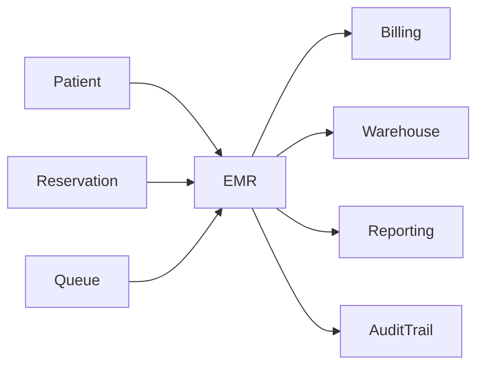

---

# 9. User Roles & Permissions

| Role | View | Create | Update | Delete | Close Visit |
|------|------|--------|--------|--------|-------------|
| Owner | ✔ | ✖ | ✖ | ✖ | ✖ |
| Clinic Manager | ✔ | ✖ | ✖ | ✖ | ✖ |
| Administrator | ✔ | ✖ | ✖ | ✖ | ✖ |
| Doctor | ✔ | ✔ | ✔ | ✖ | ✔ |
| Nurse | ✔ | ✔* | ✔* | ✖ | ✖ |
| Registration Staff | View Limited | ✖ | ✖ | ✖ | ✖ |
| Cashier | View Summary | ✖ | ✖ | ✖ | ✖ |

> **Catatan:** Nurse hanya dapat mengubah data sesuai kewenangan yang diberikan, seperti Vital Sign, penggunaan bahan medis, dan Catatan Keperawatan. Diagnosis, Assessment SOAP, serta penutupan Visit hanya dapat dilakukan oleh dokter.

---

# 10. High Level Workflow

## 10.1 Clinical Examination Flow

```text
Queue Called

↓

Patient Enter Examination Room

↓

Open Visit

↓

Record Vital Sign

↓

Clinical Examination

↓

SOAP Documentation

↓

Diagnosis

↓

Treatment Plan

↓

Procedure

↓

Prescription

↓

Update Odontogram

↓

Upload Clinical Attachment

↓

Close Visit

↓

Generate Billing
```text

---

# 11. EMR Lifecycle

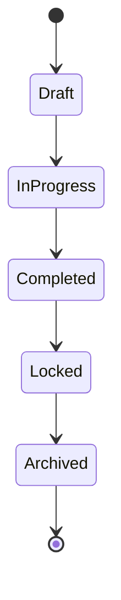

## Status Description

| Status | Description |
|---------|-------------|
| Draft | Visit telah dibuat namun pemeriksaan belum dimulai |
| In Progress | Pemeriksaan sedang berlangsung |
| Completed | Seluruh tindakan selesai dan data telah divalidasi |
| Locked | Rekam medis dikunci sehingga tidak dapat diubah tanpa otorisasi |
| Archived | Rekam medis disimpan sebagai arsip permanen |

---

# 12. Visit Lifecycle

```mermaid
flowchart LR

    Reservation --> Queue
    Queue --> Check_In["Check-In"]
    Check_In["Check-In"] --> Open_Visit["Open Visit"]
    Open_Visit["Open Visit"] --> Doctor_Examination["Doctor Examination"]
    Doctor_Examination["Doctor Examination"] --> Treatment
    Treatment --> Complete_Visit["Complete Visit"]
    Complete_Visit["Complete Visit"] --> Billing
    Billing --> Payment
```text

## 12.1 Queue Module Addendum #1 — Visit Editability After Completion (task-316–318)

Sebelum addendum ini, seluruh dokumentasi klinis (SOAP Note, Vital Sign, Diagnosis, Treatment, dan lain-lain) tidak dapat diubah begitu Visit mencapai status `Completed` — sama seperti status `Locked`/`Archived`. Addendum ini memisahkan aturan tersebut:

- Visit berstatus `Completed` kini dapat diedit kembali untuk seluruh data klinis **non-Treatment** (SOAP Note, Vital Sign, Diagnosis, Odontogram, Periodontal Assessment, Prescription, Consent, Medical Certificate, Referral, Follow-Up, Attachment). Hanya Visit berstatus `Locked` atau `Archived` yang tetap tidak dapat diubah tanpa otorisasi Administrator (lihat tabel Status Description di atas).
- Entri **Treatment** tunduk pada aturan terpisah dan lebih ketat: Treatment tidak dapat diedit/ditambah begitu Invoice terkait Visit tersebut berstatus `PAID` di Module Billing — independen dari status Visit. Artinya Treatment dapat tetap diedit pada Visit `Completed` selama Invoice-nya belum `PAID`, namun akan terkunci begitu pembayaran selesai meskipun Visit belum ditutup/dikunci.
- Pengecekan status Invoice dilakukan EMR secara read-only melalui `IInvoiceRepository` milik Module Billing (bukan sebaliknya) — konsisten dengan MOD-056 (EMR mengonsumsi integrasi Billing yang terotorisasi) dan tidak melanggar MOD-059 (EMR dilarang memutasi state Billing, bukan membacanya).

---

# 13. EMR Status Flow

```mermaid
flowchart LR

    Draft --> Waiting_Examination["Waiting Examination"]
    Waiting_Examination["Waiting Examination"] --> In_Examination["In Examination"]
    In_Examination["In Examination"] --> Treatment_Completed["Treatment Completed"]
    Treatment_Completed["Treatment Completed"] --> Ready_For_Billing["Ready For Billing"]
    Ready_For_Billing["Ready For Billing"] --> Closed
```

---

## Summary — Part 1

Part 1 mendefinisikan fondasi **Module EMR** sebagai **Core Clinical Domain** pada Parakita.

Dokumen ini menjelaskan tujuan, ruang lingkup, konsep dasar seperti **Visit**, **SOAP**, **Odontogram**, dan **Clinical Attachment**, tanggung jawab modul, hubungan dengan modul lain, hak akses pengguna, serta lifecycle rekam medis dan kunjungan pasien.

Sebagai pusat dokumentasi klinis, Module EMR menjadi penghubung utama antara proses pelayanan medis dengan modul **Queue**, **Billing**, **Warehouse**, dan **Reporting**, sekaligus memastikan seluruh rekam medis terdokumentasi secara aman, dapat diaudit, dan siap mendukung operasional klinik multi-cabang.

---


| Document Information |  |
|----------------------|----------------------------------------------|
| Project | Parakita - Dental Clinic Management System |
| Document | 15 - Module EMR |
| Part | 2 of 5 |
| Version | 1.0.0 |
| Status | Draft |
| Document Type | Module Design Specification |
| Architecture Style | Clean Architecture + Domain Driven Design + Modular Monolith |
| Last Updated | July 2026 |

---

# Table of Contents (Part 2)
14. Use Case Catalog
15. Visit Management
16. SOAP Note
17. Vital Sign
18. Medical History
19. Allergy Management
20. Clinical Examination
21. Diagnosis Management
22. Treatment Plan
23. Procedure Management
24. Prescription Management
25. Medical Certificate
26. Referral & Follow Up
---

# 14. Use Case Catalog

## 14.1 Overview

Module EMR terdiri dari sekumpulan proses klinis yang saling terintegrasi. Seluruh proses tersebut dijalankan berdasarkan satu **Visit** aktif sehingga seluruh aktivitas medis terdokumentasi secara konsisten.

---

## Use Case Matrix

| Code | Use Case | Primary Actor |
|------|-----------------------------|----------------|
| EMR-001 | Open Visit | Doctor |
| EMR-002 | Record Vital Sign | Nurse |
| EMR-003 | Record SOAP Note | Doctor |
| EMR-004 | Record Medical History | Doctor |
| EMR-005 | Record Allergy | Doctor |
| EMR-006 | Clinical Examination | Doctor |
| EMR-007 | Record Diagnosis | Doctor |
| EMR-008 | Create Treatment Plan | Doctor |
| EMR-009 | Record Procedure | Doctor |
| EMR-010 | Create Prescription | Doctor |
| EMR-011 | Upload Clinical Attachment | Doctor |
| EMR-012 | Update Odontogram | Doctor |
| EMR-013 | Issue Medical Certificate | Doctor |
| EMR-014 | Create Referral | Doctor |
| EMR-015 | Close Visit | Doctor |

---

# 15. Visit Management

## 15.1 Purpose

Visit merupakan induk seluruh aktivitas klinis yang dilakukan selama pasien menjalani pemeriksaan.

Satu Visit menghasilkan satu Electronic Medical Record.

---

## Business Rules

- Visit hanya dapat dibuat dari Queue berstatus **Called**.
- Satu Queue hanya dapat memiliki satu Visit.
- Visit harus memiliki Doctor.
- Visit harus memiliki Patient.
- Visit harus memiliki Branch.
- Visit dapat disimpan sebagai Draft.
- Visit tidak dapat dihapus setelah Completed.
- Visit yang telah Locked hanya dapat dibuka kembali oleh Administrator dengan Audit Trail.

---

## Visit Status

| Status | Description |
|---------|-------------|
| Draft | Visit dibuat |
| Waiting Examination | Menunggu pemeriksaan |
| In Progress | Pemeriksaan berlangsung |
| Completed | Pemeriksaan selesai |
| Locked | Rekam medis dikunci |
| Archived | Arsip permanen |

---

## Main Attributes

| Field | Description |
|---------|-------------|
| Visit Number | Nomor Visit |
| Visit Date | Tanggal Pemeriksaan |
| Patient | Pasien |
| Reservation | Reservasi |
| Queue | Nomor Antrian |
| Doctor | Dokter |
| Chair | Dental Chair |
| Room | Ruangan |
| Chief Complaint | Keluhan Utama |
| Visit Status | Status Visit |

---

# 16. SOAP Note

## Purpose

SOAP digunakan sebagai standar dokumentasi pemeriksaan medis.

---

## Subjective

Berisi informasi yang disampaikan pasien.

Contoh:

- Keluhan utama
- Riwayat nyeri
- Lama keluhan
- Faktor pencetus
- Riwayat pengobatan

---

## Objective

Berisi hasil observasi dokter.

Contoh:

- Pemeriksaan intra oral
- Pemeriksaan ekstra oral
- Vital Sign
- Kondisi gigi
- Hasil radiografi

---

## Assessment

Berisi analisis klinis dokter.

Contoh:

- Diagnosis utama
- Diagnosis sekunder
- Differential diagnosis
- Prognosis

---

## Plan

Berisi rencana tindakan.

Contoh:

- Scaling
- Tambal
- Cabut
- Root Canal Treatment
- Follow Up

---

## Business Rules

- SOAP wajib diisi sebelum Visit ditutup.
- Assessment hanya dapat diubah oleh Doctor.
- Plan dapat menghasilkan Treatment Plan.
- Seluruh perubahan SOAP dicatat pada Audit Trail.

---

# 17. Vital Sign

## Purpose

Mencatat kondisi fisiologis pasien sebelum tindakan.

---

## Data

| Parameter | Unit |
|-----------|------|
| Blood Pressure | mmHg |
| Heart Rate | bpm |
| Respiratory Rate | rpm |
| Temperature | °C |
| Weight | kg |
| Height | cm |
| Oxygen Saturation | % |

---

## Business Rules

- Vital Sign dapat diinput oleh Nurse.
- Doctor dapat mengubah data.
- Nilai abnormal ditandai oleh sistem.
- Riwayat Vital Sign tersimpan setiap Visit.

---

# 18. Medical History

## Purpose

Menyimpan riwayat kesehatan pasien.

---

## Categories

- Penyakit Sistemik
- Penyakit Jantung
- Diabetes
- Hipertensi
- Hepatitis
- HIV
- Gangguan Pembekuan Darah
- Riwayat Operasi
- Kehamilan
- Riwayat Rawat Inap

---

## Business Rules

- Medical History dapat diperbarui setiap Visit.
- Sistem menyimpan histori perubahan.
- Informasi digunakan sebagai Clinical Alert.

---

# 19. Allergy Management

## Purpose

Menyimpan data alergi pasien.

---

## Allergy Types

- Drug Allergy
- Food Allergy
- Latex Allergy
- Material Allergy
- Local Anesthetic
- Other

---

## Severity

| Level | Description |
|---------|-------------|
| Mild | Ringan |
| Moderate | Sedang |
| Severe | Berat |

---

## Business Rules

- Allergy muncul sebagai alert ketika Visit dibuka.
- Prescription harus divalidasi terhadap Allergy.
- Seluruh perubahan dicatat pada Audit Trail.

---

# 20. Clinical Examination

## Purpose

Mendokumentasikan hasil pemeriksaan dokter.

---

## Examination Sections

### Extra Oral Examination

- Facial Symmetry
- TMJ
- Lymph Node
- Lips

---

### Intra Oral Examination

- Gingiva
- Tongue
- Buccal Mucosa
- Palate
- Floor of Mouth

---

### Dental Examination

- Tooth Mobility
- Caries
- Fracture
- Restoration
- Missing Tooth

---

## Business Rules

- Pemeriksaan menjadi dasar Diagnosis.
- Dapat diperbarui selama Visit masih aktif.

---

# 21. Diagnosis Management

## Purpose

Menyimpan diagnosis pasien.

---

## Diagnosis Type

| Type | Description |
|------|-------------|
| Primary Diagnosis | Diagnosis utama |
| Secondary Diagnosis | Diagnosis tambahan |
| Differential Diagnosis | Diagnosis banding |

---

## Business Rules

- Diagnosis mengacu pada Master Diagnosis.
- Minimal satu Primary Diagnosis.
- Diagnosis menjadi dasar Billing dan Reporting.

---

# 22. Treatment Plan

## Purpose

Menyusun rencana tindakan medis.

---

## Treatment Information

- Treatment
- Tooth Number
- Tooth Surface
- Priority
- Estimated Cost
- Estimated Duration

---

## Business Rules

- Treatment berasal dari Master Treatment.
- Treatment dapat dilakukan pada Visit berikutnya.
- Treatment Plan dapat menghasilkan Reservation baru.

---

# 23. Procedure Management

## Purpose

Mencatat tindakan yang benar-benar dilakukan selama Visit.

---

## Recorded Information

- Treatment
- Doctor
- Assistant
- Start Time
- End Time
- Tooth
- Surface
- Material Used
- Clinical Note

---

## Business Rules

- Procedure menghasilkan Billing Item.
- Procedure menghasilkan Material Consumption.
- Procedure memperbarui Odontogram.
- Procedure dapat memiliki Attachment.

---

# 24. Prescription Management

## Purpose

Mengelola resep obat pasien.

---

## Information

| Field | Description |
|---------|-------------|
| Medicine | Obat |
| Dosage | Dosis |
| Frequency | Frekuensi |
| Duration | Lama Konsumsi |
| Instruction | Aturan Pakai |

---

## Business Rules

- Obat berasal dari Master Medicine.
- Prescription harus divalidasi terhadap Allergy.
- Resep dapat dicetak.
- Riwayat resep tersimpan permanen.

---

# 25. Medical Certificate

## Purpose

Membuat surat keterangan medis.

---

## Certificate Types

- Fit To Work
- Sick Leave
- Medical Statement
- Dental Treatment Certificate

---

## Business Rules

- Hanya Doctor yang dapat menerbitkan.
- Nomor surat dibuat otomatis.
- Seluruh dokumen disimpan sebagai Attachment.

---

# 26. Referral & Follow Up

## Referral

Dokter dapat merujuk pasien ke:

- Specialist
- Hospital
- Laboratory
- Radiology

---

## Follow Up

Dokter dapat menentukan:

- Jadwal kontrol berikutnya
- Catatan tindak lanjut
- Prioritas
- Reminder

---

## Business Rules

- Follow Up dapat membuat Reservation otomatis.
- Reminder dikirim melalui Notification Module (Future).
- Riwayat Follow Up menjadi bagian dari Clinical Timeline.

---

## Summary — Part 2

Part 2 menjelaskan seluruh proses klinis utama dalam Module EMR, mulai dari **Visit Management**, **SOAP Note**, **Vital Sign**, **Medical History**, **Allergy**, **Clinical Examination**, **Diagnosis**, **Treatment Plan**, **Procedure**, **Prescription**, hingga **Medical Certificate** dan **Follow Up**. Setiap fitur dilengkapi dengan tujuan, atribut utama, serta business rules sebagai dasar implementasi pada Application Layer dan Domain Layer.

> **Catatan Pengembangan:** Pada **Part 3** akan dibahas fitur-fitur khusus klinik gigi secara lebih mendalam, meliputi **Interactive Odontogram**, **Tooth Surface**, **Tooth Condition**, **Periodontal Chart**, **Clinical Attachment**, **Dental X-Ray**, **Clinical Photo**, **Consent Form**, serta **Clinical Timeline**, lengkap dengan state diagram dan aturan bisnis yang lebih detail.

---


# Part 3.1A — Digital Odontogram Foundation

| Document Information |  |
|----------------------|------------------------------------------------|
| Project | Parakita Dental Clinic Management System |
| Module | Electronic Medical Record (EMR) |
| Document | 15-module-emr-part-3.1.md |
| Section | Part 3.1A |
| Version | 1.0.0 |
| Status | Draft |
| Architecture | Clean Architecture + DDD + Modular Monolith |
| Technology | Express.js, TypeScript, TypeORM, MySQL, Next.js |
| Author | System Architecture Team |
| Last Update | July 2026 |

---

# Table of Contents
1. Introduction
2. Objectives
3. Scope
4. Business Overview
5. Clinical Concepts
6. Digital Odontogram Architecture
7. Module Integration
8. High Level Workflow
9. Odontogram Lifecycle
10. Tooth Lifecycle
---

# 1. Introduction

## 1.1 Overview

Digital Odontogram merupakan representasi digital dari kondisi seluruh gigi pasien yang menjadi bagian utama dari Electronic Medical Record (EMR).

Odontogram digunakan oleh dokter gigi untuk mendokumentasikan kondisi setiap gigi, permukaan gigi, tindakan yang telah dilakukan, serta perubahan kondisi gigi sepanjang riwayat kunjungan pasien.

Tidak seperti gambar statis, Digital Odontogram pada Parakita bersifat **interactive**, **versioned**, **auditable**, serta menjadi bagian permanen dari rekam medis pasien.

Seluruh perubahan kondisi gigi akan disimpan sebagai histori sehingga perkembangan kondisi pasien dapat dilihat kembali kapan saja.

---

## 1.2 Background

Pada praktik kedokteran gigi modern, pencatatan kondisi gigi secara manual sudah tidak lagi memadai karena memiliki beberapa keterbatasan:

- Sulit melakukan pencarian histori.
- Tidak memiliki audit trail.
- Sulit dibandingkan antar kunjungan.
- Sulit diintegrasikan dengan Billing.
- Sulit diintegrasikan dengan Treatment Plan.
- Tidak mendukung analisis perkembangan pasien.

Digital Odontogram mengatasi seluruh keterbatasan tersebut dengan menyediakan representasi digital yang terstruktur.

---

## 1.3 Design Principles

Digital Odontogram dibangun berdasarkan prinsip berikut:

- Patient Oriented
- Version Controlled
- Immutable History
- Interactive UI
- Audit Ready
- API First
- Event Driven
- Multi Branch Ready
- High Performance
- Extensible Design

---

# 2. Objectives

Digital Odontogram memiliki tujuan utama sebagai berikut.

## Clinical Objectives

- Mendokumentasikan kondisi seluruh gigi pasien.
- Menjadi dasar diagnosis dokter.
- Menjadi dasar treatment planning.
- Menjadi dasar evaluasi hasil perawatan.
- Menjadi riwayat permanen kondisi gigi pasien.

---

## Business Objectives

- Mengurangi pencatatan manual.
- Mempercepat pemeriksaan dokter.
- Mendukung Billing otomatis.
- Mendukung Warehouse Integration.
- Mendukung Clinical Reporting.

---

## Technical Objectives

- Mendukung Interactive UI.
- Mendukung REST API.
- Mendukung Mobile Application.
- Mendukung Audit Trail.
- Mendukung Future AI Diagnosis.

---

# 3. Scope

## Included

Digital Odontogram mencakup:

- Tooth
- Tooth Surface
- Tooth Condition
- Tooth Status
- Tooth History
- Tooth Version
- Existing Restoration
- Planned Treatment
- Completed Treatment
- Clinical Annotation

---

## Excluded

Dokumen ini tidak membahas:

- SOAP Note
- Diagnosis
- Prescription
- Billing
- Queue
- Reservation
- Authentication

Seluruh modul tersebut dibahas pada dokumen lainnya.

---

# 4. Business Overview

## Position Inside EMR

```text
Patient

↓

Reservation

↓

Queue

↓

Visit

↓

Electronic Medical Record

↓

Digital Odontogram

↓

Treatment Plan

↓

Billing

↓

Reporting
```sql

Digital Odontogram hanya dapat diakses ketika Visit aktif.

---

## Clinical Flow

```text
Patient Examination

↓

Clinical Assessment

↓

Select Tooth

↓

Select Surface

↓

Select Condition

↓

Save

↓

Update Timeline

↓

Generate Audit

↓

Update EMR
```

---

# 5. Clinical Concepts

Digital Odontogram dibangun berdasarkan beberapa konsep utama.

---

## 5.1 Tooth

Merepresentasikan satu gigi berdasarkan standar FDI.

Contoh:

- 11
- 12
- 13
- 36
- 48

---

## 5.2 Tooth Surface

Setiap gigi memiliki beberapa permukaan.

Contoh:

- Occlusal
- Mesial
- Distal
- Buccal
- Lingual

Surface digunakan untuk:

- Caries
- Filling
- Crown
- Sealant
- Fracture

---

## 5.3 Tooth Condition

Menyimpan kondisi klinis gigi.

Contoh:

- Healthy
- Caries
- Missing
- Filled
- Implant
- Crown
- Mobility

---

## 5.4 Tooth History

Setiap perubahan kondisi tidak akan mengganti data lama.

Contoh:

```text
2025

Healthy

↓

2026

Occlusal Caries

↓

Composite Filling

↓

Root Canal Treatment

↓

Crown
```text

---

## 5.5 Tooth Version

Setiap Visit menghasilkan snapshot odontogram baru.

```text
Visit 1

↓

Version 1

↓

Visit 2

↓

Version 2

↓

Visit 3

↓

Version 3
```

Version sebelumnya tetap tersedia.

---

# 6. Digital Odontogram Architecture

```text
                Patient
                   │
                   ▼
               Visit (EMR)
                   │
                   ▼
          Digital Odontogram
                   │
     ┌─────────────┼──────────────┐
     ▼             ▼              ▼
 Tooth         Tooth Surface   Tooth History
     │             │              │
     └─────────────┼──────────────┘
                   ▼
            Treatment Plan
                   │
         ┌─────────┴──────────┐
         ▼                    ▼
     Billing             Clinical Report
```text

---

## Component Description

| Component | Responsibility |
|------------|----------------|
| Tooth | Identitas setiap gigi |
| Surface | Permukaan gigi |
| Condition | Kondisi klinis |
| History | Riwayat perubahan |
| Version | Snapshot setiap Visit |
| Timeline | Aktivitas klinis |
| Audit | Jejak perubahan |

---

# 7. Module Integration

Digital Odontogram terintegrasi dengan beberapa modul.

| Module | Integration |
|----------|------------|
| Patient | Owner EMR |
| Reservation | Visit Source |
| Queue | Pemeriksaan |
| EMR | Parent Module |
| Treatment | Clinical Action |
| Billing | Generate Billing Item |
| Warehouse | Material Consumption |
| Reporting | Clinical Report |
| Audit | Activity Logging |

---

## Integration Diagram

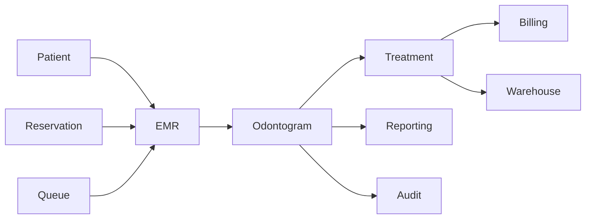

---

# 8. High Level Workflow

```text
Doctor Login

↓

Open Visit

↓

Open Odontogram

↓

Select Tooth

↓

Select Surface

↓

Input Condition

↓

Save

↓

Update Timeline

↓

Update History

↓

Update Version

↓

Audit Trail

↓

Finish
```text

---

# 9. Odontogram Lifecycle

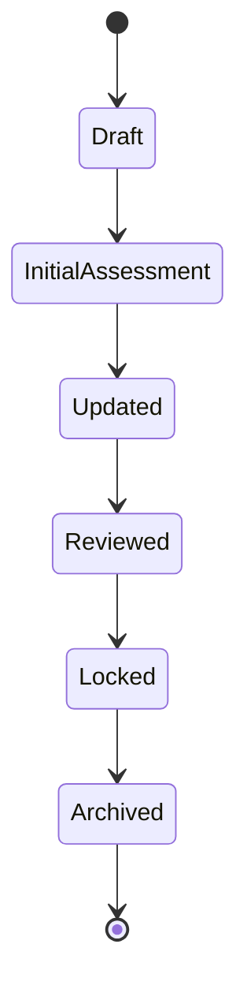

---

## Status Description

| Status | Description |
|----------|-------------|
| Draft | Belum dilakukan pemeriksaan |
| Initial Assessment | Pemeriksaan awal |
| Updated | Ada perubahan kondisi |
| Reviewed | Sudah diverifikasi dokter |
| Locked | Tidak dapat diubah |
| Archived | Riwayat permanen |

---

## Business Rules

- Setiap Visit menghasilkan satu versi odontogram.
- Odontogram yang telah **Locked** tidak boleh diubah.
- Revisi setelah **Locked** harus menghasilkan versi baru.
- Seluruh perubahan wajib dicatat pada Audit Trail.

---

# 10. Tooth Lifecycle

Setiap gigi memiliki siklus perubahan kondisi.

```mermaid
stateDiagram-v2

Healthy --> EarlyCaries

EarlyCaries --> DeepCaries

DeepCaries --> Pulpitis

Pulpitis --> RootCanalTreatment

RootCanalTreatment --> Crown

Healthy --> Extraction

Extraction --> Implant

Extraction --> Bridge

Implant --> Crown
```text

---

## Lifecycle Rules

- Healthy merupakan kondisi awal.
- Caries dapat berkembang menjadi Deep Caries.
- Setelah Root Canal Treatment, dokter dapat memasang Crown.
- Tooth yang dicabut tidak dapat kembali menjadi Healthy.
- Implant hanya dapat dilakukan pada Tooth yang telah diekstraksi.
- Seluruh transisi harus memiliki catatan klinis dan referensi Visit.

---

# Summary

Bagian **3.1A** mendefinisikan fondasi **Digital Odontogram** sebagai bagian inti dari Electronic Medical Record (EMR) Parakita. Dokumen ini menjelaskan tujuan, ruang lingkup, konsep klinis, arsitektur, integrasi modul, alur kerja tingkat tinggi, lifecycle odontogram, serta lifecycle setiap gigi. Seluruh desain berorientasi pada rekam medis yang **versioned**, **immutable**, **auditable**, dan siap diimplementasikan menggunakan pendekatan **Clean Architecture**, **Domain-Driven Design (DDD)**, dan **Modular Monolith**.

> **Lanjutan pada Part 3.1B:** FDI Tooth Numbering, Dental Quadrant, Tooth Anatomy, Tooth Surface Matrix, dan aturan pemetaan permukaan gigi sebagai dasar implementasi Interactive Odontogram.

# 15 - Module EMR

# Part 3.1B — FDI Tooth Numbering & Tooth Surface Model

| Document Information |  |
|----------------------|------------------------------------------------|
| Project | Parakita Dental Clinic Management System |
| Module | Electronic Medical Record (EMR) |
| Document | 15-module-emr-part-3.1.md |
| Section | Part 3.1B |
| Version | 1.0.0 |
| Status | Draft |

---

# Table of Contents
11. FDI Tooth Numbering
12. Dental Quadrant
13. Permanent Dentition
14. Primary Dentition
15. Tooth Anatomy
16. Tooth Surface
17. Tooth Surface Matrix
18. Surface Combination
19. Clinical Mapping Rules
20. Validation Rules
---

# 11. FDI Tooth Numbering

## 11.1 Overview

Parakita menggunakan standar **FDI World Dental Federation** sebagai standar penomoran gigi.

Standar ini digunakan secara internasional oleh rumah sakit, klinik gigi, universitas, serta organisasi kedokteran gigi sehingga memudahkan interoperabilitas data.

Seluruh modul EMR menggunakan nomor FDI sebagai identitas utama setiap gigi.

---

## Objectives

- Standardisasi pencatatan gigi.
- Mempermudah komunikasi antar dokter.
- Mendukung interoperabilitas sistem.
- Menjadi referensi seluruh tindakan klinis.
- Menjadi foreign key pada seluruh tabel odontogram.

---

## Number Structure

Nomor FDI terdiri dari dua digit.

```
Quadrant + Tooth Number
```text

Contoh

| FDI | Description |
|------|-------------|
| 11 | Upper Right Central Incisor |
| 16 | Upper Right First Molar |
| 21 | Upper Left Central Incisor |
| 36 | Lower Left First Molar |
| 48 | Lower Right Third Molar |

---

# 12. Dental Quadrant

Mulut dibagi menjadi empat quadrant.

```
Permanent Dentition

          MAXILLA

18 17 16 15 14 13 12 11

21 22 23 24 25 26 27 28

-----------------------------

48 47 46 45 44 43 42 41

31 32 33 34 35 36 37 38

          MANDIBLE
```text

---

## Quadrant Description

| Quadrant | Description |
|-----------|-------------|
| 1 | Upper Right |
| 2 | Upper Left |
| 3 | Lower Left |
| 4 | Lower Right |

---

## Business Rules

- Nomor quadrant tidak boleh berubah.
- Satu gigi hanya berada pada satu quadrant.
- Tooth Number unik dalam satu pasien.

---

# 13. Permanent Dentition

## Overview

Permanent Dentition terdiri dari **32 gigi permanen**.

---

## Upper Right (Quadrant 1)

| Tooth | Name |
|---------|-----------------------------|
| 18 | Third Molar |
| 17 | Second Molar |
| 16 | First Molar |
| 15 | Second Premolar |
| 14 | First Premolar |
| 13 | Canine |
| 12 | Lateral Incisor |
| 11 | Central Incisor |

---

## Upper Left (Quadrant 2)

| Tooth | Name |
|---------|-----------------------------|
| 21 | Central Incisor |
| 22 | Lateral Incisor |
| 23 | Canine |
| 24 | First Premolar |
| 25 | Second Premolar |
| 26 | First Molar |
| 27 | Second Molar |
| 28 | Third Molar |

---

## Lower Left (Quadrant 3)

| Tooth | Name |
|---------|-----------------------------|
| 31 | Central Incisor |
| 32 | Lateral Incisor |
| 33 | Canine |
| 34 | First Premolar |
| 35 | Second Premolar |
| 36 | First Molar |
| 37 | Second Molar |
| 38 | Third Molar |

---

## Lower Right (Quadrant 4)

| Tooth | Name |
|---------|-----------------------------|
| 41 | Central Incisor |
| 42 | Lateral Incisor |
| 43 | Canine |
| 44 | First Premolar |
| 45 | Second Premolar |
| 46 | First Molar |
| 47 | Second Molar |
| 48 | Third Molar |

---

# 14. Primary Dentition

Primary Dentition terdiri dari **20 gigi susu**.

---

## Upper Right

51 52 53 54 55

---

## Upper Left

61 62 63 64 65

---

## Lower Left

71 72 73 74 75

---

## Lower Right

81 82 83 84 85

---

## Business Rules

- Primary Tooth tidak boleh dicampur dengan Permanent Tooth.
- Sistem harus mendukung mixed dentition.
- Setiap Visit menentukan tipe dentition pasien.

---

# 15. Tooth Anatomy

## Major Structure

Setiap gigi terdiri dari beberapa struktur.

```
Enamel

↓

Dentin

↓

Pulp

↓

Root Canal

↓

Root
```text

---

## Tooth Classification

| Type | Description |
|------|-------------|
| Incisor | Pemotong |
| Canine | Taring |
| Premolar | Geraham kecil |
| Molar | Geraham besar |

---

## Tooth Component

- Crown
- Neck
- Root
- Root Canal
- Enamel
- Dentin
- Cementum
- Pulp Chamber

---

# 16. Tooth Surface

## Overview

Setiap gigi memiliki lima permukaan utama.

| Code | Surface |
|------|----------|
| M | Mesial |
| D | Distal |
| B | Buccal |
| L | Lingual |
| O/I | Occlusal / Incisal |

---

## Surface Diagram

```
          Buccal

             ▲

Mesial ◄  O  ► Distal

             ▼

         Lingual
```text

---

## Surface Description

### Mesial

Permukaan yang menghadap garis tengah wajah.

---

### Distal

Permukaan yang menjauhi garis tengah wajah.

---

### Buccal

Permukaan menghadap pipi.

---

### Lingual

Permukaan menghadap lidah.

---

### Occlusal

Permukaan kunyah.

Untuk gigi depan digunakan istilah **Incisal**.

---

# 17. Tooth Surface Matrix

Seluruh permukaan disimpan secara independen.

| Tooth | M | D | B | L | O/I |
|---------|---|---|---|---|-----|
| 11 |  |  |  |  |  |
| 12 |  |  |  |  |  |
| 13 |  |  |  |  |  |
| 14 |  |  |  |  |  |
| 15 |  |  |  |  |  |
| 16 |  |  |  |  |  |
| 17 |  |  |  |  |  |
| 18 |  |  |  |  |  |
| 21 |  |  |  |  |  |
| 22 |  |  |  |  |  |
| 23 |  |  |  |  |  |
| 24 |  |  |  |  |  |
| 25 |  |  |  |  |  |
| 26 |  |  |  |  |  |
| 27 |  |  |  |  |  |
| 28 |  |  |  |  |  |
| 31 |  |  |  |  |  |
| 32 |  |  |  |  |  |
| 33 |  |  |  |  |  |
| 34 |  |  |  |  |  |
| 35 |  |  |  |  |  |
| 36 |  |  |  |  |  |
| 37 |  |  |  |  |  |
| 38 |  |  |  |  |  |
| 41 |  |  |  |  |  |
| 42 |  |  |  |  |  |
| 43 |  |  |  |  |  |
| 44 |  |  |  |  |  |
| 45 |  |  |  |  |  |
| 46 |  |  |  |  |  |
| 47 |  |  |  |  |  |
| 48 |  |  |  |  |  |

---

## Database Representation

Contoh tabel relasi.

| Field | Example |
|---------|----------|
| Tooth | 16 |
| Surface | O |
| Condition | Caries |
| Visit | VIS240001 |

---

# 18. Surface Combination

Satu tindakan dapat melibatkan lebih dari satu surface.

---

## Examples

### Single Surface

```
16 O
```text

Composite Filling pada permukaan Occlusal.

---

### Double Surface

```
16 MO
```text

Mesial + Occlusal.

---

### Triple Surface

```
16 MOD
```text

Mesial + Occlusal + Distal.

---

### Four Surface

```
16 MODB
```text

---

### Five Surface

```
16 MODBL
```text

---

## Business Rules

- Surface Combination tidak boleh duplikat.
- Urutan surface mengikuti standar klinis.
- Combination digunakan pada Billing.

---

# 19. Clinical Mapping Rules

## Diagnosis

Diagnosis dapat dilakukan pada:

- Tooth
- Surface

---

## Treatment

Treatment dapat dilakukan pada:

- Satu Tooth
- Banyak Tooth
- Satu Surface
- Banyak Surface

---

## Attachment

Foto klinis dapat dikaitkan dengan:

- Tooth
- Surface
- Procedure

---

## Timeline

Timeline mencatat:

- Tooth
- Surface
- Condition
- Visit
- Doctor

---

# 20. Validation Rules

## Tooth Validation

- Nomor FDI harus valid.
- Tooth tidak boleh berada di luar quadrant.
- Tooth tidak boleh duplikat dalam satu Visit.

---

## Surface Validation

- Surface harus sesuai tipe gigi.
- Combination tidak boleh kosong.
- Surface harus unik.

---

## Clinical Validation

- Procedure wajib memiliki Tooth.
- Filling wajib memiliki Surface.
- Crown tidak memerlukan Surface.
- Extraction hanya dapat dilakukan pada satu Tooth.
- Implant hanya dapat dilakukan pada Tooth yang telah diekstraksi.

---

## Database Validation

- Tooth menggunakan foreign key ke Master Tooth.
- Surface menggunakan lookup table.
- History tidak boleh dihapus.
- Seluruh perubahan dicatat pada Audit Trail.

---

# Summary

Part **3.1B** mendefinisikan standar identifikasi gigi menggunakan **FDI Tooth Numbering**, pembagian **Dental Quadrant**, klasifikasi **Permanent** dan **Primary Dentition**, anatomi dasar gigi, serta model **Tooth Surface** yang menjadi fondasi Digital Odontogram. Dokumen ini juga menetapkan aturan kombinasi permukaan (misalnya **MO**, **MOD**, **MODBL**) beserta validasi klinis dan database, sehingga seluruh tindakan seperti diagnosis, restorasi, pencabutan, maupun pencatatan histori dapat direpresentasikan secara konsisten di seluruh modul EMR.

# 15 - Module EMR

# Part 3.1C — Tooth Condition Model & Odontogram Versioning

| Document Information |  |
|----------------------|------------------------------------------------|
| Project | Parakita Dental Clinic Management System |
| Module | Electronic Medical Record (EMR) |
| Document | 15-module-emr-part-3.1.md |
| Section | Part 3.1C |
| Version | 1.0.0 |
| Status | Draft |

---

# Table of Contents
21. Tooth Condition Catalog
22. Tooth State Machine
23. Clinical State Transition
24. Tooth Versioning
25. Odontogram History
26. Clinical Annotation
27. Clinical Color Standard
28. Business Rules
29. Validation Rules
30. Audit Requirements
---

# 21. Tooth Condition Catalog

## 21.1 Overview

Tooth Condition merupakan representasi kondisi klinis setiap gigi yang dicatat selama pemeriksaan.

Satu gigi dapat memiliki lebih dari satu kondisi secara bersamaan.

Contoh:

- Filling + Crown
- Implant + Healthy Gingiva
- Root Canal + Crown
- Caries + Mobility

Seluruh kondisi bersifat historis dan tidak menggantikan data sebelumnya.

---

## 21.2 Condition Category

| Category | Description |
|----------|-------------|
| Healthy | Kondisi normal |
| Disease | Penyakit atau kelainan |
| Restoration | Restorasi |
| Prosthodontic | Gigi tiruan |
| Endodontic | Perawatan saluran akar |
| Surgical | Tindakan bedah |
| Orthodontic | Perawatan ortodonti |
| Implantology | Implan |

---

## 21.3 Standard Tooth Conditions

### Healthy

Tidak ditemukan kelainan.

---

### Initial Caries

Karies tahap awal.

---

### Deep Caries

Karies mencapai dentin.

---

### Pulpitis

Peradangan pulpa.

---

### Necrotic Pulp

Pulpa nekrosis.

---

### Root Residue

Sisa akar.

---

### Missing Tooth

Gigi hilang.

---

### Fracture

Fraktur mahkota atau akar.

---

### Crack Tooth

Retak gigi.

---

### Abrasion

Keausan mekanis.

---

### Attrition

Keausan fisiologis.

---

### Erosion

Kerusakan akibat bahan kimia.

---

### Composite Filling

Tambalan resin komposit.

---

### Glass Ionomer Cement

Tambalan GIC.

---

### Amalgam Filling

Tambalan amalgam.

---

### Temporary Filling

Tambalan sementara.

---

### Root Canal Treatment

Perawatan saluran akar.

---

### Crown

Mahkota gigi.

---

### Bridge

Jembatan gigi.

---

### Implant

Implan gigi.

---

### Extraction

Gigi telah dicabut.

---

### Mobility

Gigi goyang.

---

### Impacted Tooth

Gigi impaksi.

---

### Unerupted Tooth

Belum erupsi.

---

### Sealant

Pit & fissure sealant.

---

### Periapical Lesion

Kelainan jaringan periapikal.

---

# 22. Tooth State Machine

Setiap Tooth memiliki state machine yang menggambarkan perubahan kondisi klinis.

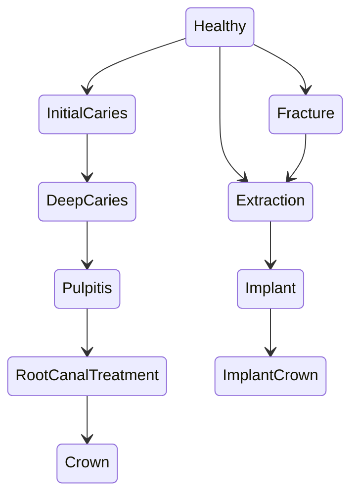

---

## Allowed Transition

| Current | Next |
|----------|------|
| Healthy | Initial Caries |
| Healthy | Fracture |
| Healthy | Extraction |
| Initial Caries | Deep Caries |
| Deep Caries | RCT |
| RCT | Crown |
| Extraction | Implant |
| Implant | Implant Crown |

---

## Invalid Transition

Tidak diperbolehkan:

- Implant → Healthy
- Crown → Healthy
- Extraction → Caries
- Missing → Healthy

Perubahan tersebut harus dibuat sebagai **version baru**, bukan mengganti histori.

---

# 23. Clinical State Transition

## Treatment Progress

```text
Healthy

↓

Initial Caries

↓

Deep Caries

↓

Temporary Filling

↓

Root Canal Treatment

↓

Post Core

↓

Permanent Crown

↓

Follow Up
```text

---

## Extraction Workflow

```text
Healthy

↓

Mobility

↓

Extraction

↓

Healing

↓

Bone Graft

↓

Implant

↓

Healing Abutment

↓

Final Crown
```

---

## Restorative Workflow

```text
Healthy

↓

Occlusal Caries

↓

Preparation

↓

Etching

↓

Bonding

↓

Composite Filling

↓

Polishing
```text

---

# 24. Tooth Versioning

## Overview

Odontogram tidak pernah diperbarui secara langsung (overwrite).

Setiap perubahan menghasilkan versi baru.

---

## Version Example

```text
Patient

↓

Visit 1

↓

Version 1

Healthy

↓

Visit 2

↓

Version 2

Occlusal Caries

↓

Visit 3

↓

Version 3

Composite Filling

↓

Visit 4

↓

Version 4

RCT + Crown
```

---

## Version Rules

- Satu Visit menghasilkan satu versi.
- Version bersifat immutable.
- Tidak boleh menghapus versi lama.
- Seluruh histori harus tersedia.

---

## Database Example

| Version | Visit | Tooth | Condition |
|----------|-------|--------|-----------|
| 1 | VIS001 | 16 | Healthy |
| 2 | VIS015 | 16 | Occlusal Caries |
| 3 | VIS018 | 16 | Composite Filling |
| 4 | VIS023 | 16 | RCT + Crown |

---

# 25. Odontogram History

## History Timeline

```text
Tooth 16

2024
Healthy

↓

2025
Occlusal Caries

↓

Composite Filling

↓

Secondary Caries

↓

RCT

↓

Porcelain Crown

↓

Annual Recall
```text

---

## History Components

Setiap histori menyimpan:

- Visit
- Doctor
- Tooth
- Surface
- Diagnosis
- Procedure
- Material
- Clinical Note
- Attachment
- Timestamp

---

## Business Rules

- History tidak boleh dihapus.
- History dapat difilter berdasarkan Visit.
- History dapat difilter berdasarkan Tooth.
- History menjadi bagian permanen EMR.

---

# 26. Clinical Annotation

Dokter dapat memberikan anotasi pada setiap Tooth.

---

## Annotation Types

- Clinical Note
- Recommendation
- Observation
- Reminder
- Follow Up

---

## Example

```text
Tooth 36

Composite mulai mengalami marginal leakage.

Evaluasi kembali 6 bulan.
```

---

## Attachment Support

Annotation dapat memiliki:

- Foto
- X-Ray
- PDF
- Video
- Voice Note (Future)

---

# 27. Clinical Color Standard

Agar tampilan Odontogram konsisten, setiap kondisi menggunakan warna standar.

| Condition | Color |
|-----------|--------|
| Healthy | Green |
| Caries | Red |
| Filled | Blue |
| Temporary Filling | Yellow |
| RCT | Purple |
| Crown | Gold |
| Implant | Silver |
| Extraction | Gray |
| Fracture | Orange |
| Mobility | Brown |

---

## UI Rules

- Warna harus konsisten pada seluruh aplikasi.
- Warna dapat dikustomisasi melalui Master Configuration.
- Warna tidak boleh digunakan sebagai satu-satunya indikator; ikon dan tooltip tetap ditampilkan untuk mendukung aksesibilitas.

---

# 28. Business Rules

## Tooth

- Tooth wajib menggunakan nomor FDI.
- Tooth tidak boleh diduplikasi dalam satu versi odontogram.

---

## Condition

- Minimal satu kondisi aktif.
- Satu kondisi dapat diterapkan pada banyak Tooth.
- Condition harus berasal dari Master Tooth Condition.

---

## Version

- Tidak boleh overwrite.
- Harus immutable.
- Wajib memiliki Visit.
- Wajib memiliki Audit.

---

## History

- History tidak boleh dihapus.
- History dapat dipulihkan.
- History menjadi bagian legal medical record.

---

# 29. Validation Rules

## Clinical Validation

- Filling wajib memiliki Surface.
- Crown tidak membutuhkan Surface.
- Implant hanya boleh pada Tooth yang telah diekstraksi.
- Root Canal hanya dapat dilakukan pada Tooth yang masih ada.

---

## System Validation

- Version harus berurutan.
- Timestamp tidak boleh mundur.
- Doctor wajib terdaftar.
- Visit harus berstatus **Open**.

---

# 30. Audit Requirements

Seluruh perubahan wajib dicatat.

---

## Audit Information

| Field | Description |
|---------|-------------|
| Audit ID | UUID |
| Visit ID | Visit |
| Patient ID | Patient |
| Tooth | FDI Number |
| Surface | Surface |
| Condition | Condition |
| Old Value | Previous State |
| New Value | Current State |
| Changed By | Doctor/User |
| Changed At | Timestamp |

---

## Audit Flow

```text
Doctor Update

↓

Validation

↓

Save Version

↓

Save History

↓

Generate Audit

↓

Publish Domain Event

↓

Refresh Odontogram
```text

---

## Domain Events

Setiap perubahan odontogram akan menghasilkan domain event.

Contoh:

- ToothConditionCreated
- ToothConditionUpdated
- ToothSurfaceUpdated
- OdontogramVersionCreated
- ClinicalAnnotationAdded
- ToothHistoryRecorded

Domain event digunakan untuk sinkronisasi dengan modul lain seperti **Billing**, **Reporting**, **Notification**, dan **Audit**.

---

# Summary

Part **3.1C** mendefinisikan model kondisi gigi (Tooth Condition Model) beserta **State Machine**, aturan transisi klinis, mekanisme **Versioning**, **History**, dan **Audit**. Dengan pendekatan **immutable versioning**, setiap perubahan kondisi gigi menghasilkan versi baru tanpa menghapus histori sebelumnya, sehingga seluruh perjalanan klinis pasien terdokumentasi secara lengkap, dapat diaudit, dan memenuhi kebutuhan rekam medis elektronik modern. Seluruh perubahan juga dipublikasikan sebagai **Domain Events** untuk mendukung integrasi antar modul dalam arsitektur Clean Architecture dan Domain-Driven Design.


# 15 - Module EMR

# Part 3.1D — Interactive Odontogram Design & Domain Model

| Document Information |  |
|----------------------|------------------------------------------------|
| Project | Parakita Dental Clinic Management System |
| Module | Electronic Medical Record (EMR) |
| Document | 15-module-emr-part-3.1.md |
| Section | Part 3.1D |
| Version | 1.0.0 |
| Status | Draft |

---

# Table of Contents
31. Interactive Odontogram
32. User Interaction Flow
33. Domain Model
34. Aggregate Design
35. Entity Relationship
36. Repository Design
37. Service Design
38. Domain Event
39. Acceptance Criteria
40. Future Enhancement
---

# 31. Interactive Odontogram

## 31.1 Overview

Interactive Odontogram merupakan antarmuka utama dokter gigi untuk melakukan pencatatan kondisi gigi secara visual. Seluruh interaksi dilakukan secara langsung terhadap representasi grafis setiap gigi sehingga proses dokumentasi menjadi lebih cepat, akurat, dan mudah dipahami.

Berbeda dengan odontogram statis, setiap perubahan pada Interactive Odontogram akan langsung memperbarui data klinis, histori, timeline, serta audit trail.

---

## Objectives

- Mempermudah pemeriksaan dokter.
- Mengurangi kesalahan input.
- Mendukung visualisasi kondisi gigi.
- Mendukung multi-surface editing.
- Mendukung histori perubahan.
- Mendukung touch screen.
- Mendukung tablet dan desktop.

---

## UI Components

| Component | Description |
|-----------|-------------|
| Tooth SVG | Representasi visual gigi |
| Surface Overlay | Area klik setiap surface |
| Condition Badge | Status klinis |
| Color Legend | Warna kondisi |
| Tooltip | Informasi singkat |
| Context Menu | Pilihan tindakan |
| Timeline Panel | Riwayat perubahan |
| Clinical Note Panel | Catatan dokter |

---

## High Level UI

```text
+--------------------------------------------------------------+

             DIGITAL ODONTOGRAM

18 17 16 15 14 13 12 11

21 22 23 24 25 26 27 28

--------------------------------------------------------------

48 47 46 45 44 43 42 41

31 32 33 34 35 36 37 38

--------------------------------------------------------------

Selected Tooth : 16

Surface : Occlusal

Condition : Composite Filling

Doctor : drg. ...

Visit : VIS240001

+--------------------------------------------------------------+
```

---

# 32. User Interaction Flow

## Tooth Selection

```text
Open Visit

↓

Open Odontogram

↓

Click Tooth

↓

Highlight Tooth

↓

Display Detail Panel

↓

Select Surface

↓

Select Condition

↓

Save
```text

---

## Surface Editing

```text
Click Tooth

↓

Click Surface

↓

Choose Condition

↓

Input Clinical Note

↓

Save

↓

Update Timeline
```

---

## Multi Tooth Procedure

```text
Select Tooth 16

↓

Select Tooth 26

↓

Procedure

↓

Scaling

↓

Save
```text

---

## Right Click Context Menu

Dokter dapat melakukan klik kanan pada Tooth.

Contoh menu:

- Add Condition
- Add Restoration
- Add Crown
- Extraction
- Implant
- Clinical Note
- View History
- Upload Photo
- Upload X-Ray

---

## Keyboard Shortcut

| Shortcut | Action |
|----------|--------|
| Ctrl + Z | Undo |
| Ctrl + Y | Redo |
| Ctrl + S | Save |
| Esc | Cancel |
| Delete | Remove Unsaved Selection |

---

# 33. Domain Model

## Overview

Digital Odontogram dibangun menggunakan pendekatan **Domain-Driven Design (DDD)**.

---

## Aggregate

```text
Odontogram

│

├── Tooth

├── ToothSurface

├── ToothCondition

├── ToothHistory

├── ToothAnnotation

└── OdontogramVersion
```

Odontogram menjadi **Aggregate Root**.

---

## Aggregate Responsibility

Odontogram bertanggung jawab terhadap:

- Konsistensi data.
- Validasi.
- Versioning.
- Audit.
- Domain Event.

Seluruh perubahan Tooth dilakukan melalui Aggregate Root.

---

## Domain Model

```mermaid
classDiagram

class Odontogram{

+UUID id

+UUID patientId

+UUID visitId

+Version version

+Status status

}

class Tooth{

+FDI number

+Quadrant

}

class ToothSurface{

+SurfaceCode

}

class ToothCondition{

+Condition

}

class ToothHistory{

+CreatedAt

}

Odontogram "1" --> "*" Tooth

Tooth "1" --> "*" ToothSurface

Tooth "1" --> "*" ToothCondition

Tooth "1" --> "*" ToothHistory
```text

---

# 34. Aggregate Design

## Aggregate Root

Odontogram

---

## Child Entity

- Tooth
- Tooth Surface
- Tooth Condition
- Tooth History
- Annotation
- Version

---

## Value Object

- Tooth Number
- Surface Code
- Clinical Color
- Diagnosis Code
- Timestamp

---

## Domain Rules

- Tooth tidak dapat dibuat di luar Odontogram.
- Surface tidak boleh berdiri sendiri.
- History hanya dibuat melalui Aggregate.
- Version dibuat otomatis.

---

# 35. Entity Relationship

## Entity Overview

```text
Patient

│

└── Visit

│

└── Odontogram

│

├── Tooth

│

├── Tooth Surface

│

├── Tooth Condition

│

├── History

│

├── Annotation

│

└── Version
```

---

## Suggested Database Tables

| Table | Description |
|---------|-------------|
| emr_odontograms | Master odontogram |
| emr_odontogram_versions | Snapshot setiap visit |
| emr_teeth | Master tooth |
| emr_tooth_surfaces | Surface |
| emr_tooth_conditions | Condition |
| emr_tooth_histories | History |
| emr_tooth_annotations | Clinical note |

---

## Primary Key

Semua tabel menggunakan UUID.

---

## Foreign Key

```text
Patient

↓

Visit

↓

Odontogram

↓

Version

↓

Tooth

↓

Surface

↓

Condition
```typescript

---

# 36. Repository Design

## Repository Interface

```typescript
interface IOdontogramRepository {

create();

findByVisit();

findLatest();

findVersion();

save();

update();

archive();

}
```

---

## Tooth Repository

```typescript
interface IToothRepository {

findByFDI();

findByVisit();

saveCondition();

saveSurface();

findHistory();

}
```typescript

---

## Version Repository

```typescript
interface IOdontogramVersionRepository {

createVersion();

findLatestVersion();

findAllVersions();

}
```

---

# 37. Service Design

## Odontogram Service

```typescript
class OdontogramService
```text

Responsibilities:

- Create Odontogram
- Update Tooth
- Update Surface
- Create Version
- Generate Timeline
- Generate Audit

---

## Tooth Service

Responsibilities:

- Validation
- Clinical Rule
- State Transition
- Surface Rule

---

## History Service

Responsibilities:

- Store History
- Retrieve Timeline
- Restore Version

---

# 38. Domain Event

Setiap perubahan menghasilkan Domain Event.

---

## Events

```text
OdontogramCreated

↓

ToothSelected

↓

SurfaceUpdated

↓

ConditionAdded

↓

VersionCreated

↓

HistoryRecorded

↓

AuditGenerated
```

---

## Event Payload

```json
{
  "eventId": "UUID",
  "eventName": "ToothConditionUpdated",
  "patientId": "UUID",
  "visitId": "UUID",
  "tooth": "16",
  "surface": "O",
  "condition": "Composite Filling",
  "doctorId": "UUID",
  "occurredAt": "2026-07-31T09:15:00Z"
}
```text

---

## Integration

Event dapat digunakan oleh:

- Billing Module
- Warehouse Module
- Reporting Module
- Notification Module
- Audit Module

---

# 39. Acceptance Criteria

## Functional

- Dokter dapat memilih Tooth.
- Dokter dapat memilih Surface.
- Dokter dapat menyimpan Condition.
- History tersimpan otomatis.
- Version dibuat otomatis.
- Timeline diperbarui otomatis.
- Audit tercatat otomatis.

---

## Non Functional

- Response < 200 ms untuk update satu Tooth.
- Mendukung minimal 100 concurrent user.
- Tidak kehilangan histori.
- Mendukung rollback melalui versioning.
- Mendukung audit penuh.

---

## Security

- Hanya Doctor dan Admin yang dapat mengubah Odontogram.
- Perubahan memerlukan Visit aktif.
- Seluruh perubahan dicatat beserta identitas pengguna.

---

# 40. Future Enhancement

Roadmap pengembangan Interactive Odontogram.

---

## Phase 2

- Drag & Drop Procedure.
- Multi Tooth Selection.
- Bulk Update.
- Favorite Procedure.
- Smart Clinical Template.

---

## Phase 3

- AI Caries Detection.
- AI Treatment Recommendation.
- AI Clinical Summary.
- AI Progress Analysis.
- AI Tooth Prediction.

---

## Phase 4

- 3D Odontogram.
- CBCT Integration.
- Digital Smile Design.
- Orthodontic Planning.
- Implant Navigation.

---

# Summary

Part **3.1D** menjelaskan desain teknis **Interactive Digital Odontogram** sebagai antarmuka utama dokter dalam EMR Parakita. Dokumen ini mencakup alur interaksi pengguna, **Domain Model** berbasis Domain-Driven Design, desain **Aggregate Root**, hubungan entitas, rancangan Repository dan Service, **Domain Event**, serta Acceptance Criteria. Dengan desain ini, modul Odontogram menjadi fondasi yang konsisten, mudah dikembangkan, dan siap diintegrasikan dengan modul **Treatment**, **Billing**, **Warehouse**, **Reporting**, dan **Audit** dalam arsitektur **Clean Architecture + Modular Monolith**.

---

## End of Document

---


# Part 3.2A — Periodontal Assessment & Clinical Examination Foundation

| Document Information |  |
|----------------------|------------------------------------------------|
| Project | Parakita Dental Clinic Management System |
| Module | Electronic Medical Record (EMR) |
| Document | 15-module-emr-part-3.2.md |
| Section | Part 3.2A |
| Version | 1.0.0 |
| Status | Draft |
| Architecture | Clean Architecture + Domain Driven Design |
| Last Updated | July 2026 |

---

# Table of Contents
1. Introduction
2. Objectives
3. Scope
4. Clinical Examination Workflow
5. Periodontal Assessment
6. Periodontal Chart
7. Clinical Examination Components
8. Examination Lifecycle
9. Module Integration
10. Business Rules
---

# 1. Introduction

## 1.1 Overview

Periodontal Assessment merupakan salah satu komponen terpenting dalam Electronic Medical Record (EMR) klinik gigi. Pemeriksaan periodontal digunakan untuk mengevaluasi kesehatan jaringan pendukung gigi (periodontium), mendeteksi penyakit periodontal sejak dini, serta memantau perkembangan terapi dari waktu ke waktu.

Berbeda dengan odontogram yang berfokus pada kondisi struktur gigi, Periodontal Assessment berfokus pada jaringan lunak dan jaringan penyangga gigi, seperti gingiva, ligamen periodontal, sementum, dan tulang alveolar.

Seluruh hasil pemeriksaan menjadi bagian permanen dari rekam medis pasien dan dapat dibandingkan antar kunjungan untuk mengevaluasi progres terapi.

---

## 1.2 Purpose

Dokumen ini mendefinisikan desain teknis dan bisnis dari modul **Periodontal Assessment**, meliputi:

- Pemeriksaan periodontal
- Clinical Examination
- Periodontal Chart
- Data Collection
- Versioning
- History
- Integration
- Validation

---

## 1.3 Design Principles

Modul ini dibangun berdasarkan prinsip berikut.

- Clinical Accuracy
- Historical Traceability
- Structured Examination
- Standardized Measurement
- Immutable History
- Audit Ready
- Integration Ready
- Future AI Analysis

---

# 2. Objectives

## Clinical Objectives

- Mendokumentasikan kondisi periodontal pasien.
- Menjadi dasar diagnosis periodontal.
- Menentukan tingkat keparahan penyakit periodontal.
- Mendukung monitoring terapi.
- Mendukung evaluasi jangka panjang.

---

## Business Objectives

- Mengurangi pencatatan manual.
- Mempercepat pemeriksaan dokter.
- Menstandarkan pemeriksaan.
- Mendukung reporting.
- Mendukung penelitian klinis.

---

## Technical Objectives

- Mendukung multi visit.
- Mendukung history.
- Mendukung REST API.
- Mendukung Mobile EMR.
- Mendukung Audit Trail.

---

# 3. Scope

## Included

Modul ini mencakup:

- Clinical Examination
- Periodontal Chart
- Pocket Depth
- Gingival Margin
- Clinical Attachment Level
- Bleeding On Probing
- Plaque Index
- Furcation
- Tooth Mobility
- Gingival Recession
- Clinical Notes
- Follow Up Recommendation

---

## Excluded

Tidak termasuk:

- Odontogram
- Diagnosis
- Prescription
- Billing
- Laboratory
- Radiology

Modul-modul tersebut dibahas pada dokumen lain.

---

# 4. Clinical Examination Workflow

## High Level Workflow

```text
Patient Arrives

↓

Open Visit

↓

Open EMR

↓

Clinical Examination

↓

Periodontal Assessment

↓

Record Findings

↓

Clinical Notes

↓

Treatment Planning

↓

Save

↓

Update Timeline

↓

Finish Visit
```

---

## Examination Flow

```text
Medical History

↓

Chief Complaint

↓

Extra Oral Examination

↓

Intra Oral Examination

↓

Periodontal Examination

↓

Diagnosis

↓

Treatment Plan
```text

---

## Clinical Examination Sequence

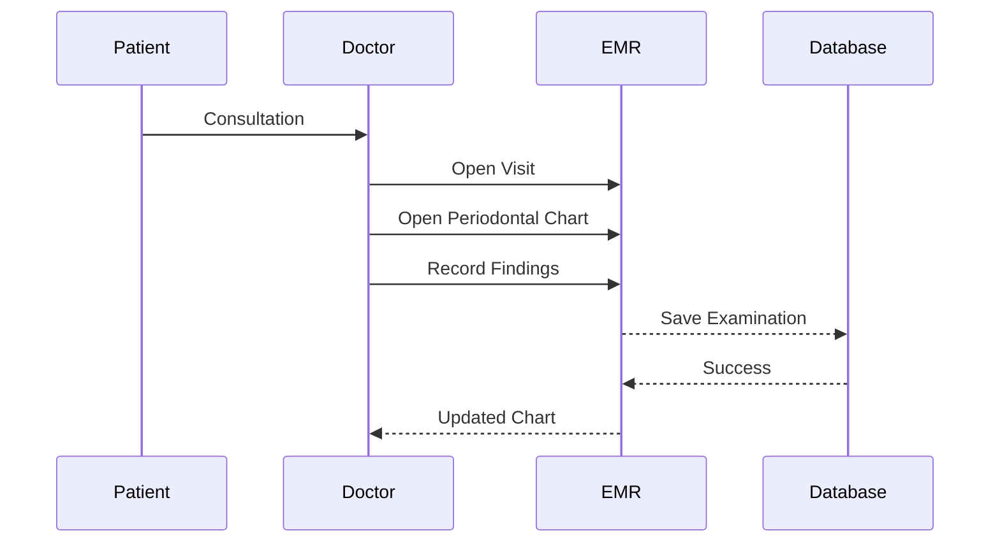

---

# 5. Periodontal Assessment

## Overview

Periodontal Assessment dilakukan untuk mengevaluasi jaringan pendukung gigi secara sistematis.

Setiap pemeriksaan dilakukan pada seluruh gigi atau gigi tertentu sesuai kebutuhan klinis.

---

## Assessment Components

| Component | Description |
|-----------|-------------|
| Pocket Depth | Kedalaman poket periodontal |
| Gingival Margin | Posisi margin gingiva |
| CAL | Clinical Attachment Level |
| BOP | Bleeding on Probing |
| Plaque Index | Indeks plak |
| Furcation | Keterlibatan furkasi |
| Mobility | Derajat kegoyangan |
| Gingival Recession | Resesi gingiva |

---

## Assessment Frequency

| Examination | Recommended Interval |
|-------------|----------------------|
| Initial Examination | Visit pertama |
| Maintenance | 3–6 bulan |
| Post Surgery | Sesuai instruksi dokter |
| Recall | Setiap recall visit |

---

# 6. Periodontal Chart

## Overview

Periodontal Chart merupakan representasi visual dari kondisi periodontal setiap gigi.

Seluruh data tersimpan dalam bentuk terstruktur sehingga dapat ditampilkan dalam bentuk grafik maupun tabel.

---

## Sample Chart

```text
Tooth 16

Pocket Depth

3

2

3

--------------

Gingival Margin

0

0

1

--------------

CAL

3

2

4

--------------

Bleeding

Yes

No

Yes
```text

---

## Six Point Measurement

Setiap gigi mendukung enam titik pengukuran.

```text
Buccal

MB

B

DB

Lingual

ML

L

DL
```

---

## Measurement Position

```text
        Buccal

MB     B     DB

-----------------

ML     L     DL

       Lingual
```text

---

## Chart Features

- Editable
- Historical
- Printable
- Versioned
- Exportable
- Integrated with EMR

---

# 7. Clinical Examination Components

## Extra Oral Examination

Mencatat:

- Facial Symmetry
- TMJ
- Lymph Node
- Swelling
- Skin Lesion

---

## Intra Oral Examination

Mencatat:

- Gingiva
- Mucosa
- Tongue
- Palate
- Floor of Mouth
- Salivary Gland

---

## Occlusion Examination

Meliputi:

- Class I
- Class II
- Class III
- Cross Bite
- Open Bite
- Deep Bite

---

## Soft Tissue Examination

Mencatat:

- Ulcer
- Leukoplakia
- Erythroplakia
- Pigmentation
- Other Lesions

---

# 8. Examination Lifecycle

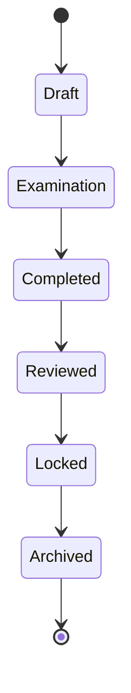

---

## Lifecycle Description

| Status | Description |
|----------|-------------|
| Draft | Pemeriksaan belum selesai |
| Examination | Pemeriksaan berlangsung |
| Completed | Pemeriksaan selesai |
| Reviewed | Diverifikasi dokter |
| Locked | Tidak dapat diubah |
| Archived | Riwayat permanen |

---

## Lifecycle Rules

- Pemeriksaan hanya dapat dilakukan pada Visit yang aktif.
- Pemeriksaan yang telah di-Lock tidak dapat diubah.
- Revisi menghasilkan versi baru.
- Semua perubahan dicatat pada Audit Trail.

---

# 9. Module Integration

## Related Modules

| Module | Purpose |
|----------|---------|
| Patient | Pemilik rekam medis |
| Visit | Pemeriksaan |
| EMR | Parent Module |
| Odontogram | Kondisi gigi |
| Diagnosis | Diagnosis periodontal |
| Treatment Plan | Rencana terapi |
| Billing | Tindakan periodontal |
| Reporting | Statistik klinis |
| Audit | Activity Log |

---

## Integration Diagram

```mermaid
graph TD

Patient --> Visit

Visit --> EMR

EMR --> PeriodontalAssessment

PeriodontalAssessment --> Diagnosis

Diagnosis --> TreatmentPlan

TreatmentPlan --> Billing

PeriodontalAssessment --> Reporting

PeriodontalAssessment --> Audit
```text

---

# 10. Business Rules

## General Rules

- Pemeriksaan periodontal merupakan bagian dari Visit.
- Pemeriksaan dapat dilakukan lebih dari satu kali dalam satu Visit.
- Pemeriksaan menghasilkan histori permanen.
- Pemeriksaan dapat dibandingkan dengan Visit sebelumnya.

---

## Clinical Rules

- Seluruh pengukuran menggunakan satuan milimeter.
- Nilai harus berasal dari pemeriksaan aktual.
- Dokter wajib mengisi Clinical Note jika ditemukan kelainan signifikan.
- Pemeriksaan dapat dilakukan pada seluruh gigi atau gigi tertentu.

---

## Data Integrity Rules

- Data tidak boleh dihapus.
- Seluruh revisi menghasilkan versi baru.
- Audit Trail wajib dibuat.
- Timestamp menggunakan waktu server.
- Seluruh perubahan memiliki informasi pengguna yang melakukan perubahan.

---

# Summary

Part **3.2A** mendefinisikan fondasi modul **Periodontal Assessment & Clinical Examination** pada EMR Parakita. Dokumen ini mencakup tujuan, ruang lingkup, alur pemeriksaan klinis, desain **Periodontal Chart**, komponen pemeriksaan ekstra oral dan intra oral, lifecycle pemeriksaan, integrasi dengan modul EMR lainnya, serta business rules utama. Bagian ini menjadi dasar bagi implementasi pemeriksaan periodontal yang terstruktur, historis, dan terintegrasi dengan Diagnosis, Treatment Plan, Billing, Reporting, dan Audit.

---

## Next Document

**15-module-emr-part-3.2B.md**

**Pocket Depth, Gingival Margin, Clinical Attachment Level, Bleeding on Probing, Plaque Index, Furcation & Tooth Mobility**


---


# Part 3.2B — Periodontal Clinical Measurements

| Document Information |  |
|----------------------|------------------------------------------------|
| Project | Parakita Dental Clinic Management System |
| Module | Electronic Medical Record (EMR) |
| Document | 15-module-emr-part-3.2.md |
| Section | Part 3.2B |
| Version | 1.0.0 |
| Status | Draft |
| Architecture | Clean Architecture + Domain Driven Design |
| Last Updated | July 2026 |

---

# Table of Contents
11. Periodontal Measurement Overview
12. Pocket Depth
13. Gingival Margin
14. Clinical Attachment Level (CAL)
15. Bleeding on Probing (BOP)
16. Plaque Index
17. Tooth Mobility
18. Furcation Involvement
19. Gingival Recession
20. Clinical Measurement Rules
21. Validation Rules
22. Business Rules
---

# 11. Periodontal Measurement Overview

## 11.1 Overview

Seluruh pengukuran periodontal dilakukan secara terstruktur untuk menghasilkan data klinis yang konsisten, dapat dibandingkan antar kunjungan, serta mendukung diagnosis dan evaluasi terapi.

Setiap hasil pemeriksaan direkam berdasarkan:

- Visit
- Tooth
- Measurement Point
- Examiner
- Examination Date

---

## Measurement Workflow

```text
Open Visit

↓

Open Periodontal Chart

↓

Select Tooth

↓

Input Clinical Measurement

↓

Review

↓

Save

↓

Update Timeline

↓

Generate Audit Trail
```

---

## Standard Measurement Position

Setiap gigi mendukung **6 titik pemeriksaan**.

```text
          Buccal

MB ----- B ----- DB

---------------------

ML ----- L ----- DL

         Lingual
```text

| Code | Description |
|------|-------------|
| MB | Mesio Buccal |
| B | Buccal |
| DB | Disto Buccal |
| ML | Mesio Lingual |
| L | Lingual |
| DL | Disto Lingual |

---

# 12. Pocket Depth

## Overview

Pocket Depth merupakan jarak antara gingival margin dengan dasar sulkus atau periodontal pocket.

Nilai dicatat dalam **millimeter (mm)**.

---

## Clinical Reference

| Depth | Clinical Interpretation |
|--------|------------------------|
| 1–3 mm | Normal |
| 4 mm | Early Periodontal Pocket |
| 5–6 mm | Moderate Periodontitis |
| ≥7 mm | Advanced Periodontitis |

---

## Example

```text
Tooth 16

MB : 3 mm

B  : 2 mm

DB : 4 mm

ML : 3 mm

L  : 2 mm

DL : 3 mm
```

---

## Database Model

| Field | Type |
|--------|------|
| visit_id | UUID |
| tooth_number | VARCHAR |
| measurement_point | ENUM |
| pocket_depth | DECIMAL(4,1) |

---

## Business Rules

- Nilai harus menggunakan milimeter.
- Maksimal satu angka desimal.
- Nilai tidak boleh negatif.
- Pengukuran dilakukan pada enam titik.

---

# 13. Gingival Margin

## Overview

Gingival Margin merupakan posisi tepi gingiva terhadap Cementoenamel Junction (CEJ).

Nilai dapat berupa:

- Positif
- Nol
- Negatif

---

## Interpretation

| Value | Meaning |
|--------|---------|
| 0 | Normal |
| Positive | Hyperplasia |
| Negative | Recession |

---

## Example

```text
MB : 0

B : 0

DB : -1

ML : -2

L : -2

DL : -1
```text

---

## Business Rules

- Nilai dapat negatif.
- Dicatat dalam mm.
- Mendukung enam titik pemeriksaan.

---

# 14. Clinical Attachment Level (CAL)

## Overview

Clinical Attachment Level dihitung berdasarkan hubungan antara Pocket Depth dan Gingival Margin.

---

## Formula

```text
CAL

=

Pocket Depth

+

Gingival Margin
```

---

## Example

```text
Pocket Depth : 4

Gingival Margin : -2

CAL : 6 mm
```text

---

## Interpretation

| CAL | Severity |
|------|----------|
| 1–2 mm | Mild |
| 3–4 mm | Moderate |
| ≥5 mm | Severe |

---

## Business Rules

- CAL dihitung otomatis.
- Dokter dapat melakukan koreksi bila diperlukan.
- Riwayat perubahan tetap disimpan.

---

# 15. Bleeding on Probing (BOP)

## Overview

Bleeding on Probing menunjukkan adanya inflamasi jaringan periodontal.

---

## Available Values

| Value | Description |
|--------|-------------|
| Yes | Terjadi perdarahan |
| No | Tidak terjadi perdarahan |

---

## UI Display

```text
● Red

Bleeding

○ White

No Bleeding
```

---

## Clinical Rules

- Dicatat pada enam titik.
- Tidak menggunakan nilai numerik.
- Digunakan untuk evaluasi inflamasi.

---

# 16. Plaque Index

## Overview

Plaque Index digunakan untuk mengevaluasi kebersihan rongga mulut pasien.

---

## Score

| Score | Description |
|-------|-------------|
| 0 | No Plaque |
| 1 | Thin Plaque |
| 2 | Moderate Plaque |
| 3 | Heavy Plaque |

---

## Example

```text
Tooth 36

MB : 1

B : 1

DB : 2

ML : 1

L : 0

DL : 2
```text

---

## Business Rules

- Nilai hanya 0–3.
- Dicatat per titik.
- Digunakan pada laporan kebersihan mulut.

---

# 17. Tooth Mobility

## Overview

Tooth Mobility menunjukkan tingkat kegoyangan gigi.

---

## Mobility Grade

| Grade | Description |
|--------|-------------|
| 0 | Normal |
| 1 | <1 mm horizontal |
| 2 | >1 mm horizontal |
| 3 | Vertical movement |

---

## Example

```text
Tooth 46

Mobility

Grade 2
```

---

## Clinical Recommendation

| Grade | Recommendation |
|--------|---------------|
| 0 | Observation |
| 1 | Monitoring |
| 2 | Splint Evaluation |
| 3 | Extraction Evaluation |

---

# 18. Furcation Involvement

## Overview

Furcation hanya berlaku pada gigi multiroot.

---

## Classification

| Grade | Description |
|--------|-------------|
| 0 | No Furcation |
| I | Initial |
| II | Partial |
| III | Complete Through-and-Through |

---

## Applicable Teeth

Biasanya:

- 16
- 17
- 18
- 26
- 27
- 28
- 36
- 37
- 38
- 46
- 47
- 48

---

## Business Rules

- Tidak berlaku pada gigi satu akar.
- Hanya muncul pada gigi molar tertentu.
- Mendukung histori perubahan.

---

# 19. Gingival Recession

## Overview

Gingival Recession merupakan penurunan posisi gingiva sehingga akar gigi terekspos.

---

## Measurement

Dicatat dalam mm.

---

## Classification

| Value | Description |
|--------|-------------|
| 0 | No Recession |
| 1–2 mm | Mild |
| 3–4 mm | Moderate |
| ≥5 mm | Severe |

---

## Example

```text
Tooth 13

Recession

2 mm
```text

---

## Treatment Consideration

- Oral Hygiene
- Root Coverage
- Connective Tissue Graft
- Monitoring

---

# 20. Clinical Measurement Rules

## Examination Rules

- Semua pengukuran menggunakan satuan milimeter.
- Pemeriksaan dilakukan menggunakan periodontal probe.
- Seluruh data dihubungkan dengan Visit aktif.
- Dokter dapat melakukan pengukuran ulang sebelum Visit ditutup.

---

## Recording Rules

- Setiap perubahan menghasilkan histori.
- Pemeriksaan dapat dilakukan sebagian atau seluruh gigi.
- Pemeriksaan tidak dapat dihapus setelah Visit dikunci.

---

# 21. Validation Rules

## Pocket Depth

- Minimal 0 mm.
- Maksimal 15 mm.
- Maksimal satu angka desimal.

---

## Gingival Margin

- Nilai dapat negatif.
- Maksimal ±10 mm.

---

## CAL

- Dihitung otomatis.
- Tidak boleh negatif.

---

## Plaque Index

- Hanya menerima nilai 0–3.

---

## Mobility

- Hanya menerima Grade 0–3.

---

## Furcation

- Hanya untuk gigi multiroot.
- Grade harus sesuai klasifikasi.

---

# 22. Business Rules

## Data Integrity

- Seluruh data periodontal merupakan bagian dari EMR permanen.
- Riwayat tidak boleh dihapus.
- Revisi menghasilkan versi baru.
- Audit Trail wajib tersedia.

---

## Clinical Integrity

- Pengukuran dilakukan oleh dokter atau tenaga medis yang berwenang.
- Nilai tidak boleh dimodifikasi setelah Visit dikunci.
- Semua perubahan harus memiliki timestamp dan identitas pengguna.

---

## Integration Rules

Data periodontal digunakan oleh:

- Diagnosis Module
- Treatment Planning Module
- Clinical Timeline
- Reporting Module
- Recall Management
- AI Clinical Analysis (Future)

---

# Summary

Part **3.2B** mendefinisikan seluruh parameter pengukuran periodontal yang digunakan dalam EMR Parakita, meliputi **Pocket Depth**, **Gingival Margin**, **Clinical Attachment Level (CAL)**, **Bleeding on Probing (BOP)**, **Plaque Index**, **Tooth Mobility**, **Furcation Involvement**, dan **Gingival Recession**. Dokumen ini juga menetapkan format penyimpanan data, aturan validasi, business rules, serta integrasi dengan modul Diagnosis, Treatment Planning, Reporting, dan Recall. Seluruh data pengukuran bersifat **versioned**, **auditable**, dan menjadi bagian permanen dari Electronic Medical Record.

---

## Next Document

**15-module-emr-part-3.2C.md**

**Clinical Assessment Domain Model, Repository, Service Layer, Domain Event & Validation**

---


# Part 3.2C — Clinical Assessment Domain Model, Repository & Service Design

| Document Information |  |
|----------------------|------------------------------------------------|
| Project | Parakita Dental Clinic Management System |
| Module | Electronic Medical Record (EMR) |
| Document | 15-module-emr-part-3.2.md |
| Section | Part 3.2C |
| Version | 1.0.0 |
| Status | Draft |
| Architecture | Clean Architecture + Domain Driven Design |
| Last Updated | July 2026 |

---

# Table of Contents
23. Domain Model
24. Aggregate Design
25. Entity Relationship
26. Repository Layer
27. Service Layer
28. DTO Design
29. Domain Event
30. Validation Engine
31. Audit Trail
32. Security Model
33. Business Rules
34. Acceptance Criteria
---

# 23. Domain Model

## 23.1 Overview

Periodontal Assessment diimplementasikan menggunakan pendekatan **Domain-Driven Design (DDD)**. Seluruh data pemeriksaan periodontal menjadi bagian dari Aggregate Root EMR dan memiliki lifecycle yang mengikuti Visit pasien.

Setiap perubahan data klinis harus melewati Aggregate Root untuk menjamin konsistensi data dan mencegah perubahan langsung ke database.

---

## Aggregate Root

```text
EMR Visit

│

└── Periodontal Assessment

      │

      ├── Examination

      ├── Tooth Assessment

      ├── Measurement

      ├── Clinical Note

      ├── Attachment

      ├── Version

      └── History
```

---

## Domain Responsibilities

Aggregate bertanggung jawab terhadap:

- Validasi data klinis
- Versioning
- Audit Trail
- Domain Event
- Clinical History
- Timeline

---

# 24. Aggregate Design

## Aggregate Structure

```mermaid
classDiagram

class PeriodontalAssessment{

+UUID id

+UUID visitId

+UUID patientId

+AssessmentStatus status

+Version version

}

class ToothAssessment{

+FDI toothNumber

}

class Measurement{

+PocketDepth

+CAL

+BOP

}

class ClinicalNote{

+String note

}

class Attachment{

+UUID id

}

PeriodontalAssessment "1" --> "*" ToothAssessment

ToothAssessment "1" --> "*" Measurement

PeriodontalAssessment "1" --> "*" ClinicalNote

PeriodontalAssessment "1" --> "*" Attachment
```text

---

## Entity Description

| Entity | Description |
|---------|-------------|
| PeriodontalAssessment | Aggregate Root |
| ToothAssessment | Data pemeriksaan tiap gigi |
| Measurement | Nilai periodontal |
| ClinicalNote | Catatan dokter |
| Attachment | Foto/X-Ray |
| Version | Snapshot pemeriksaan |
| History | Riwayat perubahan |

---

## Value Objects

- Tooth Number
- Measurement Point
- Pocket Depth
- Gingival Margin
- CAL
- Mobility Grade
- Furcation Grade
- Plaque Score

---

# 25. Entity Relationship

## Logical Relationship

```text
Patient

↓

Visit

↓

Periodontal Assessment

↓

Tooth Assessment

↓

Measurement

↓

History
```

---

## Database Tables

| Table | Description |
|---------|-------------|
| emr_periodontal_assessments | Master Assessment |
| emr_periodontal_versions | Assessment Version |
| emr_tooth_assessments | Per Tooth |
| emr_periodontal_measurements | Measurement Detail |
| emr_periodontal_notes | Clinical Notes |
| emr_periodontal_histories | History |
| emr_periodontal_attachments | Attachment |

---

## Primary Key

Semua tabel menggunakan UUID.

---

## Foreign Key

```text
Patient

↓

Visit

↓

Assessment

↓

Tooth Assessment

↓

Measurement
```typescript

---

# 26. Repository Layer

## Repository Overview

Repository bertanggung jawab mengakses persistence layer tanpa mengekspos implementasi database kepada Domain Layer.

---

## Interface

```typescript
interface IPeriodontalAssessmentRepository{

create();

findById();

findByVisit();

findLatest();

save();

update();

archive();

}
```

---

## Tooth Assessment Repository

```typescript
interface IToothAssessmentRepository{

findByTooth();

saveMeasurement();

findHistory();

findLatestMeasurement();

}
```typescript

---

## History Repository

```typescript
interface IPeriodontalHistoryRepository{

saveHistory();

findTimeline();

findVersion();

}
```

---

## Attachment Repository

```typescript
interface IAttachmentRepository{

upload();

delete();

findByAssessment();

}
```text

---

# 27. Service Layer

## PeriodontalAssessmentService

Responsibilities:

- Create Assessment
- Update Assessment
- Lock Assessment
- Create Version
- Publish Domain Event

---

## MeasurementService

Responsibilities:

- Save Pocket Depth
- Calculate CAL
- Validate Measurement
- Generate Timeline

---

## ClinicalNoteService

Responsibilities:

- Create Clinical Note
- Update Clinical Note
- Attach Recommendation

---

## AttachmentService

Responsibilities:

- Upload Clinical Photo
- Upload X-Ray
- Generate Thumbnail
- Virus Scan
- Store Metadata

---

## HistoryService

Responsibilities:

- Save History
- Compare Version
- Restore Version
- Generate Timeline

---

# 28. DTO Design

## Create Assessment DTO

```typescript
class CreatePeriodontalAssessmentDto{

visitId:string;

patientId:string;

doctorId:string;

}
```

---

## Save Measurement DTO

```typescript
class SaveMeasurementDto{

toothNumber:string;

measurementPoint:string;

pocketDepth:number;

gingivalMargin:number;

bleeding:boolean;

plaqueIndex:number;

mobility:number;

furcation:string;

}
```text

---

## Clinical Note DTO

```typescript
class CreateClinicalNoteDto{

assessmentId:string;

note:string;

recommendation:string;

}
```

---

## Upload Attachment DTO

```typescript
class UploadAttachmentDto{

assessmentId:string;

attachmentType:string;

fileName:string;

}
```text

---

# 29. Domain Event

## Overview

Seluruh perubahan data periodontal menghasilkan Domain Event agar modul lain dapat melakukan sinkronisasi secara asynchronous.

---

## Events

```text
AssessmentCreated

↓

MeasurementAdded

↓

MeasurementUpdated

↓

ClinicalNoteAdded

↓

AttachmentUploaded

↓

AssessmentLocked

↓

VersionCreated
```

---

## Event Payload

```json
{
  "eventId":"UUID",
  "eventName":"MeasurementUpdated",
  "assessmentId":"UUID",
  "patientId":"UUID",
  "visitId":"UUID",
  "tooth":"36",
  "measurement":"PocketDepth",
  "value":"5",
  "doctorId":"UUID",
  "occurredAt":"2026-07-31T08:30:00Z"
}
```text

---

## Integration

Domain Event dapat digunakan oleh:

- Audit Module
- Clinical Timeline
- Reporting
- Notification
- AI Analytics
- Data Warehouse

---

# 30. Validation Engine

## Validation Flow

```text
Receive Request

↓

Validate DTO

↓

Validate Visit

↓

Validate Tooth

↓

Validate Measurement

↓

Validate Business Rule

↓

Save

↓

Generate History

↓

Publish Event
```

---

## Validation Rules

### Visit

- Visit wajib aktif.
- Visit tidak boleh ditutup.

---

### Tooth

- Nomor FDI harus valid.
- Tooth harus tersedia pada odontogram.

---

### Pocket Depth

- Nilai 0–15 mm.
- Maksimal satu angka desimal.

---

### Gingival Margin

- Nilai -10 hingga +10 mm.

---

### CAL

- Dihitung otomatis.
- Tidak boleh negatif.

---

### Plaque Index

- Nilai hanya 0–3.

---

### Mobility

- Grade 0–3.

---

### Furcation

- Hanya untuk molar multiroot.

---

### Attachment

- Maksimal ukuran file mengikuti konfigurasi sistem.
- Hanya format yang diizinkan.
- File wajib lolos proses antivirus.

---

# 31. Audit Trail

## Audit Fields

| Field | Description |
|---------|-------------|
| Audit ID | UUID |
| Assessment ID | Assessment |
| Visit ID | Visit |
| Patient ID | Patient |
| Doctor ID | Examiner |
| Action | Create / Update / Delete / Lock |
| Old Value | Previous Value |
| New Value | Current Value |
| Created At | Timestamp |

---

## Audit Flow

```text
Doctor Save

↓

Business Validation

↓

Save Assessment

↓

Save History

↓

Generate Audit

↓

Publish Event

↓

Update Timeline
```text

---

# 32. Security Model

## Authorization Matrix

| Role | View | Create | Edit | Lock |
|------|------|--------|------|------|
| Doctor | ✔ | ✔ | ✔ | ✔ |
| Dental Nurse | ✔ | ✔ | ✔ | ✖ |
| Administrator | ✔ | ✔ | ✔ | ✔ |
| Receptionist | ✔ | ✖ | ✖ | ✖ |

---

## Security Rules

- Assessment hanya dapat diubah selama Visit aktif.
- Setelah status **Locked**, perubahan hanya dapat dilakukan melalui revisi yang menghasilkan versi baru.
- Semua request wajib menggunakan JWT yang valid.
- Seluruh aktivitas dicatat pada Audit Trail.

---

# 33. Business Rules

## General Rules

- Assessment merupakan bagian dari EMR.
- Satu Visit memiliki satu Assessment aktif.
- Assessment mendukung beberapa versi.
- Riwayat tidak boleh dihapus.

---

## Clinical Rules

- CAL dihitung otomatis dari Pocket Depth dan Gingival Margin.
- Semua pengukuran menggunakan milimeter.
- Pemeriksaan mengikuti standar enam titik.
- Dokter dapat menambahkan Clinical Note pada setiap Tooth.

---

## Technical Rules

- Repository tidak boleh berisi business logic.
- Service bertanggung jawab terhadap validasi dan orkestrasi.
- Domain Event dipublikasikan setelah transaksi berhasil (Outbox Pattern direkomendasikan).
- Version bersifat immutable.

---

# 34. Acceptance Criteria

## Functional

- Assessment dapat dibuat.
- Pengukuran periodontal dapat disimpan.
- CAL dihitung otomatis.
- Clinical Note dapat ditambahkan.
- Attachment dapat diunggah.
- History terbentuk otomatis.
- Version dibuat otomatis ketika revisi dilakukan.

---

## Non Functional

- Waktu penyimpanan < 300 ms.
- Mendukung minimal 100 concurrent user.
- Mendukung audit penuh.
- Mendukung rollback berbasis versioning.

---

## Integration

Assessment harus dapat terintegrasi dengan:

- EMR
- Odontogram
- Diagnosis
- Treatment Plan
- Billing
- Clinical Timeline
- Reporting
- Notification
- Audit

---

# Summary

Part **3.2C** mendefinisikan desain teknis modul **Periodontal Assessment** menggunakan pendekatan **Clean Architecture** dan **Domain-Driven Design (DDD)**. Dokumen ini mencakup **Domain Model**, **Aggregate Design**, **Repository Layer**, **Service Layer**, **DTO**, **Validation Engine**, **Audit Trail**, **Security Model**, serta **Domain Event** yang menjadi dasar implementasi backend. Dengan desain ini, seluruh data pemeriksaan periodontal tersimpan secara **versioned**, **auditable**, dan siap diintegrasikan dengan modul EMR lainnya melalui pola **Outbox Pattern** dan event-driven architecture.

---

## Next Document

**15-module-emr-part-3.2D.md**

**Sequence Diagram, BPMN, Activity Diagram, State Machine, OpenAPI Specification & Acceptance Test**


---


# Part 3.2D — Workflow Diagram, State Machine, OpenAPI Specification & Acceptance Test

| Document Information |  |
|----------------------|------------------------------------------------|
| Project | Parakita Dental Clinic Management System |
| Module | Electronic Medical Record (EMR) |
| Document | 15-module-emr-part-3.2.md |
| Section | Part 3.2D |
| Version | 1.0.0 |
| Status | Draft |
| Architecture | Clean Architecture + Domain Driven Design |
| Last Updated | July 2026 |

---

# Table of Contents
35. BPMN Doctor Examination
36. Sequence Diagram
37. Activity Diagram
38. State Machine
39. OpenAPI Specification
40. Error Response Standard
41. Database Transaction Flow
42. Performance Consideration
43. Acceptance Test
44. Future Enhancement
---

# 35. BPMN Doctor Examination

## Overview

Business Process Model ini menggambarkan alur pemeriksaan periodontal sejak pasien mulai diperiksa hingga hasil pemeriksaan tersimpan di Electronic Medical Record.

---

## BPMN

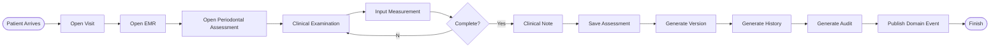

---

## BPMN Description

| Activity | Description |
|-----------|-------------|
| Open Visit | Membuka kunjungan pasien |
| Clinical Examination | Pemeriksaan periodontal |
| Input Measurement | Input Pocket Depth, CAL, BOP, dll |
| Save Assessment | Simpan hasil pemeriksaan |
| Generate Version | Membuat snapshot baru |
| Generate History | Menyimpan histori |
| Publish Event | Sinkronisasi antar modul |

---

# 36. Sequence Diagram

## Save Periodontal Assessment

```mermaid
sequenceDiagram

participant Doctor

participant UI

participant API

participant Service

participant Repository

participant Database

Doctor->>UI: Input Measurement

UI->>API: POST Assessment

API->>Service: Validate DTO

Service->>Repository: Save Assessment

Repository->>Database: INSERT

Database-->>Repository: Success

Repository-->>Service: Assessment

Service->>Repository: Save History

Repository->>Database: INSERT History

Service->>Repository: Create Version

Repository->>Database: INSERT Version

Service->>Repository: Save Audit

Repository->>Database: INSERT Audit

Service-->>API: Success

API-->>UI: HTTP 201

UI-->>Doctor: Assessment Saved
```text

---

## Upload Attachment

```mermaid
sequenceDiagram

Doctor->>UI: Upload Clinical Photo

UI->>API: Multipart Upload

API->>Storage: Store File

Storage-->>API: File URL

API->>Database: Save Metadata

Database-->>API: Success

API-->>UI: Uploaded
```

---

# 37. Activity Diagram

```mermaid
flowchart TD

    Start --> OpenVisit
    OpenVisit --> OpenAssessment
    OpenAssessment --> InputMeasurement
    InputMeasurement --> Validate
    Validate --> Save
    Save --> GenerateVersion
    GenerateVersion --> GenerateHistory
    GenerateHistory --> PublishEvent
    PublishEvent --> UpdateTimeline
    UpdateTimeline --> Finish
```text

---

## Activity Description

| Activity | Description |
|----------|-------------|
| Open Assessment | Membuka form periodontal |
| Input Measurement | Mengisi seluruh parameter |
| Validate | Validasi klinis |
| Generate Version | Snapshot baru |
| Update Timeline | Timeline EMR |

---

# 38. State Machine

## Assessment Lifecycle

```mermaid
stateDiagram-v2

[*] --> Draft

Draft --> InProgress

InProgress --> Completed

Completed --> Reviewed

Reviewed --> Locked

Locked --> Archived

Archived --> [*]
```

---

## Allowed Transition

| Current | Next |
|----------|------|
| Draft | In Progress |
| In Progress | Completed |
| Completed | Reviewed |
| Reviewed | Locked |
| Locked | Archived |

---

## Invalid Transition

Tidak diperbolehkan:

- Locked → Draft
- Archived → In Progress
- Completed → Draft

Perubahan setelah status **Locked** wajib menghasilkan **Version baru**.

---

# 39. OpenAPI Specification

## Create Assessment

```http
POST /api/v1/emr/periodontal-assessments
```text

### Request

```json
{
  "visitId":"UUID",
  "patientId":"UUID",
  "doctorId":"UUID"
}
```

---

### Response

```json
{
  "success":true,
  "message":"Assessment created",
  "data":{
      "assessmentId":"UUID"
  }
}
```text

---

## Save Measurement

```http
POST /api/v1/emr/periodontal-assessments/{assessmentId}/measurements
```

### Request

```json
{
  "tooth":"36",
  "measurementPoint":"MB",
  "pocketDepth":5,
  "gingivalMargin":-1,
  "bleeding":true,
  "plaqueIndex":2,
  "mobility":1,
  "furcation":"I"
}
```text

---

### Response

```json
{
    "success":true,
    "message":"Measurement saved"
}
```

---

## Update Measurement

```http
PUT /api/v1/emr/periodontal-assessments/{assessmentId}/measurements/{id}
```text

---

## Delete Measurement

```http
DELETE /api/v1/emr/periodontal-assessments/{assessmentId}/measurements/{id}
```

> Catatan: Secara business rule, operasi **DELETE** disarankan sebagai **Soft Delete** atau **Logical Delete**. Penghapusan fisik (hard delete) hanya diperbolehkan untuk data yang belum dipublikasikan atau atas kebijakan administrator sesuai regulasi.

---

## Get Assessment

```http
GET /api/v1/emr/periodontal-assessments/{assessmentId}
```text

---

## Get History

```http
GET /api/v1/emr/periodontal-assessments/{assessmentId}/history
```

---

## Lock Assessment

```http
POST /api/v1/emr/periodontal-assessments/{assessmentId}/lock
```text

---

# 40. Error Response Standard

## Success

```json
{
  "success":true,
  "message":"Success"
}
```

---

## Validation Error

```json
{
  "success":false,
  "error":"VALIDATION_ERROR",
  "message":"Pocket Depth is required"
}
```text

---

## Business Error

```json
{
  "success":false,
  "error":"ASSESSMENT_LOCKED",
  "message":"Assessment already locked"
}
```

---

## Unauthorized

```json
{
  "success":false,
  "error":"UNAUTHORIZED"
}
```text

---

## Not Found

```json
{
  "success":false,
  "error":"ASSESSMENT_NOT_FOUND"
}
```

---

# 41. Database Transaction Flow

## Transaction

```text
BEGIN

↓

Save Assessment

↓

Save Measurement

↓

Save History

↓

Create Version

↓

Save Audit

↓

Publish Event

↓

COMMIT
```text

Jika salah satu proses gagal maka:

```text
ROLLBACK
```

---

## Transaction Rules

- Semua operasi berada dalam satu transaksi database.
- Domain Event dipublikasikan setelah transaksi berhasil (Outbox Pattern).
- Audit dan History wajib konsisten dengan data utama.

---

# 42. Performance Consideration

## Target

| Metric | Target |
|----------|--------|
| Save Assessment | <300 ms |
| Load Assessment | <200 ms |
| History Query | <500 ms |
| Timeline Query | <500 ms |

---

## Recommended Index

```text
visit_id

patient_id

assessment_id

tooth_number

created_at
```text

---

## Cache Strategy

Data berikut dapat menggunakan Redis:

- Master Tooth
- Master Measurement
- Lookup Table
- Clinical Reference

---

# 43. Acceptance Test

## Functional Test

| Test Case | Expected Result |
|------------|----------------|
| Create Assessment | Success |
| Save Pocket Depth | Success |
| Calculate CAL | Automatic |
| Save BOP | Success |
| Save Mobility | Success |
| Upload Attachment | Success |
| Lock Assessment | Success |
| Create Version | Automatic |

---

## Negative Test

| Test | Expected Result |
|------|----------------|
| Pocket Depth < 0 | Validation Error |
| Invalid Tooth | Validation Error |
| Assessment Locked | Business Error |
| Unauthorized User | 401 Unauthorized |
| Visit Closed | Business Error |

---

## Integration Test

Pastikan modul dapat terintegrasi dengan:

- EMR
- Odontogram
- Diagnosis
- Treatment Plan
- Billing
- Reporting
- Audit
- Clinical Timeline
- Notification

---

# 44. Future Enhancement

## Phase 2

- Voice Dictation
- Smart Clinical Template
- Bulk Assessment
- Tablet Pen Support
- Auto Measurement Import

---

## Phase 3

- AI Periodontal Risk Score
- AI Disease Classification
- AI Recall Recommendation
- AI Progress Comparison
- AI Clinical Summary

---

## Phase 4

- Digital Periodontal Probe Integration
- IoT Dental Device
- CBCT Integration
- 3D Periodontal Visualization
- Predictive Bone Loss Analysis

---

# Summary

Part **3.2D** melengkapi desain **Periodontal Assessment Module** dengan dokumentasi implementasi berupa **BPMN**, **Sequence Diagram**, **Activity Diagram**, **State Machine**, rancangan **OpenAPI**, standar **Error Response**, alur **Database Transaction**, target performa, **Acceptance Test**, serta roadmap pengembangan. Dokumen ini menjadi acuan implementasi backend dan frontend agar proses pemeriksaan periodontal berjalan konsisten, terdokumentasi, memiliki audit trail yang lengkap, serta mendukung integrasi dengan seluruh modul EMR Parakita.

---

# End of Document

## Completed

**15-module-emr-part-3.2.md**

- ✅ Part 3.2A — Foundation
- ✅ Part 3.2B — Clinical Measurements
- ✅ Part 3.2C — Domain Model & Service Layer
- ✅ Part 3.2D — Workflow, API & Acceptance Test

---

## Next Document

**15-module-emr-part-3.3.md**

**Clinical Attachment, X-Ray Imaging & Clinical Photography Module**

---


# Part 3.3A — Clinical Attachment Foundation

| Document Information |  |
|----------------------|------------------------------------------------|
| Project | Parakita Dental Clinic Management System |
| Module | Electronic Medical Record (EMR) |
| Document | 15-module-emr-part-3.3.md |
| Section | Part 3.3A |
| Version | 1.0.0 |
| Status | Draft |
| Architecture | Clean Architecture + Domain Driven Design |
| Last Updated | July 2026 |

---

# Table of Contents
1. Introduction
2. Objectives
3. Scope
4. Clinical Attachment Overview
5. Attachment Category
6. Attachment Lifecycle
7. Attachment Metadata
8. Storage Architecture
9. Clinical Timeline Integration
10. Business Rules
---

# 1. Introduction

## 1.1 Overview

Clinical Attachment merupakan modul yang bertanggung jawab menyimpan seluruh dokumen klinis digital yang berhubungan dengan pasien.

Modul ini menjadi pusat penyimpanan seluruh media digital seperti:

- Clinical Photograph
- Dental X-Ray
- CBCT
- Intraoral Scan
- STL Model
- Consent Form
- Laboratory Result
- Referral Letter
- Insurance Attachment
- Prescription Scan

Seluruh attachment merupakan bagian permanen dari Electronic Medical Record (EMR) dan mengikuti lifecycle rekam medis pasien.

---

## 1.2 Purpose

Dokumen ini mendefinisikan desain arsitektur modul Clinical Attachment agar seluruh file medis dapat disimpan secara:

- Secure
- Versioned
- Auditable
- Searchable
- Highly Available

---

## 1.3 Design Principles

Modul Clinical Attachment dibangun berdasarkan prinsip berikut:

- Medical Record First
- Immutable History
- Secure by Default
- Object Storage Ready
- Cloud Native
- Metadata Driven
- Event Driven
- AI Ready
- Vendor Neutral

---

# 2. Objectives

## Clinical Objectives

- Menyimpan seluruh media klinis.
- Mendukung evaluasi perkembangan pasien.
- Mendukung dokumentasi legal.
- Menjadi referensi tindakan medis.

---

## Business Objectives

- Mengurangi penggunaan dokumen fisik.
- Mendukung paperless clinic.
- Mempermudah pencarian dokumen.
- Mendukung audit medis.

---

## Technical Objectives

- Mendukung Object Storage.
- Mendukung CDN.
- Mendukung Backup.
- Mendukung Versioning.
- Mendukung API.
- Mendukung Mobile Application.

---

# 3. Scope

## Included

Modul ini mencakup:

- Clinical Photo
- Dental X-Ray
- CBCT
- STL File
- Intraoral Scan
- Consent Form
- PDF
- Video
- Audio Note
- Laboratory Result
- Insurance Document
- Referral Letter

---

## Excluded

Tidak termasuk:

- Diagnosis
- Treatment Plan
- Billing
- Queue
- Reservation

Seluruh modul tersebut dibahas pada dokumen lainnya.

---

# 4. Clinical Attachment Overview

## High Level Architecture

```text
Patient

↓

Visit

↓

EMR

↓

Clinical Attachment

↓

Object Storage

↓

Metadata Database

↓

Clinical Timeline
```

---

## Attachment Relationship

```text
Patient

↓

Visit

↓

Clinical Attachment

├── Photo

├── X-Ray

├── CBCT

├── Consent

├── PDF

├── Video

└── Other Document
```text

---

## Attachment Characteristics

| Characteristic | Description |
|---------------|-------------|
| Immutable | Tidak boleh diubah |
| Versioned | Memiliki histori |
| Encrypted | Data terenkripsi |
| Auditable | Memiliki audit trail |
| Searchable | Dapat dicari |
| Downloadable | Dapat diunduh |
| Previewable | Dapat dipreview |

---

# 5. Attachment Category

## Clinical Photography

- Intra Oral
- Extra Oral
- Smile
- Progress Photo
- Before Treatment
- After Treatment

---

## Radiology

- Periapical
- Bitewing
- Panoramic
- Cephalometric
- CBCT

---

## Digital Dentistry

- STL Scan
- Intraoral Scanner
- CAD Design
- Implant Planning

---

## Clinical Document

- Consent Form
- Referral Letter
- Laboratory Result
- Insurance Claim
- Prescription

---

## Multimedia

- Clinical Video
- Voice Recording
- Consultation Recording

---

## Attachment Matrix

| Category | Preview | Version | Annotation |
|-----------|---------|---------|------------|
| Photo | ✔ | ✔ | ✔ |
| X-Ray | ✔ | ✔ | ✔ |
| CBCT | ✔ | ✔ | ✔ |
| PDF | ✔ | ✔ | ✖ |
| Video | ✔ | ✔ | ✖ |
| Audio | ✔ | ✔ | ✖ |
| STL | ✔ | ✔ | ✔ |

---

# 6. Attachment Lifecycle

## Lifecycle Diagram

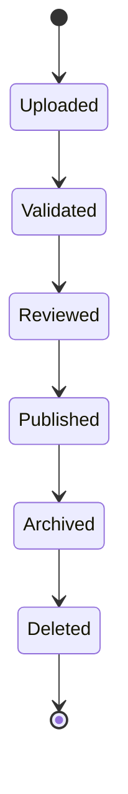

---

## Lifecycle Description

| Status | Description |
|----------|-------------|
| Uploaded | File berhasil diunggah |
| Validated | Format diperiksa |
| Reviewed | Diverifikasi dokter |
| Published | Dapat digunakan |
| Archived | Riwayat lama |
| Deleted | Soft Delete |

---

## Upload Workflow

```text
Choose File

↓

Upload

↓

Virus Scan

↓

Validate Format

↓

Generate Metadata

↓

Generate Thumbnail

↓

Store Object

↓

Save Metadata

↓

Publish Event
```text

---

# 7. Attachment Metadata

Setiap file memiliki metadata yang lengkap.

---

## Metadata Structure

| Field | Description |
|--------|-------------|
| Attachment ID | UUID |
| Patient ID | Owner |
| Visit ID | Visit |
| Category | Photo/X-Ray |
| Subtype | Periapical |
| File Name | Original Name |
| Stored Name | Generated Name |
| Extension | jpg/pdf |
| Mime Type | image/jpeg |
| File Size | Bytes |
| Storage Path | Object Storage |
| Checksum | SHA256 |
| Uploaded By | User |
| Uploaded At | Timestamp |

---

## Additional Metadata

- Tooth Number
- Surface
- Diagnosis
- Procedure
- Doctor
- Branch
- Device
- GPS (Optional)
- Camera Model (Optional)

---

# 8. Storage Architecture

## Storage Design

```text
Next.js

↓

REST API

↓

Attachment Service

↓

Virus Scanner

↓

Object Storage

↓

Metadata Database

↓

CDN

↓

Client
```

---

## Recommended Object Storage

- MinIO
- Amazon S3
- Azure Blob Storage
- Google Cloud Storage

---

## Folder Structure

```text
attachments/

├── patient/

│    ├── {patientId}/

│          ├── visit/

│          │      ├── {visitId}/

│          │             ├── photo/

│          │             ├── xray/

│          │             ├── cbct/

│          │             ├── consent/

│          │             └── pdf/
```text

---

## Storage Rules

- File tidak disimpan di database.
- Database hanya menyimpan metadata.
- Binary disimpan di Object Storage.
- File menggunakan UUID.
- Original filename tetap disimpan.

---

# 9. Clinical Timeline Integration

Seluruh attachment otomatis masuk ke Clinical Timeline.

---

## Timeline Example

```text
08:00

Patient Check In

↓

08:15

Clinical Photo Uploaded

↓

08:18

Periapical X-Ray Uploaded

↓

08:25

Treatment Started

↓

09:10

After Treatment Photo

↓

09:15

Consent Signed
```

---

## Timeline Event

- Attachment Uploaded
- Attachment Updated
- Attachment Archived
- Attachment Deleted
- Annotation Added

---

## Domain Events

Contoh event yang dihasilkan:

- AttachmentUploaded
- AttachmentValidated
- AttachmentPublished
- AttachmentArchived
- AttachmentDeleted

---

# 10. Business Rules

## General Rules

- Seluruh attachment merupakan bagian dari EMR.
- Attachment tidak boleh dihapus secara fisik.
- Penghapusan menggunakan Soft Delete.
- Attachment dapat memiliki beberapa versi.

---

## Clinical Rules

- Attachment dapat dikaitkan dengan:
  - Visit
  - Tooth
  - Surface
  - Procedure
  - Diagnosis

- Dokter dapat memberikan anotasi pada attachment.

---

## Technical Rules

- File wajib melalui proses Virus Scan.
- File wajib memiliki checksum.
- Metadata wajib tersimpan sebelum file dipublikasikan.
- Thumbnail dibuat otomatis untuk file gambar.
- File besar diproses secara asynchronous.

---

## Security Rules

- Hanya pengguna yang berwenang dapat mengakses attachment.
- URL Object Storage tidak boleh diakses langsung.
- Download menggunakan Signed URL yang memiliki masa berlaku.
- Seluruh aktivitas dicatat pada Audit Trail.

---

# Summary

Part **3.3A** mendefinisikan fondasi modul **Clinical Attachment** sebagai pusat penyimpanan seluruh media klinis pada EMR Parakita. Dokumen ini menjelaskan arsitektur penyimpanan, kategori attachment, metadata, lifecycle, integrasi dengan Clinical Timeline, strategi Object Storage, serta business rules dan security model. Dengan pendekatan **metadata-driven**, **immutable storage**, dan **object storage architecture**, modul ini siap mendukung implementasi **Dental X-Ray**, **Clinical Photography**, **CBCT**, **Consent Form**, serta integrasi AI dan layanan cloud pada tahap pengembangan berikutnya.

---

## Next Document

**15-module-emr-part-3.3B.md**

**Dental X-Ray Module, DICOM, PACS Integration & AI Imaging**

---


# Part 3.3B — Dental X-Ray Module, DICOM & PACS Integration

| Document Information |  |
|----------------------|------------------------------------------------|
| Project | Parakita Dental Clinic Management System |
| Module | Electronic Medical Record (EMR) |
| Document | 15-module-emr-part-3.3.md |
| Section | Part 3.3B |
| Version | 1.0.0 |
| Status | Draft |
| Architecture | Clean Architecture + Domain Driven Design |
| Last Updated | July 2026 |

---

# Table of Contents
11. Dental X-Ray Overview
12. Clinical Objectives
13. X-Ray Classification
14. Imaging Workflow
15. DICOM Standard
16. PACS Integration
17. Image Metadata
18. Image Processing Pipeline
19. Image Annotation
20. AI Imaging Ready
21. Business Rules
22. Validation Rules
23. Performance & Security
---

# 11. Dental X-Ray Overview

## 11.1 Introduction

Dental X-Ray Module merupakan komponen utama EMR yang bertanggung jawab mengelola seluruh citra radiografi pasien. Modul ini mendukung penyimpanan, pengelolaan, visualisasi, anotasi, dan distribusi gambar radiologi secara aman.

Modul dirancang agar kompatibel dengan praktik klinik kecil hingga jaringan klinik multi-cabang, serta siap diintegrasikan dengan perangkat radiografi digital dan sistem PACS.

---

## Objectives

- Menyimpan seluruh citra radiologi.
- Mendukung histori radiografi pasien.
- Mempermudah diagnosis.
- Mendukung AI Imaging.
- Mendukung integrasi DICOM.
- Mendukung audit dan legal archive.

---

## Design Principles

- Image Quality Preservation
- Immutable Storage
- Metadata Driven
- DICOM Compatible
- Vendor Neutral
- Cloud Ready
- AI Ready

---

# 12. Clinical Objectives

## Diagnostic Support

Radiografi digunakan untuk:

- Deteksi karies.
- Evaluasi kehilangan tulang alveolar.
- Pemeriksaan periapikal.
- Pemeriksaan impaksi.
- Perencanaan implant.
- Evaluasi endodontik.
- Evaluasi ortodontik.
- Evaluasi pasca operasi.

---

## Clinical Benefits

- Diagnosis lebih akurat.
- Monitoring progres terapi.
- Dokumentasi legal.
- Komunikasi dengan pasien.
- Konsultasi antar dokter.

---

# 13. X-Ray Classification

## Supported Imaging Types

| Category | Description |
|----------|-------------|
| Periapical | Satu atau beberapa gigi |
| Bitewing | Interproximal caries |
| Occlusal | Rahang atas/bawah |
| Panoramic (OPG) | Seluruh rahang |
| Cephalometric | Analisis ortodonti |
| CBCT | 3D volumetric imaging |
| TMJ | Temporomandibular joint |
| Sinus View | Evaluasi sinus maksilaris |

---

## Recommended Use

| Examination | Imaging |
|-------------|---------|
| Caries | Bitewing |
| Root Canal | Periapical |
| Extraction | Periapical |
| Implant | CBCT |
| Orthodontic | Cephalometric |
| Wisdom Tooth | Panoramic |

---

# 14. Imaging Workflow

## Workflow

```text
Patient Visit

↓

Doctor Request

↓

Radiology Examination

↓

Acquire Image

↓

Upload Image

↓

Virus Scan

↓

Metadata Extraction

↓

Generate Thumbnail

↓

Store Object

↓

Save Metadata

↓

Clinical Review

↓

Publish Timeline
```text

---

## Workflow Description

1. Dokter meminta pemeriksaan radiografi.
2. Operator melakukan pengambilan gambar.
3. Sistem memvalidasi file.
4. Metadata diekstrak.
5. File disimpan di Object Storage.
6. Metadata disimpan di database.
7. Timeline EMR diperbarui.

---

# 15. DICOM Standard

## Overview

Sistem mendukung penyimpanan citra dalam format:

- DICOM (.dcm)
- JPEG
- PNG
- TIFF
- PDF (hasil scan)

---

## DICOM Metadata

| Field | Description |
|--------|-------------|
| SOP Instance UID | Identifier |
| Study Instance UID | Study |
| Series Instance UID | Series |
| Modality | DX, CR, CBCT |
| Patient Name | Pasien |
| Patient ID | Medical Record |
| Study Date | Tanggal Pemeriksaan |
| Institution | Cabang Klinik |
| Manufacturer | Vendor Alat |
| Device Model | Model Radiografi |

---

## DICOM Storage

```text
Study

↓

Series

↓

Image

↓

Frame
```

---

## Future Support

- DICOM Query/Retrieve
- DICOMWeb
- WADO-RS
- STOW-RS
- QIDO-RS

---

# 16. PACS Integration

## Overview

Sistem dapat terhubung dengan PACS (Picture Archiving and Communication System).

---

## Architecture

```text
Dental Sensor

↓

Imaging Workstation

↓

PACS

↓

Integration Service

↓

EMR

↓

Object Storage
```text

---

## Supported Integration

- Orthanc PACS
- dcm4chee
- Vendor PACS
- Cloud PACS

---

## Synchronization

- Auto Import
- Manual Import
- Scheduled Sync
- Metadata Synchronization

---

# 17. Image Metadata

## Metadata Fields

| Field | Description |
|--------|-------------|
| Image ID | UUID |
| Patient ID | Patient |
| Visit ID | Visit |
| Imaging Type | Panoramic |
| Tooth Number | Optional |
| Body Region | Maxilla/Mandible |
| Resolution | Pixel |
| File Size | Bytes |
| MIME Type | image/jpeg |
| Acquisition Date | DateTime |
| Uploaded By | User |
| Device | X-Ray Machine |

---

## Clinical Metadata

- Diagnosis
- Procedure
- Tooth
- Surface
- Exposure
- Notes
- Branch
- Operator

---

# 18. Image Processing Pipeline

## Processing Flow

```text
Upload

↓

Virus Scan

↓

Checksum

↓

Metadata Extraction

↓

Compression

↓

Thumbnail

↓

Watermark (Optional)

↓

Encryption

↓

Object Storage

↓

Publish Event
```

---

## Generated Assets

| Asset | Purpose |
|--------|----------|
| Original | Archive |
| Thumbnail | Preview |
| Medium | Web Viewer |
| Annotated | Clinical Discussion |

---

## Processing Rules

- Original file tidak diubah.
- Thumbnail dibuat otomatis.
- Metadata tidak boleh hilang.
- Semua proses dicatat di Audit Trail.

---

# 19. Image Annotation

## Annotation Features

Dokter dapat menambahkan:

- Arrow
- Circle
- Rectangle
- Tooth Marker
- Measurement Line
- Bone Loss Area
- Implant Position
- Clinical Comment

---

## Annotation Layer

```text
Original Image

↓

Annotation Layer

↓

Clinical Overlay

↓

Viewer
```text

---

## Annotation Rules

- Annotation tidak mengubah file asli.
- Semua anotasi disimpan sebagai layer terpisah.
- Setiap revisi menghasilkan versi baru.

---

# 20. AI Imaging Ready

## Future AI Features

- Caries Detection
- Bone Loss Detection
- Periapical Lesion Detection
- Impacted Tooth Detection
- Implant Planning
- Root Canal Analysis
- Sinus Analysis
- Cephalometric Analysis

---

## AI Workflow

```text
Image Upload

↓

AI Queue

↓

Inference

↓

Result

↓

Doctor Review

↓

Accept / Reject

↓

Save Recommendation
```

---

## AI Output Example

```json
{
  "finding": "Possible proximal caries",
  "confidence": 0.94,
  "tooth": "26",
  "region": "Mesial"
}
```text

---

# 21. Business Rules

## General Rules

- Setiap gambar harus terkait dengan Patient dan Visit.
- Satu Visit dapat memiliki banyak gambar.
- File asli bersifat immutable.
- Revisi menghasilkan versi baru.

---

## Clinical Rules

- Dokter dapat mengaitkan gambar dengan:
  - Tooth
  - Surface
  - Diagnosis
  - Procedure
- Annotation hanya dapat dilakukan oleh pengguna yang berwenang.

---

## Integration Rules

Terintegrasi dengan:

- EMR
- Odontogram
- Clinical Timeline
- Treatment Plan
- Reporting
- AI Module

---

# 22. Validation Rules

## Upload Validation

| Rule | Value |
|------|-------|
| File Required | Yes |
| Max Size | Configurable |
| Allowed Format | DICOM, JPG, PNG, TIFF, PDF |
| Virus Scan | Mandatory |
| Checksum | Mandatory |

---

## Metadata Validation

- Patient wajib ada.
- Visit wajib aktif.
- Tanggal akuisisi tidak boleh melebihi waktu server.
- Device dapat dikonfigurasi per cabang.

---

## Clinical Validation

- Tooth Number harus mengikuti standar FDI.
- Diagnosis opsional namun direkomendasikan.
- Annotation harus memiliki pembuat (creator).

---

# 23. Performance & Security

## Performance Target

| Metric | Target |
|---------|--------|
| Upload Image | < 5 detik |
| Generate Thumbnail | < 2 detik |
| Open Viewer | < 1 detik |
| Metadata Search | < 300 ms |

---

## Security

- File dienkripsi saat disimpan (at rest).
- Transfer menggunakan HTTPS/TLS.
- Akses file menggunakan Signed URL.
- Seluruh aktivitas dicatat pada Audit Trail.
- Role Based Access Control (RBAC) diterapkan untuk melihat, mengunggah, mengedit anotasi, dan mengarsipkan gambar.

---

## Backup Strategy

- Incremental Backup harian.
- Full Backup mingguan.
- Replikasi Object Storage lintas lokasi (opsional).
- Metadata database dibackup terpisah dari file biner.

---

# Summary

Part **3.3B** mendefinisikan modul **Dental X-Ray** sebagai fondasi pengelolaan citra radiologi pada EMR Parakita. Dokumen ini mencakup klasifikasi radiografi, workflow akuisisi gambar, dukungan **DICOM** dan **PACS**, metadata klinis, image processing pipeline, annotation layer, kesiapan integrasi AI, serta aturan validasi, keamanan, dan performa. Dengan arsitektur ini, modul radiologi siap mendukung implementasi klinik modern, integrasi perangkat digital, serta pengembangan AI untuk diagnosis berbantuan komputer.

---

## Next Document

**15-module-emr-part-3.3C.md**

**Clinical Photography Module, Image Comparison, Smile Design & Progress Documentation**

---


# Part 3.3C — Clinical Photography Module, Image Comparison & Smile Design

| Document Information |  |
|----------------------|------------------------------------------------|
| Project | Parakita Dental Clinic Management System |
| Module | Electronic Medical Record (EMR) |
| Document | 15-module-emr-part-3.3.md |
| Section | Part 3.3C |
| Version | 1.0.0 |
| Status | Draft |
| Architecture | Clean Architecture + Domain Driven Design |
| Last Updated | July 2026 |

---

# Table of Contents
24. Clinical Photography Overview
25. Photography Categories
26. Clinical Photography Workflow
27. Image Metadata
28. Image Comparison
29. Smile Design Documentation
30. Image Annotation
31. Image Versioning
32. Watermark & Thumbnail
33. Validation Rules
34. Business Rules
35. Security & Performance
---

# 24. Clinical Photography Overview

## 24.1 Introduction

Clinical Photography merupakan bagian penting dari Electronic Medical Record (EMR) yang digunakan untuk mendokumentasikan kondisi klinis pasien secara visual.

Selain sebagai dokumentasi medis, foto klinis juga digunakan untuk:

- Diagnosis
- Treatment Planning
- Patient Education
- Progress Monitoring
- Legal Documentation
- Insurance Claim
- Scientific Publication (dengan persetujuan pasien)

Seluruh foto klinis merupakan bagian dari rekam medis dan memiliki nilai legal yang sama dengan data klinis lainnya.

---

## Objectives

- Mendokumentasikan kondisi pasien.
- Mendukung evaluasi hasil perawatan.
- Mempermudah komunikasi dokter dan pasien.
- Mendukung Smile Design.
- Mendukung AI Image Analysis.

---

## Design Principles

- High Resolution
- Original Image Preservation
- Version Controlled
- AI Ready
- Cloud Storage Ready
- Metadata Driven
- Audit Ready

---

# 25. Photography Categories

## Extra Oral Photography

Digunakan untuk dokumentasi wajah pasien.

### Standard Views

- Frontal Neutral
- Frontal Smile
- Right Profile
- Left Profile
- Three Quarter Right
- Three Quarter Left

---

## Intra Oral Photography

Standar dokumentasi intraoral meliputi:

- Frontal Occlusion
- Right Buccal
- Left Buccal
- Maxillary Occlusal
- Mandibular Occlusal

---

## Clinical Close-Up

Digunakan untuk:

- Tooth Fracture
- Caries
- Gingival Lesion
- Implant Area
- Surgical Site
- Orthodontic Bracket
- Restoration

---

## Orthodontic Photography

- Before Treatment
- Monthly Progress
- After Treatment

---

## Implant Photography

- Implant Planning
- Surgery
- Healing
- Prosthesis Installation

---

## Smile Design Photography

- Natural Smile
- Full Smile
- Lip at Rest
- Dynamic Smile
- Video Smile

---

## Photography Matrix

| Category | Before | During | After |
|-----------|---------|---------|-------|
| Extra Oral | ✔ | ✔ | ✔ |
| Intra Oral | ✔ | ✔ | ✔ |
| Implant | ✔ | ✔ | ✔ |
| Surgery | ✔ | ✔ | ✔ |
| Orthodontic | ✔ | ✔ | ✔ |
| Esthetic | ✔ | ✔ | ✔ |

---

# 26. Clinical Photography Workflow

## Workflow

```text
Patient Visit

↓

Doctor Requests Photo

↓

Capture Image

↓

Preview

↓

Retake (Optional)

↓

Upload

↓

Virus Scan

↓

Metadata Extraction

↓

Thumbnail Generation

↓

Save Object Storage

↓

Save Metadata

↓

Clinical Timeline
```

---

## Sequence

```mermaid
sequenceDiagram

Doctor->>Camera : Capture Photo

Camera->>Frontend : Upload

Frontend->>API : Multipart Request

API->>Storage : Save File

Storage-->>API : File URL

API->>Database : Save Metadata

Database-->>API : Success

API-->>Frontend : Upload Success
```text

---

# 27. Image Metadata

## Standard Metadata

| Field | Description |
|--------|-------------|
| Photo ID | UUID |
| Patient ID | Patient |
| Visit ID | Visit |
| Photo Type | Intra Oral |
| Category | Progress |
| Tooth Number | Optional |
| Surface | Optional |
| Camera Device | Device |
| Photographer | User |
| Resolution | Pixel |
| Orientation | Portrait/Landscape |
| File Size | Bytes |
| MIME Type | image/jpeg |
| Capture Date | DateTime |
| Upload Date | DateTime |

---

## EXIF Metadata

Jika tersedia, sistem menyimpan:

- Camera Model
- Lens
- ISO
- Aperture
- Exposure
- White Balance
- Flash
- GPS (Opsional)

---

## Clinical Metadata

- Procedure
- Diagnosis
- Treatment Phase
- Smile Design Stage
- Notes

---

# 28. Image Comparison

## Overview

Dokter dapat membandingkan dua atau lebih foto dari kunjungan yang berbeda untuk mengevaluasi progres perawatan.

---

## Comparison Types

- Before vs After
- Visit vs Visit
- Orthodontic Progress
- Implant Healing
- Surgery Recovery
- Whitening Progress
- Gingival Healing

---

## Comparison Layout

```text
+----------------+----------------+

 BEFORE          AFTER

 Visit #1        Visit #6

+----------------+----------------+
```

---

## Timeline Comparison

```text
Visit 1

↓

Visit 2

↓

Visit 5

↓

Visit 10

↓

Treatment Completed
```text

---

## Features

- Side by Side
- Overlay Comparison
- Zoom Sync
- Pan Sync
- Fullscreen
- Annotation Sync

---

# 29. Smile Design Documentation

## Overview

Smile Design mendokumentasikan perubahan estetik pasien selama proses perawatan.

---

## Smile Analysis

- Smile Line
- Midline
- Gingival Display
- Tooth Proportion
- Buccal Corridor
- Lip Position

---

## Smile Design Workflow

```text
Before Photo

↓

Smile Analysis

↓

Treatment Planning

↓

Mock-up

↓

Trial Smile

↓

Final Restoration

↓

After Photo
```

---

## Smile Design Assets

- Photo
- Video
- Digital Mock-up
- Wax-up
- CAD Design
- STL Model

---

# 30. Image Annotation

## Annotation Tools

- Arrow
- Freehand Drawing
- Circle
- Rectangle
- Tooth Marker
- Surface Marker
- Measurement Line
- Text Note

---

## Annotation Layer

```text
Original Image

↓

Annotation Layer

↓

Clinical Overlay

↓

Viewer
```text

---

## Annotation Rules

- Original image tidak berubah.
- Annotation disimpan terpisah.
- Setiap revisi menghasilkan versi baru.

---

# 31. Image Versioning

## Version Lifecycle

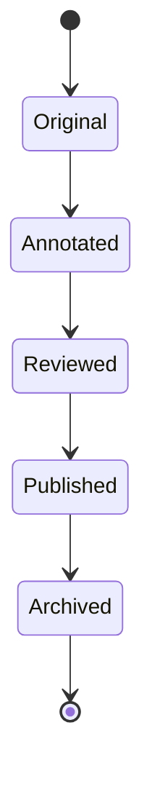

---

## Version Structure

| Version | Description |
|-----------|-------------|
| Original | File asli |
| Edited | Koreksi minor |
| Annotated | Dengan anotasi |
| Reviewed | Diverifikasi |
| Published | Digunakan |
| Archived | Riwayat |

---

## Version Rules

- Original tidak pernah diubah.
- Annotation tidak mengubah original.
- Riwayat versi permanen.

---

# 32. Watermark & Thumbnail

## Thumbnail

Thumbnail otomatis dibuat untuk:

- Gallery
- Timeline
- Search Result
- Mobile Preview

---

## Watermark

Opsional sesuai konfigurasi.

Informasi watermark dapat berupa:

- Clinic Name
- Branch
- Date
- Patient MRN (Masked)
- Doctor

---

## Image Compression

Pipeline:

```text
Original

↓

Lossless Compression

↓

Medium Resolution

↓

Thumbnail

↓

Preview
```text

Original image selalu dipertahankan.

---

# 33. Validation Rules

## Upload Validation

| Rule | Value |
|------|-------|
| File Required | Yes |
| Max Size | Configurable |
| Allowed Format | JPG, JPEG, PNG, HEIC, WEBP |
| Virus Scan | Mandatory |
| Checksum | Mandatory |

---

## Clinical Validation

- Patient wajib ada.
- Visit wajib aktif.
- Kategori foto wajib dipilih.
- Tanggal pengambilan tidak boleh melebihi waktu server.
- Tooth Number mengikuti standar FDI jika diisi.

---

## Image Validation

- Resolusi minimum dapat dikonfigurasi.
- Metadata wajib lengkap.
- File rusak (corrupt) ditolak.
- Duplicate upload dapat dideteksi menggunakan checksum.

---

# 34. Business Rules

## General Rules

- Foto klinis merupakan bagian dari EMR.
- Setiap foto terkait dengan Patient dan Visit.
- Foto tidak boleh dihapus secara permanen.
- Soft Delete digunakan untuk penghapusan.

---

## Clinical Rules

Foto dapat dikaitkan dengan:

- Tooth
- Surface
- Diagnosis
- Procedure
- Treatment Plan
- Smile Design
- Orthodontic Progress

---

## Timeline Rules

Setiap upload menghasilkan event:

- Photo Uploaded
- Photo Reviewed
- Photo Annotated
- Photo Archived

---

## Integration Rules

Terintegrasi dengan:

- EMR
- Clinical Timeline
- Odontogram
- Treatment Plan
- X-Ray Module
- Consent Form
- AI Imaging

---

# 35. Security & Performance

## Security

- File disimpan terenkripsi.
- Transfer menggunakan HTTPS/TLS.
- Download menggunakan Signed URL.
- Role Based Access Control (RBAC).
- Semua aktivitas dicatat pada Audit Trail.

---

## Performance Target

| Metric | Target |
|---------|--------|
| Upload Photo | < 3 detik |
| Generate Thumbnail | < 1 detik |
| Open Gallery | < 500 ms |
| Compare Image | < 1 detik |
| Timeline Load | < 500 ms |

---

## Recommended Enhancements

### AI Ready

- AI Smile Analysis
- AI Tooth Shade Detection
- AI Gingival Analysis
- AI Face Symmetry
- AI Progress Comparison

### Future Device Integration

- DSLR Camera
- Mirrorless Camera
- Smartphone Camera
- Intra Oral Camera
- USB Dental Camera

---

# Summary

Part **3.3C** mendefinisikan modul **Clinical Photography** sebagai sistem dokumentasi visual pasien pada EMR Parakita. Modul ini mencakup kategori foto klinis, workflow pengambilan dan penyimpanan gambar, metadata, fitur **before-after comparison**, **Smile Design**, annotation layer, versioning, watermark, validasi, keamanan, serta integrasi dengan Clinical Timeline, Odontogram, Treatment Plan, dan AI Imaging. Arsitektur ini memastikan seluruh dokumentasi foto klinis tersimpan secara aman, historis, dan siap digunakan sebagai bagian dari rekam medis digital maupun pengembangan fitur AI di masa depan.

---

## Next Document

**15-module-emr-part-3.3D.md**

**Digital Consent Form, Electronic Signature, Legal Archive & PDF Generation**

---


# Part 3.3D — Digital Consent Form, Electronic Signature & Legal Archive

| Document Information |  |
|----------------------|------------------------------------------------|
| Project | Parakita Dental Clinic Management System |
| Module | Electronic Medical Record (EMR) |
| Document | 15-module-emr-part-3.3.md |
| Section | Part 3.3D |
| Version | 1.0.0 |
| Status | Draft |
| Architecture | Clean Architecture + Domain Driven Design |
| Last Updated | July 2026 |

---

# Table of Contents
38. Digital Consent Form Overview
39. Consent Categories
40. Electronic Signature
41. Consent Workflow
42. PDF Generation
43. Legal Archive
44. Patient Verification
45. Audit Trail
46. Version Management
47. Security & Compliance
48. Business Rules
49. Validation Rules
50. Future Enhancement
---

# 38. Digital Consent Form Overview

## 38.1 Introduction

Digital Consent Form merupakan modul yang bertanggung jawab mengelola seluruh dokumen persetujuan tindakan medis secara elektronik.

Consent merupakan bagian yang tidak terpisahkan dari rekam medis dan harus dapat dibuktikan secara hukum apabila diperlukan.

Setiap consent tersimpan secara permanen, memiliki histori lengkap, serta dapat diverifikasi kembali.

---

## Objectives

Digital Consent digunakan untuk:

- Persetujuan tindakan medis
- Persetujuan anestesi
- Persetujuan operasi
- Persetujuan pencabutan gigi
- Persetujuan implant
- Persetujuan orthodontic
- Persetujuan publikasi foto
- Persetujuan penggunaan AI
- Persetujuan telemedicine

---

## Design Principles

- Legally Traceable
- Immutable
- Version Controlled
- Digitally Signed
- Audit Ready
- Cloud Ready
- Paperless
- Offline Ready

---

# 39. Consent Categories

## General Consent

Ditandatangani saat pasien pertama kali datang.

Meliputi:

- Persetujuan registrasi
- Persetujuan pemeriksaan
- Kebijakan privasi
- Pengolahan data pribadi

---

## Clinical Consent

Digunakan sebelum tindakan klinis.

Contoh:

- Scaling
- Filling
- Extraction
- Root Canal
- Crown
- Bridge
- Denture
- Implant
- Veneer

---

## Surgical Consent

Untuk tindakan bedah.

Contoh:

- Odontectomy
- Flap Surgery
- Implant Surgery
- Bone Graft
- Sinus Lift

---

## Orthodontic Consent

- Braces
- Clear Aligner
- Retainer
- Tooth Movement

---

## Esthetic Consent

- Whitening
- Veneer
- Smile Design
- Gingival Contouring

---

## Publication Consent

- Clinical Photography
- Scientific Publication
- Training
- Marketing
- AI Dataset

---

## Consent Matrix

| Consent Type | Required | Expiration |
|---------------|----------|------------|
| General | Yes | Never |
| Treatment | Yes | Per Visit |
| Surgery | Yes | Per Procedure |
| Implant | Yes | Per Procedure |
| Orthodontic | Yes | Treatment End |
| Publication | Optional | Configurable |

---

# 40. Electronic Signature

## Supported Signature Types

- Finger Signature
- Stylus Signature
- Mouse Signature
- Uploaded Signature
- QR Signature
- PKI Digital Signature (Future)

---

## Signature Workflow

```text
Patient Review

↓

Read Consent

↓

Accept

↓

Draw Signature

↓

Validate

↓

Generate Hash

↓

Timestamp

↓

Lock PDF

↓

Archive
```

---

## Signature Metadata

| Field | Description |
|--------|-------------|
| Signature ID | UUID |
| Signer | Patient |
| Relationship | Self / Guardian |
| IPAddress | Optional |
| Device | Tablet |
| Browser | Browser |
| Timestamp | UTC |
| Hash | SHA256 |

---

## Guardian Support

Consent dapat ditandatangani oleh:

- Patient
- Father
- Mother
- Husband
- Wife
- Legal Guardian

---

# 41. Consent Workflow

## BPMN

```mermaid
flowchart LR

    A_Doctor_Creates_Consent["A[Doctor Creates Consent]"] --> B_Patient_Review["B[Patient Review]"]
    B_Patient_Review["B[Patient Review]"] --> C_Agree["C{Agree?}"]
    C_Agree["C{Agree?}"] --> C_No_D_Cancel["C--No-->D[Cancel]"]
    C_No_D_Cancel["C--No-->D[Cancel]"] --> C_Yes_E_Electronic_Signature["C--Yes-->E[Electronic Signature]"]
    C_Yes_E_Electronic_Signature["C--Yes-->E[Electronic Signature]"] --> F_Generate_PDF["F[Generate PDF]"]
    F_Generate_PDF["F[Generate PDF]"] --> G_Store_Archive["G[Store Archive]"]
    G_Store_Archive["G[Store Archive]"] --> H_Timeline_Updated["H[Timeline Updated]"]
    H_Timeline_Updated["H[Timeline Updated]"] --> I_Finish["I[Finish]"]
```text

---

## Sequence Diagram

```mermaid
sequenceDiagram

Doctor->>EMR: Create Consent

EMR->>Patient Tablet: Display Consent

Patient->>Tablet: Read

Patient->>Tablet: Sign

Tablet->>EMR: Signature

EMR->>PDF Engine: Generate PDF

PDF Engine-->>EMR: PDF

EMR->>Storage: Archive

Storage-->>EMR: Success
```

---

# 42. PDF Generation

## PDF Content

PDF otomatis berisi:

- Clinic Logo
- Clinic Information
- Patient Identity
- Doctor Identity
- Consent Content
- Procedure
- Risk Information
- Benefit
- Alternative Treatment
- Signature
- QR Verification
- Timestamp

---

## PDF Structure

```text
Header

↓

Patient Information

↓

Procedure

↓

Medical Explanation

↓

Risk

↓

Alternative

↓

Consent Statement

↓

Signature

↓

Verification

↓

Footer
```text

---

## PDF Rules

- Tidak dapat diedit.
- Memiliki checksum.
- Memiliki QR Verification.
- Memiliki nomor dokumen.

---

# 43. Legal Archive

## Archive Lifecycle

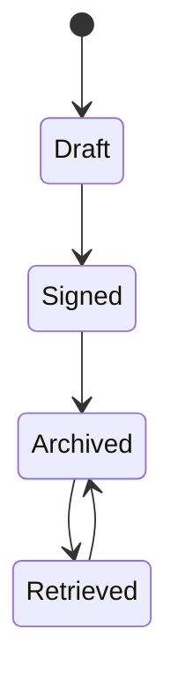

---

## Storage Rules

- PDF disimpan di Object Storage.
- Metadata disimpan di Database.
- Backup otomatis.
- Tidak boleh dihapus permanen.

---

## Archive Metadata

| Field | Description |
|--------|-------------|
| Consent ID | UUID |
| Patient ID | UUID |
| Visit ID | UUID |
| Document Number | Generated |
| Version | Version |
| Signed Date | Date |
| Archive Path | Storage |
| Checksum | SHA256 |

---

# 44. Patient Verification

## Verification Methods

- OTP SMS
- OTP WhatsApp
- OTP Email
- PIN
- Biometric (Future)
- Face Recognition (Future)

---

## Identity Verification

Minimal dilakukan dengan:

- Nama
- Tanggal Lahir
- Nomor Rekam Medis

---

## Verification Workflow

```text
Open Consent

↓

Verify Identity

↓

Read Consent

↓

Accept

↓

Sign

↓

Archive
```text

---

# 45. Audit Trail

## Logged Activities

- Consent Created
- Consent Opened
- Consent Modified
- Consent Signed
- Consent Printed
- Consent Downloaded
- Consent Archived
- Consent Viewed

---

## Audit Fields

| Field | Description |
|--------|-------------|
| Audit ID | UUID |
| Consent ID | UUID |
| User | Actor |
| Action | Event |
| IPAddress | Optional |
| Device | Browser/Tablet |
| Timestamp | UTC |

---

# 46. Version Management

## Version Lifecycle

```text
Version 1

↓

Revision

↓

Version 2

↓

Revision

↓

Version 3
```

---

## Version Rules

- Seluruh versi disimpan.
- Tidak ada overwrite.
- PDF lama tetap tersedia.
- Riwayat perubahan dapat dibandingkan.

---

## Version Metadata

- Version Number
- Created By
- Created Date
- Change Summary
- Previous Version

---

# 47. Security & Compliance

## Security

- HTTPS Only
- AES Encryption at Rest
- Signed URL Download
- JWT Authentication
- RBAC Authorization
- Audit Trail Mandatory

---

## Compliance

Modul dirancang agar dapat memenuhi kebutuhan:

- Rekam Medis Elektronik
- Perlindungan Data Pribadi
- Audit Internal
- Akreditasi Klinik
- ISO 27001 (Ready)

---

## Backup Strategy

- Daily Incremental Backup
- Weekly Full Backup
- Cross Region Replication
- Disaster Recovery Plan

---

# 48. Business Rules

## General Rules

- Setiap tindakan medis yang membutuhkan persetujuan wajib memiliki Consent Form.
- Consent menjadi bagian permanen dari EMR.
- Setelah ditandatangani, consent tidak dapat diubah.

---

## Clinical Rules

Consent harus dikaitkan dengan:

- Patient
- Visit
- Procedure
- Doctor
- Branch

---

## Legal Rules

- Semua tanda tangan memiliki timestamp.
- PDF final bersifat immutable.
- Hash wajib disimpan.
- Semua aktivitas memiliki Audit Trail.

---

# 49. Validation Rules

## Consent Validation

- Patient wajib aktif.
- Visit wajib aktif.
- Procedure wajib dipilih.
- Template consent wajib tersedia.

---

## Signature Validation

- Signature wajib ada.
- Signer wajib valid.
- Timestamp wajib tersedia.
- Hash wajib dibuat.

---

## Archive Validation

- PDF berhasil dibuat.
- Metadata lengkap.
- Checksum sesuai.
- Storage berhasil.

---

# 50. Future Enhancement

## Phase 2

- Multi Language Consent
- Dynamic Template Builder
- Doctor Digital Signature
- Witness Signature
- Bulk Consent

---

## Phase 3

- PKI Digital Certificate
- Blockchain Verification
- e-Meterai Integration
- National Identity Verification
- Video Consent Recording

---

## Phase 4

- AI Consent Summary
- Voice Consent
- OCR Paper Consent
- Smart Legal Validation
- Cross Hospital Verification

---

# Summary

Part **3.3D** mendefinisikan modul **Digital Consent Form** sebagai sistem persetujuan tindakan medis elektronik yang terintegrasi dengan EMR Parakita. Dokumen ini mencakup jenis-jenis consent, alur persetujuan digital, **electronic signature**, pembuatan PDF yang immutable, **legal archive**, verifikasi identitas pasien, audit trail, version management, keamanan, serta aturan bisnis dan validasi. Dengan desain ini, seluruh dokumen persetujuan tersimpan secara aman, dapat diaudit, memenuhi kebutuhan dokumentasi klinis, dan siap dikembangkan menuju integrasi **PKI**, **e-Meterai**, serta teknologi verifikasi digital di masa depan.

---

# Next Document

**15-module-emr-part-3.3E.md**

**Technical Design, Domain Model, ERD, Repository, Service Layer, OpenAPI 3.1, Object Storage Architecture, CDN, Disaster Recovery & Acceptance Test**


---


# Part 3.3E — Technical Design, Domain Model, OpenAPI & Storage Architecture

| Document Information |  |
|----------------------|------------------------------------------------|
| Project | Parakita Dental Clinic Management System |
| Module | Electronic Medical Record (EMR) |
| Document | 15-module-emr-part-3.3.md |
| Section | Part 3.3E |
| Version | 1.0.0 |
| Status | Draft |
| Architecture | Clean Architecture + Domain Driven Design |
| Last Updated | July 2026 |

---

# Table of Contents
51. Domain Model
52. Aggregate Design
53. Entity Relationship Diagram
54. Repository Layer
55. Service Layer
56. Domain Events
57. Sequence Diagram
58. BPMN Upload Attachment
59. Activity Diagram
60. OpenAPI 3.1 Specification
61. Object Storage Architecture
62. CDN Architecture
63. Backup & Disaster Recovery
64. Acceptance Test
65. Future Enhancement
---

# 51. Domain Model

## Overview

Seluruh file klinis dikelola menggunakan pendekatan **Domain-Driven Design (DDD)** dengan **ClinicalAttachment** sebagai Aggregate Root.

```text
Patient

↓

Visit

↓

Clinical Attachment

├── Clinical Photo

├── Dental X-Ray

├── CBCT

├── Consent Form

├── Laboratory Result

├── Referral Letter

├── Insurance Attachment

└── Other Attachment
```text

---

## Aggregate Root

```mermaid
classDiagram

class ClinicalAttachment{

+UUID id

+UUID patientId

+UUID visitId

+AttachmentCategory category

+AttachmentStatus status

+Integer version

}

class AttachmentMetadata

class Annotation

class Thumbnail

class Audit

ClinicalAttachment "1" --> "1" AttachmentMetadata

ClinicalAttachment "1" --> "*" Annotation

ClinicalAttachment "1" --> "*" Thumbnail

ClinicalAttachment "1" --> "*" Audit
```

---

## Value Objects

- Attachment Category
- Attachment Type
- Storage Path
- File Hash
- MIME Type
- Image Resolution
- File Size
- Version Number

---

# 52. Aggregate Design

## Aggregate Structure

```text
ClinicalAttachment

│

├── Metadata

├── Annotation

├── Thumbnail

├── Version

├── Audit

└── Timeline
```text

---

## Aggregate Responsibilities

- Upload File
- Validate File
- Generate Thumbnail
- Generate Metadata
- Generate Version
- Archive File
- Publish Domain Event

---

## Aggregate Rules

- Original file immutable.
- Metadata tidak boleh hilang.
- Annotation tersimpan terpisah.
- Version bersifat immutable.

---

# 53. Entity Relationship Diagram

## ERD

```mermaid
erDiagram

PATIENT ||--o{ VISIT : has

VISIT ||--o{ CLINICAL_ATTACHMENT : contains

CLINICAL_ATTACHMENT ||--o{ ATTACHMENT_METADATA : has

CLINICAL_ATTACHMENT ||--o{ ATTACHMENT_VERSION : has

CLINICAL_ATTACHMENT ||--o{ ATTACHMENT_ANNOTATION : has

CLINICAL_ATTACHMENT ||--o{ ATTACHMENT_AUDIT : has
```

---

## Main Tables

| Table | Description |
|---------|-------------|
| clinical_attachments | Attachment master |
| attachment_metadata | Metadata |
| attachment_versions | Version history |
| attachment_annotations | Annotation layer |
| attachment_audits | Audit log |
| attachment_tags | Clinical tags |
| attachment_access_logs | Access history |

---

## Recommended Index

```text
patient_id

visit_id

attachment_type

created_at

status

doctor_id

branch_id
```typescript

---

# 54. Repository Layer

## Repository Interface

```typescript
interface IClinicalAttachmentRepository{

create();

findById();

findByVisit();

findByPatient();

save();

archive();

softDelete();

}
```

---

## Metadata Repository

```typescript
interface IAttachmentMetadataRepository{

saveMetadata();

updateMetadata();

findMetadata();

}
```typescript

---

## Version Repository

```typescript
interface IAttachmentVersionRepository{

createVersion();

findHistory();

restoreVersion();

}
```

---

## Annotation Repository

```typescript
interface IAttachmentAnnotationRepository{

addAnnotation();

updateAnnotation();

deleteAnnotation();

}
```text

---

# 55. Service Layer

## ClinicalAttachmentService

Responsibilities:

- Upload Attachment
- Validate Attachment
- Publish Attachment
- Archive Attachment

---

## ImageProcessingService

Responsibilities:

- Generate Thumbnail
- Compress Image
- Generate Preview
- Watermark
- Extract EXIF

---

## StorageService

Responsibilities:

- Upload Object
- Download Object
- Delete Object
- Generate Signed URL

---

## AntivirusService

Responsibilities:

- Virus Scan
- Malware Detection
- Quarantine

---

## MetadataService

Responsibilities:

- Extract Metadata
- Save Metadata
- Validate Metadata

---

## TimelineService

Responsibilities:

- Publish Timeline
- Generate History
- Sync Timeline

---

# 56. Domain Events

## Event Flow

```text
AttachmentUploaded

↓

MetadataExtracted

↓

ThumbnailGenerated

↓

AttachmentPublished

↓

AttachmentAnnotated

↓

AttachmentArchived

↓

AttachmentDeleted
```

---

## Event Payload

```json
{
  "eventId":"UUID",
  "eventName":"AttachmentUploaded",
  "patientId":"UUID",
  "visitId":"UUID",
  "attachmentId":"UUID",
  "attachmentType":"XRAY",
  "uploadedBy":"UUID",
  "uploadedAt":"2026-07-31T10:00:00Z"
}
```sql

---

## Event Consumers

- Clinical Timeline
- Audit Module
- Notification
- Reporting
- AI Imaging
- Data Warehouse

---

# 57. Sequence Diagram

## Upload Attachment

```mermaid
sequenceDiagram

Doctor->>Frontend : Select File

Frontend->>API : Upload Multipart

API->>Antivirus : Scan File

Antivirus-->>API : Clean

API->>Storage : Upload Object

Storage-->>API : Object URL

API->>Metadata : Extract Metadata

Metadata-->>API : Metadata

API->>Database : Save Metadata

Database-->>API : Success

API->>Timeline : Publish Event

Timeline-->>Doctor : Upload Success
```

---

## Download Attachment

```mermaid
sequenceDiagram

Doctor->>Frontend : Open Image

Frontend->>API : Request

API->>Storage : Generate Signed URL

Storage-->>API : URL

API-->>Frontend : Signed URL

Frontend->>Storage : Download Image
```text

---

# 58. BPMN Upload Attachment

```mermaid
flowchart TD

    Start --> Choose_File["Choose File"]
    Choose_File["Choose File"] --> Virus_Scan["Virus Scan"]
    Virus_Scan["Virus Scan"] --> Validate_File["Validate File"]
    Validate_File["Validate File"] --> Extract_Metadata["Extract Metadata"]
    Extract_Metadata["Extract Metadata"] --> Generate_Thumbnail["Generate Thumbnail"]
    Generate_Thumbnail["Generate Thumbnail"] --> Upload_Object["Upload Object"]
    Upload_Object["Upload Object"] --> Save_Metadata["Save Metadata"]
    Save_Metadata["Save Metadata"] --> Generate_Version["Generate Version"]
    Generate_Version["Generate Version"] --> Publish_Event["Publish Event"]
    Publish_Event["Publish Event"] --> Finish
```

---

# 59. Activity Diagram

```mermaid
flowchart TD

    Upload --> Scan
    Scan --> Store
    Store --> Metadata
    Metadata --> Timeline
    Timeline --> Audit
    Audit --> Complete
```text

---

## Activity Description

| Activity | Description |
|----------|-------------|
| Scan | Antivirus |
| Store | Object Storage |
| Metadata | Metadata Extraction |
| Timeline | Clinical Timeline |
| Audit | Activity Log |

---

# 60. OpenAPI 3.1 Specification

## Upload Attachment

```http
POST /api/v1/emr/attachments
```

---

### Multipart Form

```text
patientId

visitId

category

attachmentType

file
```text

---

### Response

```json
{
  "success":true,
  "data":{
     "attachmentId":"UUID"
  }
}
```

---

## Get Attachment

```http
GET /api/v1/emr/attachments/{id}
```text

---

## Download Attachment

```http
GET /api/v1/emr/attachments/{id}/download
```

---

## Add Annotation

```http
POST /api/v1/emr/attachments/{id}/annotations
```text

---

## Get Timeline Attachment

```http
GET /api/v1/emr/visits/{visitId}/attachments
```

---

## Archive Attachment

```http
POST /api/v1/emr/attachments/{id}/archive
```text

---

## Restore Version

```http
POST /api/v1/emr/attachments/{id}/versions/{version}/restore
```

---

# 61. Object Storage Architecture

## Architecture

```text
Next.js

↓

Express API

↓

Attachment Service

↓

Redis Queue

↓

Object Storage

↓

Metadata Database

↓

CDN

↓

Client
```text

---

## Storage Layout

```text
bucket/

├── patient/

│   ├── patientId/

│       ├── visitId/

│       │    ├── photo/

│       │    ├── xray/

│       │    ├── cbct/

│       │    ├── consent/

│       │    ├── laboratory/

│       │    └── referral/
```

---

## Recommended Providers

- MinIO
- Amazon S3
- Azure Blob Storage
- Google Cloud Storage

---

# 62. CDN Architecture

## Purpose

CDN digunakan untuk:

- Thumbnail Delivery
- Preview Image
- Faster Download
- Multi Branch Access

---

## Architecture

```text
Storage

↓

CDN

↓

Regional Cache

↓

Client
```text

---

## Cache Policy

| Asset | Cache |
|--------|-------|
| Thumbnail | 24 Hours |
| Preview | 12 Hours |
| Original | No Cache |
| PDF Consent | No Cache |

---

# 63. Backup & Disaster Recovery

## Backup Strategy

| Backup | Schedule |
|----------|----------|
| Incremental | Daily |
| Full | Weekly |
| Archive | Monthly |

---

## Disaster Recovery

```text
Primary Storage

↓

Replication

↓

Secondary Storage

↓

Restore

↓

Verification
```

---

## Recovery Target

| Metric | Target |
|----------|---------|
| RPO | ≤15 Minutes |
| RTO | ≤1 Hour |
| Availability | 99.9% |

---

# 64. Acceptance Test

## Functional Test

| Test | Expected Result |
|------|----------------|
| Upload Photo | Success |
| Upload X-Ray | Success |
| Generate Thumbnail | Automatic |
| Extract Metadata | Success |
| Add Annotation | Success |
| Generate Version | Automatic |
| Archive Attachment | Success |

---

## Security Test

- Signed URL berfungsi.
- Unauthorized User ditolak.
- Malware File ditolak.
- Audit Trail tercatat.

---

## Performance Test

| Scenario | Target |
|-----------|--------|
| Upload 20 MB | <5 detik |
| Thumbnail | <2 detik |
| Metadata Search | <300 ms |
| Preview Image | <1 detik |

---

## Integration Test

Pastikan terintegrasi dengan:

- EMR
- Clinical Timeline
- Odontogram
- Periodontal Assessment
- Treatment Plan
- Billing
- Notification
- Reporting
- AI Imaging

---

# 65. Future Enhancement

## Phase 2

- DICOMWeb Support
- PACS Synchronization
- Video Streaming
- OCR PDF
- Bulk Upload

---

## Phase 3

- AI Caries Detection
- AI Bone Loss Detection
- AI Smile Design
- AI Image Classification
- AI Clinical Summary

---

## Phase 4

- 3D STL Viewer
- CBCT Volume Rendering
- Cloud PACS
- Image Sharing Portal
- FHIR ImagingStudy Integration
- HL7 Integration

---

# Summary

Part **3.3E** melengkapi desain teknis modul **Clinical Attachment** dengan pendekatan **Clean Architecture** dan **Domain-Driven Design (DDD)**. Dokumen ini mendefinisikan **Domain Model**, **Aggregate Design**, **ERD**, **Repository Layer**, **Service Layer**, **Domain Events**, **Sequence Diagram**, **BPMN**, **OpenAPI 3.1**, arsitektur **Object Storage**, **CDN**, strategi **Backup & Disaster Recovery**, serta **Acceptance Test**. Dengan rancangan ini, modul Attachment siap menangani penyimpanan media klinis berskala enterprise, mendukung object storage seperti **Amazon S3** atau **MinIO**, integrasi AI Imaging, serta memenuhi kebutuhan audit, keamanan, dan skalabilitas untuk jaringan klinik multi-cabang.

---

# End of Document

## Completed

**15-module-emr-part-3.3.md**

- ✅ Part 3.3A — Clinical Attachment Foundation
- ✅ Part 3.3B — Dental X-Ray, DICOM & PACS
- ✅ Part 3.3C — Clinical Photography & Smile Design
- ✅ Part 3.3D — Digital Consent & Legal Archive
- ✅ Part 3.3E — Technical Design, Storage Architecture & OpenAPI

---

# Next Document

**15-module-emr-part-3.4.md**

**Clinical Timeline, EMR History, Visit Summary & Longitudinal Patient Record**


---


# Part 3.4 — Clinical Timeline, EMR History & Longitudinal Patient Record

| Document Information |  |
|----------------------|------------------------------------------------|
| Project | Parakita Dental Clinic Management System |
| Module | Electronic Medical Record (EMR) |
| Document | 15-module-emr-part-3.4.md |
| Version | 1.0.0 |
| Status | Draft |
| Architecture | Clean Architecture + Domain Driven Design |
| Last Updated | July 2026 |

---

# Table of Contents
1. Introduction
2. Objectives
3. Clinical Timeline Overview
4. Longitudinal Medical Record
5. Timeline Event Model
6. Timeline Architecture
7. Event Classification
8. Timeline Visualization
9. Business Rules
10. Technical Architecture
---

# 1. Introduction

## 1.1 Overview

Clinical Timeline merupakan pusat visualisasi seluruh aktivitas klinis pasien secara kronologis.

Berbeda dengan modul Visit yang hanya menampilkan data pada satu kunjungan, Clinical Timeline menggabungkan seluruh riwayat pasien sejak pertama kali terdaftar hingga kunjungan terakhir.

Timeline menjadi "single source of truth" bagi dokter untuk memahami perjalanan klinis pasien tanpa harus membuka setiap visit secara terpisah.

---

## 1.2 Objectives

Clinical Timeline dirancang untuk:

- Menampilkan seluruh perjalanan klinis pasien.
- Menyederhanakan proses review rekam medis.
- Mempercepat pengambilan keputusan klinis.
- Mempermudah audit medis.
- Menjadi fondasi AI Clinical Summary.
- Mendukung longitudinal patient record.

---

## 1.3 Design Principles

- Patient Centric
- Immutable History
- Event Driven
- Chronological
- Read Optimized
- Searchable
- Versioned
- AI Ready

---

# 2. Objectives

## Clinical Objectives

- Menampilkan histori lengkap pasien.
- Mempermudah evaluasi progres perawatan.
- Menampilkan perubahan odontogram.
- Menampilkan histori periodontal.
- Menampilkan histori radiografi.

---

## Business Objectives

- Mengurangi waktu review EMR.
- Mempermudah koordinasi antar dokter.
- Mendukung second opinion.
- Mendukung audit internal.
- Mendukung akreditasi klinik.

---

## Technical Objectives

- Timeline berbasis Event.
- Mendukung pagination.
- Mendukung infinite scrolling.
- Mendukung filtering.
- Mendukung full text search.
- Mendukung cache.

---

# 3. Clinical Timeline Overview

Timeline menggabungkan seluruh modul EMR menjadi satu tampilan kronologis.

```text
Patient

↓

Clinical Timeline

├── Registration

├── Reservation

├── Queue

├── Visit

├── SOAP

├── Odontogram

├── Periodontal

├── Diagnosis

├── Treatment

├── Prescription

├── Clinical Photo

├── X-Ray

├── Consent

├── Payment

└── Follow Up
```text

---

## Timeline Characteristics

| Feature | Supported |
|----------|-----------|
| Chronological | ✔ |
| Filter | ✔ |
| Search | ✔ |
| Pagination | ✔ |
| Grouping | ✔ |
| Version History | ✔ |
| Audit Trail | ✔ |

---

# 4. Longitudinal Medical Record

## Overview

Longitudinal Record merupakan gabungan seluruh data pasien sepanjang hidupnya di dalam sistem.

Tidak hanya berdasarkan satu kunjungan.

Contoh:

```text
2026

↓

Visit 1

↓

Scaling

↓

Visit 2

↓

Root Canal

↓

Visit 3

↓

Crown

↓

Visit 4

↓

Implant

↓

Visit 5

↓

Recall
```

---

## Longitudinal Components

- Registration
- Medical History
- Allergy
- Medication
- SOAP
- Diagnosis
- Procedure
- Attachment
- Prescription
- Recall
- Insurance

---

## Benefits

- Progress Monitoring
- Risk Analysis
- AI Recommendation
- Disease Prediction

---

# 5. Timeline Event Model

## Timeline Event

Seluruh aktivitas menghasilkan Event.

Contoh:

```text
VisitCreated

↓

SOAPCompleted

↓

DiagnosisAdded

↓

TreatmentPerformed

↓

XRayUploaded

↓

ClinicalPhotoUploaded

↓

ConsentSigned

↓

PrescriptionCreated

↓

PaymentCompleted
```text

---

## Timeline Event Structure

| Field | Description |
|--------|-------------|
| Event ID | UUID |
| Patient ID | UUID |
| Visit ID | UUID |
| Module | EMR |
| Event Type | Diagnosis |
| Title | Added Diagnosis |
| Description | Clinical Description |
| Actor | Doctor |
| Created At | Timestamp |

---

## Event Source

Timeline menerima event dari:

- Patient Module
- Reservation
- Queue
- EMR
- Billing
- Pharmacy
- Laboratory
- Radiology
- Notification

---

# 6. Timeline Architecture

```text
Modules

↓

Domain Event

↓

Event Bus

↓

Timeline Consumer

↓

Timeline Repository

↓

Timeline Database

↓

Timeline API

↓

Next.js
```

---

## Event Driven Architecture

Semua module mem-publish event.

Timeline hanya melakukan subscribe.

Dengan demikian Timeline tidak memiliki dependency langsung terhadap module lain.

---

# 7. Event Classification

## Administrative Event

- Patient Registered
- Reservation Created
- Visit Opened
- Queue Called

---

## Clinical Event

- SOAP Saved
- Diagnosis Added
- Procedure Completed
- Tooth Updated
- Periodontal Updated

---

## Imaging Event

- Photo Uploaded
- X-Ray Uploaded
- CBCT Uploaded

---

## Medication Event

- Prescription Created
- Prescription Dispensed

---

## Financial Event

- Invoice Created
- Payment Completed

---

## System Event

- Consent Signed
- Attachment Archived
- Record Locked
- Audit Created

---

# 8. Timeline Visualization

## Card Layout

```text
--------------------------------------------------

09:20

Dr. Andi

Scaling Completed

Visit #20260731-001

--------------------------------------------------

Attachment

Periapical X-Ray

Thumbnail

--------------------------------------------------

Prescription

Amoxicillin 500 mg

--------------------------------------------------
```text

---

## Timeline Grouping

Timeline dapat dikelompokkan berdasarkan:

- Visit
- Date
- Doctor
- Module
- Branch

---

## Timeline Filter

- Date Range
- Doctor
- Branch
- Treatment
- Diagnosis
- Tooth
- Attachment
- Event Type

---

## Timeline Search

Search mendukung:

- Diagnosis
- Procedure
- Tooth
- Medication
- Doctor
- Visit Number

---

# 9. Business Rules

## General Rules

- Timeline bersifat Read Only.
- Timeline tidak dapat diedit langsung.
- Data berasal dari Domain Event.

---

## Clinical Rules

- Seluruh tindakan klinis harus menghasilkan Timeline Event.
- Event tidak boleh dihapus.
- Koreksi data menghasilkan Event baru.

---

## Timeline Rules

- Event diurutkan berdasarkan waktu.
- Event memiliki Actor.
- Event memiliki Module.
- Event memiliki Reference Entity.

---

# 10. Technical Architecture

## Timeline Database

```text
timeline_events

timeline_event_metadata

timeline_event_attachment

timeline_event_actor
```

---

## Recommended Index

```text
patient_id

visit_id

event_type

doctor_id

branch_id

created_at
```text

---

## Cache Strategy

Redis digunakan untuk:

- Recent Timeline
- Timeline Summary
- Timeline Filter
- Timeline Search

---

## API Endpoint

```http
GET /api/v1/emr/timeline/{patientId}
```

---

```http
GET /api/v1/emr/timeline/{patientId}/summary
```text

---

```http
GET /api/v1/emr/timeline/{patientId}/events
```

---

```http
GET /api/v1/emr/timeline/{patientId}/attachments
```text

---

# Summary

Part **3.4** mendefinisikan fondasi **Clinical Timeline** sebagai pusat visualisasi seluruh aktivitas klinis pasien dalam bentuk **Longitudinal Patient Record**. Seluruh data berasal dari **Domain Event** yang dipublikasikan oleh berbagai modul sehingga timeline bersifat **read-only**, kronologis, mudah dicari, serta siap menjadi dasar untuk **AI Clinical Summary**, Clinical Dashboard, dan analisis perjalanan penyakit pasien.

---

## Next Section

**15-module-emr-part-4.md**

**EMR Integration, Reporting, Analytics, Clinical Decision Support & AI Architecture**

---


# Part 4 — EMR Integration, Clinical Decision Support, Reporting & AI Architecture

| Document Information |  |
|----------------------|------------------------------------------------|
| Project | Parakita Dental Clinic Management System |
| Module | Electronic Medical Record (EMR) |
| Document | 15-module-emr-part-4.md |
| Version | 1.0.0 |
| Status | Draft |
| Architecture | Clean Architecture + Domain Driven Design |
| Last Updated | July 2026 |

---

# Table of Contents
1. Introduction
2. EMR Integration Architecture
3. Integration Principles
4. Module Integration Matrix
5. Event Driven Architecture
6. Clinical Decision Support System (CDSS)
7. Clinical Alert Engine
8. Recall Recommendation Engine
9. Reporting Architecture
10. Clinical Dashboard
11. Data Warehouse
12. Business Intelligence
13. AI Architecture
14. AI Clinical Assistant
15. Security & Compliance
16. Performance Architecture
17. Acceptance Test
18. Future Roadmap
---

# 1. Introduction

## Overview

Electronic Medical Record (EMR) merupakan inti dari seluruh sistem Parakita.

Pada Part 4 ini dibahas bagaimana seluruh modul saling terintegrasi sehingga membentuk satu ekosistem digital yang mampu mendukung:

- Clinical Workflow
- Decision Support
- Reporting
- Business Intelligence
- Artificial Intelligence
- Analytics
- Data Warehouse

---

## Objectives

Dokumen ini mendefinisikan:

- Integrasi seluruh modul
- Event Driven Architecture
- Clinical Decision Support
- AI Readiness
- Reporting Architecture
- Enterprise Analytics

---

# 2. EMR Integration Architecture

## High Level Architecture

```text
                    Next.js Frontend

                           │

                 REST API / WebSocket

                           │

────────────────────────────────────────────────────

                    Express.js Backend

────────────────────────────────────────────────────

Patient

Reservation

Queue

EMR

Odontogram

Periodontal

Treatment Plan

Prescription

Billing

Inventory

Laboratory

Radiology

Notification

Reporting

Authentication

────────────────────────────────────────────────────

             Event Bus + Redis + Outbox

────────────────────────────────────────────────────

Database

Redis

Object Storage

Search Engine

Data Warehouse
```

---

## Integration Philosophy

EMR tidak menjadi "God Module".

Setiap module mempunyai Domain masing-masing.

Komunikasi dilakukan melalui:

- REST API
- Domain Event
- Event Bus
- Shared Kernel

---

# 3. Integration Principles

## Clean Architecture

```text
Presentation

↓

Application

↓

Domain

↓

Infrastructure
```text

---

## Dependency Rule

Semua dependency mengarah ke Domain.

Tidak ada module yang mengakses database module lain secara langsung.

---

## Communication Rules

Allowed

✔ REST API

✔ Domain Event

✔ Repository

✔ DTO

✔ Integration Service

Forbidden

✖ Cross Database Query

✖ Shared Entity Mutation

✖ Circular Dependency

---

# 4. Module Integration Matrix

| Module | Integration |
|---------|-------------|
| Authentication | User & Permission |
| Patient | Master Patient |
| Reservation | Appointment |
| Queue | Daily Queue |
| Doctor Schedule | Practice Schedule |
| EMR | Clinical Record |
| Odontogram | Tooth Status |
| Periodontal | Periodontal Chart |
| Prescription | Medication |
| Billing | Financial |
| Inventory | Medical Supply |
| Laboratory | Lab Result |
| Radiology | X-Ray |
| Notification | WA / Email |
| Reporting | Dashboard |
| Audit | Compliance |

---

## EMR Integration Flow

```text
Reservation

↓

Queue

↓

Visit

↓

EMR

↓

Diagnosis

↓

Treatment

↓

Prescription

↓

Billing

↓

Recall
```

---

# 5. Event Driven Architecture

## Event Flow

```text
Module

↓

Domain Event

↓

Outbox

↓

Redis

↓

Subscribers

↓

Timeline

↓

Reporting

↓

Notification

↓

Analytics
```text

---

## Example Domain Events

Patient

- PatientRegistered
- PatientUpdated

Visit

- VisitOpened
- VisitClosed

EMR

- SOAPSaved
- DiagnosisAdded
- TreatmentCompleted

Odontogram

- ToothUpdated
- SurfaceChanged

Attachment

- PhotoUploaded
- XRayUploaded

Billing

- InvoiceCreated
- PaymentCompleted

---

## Event Payload

```json
{
  "eventId":"UUID",
  "aggregate":"Visit",
  "aggregateId":"UUID",
  "event":"VisitClosed",
  "createdAt":"2026-07-31T10:00:00Z",
  "actor":"doctor-id"
}
```

---

# 6. Clinical Decision Support System (CDSS)

## Overview

Clinical Decision Support membantu dokter mengambil keputusan berdasarkan data klinis pasien.

---

## Supported Recommendation

- Drug Allergy Warning
- Drug Interaction
- Medical Contraindication
- Pregnancy Alert
- Diabetes Alert
- Hypertension Alert
- High Risk Patient
- Periodontal Risk
- Implant Eligibility

---

## Decision Engine

```text
Patient Data

↓

Medical History

↓

Diagnosis

↓

Medication

↓

Rule Engine

↓

Recommendation

↓

Doctor
```text

---

## Rule Example

```text
IF

Patient Diabetes

AND

Pocket Depth > 6 mm

THEN

Recommend Periodontal Consultation
```

---

# 7. Clinical Alert Engine

## Supported Alerts

- Drug Allergy
- Duplicate Medication
- High Blood Pressure
- High Blood Sugar
- Pregnancy
- Latex Allergy
- Antibiotic Prophylaxis
- Missed Recall
- Missing Consent
- Missing X-Ray

---

## Alert Severity

| Level | Description |
|---------|------------|
| Info | Notification |
| Warning | Doctor Attention |
| Critical | Must Confirm |

---

## Alert Lifecycle

```text
Generate

↓

Display

↓

Doctor Review

↓

Accept

↓

Dismiss

↓

Audit
```text

---

# 8. Recall Recommendation Engine

## Recall Categories

- Scaling
- Orthodontic Control
- Implant Review
- Root Canal Follow-up
- Crown Evaluation
- Pediatric Recall

---

## Recall Rule Example

| Procedure | Recall |
|------------|---------|
| Scaling | 6 Months |
| Implant | 3 Months |
| RCT | 1 Month |
| Extraction | 7 Days |
| Orthodontic | 4 Weeks |

---

## AI Recommendation

Future AI dapat merekomendasikan recall berdasarkan:

- Oral Hygiene
- Periodontal Risk
- Treatment History
- Missed Appointment

---

# 9. Reporting Architecture

## Report Categories

Clinical

Operational

Financial

Inventory

Doctor

Insurance

Quality

Audit

---

## Clinical Reports

- Daily Visit
- Diagnosis Report
- Treatment Report
- Tooth Statistics
- Odontogram Summary
- Periodontal Summary
- Prescription Report

---

## Operational Reports

- Queue Performance
- Waiting Time
- Doctor Productivity
- Branch Activity

---

# 10. Clinical Dashboard

## Dashboard Widgets

- Today's Patient
- Queue Status
- Active Visit
- Treatment Today
- Revenue Today
- Recall Due
- Pending Consent
- Pending X-Ray

---

## Doctor Dashboard

- Today's Schedule
- Active Queue
- Waiting Patient
- Recent Timeline
- High Risk Patient

---

# 11. Data Warehouse

## ETL Flow

```text
OLTP Database

↓

CDC

↓

ETL

↓

Data Warehouse

↓

Business Intelligence
```

---

## Fact Tables

- Fact Visit
- Fact Treatment
- Fact Revenue
- Fact Queue
- Fact Inventory

---

## Dimension Tables

- Doctor
- Branch
- Patient
- Procedure
- Time

---

# 12. Business Intelligence

## KPI

- Revenue
- New Patient
- Returning Patient
- Average Waiting Time
- Average Treatment Time
- Patient Satisfaction
- Procedure Frequency

---

## Visualization

- Line Chart
- Heatmap
- Pie Chart
- Bar Chart
- Trend Analysis

---

# 13. AI Architecture

## AI Modules

- Clinical Summary
- Tooth Detection
- X-Ray Analysis
- Smile Design
- Recall Prediction
- Treatment Recommendation

---

## AI Pipeline

```text
EMR

↓

Feature Extraction

↓

AI Model

↓

Prediction

↓

Doctor Review

↓

Clinical Decision
```text

---

## AI Governance

- Human Review Mandatory
- Explainable AI
- Audit Prediction
- Confidence Score
- Model Version

---

# 14. AI Clinical Assistant

## Capabilities

- Summarize Visit
- Generate SOAP Draft
- Suggest ICD-10
- Suggest Treatment
- Generate Referral Letter
- Generate Patient Education

---

## Example

Input

```text
Pocket 6 mm

Bleeding

Bone Loss

Mobility Grade II
```

Output

```text
Possible Severe Periodontitis

Recommendation:

Scaling & Root Planing
```text

---

# 15. Security & Compliance

## Security

- JWT Authentication
- RBAC
- MFA Ready
- AES Encryption
- HTTPS
- Audit Trail
- Signed URL

---

## Compliance

Designed to support:

- Rekam Medis Elektronik Indonesia
- SATUSEHAT Ready
- HL7 FHIR Ready
- ISO 27001 Ready
- OWASP ASVS
- HIPAA-inspired Security Controls (untuk praktik terbaik keamanan, bukan sertifikasi)

---

# 16. Performance Architecture

## Target

| Metric | Target |
|---------|--------|
| Open EMR | <300 ms |
| Search Patient | <200 ms |
| Timeline | <500 ms |
| Upload X-Ray | <5 sec |
| Dashboard | <1 sec |

---

## Cache

Redis digunakan untuk:

- Dashboard
- Master Data
- Timeline
- Queue
- Doctor Schedule

---

## Scalability

- Horizontal API Scaling
- Read Replica
- CDN
- Object Storage
- Redis Cluster

---

# 17. Acceptance Test

## Functional

- Patient Registration
- Queue
- Visit
- SOAP
- Odontogram
- Periodontal
- Prescription
- Billing
- Reporting

Expected:

✔ Success

---

## Integration

- Event Published
- Timeline Updated
- Dashboard Updated
- Notification Sent
- Audit Created

---

## Performance

- 500 Concurrent Users
- 10.000 Daily Visits
- 1 Million Attachment
- Multi Branch

---

# 18. Future Roadmap

## Phase 2

- SATUSEHAT Integration
- HL7 FHIR API
- PACS Integration
- LIS Integration
- Insurance Gateway

---

## Phase 3

- AI Clinical Assistant
- AI X-Ray Detection
- Voice Recognition
- Clinical NLP
- Predictive Analytics

---

## Phase 4

- Multi Tenant SaaS
- Offline Sync
- Mobile Dentist
- IoT Dental Device
- Digital Twin Patient
- Federated AI Learning

---

# Summary

Part **4** mendefinisikan arsitektur integrasi enterprise untuk **Electronic Medical Record (EMR)** Parakita. Dokumen ini menjelaskan bagaimana seluruh modul saling terhubung menggunakan **Clean Architecture**, **Domain-Driven Design**, dan **Event-Driven Architecture** melalui Outbox Pattern dan Event Bus. Selain itu, dokumen ini mencakup **Clinical Decision Support System (CDSS)**, **Clinical Alert Engine**, **Recall Recommendation**, **Business Intelligence**, **Data Warehouse**, **AI Clinical Assistant**, strategi keamanan, performa, serta roadmap menuju integrasi standar seperti **SATUSEHAT** dan **HL7 FHIR**. Dokumen ini menjadi landasan implementasi EMR yang skalabel, siap untuk multi-cabang, dan mendukung transformasi menuju Intelligent Dental Information System.

---

# Next Document

**15-module-emr-part-5.md**

**Deployment Architecture, Security Hardening, Monitoring, Backup Strategy, Disaster Recovery, Multi-Branch Scaling, Operational Guideline & Production Readiness**


---


# Part 5 — Production Deployment, Security Hardening, Monitoring & Operational Architecture

| Document Information |  |
|----------------------|------------------------------------------------|
| Project | Parakita Dental Clinic Management System |
| Module | Electronic Medical Record (EMR) |
| Document | 15-module-emr-part-5.md |
| Version | 1.0.0 |
| Status | Final Draft |
| Architecture | Clean Architecture + Domain Driven Design |
| Last Updated | July 2026 |

---

# Table of Contents
1. Introduction
2. Production Deployment Architecture
3. Multi Branch Architecture
4. Security Hardening
5. Infrastructure Architecture
6. Monitoring & Observability
7. Logging Strategy
8. Backup Strategy
9. Disaster Recovery Plan
10. High Availability
11. Scalability
12. Operational Guideline
13. Maintenance Strategy
14. Production Checklist
15. Future Roadmap
---

# 1. Introduction

## Overview

Bagian terakhir dari Software Architecture Document (SAD) ini menjelaskan bagaimana sistem EMR Parakita diimplementasikan pada lingkungan produksi (Production Environment).

Dokumen ini menjadi acuan bagi:

- DevOps Engineer
- Backend Engineer
- Frontend Engineer
- Database Administrator
- Security Team
- IT Infrastructure
- Technical Support

---

## Objectives

Dokumen ini memastikan bahwa sistem memiliki:

- High Availability
- High Performance
- High Security
- Disaster Recovery
- Monitoring
- Backup
- Multi Branch Scalability
- Production Readiness

---

# 2. Production Deployment Architecture

## High Level Architecture

```text
                 Internet

                    │

          Load Balancer / Reverse Proxy

                    │

────────────────────────────────────────

              Next.js Frontend

────────────────────────────────────────

                    │

              Express API

────────────────────────────────────────

                    │

Redis

MySQL

Object Storage

Search Engine

────────────────────────────────────────

Monitoring

Backup

Log Server
```

---

## Recommended Components

| Layer | Technology |
|---------|------------|
| Frontend | Next.js |
| Backend | Express.js |
| Database | MySQL 8 |
| ORM | TypeORM |
| Cache | Redis |
| Storage | MinIO / Amazon S3 |
| Search | OpenSearch (Opsional) |
| Monitoring | Prometheus |
| Visualization | Grafana |
| Logging | Loki / ELK |
| Container | Docker |
| Orchestration | Kubernetes (Future) |

---

# 3. Multi Branch Architecture

## Concept

Satu database digunakan untuk seluruh cabang.

Semua data dipisahkan menggunakan:

- clinic_id
- branch_id

---

## Branch Isolation

```text
Company

↓

Clinic

↓

Branch

↓

Patient

↓

Visit

↓

EMR
```text

---

## Branch Rules

- Dokter hanya melihat cabangnya.
- Admin pusat dapat melihat seluruh cabang.
- Laporan dapat difilter berdasarkan cabang.

---

# 4. Security Hardening

## Authentication

- JWT Access Token
- Refresh Token
- Device Binding (Optional)
- MFA Ready

---

## Authorization

RBAC

Administrator

↓

Branch Manager

↓

Doctor

↓

Nurse

↓

Cashier

↓

Receptionist

↓

Patient Portal

---

## API Security

- HTTPS Only
- HSTS
- CORS
- CSRF Protection
- Rate Limiter
- API Versioning

---

## Data Security

- AES Encryption at Rest
- TLS 1.3
- Signed URL
- Password Hash (Argon2/Bcrypt)
- Audit Log Mandatory

---

## Secret Management

Gunakan:

- Docker Secret
- Kubernetes Secret
- Hashicorp Vault (Future)

---

# 5. Infrastructure Architecture

```text
Users

↓

CDN

↓

NGINX

↓

Next.js

↓

Express API

↓

Redis

↓

MySQL

↓

MinIO

↓

Backup Server
```

---

## Network Segmentation

Public

↓

DMZ

↓

Application

↓

Database

↓

Backup

---

## Firewall Rules

Allow

- 80
- 443

Internal Only

- Redis
- MySQL
- Object Storage

---

# 6. Monitoring & Observability

## Metrics

- CPU
- RAM
- Disk
- API Response
- Database Connection
- Redis Memory
- Queue Length
- Upload Time

---

## Clinical Metrics

- Active Queue
- Active Visit
- Waiting Time
- Daily Patient
- Today's Revenue

---

## Monitoring Stack

Prometheus

↓

Grafana

↓

Alert Manager

↓

Telegram

↓

Email

---

# 7. Logging Strategy

## Centralized Logging

Seluruh log dikirim ke:

- Loki
- Elasticsearch
- OpenSearch

---

## Log Categories

Application

Audit

Security

Database

API

Authentication

Background Job

---

## Audit Log

Seluruh aktivitas dicatat.

Contoh:

- Login
- Logout
- Open EMR
- Edit EMR
- Delete Attachment
- Export Report

---

# 8. Backup Strategy

## Database

Incremental

Daily

Full

Weekly

Archive

Monthly

---

## Object Storage

Incremental

↓

Replication

↓

Cold Storage

---

## Backup Policy

| Asset | Frequency |
|---------|-----------|
| Database | Daily |
| Attachment | Daily |
| Redis | Optional |
| Configuration | Daily |

---

# 9. Disaster Recovery Plan

## Disaster Scenario

- Database Failure
- Storage Failure
- API Failure
- Redis Failure
- CDN Failure
- Data Corruption

---

## Recovery Flow

```text
Incident

↓

Detection

↓

Isolation

↓

Restore

↓

Verification

↓

Production
```text

---

## Recovery Target

| Metric | Target |
|---------|--------|
| RPO | 15 Minutes |
| RTO | 1 Hour |
| Availability | 99.9% |

---

# 10. High Availability

## Redundancy

- API Multiple Instance
- Redis Sentinel
- MySQL Replica
- Storage Replication

---

## Load Balancing

NGINX

↓

API 1

API 2

API 3

---

## Health Check

- API
- Database
- Redis
- Storage

---

# 11. Scalability

## Horizontal Scaling

API

↓

Auto Scaling

↓

Redis Cluster

↓

Read Replica

↓

CDN

---

## Vertical Scaling

- CPU
- RAM
- Storage

---

## Performance Target

| Metric | Target |
|---------|--------|
| Concurrent User | 500+ |
| Daily Visit | 10.000 |
| Patient | 1.000.000 |
| Attachment | 20.000.000+ |

---

# 12. Operational Guideline

## Daily Checklist

- Database Backup
- API Health
- Storage Health
- Queue Monitoring
- Error Log

---

## Weekly Checklist

- Restore Test
- Disk Usage
- Slow Query Review
- Security Patch

---

## Monthly Checklist

- Disaster Recovery Simulation
- Capacity Review
- User Access Review
- Audit Review

---

# 13. Maintenance Strategy

## Preventive Maintenance

- Index Optimization
- Database Cleanup
- Log Rotation
- Cache Cleanup
- Security Patch

---

## Corrective Maintenance

- Bug Fix
- Hotfix
- Emergency Restore
- Database Recovery

---

## Planned Maintenance

- Major Upgrade
- Schema Migration
- Infrastructure Upgrade

---

# 14. Production Checklist

## Before Go Live

### Infrastructure

- Server Ready
- HTTPS Ready
- Domain Ready
- Firewall Ready
- Backup Ready

---

### Application

- Migration Success
- Seeder Success
- API Tested
- Frontend Tested
- Mobile Tested

---

### Security

- JWT Tested
- Permission Tested
- Audit Tested
- Encryption Tested

---

### Performance

- Load Test
- Stress Test
- Soak Test

---

### Documentation

- API Documentation
- User Manual
- Admin Manual
- SOP Deployment
- SOP Backup

---

# 15. Future Roadmap

## Phase 2

- Kubernetes Deployment
- Multi Region
- Auto Scaling
- Blue Green Deployment
- CI/CD

---

## Phase 3

- Multi Tenant SaaS
- Offline First
- Event Streaming
- AI Infrastructure
- Data Lake

---

## Phase 4

- Edge Computing
- IoT Dental Device
- Digital Twin
- Predictive Maintenance
- Federated AI

---

# Final Summary

Dokumen **15 - Module EMR** telah mendefinisikan arsitektur lengkap **Electronic Medical Record (EMR)** Parakita menggunakan pendekatan **Clean Architecture**, **Domain-Driven Design (DDD)**, **Repository Pattern**, dan **Event-Driven Architecture**. Seluruh aspek mulai dari pengelolaan kunjungan, SOAP, **Digital Odontogram**, **Periodontal Chart**, **Clinical Attachment**, **Dental X-Ray**, **Clinical Photography**, **Digital Consent**, **Clinical Timeline**, hingga **Clinical Decision Support**, integrasi AI, keamanan, deployment, monitoring, backup, dan disaster recovery telah dirancang agar siap diimplementasikan pada lingkungan produksi berskala enterprise.

---

# EMR Document Structure

```text
15-module-emr/

├── 15-module-emr-part-1.md
│   ├── EMR Overview
│   ├── Visit Workflow
│   ├── SOAP Note
│   ├── Clinical Documentation
│
├── 15-module-emr-part-2.md
│   ├── Periodontal Assessment
│   ├── Clinical Measurement
│   ├── Tooth Examination
│
├── 15-module-emr-part-3.1.md
│   ├── Digital Odontogram
│   ├── Tooth Numbering
│   ├── Tooth Surface
│   ├── Tooth State Machine
│
├── 15-module-emr-part-3.2.md
│   ├── Periodontal Chart
│   ├── Pocket Measurement
│   ├── Clinical Diagram
│
├── 15-module-emr-part-3.3.md
│   ├── Clinical Attachment
│   ├── X-Ray
│   ├── Clinical Photography
│   ├── Consent Form
│
├── 15-module-emr-part-3.4.md
│   ├── Clinical Timeline
│   ├── Longitudinal Record
│
├── 15-module-emr-part-4.md
│   ├── EMR Integration
│   ├── Reporting
│   ├── AI Architecture
│
└── 15-module-emr-part-5.md
    ├── Deployment
    ├── Security
    ├── Monitoring
    ├── Backup
    ├── Disaster Recovery
    └── Production Readiness
```

---

# End of Document

**Status:** ✅ Completed

**Module:** 15 – Electronic Medical Record (EMR)

**Architecture:** Production Ready • Enterprise Ready • Multi-Branch Ready • Cloud Native Ready • AI Ready
