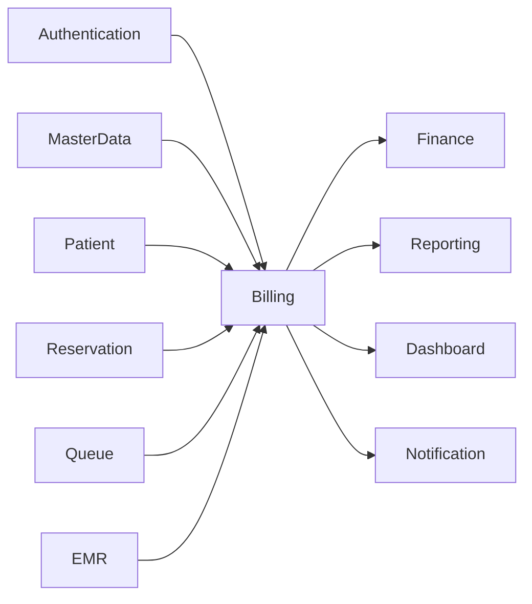
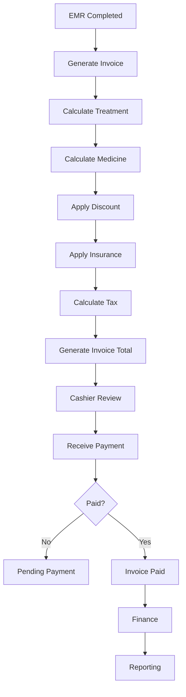
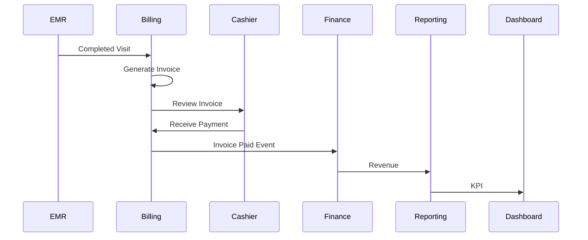
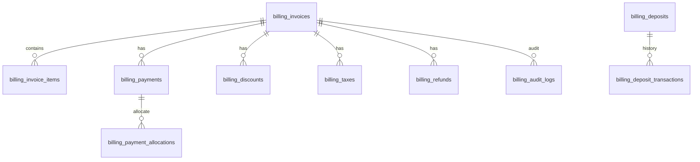
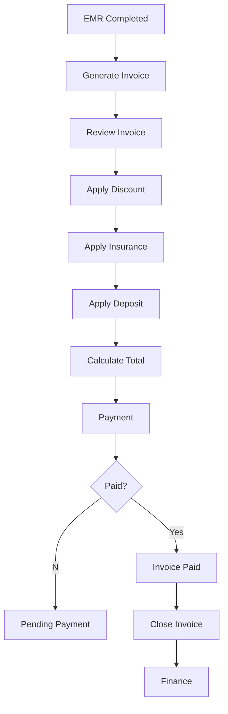
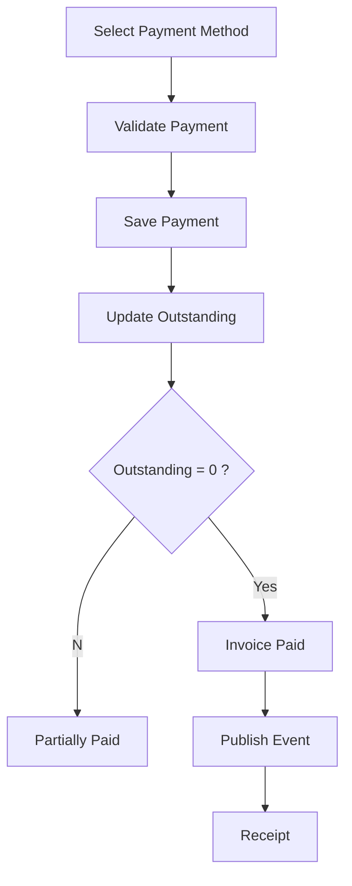
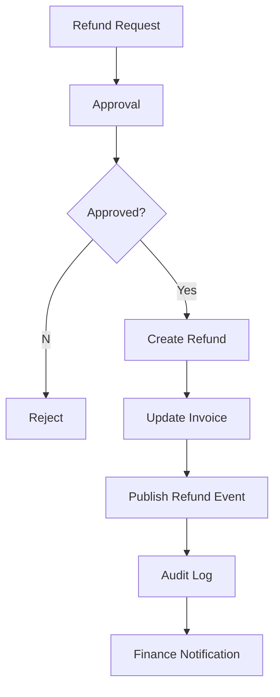
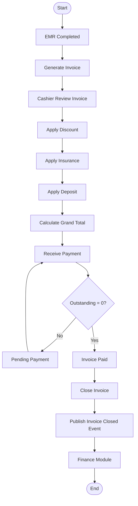
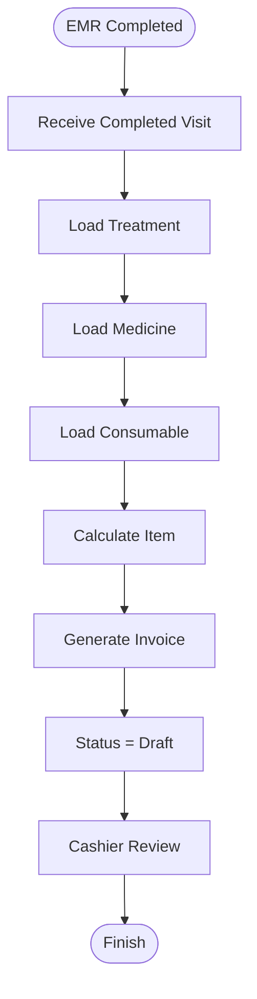

# Parakita Software Architecture Document (SAD)

# 16 - Module Billing

| Document Information | |
|----------------------|----------------------------------------------|
| Project | Parakita - Dental Clinic Management System |
| Document | 16 - Module Billing |
| Part | 1 of 12 |
| Version | 1.0.0 |
| Status | Draft |
| Document Type | Module Design Specification |
| Architecture Style | Clean Architecture + Domain Driven Design + Modular Monolith |
| Frontend | Next.js + TypeScript |
| Backend | Express.js + TypeScript |
| Database | MySQL |
| Authentication | JWT + RBAC |
| Last Updated | July 2026 |

---

# Table of Contents (Part 1)

1. Introduction
2. Purpose
3. Scope
4. Module Overview
5. Business Objectives
6. Module Responsibilities
7. Module Dependency
8. Actors & Permissions
9. Billing Lifecycle
10. Invoice Lifecycle
11. Payment Lifecycle
12. Billing Status
13. High Level Workflow
14. Business Rules Overview
15. Integration Overview
16. Summary

---

# 1. Introduction

## 1.1 Overview

Billing Module merupakan salah satu **Core Business Domain** pada Parakita yang bertanggung jawab mengubah seluruh pelayanan klinis menjadi transaksi finansial yang dapat ditagihkan kepada pasien maupun pihak ketiga seperti perusahaan dan asuransi.

Billing menjadi penghubung antara proses pelayanan medis dan proses akuntansi.

Setelah dokter menyelesaikan pemeriksaan pada EMR, seluruh tindakan, obat, bahan habis pakai, laboratorium, radiologi, maupun layanan lainnya akan dikirim ke Billing untuk dibentuk menjadi Invoice.

Billing tidak hanya bertugas menghasilkan invoice, tetapi juga mengelola seluruh siklus transaksi keuangan mulai dari:

- Invoice
- Payment
- Multi Payment
- Deposit
- Refund
- Discount
- Insurance
- Tax
- Void
- Cancellation
- Audit Trail

Billing menjadi pusat transaksi finansial sebelum data diteruskan ke Finance Module.

---

## 1.2 Background

Pada banyak klinik gigi, proses penagihan masih dilakukan secara manual sehingga sering menyebabkan:

- Kesalahan perhitungan biaya.
- Diskon tidak terdokumentasi.
- Refund sulit ditelusuri.
- Riwayat pembayaran tidak lengkap.
- Sulit mengetahui invoice yang belum dibayar.
- Sulit menghitung pendapatan dokter.

Billing Module dirancang untuk menghilangkan permasalahan tersebut melalui proses yang terdigitalisasi dan terdokumentasi secara penuh.

---

## 1.3 Design Principles

Billing Module dikembangkan menggunakan prinsip berikut.

- Single Source of Financial Truth
- Immutable Financial Transaction
- Audit by Default
- API First
- Event Driven
- Clean Architecture
- Domain Driven Design
- Modular Monolith
- Multi Branch Ready
- Security by Default

---

# 2. Purpose

Dokumen ini menjelaskan desain fungsional dan teknis dari Billing Module.

Dokumen ini digunakan oleh:

- Solution Architect
- Backend Developer
- Frontend Developer
- QA Engineer
- DevOps Engineer
- Product Owner

Dokumen ini menjadi acuan implementasi Billing sesuai standar Clean Architecture dan Domain Driven Design yang digunakan pada seluruh sistem Parakita.

---

# 3. Scope

## 3.1 In Scope

Billing Module mencakup proses berikut.

### Invoice

- Generate Invoice
- Manual Invoice
- Invoice Detail
- Invoice History

### Payment

- Cash
- Debit Card
- Credit Card
- QRIS
- Bank Transfer
- E-Wallet
- Deposit
- Mixed Payment
- partial Payment

### Discount

- Doctor Discount
- Manual Discount
- Promotion
- Membership Discount
- Voucher Discount

### Insurance

- Insurance Coverage
- Company Guarantee
- Partial Insurance

### Refund

- Full Refund
- Partial Refund
- Deposit Refund

### Administration

- Void Invoice
- Cancel Invoice
- Re-open Invoice
- Print Invoice
- Reprint Invoice

### Audit

- Audit Trail
- Activity Log
- Financial Log

---

## 3.2 Out of Scope

Billing Module tidak mencakup:

- General Ledger
- Journal Posting
- Payroll
- Procurement
- Asset Management
- Financial Statement

Seluruh proses tersebut merupakan tanggung jawab Finance Module.

---

# 4. Module Overview

Billing berada setelah proses pelayanan pasien selesai dilakukan.

Diagram posisi Billing dalam alur bisnis.

```text
Patient

↓

Reservation

↓

Queue

↓

EMR

↓

Billing

↓

Finance

↓

Reporting
```

Billing menerima data transaksi dari EMR, kemudian:

- Membentuk Invoice.
- Menghitung pajak.
- Menghitung diskon.
- Menghitung insurance.
- Menghitung deposit.
- Menerima pembayaran.
- Mengirim transaksi ke Finance.

---

# 5. Business Objectives

Billing Module dikembangkan untuk mencapai tujuan berikut.

## 5.1 Accurate Billing

Seluruh tindakan medis dihitung secara otomatis berdasarkan Master Data sehingga mengurangi human error.

---

## 5.2 Flexible Payment

Mendukung berbagai metode pembayaran dalam satu transaksi.

Contoh:

- Cash + QRIS
- Cash + Deposit
- Credit Card + Cash

---

## 5.3 Financial Integrity

Setiap transaksi keuangan bersifat immutable.

Perubahan dilakukan melalui mekanisme:

- Void
- Refund
- Adjustment

Bukan mengubah transaksi lama.

---

## 5.4 Auditability

Seluruh aktivitas tercatat.

Contoh:

- Siapa membuat invoice.
- Siapa mengubah diskon.
- Siapa melakukan refund.
- Waktu pembayaran.
- Riwayat cetak invoice.

---

## 5.5 Multi Branch Ready

Billing dapat digunakan oleh banyak cabang dengan penomoran invoice yang independen.

---

# 6. Module Responsibilities

Billing Module bertanggung jawab terhadap:

- Generate Invoice
- Calculate Invoice
- Calculate Tax
- Calculate Discount
- Apply Insurance
- Receive Payment
- Split Payment
- Deposit Management
- Refund Management
- Invoice Printing
- Invoice Closing
- Financial Audit Trail

---

## Responsibility Matrix

| Responsibility | Billing |
|---------------|---------|
| Generate Invoice | ✔ |
| Payment | ✔ |
| Refund | ✔ |
| Deposit | ✔ |
| Tax Calculation | ✔ |
| Discount Calculation | ✔ |
| Insurance Allocation | ✔ |
| Financial Journal | ✖ |
| General Ledger | ✖ |

---

# 7. Module Dependency

## Incoming Dependency

Billing menggunakan data dari:

- Authentication
- Master Data
- Patient
- Reservation
- Queue
- EMR

---

## Outgoing Dependency

Billing mengirim data ke:

- Finance
- Reporting
- Dashboard
- Notification

---

## Dependency Diagram



---

# 8. Actors & Permissions

| Role | Responsibility |
|------|----------------|
| Cashier | Membuat Invoice, Payment, Refund |
| Doctor | Memberikan Doctor Discount |
| Nurse | Read Only |
| Registration | Melihat Status Invoice |
| Finance | Closing Billing |
| Clinic Manager | Approval Refund |
| Owner | Read Only |
| Administrator | Full Access |

---

# 9. Billing Lifecycle

Billing memiliki siklus transaksi sebagai berikut.

```text
EMR Completed

↓

Generate Invoice

↓

Review Invoice

↓

Payment

↓

Invoice Paid

↓

Finance Closing

↓

Reporting
```

---

# 10. Invoice Lifecycle

Invoice memiliki lifecycle berikut.

```text
Draft

↓

Pending Payment

↓

Partially Paid

↓

Paid

↓

Closed
```

Kemungkinan lain:

```text
Draft

↓

Cancelled
```

atau

```text
Paid

↓

Refunded
```

atau

```text
Draft

↓

Void
```

---

# 11. Payment Lifecycle

```text
Create Payment

↓

Payment Validation

↓

Receive Payment

↓

Payment Success

↓

Invoice Updated

↓

Finance Posting
```

---

# 12. Billing Status

## Invoice Status

| Status | Description |
|----------|----------------------------|
| Draft | Invoice baru dibuat |
| Pending Payment | Menunggu pembayaran |
| Partially Paid | Sebagian sudah dibayar |
| Paid | Sudah lunas |
| Closed | Sudah dikirim ke Finance |
| Cancelled | Dibatalkan |
| Void | Dinyatakan tidak berlaku |

---

## Payment Status

| Status | Description |
|----------|---------------------------|
| Pending | Menunggu pembayaran |
| Success | Pembayaran berhasil |
| Failed | Pembayaran gagal |
| Refunded | Sudah direfund |
| Cancelled | Dibatalkan |

---

# 13. High Level Workflow

## Billing Flow



---

## Payment Flow

```text
Invoice

↓

Choose Payment Method

↓

Payment Validation

↓

Payment Success

↓

Update Invoice

↓

Generate Receipt

↓

Finance
```

---

# 14. Business Rules Overview

Billing mengikuti aturan bisnis berikut.

## Invoice

- Invoice Number harus unik.
- Invoice tidak boleh dihapus secara fisik.
- Invoice yang sudah dibayar tidak dapat diubah.
- Perubahan dilakukan melalui Void atau Refund.

---

## Payment

- Satu Invoice dapat memiliki banyak Payment.
- Payment tidak dapat diubah setelah berhasil.
- Payment gagal tidak mengubah saldo Invoice.

---

## Discount

- Discount dapat berasal dari:
  - Dokter
  - Promosi
  - Membership
  - Manual

- Total discount tidak boleh melebihi total invoice tanpa hak otorisasi khusus.

---

## Refund

- Refund harus memiliki alasan.
- Refund memerlukan approval sesuai nominal.
- Refund menghasilkan Audit Trail.

---

## Deposit

- Deposit dapat digunakan pada invoice berikutnya.
- Deposit tidak boleh bernilai negatif.
- Seluruh penggunaan deposit harus tercatat.

---

# 15. Integration Overview

Billing berintegrasi dengan beberapa modul lain.

| Module | Purpose |
|---------|--------------------------------|
| EMR | Mengambil tindakan medis |
| Master Data | Harga tindakan & payment method |
| Patient | Informasi pasien |
| Finance | Posting transaksi |
| Reporting | Dashboard & laporan |
| Notification | Bukti pembayaran |

---

# 16. Summary

Billing Module merupakan pusat transaksi finansial pada Parakita yang menghubungkan pelayanan medis dengan proses keuangan. Modul ini bertanggung jawab terhadap pembentukan invoice, pengelolaan pembayaran, diskon, deposit, refund, insurance, dan audit trail. Dengan mengikuti prinsip **Clean Architecture**, **Domain Driven Design (DDD)**, dan **Modular Monolith**, Billing dirancang agar memiliki integritas transaksi yang tinggi, mudah diaudit, siap mendukung multi-cabang, serta dapat berkembang menuju integrasi Payment Gateway dan sistem akuntansi pada tahap berikutnya.

---

# Parakita Software Architecture Document (SAD)

# 16 - Module Billing

| Document Information | |
|----------------------|----------------------------------------------|
| Project | Parakita - Dental Clinic Management System |
| Document | 16 - Module Billing |
| Part | 2 of 12 |
| Version | 1.0.0 |
| Status | Draft |
| Document Type | Module Design Specification |
| Architecture Style | Clean Architecture + Domain Driven Design + Modular Monolith |
| Last Updated | July 2026 |

---

# Table of Contents (Part 2)

1. Domain Overview
2. Bounded Context
3. Aggregate Design
4. Domain Entities
5. Value Objects
6. Domain Services
7. Repository Interfaces
8. Domain Events
9. State Machine
10. Business Rules
11. Domain Validation Rules
12. Aggregate Consistency Rules
13. Cross Module Interaction
14. Summary

---

# 1. Domain Overview

Billing Module merupakan **Transactional Financial Domain** yang bertanggung jawab mengelola seluruh transaksi finansial yang berasal dari pelayanan medis.

Billing memiliki ownership terhadap seluruh entity yang berkaitan dengan:

- Invoice
- Invoice Item
- Payment
- Payment Allocation
- Deposit
- Refund
- Discount
- Tax
- Insurance Allocation

Billing **tidak bertanggung jawab** terhadap pencatatan jurnal akuntansi. Setelah invoice selesai diproses, Billing akan menerbitkan Domain Event yang kemudian diproses oleh Finance Module.

---

## Domain Characteristics

| Item | Value |
|------|-------|
| Domain Type | Core Domain |
| Pattern | Aggregate Root |
| Transaction | ACID |
| Audit Trail | Enabled |
| Soft Delete | Enabled |
| Event Driven | Yes |
| Multi Branch | Yes |

---

# 2. Bounded Context

Billing merupakan bounded context tersendiri.

```text
                     Authentication
                            │
                            ▼

 Patient ───── Reservation ───── Queue

                     │

                     ▼

                   EMR

                     │

                     ▼

                 BILLING

        ┌────────────┼─────────────┐

        ▼            ▼             ▼

    Finance      Reporting   Notification
```

Billing hanya menerima data dari EMR yang sudah berstatus **Completed**.

---

## Responsibilities

Billing bertanggung jawab terhadap:

- Generate Invoice
- Calculate Total
- Apply Discount
- Apply Insurance
- Apply Tax
- Receive Payment
- Refund
- Deposit
- Close Invoice

Billing **tidak boleh** melakukan:

- Mengubah EMR
- Mengubah Harga Master Data
- Mengubah Data Pasien

---

# 3. Aggregate Design

Billing menggunakan pendekatan **Aggregate Root**.

```text
Invoice (Aggregate Root)

├── Invoice Item
├── Payment
├── Discount
├── Tax
├── Deposit Usage
├── Refund
└── Audit Log
```

Semua perubahan terhadap Invoice harus dilakukan melalui Aggregate Root.

---

## Aggregate Root

### Invoice

Invoice merupakan pusat seluruh transaksi.

Invoice bertanggung jawab menjaga konsistensi:

- Total Invoice
- Outstanding
- Payment
- Refund
- Status

Tidak ada entity lain yang diperbolehkan mengubah nilai tersebut secara langsung.

---

# 4. Domain Entities

## 4.1 Invoice

Entity utama Billing.

### Responsibilities

- Generate Invoice Number
- Add Item
- Remove Item
- Calculate Total
- Calculate Tax
- Calculate Discount
- Receive Payment
- Calculate Outstanding
- Close Invoice
- Void Invoice

---

### Main Attributes

| Field | Description |
|---------|-------------|
| Invoice ID | UUID |
| Invoice Number | Nomor Invoice |
| Patient ID | Pasien |
| Visit ID | EMR Visit |
| Branch ID | Cabang |
| Invoice Date | Tanggal |
| Status | Invoice Status |
| Grand Total | Total Tagihan |
| Outstanding | Sisa Tagihan |

---

## 4.2 Invoice Item

Invoice terdiri atas banyak Invoice Item.

Invoice Item dapat berasal dari:

- Treatment
- Medicine
- Consumable
- Laboratory
- Radiology
- Manual Charge

### Attributes

| Field | Description |
|---------|-------------|
| Item ID | UUID |
| Service Type | Treatment/Medicine |
| Reference ID | EMR Item |
| Qty | Jumlah |
| Unit Price | Harga |
| Discount | Diskon |
| Tax | Pajak |
| Total | Total |

---

## 4.3 Payment

Payment menyimpan transaksi pembayaran.

Satu Invoice dapat memiliki banyak Payment.

Contoh:

```
Invoice Rp800.000

Cash       Rp300.000

QRIS       Rp500.000
```

---

### Attributes

| Field | Description |
|---------|-------------|
| Payment ID | UUID |
| Payment Method | Cash/QRIS |
| Amount | Nominal |
| Paid At | Waktu |
| Cashier | User |

---

## 4.4 Refund

Refund digunakan apabila pembayaran harus dikembalikan.

Refund selalu terkait dengan Payment.

Refund tidak menghapus Payment lama.

Refund menghasilkan transaksi baru.

---

### Refund Types

- Full Refund
- Partial Refund
- Deposit Refund

---

## 4.5 Deposit

Deposit merupakan saldo pasien.

Deposit dapat digunakan untuk pembayaran invoice berikutnya.

Deposit memiliki histori mutasi.

---

# 5. Value Objects

Billing menggunakan beberapa Value Object.

---

## Money

Digunakan untuk menjaga konsistensi nilai uang.

Properties:

- Amount
- Currency

Behavior:

- Add
- Subtract
- Multiply
- Compare

---

## InvoiceNumber

Merepresentasikan nomor invoice.

Contoh:

```
INV-JKT-20260731-000123
```

Invoice Number bersifat immutable.

---

## TaxAmount

Menyimpan informasi pajak.

Properties:

- Tax Name
- Percentage
- Amount

---

## DiscountAmount

Properties:

- Type
- Percentage
- Amount

---

## PaymentMethod

Value Object.

Allowed:

- Cash
- Debit Card
- Credit Card
- QRIS
- Transfer
- Deposit
- E-Wallet

---

# 6. Domain Services

Beberapa business logic berada pada Domain Service.

---

## InvoiceCalculationService

Responsibilities:

- Calculate Item Total
- Calculate Tax
- Calculate Discount
- Calculate Grand Total

---

## DiscountService

Responsibilities:

- Doctor Discount
- Promotion
- Membership Discount

---

## TaxService

Responsibilities:

- Calculate Tax
- Validate Tax Rule

---

## PaymentValidationService

Responsibilities:

- Outstanding Validation
- Payment Validation
- Duplicate Payment Validation

---

## RefundService

Responsibilities:

- Validate Refund
- Calculate Refund
- Generate Refund Event

---

# 7. Repository Interfaces

Billing menggunakan Repository Pattern.

---

## InvoiceRepository

Methods

```typescript
findById(id)

findByNumber(number)

save(invoice)

update(invoice)

delete(id)

findPending()

findPaid()
```

---

## PaymentRepository

```typescript
save(payment)

findByInvoice(invoiceId)

findById(id)

findByReference(ref)

refund(payment)
```

---

## DepositRepository

```typescript
findBalance(patientId)

credit()

debit()

history()
```

---

## RefundRepository

```typescript
save()

findByInvoice()

findByPayment()

findAll()
```

---

# 8. Domain Events

Billing menggunakan Event Driven Architecture.

---

## InvoiceCreated

Payload

```
Invoice ID

Patient

Amount

Created By

Created At
```

---

## InvoicePaid

Payload

```
Invoice Number

Payment Amount

Payment Method

Cashier

Paid Time
```

---

## InvoiceClosed

Payload

```
Invoice Number

Closed Time

Finance Ready
```

---

## PaymentReceived

Payload

```
Payment ID

Invoice ID

Method

Amount
```

---

## RefundCreated

Payload

```
Refund ID

Invoice ID

Reason

Amount
```

---

# 9. State Machine

## Invoice

```text
Draft

↓

Pending Payment

↓

Partially Paid

↓

Paid

↓

Closed
```

Alternative

```text
Draft

↓

Cancelled
```

```text
Paid

↓

Refunded
```

---

## Payment

```text
Pending

↓

Success

↓

Refunded
```

---

# 10. Business Rules

## Invoice

- Invoice Number harus unik.
- Invoice tidak boleh diedit setelah Paid.
- Invoice tidak boleh dihapus.
- Void hanya untuk Draft atau Pending.

---

## Payment

- Nominal harus lebih besar dari nol.
- Tidak boleh melebihi Outstanding.
- Mendukung Multiple Payment.

---

## Refund

- Refund wajib memiliki alasan.
- Refund wajib memiliki Approval.
- Refund tidak boleh melebihi Payment.

---

## Deposit

- Deposit tidak boleh negatif.
- Deposit hanya milik satu pasien.
- Deposit memiliki histori mutasi.

---

# 11. Domain Validation Rules

Invoice hanya dapat dibuat apabila:

- Visit telah selesai.
- EMR telah ditutup.
- Semua harga tersedia.
- Pasien aktif.
- Cabang aktif.

Payment hanya dapat dilakukan apabila:

- Invoice belum Closed.
- Outstanding > 0.
- Payment Method aktif.

Refund hanya dapat dilakukan apabila:

- Payment Success.
- Belum pernah direfund penuh.
- User memiliki hak akses.

---

# 12. Aggregate Consistency Rules

Aggregate Invoice harus selalu menjaga konsistensi berikut.

```
Grand Total

=

Subtotal

+

Tax

-

Discount
```

Outstanding

```
Grand Total

-

Total Payment

+

Refund
```

Invoice tidak boleh memiliki Outstanding negatif.

---

# 13. Cross Module Interaction



---

# 14. Summary

Part 2 mendefinisikan fondasi Domain Model pada Billing Module menggunakan pendekatan **Domain Driven Design (DDD)**. Dokumen ini menjelaskan Bounded Context, Aggregate Root, Entity, Value Object, Domain Service, Repository Interface, Domain Event, State Machine, serta aturan konsistensi transaksi yang menjadi dasar implementasi seluruh proses Billing. Dengan desain ini, seluruh perubahan transaksi dilakukan melalui **Invoice Aggregate Root**, menjaga integritas data, mendukung Audit Trail, dan mempersiapkan integrasi event-driven dengan Finance, Reporting, dan Notification Module.

---


---

# Parakita Software Architecture Document (SAD)

# 16 - Module Billing

| Document Information | |
|----------------------|----------------------------------------------|
| Project | Parakita - Dental Clinic Management System |
| Document | 16 - Module Billing |
| Part | 3 of 12 |
| Version | 1.0.0 |
| Status | Draft |
| Document Type | Module Design Specification |
| Architecture Style | Clean Architecture + Domain Driven Design + Modular Monolith |
| Last Updated | July 2026 |

---

# Table of Contents (Part 3)

1. Overview
2. Actor Matrix
3. Use Case Catalog
4. UC-BIL-001 Create Invoice
5. UC-BIL-002 Generate Invoice from EMR
6. UC-BIL-003 Add Manual Charge
7. UC-BIL-004 Update Invoice
8. UC-BIL-005 Apply Discount
9. UC-BIL-006 Apply Insurance
10. UC-BIL-007 Apply Deposit
11. UC-BIL-008 Receive Payment
12. UC-BIL-009 Split Payment
13. UC-BIL-010 Multiple Payment
14. UC-BIL-011 Print Invoice
15. UC-BIL-012 Reprint Invoice
16. UC-BIL-013 Close Invoice
17. UC-BIL-014 Cancel Invoice
18. UC-BIL-015 Void Invoice
19. UC-BIL-016 Refund Payment
20. UC-BIL-017 Deposit Refund
21. UC-BIL-018 Invoice History
22. UC-BIL-019 Payment History
23. UC-BIL-020 Daily Closing
24. Business Rules Summary

---

# 1. Overview

Bagian ini mendeskripsikan seluruh Use Case utama pada Billing Module.

Seluruh Use Case mengikuti prinsip:

- Authentication
- Authorization (RBAC)
- Audit Trail
- Validation
- Transactional (ACID)
- Event Driven

---

# 2. Actor Matrix

| Actor | Responsibility |
|--------|----------------|
| Cashier | Seluruh transaksi Billing |
| Doctor | Doctor Discount |
| Finance | Closing & Verification |
| Clinic Manager | Approval Refund & Void |
| Administrator | Full Access |
| Owner | Read Only |

---

# 3. Use Case Catalog

| Code | Use Case |
|------|-----------------------------|
| UC-BIL-001 | Create Invoice |
| UC-BIL-002 | Generate Invoice from EMR |
| UC-BIL-003 | Add Manual Charge |
| UC-BIL-004 | Update Invoice |
| UC-BIL-005 | Apply Discount |
| UC-BIL-006 | Apply Insurance |
| UC-BIL-007 | Apply Deposit |
| UC-BIL-008 | Receive Payment |
| UC-BIL-009 | Split Payment |
| UC-BIL-010 | Multiple Payment |
| UC-BIL-011 | Print Invoice |
| UC-BIL-012 | Reprint Invoice |
| UC-BIL-013 | Close Invoice |
| UC-BIL-014 | Cancel Invoice |
| UC-BIL-015 | Void Invoice |
| UC-BIL-016 | Refund Payment |
| UC-BIL-017 | Deposit Refund |
| UC-BIL-018 | Invoice History |
| UC-BIL-019 | Payment History |
| UC-BIL-020 | Daily Closing |

---

# UC-BIL-001 Create Invoice

## Goal

Membuat invoice baru berdasarkan layanan yang telah selesai.

## Primary Actor

Cashier

## Preconditions

- Visit selesai.
- EMR Closed.
- Harga tersedia.

## Main Flow

1. Cashier membuka Billing.
2. Memilih Visit.
3. Sistem mengambil seluruh tindakan.
4. Sistem menghitung total.
5. Invoice dibuat.
6. Status menjadi **Draft**.

## Alternative Flow

- Harga belum tersedia.
- Visit belum selesai.

## Post Condition

Invoice berhasil dibuat.

**Catatan implementasi (`docs/06-tasks/epic-billing-completion.md`):** Sistem yang berjalan saat ini hanya pernah membuat Invoice secara otomatis dari Visit yang sudah Completed (lihat UC-BIL-002, task-054) — jalur manual "Cashier memilih Visit lalu membuat Invoice" di atas **belum diimplementasikan dan sengaja tidak dibangun** tanpa kebutuhan bisnis nyata yang teridentifikasi (mis. tagihan untuk sesuatu tanpa Visit sama sekali, seperti penjualan retail walk-in). Ini adalah pertanyaan produk terbuka, bukan diasumsikan.

---

# UC-BIL-002 Generate Invoice from EMR

## Goal

Membentuk invoice otomatis dari EMR.

## Trigger

EMR Status = Completed

## Main Flow

1. EMR mengirim event.
2. Billing menerima event.
3. Treatment dibaca.
4. Medicine dibaca.
5. Consumable dibaca.
6. Invoice dibuat otomatis.

## Output

Invoice Draft.

---

# UC-BIL-003 Add Manual Charge

## Goal

Menambahkan biaya tambahan.

Contoh:

- Administrasi
- Surat Keterangan
- Fotokopi
- Konsultasi Tambahan

## Business Rules

- Harus memiliki alasan.
- Tercatat di Audit Trail.

---

# UC-BIL-004 Update Invoice

## Goal

Mengubah invoice sebelum dibayar.

## Allowed

- Tambah Item — **diimplementasikan** (docs/06-tasks/task-320.md) sebagai sinkronisasi otomatis berbasis event (`emr.treatment-recorded.v1`), bukan aksi edit manual di UI: begitu Treatment baru dicatat pada Visit yang Invoice-nya sudah dibuat (dan belum Paid/Closed), item baru otomatis ditambahkan ke Invoice tersebut beserta `subtotal`/`grandTotal` yang dihitung ulang.
- Edit Qty (dan Unit Price/Tooth Reference/Catatan) — **diimplementasikan** (docs/06-tasks/task-321.md): staff dapat mengedit entri Treatment langsung di EMR (bukan di layar Invoice), disinkronkan otomatis via `emr.treatment-updated.v1` ke item Invoice yang sesuai (dicocokkan lewat `InvoiceItem.visitTreatmentId`).
- Hapus Item — **diimplementasikan** (docs/06-tasks/task-321.md): menghapus entri Treatment di EMR (soft delete) memicu `emr.treatment-removed.v1`, yang menghapus item Invoice terkait dan menghitung ulang total.
- Edit Catatan — **diimplementasikan** sebagai bagian dari Edit Qty di atas (task-321.md) — bukan aksi terpisah.

Ketiganya tetap merupakan aksi yang dilakukan dari sisi EMR (halaman Visit), bukan tombol edit-langsung pada layar Invoice itu sendiri — layar Invoice tetap read-only dan hanya merefleksikan hasil sinkronisasi.

## Not Allowed

- Invoice Paid
- Invoice Closed

---

# UC-BIL-005 Apply Discount

## Goal

Memberikan diskon.

## Discount Source

- Doctor
- Promotion
- Membership
- Manual

## Validation

Total diskon tidak boleh melebihi batas otorisasi.

---

# UC-BIL-006 Apply Insurance

## Goal

Mengalokasikan pembayaran ke pihak asuransi.

## Main Flow

1. Pilih Insurance.
2. Sistem menghitung coverage.
3. Remaining menjadi tagihan pasien.

---

# UC-BIL-007 Apply Deposit

## Goal

Menggunakan saldo deposit pasien.

## Validation

- Deposit cukup.
- Deposit aktif.

---

# UC-BIL-008 Receive Payment

## Goal

Menerima pembayaran.

## Supported Payment

- Cash
- Debit
- Credit Card
- QRIS
- Transfer
- Deposit
- E-Wallet

## Main Flow

1. Pilih metode.
2. Input nominal.
3. Validasi.
4. Simpan payment.
5. Update outstanding.

---

# UC-BIL-009 Split Payment

## Goal

Pembayaran menggunakan lebih dari satu metode.

## Example

```
Invoice

Rp1.000.000

Cash

Rp400.000

QRIS

Rp600.000
```

---

# UC-BIL-010 Multiple Payment

Invoice dapat dibayar beberapa kali.

Contoh

Hari pertama

```
Rp500.000
```

Hari kedua

```
Rp300.000
```

Hari ketiga

```
Rp200.000
```

Status otomatis berubah menjadi Paid.

---

# UC-BIL-011 Print Invoice

## Goal

Mencetak invoice.

## Output

- Thermal Receipt
- A4 Invoice
- PDF

**Catatan implementasi (`docs/06-tasks/epic-billing-completion.md`):** **Ditunda sepenuhnya** — belum ada infrastruktur cetak/PDF apa pun di codebase ini. Membutuhkan keputusan terpisah (thermal vs. A4 vs. PDF-only) sebelum dapat menjadi task yang actionable.

---

# UC-BIL-012 Reprint Invoice

## Goal

Mencetak ulang invoice.

Audit Trail mencatat:

- User
- Time
- Printer
- Reason

**Catatan implementasi:** Ditunda bersama UC-BIL-011 — bergantung pada keputusan infrastruktur cetak yang sama.

---

# UC-BIL-013 Close Invoice

Invoice yang sudah lunas dikirim ke Finance.

## Output

- Invoice Closed
- Publish InvoiceClosed Event

---

# UC-BIL-014 Cancel Invoice

Invoice Draft dapat dibatalkan.

Business Rules

- Belum ada payment.
- Audit wajib.

---

# UC-BIL-015 Void Invoice

Void digunakan apabila invoice salah dibuat.

Void membutuhkan:

- Approval
- Reason
- Audit Trail

---

# UC-BIL-016 Refund Payment

## Refund Type

- Full Refund
- Partial Refund

## Validation

- Payment Success.
- Belum pernah direfund penuh.

---

# UC-BIL-017 Deposit Refund

Mengembalikan sisa deposit pasien.

Approval wajib.

---

# UC-BIL-018 Invoice History

Menampilkan histori:

- Create
- Update
- Discount
- Payment
- Refund
- Print
- Void

---

# UC-BIL-019 Payment History

Menampilkan seluruh histori pembayaran.

Contoh

| Date | Method | Amount |
|------|---------|---------|
| 01 Jul | Cash | 300.000 |
| 01 Jul | QRIS | 700.000 |

---

# UC-BIL-020 Daily Closing

Dilakukan oleh Finance/Cashier.

## Main Flow

1. Rekap seluruh payment.
2. Rekap refund.
3. Rekap deposit.
4. Generate Closing Report.
5. Lock transaksi hari tersebut.

**Catatan implementasi (`docs/06-tasks/epic-billing-completion.md`):** **Digugurkan dari epic Billing** — use case ini tumpang tindih dengan UC-FIN-005 "Daily Cash Closing" milik Module Finance (`docs/03-sad/17-module-finance.md` §4.6), yang sudah diimplementasikan penuh (opening/closing balance, hitung denominasi, alasan varian wajib + persetujuan Finance Manager — Finance Epic AE, task-162–171) dan mencakup mekanisme rekonsiliasi yang jauh lebih lengkap daripada versi tipis di atas. Kedua use case Daily Closing ini tidak pernah direkonsiliasi satu sama lain di dokumentasi manapun sebelum catatan ini; keputusannya adalah memakai implementasi Finance sebagai satu-satunya Daily Closing, bukan membangun versi kedua di Billing.

---

# Business Rules Summary

## Invoice

- Invoice Number unik.
- Tidak boleh Hard Delete.
- Paid tidak boleh diedit.
- Closed tidak boleh diubah.

---

## Payment

- Outstanding tidak boleh negatif.
- Multiple Payment diperbolehkan.
- Split Payment diperbolehkan.

---

## Refund

- Harus memiliki alasan.
- Memerlukan Approval.
- Tidak boleh melebihi nominal Payment.

---

## Deposit

- Tidak boleh negatif.
- Selalu memiliki histori mutasi.
- Hanya dapat digunakan oleh pasien yang sama.

---

## Discount

- Dicatat per item dan per invoice.
- Seluruh perubahan menghasilkan Audit Trail.

---

# Summary

Part 3 mendefinisikan **20 Use Case utama** pada Billing Module yang mencakup seluruh siklus transaksi, mulai dari pembentukan invoice berdasarkan EMR, penambahan biaya, penerapan diskon, asuransi, dan deposit, hingga pembayaran, refund, void, closing, serta pelacakan histori transaksi. Seluruh use case dirancang mengikuti prinsip **Clean Architecture**, **DDD**, **Audit Trail**, **RBAC**, dan **ACID Transaction**, sehingga siap menjadi dasar implementasi Backend API, Frontend Workflow, serta pengujian QA.

---

# Parakita Software Architecture Document (SAD)

# 16 - Module Billing

| Document Information | |
|----------------------|----------------------------------------------|
| Project | Parakita - Dental Clinic Management System |
| Document | 16 - Module Billing |
| Part | 4 of 12 |
| Version | 1.0.0 |
| Status | Draft |
| Document Type | Module Design Specification |
| Architecture Style | Clean Architecture + Domain Driven Design + Modular Monolith |
| Last Updated | July 2026 |

---

# Table of Contents (Part 4)

1. Database Overview
2. Database Design Principles
3. Entity Relationship Overview
4. Table List
5. Table Specification
   - billing_invoices
   - billing_invoice_items
   - billing_payments
   - billing_payment_allocations
   - billing_deposits
   - billing_deposit_transactions
   - billing_refunds
   - billing_discounts
   - billing_taxes
   - billing_audit_logs
6. Entity Relationships
7. Indexing Strategy
8. Soft Delete Strategy
9. Audit Strategy
10. Partitioning Strategy
11. Data Retention
12. Summary

---

# 1. Database Overview

Billing Module menggunakan pendekatan **Normalized Transaction Database** untuk menjaga konsistensi data finansial.

Karakteristik utama:

- ACID Transaction
- Immutable Financial Record
- Soft Delete
- Audit Trail
- UUID Primary Key
- Multi Branch Support
- Optimized Index

---

## Database Characteristics

| Item | Value |
|------|--------|
| Database | MySQL |
| Charset | utf8mb4 |
| Engine | InnoDB |
| Transaction | ACID |
| ORM | TypeORM |
| UUID | Yes |
| Soft Delete | Yes |
| Audit Trail | Yes |

---

# 2. Database Design Principles

Billing mengikuti prinsip berikut:

- Tidak ada penyimpanan nilai yang redundan.
- Semua transaksi memiliki histori.
- Tidak melakukan hard delete.
- Nilai uang menggunakan DECIMAL.
- Seluruh relasi menggunakan Foreign Key.
- Semua tabel memiliki audit fields.

---

## Standard Audit Fields

Seluruh tabel memiliki field berikut.

```text
created_at
created_by

updated_at
updated_by

deleted_at
deleted_by
```

---

# 3. Entity Relationship Overview

```text
Billing Invoice

│

├── Invoice Items

├── Payments

│     └── Payment Allocation

├── Discount

├── Tax

├── Refund

├── Deposit Usage

└── Audit Logs
```

---

# 4. Table List

| Table | Description |
|--------|-------------|
| billing_invoices | Header Invoice |
| billing_invoice_items | Detail Invoice |
| billing_payments | Pembayaran |
| billing_payment_allocations | Split Payment |
| billing_deposits | Saldo Deposit |
| billing_deposit_transactions | Mutasi Deposit |
| billing_refunds | Refund |
| billing_discounts | Diskon |
| billing_taxes | Pajak |
| billing_audit_logs | Audit Aktivitas |

---

# 5. Table Specification

---

# billing_invoices

## Purpose

Menyimpan informasi utama invoice.

---

## Columns

| Column | Type | Description |
|---------|------|-------------|
| id | UUID | Primary Key |
| invoice_number | VARCHAR(50) | Nomor Invoice |
| patient_id | UUID | FK Patient |
| visit_id | UUID | FK Visit |
| branch_id | UUID | FK Branch |
| subtotal | DECIMAL(18,2) | Total sebelum diskon |
| discount_total | DECIMAL(18,2) | Total Diskon |
| tax_total | DECIMAL(18,2) | Total Pajak |
| grand_total | DECIMAL(18,2) | Total Tagihan |
| payment_total | DECIMAL(18,2) | Total Dibayar |
| outstanding | DECIMAL(18,2) | Sisa Tagihan |
| status | VARCHAR(30) | Status Invoice |
| notes | TEXT | Catatan |
| created_at | DATETIME | Audit |
| updated_at | DATETIME | Audit |
| deleted_at | DATETIME | Soft Delete |

---

## Constraints

- invoice_number UNIQUE
- outstanding >= 0
- grand_total >= 0

---

# billing_invoice_items

## Purpose

Menyimpan seluruh item pada invoice.

---

## Columns

| Column | Type |
|---------|------|
| id | UUID |
| invoice_id | UUID |
| reference_type | VARCHAR(30) |
| reference_id | UUID |
| item_name | VARCHAR(255) |
| quantity | DECIMAL(10,2) |
| unit_price | DECIMAL(18,2) |
| discount | DECIMAL(18,2) |
| tax | DECIMAL(18,2) |
| total | DECIMAL(18,2) |

---

## Reference Type

- Treatment
- Medicine
- Consumable
- Laboratory
- Radiology
- Manual Charge

---

# billing_payments

## Purpose

Menyimpan pembayaran.

---

## Columns

| Column | Type |
|---------|------|
| id | UUID |
| invoice_id | UUID |
| payment_method | VARCHAR(30) |
| reference_number | VARCHAR(100) |
| amount | DECIMAL(18,2) |
| payment_date | DATETIME |
| status | VARCHAR(20) |
| cashier_id | UUID |

---

## Payment Method

- Cash
- Debit Card
- Credit Card
- QRIS
- Transfer
- Deposit
- E-Wallet

---

# billing_payment_allocations

Digunakan untuk mendukung Split Payment.

---

## Columns

| Column | Type |
|---------|------|
| id | UUID |
| payment_id | UUID |
| invoice_item_id | UUID |
| allocation_amount | DECIMAL(18,2) |

---

# billing_deposits

Menyimpan saldo deposit pasien.

---

## Columns

| Column | Type |
|---------|------|
| id | UUID |
| patient_id | UUID |
| balance | DECIMAL(18,2) |
| status | VARCHAR(20) |

---

# billing_deposit_transactions

Histori mutasi deposit.

---

## Transaction Type

- Topup
- Payment
- Refund
- Adjustment

---

## Columns

| Column | Type |
|---------|------|
| id | UUID |
| deposit_id | UUID |
| transaction_type | VARCHAR(20) |
| amount | DECIMAL(18,2) |
| balance_after | DECIMAL(18,2) |
| reference_number | VARCHAR(50) |
| transaction_date | DATETIME |

---

# billing_refunds

Menyimpan refund pembayaran.

---

## Columns

| Column | Type |
|---------|------|
| id | UUID |
| invoice_id | UUID |
| payment_id | UUID |
| refund_type | VARCHAR(20) |
| refund_amount | DECIMAL(18,2) |
| reason | TEXT |
| approved_by | UUID |
| refund_date | DATETIME |

---

## Refund Type

- Full
- Partial
- Deposit

---

# billing_discounts

Diskon invoice.

---

## Columns

| Column | Type |
|---------|------|
| id | UUID |
| invoice_id | UUID |
| discount_type | VARCHAR(30) |
| percentage | DECIMAL(5,2) |
| amount | DECIMAL(18,2) |
| remarks | TEXT |

---

## Discount Type

- Doctor
- Promotion
- Membership
- Manual

---

# billing_taxes

Informasi pajak.

---

## Columns

| Column | Type |
|---------|------|
| id | UUID |
| invoice_id | UUID |
| tax_name | VARCHAR(50) |
| percentage | DECIMAL(5,2) |
| amount | DECIMAL(18,2) |

---

# billing_audit_logs

Menyimpan seluruh perubahan Billing.

---

## Columns

| Column | Type |
|---------|------|
| id | UUID |
| invoice_id | UUID |
| activity | VARCHAR(100) |
| old_value | JSON |
| new_value | JSON |
| performed_by | UUID |
| performed_at | DATETIME |
| ip_address | VARCHAR(50) |

---

# 6. Entity Relationships



---

# 7. Indexing Strategy

## billing_invoices

| Index | Columns |
|--------|----------|
| PK | id |
| UK | invoice_number |
| IDX | patient_id |
| IDX | visit_id |
| IDX | branch_id |
| IDX | status |
| IDX | invoice_date |
| IDX | created_at |

---

## billing_payments

| Index | Columns |
|--------|----------|
| PK | id |
| IDX | invoice_id |
| IDX | payment_method |
| IDX | payment_date |
| IDX | cashier_id |

---

## billing_invoice_items

| Index | Columns |
|--------|----------|
| PK | id |
| IDX | invoice_id |
| IDX | reference_id |

---

# 8. Soft Delete Strategy

Billing tidak menggunakan Hard Delete.

Seluruh data menggunakan:

```text
deleted_at

deleted_by
```

Data tetap tersimpan untuk:

- Audit
- Legal
- Financial Investigation

---

# 9. Audit Strategy

Seluruh perubahan menghasilkan Audit Log.

Contoh aktivitas:

- Create Invoice
- Update Invoice
- Add Manual Charge
- Apply Discount
- Receive Payment
- Refund
- Void Invoice
- Print Invoice
- Reprint Invoice

Audit tidak boleh dihapus.

---

# 10. Partitioning Strategy

Untuk implementasi skala besar, tabel berikut dapat dipartisi berdasarkan:

- Branch
- Tahun
- Bulan

Contoh:

```
billing_invoices_2026

billing_invoices_2027
```

atau menggunakan **MySQL RANGE Partition** berdasarkan `invoice_date`.

---

# 11. Data Retention

| Data | Retention |
|------|-----------|
| Invoice | Permanent |
| Payment | Permanent |
| Refund | Permanent |
| Deposit History | Permanent |
| Audit Log | Permanent |
| Print History | 10 Tahun |

Seluruh data finansial tidak boleh dihapus secara fisik.

---

# Summary

Part 4 mendefinisikan desain database Billing Module yang terdiri atas **10 tabel utama** dengan relasi yang terstruktur untuk mendukung proses invoice, pembayaran, split payment, deposit, refund, diskon, pajak, dan audit trail. Struktur ini mengikuti prinsip **3NF**, **ACID Transaction**, **Soft Delete**, dan **Audit by Default**, sehingga siap diimplementasikan menggunakan **TypeORM** dan mendukung operasional klinik multi-cabang dengan volume transaksi yang tinggi.

---

# Parakita Software Architecture Document (SAD)

# 16 - Module Billing

| Document Information | |
|----------------------|----------------------------------------------|
| Project | Parakita - Dental Clinic Management System |
| Document | 16 - Module Billing |
| Part | 5 of 12 |
| Version | 1.0.0 |
| Status | Draft |
| Document Type | Module Design Specification |
| Architecture Style | Clean Architecture + Domain Driven Design + Modular Monolith |
| Last Updated | July 2026 |

---

# Table of Contents (Part 5)

1. API Overview
2. REST API Principles
3. Authentication
4. Response Standard
5. Error Response
6. Billing Endpoints
7. Invoice API
8. Payment API
9. Deposit API
10. Refund API
11. Discount API
12. DTO Specification
13. Validation Rules
14. Error Codes
15. OpenAPI Specification
16. API Security
17. Summary

---

# 1. API Overview

Billing Module menyediakan REST API yang digunakan oleh:

- Next.js Frontend
- Mobile Application
- Finance Module
- Reporting Module
- External Payment Gateway (Future)

Base URL

```http
/api/v1/billing
```

---

# 2. REST API Principles

Seluruh endpoint mengikuti standar:

- RESTful Resource
- Stateless
- JSON
- JWT Authentication
- RBAC Authorization
- DTO Validation
- OpenAPI First
- Idempotent Request
- Audit Trail

---

# 3. Authentication

Semua endpoint (kecuali webhook) menggunakan JWT.

```http
Authorization: Bearer <access_token>
```

---

# 4. Standard Response

## Success

```json
{
  "success": true,
  "message": "Invoice created successfully.",
  "data": {}
}
```

---

## List

```json
{
  "success": true,
  "message": "Success",
  "data": [],
  "meta": {
    "page":1,
    "limit":20,
    "total":120,
    "totalPages":6
  }
}
```

---

## Error

```json
{
  "success":false,
  "message":"Validation Error",
  "errors":[]
}
```

---

# 5. Error Response

| HTTP | Meaning |
|-------|----------|
|400|Validation Error|
|401|Unauthorized|
|403|Forbidden|
|404|Invoice Not Found|
|409|Business Rule Conflict|
|422|Business Validation|
|500|Internal Server Error|

---

# 6. Billing Endpoints

## Invoice

| Method | Endpoint |
|---------|----------|
|GET|/billing/invoices|
|POST|/billing/invoices|
|GET|/billing/invoices/{id}|
|PATCH|/billing/invoices/{id}|
|DELETE|/billing/invoices/{id}|
|POST|/billing/invoices/{id}/close|
|POST|/billing/invoices/{id}/cancel|
|POST|/billing/invoices/{id}/void|
|POST|/billing/invoices/{id}/print|
|GET|/billing/invoices/{id}/history|

---

## Invoice Item

| Method | Endpoint |
|---------|----------|
|POST|/billing/invoices/{id}/items|
|PATCH|/billing/invoices/{id}/items/{itemId}|
|DELETE|/billing/invoices/{id}/items/{itemId}|

---

## Discount

| Method | Endpoint |
|---------|----------|
|POST|/billing/invoices/{id}/discount|
|DELETE|/billing/invoices/{id}/discount|

---

## Insurance

| Method | Endpoint |
|---------|----------|
|POST|/billing/invoices/{id}/insurance|
|DELETE|/billing/invoices/{id}/insurance|

---

## Deposit

| Method | Endpoint |
|---------|----------|
|POST|/billing/deposits|
|GET|/billing/deposits/{patientId}|
|POST|/billing/deposits/{patientId}/topup|
|POST|/billing/deposits/{patientId}/withdraw|
|GET|/billing/deposits/{patientId}/transactions|

---

## Payment

| Method | Endpoint |
|---------|----------|
|POST|/billing/payments|
|GET|/billing/payments/{id}|
|GET|/billing/payments|
|POST|/billing/payments/{id}/refund|

---

## Refund

| Method | Endpoint |
|---------|----------|
|POST|/billing/refunds|
|GET|/billing/refunds|
|GET|/billing/refunds/{id}|

---

# 7. Invoice API

---

## Create Invoice

```http
POST /api/v1/billing/invoices
```

### Request

```json
{
  "visitId":"UUID"
}
```

### Response

```json
{
  "success":true,
  "message":"Invoice created successfully.",
  "data":{
      "invoiceId":"UUID",
      "invoiceNumber":"INV-20260731-000001"
  }
}
```

---

## Get Invoice Detail

```http
GET /api/v1/billing/invoices/{id}
```

---

## List Invoice

```http
GET /billing/invoices?page=1&limit=20
```

### Filtering

```
status

patientId

doctorId

branchId

dateFrom

dateTo
```

---

## Close Invoice

```http
POST /billing/invoices/{id}/close
```

---

## Void Invoice

```http
POST /billing/invoices/{id}/void
```

Request

```json
{
  "reason":"Duplicate Invoice"
}
```

---

# 8. Payment API

## Create Payment

```http
POST /billing/payments
```

Request

```json
{
    "invoiceId":"UUID",
    "payments":[
        {
            "method":"Cash",
            "amount":300000
        },
        {
            "method":"QRIS",
            "amount":700000
        }
    ]
}
```

Response

```json
{
  "success":true,
  "message":"Payment Success"
}
```

---

## Payment Detail

```http
GET /billing/payments/{id}
```

---

## Refund Payment

```http
POST /billing/payments/{id}/refund
```

Request

```json
{
    "amount":150000,
    "reason":"Duplicate Payment"
}
```

---

# 9. Deposit API

---

## Top Up Deposit

```http
POST /billing/deposits/{patientId}/topup
```

Request

```json
{
   "amount":500000
}
```

---

## Withdraw Deposit

```http
POST /billing/deposits/{patientId}/withdraw
```

---

## Deposit History

```http
GET /billing/deposits/{patientId}/transactions
```

---

# 10. Refund API

## Create Refund

```http
POST /billing/refunds
```

Request

```json
{
    "paymentId":"UUID",
    "refundAmount":250000,
    "reason":"Wrong Payment"
}
```

---

## Refund List

```http
GET /billing/refunds
```

---

# 11. Discount API

## Apply Discount

```http
POST /billing/invoices/{id}/discount
```

Request

```json
{
    "discountType":"Doctor",
    "percentage":10,
    "reason":"Special Discount"
}
```

---

## Remove Discount

```http
DELETE /billing/invoices/{id}/discount
```

---

# 12. DTO Specification

## CreateInvoiceDto

```typescript
class CreateInvoiceDto {

    @IsUUID()
    visitId:string;

}
```

---

## PaymentItemDto

```typescript
class PaymentItemDto{

    @IsEnum(PaymentMethod)
    method:PaymentMethod;

    @IsNumber()
    amount:number;

}
```

---

## CreatePaymentDto

```typescript
class CreatePaymentDto{

    @IsUUID()
    invoiceId:string;

    @ValidateNested()
    payments:PaymentItemDto[];

}
```

---

## RefundDto

```typescript
class RefundDto{

    @IsUUID()
    paymentId:string;

    @IsNumber()
    refundAmount:number;

    @IsString()
    reason:string;

}
```

---

# 13. Validation Rules

## Invoice

- Visit harus Completed.
- EMR harus Closed.
- Invoice belum pernah dibuat.

---

## Payment

- Amount > 0
- Outstanding > 0
- Payment Method aktif.

---

## Refund

- Refund <= Payment
- Belum Full Refund.
- Approval tersedia.

---

## Deposit

- Saldo cukup.
- Patient aktif.

---

# 14. Error Codes

| Code | Description |
|------|-------------|
|BIL-001|Invoice Not Found|
|BIL-002|Invoice Already Paid|
|BIL-003|Outstanding Zero|
|BIL-004|Payment Failed|
|BIL-005|Deposit Insufficient|
|BIL-006|Refund Exceeds Payment|
|BIL-007|Discount Exceeds Limit|
|BIL-008|Insurance Validation Failed|
|BIL-009|Invoice Closed|
|BIL-010|Duplicate Invoice|

---

# 15. OpenAPI 3.1 Example

```yaml
paths:

  /billing/invoices:

    post:

      summary: Create Invoice

      security:

        - bearerAuth: []

      requestBody:

        required: true

      responses:

        '201':

          description: Invoice Created
```

---

# 16. API Security

Billing API menerapkan keamanan berlapis.

## Authentication

- JWT Access Token
- Refresh Token

---

## Authorization

| Role | Permission |
|------|------------|
|Cashier|CRUD Invoice|
|Doctor|Apply Discount|
|Finance|Closing|
|Manager|Refund Approval|
|Admin|Full Access|

---

## Audit

Semua endpoint mencatat:

- User ID
- Branch ID
- IP Address
- Device
- Request ID
- Timestamp

---

## Rate Limit

```
Create Invoice

60 requests/minute

Payment

30 requests/minute

Refund

10 requests/minute
```

---

# Summary

Part 5 mendefinisikan spesifikasi REST API Billing Module yang mencakup endpoint Invoice, Payment, Deposit, Refund, Discount, dan Insurance. Seluruh API mengikuti standar REST, menggunakan JWT Authentication, RBAC Authorization, DTO Validation (`class-validator`), serta format response yang konsisten. Dokumen ini menjadi dasar implementasi Controller, Service Layer, OpenAPI 3.1, dan integrasi Frontend Next.js maupun layanan eksternal seperti Payment Gateway.

---


---

# Parakita Software Architecture Document (SAD)

# 16 - Module Billing

| Document Information | |
|----------------------|----------------------------------------------|
| Project | Parakita - Dental Clinic Management System |
| Document | 16 - Module Billing |
| Part | 6 of 12 |
| Version | 1.0.0 |
| Status | Draft |
| Document Type | Module Design Specification |
| Architecture Style | Clean Architecture + Domain Driven Design + Modular Monolith |
| Last Updated | July 2026 |

---

# Table of Contents (Part 6)

1. Overview
2. Sequence Diagram - Generate Invoice
3. Sequence Diagram - Manual Charge
4. Sequence Diagram - Apply Discount
5. Sequence Diagram - Apply Insurance
6. Sequence Diagram - Apply Deposit
7. Sequence Diagram - Receive Payment
8. Sequence Diagram - Split Payment
9. Sequence Diagram - Refund
10. Sequence Diagram - Void Invoice
11. Sequence Diagram - Close Invoice
12. Sequence Diagram - Print Invoice
13. Activity Diagram - Billing Workflow
14. Activity Diagram - Payment Workflow
15. Activity Diagram - Refund Workflow
16. Summary

---

# 1. Overview

Bagian ini mendokumentasikan interaksi antar komponen sistem pada Billing Module menggunakan **UML Sequence Diagram** dan **Activity Diagram**.

Seluruh diagram mengikuti implementasi Clean Architecture.

```text
Next.js

↓

REST Controller

↓

Application Service

↓

Domain

↓

Repository

↓

Database

↓

Domain Event

↓

Finance
```

---

# 2. Sequence Diagram — Generate Invoice

```mermaid
sequenceDiagram

participant Cashier
participant BillingAPI
participant InvoiceService
participant EMR
participant InvoiceRepository
participant Database

Cashier->>BillingAPI: POST /billing/invoices

BillingAPI->>InvoiceService: createInvoice()

InvoiceService->>EMR: Get Completed Visit

EMR-->>InvoiceService: Treatment List

InvoiceService->>InvoiceRepository: save()

InvoiceRepository->>Database: INSERT Invoice

Database-->>InvoiceRepository: Success

InvoiceRepository-->>InvoiceService

InvoiceService-->>BillingAPI

BillingAPI-->>Cashier: Invoice Created
```

---

# 3. Sequence Diagram — Add Manual Charge

```mermaid
sequenceDiagram

participant Cashier
participant BillingAPI
participant InvoiceService
participant InvoiceRepository

Cashier->>BillingAPI: Add Manual Charge

BillingAPI->>InvoiceService

InvoiceService->>InvoiceRepository

InvoiceRepository->>Database: INSERT Invoice Item

Database-->>InvoiceRepository

InvoiceRepository-->>InvoiceService

InvoiceService->>InvoiceService: Recalculate Invoice

InvoiceService-->>BillingAPI

BillingAPI-->>Cashier
```

---

# 4. Sequence Diagram — Apply Discount

```mermaid
sequenceDiagram

participant Cashier

participant BillingAPI

participant DiscountService

participant InvoiceRepository

Cashier->>BillingAPI

BillingAPI->>DiscountService

DiscountService->>InvoiceRepository

InvoiceRepository->>Database

Database-->>InvoiceRepository

InvoiceRepository-->>DiscountService

DiscountService->>DiscountService

DiscountService-->>BillingAPI

BillingAPI-->>Cashier
```

---

# 5. Sequence Diagram — Apply Insurance

```mermaid
sequenceDiagram

participant Cashier

participant BillingAPI

participant InsuranceService

participant InvoiceRepository

Cashier->>BillingAPI

BillingAPI->>InsuranceService

InsuranceService->>InsuranceService

InsuranceService->>InvoiceRepository

InvoiceRepository->>Database

Database-->>InvoiceRepository

InsuranceService-->>BillingAPI

BillingAPI-->>Cashier
```

---

# 6. Sequence Diagram — Apply Deposit

```mermaid
sequenceDiagram

participant Cashier

participant BillingAPI

participant DepositService

participant DepositRepository

participant InvoiceRepository

Cashier->>BillingAPI

BillingAPI->>DepositService

DepositService->>DepositRepository

DepositRepository->>Database

Database-->>DepositRepository

DepositService->>InvoiceRepository

InvoiceRepository->>Database

Database-->>InvoiceRepository

BillingAPI-->>Cashier
```

---

# 7. Sequence Diagram — Receive Payment

```mermaid
sequenceDiagram

participant Cashier

participant BillingAPI

participant PaymentService

participant PaymentRepository

participant InvoiceRepository

participant EventBus

Cashier->>BillingAPI

BillingAPI->>PaymentService

PaymentService->>PaymentRepository

PaymentRepository->>Database

Database-->>PaymentRepository

PaymentService->>InvoiceRepository

InvoiceRepository->>Database

Database-->>InvoiceRepository

PaymentService->>EventBus: InvoicePaid

EventBus-->>Finance

BillingAPI-->>Cashier
```

---

# 8. Sequence Diagram — Split Payment

```mermaid
sequenceDiagram

participant Cashier

participant BillingAPI

participant PaymentService

participant PaymentRepository

loop Every Payment Method

PaymentService->>PaymentRepository

PaymentRepository->>Database

Database-->>PaymentRepository

end

PaymentService->>InvoiceRepository

InvoiceRepository->>Database

Database-->>InvoiceRepository

BillingAPI-->>Cashier
```

---

# 9. Sequence Diagram — Refund

```mermaid
sequenceDiagram

participant Cashier

participant BillingAPI

participant RefundService

participant RefundRepository

participant PaymentRepository

participant EventBus

Cashier->>BillingAPI

BillingAPI->>RefundService

RefundService->>PaymentRepository

PaymentRepository-->>RefundService

RefundService->>RefundRepository

RefundRepository->>Database

Database-->>RefundRepository

RefundService->>EventBus

EventBus-->>Finance

BillingAPI-->>Cashier
```

---

# 10. Sequence Diagram — Void Invoice

```mermaid
sequenceDiagram

participant Manager

participant BillingAPI

participant InvoiceService

participant InvoiceRepository

participant AuditLog

Manager->>BillingAPI

BillingAPI->>InvoiceService

InvoiceService->>InvoiceRepository

InvoiceRepository->>Database

Database-->>InvoiceRepository

InvoiceService->>AuditLog

AuditLog->>Database

BillingAPI-->>Manager
```

---

# 11. Sequence Diagram — Close Invoice

```mermaid
sequenceDiagram

participant Cashier

participant BillingAPI

participant InvoiceService

participant InvoiceRepository

participant EventBus

Cashier->>BillingAPI

BillingAPI->>InvoiceService

InvoiceService->>InvoiceRepository

InvoiceRepository->>Database

Database-->>InvoiceRepository

InvoiceService->>EventBus

EventBus-->>Finance

EventBus-->>Reporting

BillingAPI-->>Cashier
```

---

# 12. Sequence Diagram — Print Invoice

```mermaid
sequenceDiagram

participant Cashier

participant BillingAPI

participant PrintService

participant PDFGenerator

participant AuditLog

Cashier->>BillingAPI

BillingAPI->>PrintService

PrintService->>PDFGenerator

PDFGenerator-->>PrintService

PrintService->>AuditLog

AuditLog->>Database

PrintService-->>BillingAPI

BillingAPI-->>Cashier
```

---

# 13. Activity Diagram — Billing Workflow



---

# 14. Activity Diagram — Payment Workflow



---

# 15. Activity Diagram — Refund Workflow



---

# Sequence Diagram Summary

| Diagram | Description |
|----------|-------------|
| Generate Invoice | Membuat Invoice dari EMR |
| Manual Charge | Menambah biaya manual |
| Apply Discount | Memberikan diskon |
| Apply Insurance | Menghitung coverage |
| Apply Deposit | Menggunakan deposit |
| Receive Payment | Pembayaran |
| Split Payment | Multi payment method |
| Refund | Refund transaksi |
| Void Invoice | Void Invoice |
| Close Invoice | Closing Billing |
| Print Invoice | Cetak Invoice |

---

# Activity Diagram Summary

| Diagram | Description |
|----------|-------------|
| Billing Workflow | Alur Billing lengkap |
| Payment Workflow | Alur pembayaran |
| Refund Workflow | Alur refund |

---

# Summary

Part 6 mendefinisikan interaksi antar komponen menggunakan **11 Sequence Diagram** dan **3 Activity Diagram** yang menggambarkan keseluruhan proses Billing, mulai dari pembentukan invoice, penambahan biaya, diskon, insurance, deposit, pembayaran, refund, void, closing, hingga pencetakan invoice. Diagram ini menjadi referensi implementasi Controller, Application Service, Domain Service, Repository, Event Bus, serta integrasi dengan Finance Module dalam arsitektur **Clean Architecture** dan **Modular Monolith**.

---

**End of Part 6**

**Next Document**

**Part 7 — BPMN Business Process (End-to-End Billing Process, Payment Process, Refund Process, Insurance Flow, Deposit Flow, Daily Closing Process)**

# Parakita Software Architecture Document (SAD)

# 16 - Module Billing

# Part 7 — BPMN Business Process

| Document Information | |
|----------------------|----------------------------------------------|
| Project | Parakita - Dental Clinic Management System |
| Document | 16 - Module Billing |
| Part | 7 of 12 |
| Version | 1.0.0 |
| Status | Draft |
| Document Type | BPMN Business Process |
| Architecture Style | Clean Architecture + Domain Driven Design + Modular Monolith |
| Last Updated | July 2026 |

---

# Table of Contents (Part 7)

1. Overview
2. BPMN Modeling Principles
3. End-to-End Billing Process
4. Invoice Generation Process
5. Invoice Review Process
6. Payment Process
7. Split Payment Process
8. Multiple Payment Process
9. Insurance Payment Process
10. Deposit Payment Process
11. Refund Process
12. Void Invoice Process
13. Daily Closing Process
14. Event Collaboration
15. Process Summary

---

# 1. Overview

Bagian ini mendokumentasikan proses bisnis Billing Module menggunakan pendekatan **Business Process Model and Notation (BPMN)**.

Diagram BPMN menggambarkan alur bisnis lintas aktor mulai dari penyelesaian pelayanan medis hingga transaksi dikirim ke Finance Module.

Proses yang didokumentasikan meliputi:

- End-to-End Billing
- Invoice Generation
- Payment
- Split Payment
- Multiple Payment
- Insurance
- Deposit
- Refund
- Void Invoice
- Daily Closing

---

# 2. BPMN Modeling Principles

Seluruh BPMN mengikuti prinsip berikut:

- Process Oriented
- Event Driven
- Human Task & System Task
- Gateway Based Decision
- Audit Trail
- Immutable Financial Transaction
- Role Separation
- Integration Ready

---

# 3. End-to-End Billing Process



---

# 4. Invoice Generation Process

## Participants

- EMR
- Billing System
- Cashier



---

# 5. Invoice Review Process

```mermaid
flowchart TD

A([Open Invoice])

-->

B[Review Invoice Item]

-->

C{Need Modification?}

C -- Yes --> D[Add Manual Charge]

D --> E[Recalculate Invoice]

E --> B

C -- No --> F[Continue Payment]

-->

G([Finish])
```

---

# 6. Payment Process

## Participants

- Cashier
- Billing System

```mermaid
flowchart TD

A([Start Payment])

-->

B[Select Payment Method]

-->

C[Input Payment Amount]

-->

D[Validate Payment]

-->

E{Valid?}

E -- No --> F[Display Validation Error]

F --> B

E -- Yes --> G[Save Payment]

-->

H[Update Outstanding]

-->

I{Outstanding > 0?}

I -- Yes --> J[Status = Partially Paid]

J --> K([Finish])

I -- No --> L[Status = Paid]

-->

M[Generate Receipt]

-->

N([Finish])
```

---

# 7. Split Payment Process

```mermaid
flowchart TD

A([Start])

-->

B[Choose Multiple Payment Methods]

-->

C[Input Allocation]

-->

D[Validate Allocation]

-->

E{Total = Outstanding?}

E -- No --> F[Display Validation Error]

F --> C

E -- Yes --> G[Save All Payments]

-->

H[Update Invoice]

-->

I([Finish])
```

---

# 8. Multiple Payment Process

```mermaid
flowchart TD

A([Invoice Pending])

-->

B[Receive Payment]

-->

C[Update Outstanding]

-->

D{Outstanding = 0?}

D -- No --> E[Remain Pending Payment]

E --> B

D -- Yes --> F[Invoice Paid]

-->

G([Finish])
```

---

# 9. Insurance Payment Process

```mermaid
flowchart TD

A([Open Invoice])

-->

B[Select Insurance]

-->

C[Calculate Coverage]

-->

D[Reduce Patient Outstanding]

-->

E[Calculate Remaining Payment]

-->

F[Cashier Receives Remaining Payment]

-->

G([Finish])
```

---

# 10. Deposit Payment Process

```mermaid
flowchart TD

A([Select Deposit])

-->

B[Check Deposit Balance]

-->

C{Balance Enough?}

C -- No --> D[Reject Deposit]

D --> E[Choose Another Payment]

C -- Yes --> F[Debit Deposit]

-->

G[Update Deposit Balance]

-->

H[Reduce Outstanding]

-->

I([Finish])
```

---

# 11. Refund Process

## Participants

- Cashier
- Clinic Manager
- Billing System
- Finance

```mermaid
flowchart TD

A([Refund Request])

-->

B[Input Refund Reason]

-->

C[Submit Approval]

-->

D{Approved?}

D -- No --> E[Reject Refund]

E --> F([Finish])

D -- Yes --> G[Create Refund]

-->

H[Update Invoice]

-->

I[Publish Refund Event]

-->

J[Finance Notification]

-->

K([Finish])
```

---

# 12. Void Invoice Process

```mermaid
flowchart TD

A([Void Request])

-->

B[Input Reason]

-->

C[Manager Approval]

-->

D{Approved?}

D -- No --> E[Reject]

E --> F([Finish])

D -- Yes --> G[Void Invoice]

-->

H[Create Audit Log]

-->

I([Finish])
```

---

# 13. Daily Closing Process

## Participants

- Cashier
- Finance

```mermaid
flowchart TD

A([Start Closing])

-->

B[Collect Today's Payment]

-->

C[Collect Refund]

-->

D[Collect Deposit Transaction]

-->

E[Generate Closing Report]

-->

F[Finance Verification]

-->

G[Lock Daily Transaction]

-->

H([End Closing])
```

---

# 14. Event Collaboration

Business process Billing menghasilkan beberapa Domain Event yang digunakan modul lain.

```mermaid
flowchart LR

Billing

-->

InvoiceCreated

-->

Notification

Billing

-->

InvoicePaid

-->

Finance

Billing

-->

InvoiceClosed

-->

Finance

Finance

-->

Reporting

Reporting

-->

Dashboard
```

---

# Process Summary

| Process | Primary Actor | Output |
|----------|---------------|--------|
| End-to-End Billing | Cashier | Invoice Closed |
| Invoice Generation | Billing | Draft Invoice |
| Invoice Review | Cashier | Reviewed Invoice |
| Payment | Cashier | Paid / Partial |
| Split Payment | Cashier | Multi Payment |
| Multiple Payment | Cashier | Paid Invoice |
| Insurance | Cashier | Insurance Allocation |
| Deposit | Cashier | Deposit Usage |
| Refund | Manager | Refund Transaction |
| Void Invoice | Manager | Void Invoice |
| Daily Closing | Finance | Closing Report |

---

# BPMN Event Summary

| Event | Trigger | Consumer |
|--------|----------|----------|
| InvoiceCreated | Invoice berhasil dibuat | Notification |
| PaymentReceived | Pembayaran berhasil | Billing |
| InvoicePaid | Outstanding menjadi 0 | Finance |
| RefundCreated | Refund berhasil dibuat | Finance |
| InvoiceClosed | Closing selesai | Reporting |

---

# Summary

Part 7 mendokumentasikan proses bisnis Billing Module menggunakan BPMN mulai dari pembentukan invoice berdasarkan EMR, proses review, pembayaran, split payment, multiple payment, penggunaan insurance dan deposit, refund, void invoice, hingga daily closing. Seluruh proses mengikuti aturan bisnis yang telah didefinisikan pada Part 1–6, menjaga **Audit Trail**, **ACID Transaction**, **Role-Based Access Control (RBAC)**, dan pola **Event Driven Architecture** sebagai dasar integrasi dengan Finance, Reporting, dan Notification Module.

---

**End of Part 7**

**Next Document**

**Part 8 — Exception Flow & Error Handling**

# Parakita Software Architecture Document (SAD)

# 16 - Module Billing

# Part 8 — Exception Flow & Error Handling

| Document Information | |
|----------------------|----------------------------------------------|
| Project | Parakita - Dental Clinic Management System |
| Document | 16 - Module Billing |
| Part | 8 of 12 |
| Version | 1.0.0 |
| Status | Draft |
| Document Type | Exception Flow & Error Handling Specification |
| Architecture Style | Clean Architecture + Domain Driven Design + Modular Monolith |
| Last Updated | July 2026 |

---

# Table of Contents (Part 8)

1. Overview
2. Exception Handling Principles
3. Error Classification
4. Invoice Exception Flow
5. Payment Exception Flow
6. Discount Exception Flow
7. Insurance Exception Flow
8. Deposit Exception Flow
9. Refund Exception Flow
10. Void & Cancellation Exception Flow
11. Integration Exception Flow
12. Database Transaction Failure
13. Security Exception
14. Validation Error Catalog
15. Business Rule Violation Catalog
16. HTTP Error Mapping
17. Retry Strategy
18. Audit & Logging Strategy
19. User Notification Strategy
20. Summary

---

# 1. Overview

Dokumen ini mendefinisikan seluruh mekanisme penanganan exception pada Billing Module.

Tujuan utama:

- Menjaga integritas transaksi finansial.
- Mencegah inkonsistensi data.
- Memberikan pesan error yang jelas kepada pengguna.
- Menjamin Audit Trail tetap tercatat.
- Mendukung rollback transaksi secara aman.

Billing mengikuti prinsip:

- Fail Fast
- ACID Transaction
- Immutable Financial Record
- Audit by Default
- Event Driven Recovery

---

# 2. Exception Handling Principles

Seluruh exception mengikuti prinsip berikut.

- Seluruh validasi dilakukan sebelum perubahan data.
- Transaksi database menggunakan rollback otomatis apabila gagal.
- Error tidak boleh menghasilkan data finansial parsial.
- Seluruh error dicatat pada Audit Log atau Application Log.
- Business Rule Error dipisahkan dari System Error.

---

# 3. Error Classification

| Category | Description |
|----------|-------------|
| Validation Error | Data input tidak valid |
| Business Rule Error | Melanggar aturan bisnis |
| Authorization Error | Tidak memiliki hak akses |
| Authentication Error | Token tidak valid |
| Integration Error | Modul eksternal gagal |
| Database Error | Gagal menyimpan transaksi |
| Infrastructure Error | Server, jaringan, storage |
| Unexpected Error | Error yang tidak diprediksi |

---

# 4. Invoice Exception Flow

## Case 1 — Visit Belum Selesai

Condition

- Visit belum Completed.

Result

- Invoice tidak dibuat.

Error

```
Visit is not completed.
```

---

## Case 2 — EMR Belum Closed

Condition

- EMR masih aktif.

Result

- Generate Invoice ditolak.

---

## Case 3 — Duplicate Invoice

Condition

Invoice untuk Visit yang sama sudah ada.

Result

- Request ditolak.

Error Code

```
BIL-010
Duplicate Invoice
```

---

## Case 4 — Invoice Sudah Paid

Condition

Invoice telah berstatus Paid.

Result

- Tidak dapat diubah.

---

# 5. Payment Exception Flow

## Payment Amount <= 0

Result

- Reject Request

---

## Outstanding = 0

Result

- Payment ditolak.

Error

```
Outstanding already settled.
```

---

## Payment Melebihi Outstanding

Result

- Payment ditolak.

Business Rule

```
Payment Amount

<=

Outstanding
```

---

## Payment Method Tidak Aktif

Result

- Payment gagal.

---

## Duplicate Payment Reference

Condition

Reference Number telah digunakan.

Result

- Payment dibatalkan.

---

# 6. Discount Exception Flow

## Discount Melebihi Batas

Condition

Diskon melebihi limit otorisasi.

Result

- Memerlukan Approval atau ditolak.

---

## Invoice Sudah Paid

Discount tidak dapat diterapkan.

---

## Membership Tidak Berlaku

Result

- Membership Discount ditolak.

---

# 7. Insurance Exception Flow

## Insurance Tidak Aktif

Result

Coverage tidak dihitung.

---

## Coverage Tidak Mencukupi

Result

Sisa tagihan menjadi tanggung jawab pasien.

---

## Insurance Validation Failed

Result

Invoice tetap dibuat tanpa alokasi insurance.

---

# 8. Deposit Exception Flow

## Deposit Tidak Cukup

Result

Deposit tidak dapat digunakan.

---

## Deposit Tidak Aktif

Result

Deposit ditolak.

---

## Saldo Menjadi Negatif

Tidak diperbolehkan.

Transaksi dibatalkan.

---

# 9. Refund Exception Flow

## Payment Belum Success

Refund ditolak.

---

## Full Refund Sudah Pernah Dilakukan

Refund kedua tidak diperbolehkan.

---

## Refund Melebihi Payment

Validation

```
Refund

<=

Payment
```

---

## Approval Ditolak

Refund dibatalkan.

---

## Reason Kosong

Refund wajib memiliki alasan.

---

# 10. Void & Cancellation Exception Flow

## Invoice Closed

Void tidak diperbolehkan.

---

## Invoice Sudah Memiliki Payment

Cancel Invoice ditolak.

---

## Approval Tidak Ada

Void dibatalkan.

---

## Audit Log Gagal Ditulis

Seluruh proses dibatalkan.

---

# 11. Integration Exception Flow

## Finance Module Tidak Tersedia

Invoice tetap Paid.

Event akan dikirim ulang menggunakan mekanisme retry.

---

## Notification Service Gagal

Invoice tetap berhasil.

Notifikasi masuk ke retry queue.

---

## Reporting Tidak Tersedia

Tidak mempengaruhi transaksi Billing.

---

# 12. Database Transaction Failure

Apabila salah satu proses database gagal:

- Rollback Transaction
- Tidak ada perubahan permanen
- Error dicatat
- User menerima pesan kegagalan

Contoh:

```text
Save Payment

↓

Update Invoice

↓

Insert Audit

↓

FAILED

↓

ROLLBACK
```

---

# 13. Security Exception

## JWT Invalid

HTTP

```
401 Unauthorized
```

---

## Permission Denied

HTTP

```
403 Forbidden
```

---

## Branch Mismatch

User tidak boleh mengakses transaksi cabang lain.

---

## Session Expired

User diminta login kembali.

---

# 14. Validation Error Catalog

| Validation | Result |
|------------|--------|
| Visit ID kosong | Reject |
| Patient ID tidak valid | Reject |
| Payment Method kosong | Reject |
| Amount <= 0 | Reject |
| Refund Reason kosong | Reject |
| Discount negatif | Reject |
| Outstanding negatif | Reject |

---

# 15. Business Rule Violation Catalog

| Rule | Result |
|------|--------|
| Invoice Paid tidak boleh diedit | Reject |
| Invoice Closed tidak boleh diubah | Reject |
| Refund > Payment | Reject |
| Deposit negatif | Reject |
| Duplicate Invoice | Reject |
| Duplicate Payment Reference | Reject |
| Invoice Number tidak unik | Reject |

---

# 16. HTTP Error Mapping

| HTTP | Description |
|------|-------------|
|400|Validation Error|
|401|Authentication Failed|
|403|Permission Denied|
|404|Resource Not Found|
|409|Business Rule Conflict|
|422|Business Validation Failed|
|500|Internal Server Error|
|503|Service Unavailable|

---

# 17. Retry Strategy

Retry hanya dilakukan untuk proses asynchronous.

| Process | Retry |
|----------|-------|
| Finance Event | Yes |
| Notification | Yes |
| Reporting Event | Yes |
| Payment Save | No |
| Invoice Save | No |
| Refund Save | No |

Retry menggunakan mekanisme Event Queue.

---

# 18. Audit & Logging Strategy

Seluruh exception menghasilkan log.

Minimal informasi:

- Timestamp
- User ID
- Branch ID
- Request ID
- Error Code
- Error Message
- Stack Trace (System Error)
- Payload Ringkas

Business Rule Error juga menghasilkan Audit Trail apabila transaksi telah memasuki tahap perubahan data.

---

# 19. User Notification Strategy

Pesan kepada pengguna harus mudah dipahami dan tidak menampilkan detail internal sistem.

Contoh:

| Internal Error | User Message |
|---------------|--------------|
| Duplicate Invoice | Invoice sudah tersedia untuk kunjungan ini. |
| Outstanding Zero | Tagihan telah lunas. |
| Deposit Insufficient | Saldo deposit tidak mencukupi. |
| Refund Exceeds Payment | Nominal refund melebihi pembayaran. |
| Payment Method Inactive | Metode pembayaran tidak tersedia. |
| Internal Server Error | Terjadi kesalahan sistem. Silakan coba kembali. |

---

# Summary

Part 8 mendefinisikan mekanisme penanganan exception pada Billing Module untuk seluruh proses invoice, pembayaran, diskon, insurance, deposit, refund, void, serta integrasi dengan modul lain. Seluruh exception mengikuti prinsip **Fail Fast**, **ACID Transaction**, **Immutable Financial Record**, dan **Audit by Default**, sehingga transaksi finansial tetap konsisten, dapat diaudit, serta aman terhadap kegagalan sistem maupun pelanggaran aturan bisnis.

---

**End of Part 8**

**Next Document**

**Part 9 — RBAC & Authorization Matrix**

# Parakita Software Architecture Document (SAD)

# 16 - Module Billing

# Part 9 — RBAC & Authorization Matrix

| Document Information | |
|----------------------|----------------------------------------------|
| Project | Parakita - Dental Clinic Management System |
| Document | 16 - Module Billing |
| Part | 9 of 12 |
| Version | 1.0.0 |
| Status | Draft |
| Document Type | Security & Authorization Specification |
| Architecture Style | Clean Architecture + Domain Driven Design + Modular Monolith |
| Last Updated | July 2026 |

---

# Table of Contents (Part 9)

1. Overview
2. Authorization Principles
3. Authentication Flow
4. RBAC Model
5. Billing Roles
6. Permission Catalog
7. Invoice Authorization Matrix
8. Payment Authorization Matrix
9. Refund Authorization Matrix
10. Deposit Authorization Matrix
11. Discount Authorization Matrix
12. Insurance Authorization Matrix
13. Approval Matrix
14. Branch-Based Authorization
15. API Authorization
16. Audit & Security Logging
17. Security Rules
18. Summary

---

# 1. Overview

Billing Module menerapkan **Role-Based Access Control (RBAC)** untuk memastikan bahwa setiap transaksi finansial hanya dapat dilakukan oleh pengguna yang memiliki hak akses sesuai tanggung jawabnya.

Seluruh endpoint Billing dilindungi menggunakan:

- JWT Authentication
- RBAC Authorization
- Branch Isolation
- Audit Trail
- Immutable Financial Transaction

Authorization dilakukan pada:

- UI Layer
- API Layer
- Application Layer

---

# 2. Authorization Principles

Billing mengikuti prinsip berikut:

- Least Privilege
- Deny by Default
- Role Separation
- Approval Based Authorization
- Branch Isolation
- Audit by Default

Seluruh request harus memenuhi urutan validasi berikut:

```text
Authentication

↓

Branch Validation

↓

Role Validation

↓

Permission Validation

↓

Business Rule Validation

↓

Execute Use Case
```

---

# 3. Authentication Flow

```mermaid
flowchart TD

A[User Login]

-->

B[JWT Authentication]

-->

C{Token Valid?}

C -- No --> D[401 Unauthorized]

C -- Yes --> E[Load User Role]

-->

F[Load Branch Access]

-->

G[Authorize Request]

-->

H[Execute Billing Service]
```

---

# 4. RBAC Model

Billing menggunakan kombinasi:

- User
- Role
- Permission
- Branch

```text
User

↓

Role

↓

Permission

↓

Billing Action
```

Satu user dapat memiliki lebih dari satu role sesuai kebijakan sistem.

---

# 5. Billing Roles

| Role | Description |
|------|-------------|
| Cashier | Mengelola transaksi Billing |
| Doctor | Memberikan Doctor Discount |
| Nurse | Read Only |
| Registration | Melihat status Invoice |
| Finance | Closing & Rekonsiliasi |
| Clinic Manager | Approval Refund & Void |
| Administrator | Full Access |
| Owner | Read Only Dashboard |

---

# 6. Permission Catalog

| Permission Code | Description |
|-----------------|-------------|
| BILLING_VIEW | Melihat Billing |
| INVOICE_CREATE | Membuat Invoice |
| INVOICE_UPDATE | Mengubah Invoice Draft |
| INVOICE_CANCEL | Membatalkan Invoice |
| INVOICE_VOID | Void Invoice |
| INVOICE_PRINT | Cetak Invoice |
| PAYMENT_CREATE | Menerima Pembayaran |
| PAYMENT_REFUND | Membuat Refund |
| PAYMENT_HISTORY | Melihat Riwayat Pembayaran |
| DEPOSIT_MANAGE | Mengelola Deposit |
| DISCOUNT_APPLY | Memberikan Diskon |
| INSURANCE_APPLY | Menggunakan Insurance |
| BILLING_CLOSE | Closing Billing |
| BILLING_AUDIT | Melihat Audit Trail |

---

# 7. Invoice Authorization Matrix

| Activity | Cashier | Doctor | Nurse | Registration | Finance | Manager | Admin | Owner |
|----------|:-------:|:------:|:------:|:------------:|:-------:|:-------:|:-----:|:-----:|
| View Invoice | ✔ | ✔ | ✔ | ✔ | ✔ | ✔ | ✔ | ✔ |
| Create Invoice | ✔ | | | | | | ✔ | |
| Update Draft Invoice | ✔ | | | | | | ✔ | |
| Cancel Invoice | ✔ | | | | | ✔ | ✔ | |
| Void Invoice | | | | | | ✔ | ✔ | |
| Print Invoice | ✔ | | | ✔ | ✔ | ✔ | ✔ | |
| View Invoice History | ✔ | | | | ✔ | ✔ | ✔ | ✔ |

---

# 8. Payment Authorization Matrix

| Activity | Cashier | Doctor | Nurse | Finance | Manager | Admin |
|----------|:-------:|:------:|:------:|:-------:|:-------:|:-----:|
| Receive Payment | ✔ | | | | | ✔ |
| Split Payment | ✔ | | | | | ✔ |
| Multiple Payment | ✔ | | | | | ✔ |
| View Payment | ✔ | | ✔ | ✔ | ✔ | ✔ |
| Payment History | ✔ | | | ✔ | ✔ | ✔ |

---

# 9. Refund Authorization Matrix

| Activity | Cashier | Finance | Manager | Admin |
|----------|:-------:|:-------:|:-------:|:-----:|
| Create Refund Request | ✔ | ✔ | ✔ | ✔ |
| Approve Refund | | | ✔ | ✔ |
| Reject Refund | | | ✔ | ✔ |
| Execute Refund | ✔ | ✔ | ✔ | ✔ |
| View Refund History | ✔ | ✔ | ✔ | ✔ |

---

# 10. Deposit Authorization Matrix

| Activity | Cashier | Finance | Admin |
|----------|:-------:|:-------:|:-----:|
| View Deposit | ✔ | ✔ | ✔ |
| Deposit Top Up | ✔ | ✔ | ✔ |
| Deposit Payment | ✔ | | ✔ |
| Deposit Refund | ✔ | ✔ | ✔ |
| View Deposit History | ✔ | ✔ | ✔ |

---

# 11. Discount Authorization Matrix

| Activity | Cashier | Doctor | Manager | Admin |
|----------|:-------:|:------:|:-------:|:-----:|
| Apply Doctor Discount | | ✔ | ✔ | ✔ |
| Apply Manual Discount | ✔ | | ✔ | ✔ |
| Remove Discount | ✔ | | ✔ | ✔ |
| View Discount History | ✔ | ✔ | ✔ | ✔ |

---

# 12. Insurance Authorization Matrix

| Activity | Cashier | Finance | Admin |
|----------|:-------:|:-------:|:-----:|
| View Insurance Allocation | ✔ | ✔ | ✔ |
| Apply Insurance | ✔ | | ✔ |
| Remove Insurance | ✔ | | ✔ |

---

# 13. Approval Matrix

Beberapa transaksi memerlukan approval tambahan sesuai aturan bisnis.

| Process | Approval Required | Approver |
|----------|-------------------|----------|
| Refund Payment | Yes | Clinic Manager |
| Void Invoice | Yes | Clinic Manager |
| High Value Discount | Yes | Clinic Manager |
| Cancel Invoice setelah diverifikasi | Yes | Clinic Manager |

Approval menghasilkan Audit Trail dan tidak dapat dihapus.

---

# 14. Branch-Based Authorization

Billing menerapkan isolasi data antar cabang.

Business Rules:

- User hanya dapat mengakses transaksi pada cabang yang diberikan hak akses.
- Invoice lintas cabang tidak dapat diubah.
- Payment hanya dapat dilakukan pada cabang yang sama dengan Invoice.
- Audit Trail tetap mencatat Branch ID.

Apabila Branch ID tidak sesuai:

```text
403 Forbidden

Branch Access Denied
```

---

# 15. API Authorization

Setiap endpoint memiliki permission minimum.

| Endpoint | Required Permission |
|----------|---------------------|
| GET /billing/invoices | BILLING_VIEW |
| POST /billing/invoices | INVOICE_CREATE |
| PATCH /billing/invoices/{id} | INVOICE_UPDATE |
| POST /billing/payments | PAYMENT_CREATE |
| POST /billing/payments/{id}/refund | PAYMENT_REFUND |
| POST /billing/invoices/{id}/void | INVOICE_VOID |
| POST /billing/invoices/{id}/close | BILLING_CLOSE |
| GET /billing/invoices/{id}/history | BILLING_AUDIT |

---

# 16. Audit & Security Logging

Seluruh aktivitas yang memerlukan otorisasi dicatat.

Minimal informasi yang direkam:

- User ID
- Username
- Role
- Branch ID
- Permission
- Request ID
- IP Address
- Device Information
- Action
- Timestamp
- Result (Success / Failed)

Contoh aktivitas:

- Login
- Create Invoice
- Apply Discount
- Receive Payment
- Refund
- Void Invoice
- Close Invoice
- Print Invoice

---

# 17. Security Rules

Billing Module menerapkan aturan keamanan berikut:

- Seluruh endpoint menggunakan JWT Authentication.
- Authorization dilakukan pada setiap request.
- Permission diverifikasi sebelum Business Rule dijalankan.
- User tidak dapat mengakses data cabang lain.
- Invoice berstatus **Paid** tidak dapat dimodifikasi.
- Invoice berstatus **Closed** tidak dapat diubah.
- Seluruh approval menghasilkan Audit Trail.
- Seluruh transaksi finansial harus memiliki identitas pengguna yang valid.

---

# Summary

Part 9 mendefinisikan model **Role-Based Access Control (RBAC)** pada Billing Module yang mencakup autentikasi berbasis JWT, otorisasi berdasarkan role dan permission, isolasi data antar cabang, matriks hak akses untuk Invoice, Payment, Refund, Deposit, Discount, dan Insurance, serta mekanisme approval dan audit logging. Desain ini memastikan bahwa seluruh transaksi finansial dijalankan sesuai prinsip **Least Privilege**, **Branch Isolation**, **Audit by Default**, dan **Security by Design**.

---

**End of Part 9**

**Next Document**

**Part 10 — Test Scenario & Acceptance Criteria**

# Parakita Software Architecture Document (SAD)

# 16 - Module Billing

# Part 10 — Test Scenario & Acceptance Criteria

| Document Information | |
|----------------------|----------------------------------------------|
| Project | Parakita - Dental Clinic Management System |
| Document | 16 - Module Billing |
| Part | 10 of 12 |
| Version | 1.0.0 |
| Status | Draft |
| Document Type | Test Scenario & Acceptance Criteria |
| Architecture Style | Clean Architecture + Domain Driven Design + Modular Monolith |
| Last Updated | July 2026 |

---

# Table of Contents (Part 10)

1. Overview
2. Testing Strategy
3. Test Environment
4. Functional Test Scenarios
5. Invoice Test Scenarios
6. Payment Test Scenarios
7. Discount Test Scenarios
8. Insurance Test Scenarios
9. Deposit Test Scenarios
10. Refund Test Scenarios
11. Void & Cancellation Test Scenarios
12. Integration Test Scenarios
13. Security Test Scenarios
14. Performance Test Scenarios
15. User Acceptance Criteria
16. Exit Criteria
17. Summary

---

# 1. Overview

Dokumen ini mendefinisikan skenario pengujian dan acceptance criteria untuk Billing Module.

Seluruh test case mengacu pada business rules yang telah didefinisikan pada Part 1–9.

Tujuan pengujian:

- Memastikan seluruh proses Billing berjalan sesuai aturan bisnis.
- Menjaga integritas transaksi finansial.
- Memastikan keamanan akses berdasarkan RBAC.
- Memastikan integrasi antar modul berjalan dengan baik.

---

# 2. Testing Strategy

Billing Module diuji melalui beberapa tingkatan pengujian.

| Test Type | Purpose |
|-----------|---------|
| Unit Test | Menguji Domain Service dan Business Logic |
| Integration Test | Menguji integrasi antar module |
| API Test | Menguji seluruh REST Endpoint |
| UI Test | Menguji workflow pengguna |
| Security Test | Menguji Authentication & Authorization |
| Performance Test | Menguji performa transaksi |
| User Acceptance Test | Validasi kebutuhan bisnis |

---

# 3. Test Environment

| Item | Value |
|------|-------|
| Backend | Express.js |
| Frontend | Next.js |
| Database | MySQL |
| Authentication | JWT |
| Test Framework | Jest |
| API Testing | Postman / Newman |
| Load Testing | k6 / JMeter |

---

# 4. Functional Test Scenarios

## Coverage

| Business Process | Coverage |
|------------------|----------|
| Invoice | ✔ |
| Payment | ✔ |
| Discount | ✔ |
| Insurance | ✔ |
| Deposit | ✔ |
| Refund | ✔ |
| Void | ✔ |
| Daily Closing | ✔ |

---

# 5. Invoice Test Scenarios

## TC-BIL-001 — Generate Invoice

### Objective

Memastikan invoice berhasil dibuat dari Visit yang telah selesai.

### Preconditions

- Visit berstatus Completed.
- EMR telah Closed.

### Test Steps

1. Pilih Visit.
2. Generate Invoice.

### Expected Result

- Invoice berhasil dibuat.
- Status = Draft.
- Invoice Number unik.
- Audit Log tercatat.

---

## TC-BIL-002 — Duplicate Invoice

### Preconditions

Invoice untuk Visit sudah ada.

### Expected Result

- Invoice tidak dibuat.
- Error Code **BIL-010** dikembalikan.

---

## TC-BIL-003 — Update Draft Invoice

### Expected Result

- Invoice dapat diperbarui.
- Grand Total dihitung ulang.
- Audit Trail tercatat.

---

## TC-BIL-004 — Update Paid Invoice

### Expected Result

- Perubahan ditolak.
- Data tetap tidak berubah.

---

# 6. Payment Test Scenarios

## TC-BIL-005 — Full Payment

### Test Steps

1. Pilih Invoice.
2. Bayar seluruh Outstanding.

### Expected Result

- Payment berhasil.
- Outstanding = 0.
- Status Invoice = Paid.
- Receipt dihasilkan.
- Event **InvoicePaid** diterbitkan.

---

## TC-BIL-006 — Partial Payment

### Expected Result

- Payment berhasil.
- Outstanding berkurang.
- Status = Partially Paid.

---

## TC-BIL-007 — Split Payment

### Example

- Cash
- QRIS

### Expected Result

- Seluruh payment tersimpan.
- Outstanding sesuai.
- Total alokasi sama dengan Outstanding.

---

## TC-BIL-008 — Outstanding Zero

### Expected Result

Payment ditolak.

---

## TC-BIL-009 — Payment Melebihi Outstanding

### Expected Result

Payment ditolak.

---

# 7. Discount Test Scenarios

## TC-BIL-010 — Apply Manual Discount

### Expected Result

- Discount berhasil diterapkan.
- Grand Total diperbarui.
- Audit Log tercatat.

---

## TC-BIL-011 — Doctor Discount

### Expected Result

- Doctor dapat memberikan diskon.
- Invoice dihitung ulang.

---

## TC-BIL-012 — Discount Melebihi Limit

### Expected Result

- Request ditolak atau memerlukan approval sesuai kebijakan.

---

# 8. Insurance Test Scenarios

## TC-BIL-013 — Apply Insurance

### Expected Result

- Coverage dihitung.
- Outstanding pasien diperbarui.

---

## TC-BIL-014 — Insurance Tidak Aktif

### Expected Result

Insurance tidak diterapkan.

---

# 9. Deposit Test Scenarios

## TC-BIL-015 — Deposit Payment

### Expected Result

- Deposit berhasil digunakan.
- Saldo Deposit berkurang.
- Outstanding diperbarui.

---

## TC-BIL-016 — Deposit Tidak Cukup

### Expected Result

Transaksi Deposit ditolak.

---

# 10. Refund Test Scenarios

## TC-BIL-017 — Full Refund

### Expected Result

- Refund berhasil dibuat.
- Audit Log tercatat.
- Event **RefundCreated** diterbitkan.

---

## TC-BIL-018 — Partial Refund

### Expected Result

Refund berhasil sesuai nominal.

---

## TC-BIL-019 — Refund Melebihi Payment

### Expected Result

Refund ditolak.

---

## TC-BIL-020 — Refund Tanpa Approval

### Expected Result

Refund ditolak.

---

# 11. Void & Cancellation Test Scenarios

## TC-BIL-021 — Cancel Draft Invoice

### Expected Result

Invoice berhasil dibatalkan.

---

## TC-BIL-022 — Cancel Paid Invoice

### Expected Result

Cancel ditolak.

---

## TC-BIL-023 — Void Invoice

### Expected Result

- Approval berhasil.
- Invoice menjadi Void.
- Audit Trail tercatat.

---

# 12. Integration Test Scenarios

| Test Case | Expected Result |
|-----------|-----------------|
| EMR → Billing | Invoice berhasil dibuat |
| Billing → Finance | Event InvoicePaid diterima |
| Billing → Reporting | Data pendapatan tersedia |
| Billing → Notification | Bukti pembayaran dikirim |

---

# 13. Security Test Scenarios

## Authentication

| Scenario | Expected Result |
|----------|-----------------|
| JWT Valid | Request berhasil |
| JWT Invalid | 401 Unauthorized |
| Token Expired | 401 Unauthorized |

---

## Authorization

| Scenario | Expected Result |
|----------|-----------------|
| Cashier menerima pembayaran | Diizinkan |
| Nurse membuat Invoice | Ditolak |
| Manager melakukan Void | Diizinkan |
| User akses cabang lain | 403 Forbidden |

---

# 14. Performance Test Scenarios

| Scenario | Target |
|----------|--------|
| Generate Invoice | < 2 detik |
| Receive Payment | < 2 detik |
| Invoice Search | < 1 detik |
| Refund | < 2 detik |
| Daily Closing | < 30 detik |

---

## Concurrent Test

Target:

- 100 Cashier bersamaan membuat Invoice.
- 100 Payment diproses secara paralel.
- Tidak terjadi duplicate Invoice Number.
- Tidak terjadi Outstanding negatif.

---

# 15. User Acceptance Criteria

Billing Module dinyatakan diterima apabila:

- Seluruh Invoice berhasil dibuat dari EMR Completed.
- Payment mendukung Full, Partial, Multiple, dan Split Payment.
- Discount, Insurance, dan Deposit dihitung dengan benar.
- Refund mengikuti approval dan business rule.
- Invoice Paid tidak dapat diubah.
- Invoice Closed tidak dapat dimodifikasi.
- Audit Trail tercatat untuk seluruh transaksi.
- Event dikirim ke Finance dan Reporting sesuai proses bisnis.

---

# 16. Exit Criteria

Pengujian Billing Module dinyatakan selesai apabila:

- Seluruh Functional Test lulus.
- Seluruh Integration Test lulus.
- Tidak terdapat Critical Defect.
- Tidak terdapat High Severity Defect yang memengaruhi transaksi finansial.
- Seluruh Acceptance Criteria terpenuhi.
- Product Owner memberikan persetujuan implementasi.

---

# Test Coverage Summary

| Area | Coverage |
|------|:--------:|
| Invoice | ✔ |
| Payment | ✔ |
| Discount | ✔ |
| Insurance | ✔ |
| Deposit | ✔ |
| Refund | ✔ |
| Void | ✔ |
| Security | ✔ |
| Integration | ✔ |
| Performance | ✔ |

---

# Summary

Part 10 mendefinisikan skenario pengujian Billing Module yang mencakup proses invoice, pembayaran, diskon, insurance, deposit, refund, void, integrasi antar modul, keamanan, serta performa sistem. Seluruh test scenario disusun berdasarkan business rules pada Part 1–9 sehingga dapat menjadi acuan bagi QA Engineer, Backend Developer, Frontend Developer, dan Product Owner dalam melakukan verifikasi kualitas serta memastikan Billing Module siap digunakan pada lingkungan produksi.

---

**End of Part 10**

**Next Document**

**Part 11 — Reporting & Analytics Specification**

# Parakita Software Architecture Document (SAD)

# 16 - Module Billing

# Part 11 — Reporting & Analytics Specification

| Document Information | |
|----------------------|----------------------------------------------|
| Project | Parakita - Dental Clinic Management System |
| Document | 16 - Module Billing |
| Part | 11 of 12 |
| Version | 1.0.0 |
| Status | Draft |
| Document Type | Reporting & Analytics Specification |
| Architecture Style | Clean Architecture + Domain Driven Design + Modular Monolith |
| Last Updated | July 2026 |

---

# Table of Contents (Part 11)

1. Overview
2. Reporting Principles
3. Report Consumers
4. Billing Dashboard KPI
5. Operational Reports
6. Financial Reports
7. Payment Reports
8. Refund Reports
9. Deposit Reports
10. Discount Reports
11. Insurance Reports
12. Audit Reports
13. Report Filters
14. Export Specification
15. Analytics & Business Metrics
16. Report Refresh Strategy
17. Summary

---

# 1. Overview

Billing Module menyediakan berbagai laporan operasional dan analitik untuk membantu monitoring transaksi finansial klinik.

Seluruh laporan berasal dari transaksi Billing yang telah tervalidasi dan tidak melakukan perubahan terhadap data transaksi.

Reporting Module menggunakan data yang dipublikasikan melalui Domain Event dari Billing Module.

---

# 2. Reporting Principles

Seluruh laporan mengikuti prinsip berikut:

- Read Only
- Audit Ready
- Multi Branch Support
- Near Real-Time
- Export Ready
- Filterable
- Consistent Financial Data

Billing Module menjadi **Single Source of Financial Truth** sebelum data diteruskan ke Finance dan Reporting Module.

---

# 3. Report Consumers

| Role | Report Access |
|------|---------------|
| Cashier | Daily Billing |
| Finance | Financial Reports |
| Clinic Manager | Revenue & Refund |
| Owner | Executive Dashboard |
| Administrator | All Reports |

---

# 4. Billing Dashboard KPI

Dashboard Billing menampilkan indikator utama berikut.

| KPI | Description |
|-----|-------------|
| Total Invoice | Jumlah invoice dibuat |
| Total Revenue | Total nilai invoice yang telah dibayar |
| Outstanding Amount | Total tagihan yang belum lunas |
| Total Payment | Total pembayaran diterima |
| Total Refund | Total nominal refund |
| Total Deposit Usage | Total penggunaan deposit |
| Total Discount | Total nilai diskon |
| Total Insurance Coverage | Total pembayaran oleh insurance |

---

## Dashboard Flow

```mermaid
flowchart LR

Billing

-->

Finance

-->

Reporting

-->

Dashboard
```

---

# 5. Operational Reports

## Invoice Report

Menampilkan seluruh invoice.

Kolom:

- Invoice Number
- Invoice Date
- Patient
- Branch
- Grand Total
- Outstanding
- Status

---

## Invoice Status Report

Mengelompokkan invoice berdasarkan status.

Status:

- Draft
- Pending Payment
- Partially Paid
- Paid
- Closed
- Cancelled
- Void

---

## Daily Billing Report

Menampilkan transaksi Billing per hari.

Kolom:

- Invoice Count
- Payment Count
- Revenue
- Refund
- Deposit Usage

---

# 6. Financial Reports

## Revenue Report

Menampilkan pendapatan berdasarkan invoice yang telah dibayar.

Kolom:

- Date
- Branch
- Invoice Count
- Revenue
- Tax
- Discount
- Net Revenue

---

## Outstanding Report

Invoice yang belum lunas.

Kolom:

- Invoice Number
- Patient
- Outstanding
- Invoice Date
- Status

---

## Closed Invoice Report

Daftar invoice yang telah ditutup dan siap diproses Finance.

---

# 7. Payment Reports

## Payment Summary

Ringkasan pembayaran.

Kolom:

- Payment Method
- Transaction Count
- Total Amount

---

## Payment Method Distribution

Menampilkan distribusi metode pembayaran.

Kategori:

- Cash
- Debit Card
- Credit Card
- QRIS
- Bank Transfer
- Deposit
- E-Wallet

---

## Payment History Report

Kolom:

- Payment Date
- Invoice Number
- Payment Method
- Amount
- Cashier

---

# 8. Refund Reports

## Refund Summary

Kolom:

- Refund Date
- Invoice Number
- Refund Type
- Refund Amount
- Approved By

---

## Refund Trend

Menampilkan tren refund berdasarkan periode.

---

## Refund by Reason

Mengelompokkan refund berdasarkan alasan yang dicatat saat proses refund.

---

# 9. Deposit Reports

## Deposit Balance Report

Kolom:

- Patient
- Current Balance
- Status

---

## Deposit Transaction Report

Kolom:

- Transaction Date
- Transaction Type
- Amount
- Balance After
- Reference Number

---

## Deposit Usage Report

Menampilkan penggunaan deposit pada pembayaran invoice.

---

# 10. Discount Reports

## Discount Summary

Kolom:

- Invoice Number
- Discount Type
- Percentage
- Amount

---

## Discount by Type

Kategori:

- Doctor
- Manual
- Membership
- Promotion

---

## Discount Trend

Menampilkan total diskon berdasarkan periode.

---

# 11. Insurance Reports

## Insurance Allocation Report

Kolom:

- Invoice Number
- Patient
- Insurance
- Coverage Amount
- Patient Responsibility

---

## Insurance Coverage Summary

Menampilkan total nilai coverage insurance pada periode tertentu.

---

# 12. Audit Reports

## Billing Activity Report

Menampilkan seluruh aktivitas Billing.

Kolom:

- Timestamp
- User
- Branch
- Activity
- Resource
- Result

---

## Print History Report

Kolom:

- Invoice Number
- Printed By
- Printed At
- Print Type

---

## Void & Refund Audit Report

Menampilkan histori:

- Void Invoice
- Refund
- Approval
- Reason

---

# 13. Report Filters

Seluruh laporan mendukung filter berikut sesuai jenis laporan.

| Filter | Description |
|---------|-------------|
| Branch | Cabang |
| Date From | Awal periode |
| Date To | Akhir periode |
| Invoice Status | Status Invoice |
| Payment Method | Metode Pembayaran |
| Cashier | Petugas |
| Patient | Pasien |
| Invoice Number | Nomor Invoice |

---

# 14. Export Specification

Laporan dapat diekspor dalam format:

- PDF
- Microsoft Excel (XLSX)
- CSV

Seluruh hasil ekspor mengikuti filter yang diterapkan pengguna.

---

# 15. Analytics & Business Metrics

Billing Module menyediakan metrik berikut untuk Dashboard dan Reporting.

| Metric | Description |
|--------|-------------|
| Invoice Count | Jumlah Invoice |
| Paid Invoice | Jumlah Invoice Lunas |
| Outstanding Invoice | Jumlah Invoice Belum Lunas |
| Payment Count | Jumlah Pembayaran |
| Revenue | Total Pendapatan |
| Refund Amount | Total Refund |
| Deposit Usage | Total Penggunaan Deposit |
| Discount Amount | Total Diskon |
| Insurance Coverage | Total Coverage Insurance |

---

## Business Trend

Analytics dapat menampilkan tren berdasarkan:

- Harian
- Mingguan
- Bulanan
- Tahunan

---

# 16. Report Refresh Strategy

| Report Type | Refresh Strategy |
|-------------|------------------|
| Dashboard KPI | Near Real-Time |
| Invoice Report | On Demand |
| Payment Report | On Demand |
| Refund Report | On Demand |
| Deposit Report | On Demand |
| Daily Billing Report | Setelah transaksi terbaru tersedia |
| Financial Report | Setelah Invoice Closed |

---

# Report Summary

| Report | Primary User |
|---------|--------------|
| Dashboard KPI | Owner |
| Daily Billing | Cashier |
| Revenue Report | Finance |
| Outstanding Report | Finance |
| Payment Summary | Finance |
| Refund Report | Manager |
| Deposit Report | Cashier |
| Discount Report | Manager |
| Insurance Report | Finance |
| Audit Report | Administrator |

---

# Summary

Part 11 mendefinisikan spesifikasi Reporting & Analytics pada Billing Module yang mencakup dashboard KPI, laporan operasional, laporan finansial, pembayaran, refund, deposit, diskon, insurance, serta audit aktivitas. Seluruh laporan menggunakan data transaksi Billing yang tervalidasi, bersifat **Read Only**, mendukung **Multi Branch**, dapat difilter dan diekspor, serta menjadi dasar penyajian informasi pada Dashboard dan Reporting Module.

---

**End of Part 11**

**Next Document**

**Part 12 — Deployment, Scalability & Future Enhancement**

# Parakita Software Architecture Document (SAD)

# 16 - Module Billing

# Part 12 — Deployment, Scalability & Future Enhancement

| Document Information | |
|----------------------|----------------------------------------------|
| Project | Parakita - Dental Clinic Management System |
| Document | 16 - Module Billing |
| Part | 12 of 12 |
| Version | 1.0.0 |
| Status | Draft |
| Document Type | Deployment, Scalability & Future Enhancement |
| Architecture Style | Clean Architecture + Domain Driven Design + Modular Monolith |
| Last Updated | July 2026 |

---

# Table of Contents (Part 12)

1. Overview
2. Deployment Architecture
3. Runtime Components
4. Infrastructure Requirements
5. Scalability Strategy
6. High Availability
7. Database Scalability
8. Performance Optimization
9. Backup & Disaster Recovery
10. Monitoring & Observability
11. Security Hardening
12. Future Enhancement
13. Technical Roadmap
14. Summary

---

# 1. Overview

Bagian ini mendefinisikan strategi deployment, skalabilitas, keamanan operasional, serta arah pengembangan Billing Module di masa mendatang.

Billing Module dirancang mengikuti prinsip:

- Clean Architecture
- Domain Driven Design (DDD)
- Modular Monolith
- API First
- Event Driven
- Multi Branch Ready

Deployment harus menjaga integritas transaksi finansial sekaligus memungkinkan peningkatan kapasitas tanpa mengubah desain domain.

---

# 2. Deployment Architecture

Billing Module di-deploy sebagai bagian dari aplikasi Parakita.

```text
                    Internet

                        │

                Load Balancer

                        │

        ┌───────────────┴───────────────┐

        │                               │

   Application Instance 1         Application Instance 2

        │                               │

        └───────────────┬───────────────┘

                        │

                    MySQL Database

                        │

                 Object Storage

                        │

               Monitoring & Logging
```

Billing berjalan di dalam proses aplikasi yang sama dengan modul lainnya sesuai pendekatan **Modular Monolith**.

---

# 3. Runtime Components

| Component | Responsibility |
|-----------|----------------|
| REST API | Endpoint Billing |
| Application Service | Use Case Billing |
| Domain Layer | Business Rules |
| Repository | Database Access |
| Event Publisher | Domain Event |
| Audit Logger | Audit Trail |
| Notification Integration | Bukti Pembayaran |
| Finance Integration | Pengiriman Event Finance |

---

# 4. Infrastructure Requirements

## Minimum Specification

| Component | Recommendation |
|----------|----------------|
| CPU | 4 Core |
| Memory | 8 GB |
| Storage | SSD |
| Database | MySQL 8.x |
| Operating System | Linux |
| Reverse Proxy | Nginx |

---

## Production Recommendation

| Component | Recommendation |
|----------|----------------|
| CPU | 8–16 Core |
| Memory | 16–32 GB |
| SSD | NVMe |
| Database | Dedicated MySQL Server |
| Backup Storage | External Storage |

---

# 5. Scalability Strategy

Billing dirancang agar dapat menangani pertumbuhan jumlah transaksi.

Strategi yang digunakan:

- Stateless REST API
- Horizontal Application Scaling
- Database Index Optimization
- Event Driven Integration
- Read-Heavy Reporting melalui Reporting Module

---

## Horizontal Scaling

```text
Client

↓

Load Balancer

↓

Billing Instance 1

Billing Instance 2

Billing Instance 3

↓

Shared Database
```

Karena menggunakan JWT Authentication, aplikasi tidak bergantung pada session lokal sehingga dapat dijalankan pada banyak instance.

---

# 6. High Availability

Untuk meningkatkan ketersediaan sistem:

- Multiple Application Instance
- Reverse Proxy
- Health Check
- Automatic Restart
- Database Backup
- Monitoring

Target Availability:

```
99.9%
```

---

# 7. Database Scalability

Strategi database mengikuti desain pada Part 4.

## Index Optimization

Index utama:

- invoice_number
- patient_id
- visit_id
- branch_id
- status
- payment_date

---

## Partition Strategy

Tabel dengan volume tinggi dapat dipartisi berdasarkan:

- Tahun
- Bulan
- Branch

Contoh:

```
billing_invoices_2026

billing_invoices_2027
```

---

## Read Optimization

Laporan operasional dan dashboard sebaiknya menggunakan Reporting Module agar tidak membebani transaksi operasional Billing.

---

# 8. Performance Optimization

Optimisasi yang direkomendasikan:

- Pagination pada seluruh endpoint daftar.
- Optimized SQL Index.
- Lazy Loading untuk histori transaksi.
- Batch Processing untuk Daily Closing.
- Asynchronous Event Publishing.

Target performa:

| Process | Target Response Time |
|----------|---------------------|
| Generate Invoice | < 2 detik |
| Receive Payment | < 2 detik |
| Search Invoice | < 1 detik |
| Refund | < 2 detik |
| Daily Closing | < 30 detik |

---

# 9. Backup & Disaster Recovery

Data Billing merupakan data finansial yang harus dipertahankan.

## Backup Strategy

| Item | Strategy |
|------|----------|
| Database | Daily Full Backup |
| Transaction Log | Incremental |
| Audit Log | Included |
| Configuration | Version Controlled |

---

## Recovery Objective

| Metric | Target |
|--------|--------|
| RPO | ≤ 15 menit |
| RTO | ≤ 2 jam |

---

# 10. Monitoring & Observability

Billing Module harus dimonitor secara terus menerus.

## Application Metrics

- Total Invoice
- Total Payment
- Total Refund
- Failed Payment
- Failed Refund
- API Response Time
- API Error Rate

---

## Infrastructure Metrics

- CPU Usage
- Memory Usage
- Disk Usage
- Database Connection
- Database Latency

---

## Logging

Minimal informasi log:

- Timestamp
- Request ID
- User ID
- Branch ID
- Endpoint
- Response Time
- Error Code

---

# 11. Security Hardening

Billing mengikuti kebijakan keamanan sistem Parakita.

## Authentication

- JWT Access Token
- Refresh Token

---

## Authorization

- Role-Based Access Control (RBAC)
- Branch Isolation

---

## Data Protection

- HTTPS
- Password Hashing
- Secure Secret Management
- Input Validation
- Output Sanitization

---

## Audit Protection

Audit Log:

- Tidak dapat dihapus.
- Tidak dapat dimodifikasi.
- Selalu mencatat identitas pengguna dan waktu transaksi.

---

# 12. Future Enhancement

Fitur berikut dapat dikembangkan pada versi selanjutnya.

## Payment Gateway Integration

Mendukung:

- Midtrans
- Xendit
- Stripe

---

## Digital Invoice

- E-Invoice
- Email Invoice
- WhatsApp Receipt

---

## Smart Billing

- Auto Payment Reminder
- Outstanding Reminder
- Automatic Deposit Usage

---

## Advanced Payment

- Installment Payment
- Scheduled Payment
- Recurring Payment

---

## Financial Analytics

- Revenue Forecast
- Payment Trend
- Refund Trend
- Branch Performance

---

# 13. Technical Roadmap

## Phase 1

- Invoice
- Payment
- Refund
- Deposit
- Audit Trail

---

## Phase 2

- Insurance Enhancement
- Promotion Engine
- Membership Billing
- Advanced Reporting

---

## Phase 3

- Payment Gateway
- Digital Receipt
- Automatic Reminder
- Multi-Currency Support

---

## Phase 4

- AI Revenue Prediction
- Smart Fraud Detection
- Predictive Financial Dashboard
- Real-Time Executive Analytics

---

# Architecture Summary

```text
EMR

↓

Billing

↓

Finance

↓

Reporting

↓

Dashboard
```

Billing tetap menjadi pusat transaksi finansial sebelum informasi diteruskan ke modul lain melalui Domain Event.

---

# Operational Readiness Checklist

| Item | Status |
|------|:------:|
| Clean Architecture | ✔ |
| Domain Driven Design | ✔ |
| Modular Monolith | ✔ |
| REST API | ✔ |
| RBAC | ✔ |
| Audit Trail | ✔ |
| ACID Transaction | ✔ |
| Multi Branch Ready | ✔ |
| Reporting Integration | ✔ |
| Finance Integration | ✔ |
| Deployment Ready | ✔ |
| Scalability Ready | ✔ |

---

# Summary

Part 12 mendefinisikan strategi deployment, skalabilitas, monitoring, keamanan operasional, serta roadmap pengembangan Billing Module. Desain ini mempertahankan prinsip **Clean Architecture**, **Domain Driven Design (DDD)**, dan **Modular Monolith** yang digunakan pada seluruh Parakita Dental Clinic Management System. Dengan pendekatan stateless API, optimasi database, audit trail, dan event-driven integration, Billing Module siap mendukung operasional multi-cabang, volume transaksi yang tinggi, serta pengembangan bertahap menuju integrasi Payment Gateway dan analitik finansial yang lebih lanjut.

---

# Billing Module Document Completion

| Part | Title | Status |
|------|-------|:------:|
| Part 1 | Introduction & Module Overview | ✔ |
| Part 2 | Domain Model (DDD) | ✔ |
| Part 3 | Use Case Specification | ✔ |
| Part 4 | Database Design | ✔ |
| Part 5 | REST API Specification | ✔ |
| Part 6 | Sequence & Activity Diagram | ✔ |
| Part 7 | BPMN Business Process | ✔ |
| Part 8 | Exception Flow & Error Handling | ✔ |
| Part 9 | RBAC & Authorization Matrix | ✔ |
| Part 10 | Test Scenario & Acceptance Criteria | ✔ |
| Part 11 | Reporting & Analytics Specification | ✔ |
| Part 12 | Deployment, Scalability & Future Enhancement | ✔ |

---

**End of Document**

**End of Module Billing (Part 1–12)**

**Parakita Software Architecture Document (SAD)**

**Module 16 — Billing**