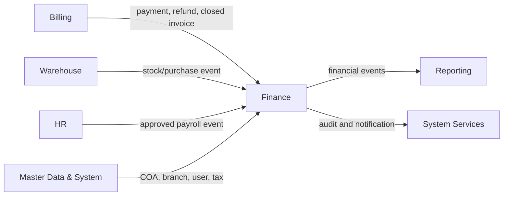
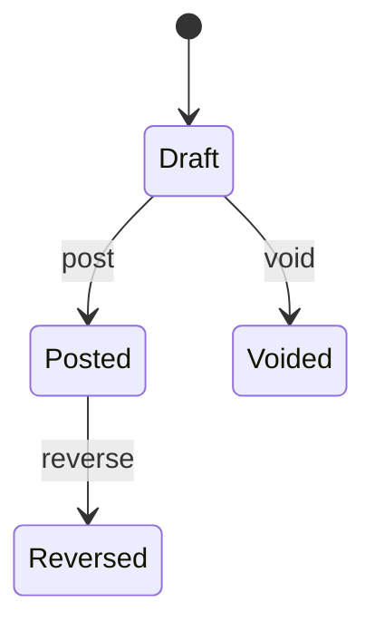
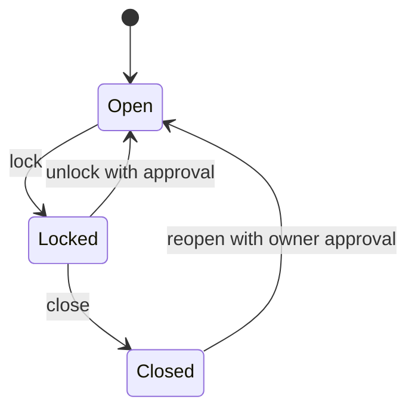
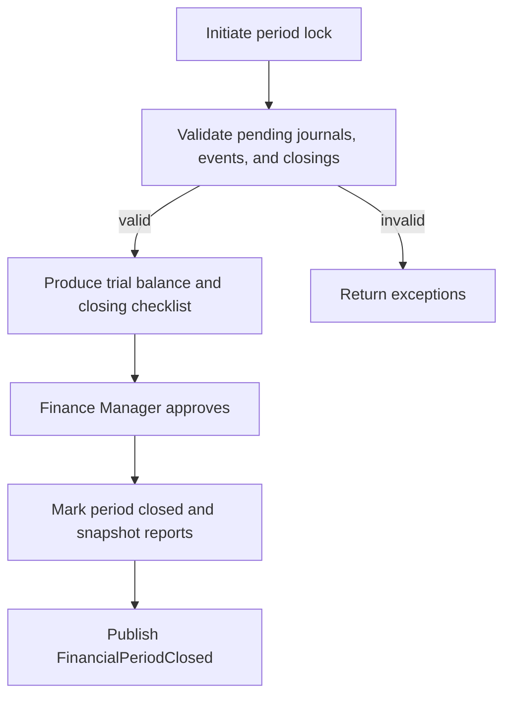

# Parakita Software Architecture Document (SAD)
# 17 - Module Finance

## Table of Contents

1. Introduction and scope
2. Module overview and architecture
3. Domain model and business rules
4. Use cases and workflows
5. Data model
6. API specification
7. Integration and events
8. Authorization, audit, and security
9. Exception handling
10. Reporting and period closing
11. Test scenarios and acceptance criteria
12. Deployment and roadmap

---

# 1. Introduction and Scope

## 1.1 Overview

Finance is Parakita's accounting and treasury module. It converts validated business events into traceable financial records, manages cash and bank movements, records operational expenses, settles doctor fees, and closes financial periods. Finance is the accounting system of record; Billing remains the source of patient charge and payment detail.

The module uses Indonesian Rupiah (`IDR`) as the initial functional currency. All monetary values are stored as `DECIMAL(18,2)` and calculated with decimal arithmetic; floating-point values are prohibited.

## 1.2 Purpose

The module provides:

- Double-entry journals with an always-balanced ledger.
- Cash and bank accountability by branch and cashier.
- Controlled recording, approval, and payment of expenses.
- Doctor-fee settlement based on approved billing data.
- Daily cash closing and periodic accounting close.
- Auditable financial statements and management reports.

## 1.3 In Scope

| Area | Coverage |
|---|---|
| General ledger | Chart of accounts, journal creation, posting, reversal, ledger inquiry |
| Treasury | Cash/bank accounts, cash movement, transfer, reconciliation, daily closing |
| Income | Automated recognition from Billing and authorised manual income |
| Expense | Expense request, approval, payment, and accounting posting |
| Doctor fee | Calculation review, settlement, payment, and reversal |
| Period | Opening, locking, closing, and reopening with approval |
| Tax | Tax configuration and tax payable/receivable postings |
| Reporting | Trial balance, ledger, income statement, cash flow, expense and closing reports |

## 1.4 Out of Scope

- Creating patient invoices, receiving patient payments, discounts, deposits, insurance claims, and refunds; these are owned by Billing.
- Stock valuation and supplier purchase workflows; these are owned by Warehouse.
- Payroll calculation; this is owned by HR. Finance only receives approved payroll journals when enabled.
- Statutory e-filing, multi-currency revaluation, consolidation, and external accounting-system synchronisation. These are roadmap items.

## 1.5 Design Principles

1. **Double entry by default.** Every posted journal has debit equal to credit.
2. **Immutable posting.** Posted journals, cash movements, and approved closings are never edited or deleted; correction uses a reversal and replacement transaction.
3. **Source ownership.** Finance records a reference to the source transaction and does not mutate its business state.
4. **Branch isolation.** Operational balances and access are filtered by `branch_id`; cross-branch activity requires explicit inter-branch configuration.
5. **Period integrity.** No posting may enter a locked or closed period.
6. **Audit by default.** Creation, approval, posting, reversal, closing, export, and configuration changes are auditable.

---

# 2. Module Overview and Architecture

## 2.1 Responsibilities

| Responsibility | Finance | Source module |
|---|:---:|:---:|
| Invoice/payment detail | Consumer | Billing |
| Revenue and payment journal | Owner | Billing event |
| Refund reversal journal | Owner | Billing event |
| Expense and cash disbursement | Owner | Finance |
| Inventory/COGS journal | Consumer/Owner | Warehouse event |
| Payroll journal | Consumer/Owner | HR event |
| Financial statement | Owner | Reporting consumer |

## 2.2 Dependencies

### Incoming dependencies

| Module | Data/event | Finance action |
|---|---|---|
| System | User, role, branch, audit service | Authorise and record actor/branch |
| Master Data | Account mapping, payment method, doctor, tax | Validate configuration and resolve ledger accounts |
| Billing | `InvoicePaid`, `PaymentReceived`, `RefundApproved`, `InvoiceClosed` | Post revenue/cash journal and make closing data available |
| Warehouse | `PurchaseReceived`, `StockIssued`, `StockAdjusted` | Post inventory, COGS, or adjustment journal when configured |
| HR | `PayrollApproved` | Post payroll payable/expense journal when enabled |

### Outgoing dependencies

| Consumer | Finance output |
|---|---|
| Reporting | Posted journal, closing, settlement, and report snapshot events |
| System audit | High-risk finance activity audit entries |
| Notification | Expense/closing/period approval notifications |

## 2.3 Context Diagram



## 2.4 Clean Architecture Placement

```text
finance/
├── domain/          # aggregates, entities, value objects, domain events
├── application/     # commands, queries, use cases, DTOs
├── infrastructure/  # ORM repositories, event handlers, report projections
└── presentation/    # REST controllers, request validation, policies
```

Domain rules must not depend on HTTP, ORM, queues, or a source module. Event handlers invoke application use cases and persist the source event idempotently in the same database transaction as the journal.

---

# 3. Domain Model and Business Rules

## 3.1 Bounded Context

Finance owns financial recognition, general ledger, treasury controls, operational expenses, doctor-fee settlement, and accounting close. It consumes source events only after their source transaction reaches a financially valid state.

## 3.2 Aggregates

| Aggregate root | Child entities | Invariants |
|---|---|---|
| `JournalEntry` | `JournalDetail` | At least two lines; total debit = total credit; posted entry immutable |
| `CashAccount` | `CashMovement` | Every movement has a reference, valid date, and allowed account status |
| `Expense` | approval/payment references | Approved before payment; paid amount cannot exceed approved amount |
| `DailyClosing` | reconciliation notes | One cashier/branch/date; variance requires explanation and approval |
| `FinancialPeriod` | close metadata | Only one open period per branch/date range; closed period rejects posting |
| `DoctorFeeSettlement` | fee lines/payment reference | Source fee is settled once; reversal creates an offsetting settlement |

## 3.3 Core Entities

### Account (Chart of Accounts)

An account represents an accounting classification. Required attributes include `code`, `name`, `account_type`, `normal_balance`, `parent_id`, `is_postable`, `is_active`, and optional branch ownership. Account types are `asset`, `liability`, `equity`, `revenue`, and `expense`.

Parent accounts are headings and cannot be posted to. An inactive account cannot be used for a new journal while historical ledger remains visible.

### Journal Entry and Detail

`JournalEntry` is the immutable accounting header: `journal_no`, `journal_date`, `branch_id`, `reference_type`, `reference_id`, `description`, `status`, `posted_at`, `posted_by`, `reversal_of_id`, and audit fields. Its details contain `account_id`, `debit`, `credit`, `description`, optional cost centre, and source line reference.

Journal statuses: `draft`, `posted`, `reversed`, `voided`. Only `draft` can be edited. `voided` is permitted only before posting; a posted entry is corrected through a linked reversing journal.

### Cash Account and Cash Movement

Cash accounts represent physical cash drawers, bank accounts, or approved payment clearing accounts. A movement is an immutable debit/credit operational record linked to a journal and business reference. Movement types are `receipt`, `disbursement`, `transfer_in`, `transfer_out`, `adjustment`, and `refund`.

### Expense

Expenses are operational costs not created by Billing. Types include rent, utility, supplies, maintenance, marketing, transport, administration, and other. Lifecycle: `draft → submitted → approved → paid`; `rejected` and `cancelled` can be reached before payment. A paid expense must have an expense journal and cash movement.

### Doctor Fee Settlement

A settlement groups eligible doctor-fee source records by doctor, branch, and period. Lifecycle: `draft → calculated → approved → paid`; `cancelled` is allowed before paid and `reversed` only through a compensating transaction. It never changes the original doctor-fee source.

## 3.4 Value Objects

| Value object | Rules |
|---|---|
| Money | Non-negative, IDR, scale 2; no float input |
| AccountingDate | Valid date within an open financial period |
| JournalNumber | Server-generated, unique, immutable after posting |
| AccountCode | Unique, uppercase code, hierarchy-compatible |
| Reference | `reference_type` and `reference_id` are both present for automated postings |
| ClosingVariance | Actual cash minus expected cash; reason required when non-zero |

## 3.5 Posting Rules

1. A journal has at least two non-zero detail lines.
2. A line has either debit or credit, never both; its amount is positive.
3. `SUM(debit) = SUM(credit)` is validated in application code and database transaction.
4. Account must be active, postable, and accessible to the journal branch.
5. Journal date must belong to an open period and may not precede the configured back-date limit without approval.
6. `(reference_type, reference_id, posting_type)` is unique for automatic posting to make delivery idempotent.
7. The journal, movement, outbox event, and idempotency record commit atomically.

## 3.6 Standard Posting Templates

Account codes below are logical mappings. Actual account ids are resolved from branch-effective configuration.

| Business event | Debit | Credit |
|---|---|---|
| Cash/QRIS patient payment | Cash/bank/clearing | Patient service revenue and tax payable where applicable |
| Receivable payment (if recognised earlier) | Cash/bank/clearing | Accounts receivable |
| Refund | Refund/contra-revenue or receivable | Cash/bank/clearing |
| Expense payment | Expense account | Cash/bank or accounts payable |
| Cash transfer | Destination cash/bank | Source cash/bank |
| Doctor fee accrual | Doctor fee expense | Doctor fee payable |
| Doctor fee payment | Doctor fee payable | Cash/bank |
| Stock issue/purchase | COGS or inventory | Inventory, payable, or cash according to source event |

The precise recognition point (payment or invoice closure) is configured once per branch and account mapping. It must not be changed retroactively; all changes require an effective date and audit record.

## 3.7 State Machines





---

# 4. Use Cases and Workflows

## 4.1 Actor Matrix

| Use case | Finance Staff | Finance Manager | Cashier | Clinic Manager | Owner | Administrator |
|---|:---:|:---:|:---:|:---:|:---:|:---:|
| View ledger/reports | ✔ | ✔ | limited | ✔ | ✔ | ✔ |
| Create manual journal | ✔ | ✔ | | | | ✔ |
| Post/reverse journal | | ✔ | | | | ✔ |
| Create/submit expense | ✔ | ✔ | | ✔ | | ✔ |
| Approve expense | | ✔ | | ✔ | | ✔ |
| Pay expense | ✔ | ✔ | | | | ✔ |
| Daily cash close | ✔ | ✔ | ✔ (own shift) | | | ✔ |
| Approve closing variance | | ✔ | | ✔ | | ✔ |
| Close/reopen period | | ✔ | | | ✔ | ✔ |
| Maintain COA mapping | | ✔ | | | | ✔ |

## 4.2 UC-FIN-001 — Post Billing Payment

**Trigger:** Billing publishes a successful `PaymentReceived`/`InvoicePaid` event.

1. Finance validates event schema, branch, payment method mapping, source state, and idempotency key.
2. Finance resolves the configured cash/bank/clearing, revenue, receivable, and tax accounts.
3. It creates a balanced journal and a cash movement when the debit account is a cash account.
4. It records the consumed event and writes `JournalPosted` to the outbox in one transaction.
5. A duplicate event returns the original result without another journal.

If account mapping is absent, the event is marked `failed_configuration`, no partial journal is created, and Finance Manager is notified.

## 4.3 UC-FIN-002 — Create and Post Manual Journal

Manual journals are used only for authorised adjustments, accruals, corrections, or opening balances. Finance Staff saves a draft with date, branch, description, and lines. Finance Manager validates supporting evidence and posts it. The creator cannot approve/post their own manual journal unless the user has an explicit `finance.journal.self_post` override, which is disabled by default.

## 4.4 UC-FIN-003 — Record Expense

1. Finance Staff creates draft expense with category, amount, expense date, vendor/payee, evidence, and expense account.
2. User submits it; approver verifies branch, category, budget policy, evidence, and amount.
3. On approval, Finance may record an accrual or wait for payment, according to the category configuration.
4. On payment, Finance selects an active cash/bank account, creates the payment journal and cash movement, and marks the expense `paid`.

No payment is permitted for rejected, cancelled, or already-paid expenses. Variances between approved and paid amount require a new approval when exceeding the configured tolerance.

## 4.5 UC-FIN-004 — Transfer Cash or Bank

The user creates a transfer between two distinct active cash accounts in the same branch. The system generates one journal and paired `transfer_out`/`transfer_in` movements with the same reference. Inter-branch transfers require the inter-branch clearing accounts and a Finance Manager approval.

## 4.6 UC-FIN-005 — Daily Cash Closing

1. Cashier or Finance selects branch, cashier shift, and closing date.
2. System calculates expected balance from the approved opening balance and posted cash movements.
3. User enters counted cash and denominations, then submits the close.
4. If variance is zero, authorised Finance Staff approves; otherwise, variance reason and Finance Manager approval are mandatory.
5. Approval locks the closing, prevents duplicate closure for the same scope, and emits `DailyClosingApproved`.

Cash closing does not alter previously posted movements. A correction is recorded by an adjustment journal and re-closing workflow, never by editing the approved close.

## 4.7 UC-FIN-006 — Settle Doctor Fee

1. Finance generates a draft settlement for one doctor, branch, and eligible date range.
2. System includes only approved, un-settled fee sources from Billing/EMR according to the configured fee rule.
3. Finance reviews line totals and exclusions; Finance Manager approves the settlement.
4. Payment creates a doctor-fee payable settlement journal and cash/bank movement; source lines become settled atomically.

## 4.8 UC-FIN-007 — Close Financial Period

Preconditions: all mandatory daily closings are approved, deferred source events are resolved, trial balance is balanced, and no draft accounting transaction remains for the period.



Reopening a closed period requires Owner approval, a mandatory reason, and audit logging. The system does not silently repost old data after reopening.

---

# 5. Data Model

## 5.1 Tables

The base database design defines the following Finance tables: `accounts`, `journal_entries`, `journal_details`, `cash_accounts`, `income_categories`, `expense_categories`, `expenses`, `cash_movements`, `daily_closings`, `doctor_fee_settlements`, `financial_periods`, and `taxes`.

All tables include standard audit fields: `id`, `created_at`, `created_by`, `updated_at`, `updated_by`, and where appropriate `deleted_at`/`deleted_by`. Financially posted data must not use soft delete.

## 5.2 Table Specifications

### accounts

| Column | Type | Rule |
|---|---|---|
| `id` | UUID | Primary key |
| `branch_id` | UUID nullable | Null = shared template; otherwise branch-effective account |
| `code` | varchar(30) | Unique per branch/template scope |
| `name` | varchar(150) | Required |
| `account_type` | enum | asset, liability, equity, revenue, expense |
| `normal_balance` | enum | debit or credit |
| `parent_id` | UUID nullable | Self-reference; no cyclic hierarchy |
| `is_postable` | boolean | False for headings |
| `is_active` | boolean | Required for new posting |

### journal_entries

| Column | Type | Rule |
|---|---|---|
| `journal_no` | varchar(40) | Unique, generated, immutable after posting |
| `journal_date` | date | Must be in open period |
| `branch_id` | UUID | Required |
| `reference_type` / `reference_id` | varchar / UUID | Required for automatic posts |
| `posting_type` | varchar(40) | Supports idempotency uniqueness |
| `description` | varchar(500) | Required |
| `status` | enum | draft, posted, reversed, voided |
| `posted_at` / `posted_by` | timestamp / UUID | Required when posted |
| `reversal_of_id` | UUID nullable | Unique linked source when reversing |

### journal_details

| Column | Type | Rule |
|---|---|---|
| `journal_entry_id` | UUID | Required FK |
| `account_id` | UUID | Active postable account at posting time |
| `debit` / `credit` | decimal(18,2) | Exactly one is positive |
| `description` | varchar(500) | Optional line explanation |
| `cost_center_id` | UUID nullable | Optional reporting dimension |

Database and application enforce `SUM(debit) = SUM(credit)` per posted journal.

### cash_accounts and cash_movements

`cash_accounts` holds `branch_id`, `code`, `name`, `account_type` (`cash`, `bank`, `clearing`), `ledger_account_id`, masked `account_number`, `is_active`, and reconciliation settings.

| Cash movement column | Rule |
|---|---|
| `cash_account_id` | Required active account |
| `journal_entry_id` | Required once posted |
| `movement_type` | receipt, disbursement, transfer_in, transfer_out, adjustment, refund |
| `reference_type` / `reference_id` | Required |
| `amount` | Positive decimal(18,2) |
| `movement_date` | Open-period accounting date |
| `direction` | in or out, matching movement type |

### expenses

| Column | Rule |
|---|---|
| `expense_no` | Unique server-generated number |
| `branch_id`, `expense_date`, `expense_category_id` | Required |
| `expense_account_id` | Required postable expense account |
| `amount`, `approved_amount`, `paid_amount` | Non-negative; paid ≤ approved |
| `payee_name`, `description`, `evidence_url` | Evidence required by configured threshold |
| `status` | draft, submitted, approved, rejected, paid, cancelled |
| `approved_by`, `paid_by`, `payment_journal_id` | Lifecycle controlled |

### daily_closings

The base design requires `branch_id`, `closing_date`, `cashier_id`, `opening_balance`, `closing_balance`, `difference`, and `approved_by`. The implementation additionally records `cash_account_id`, `expected_balance`, `counted_balance`, denomination JSON, status, reason, and related adjustment journal.

Unique constraint: `(branch_id, cash_account_id, cashier_id, closing_date, shift_id)` for non-cancelled closings.

### doctor_fee_settlements

Contains `settlement_no`, `branch_id`, `doctor_id`, period boundaries, `gross_amount`, deductions, `net_amount`, `status`, approval/payment metadata, source snapshot, and `journal_entry_id`. A child `doctor_fee_settlement_items` projection may be added for source-level traceability without modifying the authoritative source fee record.

### financial_periods and taxes

`financial_periods` holds `branch_id`, `period_name`, `start_date`, `end_date`, `status`, lock/close/reopen metadata, and snapshot reference. Date ranges for active periods must not overlap within a branch.

`taxes` holds `code`, `name`, `rate`, `input_account_id`, `output_account_id`, effective date range, branch scope, and active flag. Inactive or expired tax definitions cannot be applied to a new posting.

## 5.3 Indexes and Retention

| Table | Required index |
|---|---|
| `journal_entries` | `(branch_id, journal_date, status)`, unique `(reference_type, reference_id, posting_type)` |
| `journal_details` | `(account_id, journal_entry_id)` |
| `cash_movements` | `(cash_account_id, movement_date)`, `(reference_type, reference_id)` |
| `expenses` | `(branch_id, expense_date, status)` |
| `daily_closings` | unique closing scope |
| `financial_periods` | `(branch_id, start_date, end_date, status)` |

Posted journals and their details are retained for the legally configured accounting retention period and never purged through routine application jobs. Attachments follow the system document retention policy.

---

# 6. API Specification

All endpoints use `/api/v1`, JWT authentication, branch-aware authorisation, ISO-8601 dates, RFC 9457-style errors as adapted by `09-api-standard.md`, and the standard response envelope. Mutating endpoints accept `Idempotency-Key`; the key is required for payment, posting, reversal, approval, and close commands.

## 6.1 Chart of Accounts

| Method | Endpoint | Permission |
|---|---|---|
| GET | `/finance/accounts` | `finance.account.read` |
| POST | `/finance/accounts` | `finance.account.manage` |
| PATCH | `/finance/accounts/{accountId}` | `finance.account.manage` |
| POST | `/finance/accounts/{accountId}/deactivate` | `finance.account.manage` |

`POST /finance/accounts` body:

```json
{
  "branchId": "uuid",
  "code": "1110",
  "name": "Kas Utama",
  "accountType": "asset",
  "normalBalance": "debit",
  "parentId": null,
  "isPostable": true
}
```

## 6.2 Journals

| Method | Endpoint | Permission |
|---|---|---|
| GET | `/finance/journals` | `finance.journal.read` |
| GET | `/finance/journals/{journalId}` | `finance.journal.read` |
| POST | `/finance/journals` | `finance.journal.create` |
| PATCH | `/finance/journals/{journalId}` | `finance.journal.update` |
| POST | `/finance/journals/{journalId}/post` | `finance.journal.post` |
| POST | `/finance/journals/{journalId}/reverse` | `finance.journal.reverse` |
| POST | `/finance/journals/{journalId}/void` | `finance.journal.void` |

Create manual journal:

```json
{
  "branchId": "uuid",
  "journalDate": "2026-07-31",
  "description": "Accrual listrik Juli 2026",
  "lines": [
    { "accountId": "expense-account-uuid", "debit": "1250000.00", "credit": "0.00", "description": "Beban listrik" },
    { "accountId": "payable-account-uuid", "debit": "0.00", "credit": "1250000.00", "description": "Utang listrik" }
  ]
}
```

Post response contains journal id, immutable journal number, status, posting date, debit total, credit total, and related references. Reversal request must contain `journalDate` and `reason`; it returns the linked reversal journal.

## 6.3 Cash and Expense

| Method | Endpoint |
|---|---|
| GET/POST | `/finance/cash-accounts` |
| GET | `/finance/cash-accounts/{cashAccountId}/movements` |
| POST | `/finance/cash-transfers` |
| GET/POST | `/finance/expenses` |
| GET/PATCH | `/finance/expenses/{expenseId}` |
| POST | `/finance/expenses/{expenseId}/submit` |
| POST | `/finance/expenses/{expenseId}/approve` |
| POST | `/finance/expenses/{expenseId}/reject` |
| POST | `/finance/expenses/{expenseId}/pay` |

Pay expense request:

```json
{
  "cashAccountId": "uuid",
  "paymentDate": "2026-07-31",
  "amount": "500000.00",
  "referenceNo": "BKK-20260731-001",
  "note": "Pembayaran listrik"
}
```

## 6.4 Closing, Settlement, and Period

| Method | Endpoint |
|---|---|
| POST | `/finance/daily-closings` |
| POST | `/finance/daily-closings/{closingId}/approve` |
| GET | `/finance/daily-closings` |
| GET | `/finance/doctor-fee-settlements` |
| GET | `/finance/doctor-fee-settlements/{settlementId}` |
| POST | `/finance/doctor-fee-settlements/generate` |
| POST | `/finance/doctor-fee-settlements/{settlementId}/approve` |
| POST | `/finance/doctor-fee-settlements/{settlementId}/pay` |
| GET/POST | `/finance/periods` |
| POST | `/finance/periods/{periodId}/lock` |
| POST | `/finance/periods/{periodId}/close` |
| POST | `/finance/periods/{periodId}/reopen` |

> **Addendum (post-launch):** the 2 `GET .../doctor-fee-settlements*` rows were not part of task-166/167's original scope (Epic AE, UC-FIN-006) — the frontend had no way to browse a settlement after generating it. `finance.settlement.read` was already a defined-but-unused permission in Section 8.1 (the routes file's own inline comment flagged it as reserved); these two routes are what finally activate it — no new permission code was added. See `docs/06-tasks/task-166.md`/`task-167.md` for the original scope this deviates from.

Daily close request:

```json
{
  "branchId": "uuid",
  "cashAccountId": "uuid",
  "cashierId": "uuid",
  "closingDate": "2026-07-31",
  "countedBalance": "2150000.00",
  "denominations": [
    { "nominal": 100000, "quantity": 20 },
    { "nominal": 50000, "quantity": 3 }
  ],
  "varianceReason": null
}
```

## 6.5 Reports

| Endpoint | Output |
|---|---|
| `GET /finance/reports/trial-balance` | Account debit/credit/balance by period |
| `GET /finance/reports/general-ledger` | Journal lines by account |
| `GET /finance/reports/income-statement` | Revenue, expense, net result |
| `GET /finance/reports/cash-flow` | Inflow/outflow by cash account/category |
| `GET /finance/reports/expenses` | Expense status/category/payee analysis |
| `GET /finance/reports/daily-closing` | Expected/count/variance/approval |

All report endpoints require `branchId`, `dateFrom`, and `dateTo` unless the report uses `periodId`; pagination and export follow the API standard.

## 6.6 Error Codes

| Code | HTTP | Meaning |
|---|---:|---|
| `FIN_JOURNAL_UNBALANCED` | 422 | Debit and credit totals differ |
| `FIN_PERIOD_CLOSED` | 409 | Posting date belongs to a closed period |
| `FIN_ACCOUNT_NOT_POSTABLE` | 422 | Heading/inactive account selected |
| `FIN_DUPLICATE_POSTING` | 409 | Source reference already posted |
| `FIN_EXPENSE_NOT_APPROVED` | 409 | Expense cannot be paid yet |
| `FIN_CLOSING_DUPLICATE` | 409 | Closing exists for scope/date |
| `FIN_CLOSING_VARIANCE_REASON_REQUIRED` | 422 | Non-zero variance lacks reason |
| `FIN_SETTLEMENT_SOURCE_USED` | 409 | Doctor-fee source has been settled |
| `FIN_SEGREGATION_OF_DUTIES` | 403 | Creator cannot approve/post action |
| `FIN_ACCOUNT_MAPPING_MISSING` | 422 | Configured posting account unavailable |

---

# 7. Integration and Events

## 7.1 Event Contract

Events are delivered through the integration bus using an outbox/inbox pattern. Every message contains `eventId`, `eventType`, `occurredAt`, `source`, `branchId`, `correlationId`, `schemaVersion`, and `payload`. Consumers deduplicate by `eventId`; retries are safe and do not create a duplicate financial posting.

## 7.2 Incoming Events

| Event | Validation | Result |
|---|---|---|
| `billing.payment.received.v1` | Payment is successful; amount/method/account mapping valid | Cash/clearing and revenue/receivable journal |
| `billing.refund.approved.v1` | Original payment/reference exists; refund amount valid | Refund and cash-out reversal journal |
| `billing.invoice.closed.v1` | Invoice is closed | Reconcile readiness / configured accrual journal |
| `warehouse.purchase.received.v1` | Supplier/item mappings valid | Configured inventory/payable posting |
| `warehouse.stock.issued.v1` | Source is final and not reposted | Configured COGS/inventory posting |
| `hr.payroll.approved.v1` | Period and payroll reference valid | Payroll expense/payable posting |

## 7.3 Outgoing Events

| Event | When | Consumers |
|---|---|---|
| `finance.journal.posted.v1` | Journal commits as posted | Reporting, audit projection |
| `finance.journal.reversed.v1` | Reversal commits | Reporting, audit projection |
| `finance.expense.paid.v1` | Expense payment posted | Reporting |
| `finance.daily-closing.approved.v1` | Closing approved | Reporting, notification |
| `finance.period.closed.v1` | Period close complete | Reporting, System |
| `finance.doctor-fee-settlement.paid.v1` | Settlement paid | HR/Reporting where configured |

## 7.4 Failure Handling

An event handler retries transient failures with exponential backoff. Permanent business/configuration failures are sent to a monitored dead-letter queue with no ledger side effect. Finance staff correct configuration and replay the original event using its idempotency key. Replaying must not bypass period, account, or authorisation controls.

---

# 8. Authorization, Audit, and Security

## 8.1 Permission Catalog

| Permission group | Permissions |
|---|---|
| Account | `finance.account.read`, `finance.account.manage` |
| Journal | `finance.journal.read`, `create`, `update`, `post`, `reverse`, `void` |
| Cash | `finance.cash.read`, `manage`, `transfer`, `close`, `approve_close` |
| Expense | `finance.expense.read`, `create`, `approve`, `pay`, `cancel` |
| Settlement | `finance.settlement.read`, `generate`, `approve`, `pay` |
| Period | `finance.period.read`, `manage`, `lock`, `close`, `reopen` |
| Report | `finance.report.read`, `finance.report.export` |

## 8.2 Segregation of Duties

- The person creating a manual journal cannot post it.
- Expense requester cannot approve their own expense; payer cannot approve a high-value expense they created.
- Cashier may submit only their own drawer/shift closing; variance approval is separate.
- Only Owner or delegated Administrator may reopen a period.
- System-generated journals are posted by service identity, but the originating user and source event remain audit fields.

## 8.3 Branch and Data Security

The server derives accessible branches from the authenticated subject. Client-provided `branchId` is a filter/request, not an authority grant. Users may never access cash account balances, journals, evidence, exports, or closing data outside their authorised branch.

Sensitive bank-account values are masked in responses and encrypted at rest according to the system security design. Attachments are malware-scanned, access-controlled, and served through authorised temporary links.

## 8.4 Audit Requirements

Audit events include actor, impersonation actor if applicable, branch, action, resource, before/after state where permissible, timestamp, IP/device metadata, correlation id, and reason. Mandatory audited actions: journal posting/reversal/void, account mapping change, expense approval/payment, cash transfer/adjustment, closing approval, period close/reopen, settlement payment, and report export.

---

# 9. Exception Handling

| Scenario | System response | Resolution |
|---|---|---|
| Unbalanced journal | Reject before persistence | Correct journal lines |
| Duplicate Billing event | Return existing posting result | No user action required |
| Missing ledger mapping | Do not post; create configuration exception | Finance Manager maps account then replays event |
| Closed period | Reject command/event posting | Post in permitted period by authorised correction policy or reopen with approval |
| Account deactivated | Reject new line | Select/migrate to active account; historical data unchanged |
| Expense paid twice | Reject duplicate payment reference/status | Use reversal if duplicate was already posted |
| Cash variance | Require reason and approver | Record adjustment journal after investigation |
| Source refund exceeds original | Reject event | Correct source Billing transaction |
| Event delivery fails after commit | Outbox retries | Monitor and replay; ledger is already consistent |
| Audit write failure | Roll back high-risk transaction | Restore audit service and retry |

Financial exceptions never use a direct database update to change posted balance. All repair follows a documented compensating transaction with audit evidence.

---

# 10. Reporting and Period Closing

## 10.1 Dashboard KPIs

| KPI | Definition |
|---|---|
| Cash position | Posted balance by active cash/bank account |
| Daily receipts/disbursements | Sum of posted cash movements for day |
| Revenue | Posted revenue, excluding/including tax according to filter |
| Operating expense | Posted expense for selected period |
| Net result | Revenue minus expense after configured adjustments |
| Unapproved expense | Submitted expense amount/count |
| Cash variance | Difference from daily closings |
| Pending source events | Finance events awaiting resolution |

## 10.2 Report Controls

Reports only include posted journals. Draft records are visible in operational worklists but excluded from financial statements. Every report displays branch, date/period range, generated-at time, filters, and data-as-of marker. Exports are logged and watermarked with requester identity where supported.

## 10.3 Period Closing Checklist

1. Confirm all required daily closings are approved or explicitly excepted.
2. Resolve failed/deferred source events and unposted finance drafts.
3. Reconcile cash/bank movements to cash accounts.
4. Review trial balance; debit total equals credit total.
5. Review expense, doctor-fee, and tax accrual exceptions.
6. Lock the period, produce review reports, then obtain approval.
7. Close the period and retain immutable statement snapshots.

## 10.4 Reconciliation

Cash reconciliation compares expected balance (opening plus inbound less outbound posted movements) against count or bank statement balance. Reconciliation differences are not silently absorbed. A documented adjustment is posted to a configured cash-over-short account after approval.

---

# 11. Test Scenarios and Acceptance Criteria

| ID | Scenario | Expected result |
|---|---|---|
| TC-FIN-001 | Post balanced manual journal | Posted journal has unique number and equal debit/credit |
| TC-FIN-002 | Post unbalanced journal | 422 `FIN_JOURNAL_UNBALANCED`; no header/details persist |
| TC-FIN-003 | Receive same payment event twice | Exactly one journal/cash movement exists |
| TC-FIN-004 | Billing payment with mapping missing | No journal; exception is traceable and replayable |
| TC-FIN-005 | Reverse posted journal | Original remains immutable; linked opposite journal posts |
| TC-FIN-006 | Edit posted journal | Denied; correction path is reversal only |
| TC-FIN-007 | Pay unapproved expense | Rejected; no cash movement |
| TC-FIN-008 | Expense self-approval | Rejected by segregation-of-duties policy |
| TC-FIN-009 | Cash transfer | One balanced journal and paired in/out movements |
| TC-FIN-010 | Zero-variance daily close | Can be approved and locks closing scope |
| TC-FIN-011 | Non-zero daily close without reason | Rejected with variance reason error |
| TC-FIN-012 | Duplicate daily close | Rejected by unique closing scope |
| TC-FIN-013 | Settle doctor fee twice | Second settlement rejects already-used source line |
| TC-FIN-014 | Post into closed period | 409 `FIN_PERIOD_CLOSED`; no ledger change |
| TC-FIN-015 | Reopen period by unauthorised role | 403; period remains closed |
| TC-FIN-016 | Cross-branch report request | Only authorised branch data returns |
| TC-FIN-017 | Concurrent payment events | No duplicate posting and trial balance remains balanced |
| TC-FIN-018 | Outbox consumer retry | Event arrives once logically; source journal remains single |

Acceptance criteria:

- Every posted journal balances to zero difference at two decimal precision.
- Financial source events are idempotent and traceable to a single journal reference.
- Posted data cannot be changed through UI, API, or routine job.
- Branch authorisation and period rules are enforced on every write and report.
- Daily closing and period close produce complete audit trails and reportable snapshots.

---

# 12. Deployment and Roadmap

## 12.1 Operational Requirements

Finance runs in the same modular backend and relational database architecture as other Parakita modules. Posting requires database transaction support, a durable outbox table/worker, reliable audit persistence, scheduled close/reminder jobs, and monitored dead-letter processing.

Minimum observability:

- Journal posting success/failure, latency, and duplicate-event count.
- Unbalanced-journal validation failures (should always result in zero posted records).
- Event backlog/dead-letter count and oldest pending age.
- Closing/period-close duration and unresolved exception count.
- Cash variance total/count by branch.
- Report/export volume and authorisation denials.

Backups must support point-in-time recovery for the finance database. Restore procedures are tested periodically and must preserve referential integrity between journals, details, source-event inbox, and audit records.

## 12.2 Scalability

Read-heavy reports use indexed read models or replicas while all journal posting remains on the primary transactional store. Journal rows may be partitioned by accounting year after volume requires it; uniqueness, foreign-key integrity, and retention remain intact. Do not use asynchronous projections as the authority for posting balances.

## 12.3 Roadmap

| Phase | Enhancement |
|---|---|
| 1 | COA, automated Billing journal, cash movement, expense, daily close, core reports |
| 2 | Doctor-fee settlement, Warehouse/HR postings, bank reconciliation, scheduled period close |
| 3 | Budget versus actual, approval thresholds, accounting export, richer financial dashboard |
| 4 | External accounting integration, e-tax support, multi-currency, consolidation and anomaly detection |

---

# Summary

The Finance Module provides the controlled, auditable accounting layer for Parakita. It receives financially valid operational events, posts immutable double-entry journals, controls cash and expense activity, supports fee settlement and closing, and supplies reliable data to Reporting. Its critical safeguards are balanced journals, source-event idempotency, branch/period isolation, segregation of duties, and correction through reversal rather than mutation.
