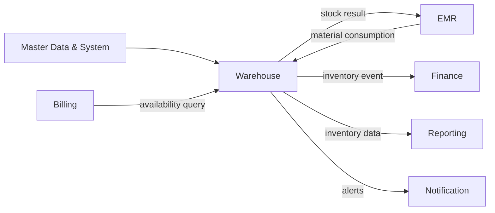
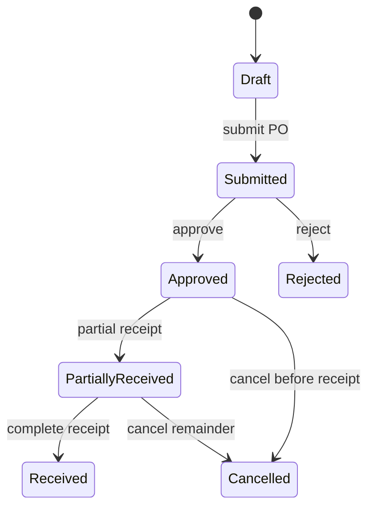
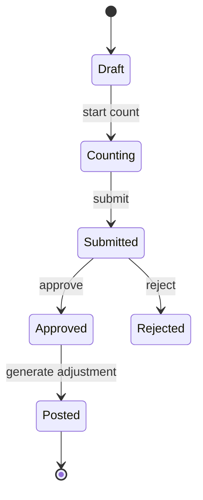
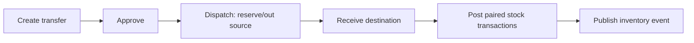

# Parakita Software Architecture Document (SAD)
# 18 - Module Warehouse

## Table of Contents

1. Pendahuluan dan ruang lingkup
2. Arsitektur dan integrasi modul
3. Model domain dan aturan bisnis
4. Use case dan workflow
5. Desain data dan persediaan
6. Spesifikasi API
7. Event dan integrasi lintas modul
8. Otorisasi, audit, dan keamanan
9. Penanganan exception
10. Laporan dan operasional stok
11. Skenario pengujian dan acceptance criteria
12. Deployment dan roadmap

---

# 1. Pendahuluan dan Ruang Lingkup

## 1.1 Overview

Warehouse mengelola persediaan barang medis dan nonmedis untuk seluruh cabang Parakita. Modul ini menangani pembelian, penerimaan, penyimpanan, penggunaan material, mutasi antar gudang/cabang, penyesuaian, stock opname, batch/masa kedaluwarsa, dan peringatan stok.

Warehouse adalah **system of record** untuk saldo stok dan riwayat pergerakannya. EMR tetap menjadi pemilik data klinis dan memicu konsumsi material; Billing menjadi pemilik tagihan; Finance menjadi pemilik jurnal keuangan. Warehouse tidak mengubah data dari ketiga modul tersebut.

## 1.2 Tujuan

- Menjamin saldo stok akurat, dapat ditelusuri, dan terisolasi per gudang serta cabang.
- Mengurangi stok otomatis untuk material yang dipakai pada tindakan medis yang final.
- Menyediakan proses purchase-to-receipt yang terkendali.
- Menghindari stok negatif, penggunaan batch kedaluwarsa, dan transaksi duplikat.
- Mendukung stock opname dan adjustment dengan approval serta audit trail.
- Menyediakan data inventory yang valid bagi operasional, Billing, Finance, dan Reporting.

## 1.3 In Scope

| Area | Cakupan |
|---|---|
| Master inventory | Item, kategori, unit, supplier, minimum stock, konfigurasi batch |
| Procurement | Purchase order, approval, penerimaan barang, retur pembelian |
| Stock ledger | Saldo per gudang/item/batch dan transaksi stok immutable |
| Clinical consumption | Pengurangan material dari EMR/treatment yang memenuhi syarat |
| Movement | Transfer gudang/cabang, issue, return, adjustment |
| Stock control | Reservation, stock opname, batch/expiry, low-stock alert |
| Reporting | Kartu stok, saldo, movement, purchase, expiry, opname, valuation projection |

## 1.4 Out of Scope

- Pembuatan tindakan klinis, resep, dan keputusan medis; milik EMR.
- Pembuatan invoice/penagihan pasien; milik Billing.
- Pembayaran supplier, buku besar, dan COGS resmi; milik Finance. Warehouse hanya mengirim event sumber.
- Perencanaan kebutuhan otomatis, integrasi vendor, barcode/RFID perangkat keras, dan inventory konsinyasi; roadmap kecuali dikonfigurasi kemudian.

## 1.5 Prinsip Desain

1. **Ledger-first.** Saldo stok merupakan proyeksi dari transaksi stok yang immutable.
2. **No negative stock.** Stok tersedia tidak boleh kurang dari nol, kecuali kebijakan emergency yang eksplisit, disetujui, dan diaudit.
3. **Source ownership.** Warehouse menerima referensi event dari modul lain dan tidak mengubah state sumber.
4. **Branch and warehouse isolation.** Semua saldo dan akses dibatasi oleh `branch_id` dan `warehouse_id`.
5. **FEFO for expiry-tracked items.** Batch yang kedaluwarsa paling dekat dipilih terlebih dahulu, kecuali pengguna berwenang memilih batch lain dengan alasan.
6. **Correction by counter transaction.** Transaksi stok yang sudah posted tidak diedit/dihapus; koreksi memakai retur, adjustment, atau reversal yang terhubung.
7. **Audit by default.** Approval, penerimaan, adjustment, opname, transfer, override batch, dan perubahan master dicatat.

---

# 2. Arsitektur dan Integrasi Modul

## 2.1 Tanggung Jawab

| Aktivitas | Warehouse | Modul lain |
|---|:---:|:---:|
| Definisi item/supplier | Owner bersama Master Data | Master Data menyediakan referensi dasar |
| Saldo, batch, mutasi stok | Owner | Konsumen |
| Penggunaan material tindakan | Owner atas stok; consumer event | EMR pemilik tindakan |
| Harga/tagihan item pasien | Consumer informasi item | Billing pemilik invoice |
| Jurnal persediaan/COGS | Mengirim event sumber | Finance pemilik posting |
| Laporan stok | Owner | Reporting consumer/proyeksi |

## 2.2 Dependency

### Incoming dependency

| Modul | Data atau event | Aksi Warehouse |
|---|---|---|
| System | User, role, branch, audit, attachment | Otorisasi, isolasi cabang, bukti transaksi |
| Master Data | Item, kategori, unit, supplier, dokter | Validasi referensi dan konfigurasi |
| EMR | `TreatmentMaterialFinalized`, `TreatmentMaterialReversed` | Issue/return material secara idempoten |
| Billing | Kebutuhan availability item bila diaktifkan | Memberikan query saldo; tidak menjadi sumber pengurangan klinis |
| Finance | Status/referensi pembelian bila diperlukan | Tautkan purchase dengan referensi keuangan tanpa mengubah jurnal |

### Outgoing dependency

| Consumer | Output Warehouse |
|---|---|
| EMR | Ketersediaan material, sukses/gagal konsumsi, lot/batch terpakai |
| Billing | Data item dan availability bila diperlukan untuk charge |
| Finance | `PurchaseReceived`, `StockIssued`, `StockAdjusted`, `StockOpnameApproved` |
| Reporting | Event perubahan stok, purchase, expiry, opname, alert |
| Notification | Low-stock, expired/near-expiry, approval pending |

## 2.3 Context Diagram



## 2.4 Clean Architecture Placement

```text
warehouse/
├── domain/          # item, stock, batch, purchase, movement, rules
├── application/     # commands, queries, DTO, use cases, event handlers
├── infrastructure/  # repository, lock/ORM, outbox, projections
└── presentation/    # REST controller, validation, policy
```

Domain logic tidak bergantung pada controller, ORM, message broker, maupun modul EMR/Finance. Event handler menerjemahkan kontrak integrasi menjadi command Warehouse dan menyimpan inbox/idempotency record, stock transaction, stock balance, serta outbox dalam satu transaksi database.

---

# 3. Model Domain dan Aturan Bisnis

## 3.1 Bounded Context

Bounded context Warehouse mencakup ketersediaan fisik barang, lokasi penyimpanan, pergerakan, dan bukti asal stok. Satu unit stok dicatat berdasarkan item, gudang, dan—untuk item batch-tracked—batch. Saldo tampilan adalah cache/proyeksi yang hanya berubah melalui transaksi stok resmi.

## 3.2 Aggregate Design

| Aggregate root | Entity/child | Invariant utama |
|---|---|---|
| `PurchaseOrder` | `PurchaseOrderItem` | Kuantitas diterima tidak melebihi ordered kecuali approval over-receipt |
| `GoodsReceipt` | receipt item, batch allocation | Hanya PO approved/open; penerimaan menghasilkan stok masuk sekali |
| `StockBalance` | batch allocation/reservation | `available = current - reserved`; tidak negatif |
| `StockTransfer` | transfer item | Quantity out = quantity in; sumber dan tujuan berbeda |
| `StockOpname` | `StockOpnameItem` | Snapshot dihitung sekali; approval membuat adjustment sekali |
| `StockAdjustment` | adjustment line | Alasan, bukti, dan approval sesuai threshold wajib |

## 3.3 Entitas Utama

### Item

Item merepresentasikan barang yang dapat disimpan atau digunakan: kode, nama, kategori, unit, minimum stock, purchase price referensi, selling price referensi, `is_consumable`, `is_batch_tracked`, `is_expiry_tracked`, dan status aktif. Item nonaktif tidak dapat dipilih untuk transaksi baru, tetapi histori tetap tersedia.

### Warehouse dan Stock Balance

Warehouse adalah lokasi stok fisik pada satu cabang. `StockBalance` menyimpan `current_stock`, `reserved_stock`, dan `available_stock` untuk kombinasi warehouse-item (dan batch bila diperlukan). Nilai `available_stock` dihitung server-side, bukan diterima dari klien.

### Stock Transaction

Stock transaction adalah ledger immutable yang menyimpan `transaction_number`, warehouse, item, batch, type, reference, `qty_in`, `qty_out`, saldo setelah transaksi, tanggal, actor, dan metadata. Tipe mendukung `PURCHASE`, `TREATMENT`, `SALE`, `ADJUSTMENT`, `TRANSFER`, `OPNAME`, `RETURN`, `RESERVATION`, dan `RELEASE_RESERVATION`.

### Purchase Order dan Goods Receipt

PO mengikat supplier, cabang, item, harga, quantity ordered, dan expected date. Goods receipt membuktikan fisik barang diterima dan dapat diterima sebagian. Hanya receipt yang posted menambah stock ledger. Pembatalan PO tidak dapat membatalkan receipt yang sudah posted.

### Item Batch

Batch menyimpan nomor batch/lot, item, warehouse, tanggal terima, expiry date, quantity awal, dan quantity tersisa. Item yang `is_expiry_tracked=true` wajib mempunyai batch dan expiry date pada saat receipt. Batch expired tidak dapat diissue; near-expiry menimbulkan alert sesuai konfigurasi.

### Stock Opname dan Adjustment

Opname merekam snapshot jumlah sistem versus hitung fisik. Setelah diapprove, selisih dikonversi sekali menjadi transaksi `OPNAME`. Adjustment digunakan untuk sebab selain hitung fisik, misalnya rusak, hilang, sample, atau koreksi penerimaan, dan selalu memerlukan alasan serta bukti sesuai kebijakan.

## 3.4 Value Objects

| Value object | Aturan |
|---|---|
| Quantity | `DECIMAL(18,2)`, lebih besar dari nol untuk pergerakan; mengikuti presisi unit |
| StockKey | Kombinasi item, warehouse, dan batch yang valid |
| BatchNumber | Wajib unik pada scope item/warehouse bila batch tracked |
| ExpiryDate | Tanggal valid; tidak boleh sebelum receipt date |
| MovementReference | `reference_type` dan `reference_id` wajib untuk transaksi terintegrasi |
| StockVariance | Physical count dikurangi system snapshot; reason wajib bila tidak nol |

## 3.5 Aturan Saldo dan Concurrency

1. Semua mutasi stok mengunci baris saldo terkait (`SELECT ... FOR UPDATE` atau optimistic version check) di dalam transaksi.
2. `current_stock = previous_current + qty_in - qty_out`; `available_stock = current_stock - reserved_stock`.
3. Stok out hanya boleh menggunakan `available_stock` yang cukup.
4. Setiap event sumber memiliki key unik `(reference_type, reference_id, transaction_type, item_id, batch_id)` untuk mencegah duplikasi.
5. Satu stock transaction hanya memiliki salah satu `qty_in` atau `qty_out` bernilai positif.
6. Posting gagal secara atomik: tidak boleh ada ledger tanpa perubahan saldo atau sebaliknya.
7. Override negative stock harus memiliki permission khusus, alasan, approval, dan alert; default-nya ditolak.

## 3.6 Aturan Batch, Expiry, dan Valuation

- Item batch/expiry-tracked wajib dialokasikan ke batch saat receipt, issue, transfer, return, dan adjustment.
- Algoritma default issue adalah FEFO berdasarkan `expiry_date` terdekat, lalu `received_at` terlama.
- Batch dengan `expiry_date < transaction_date` tidak boleh digunakan atau ditransfer sebagai stok aktif.
- Barang rusak/expired dipindahkan melalui adjustment/return yang memiliki reason code dan bukti.
- Biaya stok menggunakan metode konfigurasi per tenant (default: weighted average). Warehouse menyimpan source cost; Finance adalah otoritas pencatatan nilai/jurnal resmi.

## 3.7 State Machine





---

# 4. Use Case dan Workflow

## 4.1 Actor Matrix

| Use case | Warehouse Staff | Warehouse Manager | Finance | Doctor/Nurse | Clinic Manager | Administrator |
|---|:---:|:---:|:---:|:---:|:---:|:---:|
| Lihat stok/kartu stok | ✔ | ✔ | ✔ | limited | ✔ | ✔ |
| Buat/submit PO | ✔ | ✔ | | | | ✔ |
| Approve/reject PO | | ✔ | | | ✔ | ✔ |
| Terima barang | ✔ | ✔ | | | | ✔ |
| Transfer/issue stock | ✔ | ✔ | | request via EMR | | ✔ |
| Adjustment/opname | ✔ | ✔ | | | | ✔ |
| Approve variance/adjustment | | ✔ | ✔ (financial threshold) | | ✔ | ✔ |
| Kelola item/warehouse | | ✔ | | | | ✔ |
| Export laporan | ✔ | ✔ | ✔ | | ✔ | ✔ |

## 4.2 UC-WHS-001 — Create and Approve Purchase Order

1. Warehouse Staff memilih branch, supplier aktif, warehouse tujuan, item aktif, quantity, unit price, dan expected date.
2. Sistem memvalidasi tidak ada duplicate draft PO supplier/reference dan menghitung total.
3. Staff submit PO; status menjadi `submitted`.
4. Warehouse Manager atau approver sesuai threshold memeriksa supplier, harga, quantity, dan justifikasi lalu approve/reject.
5. Hanya PO `approved`/`partially_received` dapat dipakai untuk goods receipt.

PO tidak menambah stok dan tidak otomatis membuat kewajiban Finance sebelum receipt diposting.

## 4.3 UC-WHS-002 — Receive Goods

1. Petugas memilih PO approved dan warehouse tujuan.
2. Untuk setiap line, masukkan quantity diterima, batch, expiry date, unit cost, dan evidence dokumen penerimaan bila diwajibkan.
3. Sistem menolak quantity nol/negatif, item tidak sesuai PO, batch invalid, atau over-receipt tanpa approval.
4. Posting receipt membuat `PURCHASE` stock transaction, memperbarui saldo/batch secara atomik, dan memperbarui quantity received PO.
5. Sistem menerbitkan `warehouse.goods-receipt.posted.v1` untuk Finance dan Reporting.

## 4.4 UC-WHS-003 — Consume Material from EMR

**Trigger:** EMR menerbitkan `TreatmentMaterialFinalized` setelah tindakan valid/final.

1. Handler memvalidasi event id, branch, visit/treatment, item, quantity, dan gudang sumber.
2. Sistem memilih batch FEFO atau memvalidasi batch yang diminta oleh EMR bila kebijakan mengizinkan.
3. Warehouse mengunci saldo, memastikan stok tersedia, lalu membuat transaksi `TREATMENT` out untuk setiap alokasi batch.
4. Sistem menyimpan inbox record dan mengirim hasil/event `warehouse.material-consumed.v1` secara atomik dengan transaksi.
5. Jika EMR membatalkan/reverse tindakan, event return membuat transaksi `RETURN` yang menaut ke konsumsi asal; batch asal diprioritaskan bila masih valid.

Kegagalan kekurangan stok tidak boleh mengubah EMR secara langsung. Warehouse mengirim status gagal yang dapat ditindaklanjuti melalui workflow klinis/operasional sesuai kebijakan.

## 4.5 UC-WHS-004 — Transfer Stock

Transfer mencakup `draft → submitted → approved → dispatched → received`. Saat dispatch, stok sumber menjadi reserved atau keluar sesuai konfigurasi; pada penerimaan, stok tujuan bertambah. Untuk transfer antar cabang, approval manager dan konfigurasi tujuan wajib tersedia. Tidak ada transfer ke gudang yang sama.



## 4.6 UC-WHS-005 — Stock Adjustment

Adjustment dipakai untuk barang rusak, hilang, expired, sample, koreksi administrasi, atau stock-in non-PO yang telah disetujui. User wajib memilih reason code, arah/quantity, tanggal, warehouse, item/batch, dan bukti untuk threshold yang berlaku. Adjustment baru posted setelah approval sesuai matriks; sistem membuat satu transaksi ledger dan event Finance bila konfigurasi valuation mengharuskannya.

## 4.7 UC-WHS-006 — Stock Opname

1. Warehouse Manager membuka opname untuk gudang/tanggal dan sistem mengambil snapshot saldo.
2. Petugas menghitung fisik; setiap line menyimpan physical count, batch, catatan, dan bukti jika perlu.
3. Saat submit, sistem menghitung variance tanpa mengubah saldo.
4. Approver mereview variance; line bermasalah dapat dikoreksi/dihitung ulang sebelum approval.
5. Approval menghasilkan transaksi `OPNAME` adjustment satu kali dan mengunci dokumen opname.

## 4.8 UC-WHS-007 — Reserve and Release Stock

Reservation opsional digunakan agar permintaan yang sah tidak direbut transaksi lain. Reservation menambah `reserved_stock` dan mengurangi `available_stock` tanpa mengurangi `current_stock`. Release atau expiration mengembalikan available stock. Konsumsi dari reservation harus memakai reference yang sama dan melepaskan reserve dalam transaksi atomik.

---

# 5. Desain Data dan Persediaan

## 5.1 Tabel Referensi

Dokumen database mendefinisikan tabel: `items`, `item_categories`, `units`, `suppliers`, `purchases`, `purchase_items`, `warehouses`, `warehouse_stocks`, `stock_transactions`, `stock_adjustments`, `stock_opnames`, `stock_opname_items`, `item_batches`, `item_mutations`, dan `stock_alerts`.

Data dictionary juga menggunakan nama transisi `purchase_order`, `purchase_order_item`, `goods_receipt`, `inventory_stock`, dan `inventory_transaction`. Implementasi memilih satu nama fisik yang konsisten melalui migration; dokumen ini memakai istilah domain PO, goods receipt, stock balance, dan stock transaction tanpa mengubah kontrak business.

## 5.2 Item, Supplier, dan Warehouse

### items

| Kolom | Aturan |
|---|---|
| `item_code` | Unique, server/manual sesuai policy, immutable setelah ada transaksi |
| `item_name`, `category_id`, `unit_id` | Wajib dan aktif |
| `minimum_stock` | Decimal non-negative; dapat dioverride per warehouse |
| `purchase_price`, `selling_price` | Decimal non-negative, bukan otoritas jurnal |
| `is_consumable` | Menentukan penggunaan klinis/operasional |
| `is_batch_tracked`, `is_expiry_tracked` | Mengaktifkan rule batch/expiry |
| `active` | Hanya item aktif untuk transaksi baru |

`suppliers` menyimpan `supplier_code`, nama, PIC, telepon, alamat, pajak, status aktif, dan metadata pembayaran non-sensitif. `warehouses` menyimpan `branch_id`, code, name, location, type, active flag, dan manager reference.

## 5.3 Purchase Order, Item, dan Receipt

| Entitas | Kolom penting | Constraint |
|---|---|---|
| `purchases`/`purchase_order` | PO number, supplier, branch, order date, status, total | Unique PO number; supplier/branch aktif |
| `purchase_items`/`purchase_order_item` | PO id, item, quantity, unit price, received quantity | Quantity > 0; received tidak melebihi ordered tanpa approval |
| `goods_receipts` | receipt number, PO id, warehouse, date, received by, status | Unique receipt number; posting sekali |
| receipt items | receipt id, PO item, item, qty, cost, batch | Batch/expiry wajib sesuai item setting |

## 5.4 Warehouse Stock dan Batch

Base design untuk `warehouse_stocks` memuat `warehouse_id`, `item_id`, `current_stock`, `reserved_stock`, dan `available_stock`. Tambahkan `version` untuk optimistic concurrency dan `last_transaction_at` sebagai metadata; nilai saldo hanya berubah melalui transaction service.

| `item_batches` kolom | Aturan |
|---|---|
| `warehouse_id`, `item_id`, `batch_number` | Key alokasi batch |
| `received_date`, `expiry_date` | Wajib sesuai konfigurasi item |
| `initial_quantity`, `remaining_quantity` | Tidak negatif; remaining berubah dari ledger batch |
| `status` | active, quarantined, expired, depleted |

## 5.5 Stock Transaction

| Kolom | Aturan |
|---|---|
| `transaction_number` | Unique, server-generated |
| `warehouse_id`, `item_id`, `batch_id` | Warehouse/item wajib; batch sesuai tracking |
| `transaction_type` | PURCHASE, SALE, TREATMENT, ADJUSTMENT, TRANSFER, OPNAME, RETURN, reservation types |
| `reference_type`, `reference_id` | Wajib untuk integrasi; unique idempotency sesuai type/item/batch |
| `qty_in`, `qty_out` | Salah satu positif; tidak keduanya |
| `balance` | Snapshot saldo setelah transaksi, bukan sumber perhitungan lintas transaksi |
| `transaction_date` | Waktu domain/audit yang valid |
| `performed_by`, `approved_by` | Sesuai lifecycle/transaksi |

## 5.6 Opname, Adjustment, Mutation, Alert

`stock_opnames` memuat nomor, branch/warehouse, tanggal, status (`draft`, `counting`, `submitted`, `approved`, `posted`, `rejected`), snapshot time, catatan, dan approval data. `stock_opname_items` menyimpan item/batch, system quantity, physical quantity, variance, reason, dan proof.

`stock_adjustments` memuat nomor, direction, item/batch/warehouse, quantity, reason code, evidence, status, linked stock transaction, requester/approver. `item_mutations` menyimpan pair sumber-tujuan transfer. `stock_alerts` memuat tipe `LOW_STOCK`, `NEAR_EXPIRY`, `EXPIRED`, `NEGATIVE_STOCK_RISK`, severity, state, dan acknowledgement metadata.

## 5.7 Index, Constraint, dan Retensi

| Tabel | Index/constraint minimum |
|---|---|
| `warehouse_stocks` | Unique `(warehouse_id, item_id)` untuk non-batch balance; version index |
| `item_batches` | Unique `(warehouse_id, item_id, batch_number)`, expiry lookup |
| `stock_transactions` | `(warehouse_id, item_id, transaction_date)`, `(reference_type, reference_id)`, idempotency unique key |
| PO/receipt | Unique number, `(supplier_id, status, order_date)` |
| `stock_opnames` | Unique active opname scope `(warehouse_id, opname_date)` |
| `stock_alerts` | `(warehouse_id, item_id, alert_type, state)` |

Posted stock ledger, approval history, and related evidence are retained according to the financial/clinical operational retention policy. Mereka tidak dihapus oleh routine cleanup; soft delete hanya cocok untuk draft atau master yang belum dipakai dan tidak melanggar referential integrity.

---

# 6. Spesifikasi API

Seluruh endpoint memakai prefix `/api/v1`, JWT, standar response/error dari `09-api-standard.md`, pagination/filter, ISO-8601, dan validasi branch pada server. Endpoint command berisiko memakai header wajib `Idempotency-Key`.

## 6.1 Item, Supplier, dan Warehouse

| Method | Endpoint | Permission |
|---|---|---|
| GET/POST | `/warehouse/items` | `warehouse.item.read` / `warehouse.item.manage` |
| GET/PATCH | `/warehouse/items/{itemId}` | `warehouse.item.read` / `warehouse.item.manage` |
| GET/POST | `/warehouse/suppliers` | `warehouse.supplier.read` / `warehouse.supplier.manage` |
| GET/POST | `/warehouse/warehouses` | `warehouse.location.read` / `warehouse.location.manage` |
| GET | `/warehouse/stocks` | `warehouse.stock.read` |
| GET | `/warehouse/stocks/{stockId}/ledger` | `warehouse.stock.read` |

Create item example:

```json
{
  "code": "MAT-COMP-001",
  "name": "Dental Composite Resin",
  "categoryId": "uuid",
  "unitId": "uuid",
  "minimumStock": "10.00",
  "isConsumable": true,
  "isBatchTracked": true,
  "isExpiryTracked": true
}
```

## 6.2 Purchase dan Goods Receipt

| Method | Endpoint |
|---|---|
| GET/POST | `/warehouse/purchase-orders` |
| GET/PATCH | `/warehouse/purchase-orders/{purchaseOrderId}` |
| POST | `/warehouse/purchase-orders/{purchaseOrderId}/submit` |
| POST | `/warehouse/purchase-orders/{purchaseOrderId}/approve` |
| POST | `/warehouse/purchase-orders/{purchaseOrderId}/reject` |
| POST | `/warehouse/purchase-orders/{purchaseOrderId}/cancel` |
| POST | `/warehouse/goods-receipts` |
| GET | `/warehouse/goods-receipts/{goodsReceiptId}` |
| POST | `/warehouse/goods-receipts/{goodsReceiptId}/post` |

Create goods receipt example:

```json
{
  "purchaseOrderId": "uuid",
  "warehouseId": "uuid",
  "receiptDate": "2026-07-31",
  "supplierDocumentNo": "SJ-001",
  "items": [
    {
      "purchaseOrderItemId": "uuid",
      "itemId": "uuid",
      "quantity": "20.00",
      "unitCost": "125000.00",
      "batchNumber": "RES-2607-A",
      "expiryDate": "2028-07-31"
    }
  ]
}
```

## 6.3 Stock Movement

| Method | Endpoint | Purpose |
|---|---|---|
| GET | `/warehouse/transfers` | List transfers (filter by source/destination warehouse, status) |
| GET | `/warehouse/transfers/{transferId}` | Transfer detail |
| POST | `/warehouse/transfers` | Create transfer draft |
| POST | `/warehouse/transfers/{transferId}/submit` | Submit transfer |
| POST | `/warehouse/transfers/{transferId}/approve` | Approve transfer |
| POST | `/warehouse/transfers/{transferId}/dispatch` | Remove/reserve source stock |
| POST | `/warehouse/transfers/{transferId}/receive` | Add destination stock |
| GET | `/warehouse/adjustments` | List adjustments (filter by warehouse, direction, status) |
| GET | `/warehouse/adjustments/{adjustmentId}` | Adjustment detail |
| POST | `/warehouse/adjustments` | Create adjustment draft |
| POST | `/warehouse/adjustments/{adjustmentId}/approve` | Approve adjustment |
| POST | `/warehouse/adjustments/{adjustmentId}/post` | Post ledger transaction |
| POST | `/warehouse/reservations` | Reserve available stock |
| POST | `/warehouse/reservations/{reservationId}/release` | Release reservation |

> **Addendum (post-launch):** the 4 `GET` rows above were not part of task-115–124's original scope (Epic X, UC-WHS-004/005) — the original task set only ever specified the write-path rows. They were added afterward because the frontend had no way to browse a transfer/adjustment after creating it. Both reuse the existing `warehouse.stock.read` permission (no new permission code) — see `docs/06-tasks/task-115.md`–`task-124.md` for the original scope these deviate from.

## 6.4 Stock Opname dan Batch

| Method | Endpoint |
|---|---|
| GET/POST | `/warehouse/stock-opnames` |
| GET/PATCH | `/warehouse/stock-opnames/{opnameId}` |
| POST | `/warehouse/stock-opnames/{opnameId}/start-count` |
| POST | `/warehouse/stock-opnames/{opnameId}/submit` |
| POST | `/warehouse/stock-opnames/{opnameId}/approve` |
| POST | `/warehouse/stock-opnames/{opnameId}/post` |
| GET | `/warehouse/batches` |
| POST | `/warehouse/batches/{batchId}/quarantine` |

## 6.5 Reports dan Error Codes

| Endpoint | Output |
|---|---|
| `GET /warehouse/reports/stock-card` | Ledger per item/warehouse/batch |
| `GET /warehouse/reports/stock-balance` | Current, reserved, available, minimum, status |
| `GET /warehouse/reports/movements` | In/out by type, reference, actor |
| `GET /warehouse/reports/purchases` | PO/receipt/vendor analysis |
| `GET /warehouse/reports/expiry` | Near-expiry, expired, quarantine stock |
| `GET /warehouse/reports/opnames` | Snapshot, count, variance, approval |

| Code | HTTP | Arti |
|---|---:|---|
| `WHS_STOCK_INSUFFICIENT` | 409 | Available stock tidak mencukupi |
| `WHS_NEGATIVE_STOCK_FORBIDDEN` | 422 | Mutasi akan menghasilkan saldo negatif |
| `WHS_BATCH_REQUIRED` | 422 | Item batch-tracked tanpa batch |
| `WHS_BATCH_EXPIRED` | 422 | Batch kedaluwarsa tidak dapat digunakan |
| `WHS_DUPLICATE_MOVEMENT` | 409 | Referensi sumber sudah diposting |
| `WHS_PO_NOT_APPROVED` | 409 | PO belum boleh diterima |
| `WHS_RECEIPT_OVER_QUANTITY` | 422 | Receipt melebihi PO tanpa approval |
| `WHS_OPNAME_ALREADY_ACTIVE` | 409 | Ada opname aktif pada gudang/tanggal |
| `WHS_ADJUSTMENT_APPROVAL_REQUIRED` | 403 | Adjustment belum disetujui |
| `WHS_SOURCE_DESTINATION_SAME` | 422 | Gudang transfer harus berbeda |

---

# 7. Event dan Integrasi Lintas Modul

## 7.1 Event Contract

Warehouse menggunakan outbox/inbox pattern. Message mencantumkan `eventId`, `eventType`, `occurredAt`, `source`, `branchId`, `correlationId`, `schemaVersion`, dan `payload`. Consumer menyimpan `eventId` sebelum/bersamaan dengan mutasi sehingga retry tidak menghasilkan transaksi ganda.

## 7.2 Incoming Event

| Event | Validasi | Hasil |
|---|---|---|
| `emr.treatment-material-finalized.v1` | Treatment final, item/quantity valid, branch valid | `TREATMENT` stock out dan batch allocation |
| `emr.treatment-material-reversed.v1` | Merujuk consumption asal yang valid | `RETURN` stock in/reversal |
| `master.item-deactivated.v1` | Item tidak memiliki workflow transaksi baru | Blok transaksi baru, histori tetap baca |
| `system.branch-deactivated.v1` | Tidak ada process aktif yang melanggar | Blok mutation baru pada branch |

Contoh payload konsumsi material:

```json
{
  "eventId": "uuid",
  "eventType": "emr.treatment-material-finalized.v1",
  "branchId": "uuid",
  "occurredAt": "2026-07-31T10:00:00Z",
  "payload": {
    "visitId": "uuid",
    "treatmentId": "uuid",
    "warehouseId": "uuid",
    "materials": [{ "itemId": "uuid", "quantity": "1.00" }]
  }
}
```

## 7.3 Outgoing Event

| Event | Dipublikasikan ketika | Consumer |
|---|---|---|
| `warehouse.goods-receipt.posted.v1` | Receipt menambah stok | Finance, Reporting |
| `warehouse.material-consumed.v1` | Material tindakan berhasil keluar | EMR, Finance, Reporting |
| `warehouse.material-consumption-failed.v1` | Konsumsi ditolak | EMR, Notification |
| `warehouse.stock-transferred.v1` | Transfer diterima/diposting | Reporting |
| `warehouse.stock-adjusted.v1` | Adjustment approved dan posted | Finance, Reporting |
| `warehouse.stock-opname-approved.v1` | Opname menghasilkan posting | Finance, Reporting |
| `warehouse.stock-alert-raised.v1` | Low/expiry alert berubah state | Notification, Reporting |

## 7.4 Integritas Integrasi

Jika Finance tidak tersedia, Warehouse tetap dapat menyelesaikan stock transaction yang valid dan menyimpan event pada outbox; jurnal tidak dibuat langsung oleh Warehouse. Jika EMR menerima failure konsumsi, penanganan state klinis harus memakai command/event kontrak EMR, bukan update silang database. Event gagal karena konfigurasi permanent dikirim ke dead-letter queue, disertai referensi yang cukup untuk koreksi dan replay.

---

# 8. Otorisasi, Audit, dan Keamanan

## 8.1 Permission Catalog

| Group | Permission |
|---|---|
| Item/master | `warehouse.item.read`, `warehouse.item.manage`, `warehouse.supplier.read`, `warehouse.supplier.manage`, `warehouse.location.manage` |
| Purchase | `warehouse.purchase.read`, `create`, `submit`, `approve`, `receive`, `cancel` |
| Stock | `warehouse.stock.read`, `issue`, `transfer`, `reserve`, `adjust`, `negative_override` |
| Opname | `warehouse.opname.read`, `create`, `count`, `approve`, `post` |
| Batch | `warehouse.batch.read`, `quarantine`, `override_fefo` |
| Report | `warehouse.report.read`, `warehouse.report.export` |

## 8.2 Segregation of Duties

- Creator PO tidak dapat meng-approve PO sendiri di atas threshold yang dikonfigurasi.
- Receiver goods tidak dapat menjadi approver over-receipt untuk dokumen yang sama.
- Requester adjustment/opname tidak dapat meng-approve variance high-risk miliknya sendiri.
- Dokter/perawat memicu konsumsi melalui EMR; tidak mendapat akses API manual untuk issue stock tanpa role Warehouse.
- Negative-stock override, batch quarantine release, dan cancel receipt posted memerlukan role tinggi serta alasan audit.

## 8.3 Isolasi Cabang dan Bukti

Server menentukan branch yang diizinkan dari JWT/session. `branchId` dari client hanya parameter permintaan. Item dapat shared, tetapi saldo, batch, PO, receipt, adjustment, transfer, opname, attachment, dan report dibatasi pada scope branch/warehouse yang diizinkan.

Bukti penerimaan/adjustment disimpan melalui Shared Attachment Service: tipe berkas dibatasi, malware-scan wajib, access link bersifat authorised dan sementara. Batch/supplier document dan catatan tidak boleh dieksekusi sebagai markup/script pada UI.

## 8.4 Audit Minimum

Audit wajib untuk perubahan item konfigurasi, PO submit/approve/cancel, receipt post/reverse, material override, transfer dispatch/receive, adjustment, opname approval/post, quarantine, negative override, dan export. Log memuat actor, action, resource, branch/warehouse, before-after ringkas, reason, IP/device, correlation id, dan timestamp.

---

# 9. Penanganan Exception

| Skenario | Respons sistem | Tindak lanjut |
|---|---|---|
| Stok tidak cukup untuk EMR | Tolak atomik; tidak ada stock transaction | Kirim failure ke EMR dan lakukan replenishment/approval policy |
| Event EMR duplikat | Kembalikan hasil existing | Tidak membuat stock out kedua |
| Batch expired | Tolak issue/transfer | Pilih batch aktif atau adjustment karantina |
| PO belum approved | Tolak goods receipt post | Approve PO atau gunakan workflow non-PO yang authorised |
| Over-receipt | Tolak tanpa over-receipt approval | Koreksi PO atau minta approval |
| Receipt telah posted | Tidak dapat diedit/hapus | Buat retur/adjustment terhubung |
| Transfer tujuan tidak menerima | Tetap status in-transit/reserved sesuai policy | Investigasi, receive atau cancel/reverse authorised |
| Duplicate opname | Tolak active scope yang sama | Selesaikan/cancel opname lama |
| Adjustment tanpa alasan/bukti | Validasi 422/403 | Lengkapi reason/evidence dan approval |
| Concurrent stock out | Lock/version memastikan hanya transaksi yang cukup yang berhasil | Transaksi gagal retry dengan saldo terbaru |
| Event outbox gagal | Ledger tetap committed | Retry/backoff dan dead-letter monitoring |
| Audit persistence gagal | Rollback command berisiko | Perbaiki audit service lalu ulangi command |

Tidak ada exception yang diselesaikan dengan update langsung `current_stock`. Semua koreksi harus menghasilkan transaksi stock ledger baru yang dapat diaudit.

---

# 10. Laporan dan Operasional Stok

## 10.1 Dashboard KPI

| KPI | Definisi |
|---|---|
| Total SKU aktif | Jumlah item aktif per cabang/global scope |
| Stock value projection | Quantity × configured cost projection; bukan jurnal resmi |
| Low-stock items | Item dengan available stock di bawah minimum |
| Near-expiry/expired | Batch pada horizon alert atau telah expired |
| Consumption trend | Material keluar dari treatment per periode |
| Purchase lead time | PO approved hingga receipt posted |
| Opname variance | Selisih quantity/nilai proyeksi per gudang/periode |
| Pending workflow | PO/transfer/adjustment/opname menunggu aksi |

## 10.2 Operational Reports

- **Stock balance:** current, reserved, available, minimum, warehouse, batch, expiry, status alert.
- **Kartu stok:** urutan immutable in/out/balance berdasarkan item, batch, gudang, dan periode.
- **Movement report:** purchase, treatment, return, adjustment, transfer, opname disertai reference dan actor.
- **Purchase report:** PO, supplier, ordered/received quantity, price, lead time, status.
- **Expiry report:** batch near-expiry/expired/quarantined dan quantity tersisa.
- **Stock opname report:** snapshot sistem, physical count, variance, reason, proof, approval.
- **Material consumption report:** penggunaan tindakan berdasarkan dokter, layanan, branch, item, dan periode (akses sesuai privacy policy).

## 10.3 Alert Strategy

Low-stock alert dibuat ketika `available_stock <= minimum_stock`, bukan hanya current stock. Near-expiry alert dibuat berdasarkan konfigurasi `expiry_warning_days`. Alert dideduplicate per item/batch/warehouse/type/state, dapat diacknowledge, dan ditutup otomatis bila kondisi pulih. Alert bukan pengganti approval atau stock transaction.

## 10.4 Export dan Data As-Of

Semua report mencantumkan filter branch/warehouse, rentang tanggal, timezone, generated-at, dan data-as-of. Draft data dan unposted transaction tidak masuk report saldo/ledger resmi. Export CSV/XLSX/PDF mengikuti permission `warehouse.report.export` dan tercatat dalam audit trail.

---

# 11. Skenario Pengujian dan Acceptance Criteria

| ID | Skenario | Expected result |
|---|---|---|
| TC-WHS-001 | Create PO valid | PO draft memiliki nomor unik dan total benar |
| TC-WHS-002 | Receive PO belum approved | Ditolak; saldo tidak berubah |
| TC-WHS-003 | Partial goods receipt | Saldo bertambah dan PO menjadi partially received |
| TC-WHS-004 | Duplicate goods receipt post | Hanya satu transaksi PURCHASE dan satu perubahan saldo |
| TC-WHS-005 | Receipt expiry-tracked tanpa expiry | Ditolak dengan `WHS_BATCH_REQUIRED`/validasi expiry |
| TC-WHS-006 | EMR consume material cukup | Stock out, batch FEFO, dan event hasil dibuat atomik |
| TC-WHS-007 | EMR consume material kurang | Tidak ada saldo/ledger berubah dan failure event dapat ditelusuri |
| TC-WHS-008 | Duplicate EMR consumption event | Tidak ada out kedua |
| TC-WHS-009 | Consume batch expired | Ditolak; batch lain valid dapat dialokasikan |
| TC-WHS-010 | Transfer antar gudang | Pasangan transaksi source/destination seimbang quantity |
| TC-WHS-011 | Transfer ke gudang sama | Ditolak 422 |
| TC-WHS-012 | Adjustment tanpa approval | Tidak bisa post dan tidak mengubah saldo |
| TC-WHS-013 | Opname variance | Approval membuat satu transaksi OPNAME dengan reason |
| TC-WHS-014 | Opname diposting dua kali | Post kedua ditolak/idempoten |
| TC-WHS-015 | Concurrent stock issue | Saldo tidak negatif dan transaksi berlebih gagal |
| TC-WHS-016 | Low-stock threshold tercapai | Alert tunggal aktif dan notifikasi/event dikirim |
| TC-WHS-017 | Akses branch lain | API/report menolak atau hanya mengembalikan scope authorised |
| TC-WHS-018 | Finance consumer retry | Event sumber tetap mengarah pada satu business transaction |

Acceptance criteria:

- Semua perubahan saldo ditelusuri ke satu stock transaction immutable dan reference sumber.
- Stok tersedia tidak pernah negatif pada operasi normal.
- Batch/expiry, branch/warehouse scope, dan idempotency diterapkan pada semua mutasi.
- Receipt, issue, adjustment, transfer, dan opname bersifat atomik beserta update saldo dan outbox.
- Selisih stock opname, override, dan correction memiliki reason, approval, dan audit trail.

---

# 12. Deployment dan Roadmap

## 12.1 Operational Requirements

Warehouse dijalankan di modular backend dan relational database Parakita. Infrastruktur minimal meliputi database transactional dengan row locking/versioning, durable outbox/inbox worker, attachment storage terproteksi, scheduler untuk expiry/reservation release/alert, notification integration, serta dead-letter queue yang dimonitor.

Metric minimum:

- Stock transaction throughput, latency, failure, dan duplicate-event count.
- Jumlah stock-out ditolak dan frekuensi negative override.
- Outbox/dead-letter backlog serta umur event tertua.
- Low-stock/expiry alert aktif dan acknowledgement time.
- Purchase lead time dan pending approval.
- Stock opname variance by branch/warehouse.

Backup dan restore harus memelihara konsistensi antara stock transaction, stock balance, batch allocation, idempotency inbox, outbox, approval, dan audit log. Recovery diuji berkala.

## 12.2 Scalability

Posting stock tetap menggunakan primary transactional database untuk menjaga serialisasi saldo. Kartu stok dan report bervolume tinggi dapat memakai read replica atau read model setelah event committed. Partisi transaksi per tahun/branch dapat dipertimbangkan saat volume meningkat, tanpa mengorbankan uniqueness reference dan retensi ledger. Cache saldo hanya acceleration layer dan tidak boleh menjadi sumber mutasi.

## 12.3 Roadmap

| Phase | Enhancement |
|---|---|
| 1 | Item/supplier/warehouse, PO, receipt, saldo, EMR consumption, transfer, adjustment, opname, core report |
| 2 | Batch/FEFO/expiry, reservation, Finance event mapping, approval threshold, notification automation |
| 3 | Barcode/QR scanning, mobile count, purchase suggestion, vendor lead-time analytics, replenishment policy |
| 4 | RFID/IoT, vendor integration, consignment, demand forecasting, multi-tenant/multi-currency valuation extension |

---

# Summary

Warehouse Module adalah lapisan pengendalian persediaan Parakita. Modul ini menjaga saldo per gudang/item/batch melalui ledger stok immutable, menerima penggunaan material dari EMR secara idempoten, mengelola pembelian dan penerimaan, serta menyediakan transfer, adjustment, opname, alert, dan laporan yang dapat diaudit. Kontrol utama adalah isolasi cabang, no-negative-stock, FEFO/expiry, atomic transaction, segregation of duties, dan koreksi melalui transaksi lawan—bukan perubahan saldo langsung.
