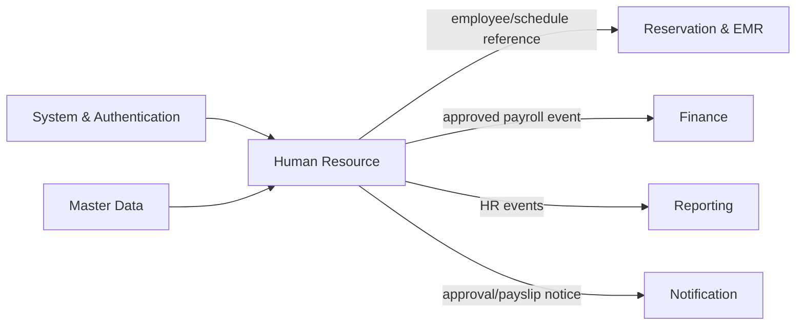
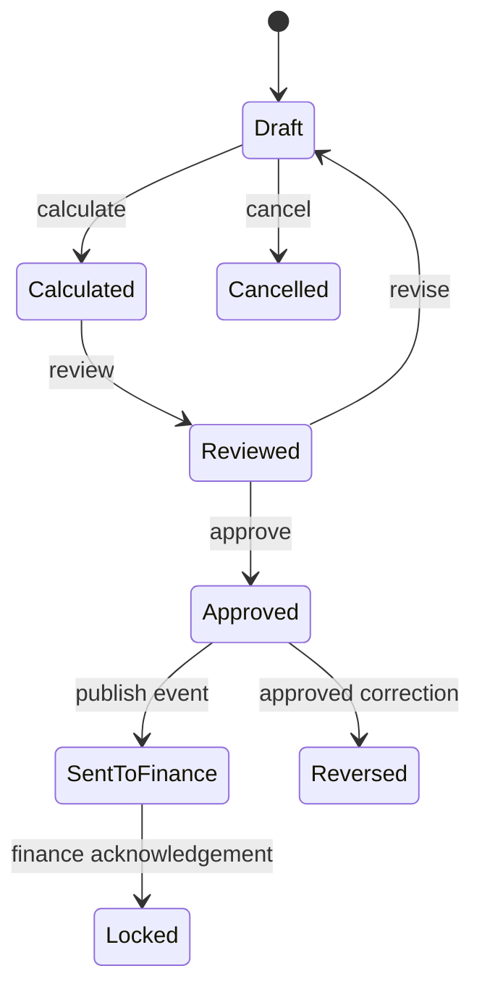
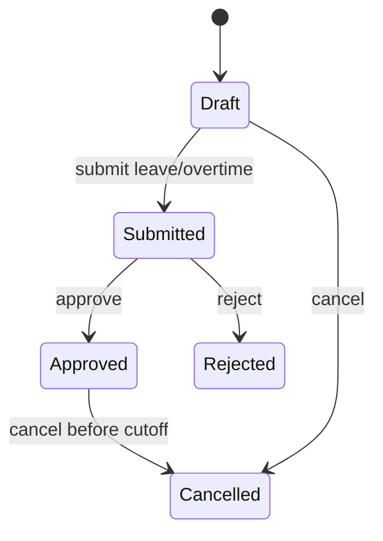
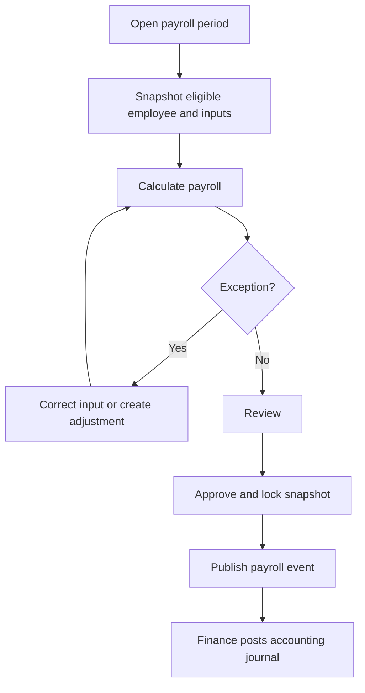

# Parakita Software Architecture Document (SAD)
# 19 - Module Human Resource

## Table of Contents

1. Pendahuluan dan ruang lingkup
2. Arsitektur dan integrasi modul
3. Model domain dan aturan bisnis
4. Use case dan workflow
5. Desain data
6. Spesifikasi API
7. Event dan integrasi lintas modul
8. Otorisasi, privasi, dan audit
9. Penanganan exception
10. Reporting dan operasional payroll
11. Skenario pengujian dan acceptance criteria
12. Deployment dan roadmap

---

# 1. Pendahuluan dan Ruang Lingkup

## 1.1 Overview

Human Resource (HR) mengelola siklus administratif tenaga kerja Parakita: data karyawan, jabatan dan penempatan, kontrak, jadwal kerja, absensi, cuti, lembur, komponen gaji, payroll, dokumen personal, dan riwayat perubahan kerja. Modul ini menyediakan data tenaga kerja yang konsisten bagi Authentication, Reservation, EMR, Finance, dan Reporting.

HR adalah system of record untuk profil dan status kerja karyawan serta hasil payroll. Authentication adalah pemilik kredensial dan role aplikasi; Finance adalah pemilik jurnal serta pembayaran keuangan; EMR adalah pemilik data klinis/layanan; Reporting adalah pemilik proyeksi laporan lintas domain.

## 1.2 Tujuan

- Menyediakan data karyawan yang lengkap, akurat, dan dibatasi oleh akses privasi.
- Mengelola penempatan, jadwal, kehadiran, cuti, dan lembur secara dapat diaudit.
- Menghasilkan payroll yang dapat direproduksi dari input yang telah disetujui.
- Menjaga pemisahan tugas antara penyusun, pemeriksa, approver, dan pembayar payroll.
- Mengirim payroll yang disetujui ke Finance tanpa melakukan posting jurnal langsung.
- Menyediakan laporan SDM dan payroll untuk manajemen.

## 1.3 In Scope

| Area | Cakupan |
|---|---|
| Employee | Identitas kerja, branch, department, position, status, user link, history |
| Employment | Kontrak, salary history, bank account reference, dokumen, effective dating |
| Schedule & attendance | Shift/jadwal, check-in/out, koreksi absensi, status harian |
| Leave & overtime | Pengajuan, approval, saldo/kuota cuti, lembur dan kompensasi |
| Payroll | Payroll period, komponen penghasilan/potongan, approval, payslip, lock |
| Integration | Event payroll ke Finance, availability/employee reference untuk modul lain |
| Reporting | Headcount, attendance, leave, overtime, payroll, turnover projection |

## 1.4 Out of Scope

- Login, password, MFA, dan pemberian role; milik Authentication/System.
- Pembayaran bank, jurnal payroll, pajak pelaporan eksternal, dan rekonsiliasi kas; milik Finance.
- Penjadwalan appointment pasien dan aturan antrian; milik Reservation/Queue.
- Rekam medis, produktivitas tindakan klinis terperinci, atau evaluasi clinical competency; milik EMR.
- Payroll tax engine nasional lengkap, integrasi BPJS/pajak/e-filing, biometric device, dan employee self-service mobile app; roadmap atau integrasi terpisah.

## 1.5 Prinsip Desain

1. **Privacy by design.** Data personal, gaji, rekening, dan dokumen hanya dapat diakses menurut kebutuhan jabatan.
2. **Effective-dated employment data.** Perubahan jabatan, salary, kontrak, branch, dan status tidak menimpa histori.
3. **Payroll is reproducible.** Hasil payroll menyimpan snapshot input/rule sehingga dapat diaudit ulang.
4. **Immutable after approval.** Payroll approved/posted tidak diedit; koreksi memakai payroll adjustment atau reversal cycle.
5. **Segregation of duties.** Creator tidak menyetujui payrollnya sendiri; HR tidak melakukan jurnal Finance.
6. **Branch-aware operation.** Employee assignment, schedule, attendance, payroll, dan laporan dibatasi branch yang authorised.
7. **Audit by default.** Semua perubahan sensitif, approval, export, dan akses data gaji dicatat.

---

# 2. Arsitektur dan Integrasi Modul

## 2.1 Tanggung Jawab

| Aktivitas | HR | Modul lain |
|---|:---:|:---:|
| Profil/status kerja karyawan | Owner | Consumer |
| User credential/role | Consumer reference | Authentication/System owner |
| Jadwal dan absensi | Owner | Reservation/EMR consumer availability |
| Cuti dan lembur | Owner | Manager/employee request actor |
| Kalkulasi payroll | Owner | Finance consumer approved result |
| Jurnal/payroll payment | Source event only | Finance owner |
| Laporan HR | Owner/projection producer | Reporting consumer |

## 2.2 Dependencies

### Incoming dependency

| Modul | Data/event | Aksi HR |
|---|---|---|
| System & Authentication | User, role, branch, audit, attachment | Link employee-user, otorisasi, dokumen, audit |
| Master Data | Department, position, shift, holiday, branch, doctor reference | Validasi employment/schedule |
| Reservation/EMR | Optional schedule workload/doctor availability query | Menyediakan schedule/status tanpa memutasi domain klinis |
| Finance | `PayrollPosted`/payment status jika diaktifkan | Tandai referensi pembayaran secara read-only/projection |

### Outgoing dependency

| Consumer | Output HR |
|---|---|
| Authentication/System | Employee activation, deactivation, user-link change event |
| Reservation/EMR | Ketersediaan/penugasan tenaga kerja, employee identity reference |
| Finance | `hr.payroll.approved.v1`, payroll adjustment/reversal event |
| Reporting | Employee, attendance, leave, overtime, payroll events |
| Notification | Approval request, cuti/lembur/payslip notification |

## 2.3 Context Diagram



## 2.4 Clean Architecture Placement

```text
hr/
├── domain/          # employee, schedule, attendance, leave, payroll rules
├── application/     # commands, queries, DTOs, use cases, event handlers
├── infrastructure/  # repository, encrypted storage, outbox, read projections
└── presentation/    # REST controller, request validation, policy
```

Domain layer tidak bergantung pada HTTP, database ORM, encryption provider, message broker, ataupun Finance. Kalkulasi payroll menggunakan policy/rule version yang dapat di-inject pada application layer dan hasilnya disnapshot sebelum approval.

---

# 3. Model Domain dan Aturan Bisnis

## 3.1 Bounded Context

HR menangani identitas hubungan kerja, time administration, dan payroll calculation. Status karyawan menentukan kelayakan jadwal, absensi, leave, overtime, dan payroll. HR dapat menautkan employee ke user, tetapi tidak membuat credential atau memberikan role.

## 3.2 Aggregate Design

| Aggregate root | Child/entity | Invariant utama |
|---|---|---|
| `Employee` | position history, salary history, contract, bank account, document, history | Satu employee code unik; perubahan kerja effective-dated |
| `EmployeeSchedule` | shift/room assignment | Tidak ada schedule overlap untuk employee yang sama |
| `Attendance` | correction/approval metadata | Satu attendance harian/shift scope; waktu out tidak sebelum in |
| `LeaveRequest` | leave allocation/approval trail | Kuota cukup dan tanggal tidak overlap dengan approved leave |
| `OvertimeRequest` | approval/payroll link | Durasi valid, tidak overlap, belum dibayar dua kali |
| `PayrollRun` | `PayrollItem` per employee | Satu payroll final per employee-periode; total dapat direproduksi |

## 3.3 Entitas Utama

### Employee

Employee menyimpan `employee_code`, nama, branch/departemen/jabatan utama, employment status, tanggal mulai/berakhir, kontak kerja, user link nullable, dan status aktif. Status: `draft`, `active`, `suspended`, `terminated`, `inactive`. Terminasi tidak menghapus histori, user, payroll, atau audit lama.

### Employment History, Contract, dan Salary

`employee_histories` merekam promosi, perpindahan branch, perubahan department/position, suspension, dan termination dengan effective date serta reason. `employee_contracts` menyimpan contract type, start/end date, status, evidence attachment. `employee_salaries` menyimpan basic salary, allowance baseline, effective date, currency (default IDR), rule version, dan approval metadata. Hanya satu salary record effective untuk employee pada suatu tanggal.

### Schedule dan Attendance

Schedule menyimpan employee, `work_date`, start/end time, shift, room optional, branch, dan status `scheduled`, `off`, `leave`, atau `cancelled`. Attendance menyimpan actual check-in/out, source (`manual`, `device`, `mobile` future), status `present`, `late`, `absent`, `leave`, `sick`, `holiday`, atau `incomplete`, serta correction reason.

### Leave dan Overtime

Leave request memuat jenis cuti, tanggal/durasi, saldo sebelum/sesudah, reason, attachment, approver, dan status `draft`, `submitted`, `approved`, `rejected`, `cancelled`. Overtime menyimpan employee, tanggal, start/end, duration, reason, multiplier/rate snapshot, approver, dan payroll item reference.

### Payroll dan Payroll Item

Payroll run mewakili branch dan periode bayar dengan status `draft`, `calculated`, `reviewed`, `approved`, `sent_to_finance`, `paid` (projection), `locked`, `cancelled`, atau `reversed`. `PayrollItem` adalah snapshot per employee berisi basic salary, allowance, overtime, bonus, deduction, tax/benefit configured, gross, net, rule version, dan sources. Amount memakai `DECIMAL(18,2)`; float dilarang.

## 3.4 Value Objects

| Value object | Aturan |
|---|---|
| EmployeeCode | Unik, generated/validated server-side, immutable setelah active |
| EmploymentPeriod | Start date wajib; end date tidak sebelum start date |
| WorkInterval | End > start; timezone branch digunakan untuk tampilan/rule |
| PayrollPeriod | Range tanggal non-overlap untuk payroll type/branch yang sama |
| Money | IDR default, non-negative, decimal scale 2 |
| LeaveBalance | Tidak boleh negatif tanpa override authorized |
| PayrollRuleVersion | Rule, rate, dan source snapshot dapat direproduksi |

## 3.5 Aturan Bisnis Inti

1. Employee harus active pada date schedule, attendance, overtime, dan payroll item kecuali payout termination yang explicitly allowed.
2. Satu employee tidak boleh memiliki schedule yang overlap pada waktu yang sama, termasuk antar room/branch tanpa multi-assignment policy.
3. Check-out sebelum check-in, attendance duplicate scope, dan attendance pada tanggal future ditolak kecuali import authorized.
4. Leave approved mengubah/alokasikan kuota dan memblok schedule yang bertabrakan; cancellation mengembalikan kuota hanya bila payroll terkait belum locked.
5. Overtime harus approved sebelum masuk payroll dan hanya dapat ditautkan ke satu payroll item.
6. Payroll calculation memakai employee/salary/attendance/leave/overtime data dengan cutoff date dan policy version yang disimpan sebagai snapshot.
7. Employee-periode tidak boleh muncul pada lebih dari satu payroll final dalam scope branch/payroll type; rerun menggunakan draft baru atau adjustment, bukan duplicate final run.
8. Payroll approved/locked tidak dapat diubah atau dihapus. Koreksi menghasilkan adjustment/reversal dengan reference payroll asal.
9. Rekening karyawan tidak dikirim lewat event Payroll; Finance menerima identifier/token yang aman dan hanya data minimum yang diperlukan.

## 3.6 State Machine





---

# 4. Use Case dan Workflow

## 4.1 Actor Matrix

| Use case | HR Staff | HR Manager | Employee | Supervisor | Finance | Owner | Administrator |
|---|:---:|:---:|:---:|:---:|:---:|:---:|:---:|
| View self profile/schedule | | | ✔ | | | | ✔ |
| Manage employee/contract | ✔ | ✔ | | | | | ✔ |
| Manage salary/bank data | limited | ✔ | self limited | | read payout ref | | ✔ |
| Create schedule/attendance correction | ✔ | ✔ | self request | ✔ | | | ✔ |
| Submit leave/overtime | ✔ | ✔ | ✔ | ✔ | | | ✔ |
| Approve leave/overtime | | ✔ | | ✔ scope | | | ✔ |
| Calculate payroll | ✔ | ✔ | | | | | ✔ |
| Approve/lock payroll | | ✔ | | | | ✔ | ✔ |
| View/export payroll | limited | ✔ | own payslip | | controlled | ✔ | ✔ |

## 4.2 UC-HR-001 — Create and Activate Employee

1. HR Staff membuat employee draft dengan identitas kerja, branch, department, position, employment start date, dan status kontrak.
2. Sistem memvalidasi employee code, branch/position aktif, kontrak, dan duplikasi identitas yang dikonfigurasi.
3. HR Manager mereview data sensitif dan mengaktifkan employee.
4. Jika user account diperlukan, HR mengirim request/reference ke System; Authentication membuat user secara terpisah lalu mengembalikan user link.
5. Aktivasi menulis employee history dan event `hr.employee.activated.v1`.

## 4.3 UC-HR-002 — Create Schedule and Record Attendance

Schedule dapat dibuat manual atau batch untuk satu branch/shift. Sistem memeriksa employee active, konflik jadwal, dan room assignment optional. Check-in/out dapat direkam oleh authorised staff atau sumber device terintegrasi. Koreksi attendance setelah cutoff memerlukan reason dan approval; record original tetap tersedia pada audit trail.

## 4.4 UC-HR-003 — Leave Request

1. Employee atau HR membuat draft leave dengan type, rentang, reason, dan attachment jika diperlukan.
2. Saat submit, sistem menghitung hari/jam sesuai calendar dan memvalidasi quota, kontrak, schedule overlap, serta cutoff payroll.
3. Supervisor/HR Manager yang authorised approve atau reject.
4. Approval mengalokasikan quota, mengubah schedule terkait menjadi leave, dan menerbitkan notification/event.
5. Pembatalan approved leave setelah payroll lock menghasilkan adjustment request, bukan pembatalan diam-diam.

## 4.5 UC-HR-004 — Overtime Request

Employee/supervisor mengajukan overtime dengan interval kerja, alasan, dan sumber schedule/attendance. Sistem menolak interval invalid/overlap dan menghitung duration sesuai kebijakan break/rounding. Approver memutuskan request; only approved unlinked overtime menjadi kandidat payroll.

## 4.6 UC-HR-005 — Run Payroll

1. HR Staff membuka payroll period untuk branch, payroll type, start/end/cutoff date, dan rule version.
2. Sistem memilih employee eligible serta snapshot salary effective, attendance, approved leave/overtime, allowance, deduction, dan adjustment.
3. Sistem menghitung gross, deduction, net; error per employee dicatat tanpa memposting Finance.
4. HR Staff meninjau exception, membuat adjustment draft jika perlu, lalu mark `reviewed`.
5. HR Manager/Owner approve payroll. Sistem mengunci snapshot, membuat payslip, dan publish `hr.payroll.approved.v1` melalui outbox.
6. Finance memproses event menjadi jurnal/payable dan mengirim acknowledgement; HR menampilkan status integrasi tanpa membuat jurnal sendiri.



## 4.7 UC-HR-006 — Payroll Correction

Jika payroll sudah approved, HR tidak mengedit `PayrollItem` lama. HR membuat adjustment yang menaut ke period/payslip asal, memuat reason dan supporting evidence. Adjustment menjalani review/approval terpisah serta diterbitkan sebagai event Finance yang distinct. Reversal mengikuti pola counter payroll item sehingga histori net salary tetap dapat dijelaskan.

## 4.8 UC-HR-007 — Terminate Employee

HR Manager membuat termination effective date, reason, evidence, dan checklist. Sistem memeriksa schedule future, leave/overtime pending, payroll open, kontrak, user account request, dan handover. Setelah effective, employee tidak dapat dijadwalkan/diabsen normal; histori tetap read-only dan termination payment hanya melalui workflow policy yang authorised.

---

# 5. Desain Data

## 5.1 Tabel Referensi

Base database design mendefinisikan `employees`, `employee_positions`, `employee_salaries`, `attendance`, `leave_requests`, `overtimes`, `payrolls`, `payroll_items`, `employee_documents`, `employee_contracts`, `employee_bank_accounts`, dan `employee_histories`. ERD/data dictionary juga menetapkan `employee_schedule`, department, position, branch, room, dan user sebagai referensi yang terkait.

Semua tabel memiliki audit fields standar. Dokumen gaji, rekening, dan identitas memiliki klasifikasi sensitif, encryption-at-rest, serta access log tambahan. Payroll approved/locked, attendance final, dan employment history tidak menggunakan hard delete.

## 5.2 Employee dan Employment Data

| Tabel | Kolom penting | Aturan |
|---|---|---|
| `employees` | employee code/number, name, branch, department, position, contact, user id, status, start/end date | Code unique; one current primary assignment |
| `employee_positions` | employee, position, branch/department, effective start/end, primary flag | Effective range tidak overlap untuk primary assignment |
| `employee_histories` | employee, type, before/after assignment, effective date, reason, approved by | Immutable historical log |
| `employee_contracts` | employee, contract no/type, start/end, status, attachment | Active contract period valid |
| `employee_salaries` | employee, effective date, basic salary, allowance baseline, rule version, approved by | One effective record per employee/date scope |
| `employee_bank_accounts` | employee, bank metadata/token, account holder, active | Account number encrypted/masked; access restricted |
| `employee_documents` | employee, document type, issue/expiry, attachment, verification state | File via Shared Attachment Service |

## 5.3 Schedule, Attendance, Leave, dan Overtime

Data dictionary menetapkan `employee_schedule` dengan employee, work date, start/end time, room optional, dan status. `attendance` memuat employee, attendance date, check-in/out, status, dan notes.

| Tabel | Kolom penting | Constraint |
|---|---|---|
| `employee_schedules` | employee, branch, work date, start/end, shift, room, status | Unique employee/time scope; end > start |
| `attendance` | employee, schedule nullable, date, check-in/out, status, source, correction metadata | Unique employee/date/shift scope |
| `leave_requests` | employee, leave type, start/end, quantity, balance snapshot, status, approver, reason | Approved interval cannot overlap |
| `leave_balances`* | employee, leave type, entitlement, used, reserved, year | Available ≥ 0; `*` projection/support table if required |
| `overtimes` | employee, date, start/end, duration, reason, rate snapshot, status, payroll item | One approved overtime consumed once |

## 5.4 Payroll dan Payroll Item

| Tabel | Kolom penting | Constraint |
|---|---|---|
| `payrolls` | payroll number, branch, period start/end, cutoff, type, rule version, status, totals, approver | Unique branch/type/period for active/final run |
| `payroll_items` | payroll id, employee id, basic, allowance, overtime, bonus, deduction, gross, net, source snapshot | Unique payroll/employee; immutable after approval |
| `payroll_adjustments`* | source payroll/item, adjustment type, amount, reason, status | Linked to approved correction workflow |
| `payslips`* | payroll item, issued date, document checksum, delivery status | Regenerable from immutable snapshot |

`*` Menandakan table/projection pendukung yang ditambahkan melalui migration bila kebutuhan implementation mengharuskannya; tidak mengubah entitas inti yang sudah ditetapkan pada blueprint.

## 5.5 Index, Constraint, dan Retensi

| Tabel | Index/constraint minimum |
|---|---|
| `employees` | Unique employee code; `(branch_id, status)`; user id unique nullable |
| `employee_schedules` | `(employee_id, work_date)` dan overlap protection |
| `attendance` | Unique `(employee_id, attendance_date, shift_id)` bila shift used |
| `leave_requests` | `(employee_id, status, start_date, end_date)` |
| `overtimes` | `(employee_id, overtime_date, status)`; payroll link unique when paid |
| `payrolls` | Unique `(branch_id, payroll_type, period_start, period_end, version)` |
| `payroll_items` | Unique `(payroll_id, employee_id)`; employee/period lookup |

Personal data and payroll are retained per policy ketenagakerjaan, keuangan, dan privacy clinic. Data yang wajib dipertahankan tidak dihapus melalui routine cleanup; termination memakai status/history and access revocation, not row deletion.

---

# 6. Spesifikasi API

Endpoint menggunakan `/api/v1`, JWT, ISO-8601, standard response/error dari `09-api-standard.md`, dan branch-aware authorisation. Command yang mengubah employment/payroll/approval wajib memakai `Idempotency-Key`.

## 6.1 Employee dan Employment

| Method | Endpoint | Permission |
|---|---|---|
| GET/POST | `/hr/employees` | `hr.employee.read` / `hr.employee.manage` |
| GET/PATCH | `/hr/employees/{employeeId}` | `hr.employee.read` / `hr.employee.manage` |
| POST | `/hr/employees/{employeeId}/activate` | `hr.employee.activate` |
| POST | `/hr/employees/{employeeId}/terminate` | `hr.employee.terminate` |
| GET/POST | `/hr/employees/{employeeId}/contracts` | `hr.contract.read` / `hr.contract.manage` |
| GET/POST | `/hr/employees/{employeeId}/salaries` | `hr.salary.read` / `hr.salary.manage` |
| GET/POST | `/hr/employees/{employeeId}/bank-accounts` | `hr.bank.read` / `hr.bank.manage` |
| GET | `/hr/employees/{employeeId}/history` | `hr.employee.read` |

Create employee example:

```json
{
  "employeeCode": "EMP-000123",
  "fullName": "Nama Karyawan",
  "branchId": "uuid",
  "departmentId": "uuid",
  "positionId": "uuid",
  "employmentStartDate": "2026-08-01",
  "employmentType": "permanent",
  "phone": "+628123456789"
}
```

## 6.2 Schedule, Attendance, Leave, dan Overtime

| Method | Endpoint |
|---|---|
| GET/POST | `/hr/schedules` |
| POST | `/hr/schedules/bulk` |
| GET/POST | `/hr/attendances` |
| POST | `/hr/attendances/{attendanceId}/correct` |
| GET/POST | `/hr/leave-requests` |
| POST | `/hr/leave-requests/{leaveRequestId}/submit` |
| POST | `/hr/leave-requests/{leaveRequestId}/approve` |
| POST | `/hr/leave-requests/{leaveRequestId}/reject` |
| POST | `/hr/leave-requests/{leaveRequestId}/cancel` |
| GET/POST | `/hr/overtimes` |
| POST | `/hr/overtimes/{overtimeId}/approve` |
| POST | `/hr/overtimes/{overtimeId}/reject` |

Attendance request example:

```json
{
  "employeeId": "uuid",
  "branchId": "uuid",
  "attendanceDate": "2026-07-31",
  "checkIn": "2026-07-31T08:02:00+08:00",
  "checkOut": "2026-07-31T17:03:00+08:00",
  "source": "manual",
  "notes": ""
}
```

## 6.3 Payroll

| Method | Endpoint | Permission |
|---|---|---|
| GET/POST | `/hr/payrolls` | `hr.payroll.read` / `hr.payroll.create` |
| GET | `/hr/payrolls/{payrollId}` | `hr.payroll.read` |
| POST | `/hr/payrolls/{payrollId}/calculate` | `hr.payroll.calculate` |
| POST | `/hr/payrolls/{payrollId}/review` | `hr.payroll.review` |
| POST | `/hr/payrolls/{payrollId}/approve` | `hr.payroll.approve` |
| POST | `/hr/payrolls/{payrollId}/cancel` | `hr.payroll.cancel` |
| POST | `/hr/payrolls/{payrollId}/adjustments` | `hr.payroll.adjust` |
| GET | `/hr/payrolls/{payrollId}/payslips` | `hr.payslip.read` |
| GET | `/hr/me/payslips` | self-service permission |

Create payroll example:

```json
{
  "branchId": "uuid",
  "payrollType": "monthly",
  "periodStart": "2026-07-01",
  "periodEnd": "2026-07-31",
  "cutoffDate": "2026-07-31",
  "ruleVersion": "2026.07"
}
```

## 6.4 Reports dan Error Codes

| Endpoint | Output |
|---|---|
| `GET /hr/reports/headcount` | Employee aktif berdasarkan branch/department/position/status |
| `GET /hr/reports/attendance` | Kehadiran, keterlambatan, absence, correction |
| `GET /hr/reports/leave` | Request, approval, saldo, utilisation |
| `GET /hr/reports/overtime` | Duration, approval, cost projection |
| `GET /hr/reports/payroll` | Gross, deduction, net, status, period |
| `GET /hr/reports/employee-history` | Perubahan penempatan/status/kontrak |

| Code | HTTP | Arti |
|---|---:|---|
| `HR_EMPLOYEE_INACTIVE` | 409 | Employee tidak eligible pada tanggal transaksi |
| `HR_SCHEDULE_OVERLAP` | 422 | Jadwal bertabrakan |
| `HR_ATTENDANCE_INVALID_INTERVAL` | 422 | Check-out tidak valid terhadap check-in |
| `HR_ATTENDANCE_DUPLICATE` | 409 | Attendance scope sudah ada |
| `HR_LEAVE_INSUFFICIENT_BALANCE` | 409 | Kuota leave tidak cukup |
| `HR_LEAVE_OVERLAP` | 409 | Leave approved/request conflict |
| `HR_OVERTIME_ALREADY_PAID` | 409 | Overtime sudah tertaut payroll final |
| `HR_PAYROLL_PERIOD_CONFLICT` | 409 | Payroll run final scope sudah ada |
| `HR_PAYROLL_LOCKED` | 409 | Payroll tidak dapat dimutasi |
| `HR_PAYROLL_APPROVAL_REQUIRED` | 403 | Aksi butuh approver |
| `HR_SELF_APPROVAL_FORBIDDEN` | 403 | Melanggar segregation of duties |

---

# 7. Event dan Integrasi Lintas Modul

## 7.1 Event Contract

HR memakai outbox/inbox pattern. Event memiliki `eventId`, `eventType`, `occurredAt`, `source`, `branchId`, `correlationId`, `schemaVersion`, dan `payload`. Consumer deduplicate berdasarkan `eventId`; retry tidak boleh menciptakan payroll journal/employee action ganda.

## 7.2 Outgoing Event

| Event | Kapan | Consumer |
|---|---|---|
| `hr.employee.activated.v1` | Employee menjadi active | System, Reporting |
| `hr.employee.terminated.v1` | Termination effective | System, Reporting |
| `hr.schedule.published.v1` | Schedule final dipublikasi | Reservation/EMR, Reporting |
| `hr.leave.approved.v1` | Leave approved | Notification, Reporting |
| `hr.overtime.approved.v1` | Overtime eligible payroll | Reporting |
| `hr.payroll.approved.v1` | Payroll snapshot approved/locked | Finance, Reporting, Notification |
| `hr.payroll.adjustment.approved.v1` | Correction payroll approved | Finance, Reporting |

## 7.3 Payroll Event

Finance event payload menyediakan data minimum untuk posting; tidak memuat NIK, alamat, dokumen, atau rekening raw.

```json
{
  "eventId": "uuid",
  "eventType": "hr.payroll.approved.v1",
  "branchId": "uuid",
  "occurredAt": "2026-08-01T01:00:00Z",
  "payload": {
    "payrollId": "uuid",
    "payrollNumber": "PAY-202607-BR01",
    "periodStart": "2026-07-01",
    "periodEnd": "2026-07-31",
    "grossAmount": "10000000.00",
    "deductionAmount": "500000.00",
    "netAmount": "9500000.00",
    "items": [{ "employeeId": "uuid", "netAmount": "9500000.00", "payoutAccountToken": "token" }]
  }
}
```

## 7.4 Incoming Event dan Failure Handling

| Event | Aksi HR |
|---|---|
| `finance.payroll-posted.v1` | Update projection/reference Finance pada payroll tanpa mengubah approved amount |
| `finance.payroll-payment-recorded.v1` | Update payout display status bila kontrak integrasi mengizinkan |
| `system.user-linked.v1` | Tautkan user id ke employee setelah validasi |
| `system.user-deactivated.v1` | Tandai access reference; tidak men-terminate employee otomatis |

Jika Finance unavailable, payroll tetap approved dan event disimpan di outbox; HR tidak mengulangi approval atau menciptakan payroll baru. Kegagalan konfigurasi permanent masuk dead-letter queue dengan payroll reference. Perbaikan lalu replay memakai event id yang sama dan tetap tunduk pada idempotency Finance.

---

# 8. Otorisasi, Privasi, dan Audit

## 8.1 Permission Catalog

| Group | Permission |
|---|---|
| Employee | `hr.employee.read`, `manage`, `activate`, `terminate`, `history.read` |
| Employment sensitive | `hr.contract.read/manage`, `hr.salary.read/manage`, `hr.bank.read/manage`, `hr.document.read/manage` |
| Time | `hr.schedule.read/manage`, `hr.attendance.read/manage/correct`, `hr.leave.read/create/approve`, `hr.overtime.read/create/approve` |
| Payroll | `hr.payroll.read/create/calculate/review/approve/cancel/adjust`, `hr.payslip.read` |
| Reporting | `hr.report.read`, `hr.report.export` |

## 8.2 Segregation of Duties

- HR Staff yang membuat/edit payroll tidak dapat menjadi final approver payroll yang sama.
- Employee tidak dapat approve leave/overtime diri sendiri.
- Supervisor hanya dapat approve employee dalam reporting line/branch scope yang ditetapkan.
- HR tidak dapat melakukan Finance journal/payment melalui modul ini.
- Salary/bank-data editor tidak dapat meng-approve perubahan sendiri pada threshold berisiko.
- Payroll export dengan detail individual membutuhkan permission khusus dan dicatat.

## 8.3 Privacy Classification

| Kelas | Contoh | Control |
|---|---|---|
| Internal | Nama kerja, position, branch, schedule | Branch/RBAC access |
| Confidential | Contact, contract, attendance notes | Need-to-know, audit access |
| Restricted | Salary, deduction, bank token, identity document | Least privilege, masking, encryption, export control |

API respons memask data rekening/identitas kecuali permission diperlukan. Payslip self-service hanya untuk employee terautentikasi yang tertaut, dan tidak dapat mengakses payslip orang lain melalui identifier berubah.

## 8.4 Audit Requirements

Audit wajib untuk activate/terminate employee, perubahan contract/salary/bank/document, schedule publish, attendance correction, leave/overtime approval, payroll calculate/review/approve/cancel/adjust, payslip access/download, event replay, dan HR report export. Record memuat actor, branch, resource, action, before/after yang aman, reason, time, IP/device, and correlation id.

---

# 9. Penanganan Exception

| Skenario | Respons sistem | Tindak lanjut |
|---|---|---|
| Employee inactive | Tolak schedule/attendance/payroll normal | Aktifkan berdasarkan workflow valid atau gunakan termination payout policy |
| Jadwal overlap | Tolak atomic | Ubah interval/assignment |
| Absensi duplicate | Return conflict/existing record | Gunakan correction flow authorised |
| Leave quota kurang | Tolak submit | Pilih leave type lain/override approved |
| Leave setelah cutoff payroll | Tolak cancel/edit langsung | Buat adjustment request |
| Overtime sudah dibayar | Tolak link kedua | Buat correction/reversal payroll bila perlu |
| Payroll data source berubah setelah calculate | Tandai calculation stale | Recalculate sebelum review/approval |
| Payroll period duplikat | Tolak final run overlap | Gunakan draft/revision/adjustment yang linked |
| Payroll locked | Tolak PATCH/delete | Buat adjustment/reversal flow |
| Finance event delivery gagal | Payroll tetap locked approved | Outbox retry/dead-letter/replay |
| User link gagal | Employee tetap valid tanpa credential | System memperbaiki user link terpisah |
| Audit write gagal | Rollback transaksi sensitif | Pulihkan audit service dan ulangi command |

Koreksi payroll, salary history, attendance final, dan employment status tidak boleh dilakukan dengan SQL update langsung. Semua harus melalui command yang menghasilkan history/audit record.

---

# 10. Reporting dan Operasional Payroll

## 10.1 Dashboard KPI

| KPI | Definisi |
|---|---|
| Active headcount | Employee active per branch/department/position |
| Attendance rate | Present dibanding scheduled workday |
| Absence/late rate | Absence dan late terhadap total schedule |
| Leave utilisation | Used/reserved/available quota per leave type |
| Overtime hours | Approved hours dan cost projection |
| Payroll gross/net | Total calculated/approved payroll per period |
| Payroll exception | Employee yang gagal/stale/missing data saat calculation |
| Contract expiry | Kontrak yang mendekati/melewati expiry |

## 10.2 Report Controls

Report hanya memakai payroll approved/locked untuk total payroll resmi. Draft/calculated payroll terlihat pada worklist HR tetapi tidak masuk laporan keuangan. Semua report menyertakan branch, period/date range, timezone, generated-at, data-as-of, filter, serta otorisasi export.

## 10.3 Reports

- **Employee master & headcount:** employment status, branch, department, position, tenure.
- **Schedule & attendance:** scheduled, present, late, absent, leave, sick, correction trend.
- **Leave:** request lifecycle, balance, utilisation, pending approval.
- **Overtime:** hours, approval, rate projection, payroll linkage.
- **Payroll register:** gross, allowance, deduction, net, approval/integration status; access restricted.
- **Contract & document expiry:** upcoming contract/document expiry, missing mandatory document.
- **Employee change history:** transfer, promotion, salary effective, suspension, termination.

## 10.4 Payslip

Payslip dibuat dari snapshot payroll item approved, memiliki checksum/version and issued timestamp. Regeneration menghasilkan dokumen yang sama secara material, tidak menghitung ulang dari current salary/attendance. Akses/download payslip dicatat dan mengikuti retention/privacy policy.

---

# 11. Skenario Pengujian dan Acceptance Criteria

| ID | Skenario | Expected result |
|---|---|---|
| TC-HR-001 | Activate employee valid | Employee code unique, history/event tercatat |
| TC-HR-002 | Schedule overlap | Ditolak tanpa membuat schedule parsial |
| TC-HR-003 | Attendance check-out sebelum check-in | 422, record tidak valid tidak tersimpan |
| TC-HR-004 | Duplicate attendance | Conflict dan record existing tetap tunggal |
| TC-HR-005 | Leave quota tidak cukup | Submit ditolak, quota tidak berubah |
| TC-HR-006 | Approve leave | Quota dialokasikan dan schedule/status terkait diperbarui sesuai policy |
| TC-HR-007 | Employee self-approves leave | 403 self-approval forbidden |
| TC-HR-008 | Approved overtime enters payroll | Masuk sekali dengan rate/rule snapshot |
| TC-HR-009 | Overtime reused in second payroll | Ditolak; payroll link unik |
| TC-HR-010 | Calculate payroll | Totals reproducible dari source snapshot dan rule version |
| TC-HR-011 | Source changes after calculation | Payroll stale dan wajib recalculate sebelum approval |
| TC-HR-012 | Creator approves own payroll | Ditolak oleh segregation-of-duties |
| TC-HR-013 | Approve payroll twice | Hanya satu event Finance logical tercipta |
| TC-HR-014 | Edit locked payroll | Ditolak; adjustment route tersedia |
| TC-HR-015 | Finance retries event | Tidak ada jurnal/payroll posting ganda |
| TC-HR-016 | Cross-branch salary access | Ditolak atau data termask sesuai permission |
| TC-HR-017 | Payslip self-service | Employee hanya membaca payslip dirinya, access log tercatat |
| TC-HR-018 | Terminate employee | Future normal schedule blocked; history/payroll tetap tersedia |

Acceptance criteria:

- Data employment dan payroll sensitive hanya dapat diakses oleh principal yang authorised.
- Payroll approved dapat direproduksi dari input/rule snapshot dan tidak berubah oleh data baru.
- Tidak ada payroll final duplicate pada employee-periode yang sama.
- Event Finance bersifat idempoten, minimal data, dan traceable ke payroll asal.
- Perubahan penting memiliki history/audit; tidak ada mutasi langsung atas record locked/final.

---

# 12. Deployment dan Roadmap

## 12.1 Operational Requirements

HR berjalan dalam modular backend/database Parakita dengan transactional store, encrypted sensitive fields, attachment storage terproteksi, durable outbox/inbox, scheduler untuk contract/document expiry dan payroll cutoff, notification service, dan dead-letter monitoring.

Metric minimum:

- Payroll calculation duration, employee success/failure/stale count.
- Outbox/dead-letter backlog dan umur payroll event tertua.
- Pending leave/overtime/payroll approval.
- Attendance correction count dan late/absence trend.
- Contract/document expiry alerts.
- Access/export terhadap salary, bank metadata, dan payslip.

Backup/restore wajib menjaga konsistensi employee, employment history, salary effective record, attendance, leave balance, overtime, payroll snapshot/item, event inbox/outbox, attachment metadata, dan audit. Recovery procedure diuji berkala tanpa mengekspos data restricted.

## 12.2 Scalability

Payroll calculation dijalankan asinkron per branch/period dengan job idempotent dan progress observable; hasilnya tidak visible sebagai approved sampai semua invariant terpenuhi. Penguncian payroll scope mencegah calculate concurrent duplicate. Report heavy dapat menggunakan read model/replica setelah event committed, tetapi calculation/final approval selalu menggunakan primary transactional data dan snapshot.

## 12.3 Roadmap

| Phase | Enhancement |
|---|---|
| 1 | Employee, contract, schedule, attendance, leave, overtime, payroll basic, Finance event, core report |
| 2 | Approval threshold, salary/bank encryption hardening, payslip portal, attendance import, contract alert |
| 3 | Biometric/mobile attendance integration, roster optimisation, advanced leave policy, budget and workforce analytics |
| 4 | Employee self-service app, payroll tax/BPJS integration, bank payout integration, performance/talent module |

---

# Summary

Human Resource Module menyediakan fondasi administratif tenaga kerja Parakita: employee dan employment history yang effective-dated, jadwal dan attendance yang dapat diaudit, leave/overtime terkontrol, serta payroll snapshot yang reproducible dan immutable setelah approval. Modul ini menjaga privasi data sensitif, pemisahan tugas, isolasi branch, dan mengirim hasil payroll terotorisasi ke Finance melalui event idempoten tanpa mengambil alih pembukuan atau pembayaran.
