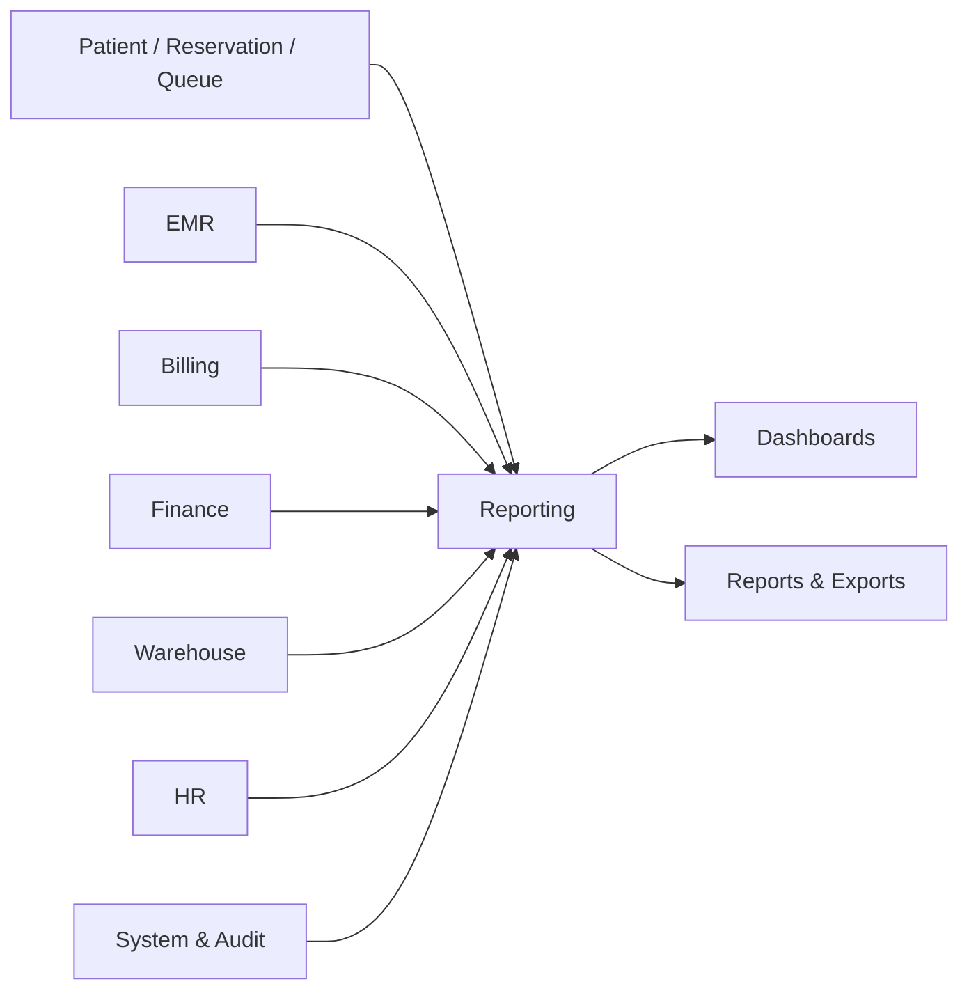
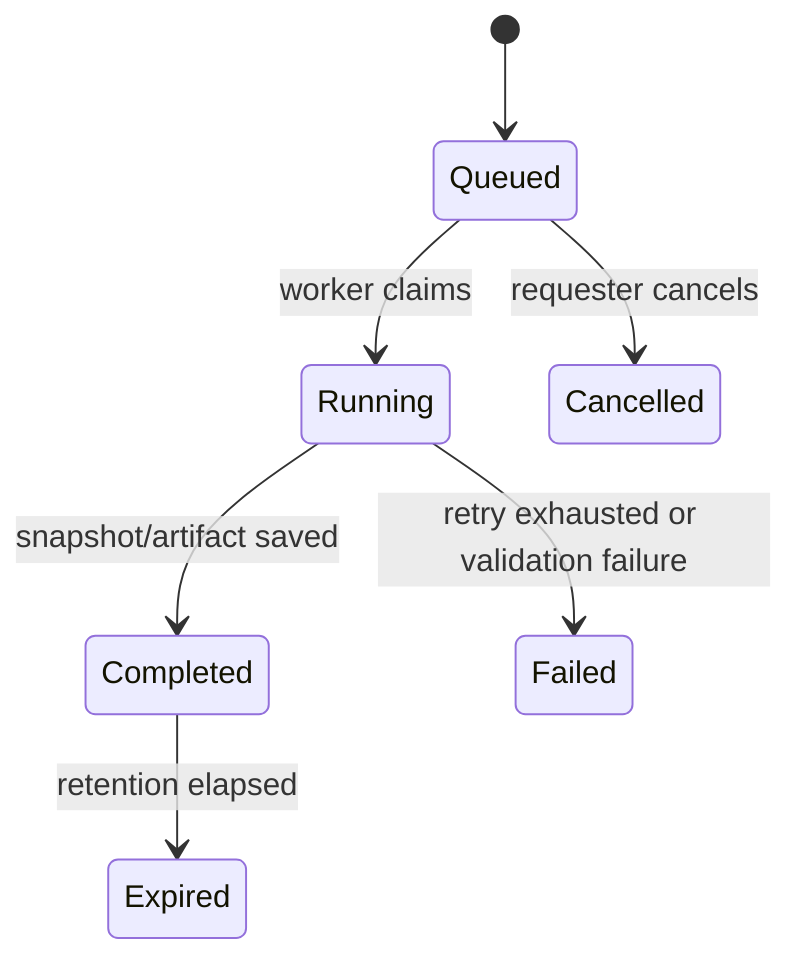

# Parakita Software Architecture Document (SAD)
# 20 - Module Reporting & Dashboard

## Table of Contents

1. Pendahuluan dan ruang lingkup
2. Arsitektur dan sumber data
3. Model domain dan prinsip metrik
4. Katalog dashboard dan laporan
5. Data model dan lifecycle report
6. Spesifikasi API
7. Integrasi dan event processing
8. Otorisasi, privasi, dan audit
9. Exception handling dan data quality
10. Refresh, export, dan operasional
11. Skenario pengujian dan acceptance criteria
12. Deployment dan roadmap

---

# 1. Pendahuluan dan Ruang Lingkup

## 1.1 Overview

Reporting & Dashboard adalah modul read-only yang mengubah data operasional tervalidasi menjadi dashboard, laporan, snapshot, dan export bagi pengguna klinik serta manajemen. Modul ini mengonsumsi event dari domain sumber atau read projection yang disetujui; Reporting tidak membuat atau mengubah patient, reservation, EMR, invoice, journal, stock, employee, maupun transaksi domain lain.

Entity inti mengikuti ERD Parakita: `report_jobs`, `report_snapshots`, dan `dashboard_summaries`. Modul ini berfungsi sebagai presentation/read-model layer agar query analitik tidak membebani jalur transaksi operasional.

## 1.2 Tujuan

- Menyediakan informasi operasional dan manajemen yang cepat, konsisten, dapat difilter, dan dapat ditelusuri.
- Memisahkan beban baca/analitik dari database transaksi domain.
- Menyajikan definisi KPI dan batas data yang eksplisit, terutama untuk pendapatan dan keuangan.
- Mendukung multi-branch, role-based visibility, export aman, dan audit akses.
- Menjaga snapshot dan metadata agar hasil laporan dapat direproduksi.

## 1.3 In Scope

| Area | Cakupan |
|---|---|
| Dashboard | Executive, operational, clinical, billing, finance, warehouse, dan HR KPI |
| Reports | Operational, clinical aggregate, billing, financial, inventory, HR, audit/activity |
| Report execution | Synchronous query ringan, asynchronous report job, snapshot, export |
| Data delivery | Event projection, refresh schedule, data-as-of, backfill/replay |
| Governance | Metric catalog, filter validation, row-level branch access, export audit |
| Analytics | Trend, comparison, aggregation, drill-down sesuai permission |

## 1.4 Out of Scope

- Membuat/memperbarui transaksi sumber atau menjalankan command ke modul lain.
- Menjadi pengganti buku besar Finance, detail invoice Billing, rekam medis EMR, atau ledger stok Warehouse.
- Menetapkan diagnosis/clinical decision, accounting posting, approval, dan workflow operasional.
- Business intelligence warehouse enterprise, predictive model, natural-language analytics, external BI connector, atau data lake; roadmap.

## 1.5 Prinsip Desain

1. **Read-only by architecture.** Tidak ada endpoint/report job yang memutasi aggregate sumber.
2. **Source-of-truth awareness.** Laporan menyebut modul/record state yang menjadi basisnya.
3. **As-of transparency.** Semua hasil menyertakan `dataAsOf`, refresh state, filter, timezone, dan definition version.
4. **Eventual consistency disclosed.** Dashboard near-real-time dapat tertinggal dari transaksi; lag ditampilkan dan dipantau.
5. **Financial safety.** Financial statement hanya memakai journal posted/period state dari Finance, bukan kalkulasi ulang dari invoice mentah.
6. **Privacy and least privilege.** Data pasien dan karyawan dipseudonimkan/dibatasi bila detail tidak diperlukan.
7. **Reproducible output.** Snapshot menyimpan parameter, schema/metric version, source watermark, dan checksum.
8. **Export is sensitive.** Export mengikuti permission, batas data, watermark, expiration, dan audit.

---

# 2. Arsitektur dan Sumber Data

## 2.1 Tanggung Jawab

| Aktivitas | Reporting | Modul sumber |
|---|:---:|:---:|
| Data transaksi/approval state | Consumer/read projection | Domain source owner |
| Metric definition, aggregate, snapshot | Owner | Consumer/validator |
| Dashboard/report/query/export | Owner | Consumer UI/API |
| Financial posting and close | Read only | Finance owner |
| Clinical/patient data mutation | Tidak melakukan | Patient/EMR owner |
| Audit transaksi sumber | Read projection | System/domain owner |

## 2.2 Data Source Matrix

| Source | Dataset/kegunaan | Record state yang dipakai |
|---|---|---|
| Patient | Demografi aggregate, patient registration | Active/non-deleted policy; PII dibatasi |
| Reservation & Queue | Booking, no-show, waiting time, throughput | Reservation/queue final sesuai definition |
| EMR | Visit, treatment, clinical aggregate, productivity | Visit/treatment final/closed sesuai metric |
| Billing | Invoice, payment, refund, discount, deposit | State terdefinisi per report; payment success untuk collection |
| Finance | Journal, cash, expense, closing, financial period | Hanya journal posted dan period valid |
| Warehouse | Stock balance, movement, PO, expiry, opname | Posted ledger/saldo projection |
| HR | Headcount, attendance, leave, overtime, payroll | Approved/locked payroll untuk payroll official |
| System | User, branch, audit/activity | Access-controlled, immutable audit source |

## 2.3 Context Diagram



## 2.4 Read Model Architecture

```text
Source transaction
  -> source outbox event
  -> Reporting inbox / projection handler
  -> domain-specific read model
  -> aggregate/dashboard summary
  -> report query or asynchronous report job
  -> snapshot/export
```

Read models are rebuildable. Mereka bukan authority untuk menulis kembali ke sumber dan bukan substitusi ledger/record legal. Projection handler menyimpan checkpoint/watermark dan inbox idempotency record pada transaksi sendiri.

## 2.5 Consistency Model

| Jenis output | Target refresh | Konsistensi |
|---|---|---|
| Dashboard operasional | Near-real-time | Eventual, lag ditampilkan |
| Worklist/on-demand detail | On demand | Read model terbaru yang tersedia |
| Financial statement | On demand/scheduled | Posted Finance data dengan period/as-of yang eksplisit |
| Daily snapshot | Scheduled after business close | Immutable snapshot |
| Large export | Async job | Snapshot pada requested watermark |

Reporting outage atau delay tidak boleh menghambat proses klinis, billing, finance, warehouse, atau HR.

---

# 3. Model Domain dan Prinsip Metrik

## 3.1 Bounded Context

Reporting memiliki bounded context untuk query, aggregation, snapshot, export, dan metric governance. Ia tidak memiliki aggregate transaksi bisnis. Domain objects utama: `ReportDefinition`, `ReportJob`, `ReportSnapshot`, `DashboardSummary`, `MetricDefinition`, dan `ExportArtifact`.

## 3.2 Aggregate Design

| Aggregate root | Entity/value object | Invariant |
|---|---|---|
| `ReportDefinition` | dimensions, filters, metric version, access policy | Definition version immutable once published |
| `ReportJob` | request, progress, artifact | Requested scope authorised; job idempotent per key |
| `ReportSnapshot` | parameter, watermark, payload/checksum | Snapshot immutable and reproducible |
| `DashboardSummary` | metric points, as-of, freshness state | Data scope/version must be explicit |
| `ExportArtifact` | storage path, expiry, checksum, download record | Only creator/authorised role can download before expiry |

## 3.3 Metric Definition Standard

Setiap metric resmi memiliki:

| Field | Arti |
|---|---|
| `metric_code` | Identifier stabil, misalnya `finance.net_revenue` |
| `name` dan `description` | Label dan penjelasan bisnis |
| `owner_module` | Owner semantic/record source |
| `formula` | Rumus yang terdokumentasi dan versioned |
| `included_states` | State sumber yang diperhitungkan |
| `grain` | Contoh: branch/day/payment atau branch/period/account |
| `dimensions` | Branch, date, service, doctor, payment method, etc. |
| `timezone` | Timezone pembentukan bucket/report |
| `security_classification` | Internal/confidential/restricted |
| `definition_version` | Version untuk reproducibility |

## 3.4 Core Metric Rules

- **Revenue:** untuk financial statement, berasal dari Finance posted revenue journal. Dashboard Billing dapat menunjukkan `collected payment` dari payment sukses tetapi labelnya tidak boleh disamakan dengan accounting revenue.
- **Outstanding:** dihitung dari invoice Billing yang status/remaining balance-nya sesuai definition, tidak dari journal.
- **Visit count:** menggunakan visit final/valid; cancelled/test record dikecualikan menurut filter standard.
- **Waiting time:** interval definisi eksplisit antara check-in dan service start; missing timestamp tidak dihitung dan masuk data-quality count.
- **Stock balance:** dari Warehouse stock balance/posted ledger watermark; reserved dan available dilaporkan terpisah.
- **Payroll:** laporan payroll resmi hanya dari HR payroll approved/locked; data draft dipisahkan sebagai operational worklist.
- **Cash position:** dari Finance posted cash movement/journal, dengan as-of dan account scope jelas.

## 3.5 Time and Branch Rules

Periode laporan dibangun menggunakan timezone branch. Event timestamp disimpan UTC dan dibucket sesuai timezone report. Cross-branch report membutuhkan scope authorisation dan menampilkan timezone/aggregation policy. Date filter bersifat inclusive pada local date, lalu diterjemahkan ke UTC range secara server-side.

## 3.6 Dashboard State

Dashboard state: `fresh`, `refreshing`, `stale`, `partial`, `failed`. State `partial` menampilkan source dataset yang tertinggal; state `failed` tidak boleh menyajikan angka lama sebagai real-time tanpa marker stale. UI selalu menampilkan `dataAsOf` dan status freshness.

---

# 4. Katalog Dashboard dan Laporan

## 4.1 Actor Matrix

| Consumer | Primary dashboard/report | Detail access |
|---|---|---|
| Owner | Executive KPI, financial, growth, branch comparison | Cross-branch per permission |
| Clinic Manager | Operational, queue, clinical throughput, attendance | Assigned branch/clinic |
| Finance | Financial statement, cash, expense, closing, payroll summary | Finance scope |
| Cashier | Daily billing/payment/closing | Own branch/shift scope |
| Doctor | Own schedule, workload/productivity aggregate | Own/assigned scope; no unauthorised PII |
| Warehouse Staff | Stock, movement, expiry, procurement | Assigned warehouse/branch |
| HR Staff | Headcount, attendance, leave, payroll | HR scope; payroll restricted |
| Administrator | System/audit/report-job monitoring | Administrative scope |

## 4.2 Executive Dashboard

| KPI | Definition/source | Refresh |
|---|---|---|
| Visits | EMR final valid visits | Near-real-time |
| Patient growth | New active patients | Daily/near-real-time |
| Collection | Billing successful payments | Near-real-time |
| Accounting revenue | Finance posted revenue | Near-real-time or scheduled |
| Net result | Finance posted revenue less expense | Period/as-of based |
| Outstanding | Billing outstanding invoice balance | Near-real-time |
| Queue service level | Queue/EMR wait/service metrics | Near-real-time |
| Low stock items | Warehouse active alerts | Near-real-time |
| Payroll cost | HR approved/locked payroll | Per payroll period |

Executive dashboard is aggregate-first. Drill-down ke patient, employee, or journal detail mengikuti permission asal; Owner dashboard access tidak otomatis memberi akses ke semua restricted detail.

## 4.3 Operational Reports

| Report | Source | Filter utama | Output |
|---|---|---|---|
| Patient registration | Patient | Branch, date, demographic non-sensitive | Count/list per access |
| Reservation & no-show | Reservation | Branch, service, doctor, date | Booking/status/no-show rate |
| Queue performance | Queue/EMR | Branch, room, provider, date | Wait, service, throughput |
| Visit/treatment | EMR | Branch, doctor, service, date | Visit count and treatment aggregate |
| Billing daily | Billing | Branch, cashier, date, payment method | Invoice/payment/refund totals |
| Activity/audit | System | Actor, action, module, date | Access-controlled audit query |

## 4.4 Financial Reports

| Report | Authority/source | Rule |
|---|---|---|
| Trial balance | Finance journal details | Posted journals only; debit = credit |
| General ledger | Finance journal/details | Account/date/branch filter; reversal visible |
| Income statement | Finance | Period/as-of, posted accounts only |
| Cash flow / cash position | Finance | Posted movement and account scope |
| Revenue reconciliation | Finance + Billing projection | Difference labelled and drillable by reference |
| Expense report | Finance | Approved/paid/posting state labelled |
| Daily closing | Finance | Approved closing and variance state |
| Payroll summary | HR approved + Finance reference | Restricted; payment/journal state explicit |

No financial report may calculate official accounting balances solely from Billing. Any mismatch between Billing collection and Finance posting is a reconciliation item, not a silent merge.

## 4.5 Inventory Reports

| Report | Source | Key output |
|---|---|---|
| Stock balance | Warehouse | Current, reserved, available, minimum, alert |
| Stock card | Warehouse ledger | In, out, running balance, reference |
| Movement | Warehouse | Purchase/treatment/transfer/adjustment/opname |
| Purchase | Warehouse | PO, receipt, vendor, lead time, status |
| Expiry | Warehouse batch | Near-expiry, expired, quarantine, quantity |
| Opname | Warehouse | System vs physical, variance, approval |

## 4.6 Human Resource Reports

| Report | Source | Key output |
|---|---|---|
| Headcount | HR employee | Active/terminated by branch/department/position |
| Attendance | HR | Present, late, absent, leave, correction |
| Leave and overtime | HR | Balance, utilisation, approval, duration |
| Payroll register | HR | Gross/deduction/net/status; restricted access |
| Contract/document expiry | HR | Upcoming expiry and completion status |

## 4.7 Clinical and Quality Reports

Clinical reports are aggregate and purpose-bound. Mereka dapat menampilkan visit, treatment, diagnosis/service category, provider workload, and outcome quality indicators only for authorised clinical/management roles. Identifiers and free-text EMR content are excluded by default. Any report requiring patient-level medical information follows EMR confidentiality rules and access justification.

---

# 5. Data Model dan Lifecycle Report

## 5.1 Core Tables

ERD mendefinisikan tiga entitas inti berikut.

| Table | Purpose |
|---|---|
| `report_jobs` | Permintaan dan status execution report/export |
| `report_snapshots` | Hasil/snapshot immutable berparameter dan ber-watermark |
| `dashboard_summaries` | Aggregate metric untuk dashboard |

Tabel pendukung yang direkomendasikan: `report_definitions`, `report_job_parameters`, `report_projection_checkpoints`, `export_artifacts`, dan `metric_definitions`. Penambahan dilakukan dengan migration tanpa mengubah kontrak ERD inti.

## 5.2 report_jobs

| Column | Rule |
|---|---|
| `id` | UUID primary key |
| `report_name` | Report definition code/name |
| `requested_by` / `generated_by` | User/service identity |
| `branch_scope` | Authorised scope snapshot |
| `parameters_json` | Canonical validated filters, no raw secrets |
| `status` | queued, running, completed, failed, cancelled, expired |
| `started_at`, `finished_at` | Execution lifecycle |
| `idempotency_key` | Unique per requester/report/scope where applicable |
| `error_code`, `error_message_safe` | Sanitised failure info |

## 5.3 report_snapshots

| Column | Rule |
|---|---|
| `report_job_id` | FK to job; nullable for scheduled snapshot as needed |
| `snapshot_date` | Date/time of snapshot |
| `module` | Primary source domain or `reporting` |
| `definition_version` | Metric/report definition version |
| `source_watermark` | Highest processed event/checkpoint or as-of time |
| `scope_hash` | Hash of authorised filters/scope |
| `payload_uri` / `payload_hash` | Stored result reference and checksum |
| `row_count`, `schema_version` | Reproducibility metadata |
| `retention_until` | Lifecycle policy |

Snapshot payload can be relational aggregates or encrypted object storage, depending on size. It must not persist more sensitive source detail than necessary for the report definition.

## 5.4 dashboard_summaries and Projection Checkpoints

`dashboard_summaries` has metric code, dimension keys (branch/date/etc.), value, `data_as_of`, freshness state, definition version, and updated time. `report_projection_checkpoints` records source stream, consumer version, last event id/offset, and processing time. Checkpoints allow safe replay and expose projection lag.

## 5.5 Lifecycle



A completed snapshot/artifact is immutable. Regeneration creates a new job/snapshot with a fresh as-of watermark; it never overwrites historical output.

## 5.6 Retention and Deletion

Operational summaries follow configured retention. Audit exports and financial report snapshots follow longer legal/operational retention policies. Expired export artifacts are removed from delivery storage, while job/audit metadata remains as required. Any deletion uses a lifecycle job and is auditable; source retention policy always takes precedence.

---

# 6. Spesifikasi API

Semua endpoint memakai `/api/v1`, JWT, standard response/error dari `09-api-standard.md`, ISO-8601, pagination/cursor untuk result detail, branch-derived authorisation, dan server-side filter validation. Reporting endpoints are GET/read or report-job creation only; no source mutation endpoints exist.

## 6.1 Dashboard

| Method | Endpoint | Permission |
|---|---|---|
| GET | `/reports/dashboards/executive` | `report.dashboard.executive.read` |
| GET | `/reports/dashboards/operations` | `report.dashboard.operations.read` |
| GET | `/reports/dashboards/clinical` | `report.dashboard.clinical.read` |
| GET | `/reports/dashboards/finance` | `report.dashboard.finance.read` |
| GET | `/reports/dashboards/warehouse` | `report.dashboard.warehouse.read` |
| GET | `/reports/dashboards/hr` | `report.dashboard.hr.read` |

Example response fragment:

```json
{
  "data": {
    "scope": { "branchIds": ["uuid"], "timezone": "Asia/Makassar" },
    "dataAsOf": "2026-07-31T12:00:00Z",
    "freshness": "fresh",
    "definitionVersion": "1.0.0",
    "metrics": [{ "code": "billing.collection", "value": "12500000.00", "currency": "IDR" }]
  }
}
```

## 6.2 Report Query and Jobs

| Method | Endpoint | Purpose |
|---|---|---|
| GET | `/reports/definitions` | List accessible report catalog |
| GET | `/reports/{reportCode}` | Lightweight/on-demand result |
| POST | `/reports/{reportCode}/jobs` | Create asynchronous report/export job |
| GET | `/reports/jobs/{jobId}` | Job progress and metadata |
| POST | `/reports/jobs/{jobId}/cancel` | Cancel queued/running job when supported |
| GET | `/reports/snapshots/{snapshotId}` | Read authorised immutable snapshot |
| GET | `/reports/exports/{artifactId}/download` | Authorised temporary download |

Create report job:

```json
{
  "filters": {
    "branchIds": ["uuid"],
    "dateFrom": "2026-07-01",
    "dateTo": "2026-07-31",
    "groupBy": ["branch", "paymentMethod"]
  },
  "format": "xlsx",
  "timezone": "Asia/Makassar"
}
```

The server intersects requested `branchIds` with authorised scope. It rejects unsupported dimensions, unrestricted date range, format, or detail level instead of silently widening data.

## 6.3 Report Catalog

| Report code | Typical permission |
|---|---|
| `operations.queue-performance` | `report.operations.read` |
| `clinical.visit-summary` | `report.clinical.read` |
| `billing.daily-summary` | `report.billing.read` |
| `finance.trial-balance` | `report.finance.read` |
| `finance.income-statement` | `report.finance.read` |
| `inventory.stock-card` | `report.warehouse.read` |
| `inventory.expiry` | `report.warehouse.read` |
| `hr.attendance` | `report.hr.read` |
| `hr.payroll-register` | `report.hr.payroll.read` |
| `system.activity-audit` | `report.audit.read` |

## 6.4 Error Codes

| Code | HTTP | Meaning |
|---|---:|---|
| `RPT_DEFINITION_NOT_FOUND` | 404 | Report code/version unavailable |
| `RPT_SCOPE_FORBIDDEN` | 403 | Requested branch/detail outside authority |
| `RPT_FILTER_INVALID` | 422 | Filter/dimension/date range invalid |
| `RPT_RANGE_TOO_LARGE` | 422 | Sync/export range exceeds policy |
| `RPT_JOB_DUPLICATE` | 409 | Equivalent active job already exists |
| `RPT_JOB_NOT_READY` | 409 | Artifact/snapshot not completed |
| `RPT_EXPORT_EXPIRED` | 410 | Artifact retention elapsed |
| `RPT_PROJECTION_STALE` | 503 | Strict-freshness request cannot be satisfied |
| `RPT_DATASET_UNAVAILABLE` | 503 | Required projection/source unavailable |
| `RPT_SNAPSHOT_TAMPERED` | 409 | Checksum or integrity verification failed |

---

# 7. Integrasi dan Event Processing

## 7.1 Event Contract

Reporting consumes versioned source events through inbox/outbox delivery. Minimum envelope: `eventId`, `eventType`, `occurredAt`, `source`, `branchId`, `correlationId`, `schemaVersion`, and `payload`. Handler saves event idempotency, read-model update, metric aggregate update, checkpoint, and any Reporting outbox event transactionally where feasible.

## 7.2 Source Events

| Source | Example events | Projection purpose |
|---|---|---|
| Reservation/Queue | reservation created/cancelled, queue checked-in/called/completed | Booking, no-show, wait, throughput |
| EMR | visit completed, treatment finalised | Visit/clinical aggregate, material utilisation context |
| Billing | invoice/payment/refund/closing event | Billing KPIs and reconciliation dataset |
| Finance | journal posted/reversed, expense paid, period closed | Financial statements/KPI |
| Warehouse | receipt, consume, transfer, adjustment, opname, alert | Stock/purchase/expiry/variance report |
| HR | employee, attendance, leave, overtime, payroll events | Workforce/payroll report |
| System | user/activity/audit event | Administration/audit reports |

## 7.3 Reporting Events

| Event | When | Consumer |
|---|---|---|
| `reporting.dashboard-refreshed.v1` | Summary refresh completes | UI cache/notification optional |
| `reporting.report-job.completed.v1` | Async job artifact ready | Notification/UI |
| `reporting.report-job.failed.v1` | Job fails finally | Notification/ops |
| `reporting.data-quality-alert.v1` | Projection/reconciliation threshold breached | System owner/ops |

## 7.4 Replay and Backfill

Projection version upgrades or discovered defects require a documented backfill. Procedure: define source range, create isolated/rebuild projection version, validate count/checksum/reconciliation, atomically switch read alias, and preserve old snapshot metadata. Replaying source events must not emit operational domain commands or duplicate external notification without explicit replay suppression.

## 7.5 Reconciliation Controls

Reporting runs scheduled checks:

- Finance trial balance debit/credit equality and report aggregate match.
- Billing collection count/amount versus consumed payment event count/amount.
- Warehouse stock balance projection versus ledger-derived balance sample/full check.
- HR payroll approved total versus payroll event projection.
- Event gap, duplicate, out-of-order, and checkpoint-lag detection.

Mismatch produces a data-quality issue with source range, definition version, and visibility; it does not silently adjust a reported number.

---

# 8. Otorisasi, Privasi, dan Audit

## 8.1 Permission Catalog

| Group | Permission |
|---|---|
| Catalog/dashboard | `report.catalog.read`, `report.dashboard.*.read` |
| Domain reports | `report.operations.read`, `clinical.read`, `billing.read`, `finance.read`, `warehouse.read`, `hr.read`, `audit.read` |
| Restricted reports | `report.hr.payroll.read`, `report.patient.detail.read`, `report.financial.detail.read` |
| Job/export | `report.job.create`, `report.job.cancel`, `report.export.create`, `report.export.download` |
| Governance | `report.definition.manage`, `report.metric.manage`, `report.projection.monitor`, `report.backfill.manage` |

## 8.2 Row, Column, and Detail Security

Branch scope is derived on server from authenticated user assignments. Report definitions declare allowed detail/grain and sensitive columns. A requester with aggregate access does not automatically receive patient identifiers, EMR free text, employee salary, bank metadata, audit IP, or journal evidence. Hidden fields are excluded at query/projection/export level, not only hidden by the UI.

## 8.3 Export Controls

Exports have explicit format, scope, max-row/date-range policy, retention period, and watermark. Sensitive exports require stronger permission and may require approval according to System policy. Artifact download uses an expiring single-purpose URL or streamed authorisation; links are not public. Every creation, completion, download, retry, and expiry is audited.

## 8.4 Audit Requirements

Audit records report definition publication, metric changes, query of restricted reports, report job create/cancel, export/download, data-quality exception acknowledgement, projection replay/backfill, and administrative scope override. Log includes actor, role/scope, report/metric definition version, parameter hash (not raw sensitive filter), snapshot/artifact id, timestamp, IP/device, correlation id, and outcome.

---

# 9. Exception Handling dan Data Quality

| Skenario | Respons | Tindak lanjut |
|---|---|---|
| Source event duplicate | Inbox deduplicate | Tidak ada aggregate tambahan |
| Event out of order | Apply ordering/version rule or defer | Replay/reconcile affected partition |
| Projection lag | Dashboard marked stale/partial | Worker catch-up, monitor checkpoint |
| Required source unavailable | Job fails safely/no false complete output | Retry and notify; source remains authoritative |
| Filter scope illegal | Reject 403/422 | Requester narrows scope or asks access owner |
| Large synchronous query | Reject/route async | Create authorised report job |
| Export exceeds policy | Reject before data read | Narrow range/detail or use approved export flow |
| Financial mismatch | Mark reconciliation exception | Finance/Reporting investigate source references |
| Snapshot checksum mismatch | Block download/result | Preserve evidence, rebuild/recreate snapshot |
| PII policy conflict | Redact/reject query | Use authorised purpose-specific report |
| Report worker failure | Job failed after retry, no partial artifact | Safe retry/new job; incident if repeated |

Failure in Reporting never rolls back a committed source transaction. Conversely, Reporting never invents substitute values for missing source data; it surfaces completeness/freshness state.

---

# 10. Refresh, Export, dan Operasional

## 10.1 Refresh Strategy

| Output | Strategy | Target |
|---|---|---|
| Queue/operations dashboard | Event-driven aggregate | Near-real-time |
| Billing collection dashboard | Event-driven aggregate | Near-real-time |
| Finance dashboard | Finance posted event + scheduled reconciliation | Near-real-time/scheduled |
| Warehouse alert/stock dashboard | Event-driven aggregate | Near-real-time |
| HR attendance dashboard | Event-driven + scheduled daily finalisation | Near-real-time/daily |
| Financial statement | On demand/period close snapshot | Consistent as-of |
| Large detail report | Async report job | Snapshot when job starts/locks watermark |

Target dashboard loading follows the system goal of under three seconds for authorised standard scopes. Expensive joins, exports, and full history are asynchronous or pre-aggregated.

## 10.2 Caching

Cache keys include report code, definition version, authorised scope hash, filter hash, data watermark, and privacy profile. Cache must not be shared across users with different branch/detail permissions. Cache invalidation uses source event/watermark or short TTL; response always identifies data-as-of rather than claiming wall-clock real time.

## 10.3 Export Formats

Supported formats: CSV, XLSX, PDF, and JSON where the report definition permits it. CSV/XLSX uses locale-safe decimal/date formatting documented in metadata; PDF is rendered from a snapshot. Formula injection protections are applied to spreadsheet cells beginning with special characters. CSV never serves as an excuse to bypass column-level privacy control.

## 10.4 Monitoring

Minimum metrics:

- Event consumed/failed/duplicate/out-of-order count and oldest projection lag.
- Dashboard query latency, cache hit rate, and stale/partial response rate.
- Report job queue depth, duration, row count, failure, cancellation, and artifact size.
- Export download, expiry, and authorisation denial count.
- Reconciliation discrepancy count/amount and unresolved age.
- Projection backfill/rebuild duration and data-quality alert count.

## 10.5 Operational Runbook

1. Inspect source stream/checkpoint when a dashboard is stale.
2. Confirm source transaction state before assuming a projection error.
3. Retry transient job/event failures using idempotent keys.
4. Quarantine malformed event and notify source owner; do not manufacture aggregate.
5. Use documented replay/backfill for structural projection defects.
6. Record resolution against the data-quality/audit issue.

---

# 11. Skenario Pengujian dan Acceptance Criteria

| ID | Skenario | Expected result |
|---|---|---|
| TC-RPT-001 | Consume event pertama | Read model/KPI berubah sekali dengan watermark baru |
| TC-RPT-002 | Consume event duplikat | Tidak ada row/metric double count |
| TC-RPT-003 | Event out of order | Projection konsisten setelah ordering/defer/replay |
| TC-RPT-004 | Dashboard setelah event lag | Response menunjukkan `stale`/`partial` dan dataAsOf |
| TC-RPT-005 | Finance trial balance report | Hanya posted journal; debit = credit |
| TC-RPT-006 | Billing vs Finance reconciliation | Perbedaan ditampilkan sebagai exception, tidak merged diam-diam |
| TC-RPT-007 | HR payroll draft report | Tidak masuk payroll official total |
| TC-RPT-008 | Cross-branch dashboard request | Scope di-intersect/ditolak sesuai user assignment |
| TC-RPT-009 | Restricted payroll report | User tanpa permission tidak melihat detail/kolom restricted |
| TC-RPT-010 | Patient-level clinical report | Identifier/detail disaring sesuai EMR policy |
| TC-RPT-011 | Large export request | Job async dibuat dengan snapshot/watermark |
| TC-RPT-012 | Equivalent report job retry | Job idempotent atau diarahkan ke job aktif existing |
| TC-RPT-013 | Expired artifact download | 410 dan tidak ada file access |
| TC-RPT-014 | Spreadsheet injection content | Export sanitised tanpa formula execution |
| TC-RPT-015 | Snapshot integrity check fails | Download blocked dan incident/data-quality issue created |
| TC-RPT-016 | Projection rebuild | New version reconciled before alias switch; snapshot lama tetap referencable |
| TC-RPT-017 | Reporting outage | Source transaction tetap commit dan event dapat diproses setelah recovery |
| TC-RPT-018 | Export audit | Create/download record mencantumkan actor/scope/artifact/outcome |

Acceptance criteria:

- Reporting memiliki jalur read-only terhadap semua domain sumber.
- Setiap metric/report memiliki definition version, scope, filter, and data-as-of metadata.
- Aggregate tidak double count saat event retry dan mismatch sumber terdeteksi secara eksplisit.
- Data branch/restricted tidak bocor melalui UI, API, cache, snapshot, atau export.
- Financial reports only use Finance-authoritative posted data and retain reconciliable evidence.

---

# 12. Deployment dan Roadmap

## 12.1 Operational Requirements

Reporting berjalan pada modular backend dengan projection database/read replica, durable inbox/outbox consumer, job queue/worker, cache terisolasi scope, encrypted artifact storage, scheduler untuk snapshot/reconciliation/retention, dan observability dashboard. Source database access mengikuti least privilege: read-only projection access, tidak ada credential write untuk aggregate sumber.

Backup/restore mencakup report definition/metric version, job metadata, snapshot metadata/artifact checksum, projection checkpoint, inbox idempotency, and audit trail. Read models can be rebuilt, but immutable historical snapshots/export metadata require retention per policy.

## 12.2 Scalability

Event consumption di-scale per source partition/branch while preserving ordering where metric requires it. Large report jobs run in bounded worker pools with quotas per tenant/user to prevent starvation. Pre-aggregate common dashboard grain (branch/day/service/payment method) and use read replicas/columnar analytical store only after data governance is approved. Never execute unbounded cross-domain joins on transactional request path.

## 12.3 Roadmap

| Phase | Enhancement |
|---|---|
| 1 | Report catalog, core dashboards, event projections, report jobs, snapshot/export, RBAC/audit |
| 2 | Financial reconciliation, data-quality monitor, scheduled snapshot, richer drill-down, self-service filter templates |
| 3 | Semantic metric layer, external BI connector, governed data mart, scheduled distribution, anomaly alert |
| 4 | Data warehouse/lakehouse, predictive analytics, natural-language query with governance, executive planning models |

---

# Summary

Reporting & Dashboard adalah layer baca yang menyajikan KPI dan laporan lintas domain tanpa mengubah transaksi sumber. Dengan projection idempoten, metric definition versioned, watermark/data-as-of, financial-source authority, privacy-aware access, snapshot immutable, export terkontrol, dan reconciliation monitoring, modul ini memberi informasi cepat sekaligus dapat dipercaya untuk operasi dan keputusan manajemen Parakita.
