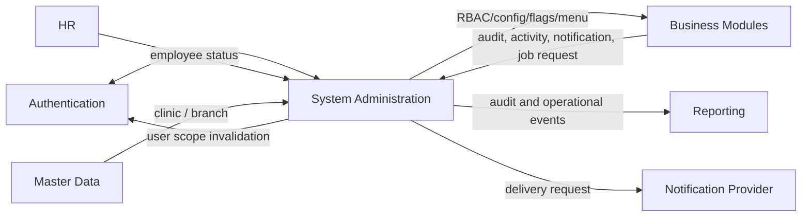
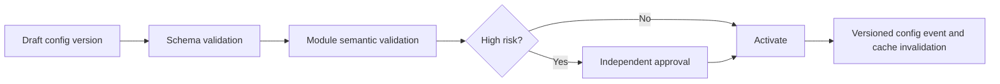

# Parakita Software Architecture Document (SAD)
# 21 - Module System Administration

## Table of Contents

1. Pendahuluan dan ruang lingkup
2. Arsitektur dan batas tanggung jawab
3. Model domain dan aturan sistem
4. Use case dan workflow administrasi
5. Desain data
6. Spesifikasi API
7. Event, notification, dan background processing
8. Security, RBAC, dan audit
9. Exception handling dan operasional
10. Monitoring, retention, dan governance
11. Skenario pengujian dan acceptance criteria
12. Deployment dan roadmap

---

# 1. Pendahuluan dan Ruang Lingkup

## 1.1 Overview

System Administration adalah fondasi lintas-modul Parakita untuk pengelolaan pengguna dan akses, parameter konfigurasi, menu, feature flag, template notifikasi, audit/activity log, attachment metadata, dan background-job governance. Semua domain bisnis bergantung pada kemampuan ini, tetapi tetap mempertahankan ownership atas transaksi masing-masing.

Blueprint membedakan Authentication & Authorization dari System Administration. Dokumen `10-authentication.md` tetap menjadi otoritas untuk password, JWT, refresh token, session, login, dan middleware autentikasi. Modul System mengelola provisioning/deactivation user, konfigurasi RBAC, scope branch, parameter, observability records, dan administrative controls tanpa melakukan bypass terhadap kebijakan Authentication.

## 1.2 Tujuan

- Mengelola user, role, permission, dan akses branch secara aman dan dapat diaudit.
- Menyediakan konfigurasi bertingkat yang tervalidasi, versioned, dan dapat dipulihkan.
- Menyediakan navigasi/menu dan feature flag tanpa menanam policy ke UI saja.
- Menyediakan notification, audit trail, activity log, attachment metadata, serta lifecycle background job.
- Mendukung operasi multi-clinic/multi-branch dengan least privilege dan deny by default.

## 1.3 In Scope

| Area | Cakupan |
|---|---|
| User administration | Provision, link employee, activate/deactivate, branch assignment, force logout request |
| RBAC administration | Role, permission catalog, role-permission, user-role, menu-permission mapping |
| System configuration | Parameter bertingkat, schema/value validation, version/history, effective scope |
| Feature and UI configuration | Feature flag, menu, menu permission, notification template |
| Shared services | Notification inbox, attachment metadata, activity/audit log, background job log |
| Operations | Job retry/cancel, configuration cache invalidation, health/status view, retention jobs |

## 1.4 Out of Scope

- Password hashing, login, MFA, JWT signing, refresh/session/token lifecycle, and account recovery protocol; Authentication owns these.
- Master business data such as patient, service, item, supplier, employee, invoice, journal, stock, or payroll.
- Authorization decision implementation inside a domain action; domain module tetap wajib memeriksa permission/resource ownership.
- Sending high-volume external messages directly from request thread; System creates notification requests/templates while worker/provider integration handles delivery.
- Infrastructure-as-code, secret-manager setup, SIEM, and network policy; deployment/security documents own these, though System exposes operational metadata.

## 1.5 Design Principles

1. **Deny by default.** Tidak ada permission/scope berarti tidak ada akses.
2. **Server-side enforcement.** Menu visibility is convenience; API/domain policy is the authority.
3. **Least privilege and branch isolation.** Scope berasal dari assignment server-side, bukan body client.
4. **Config is data, not arbitrary code.** Parameter and flags use typed schema; no executable expression/script.
5. **Effective dating and auditability.** Perubahan konfigurasi/RBAC bisa ditelusuri, diapprove, dan direstore.
6. **Immutable audit.** Log audit tidak dapat diedit oleh administrator biasa dan tidak boleh memakai soft delete rutin.
7. **Async side effects.** Notifikasi, cache invalidation broadcast, and job processing use durable outbox/queue.
8. **No secret disclosure.** Secrets are referenced from secret store and never returned/exported in clear text.

---

# 2. Arsitektur dan Batas Tanggung Jawab

## 2.1 Responsibility Matrix

| Capability | System Administration | Authentication | Domain module |
|---|:---:|:---:|:---:|
| Create/deactivate user profile | Owner | Enforces account/session state | Consumer |
| Password/JWT/session | Consumer/admin trigger | Owner | Consumer |
| Role/permission catalog and assignment | Owner | Evaluates claims/middleware | Enforces per action |
| Branch assignment | Owner | Includes authorised scope | Enforces resource scope |
| System parameter/flag/menu | Owner | Consumer | Consumer |
| Business configuration semantics | Generic store | No | Owner validates own namespace |
| Audit/activity log | Shared owner/projection | Producer | Producer |
| Notification template/inbox | Shared owner | Producer | Producer |
| Transaction state | No | No | Owner |

## 2.2 Dependencies

### Incoming dependency

| Source | Data/event | System action |
|---|---|---|
| Authentication | User login/session/token/account lock events | Activity/audit projection, admin visibility |
| HR | Employee activated/terminated | User link suggestion/deactivation workflow |
| All domain modules | Audit/activity/notification/job request events | Persist/process shared concern |
| Master Data | Clinic, branch, department references | Validate user/config scope |
| Infrastructure | Queue/provider/cache health | Operational status/read-only monitoring |

### Outgoing dependency

| Consumer | Output |
|---|---|
| Authentication | User activation/deactivation, role/scope invalidation, revoke-session request |
| All modules | Resolved parameter/flag/menu, permission/scope changes, notification dispatch |
| Reporting | Audit/activity/config/job events |
| Notification provider | Rendered, authorised delivery request |
| Operations | Job and delivery failure alert |

## 2.3 Context Diagram



## 2.4 Clean Architecture Placement

```text
system/
├── domain/          # user admin, role, parameter, flag, audit invariants
├── application/     # administrative commands/queries, validation, policies
├── infrastructure/  # repository, cache, queue, encrypted metadata, adapters
└── presentation/    # admin REST endpoints, middleware/policy integration
```

System namespaces should be explicit. A Finance setting such as account mapping is validated by Finance application service even when stored in the shared parameter registry; System never interprets a financial rule beyond generic schema/scope/version behavior.

---

# 3. Model Domain dan Aturan Sistem

## 3.1 Bounded Context

System Administration owns administration metadata and cross-cutting records. Key aggregates: `UserAdministration`, `Role`, `SystemParameter`, `FeatureFlag`, `Menu`, `NotificationTemplate`, `Notification`, `BackgroundJob`, and `AuditLog` (append-only).

## 3.2 Core Entities

### User Administration

User profile holds username/email/display name, employee link optional, status, role assignment, branch assignments, and administration metadata. Account statuses: `invited`, `active`, `suspended`, `locked` (observed from Authentication), `deactivated`. A deactivated user cannot receive new session/token; existing session revocation is requested through Authentication.

### Role, Permission, and Scope

Role groups permissions; permission is the smallest action identifier such as `finance.journal.post` or `report.export.create`. User-role is many-to-many where supported by the schema; `user_branch` defines accessible branches and one default branch. Permission assignment does not override resource ownership/domain rules.

### System Parameter

Parameter consists of namespace/key, typed value, schema version, scope, effective interval, status, encrypted/reference flag, and version history. Scope precedence: `branch` → `clinic` → `global` → default defined by owning module. A parameter has exactly one effective resolved value for a scope/time.

### Feature Flag and Menu

Feature flag controls availability of a named capability with enabled state, scope, effective dates, audience/role condition, and rollout metadata. It must not be used as an authorization bypass. Menu is navigation metadata with hierarchy/order/icon/route and menu-permission mapping. API authorization remains independent from menu visibility.

### Notification and Template

Template defines channel, locale, subject/body variables, classification, enabled state, and version. Notification is a recipient-specific immutable delivery request/status record. Statuses: `queued`, `processing`, `sent`, `delivered`, `failed`, `read`, `cancelled`; `read` applies to in-app acknowledgement and does not imply external delivery.

### Audit Log and Activity Log

Audit log records security-sensitive or state-changing actions with actor, target, action, outcome, before/after safe diff, source module, branch scope, correlation id, and timestamp. Activity log is a user-facing operational timeline and may be less detailed; it never replaces audit log.

### Background Job

Job manages asynchronous operation metadata: type, payload reference, idempotency key, priority, attempts, schedule, status, lease, result/error safe message, and trace/correlation ids. Job statuses: `queued`, `running`, `succeeded`, `retrying`, `failed`, `cancelled`, `dead_letter`.

## 3.3 Aggregate Invariants

| Aggregate | Invariant |
|---|---|
| UserAdministration | Active user has valid authorised branch/role assignment; default branch belongs to user |
| Role | System role cannot be deleted; permission mapping unique |
| SystemParameter | Value validates against schema; effective scope/range does not conflict ambiguously |
| FeatureFlag | Key unique; targeting is deterministic and non-secret; flag cannot grant missing permission |
| Menu | Parent hierarchy acyclic; route unique within active application scope |
| Notification | Rendered recipient/channel data is validated and no duplicate logical delivery on retry |
| AuditLog | Append-only; actor/action/time/outcome mandatory for sensitive action |
| BackgroundJob | One active idempotency key per job purpose; retry does not duplicate side effect |

## 3.4 Configuration Rules

1. Config key uses `module.namespace.key` format, e.g. `warehouse.expiry.warning_days`.
2. Allowed types: string, integer, decimal, boolean, enum, date, duration, JSON object/array validated by JSON Schema, or secret reference.
3. Direct clear-text secret value, executable JavaScript, SQL, shell, HTML, or arbitrary template code is rejected.
4. High-risk config/RBAC/flag changes require maker-checker approval and optional effective time.
5. Config change creates new version; rollback creates a new effective version referencing prior version, not destructive edit.
6. Value cache uses config-version/event invalidation and must fail closed for security-sensitive settings.
7. Owning module validates domain semantic constraints on read/application, including safe defaults when parameter is missing.

## 3.5 User and RBAC Rules

1. Username/email identifiers are unique case-insensitively according to policy.
2. User cannot be deactivated if it would remove the last active break-glass administrator; require explicit protected workflow.
3. Role/permission changes invalidate permission cache and trigger authentication session/claim refresh policy.
4. User may have only one default branch and it must appear in active `user_branch` assignment.
5. Deleting/deactivating a role in use is blocked; reassign users first or preserve as inactive historic role.
6. Built-in system roles/permissions are seeded/versioned and cannot be modified/deleted except supported extensions.
7. Client-supplied role, permission, branch, or menu state is never trusted for authorization.

---

# 4. Use Case dan Workflow Administrasi

## 4.1 Actor Matrix

| Use case | Administrator | Security Admin | Clinic Manager | Owner | Module Manager | System Worker |
|---|:---:|:---:|:---:|:---:|:---:|:---:|
| View user/menu/config | ✔ | ✔ | scoped | ✔ | scoped | |
| Provision/deactivate user | ✔ | ✔ | request only | | | |
| Manage role/permission | | ✔ | | ✔ approval | | |
| Assign branch | ✔ | ✔ | scoped request | | | |
| Manage own module parameter | | ✔ | | | ✔ scoped | |
| Approve high-risk config | | ✔ | | ✔ | | |
| Manage template/flag | ✔ | ✔ | | ✔ approval | scoped | |
| View audit/job health | ✔ | ✔ | limited | ✔ | | ✔ service |
| Retry/cancel job | ✔ | ✔ | | | | ✔ service |

## 4.2 UC-SYS-001 — Provision User

1. Administrator selects employee (optional), username/email, initial branch assignments, and role(s).
2. System validates identifier uniqueness, employee eligibility, branch active status, role mappings, and maker-checker policy.
3. System creates user with `invited` or `active` state according to Authentication provisioning policy; it never stores a plain password in audit or response.
4. System emits `system.user-provisioned.v1`; Authentication creates/activates credential state through its own flow.
5. Successful completion logs audit/activity record and sends an invitation notification if configured.

## 4.3 UC-SYS-002 — Change Role or Branch Scope

1. Security Admin proposes role/permission or branch assignment change with reason and effective time.
2. System validates protected role, separation of duties, default branch, target branch status, and no self-escalation policy.
3. If approval is required, request remains pending; approver cannot be the maker.
4. On effective time, new assignment commits, permission cache is invalidated, and Authentication receives claim/session refresh request.
5. Audit record contains old/new mappings and correlation id.

## 4.4 UC-SYS-003 — Update System Parameter

1. Module Manager/Administrator creates proposed value in an owned namespace and scope.
2. Schema and module semantic validator run; secret values must be secret references.
3. High-risk changes require second approver and optionally scheduled effective time.
4. Activation writes immutable version, publishes `system.configuration.changed.v1`, and invalidates relevant cache.
5. Rollback creates another version using a previously validated value and records reason.



## 4.5 UC-SYS-004 — Manage Feature Flag

Feature flag creation requires key, owner module, target scope/audience, default safe state, effective period, and rollback plan. Flag evaluation is deterministic by server-side context. Enabling a flag exposes a capability only to users who already pass its API/domain permission. Critical flags have expiry/review date to avoid permanent hidden behavior.

## 4.6 UC-SYS-005 — Notification Template and Delivery

1. Administrator creates versioned template with channel, locale, variable schema, content classification, and preview data.
2. System validates variables/escaping and blocks unsafe content according to channel policy.
3. Domain module requests a notification with template key and approved payload; System renders and queues recipient-specific delivery.
4. Worker sends through provider adapter, records attempts/status, and emits delivery outcome event.
5. Failed transient sends retry idempotently; permanent failure is dead-lettered and visible to authorised staff.

## 4.7 UC-SYS-006 — Inspect Audit and Activity

Authorised user filters audit by date, module, branch, actor, target, action, correlation id, or outcome. Restricted values are redacted. Audit query/export itself produces an audit event. No UI/API permits update/delete of audit log.

## 4.8 UC-SYS-007 — Operate Background Job

Operations user views queue depth, attempts, safe error, and trace. Retry is allowed only for idempotent/retryable job types and retains the same idempotency key. Cancel is best effort: running job checks cancellation signal and any external side effect must use a compensation/idempotency protocol.

---

# 5. Desain Data

## 5.1 Core Tables

Blueprint defines authentication/system tables such as `users`, `user_sessions`, `refresh_tokens`, `login_histories`, `roles`, `permissions`, `role_permissions`, `user_roles`, `menus`, `user_branch`, plus shared `attachments`, `notifications`, `activity_logs`, `audit_logs`, `background_jobs`, and `job_logs`. System Administration ERD adds `system_parameters`, `feature_flags`, `menu_permissions`, and `notification_templates`.

## 5.2 User and RBAC Tables

| Table | Key columns | Rules |
|---|---|---|
| `users` | employee id, username, email, password hash/auth state reference, status, last login | Authentication owns credential lifecycle; System manages admin state |
| `roles` | role code/name, description, system flag, status | Built-in role protected; code unique |
| `permissions` | permission code, module, action, description, status | Code unique and versioned seed catalog |
| `role_permissions` | role id, permission id | Unique role/permission pair |
| `user_roles` | user id, role id, effective dates | Unique active mapping by policy |
| `user_branch` | user id, branch id, is default, effective dates | One active default; branch must be active |
| `menus` | code, parent id, label, route, icon, order, active | Acyclic hierarchy; route policy |
| `menu_permissions` | menu id, permission id | Menu visibility mapping only |

## 5.3 Configuration Tables

| Table | Key columns | Rules |
|---|---|---|
| `system_parameters` | key, namespace, scope type/id, value type, value/reference, schema version, effective range, version, status | One resolved active value per key/scope/time |
| `system_parameter_versions`* | parameter id, old/new safe value hash, change/approval/reason | Append-only history |
| `feature_flags` | key, owner module, scope/target, enabled, effective dates, risk class | Key unique; expiry/review required for temporary flag |
| `configuration_change_requests`* | target, proposed version, maker/approver/status | Maker-checker workflow |

`*` adalah extension implementation yang direkomendasikan untuk memastikan version/history/approval; entitas core sesuai blueprint tetap dipertahankan.

## 5.4 Notification, Audit, and Shared Operations

| Table | Key columns | Rules |
|---|---|---|
| `notification_templates` | key, channel, locale, subject/body, variable schema, version, active | Template immutable after published; safe renderer |
| `notifications` | user/recipient, title/message, type, status, channel, template reference, created/read | Recipient scope; no sensitive raw payload unnecessary |
| `activity_logs` | actor, module, action, target, branch, message, created at | User-facing operational timeline |
| `audit_logs` | actor, action, target, before/after safe diff, outcome, IP/device, correlation id | Append-only and tamper-evident policy |
| `attachments` | storage metadata, owner module/type/id, classification, uploader | Object storage access authorised separately |
| `background_jobs` | job name/type, payload ref, status, attempts, schedule, lock, idempotency | Durable execution state |
| `job_logs` | job id, attempt, event/time, level, safe message | Append-only troubleshooting record |

## 5.5 Index, Constraint, and Retention

| Area | Required controls |
|---|---|
| User | Unique case-insensitive username/email; employee link index |
| RBAC | Unique role/permission and user/role maps; scope lookup index |
| Parameter | Unique key/scope/effective version; active-resolution index |
| Feature flag | Unique flag key; scope/target/effective-date index |
| Audit/activity | `(created_at, module, actor, branch)`, target/correlation lookup; partition by date when needed |
| Notification | recipient/status/date and idempotency/template lookup |
| Job | status/scheduled/lease, idempotency unique, dead-letter lookup |

Audit and job evidence follow security/operational retention policy; financial/clinical audit requirements take precedence. Attachment bytes are deleted/retained under document policy, while metadata/audit may remain longer. Secret references never appear in logs/snapshots/export.

---

# 6. Spesifikasi API

All endpoints use `/api/v1`, JWT and authorization from Authentication, standard API envelope/error, server-derived branch scope, and `Idempotency-Key` for high-risk commands. API requests never accept raw permission claims as authority.

## 6.1 User and Access Administration

| Method | Endpoint | Permission |
|---|---|---|
| GET/POST | `/system/users` | `system.user.read` / `system.user.manage` |
| GET/PATCH | `/system/users/{userId}` | `system.user.read` / `system.user.manage` |
| POST | `/system/users/{userId}/activate` | `system.user.activate` |
| POST | `/system/users/{userId}/deactivate` | `system.user.deactivate` |
| POST | `/system/users/{userId}/roles` | `system.user.role.manage` |
| POST | `/system/users/{userId}/branches` | `system.user.branch.manage` |
| POST | `/system/users/{userId}/revoke-sessions` | `system.user.session.revoke` |
| GET/POST | `/system/roles` | `system.role.read` / `system.role.manage` |
| GET | `/system/permissions` | `system.permission.read` |
| PATCH | `/system/roles/{roleId}/permissions` | `system.role.permission.manage` |

Role assignment example:

```json
{
  "roleIds": ["uuid"],
  "branchAssignments": [
    { "branchId": "uuid", "isDefault": true, "effectiveFrom": "2026-08-01" }
  ],
  "reason": "Rotasi operasional cabang"
}
```

## 6.2 Parameters, Flags, Menus, and Templates

| Method | Endpoint |
|---|---|
| GET/POST | `/system/parameters` |
| GET | `/system/parameters/{parameterKey}/versions` |
| POST | `/system/parameters/{parameterKey}/change-requests` |
| POST | `/system/configuration-change-requests/{requestId}/approve` |
| POST | `/system/parameters/{parameterKey}/rollback` |
| GET/POST | `/system/feature-flags` |
| PATCH | `/system/feature-flags/{flagKey}` |
| GET/POST | `/system/menus` |
| PATCH | `/system/menus/{menuId}/permissions` |
| GET/POST | `/system/notification-templates` |
| POST | `/system/notification-templates/{templateId}/preview` |

Parameter proposal example:

```json
{
  "key": "warehouse.expiry.warning_days",
  "scope": { "type": "branch", "id": "uuid" },
  "valueType": "integer",
  "value": 30,
  "effectiveFrom": "2026-08-01T00:00:00Z",
  "reason": "Kebijakan kontrol stok cabang"
}
```

## 6.3 Notifications, Audit, and Operations

| Method | Endpoint |
|---|---|
| GET | `/system/notifications` |
| POST | `/system/notifications/{notificationId}/read` |
| GET | `/system/audit-logs` |
| GET | `/system/activity-logs` |
| GET | `/system/jobs` |
| GET | `/system/jobs/{jobId}` |
| POST | `/system/jobs/{jobId}/retry` |
| POST | `/system/jobs/{jobId}/cancel` |
| GET | `/system/health/operations` |

## 6.4 Error Codes

| Code | HTTP | Meaning |
|---|---:|---|
| `SYS_USER_IDENTIFIER_EXISTS` | 409 | Username/email already exists |
| `SYS_LAST_ADMIN_PROTECTED` | 409 | Action would remove last break-glass admin |
| `SYS_ROLE_SYSTEM_PROTECTED` | 403 | Built-in role cannot be modified/deleted this way |
| `SYS_PERMISSION_ASSIGNMENT_INVALID` | 422 | Invalid/unknown permission mapping |
| `SYS_BRANCH_SCOPE_INVALID` | 422 | Default/assigned branch invalid |
| `SYS_CONFIG_SCHEMA_INVALID` | 422 | Value does not match typed schema |
| `SYS_CONFIG_APPROVAL_REQUIRED` | 403 | High-risk config needs approval |
| `SYS_CONFIG_VERSION_CONFLICT` | 409 | Effective version conflict |
| `SYS_FLAG_AUTH_BYPASS_FORBIDDEN` | 422 | Flag attempts to replace authorization |
| `SYS_AUDIT_IMMUTABLE` | 403 | Audit update/delete prohibited |
| `SYS_JOB_NOT_RETRYABLE` | 409 | Job type/status cannot be retried |
| `SYS_SECRET_VALUE_FORBIDDEN` | 422 | Raw secret value supplied instead of reference |

---

# 7. Event, Notification, dan Background Processing

## 7.1 Event Contract

Cross-module events follow durable outbox/inbox delivery: `eventId`, `eventType`, `occurredAt`, `source`, `branchId` if applicable, `correlationId`, `schemaVersion`, and safe payload. System consumers deduplicate by event id and must not log credentials, raw tokens, passwords, secret values, or sensitive attachment content.

## 7.2 Incoming Events

| Event | System action |
|---|---|
| `auth.login.succeeded/failed.v1` | Login history/activity/audit projection according to sensitivity |
| `auth.account.locked.v1` | Admin notification and audit event |
| `hr.employee.terminated.v1` | Create controlled deactivation/review request for linked user |
| `*.audit-recorded.v1` | Optional central audit projection/normalisation |
| `*.notification-requested.v1` | Validate/template-render/queue delivery request |
| `*.background-job-requested.v1` | Validate and enqueue supported shared job |
| `*.configuration-consumer-ack.v1` | Track config rollout/invalidations where used |

## 7.3 Outgoing Events

| Event | When | Consumer |
|---|---|---|
| `system.user-provisioned.v1` | User admin record created | Authentication, Reporting |
| `system.user-access-changed.v1` | Role/branch/user status effective | Authentication, Reporting, modules cache |
| `system.configuration.changed.v1` | Parameter version activated/rolled back | Owning module, cache consumers, Reporting |
| `system.feature-flag.changed.v1` | Flag state/target changes | Owning module/UI cache |
| `system.notification.delivery-updated.v1` | Delivery result changes | Requesting module, Reporting |
| `system.job.dead-lettered.v1` | Job permanently fails | Operations/notification |
| `system.audit-alert.v1` | Risk policy threshold reached | Security Admin/Owner |

## 7.4 Notification Delivery Rules

Notification request identifies recipient, template key/version, channel preference, locale, safe variable payload, dedupe key, priority, and correlation id. Rendering escapes content per channel. Email/WhatsApp/SMS provider credentials live in secret manager and are accessed by infrastructure adapters only. Retries use provider idempotency key where supported; failure message stored is sanitised.

## 7.5 Background Job Rules

- Workers claim jobs with lease/heartbeat; expired lease supports safe recovery.
- Job handler must be idempotent and report explicit retryability.
- Exponential backoff with jitter is used for transient errors.
- Max attempts, timeout, payload size, concurrency, and retention are typed config owned by the job namespace.
- Dead-letter requeue is manual/authorised and creates audit event.
- Jobs that invoke external side effects require idempotency/compensation contract before retry is enabled.

---

# 8. Security, RBAC, dan Audit

## 8.1 Authorization Model

Each request passes Authentication then permission, branch/resource-scope, and domain ownership evaluation. Role is only a permission grouping. The policy decision considers active user status, active role, permission, user branch assignments, requested resource branch, and contextual restrictions. System admin access itself follows least privilege; it is not a universal ability to read EMR/financial/HR restricted data.

## 8.2 Sensitive Operations

| Operation | Minimum control |
|---|---|
| User activation/deactivation | Admin permission, target scope, audit, session revoke on deactivate |
| Role/permission escalation | Security Admin, maker-checker, anti-self-escalation, cache invalidation |
| Break-glass admin change | Protected policy, owner approval, strong audit/alert |
| High-risk config/feature flag | Typed validation, independent approval, scheduled/effective version |
| Notification template external channel | Variable/escaping validation, template approval, audit |
| Audit/export access | Restricted permission, filter scope, audit of audit access |
| Job dead-letter replay | Operations permission, safe retryability, audit |

## 8.3 Audit Integrity

Audit records include actor/service identity, impersonation metadata, action, resource type/id, module, branch scope, outcome, timestamp UTC, IP/device/user agent where applicable, correlation/trace id, reason, and safe before/after diff. Integrity is protected through restricted database access, append-only application policy, backup, and optionally chained hash/WORM retention. Audit data never stores plaintext password, token, secret, or full medical document content.

## 8.4 Privacy and Data Minimisation

System views return only metadata needed for administration. Employee link and recipient details are minimised; identity/bank/medical data must be fetched from owner module with its policy, not copied into generic activity log. Notification template payload and job payload retain only necessary data and have expiration/redaction policy.

---

# 9. Exception Handling dan Operasional

| Scenario | System response | Resolution |
|---|---|---|
| Duplicate user identifier | Reject atomically | Use existing user or correct identifier |
| Last admin removal | Block protected action | Assign/activate replacement through approved workflow |
| Role update conflicts | Version conflict; no partial mapping | Reload and resubmit/review change |
| Config invalid schema/semantic | Reject before version activation | Correct typed value/owner rule |
| Config cache stale | Fail closed for security setting; show stale state | Invalidate/retry consumer and monitor ack |
| Flag targeting invalid | Reject | Correct scope/audience; authorization remains independent |
| Notification provider down | Queue/retry; no request transaction rollback | Dead-letter/escalate after policy |
| Duplicate notification/job request | Reuse/return existing logical request | No duplicate side effect |
| Job worker crash | Lease expires and safe retry resumes | Investigate repeated failure/dead-letter |
| Audit persistence failure | Roll back sensitive command | Restore audit path and retry |
| Attachment scan fails | Quarantine/deny access | Replace with clean authorised upload |
| Authentication invalidation fails | Mark pending/retry, alert | Do not assume new access takes effect until acknowledged |

No exception permits direct database editing of RBAC, audit, or configuration history outside documented emergency procedure. Emergency action uses break-glass identity, time limit, and post-incident review.

---

# 10. Monitoring, Retention, dan Governance

## 10.1 Operational Dashboard

| Metric | Purpose |
|---|---|
| Active/invited/suspended user count | Account administration health |
| Permission denied and escalation attempts | Security signal |
| Config/flag change pending/failed | Governance and rollout state |
| Notification queued/sent/failed/oldest age | Delivery health |
| Job queue depth, lease expiry, retry/dead-letter | Async reliability |
| Audit write/query/export volume | Audit health and anomaly signal |
| Cache invalidation acknowledgement lag | Configuration consistency |
| Attachment scan/quarantine count | File security signal |

## 10.2 Retention Policy

| Record | Minimum policy direction |
|---|---|
| Audit log | Long-term, immutable per compliance/operational policy |
| Activity log | Configured operational retention, may be summarised |
| Login/session metadata | Authentication security retention policy |
| Notification content | Shorter retention, classification-dependent |
| Job payload/log | Retain safe diagnostics; redact/expire sensitive payload |
| Config/RBAC version | Retain effective history and approval evidence |
| Export/download audit | Retain according to data classification |

Exact durations are defined by security, legal, and clinic policy. Retention job removes only eligible derived artifacts; it never violates a source module's record hold or audit requirement.

## 10.3 Governance Checklist

1. Every permission has owner module, action semantics, and test coverage.
2. Every parameter/flag has namespace owner, schema, default, risk class, and rollback path.
3. System roles are seed-versioned and change reviewed.
4. High-risk change has maker, approver, effective time, reason, and audit evidence.
5. Notification/job templates are reviewed for privacy, idempotency, and failure behavior.
6. Quarterly access review validates roles/branches and stale users.
7. Break-glass access is time-bound, monitored, and reviewed after use.

---

# 11. Skenario Pengujian dan Acceptance Criteria

| ID | Scenario | Expected result |
|---|---|---|
| TC-SYS-001 | Provision unique valid user | User/invitation and audit event created once |
| TC-SYS-002 | Provision duplicate username/email | 409 with no partial user/role records |
| TC-SYS-003 | Deactivate user | New access denied and session revocation requested/audited |
| TC-SYS-004 | Remove last protected admin | Blocked with `SYS_LAST_ADMIN_PROTECTED` |
| TC-SYS-005 | Role assignment outside branch scope | Rejected; no claims/cache update |
| TC-SYS-006 | Client sends forged role/branch | API policy uses server assignment and denies unauthorised action |
| TC-SYS-007 | High-risk config by maker only | Remains pending, not active |
| TC-SYS-008 | Invalid typed config | 422 and no configuration version activated |
| TC-SYS-009 | Config rollback | New version references prior value; audit/cache event exists |
| TC-SYS-010 | Enable flag for user without permission | Flag alone does not grant protected endpoint access |
| TC-SYS-011 | Menu permission removed | Menu hidden but API still independently enforced |
| TC-SYS-012 | Notification retry | Single logical delivery despite duplicate request/retry |
| TC-SYS-013 | Provider permanent failure | Notification/job dead-lettered and visible to authorised ops |
| TC-SYS-014 | Worker crashes after claim | Lease recovery retries idempotently without duplicate side effect |
| TC-SYS-015 | Attempt audit update/delete | Forbidden; audit record remains immutable |
| TC-SYS-016 | Audit persistence outage on sensitive command | Command rolled back/fails safely |
| TC-SYS-017 | Raw secret in parameter/log | Rejected/redacted; no secret in response/audit |
| TC-SYS-018 | Attachment malware scan failure | File quarantined and unavailable |

Acceptance criteria:

- Authorization denies by default and is enforced server-side for every protected resource.
- User/role/branch/config high-risk changes are versioned, scope-validated, and auditable.
- Authentication session/token management remains delegated to its owning module without bypass.
- Audit logs are append-only and sensitive values are not exposed.
- Notification and background jobs are durable, observable, idempotent, and safe to retry.

---

# 12. Deployment dan Roadmap

## 12.1 Operational Requirements

System Administration runs with the same modular backend/database, plus secure integration to Authentication, cache, message queue, object storage/antivirus scanner, secret manager, notification providers, and observability stack. Production requires TLS, database least-privilege accounts, encryption at rest for sensitive metadata, durable outbox/inbox, rate limits for admin endpoints, backup, and protected break-glass procedure.

Minimum observability includes security authentication events, permission denial rate, config-change lifecycle, queue/dead-letter state, notification delivery results, audit persistence success, job worker health, cache invalidation latency, and attachment scan outcomes. Alerts must avoid disclosing secrets/PII.

## 12.2 Scalability and Availability

Permission/config reads use versioned cache with bounded TTL and invalidation; policy changes favour safety over stale availability. Notification and background worker pools scale independently of API servers. Audit writes use async enrichment only if the initial durable security event is safely persisted; sensitive command completion must not claim success without required audit evidence. Partition high-volume activity/audit/job logs by time while preserving query and retention requirements.

## 12.3 Roadmap

| Phase | Enhancement |
|---|---|
| 1 | User admin, RBAC, branch scope, parameter/menu, audit/activity, notification inbox, job framework |
| 2 | Maker-checker config, feature flags, template versioning, provider adapters, operation dashboard, attachment security |
| 3 | Delegated/time-bound access, access-review automation, policy simulation, config rollout acknowledgement, SIEM integration |
| 4 | Multi-tenant administration, dynamic policy/ABAC extensions, advanced secret rotation, organisation-wide governance analytics |

---

# Summary

System Administration provides the secure shared control plane for Parakita: user provisioning and scope, RBAC configuration, typed/versioned system configuration, menu/feature management, notification and job operations, and immutable audit/activity evidence. Its essential safeguards are deny-by-default server enforcement, separation from Authentication credential mechanics, branch-aware least privilege, maker-checker for high-risk changes, non-disclosure of secrets, and durable asynchronous processing.
