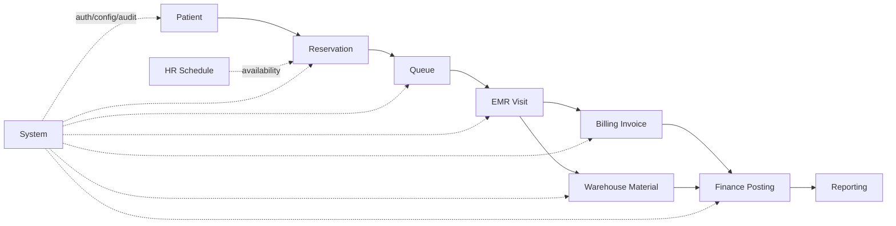
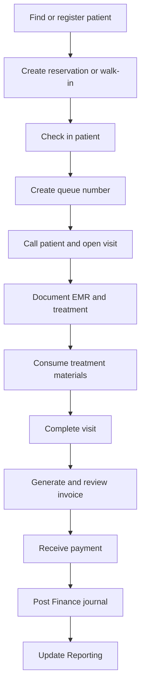
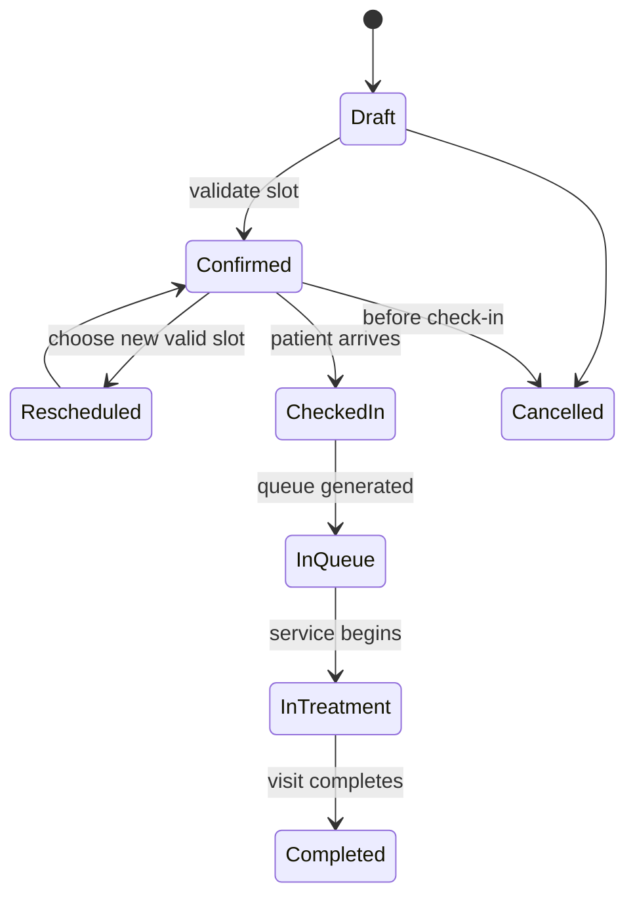
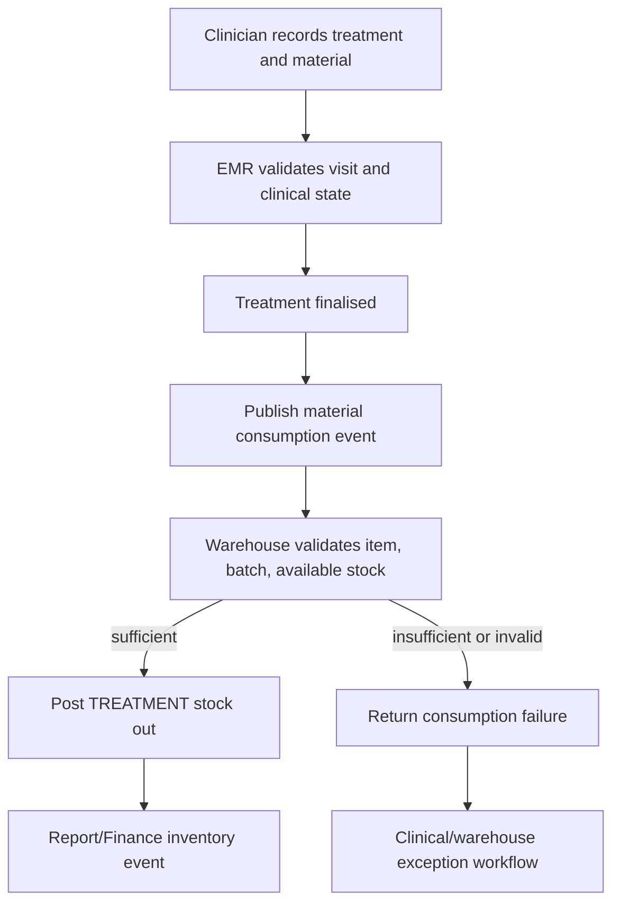
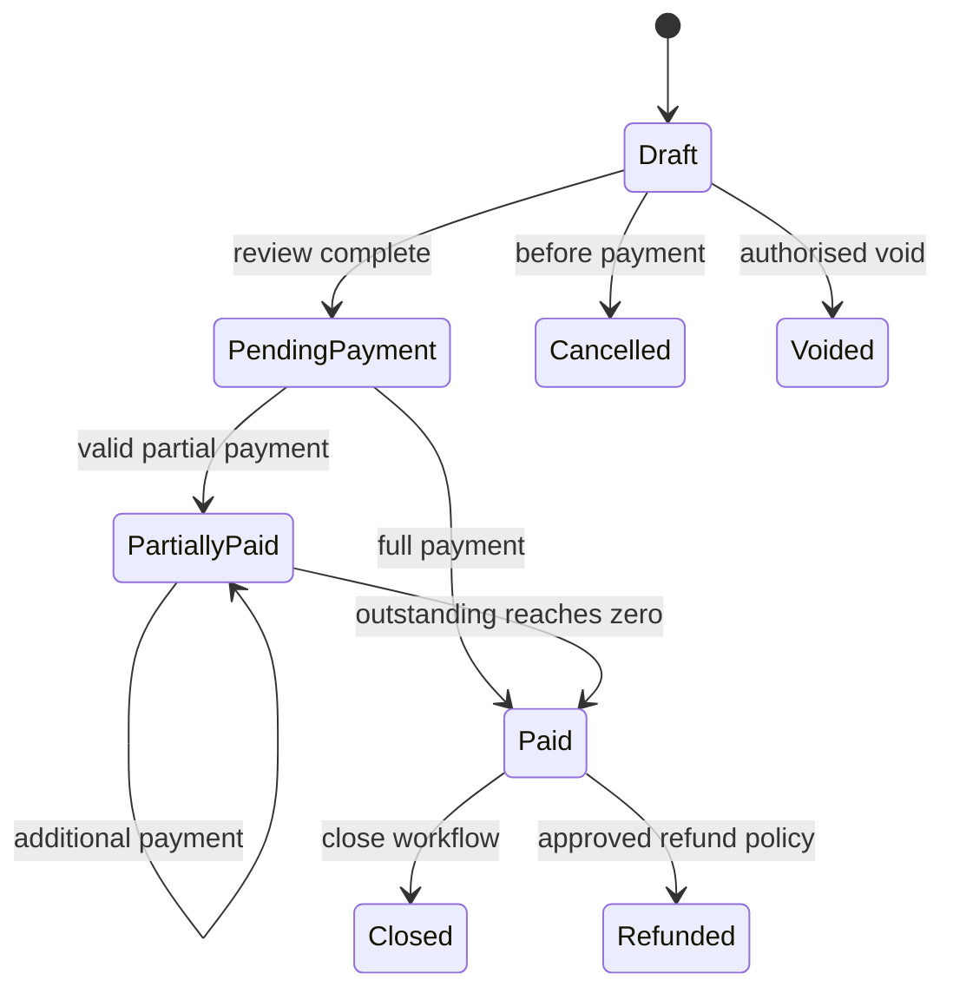
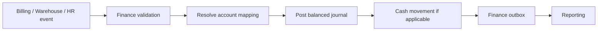
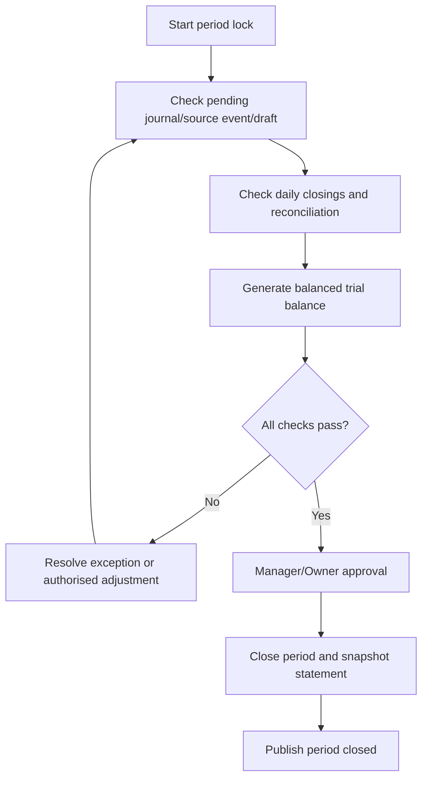
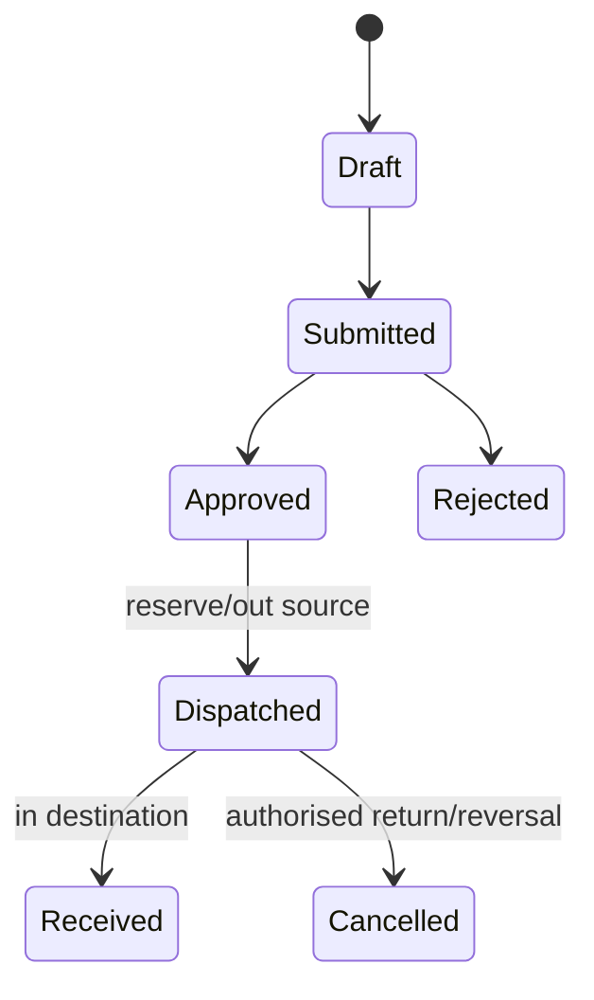
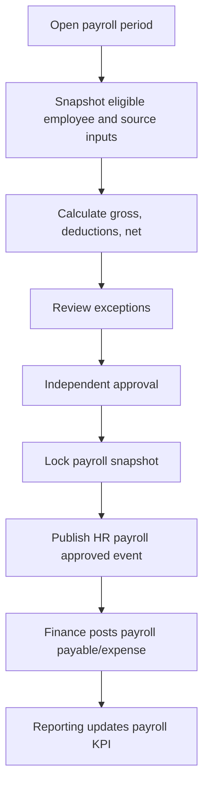
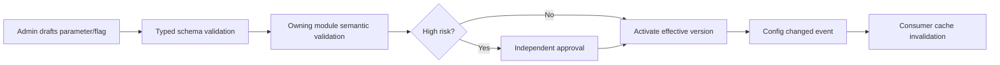

# Parakita Software Architecture Document (SAD)
# 22 - End-to-End Workflow

## Table of Contents

1. Pendahuluan dan prinsip workflow
2. Peta proses dan ownership
3. Aturan umum handoff lintas modul
4. Workflow layanan pasien end-to-end
5. Workflow reservation dan queue
6. Workflow EMR, treatment, dan material
7. Workflow billing, payment, dan refund
8. Workflow finance dan closing
9. Workflow warehouse
10. Workflow HR dan payroll
11. Workflow reporting dan system administration
12. Exception, compensation, dan acceptance criteria

---

# 1. Pendahuluan dan Prinsip Workflow

## 1.1 Tujuan

Dokumen ini mendefinisikan alur bisnis lintas modul Parakita dari sudut pandang proses, bukan implementasi API tunggal. Tujuannya adalah memastikan setiap peran mengetahui langkah, state, pemilik data, kondisi transisi, event, dan tindakan saat exception terjadi.

Workflow ini melengkapi desain setiap modul. Bila ada perbedaan detail, aturan domain dan state machine pada dokumen pemilik modul menjadi otoritas untuk record tersebut.

## 1.2 Prinsip

1. **Single ownership.** Hanya modul pemilik yang dapat mengubah aggregate-nya.
2. **Command vs event.** Command meminta perubahan pada owner; event memberitahukan perubahan yang telah committed.
3. **Atomic within module.** Perubahan aggregate, audit, inbox/outbox, serta state lokal yang terkait terjadi dalam transaksi modul pemilik.
4. **Eventual across module.** Handoff lintas modul bersifat event-driven dan idempoten; kegagalan consumer tidak membatalkan transaksi sumber yang valid.
5. **No hidden mutation.** Tidak ada query/report/job yang mengubah record domain sumber.
6. **Branch isolation.** Semua langkah tervalidasi terhadap branch dan permission pengguna.
7. **Audit by default.** Status penting, approval, override, dan koreksi menghasilkan audit trail.
8. **Compensation, not deletion.** Record transaksi final dikoreksi dengan return, refund, reversal, adjustment, atau workflow baru yang tertaut—bukan update/delete langsung.

## 1.3 Notasi

| Notasi | Makna |
|---|---|
| **Owner** | Modul yang memiliki hak mutasi data/state |
| **Trigger** | User command, schedule, atau event yang memulai proses |
| **Precondition** | Kondisi yang wajib benar sebelum transisi |
| **Output** | Record/event yang dihasilkan setelah commit |
| **Handoff** | Event atau command terkontrak ke modul lain |
| **Compensation** | Proses lawan/koreksi yang mempertahankan histori |

---

# 2. Peta Proses dan Ownership

## 2.1 End-to-End Patient Service

## 2.2 Ownership Matrix

| Business object | Owner | Main consumers |
|---|---|---|
| Patient profile and MRN | Patient | Reservation, Queue, EMR, Billing, Reporting |
| Reservation and schedule slot | Reservation | Queue, EMR, Reporting |
| Queue number/status | Queue | Reservation, EMR, Reporting |
| Visit, SOAP, treatment, odontogram | EMR | Billing, Warehouse, Reporting |
| Invoice, payment, deposit, refund | Billing | Finance, Reporting, Notification |
| Journal, cash movement, expense, closing | Finance | Reporting |
| Item stock, batch, PO, opname | Warehouse | EMR, Finance, Reporting |
| Employee, attendance, leave, payroll | HR | Finance, Reporting, System |
| User/RBAC/config/audit/job | System/Authentication | All modules |
| Dashboard/report snapshot | Reporting | Management/all authorised roles |

## 2.3 Principal Actors

| Actor | Workflow responsibility |
|---|---|
| Registration Staff | Patient verification, reservation, check-in |
| Queue/Clinic Staff | Queue calling and operational coordination |
| Doctor/Nurse | Clinical care/EMR and material selection through treatment |
| Cashier | Invoice review, payment, receipt, payment-side workflow |
| Finance Staff/Manager | Journal, expense, cash close, period close |
| Warehouse Staff/Manager | Purchase, receipt, stock, transfer, adjustment, opname |
| HR Staff/Manager | Employment, attendance, leave, overtime, payroll |
| Clinic Manager/Owner | Approval and management review |
| Administrator/Security Admin | User scope, RBAC, configuration, audit/operations |

---

# 3. Aturan Umum Handoff Lintas Modul

## 3.1 Handoff Contract

Setiap event lintas modul memuat minimal `eventId`, `eventType`, `occurredAt`, `source`, `branchId` bila relevan, `correlationId`, `schemaVersion`, dan payload aman. Consumer menyimpan `eventId`/reference untuk deduplication. Event yang diretry menghasilkan hasil bisnis yang sama, bukan record ganda.

## 3.2 State Transition Guard

| Guard | Aturan |
|---|---|
| Authentication | User aktif dan session/token valid |
| Authorization | Permission, branch scope, resource ownership/division verified server-side |
| Referential validity | Referensi active/valid pada waktu transaksi |
| Lifecycle | State sumber mengizinkan command yang diminta |
| Idempotency | Command/event berisiko memakai key/reference unik |
| Audit | Aksi sensitif gagal jika audit wajib tidak dapat dipersist dengan aman |
| Configuration | Parameter/feature active, typed, valid untuk branch/time scope |

## 3.3 Response to Consumer Failure

1. Source transaksi valid **commit** bersama outbox event.
2. Consumer menerima, memvalidasi, dan memproses secara idempoten.
3. Kegagalan transient menggunakan retry/backoff.
4. Kegagalan business/configuration permanent masuk dead-letter/worklist dengan source reference.
5. Owner data memperbaiki konfigurasi atau membuat compensation yang authorised; event direplay secara aman.
6. Tidak ada consumer yang langsung mengubah tabel source untuk memperbaiki kegagalan.

## 3.4 Correlation and Traceability

Satu episode layanan membawa `correlationId` dari reservation/check-in hingga visit, invoice, payment, material consumption, dan journal reference. Nilai ini memudahkan audit/reconciliation namun tidak menggantikan foreign key/reference milik setiap domain.

---

# 4. Workflow Layanan Pasien End-to-End

## 4.1 Main Flow

| Step | Owner/actor | Action and state | Output/handoff |
|---:|---|---|---|
| 1 | Registration/Patient | Cari atau registrasi patient | Patient profile/MRN valid |
| 2 | Reservation | Buat reservation atau walk-in | `confirmed`/eligible reservation |
| 3 | Registration | Check-in pada hari kunjungan | Reservation `checked_in`; command Queue |
| 4 | Queue | Generate nomor dan antrean | Queue `waiting`; event availability |
| 5 | Doctor/Queue | Panggil dan mulai layanan | Queue `called/in_service`; EMR visit opened |
| 6 | EMR | Catat pemeriksaan, diagnosis, treatment | Clinical record draft/final |
| 7 | Warehouse | Consume material jika treatment final | Stock ledger out/consumption result |
| 8 | EMR | Selesaikan/close visit sesuai rule | `VisitCompleted` event |
| 9 | Billing | Generate/review invoice | Invoice `draft/pending_payment` |
| 10 | Cashier/Billing | Receive payment | Payment success; invoice partial/paid |
| 11 | Finance | Post/reconcile financial event | Journal/cash movement posted |
| 12 | Billing/Finance | Close transaction/day according to policy | Invoice/closing status final |
| 13 | Reporting | Consume events | KPI/report projection updated |

## 4.2 Main Workflow Diagram

## 4.3 Clinical/Billing Boundary

EMR owns clinical completion. Billing may generate invoice only when Visit/treatment meets its configured billing eligibility rule. A clinical correction after invoice/payment is not a direct edit to invoice; it follows the authorised clinical correction plus Billing adjustment/refund/void policy and any Finance reversal required.

## 4.4 Completion Criteria

The patient service workflow is operationally complete when visit is final according to EMR, invoice has reached an allowed final/payment state, material consumption exceptions are resolved or explicitly authorised, required Finance event has posted/reconciled, and audit/reporting events have been emitted. Reporting projection delay does not block clinical or payment completion.

---

# 5. Workflow Reservation dan Queue

## 5.1 Reservation Lifecycle

Reservation after check-in cannot be cancelled through reservation cancellation flow. No-show handling follows configured time/policy and creates audit/activity records.

## 5.2 Create Reservation

1. Registration identifies existing patient or creates one via Patient module.
2. Reservation validates active branch, doctor/service/chair/schedule and slot availability.
3. Reservation persists `draft → confirmed`, generates unique number, and publishes `reservation.created.v1`.
4. Notification may be queued asynchronously; a notification failure does not invalidate confirmed reservation.

### Alternative: Walk-in

Walk-in creates a reservation with type/source `walk_in`, validates same operational availability rules, and may proceed to check-in immediately. It does not bypass patient identity, branch scope, or queue-number rules.

## 5.3 Reschedule and Cancel

| Operation | Preconditions | Result |
|---|---|---|
| Reschedule | Not checked-in; new slot valid | New appointment data/history, queue impact handled |
| Cancel | Not checked-in; reason supplied | `cancelled`, slot released, notification/event |
| No-show | Configured cutoff passed | Status recorded; no clinical visit/invoice created |

## 5.4 Check-In and Queue Generation

1. Registration verifies arrival, reservation/date/branch, and patient identity as required.
2. Reservation commits check-in exactly once.
3. Queue receives command/event and creates unique branch/date/service queue number.
4. Queue success makes reservation operationally `in_queue`; queue event is available to EMR.
5. If queue generation transiently fails after check-in, idempotent retry uses reservation reference. The user must not manually check-in again to obtain another queue number.

## 5.5 Queue Service

| Queue status | Allowed next action | Owner |
|---|---|---|
| `waiting` | Call, cancel/skip according to policy | Queue |
| `called` | Start service, recall, skip | Queue/clinical handoff |
| `in_service` | Complete service | Queue/EMR coordination |
| `completed` | Read only/operational correction policy | Queue |
| `skipped/no_show/cancelled` | Requeue only through authorised policy | Queue |

Queue does not create clinical content. Starting service asks EMR to open/associate a visit; EMR owns visit state.

---

# 6. Workflow EMR, Treatment, dan Material

## 6.1 Open Visit

1. From an eligible queue/reservation, authorised clinical user opens EMR visit at the same branch.
2. EMR snapshots necessary patient and appointment references; source demographics remain owned by Patient.
3. Doctor/nurse records vital signs, SOAP, diagnosis, odontogram, treatment, prescription/attachments as permitted.
4. Each clinical change has audit/activity trace according to sensitivity.

## 6.2 Treatment and Material Consumption

### Material Rules

- EMR selects intended material/quantity but does not edit Warehouse balance.
- Warehouse chooses FEFO batch for tracked items unless an authorised clinical/warehouse override provides reason.
- Item must be active, branch/warehouse valid, batch unexpired where applicable, and available stock sufficient.
- Each `TreatmentMaterialFinalized` event is idempotent per treatment/material reference.
- A failure is visible to authorised clinical/warehouse staff and does not silently produce negative stock.

## 6.3 Complete Visit

EMR validates mandatory clinical components, treatment state, authorisation, and configured material/exception conditions. Completion emits `emr.visit.completed.v1` including references necessary for Billing and Reporting. EMR does not create or mark an invoice paid.

## 6.4 Clinical Correction After Finalisation

| Situation | Required workflow |
|---|---|
| Treatment data correction before final visit | Edit according to EMR rules; material event follows current state |
| Material consumption must be undone | EMR emits reversal; Warehouse posts linked `RETURN` transaction |
| Visit correction after invoice draft | EMR correction plus Billing recalculation/adjustment policy |
| Visit correction after payment | EMR correction, Billing approval/credit/refund/void policy, Finance reversal if posted |
| Attachment/data sensitivity issue | Authorised EMR correction with audit; no generic System log of clinical content |

---

# 7. Workflow Billing, Payment, dan Refund

## 7.1 Invoice Generation

1. Billing consumes `VisitCompleted` or authorised user command with eligible visit reference.
2. Billing validates no invoice already exists for the billable visit/reference and resolves treatment/service/material charge data according to configured price snapshot.
3. Invoice is created as `draft`; cashier may review allowed manual charge/discount/insurance/deposit detail.
4. Calculation produces subtotal, discount, tax, coverage, total, paid amount, and outstanding using decimal money.
5. When ready, invoice becomes `pending_payment`; only Billing owns its state.

## 7.2 Invoice and Payment State

`Paid` and `Closed` invoices are immutable for ordinary update. Post-payment correction uses approved refund, void, credit/adjustment, or defined compensation workflow.

## 7.3 Receive Payment

1. Cashier opens invoice in same authorised branch and validates non-zero outstanding.
2. Billing validates payment method active, amount positive, reference unique where required, and split/multiple/deposit/insurance allocation rules.
3. Billing commits payment, allocation, invoice balance/status, receipt/audit, and outbox event atomically.
4. On success, `billing.payment.received.v1` and/or `billing.invoice.paid.v1` is available to Finance, Reporting, and Notification.
5. Finance failure after Billing commit does not reverse successful payment automatically; it is a posting exception/retry work item.

## 7.4 Refund, Cancel, and Void

| Action | Preconditions | Owner/result |
|---|---|---|
| Cancel invoice | Draft/not paid, reason; permitted actor | Billing marks `cancelled` |
| Void invoice | Authorised approval, reason, policy validation | Billing marks `void`; linked audit/Finance handling |
| Refund | Successful payment, amount within refundable balance, approval | Billing creates refund and updates payment/invoice state |
| Deposit withdrawal/refund | Valid available deposit and policy/approval | Billing deposit transaction |

Refund/void triggers Finance compensation/reversal event as applicable. Neither Cashier nor Finance edits original payment/invoice record to simulate a refund.

## 7.5 Daily Billing Handoff

At cashier daily closing, Billing/Finance reconcile payment records, payment method totals, and physical/clearing cash according to configured responsibilities. Difference requires reason and approval. A daily close does not alter original payment; it creates a separate closing/reconciliation record.

---

# 8. Workflow Finance dan Closing

## 8.1 Automated Finance Posting

1. Finance inbox receives Billing, Warehouse, or HR event.
2. Finance validates schema, source final state/reference, branch, accounting period, account mapping, and event idempotency.
3. Finance creates balanced `JournalEntry` plus `JournalDetail`; cash events create linked `CashMovement`.
4. Journal, detail, source-event idempotency, outbox, and audit commit atomically.
5. Finance publishes `finance.journal.posted.v1`; Reporting consumes it for financial statements.

## 8.2 Manual Journal and Expense

Finance Staff may create draft journal/expense. Finance Manager validates evidence, branch, period, account, and segregation of duties before posting/approving. A posted journal cannot be edited; correction makes linked reversal journal. Expense payment creates authorised cash movement and journal, not an unreferenced balance update.

## 8.3 Daily Cash Closing

1. Cashier/Finance selects branch, cash account, cashier/shift, and closing date.
2. Finance calculates expected balance from posted opening/movements.
3. User enters physical count/denominations and reason if difference exists.
4. Authorised approver accepts zero-difference close or approves documented variance.
5. Approved close locks scope and publishes closing event; later correction uses adjustment/re-closing process.

## 8.4 Financial Period Close

Closed period rejects new posting. Reopen requires Owner-authorised, reasoned, audited workflow; it is not a casual date edit.

---

# 9. Workflow Warehouse

## 9.1 Purchase to Stock

| Step | Owner | State/output |
|---:|---|---|
| 1 | Warehouse Staff | Create PO draft with supplier, items, quantities, cost |
| 2 | Approver | Submit/approve/reject PO |
| 3 | Warehouse Staff | Receive goods against approved PO |
| 4 | Warehouse | Validate item, quantity, batch/expiry, warehouse |
| 5 | Warehouse | Post `PURCHASE` stock transaction and update balance/batch |
| 6 | Warehouse | Publish goods receipt/stock event to Finance/Reporting |

Partial receipt is allowed within ordered quantity. Over-receipt, invalid batch, expired good, or duplicate receipt is blocked unless authorised policy explicitly permits it.

## 9.2 Transfer

Source and destination warehouse must differ. Cross-branch transfer has additional approval/clearing policy. Dispatch/receive creates traceable pair of movement references; lost/in-transit exception uses authorised adjustment, not invisible balance edit.

## 9.3 Adjustment and Opname

1. Staff creates adjustment with direction, item/batch, quantity, reason code, evidence, and branch/warehouse.
2. Required approver validates high-risk/financial threshold.
3. Posting creates immutable `ADJUSTMENT` ledger row; Finance event occurs when configured.
4. Stock opname captures system snapshot, records physical count, computes variance, and waits approval.
5. Approval generates one linked `OPNAME` transaction per variance line, then locks document.

## 9.4 Stock Alerts

Warehouse evaluates low stock from `available_stock <= minimum_stock` and expiry from batch/expiry policy. Alert is deduplicated per item/batch/warehouse/type/state. Alert visibility/notification supports action but does not itself change inventory or purchase state.

---

# 10. Workflow HR dan Payroll

## 10.1 Employee Lifecycle

1. HR creates employee draft with branch, department, position, employment data, contract, and effective date.
2. HR Manager validates and activates employee; history is written.
3. System/Authentication provisions or links user account separately when required.
4. Schedule, attendance, leave, overtime, salary, and payroll eligibility use active/effective employment data.
5. Termination checks future schedule, pending leave/overtime/payroll, user access, and handover; employee history remains immutable.

## 10.2 Attendance, Leave, and Overtime

| Flow | Trigger | Rules/output |
|---|---|---|
| Schedule | HR creates/publishes schedule | No employee time overlap; active employee/branch |
| Attendance | Check-in/out or authorised input | Valid interval; one daily/shift scope; correction audited |
| Leave | Employee/HR submit | Quota/schedule/cutoff validation; independent approval |
| Overtime | Employee/supervisor submit | Valid non-overlap duration; approval before payroll |

Approved leave updates allocation/schedule per policy. Approved overtime may be consumed once by a payroll item; payroll correction is required if a paid overtime needs change.

## 10.3 Payroll to Finance

HR owns calculation/snapshot. Finance owns journal/payable/payment. Payroll approved data is immutable; adjustment/reversal creates a new linked record/event, not edit of old payslip.

---

# 11. Workflow Reporting dan System Administration

## 11.1 Reporting Projection

1. Each source module commits business transaction and outbox event.
2. Reporting consumer validates schema/version, branch, and idempotency.
3. Consumer updates domain read model/aggregate plus checkpoint/watermark.
4. Dashboard/report response exposes `dataAsOf` and `freshness` (`fresh`, `refreshing`, `stale`, `partial`, `failed`).
5. Large report/export creates asynchronous job and immutable snapshot/artifact.

Reporting failure never blocks source workflow. Finance report uses Finance posted journal authority; Billing payment dashboard and Finance accounting revenue are distinct metrics and must be labelled accordingly.

## 11.2 Configuration Change

Configuration must not become an authorization bypass. Flag/menu affects availability/presentation only; permission/domain policy remains enforced server-side.

## 11.3 User Access Change

1. Administrator/Security Admin proposes user role/branch status change with reason.
2. System checks default branch, protected admin, role policy, and anti-self-escalation.
3. High-risk access change uses maker-checker where required.
4. On effective time, System commits assignment, audit, and access-change event.
5. Authentication invalidates/reloads claims/session according to security policy; domain API checks new scope on subsequent requests.

## 11.4 Audit, Notification, and Job Workflow

Sensitive actions commit audit with domain transaction. Notification requests and background jobs use durable queue/outbox, idempotency keys, retry/backoff, and dead-letter visibility. A transient provider/worker failure does not falsify success of the originating business transaction; audit log records actual delivery/job outcome separately.

---

# 12. Exception, Compensation, dan Acceptance Criteria

## 12.1 Cross-Module Exception Matrix

| Scenario | Source workflow outcome | Required handling |
|---|---|---|
| Queue creation unavailable after check-in | Check-in committed if designed atomically with outbox | Idempotent Queue retry by reservation reference |
| Warehouse rejects EMR material | No stock out | Show clinical/warehouse exception; replenish/authorised decision |
| Invoice event duplicate | No duplicate invoice/payment | Billing/Finance idempotency returns existing result |
| Finance mapping missing after payment | Payment remains valid | Finance configuration exception and replay; no reverse payment automatically |
| Reporting stale | Transaction unaffected | Mark `dataAsOf` stale/partial and recover projection |
| Payment refund required | Original payment preserved | Approved Billing refund + Finance reversal event |
| Stock count differs | Original ledger preserved | Approved OPNAME/adjustment transaction |
| Payroll source corrected after lock | Original payroll preserved | HR adjustment/reversal + Finance event |
| User access must end immediately | Domain records untouched | System deactivation + Authentication session revocation |
| Closed finance period posting | Posting rejected | Correct in allowed period or authorised reopen workflow |

## 12.2 Compensation Patterns

| Original action | Prohibited correction | Required compensation |
|---|---|---|
| Posted journal | Edit/delete journal line | Linked reversal journal |
| Stock transaction | Set stock balance directly | Return/adjustment/opname transaction |
| Successful payment | Edit amount/status | Refund/reversal/approved void policy |
| Approved payroll | Edit payroll item | Linked payroll adjustment/reversal |
| Approved closing | Edit count/balance | Adjustment and controlled re-close |
| Audit event | Delete/overwrite log | Add supplemental audit/correction record |
| Final EMR record | Generic DB update | Authorised clinical amendment workflow |

## 12.3 End-to-End Acceptance Criteria

| ID | Scenario | Expected result |
|---|---|---|
| E2E-001 | New patient to paid visit | MRN, reservation, queue, visit, invoice, payment, Finance event, and audit references are traceable |
| E2E-002 | Walk-in | Same identity, branch, queue, and visit guards apply; no duplicate queue |
| E2E-003 | Reservation cancellation before check-in | Slot released and no queue/visit/invoice generated |
| E2E-004 | Check-in retried | Exactly one queue reference exists |
| E2E-005 | Treatment uses material | Warehouse consumes once with valid batch/available balance |
| E2E-006 | Insufficient stock | EMR/Warehouse exception visible; no negative stock or silent material ledger |
| E2E-007 | Full/split payment | Invoice outstanding/state correct; Finance posts once per valid event |
| E2E-008 | Refund after payment | Original payment retained, approved refund/reversal chain complete |
| E2E-009 | Daily cash close variance | Difference needs reason/approval; payment history unchanged |
| E2E-010 | Period close | Draft/pending exceptions block close; posted statement snapshot is immutable |
| E2E-011 | Payroll approved | HR snapshot locks, Finance receives one idempotent payroll event |
| E2E-012 | Reporting outage | Operational transaction remains successful; dashboard shows lag after recovery |
| E2E-013 | Branch-scope violation | Command/report denied without data mutation/leak |
| E2E-014 | High-risk config/RBAC change | Version, independent approval, audit, and cache/session invalidation occur |

## 12.4 Operational Handover Checklist

Before a workflow is marked production-ready:

- State transitions and owner permissions are implemented and tested.
- Commands/events have idempotency key/reference and correlation trace.
- Cross-module consumer retry/dead-letter and replay runbook exists.
- Compensating action is specified for each irreversible financial/stock/payroll/clinical step.
- Branch/timezone/period policy is enforced at every owner boundary.
- Required audit and privacy classification have been reviewed.
- Reporting metric and source-of-truth label are available where process produces KPI.

---

# Summary

Parakita operates through coordinated but independently owned workflows: Patient and Reservation establish the service episode; Queue and EMR deliver care; Warehouse records material movement; Billing receives payment; Finance records accounting; HR supports workforce/payroll; System governs access and configuration; Reporting provides read-only insight. The workflow remains reliable through owner-only mutation, idempotent event handoff, branch/RBAC enforcement, visible eventual consistency, and compensation rather than destructive correction.
