# Parakita Software Architecture Document (SAD)
# 23 - Sequence Diagram

## Table of Contents

1. Pendahuluan dan konvensi
2. Autentikasi dan otorisasi request
3. Registrasi pasien dan reservasi
4. Check-in dan pembentukan antrean
5. EMR, treatment, dan konsumsi material
6. Penyelesaian visit dan pembentukan invoice
7. Pembayaran, posting Finance, dan Reporting
8. Refund dan reversal Finance
9. Warehouse purchase dan stock opname
10. HR payroll dan posting Finance
11. Reporting report job dan export
12. System configuration dan access change
13. Reliability, idempotency, dan exception flow

---

# 1. Pendahuluan dan Konvensi

## 1.1 Tujuan

Dokumen ini memvisualisasikan interaksi runtime lintas actor, API, domain module, database, outbox/event bus, dan consumer. Diagram menjelaskan urutan logis; implementation dapat menggunakan modular monolith in-process bus atau worker/queue selama kontrak event, transaction boundary, dan idempotency tetap dijaga.

## 1.2 Konvensi

| Konvensi | Arti |
|---|---|
| `->>` | Command/request sinkron atau internal call yang meminta aksi |
| `-->>` | Return/response atau event asinkron |
| `DB` | Database milik bounded context/owner |
| `Outbox` | Record event yang committed bersama transaksi owner |
| `Event Bus` | Delivery abstraction; consumer memproses idempoten |
| `alt` | Cabang validasi, duplicate, atau kegagalan |
| `Note` | Invariant/aturan yang wajib dipenuhi |

## 1.3 Invariant Umum

- JWT/session, permission, branch scope, dan resource ownership diperiksa server-side.
- Mutating command berisiko menggunakan `Idempotency-Key`; event consumer deduplicate `eventId`/business reference.
- Aggregate, audit wajib, inbox/outbox, dan state lokal terkait committed atomically oleh owner.
- Consumer failure tidak membatalkan source transaction yang sudah committed; retry/dead-letter/replay digunakan.
- Tidak ada participant yang menulis aggregate milik modul lain secara langsung.

---

# 2. Autentikasi dan Otorisasi Request

## 2.1 Login dan Claim Scope

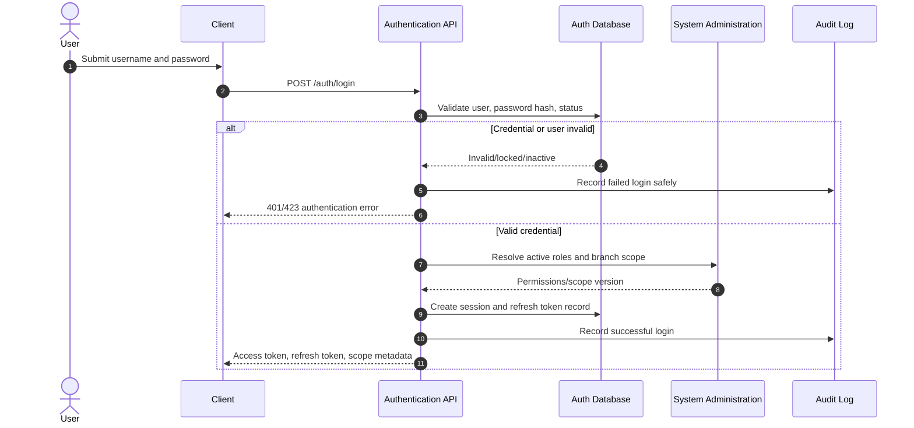

Authentication owns password/session/token mechanics. System provides user administration/RBAC configuration; it does not return password hash or raw secret information.

## 2.2 Protected Domain Command

```mermaid
sequenceDiagram
    autonumber
    actor Actor
    participant Client
    participant API
    participant Auth as Auth Middleware
    participant Policy as Domain Policy
    participant Module as Owning Module
    participant DB as Module Database
    participant Audit

    Actor->>Client: Perform protected action
    Client->>API: Command + JWT + Idempotency-Key
    API->>Auth: Validate token/session/user status
    Auth->>Policy: Evaluate permission, branch, ownership
    alt Unauthorized or branch mismatch
        Policy-->>API: Deny
        API-->>Client: 403 without domain mutation
    else Authorised
        API->>Module: Execute command
        Module->>DB: Validate lifecycle/idempotency and persist state
        Module->>Audit: Persist required audit in transaction
        DB-->>Module: Commit
        Module-->>API: Result
        API-->>Client: Success response
    end
```

---

# 3. Registrasi Pasien dan Reservasi

## 3.1 Register or Find Patient

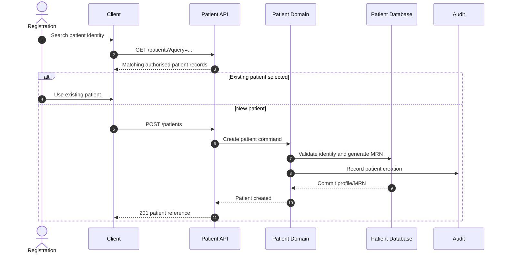

## 3.2 Create Reservation

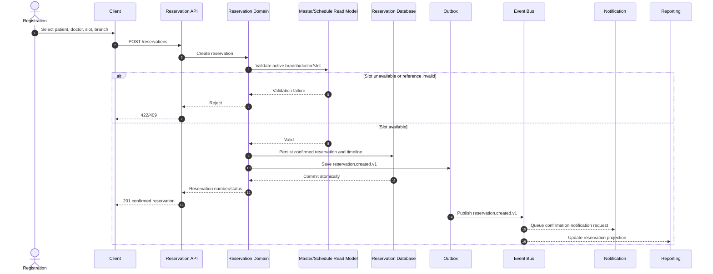

Notification failure is isolated from reservation success and handled by its own retry workflow.

---

# 4. Check-In dan Pembentukan Antrean

## 4.1 Check-In Success and Idempotent Queue Generation

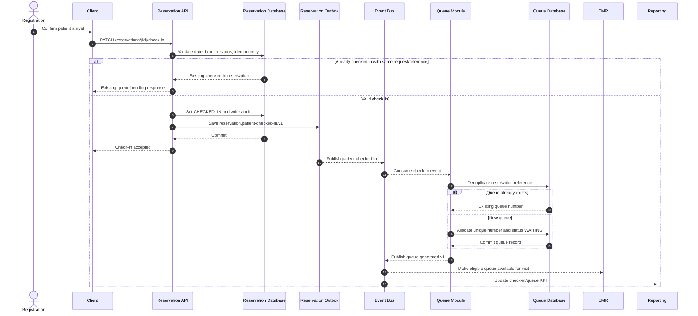

## 4.2 Call Patient and Open Visit

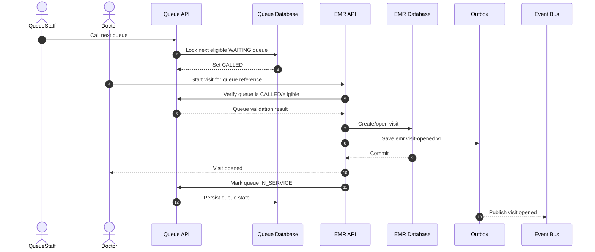

---

# 5. EMR, Treatment, dan Konsumsi Material

## 5.1 Finalise Treatment and Consume Stock

```mermaid
sequenceDiagram
    autonumber
    actor Doctor
    participant Client
    participant EMRAPI as EMR API
    participant EMRDB as EMR Database
    participant EMROutbox as EMR Outbox
    participant Bus as Event Bus
    participant Warehouse
    participant WHDB as Warehouse Database
    participant WHOutbox as Warehouse Outbox
    participant Reporting
    participant Finance

    Doctor->>Client: Finalise treatment with material usage
    Client->>EMRAPI: POST treatment/{id}/finalise
    EMRAPI->>EMRDB: Validate visit, clinical state, material request
    EMRAPI->>EMROutbox: Save emr.treatment-material-finalized.v1
    EMRDB-->>EMRAPI: Commit treatment finalisation
    EMRAPI-->>Client: Treatment finalised
    EMROutbox-->>Bus: Publish treatment material event
    Bus-->>Warehouse: Consume material
    Warehouse->>WHDB: Deduplicate event; lock stock/batch rows
    alt Stock/batch valid and sufficient
        Warehouse->>WHDB: FEFO allocation and TREATMENT stock-out
        Warehouse->>WHOutbox: Save warehouse.material-consumed.v1
        WHDB-->>Warehouse: Commit stock ledger/balance
        WHOutbox-->>Bus: Publish material consumed
        Bus-->>Reporting: Update inventory projection
        Bus-->>Finance: Optional COGS/inventory posting source event
    else Insufficient, expired, or invalid batch
        WHDB-->>Warehouse: Reject with reason
        Warehouse-->>Bus: Publish warehouse.material-consumption-failed.v1
        Bus-->>EMRAPI: Record/display integration exception reference
        Bus-->>Reporting: Update exception metric
    end
```

EMR never changes stock balance itself. Warehouse failure does not silently create negative stock; resolution is through authorised clinical/warehouse workflow.

## 5.2 Reverse Material Consumption

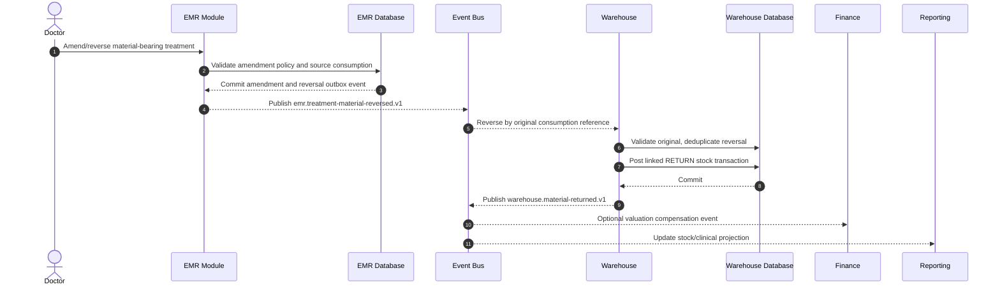

---

# 6. Penyelesaian Visit dan Pembentukan Invoice

## 6.1 Complete Visit and Generate Invoice

```mermaid
sequenceDiagram
    autonumber
    actor Doctor
    actor Cashier
    participant EMRAPI as EMR API
    participant EMRDB as EMR Database
    participant EMROutbox as EMR Outbox
    participant Bus as Event Bus
    participant Billing
    participant BillingDB as Billing Database
    participant Reporting

    Doctor->>EMRAPI: Complete visit
    EMRAPI->>EMRDB: Validate required clinical data and completion guards
    alt Visit not eligible
        EMRDB-->>EMRAPI: Validation errors
        EMRAPI-->>Doctor: Reject completion
    else Visit eligible
        EMRAPI->>EMRDB: Set visit completed; record audit
        EMRAPI->>EMROutbox: Save emr.visit.completed.v1
        EMRDB-->>EMRAPI: Commit
        EMROutbox-->>Bus: Publish visit completed
        Bus-->>Billing: Generate invoice from eligible visit
        Billing->>BillingDB: Deduplicate visit invoice reference
        alt Invoice already exists
            BillingDB-->>Billing: Return existing invoice
        else New invoice
            Billing->>BillingDB: Snapshot charges and create DRAFT invoice/items
            BillingDB-->>Billing: Commit invoice
        end
        Billing-->>Bus: Publish billing.invoice.created.v1
        Bus-->>Reporting: Update invoice worklist/KPI
        Cashier->>Billing: Open invoice for review/payment
    end
```

## 6.2 Invoice Review and Discount Approval

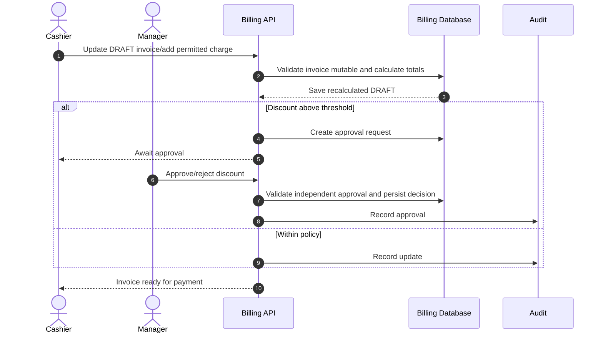

---

# 7. Pembayaran, Posting Finance, dan Reporting

## 7.1 Receive Payment with Idempotency

```mermaid
sequenceDiagram
    autonumber
    actor Cashier
    participant Client
    participant BillingAPI as Billing API
    participant BillingDB as Billing Database
    participant BillingOutbox as Billing Outbox
    participant Bus as Event Bus
    participant Finance
    participant FinanceDB as Finance Database
    participant FinanceOutbox as Finance Outbox
    participant Reporting
    participant Notification

    Cashier->>Client: Submit payment/split allocation
    Client->>BillingAPI: POST /billing/payments + Idempotency-Key
    BillingAPI->>BillingDB: Validate invoice, branch, method, outstanding, key
    alt Duplicate Idempotency-Key
        BillingDB-->>BillingAPI: Original payment response
        BillingAPI-->>Client: Same response; no second payment
    else Valid payment
        BillingAPI->>BillingDB: Save payment/allocation; update invoice balance/status
        BillingAPI->>BillingOutbox: Save payment received and invoice paid events
        BillingDB-->>BillingAPI: Commit atomically
        BillingAPI-->>Client: Receipt/payment success
        BillingOutbox-->>Bus: Publish billing.payment.received.v1
        Bus-->>Finance: Consume payment event
        Finance->>FinanceDB: Validate event/mapping/period/idempotency
        alt Finance mapping and period valid
            Finance->>FinanceDB: Post balanced journal and cash movement
            Finance->>FinanceOutbox: Save finance.journal.posted.v1
            FinanceDB-->>Finance: Commit
            FinanceOutbox-->>Bus: Publish journal posted
            Bus-->>Reporting: Update financial read model
        else Finance configuration/period failure
            FinanceDB-->>Finance: No journal; record exception/dead-letter
            Note over Finance,Reporting: Billing payment remains valid; retry after resolution
        end
        Bus-->>Reporting: Update billing collection projection
        Bus-->>Notification: Queue receipt notification
    end
```

## 7.2 Invoice Close and Daily Cash Closing

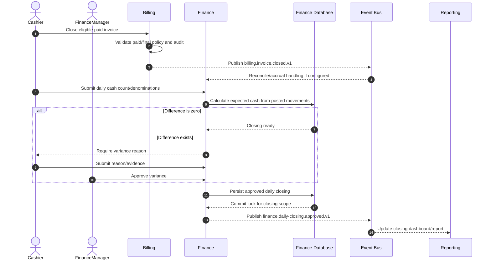

---

# 8. Refund dan Reversal Finance

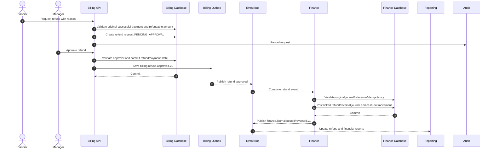

Original invoice/payment/journal remains historically intact. The linked refund and reversal explain the corrected financial position.

---

# 9. Warehouse Purchase dan Stock Opname

## 9.1 Purchase Order and Goods Receipt

```mermaid
sequenceDiagram
    autonumber
    actor WarehouseStaff
    actor WarehouseManager
    participant WarehouseAPI as Warehouse API
    participant WHDB as Warehouse Database
    participant Outbox
    participant Bus as Event Bus
    participant Finance
    participant Reporting

    WarehouseStaff->>WarehouseAPI: Create and submit purchase order
    WarehouseAPI->>WHDB: Validate supplier/item/branch and save SUBMITTED PO
    WarehouseManager->>WarehouseAPI: Approve purchase order
    WarehouseAPI->>WHDB: Set PO APPROVED; audit approval
    WarehouseStaff->>WarehouseAPI: Create/post goods receipt with batch/expiry
    WarehouseAPI->>WHDB: Validate PO, received quantity, batch, expiry
    alt Invalid/over receipt without approval
        WHDB-->>WarehouseAPI: Reject without stock change
        WarehouseAPI-->>WarehouseStaff: 422/409
    else Valid receipt
        WarehouseAPI->>WHDB: Post PURCHASE ledger, balance/batch, update PO received qty
        WarehouseAPI->>Outbox: Save warehouse.goods-receipt.posted.v1
        WHDB-->>WarehouseAPI: Commit atomically
        WarehouseAPI-->>WarehouseStaff: Receipt posted
        Outbox-->>Bus: Publish receipt event
        Bus-->>Finance: Post inventory/payable mapping if configured
        Bus-->>Reporting: Update purchase/stock projection
    end
```

## 9.2 Stock Opname

```mermaid
sequenceDiagram
    autonumber
    actor WarehouseStaff
    actor WarehouseManager
    participant WarehouseAPI as Warehouse API
    participant WHDB as Warehouse Database
    participant Outbox
    participant Bus as Event Bus
    participant Finance
    participant Reporting

    WarehouseStaff->>WarehouseAPI: Open stock opname for warehouse/date
    WarehouseAPI->>WHDB: Capture immutable system quantity snapshot
    WarehouseStaff->>WarehouseAPI: Submit physical counts and evidence
    WarehouseAPI->>WHDB: Compute variance; set SUBMITTED
    WarehouseManager->>WarehouseAPI: Approve variance/opname
    WarehouseAPI->>WHDB: Validate independent approval
    WarehouseAPI->>WHDB: Create one OPNAME stock transaction per variance
    WarehouseAPI->>Outbox: Save warehouse.stock-opname-approved.v1
    WHDB-->>WarehouseAPI: Commit and lock opname
    Outbox-->>Bus: Publish opname event
    Bus-->>Finance: Post adjustment journal if configured
    Bus-->>Reporting: Update variance/stock report
```

---

# 10. HR Payroll dan Posting Finance

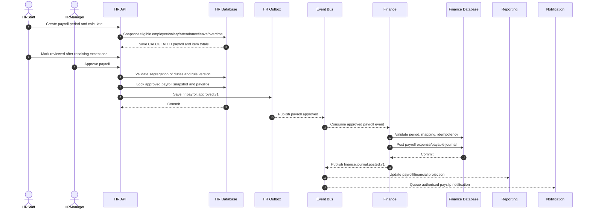

If Finance is temporarily unavailable, HR payroll remains locked/approved and the event is retried. It is never re-approved merely to regenerate an event.

---

# 11. Reporting Report Job dan Export

## 11.1 Dashboard Projection

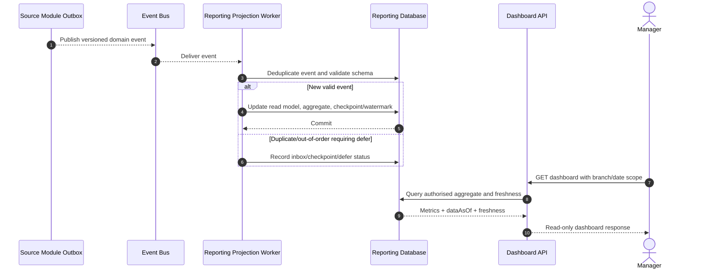

## 11.2 Asynchronous Report Export

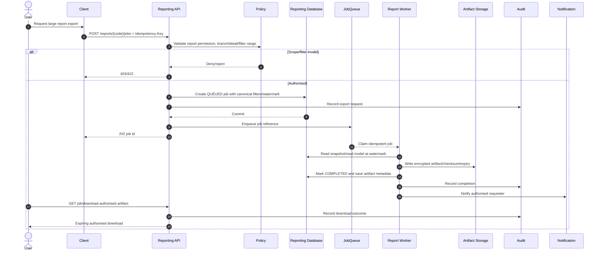

---

# 12. System Configuration dan Access Change

## 12.1 High-Risk Configuration Change

```mermaid
sequenceDiagram
    autonumber
    actor Admin
    actor Approver
    participant SystemAPI as System API
    participant Validator as Schema/Module Validator
    participant SysDB as System Database
    participant Outbox
    participant Bus as Event Bus
    participant Consumer as Config Consumer/Cache
    participant Audit

    Admin->>SystemAPI: Propose typed parameter/flag change
    SystemAPI->>Validator: Validate schema, scope, semantic rule
    alt Invalid or raw secret supplied
        Validator-->>SystemAPI: Reject
        SystemAPI-->>Admin: 422; no active change
    else Valid high-risk change
        SystemAPI->>SysDB: Save pending version/change request
        SystemAPI->>Audit: Record proposal
        Approver->>SystemAPI: Approve independently
        SystemAPI->>SysDB: Activate effective version
        SystemAPI->>Outbox: Save system.configuration.changed.v1
        SysDB-->>SystemAPI: Commit
        Outbox-->>Bus: Publish config changed
        Bus-->>Consumer: Invalidate/reload versioned config cache
        Consumer-->>Bus: Optional consumer acknowledgement
    end
```

## 12.2 User Role/Branch Access Change

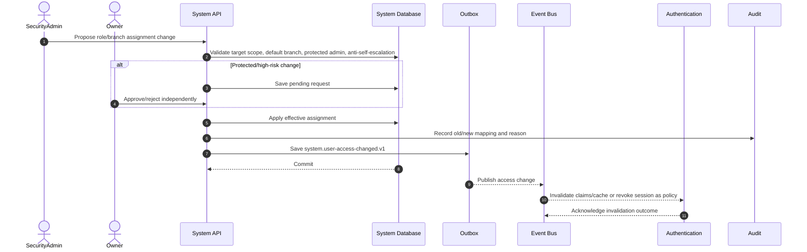

---

# 13. Reliability, Idempotency, dan Exception Flow

## 13.1 Consumer Retry and Dead-Letter

```mermaid
sequenceDiagram
    autonumber
    participant Outbox
    participant Bus as Event Bus
    participant Consumer
    participant Inbox as Consumer Inbox/DB
    participant DLQ as Dead Letter Queue
    participant Ops as Operations User

    Outbox-->>Bus: Deliver eventId/reference
    Bus-->>Consumer: Event delivery
    Consumer->>Inbox: Check eventId and business idempotency key
    alt Already processed
        Inbox-->>Consumer: Existing result
        Consumer-->>Bus: Acknowledge without side effect
    else Transient failure
        Consumer-->>Bus: Retryable failure
        Bus-->>Consumer: Retry with same eventId
    else Permanent validation/configuration failure
        Consumer->>Inbox: Persist failure safely; no partial domain mutation
        Consumer-->>DLQ: Send event with failure classification
        DLQ-->>Ops: Alert/worklist reference
        Ops->>Consumer: Correct configuration and authorise replay
    else Successful processing
        Consumer->>Inbox: Commit consumed event and local state/outbox
        Consumer-->>Bus: Acknowledge
    end
```

## 13.2 Compensation Rather Than Mutation

```mermaid
sequenceDiagram
    autonumber
    actor AuthorisedUser
    participant Owner as Owning Module
    participant SourceDB as Source Transaction DB
    participant Outbox
    participant Bus as Event Bus
    participant Consumer as Downstream Owner
    participant Audit

    AuthorisedUser->>Owner: Request correction with reason/approval
    Owner->>SourceDB: Validate original final transaction and policy
    Owner->>SourceDB: Create linked refund/return/reversal/adjustment
    Owner->>Audit: Record compensation relationship
    Owner->>Outbox: Save compensation event
    SourceDB-->>Owner: Commit; original remains immutable
    Outbox-->>Bus: Publish compensation event
    Bus-->>Consumer: Create linked compensating record
    Consumer-->>Bus: Publish downstream result for reporting
```

## 13.3 Sequence Verification Checklist

- Every participant mutates only data it owns.
- Every money, stock, payroll, and closing command has validation plus idempotency.
- Transactional outbox is written before source success is returned when handoff is required.
- Consumer validates source reference, branch, state, and event/schema version.
- Retry/duplicate path produces no second payment, journal, queue, stock movement, payroll posting, notification, or export.
- Sensitive actions write audit record and do not expose secrets/PHI/PII unnecessarily.
- Reporting is downstream/read-only and shows freshness/watermark rather than blocking transaction completion.

---

# Summary

Sequence diagrams ini menunjukkan bagaimana Parakita mempertahankan batas antar bounded context sambil menjalankan proses end-to-end. Semua interaksi penting menggunakan owner-local transaction, outbox/inbox idempotency, branch-aware authorization, audit, and compensation chain. Dengan demikian, kegagalan downstream dapat dipulihkan tanpa mengorbankan integritas pasien, klinis, stok, pembayaran, jurnal, payroll, atau laporan.
