# Parakita Software Architecture Document (SAD)

# 24 - Deployment

| Document Information | |
|----------------------|----------------------------------------------|
| Project | Parakita - Dental Clinic Management System |
| Document | 24 - Deployment |
| Part | 1 of 12 |
| Version | 1.0.0 |
| Status | Draft |
| Document Type | Deployment Architecture Specification |
| Architecture Style | Clean Architecture + Domain Driven Design + Modular Monolith |
| Frontend | Next.js + TypeScript |
| Backend | Express.js + TypeScript |
| Database | MySQL |
| Container Platform | Docker + Kubernetes |
| CI/CD | GitHub Actions |
| Last Updated | July 2026 |

---

# Table of Contents (Part 1)

1. Introduction
2. Purpose
3. Scope
4. Deployment Principles
5. Deployment Objectives
6. Deployment Environments
7. Deployment Architecture Overview
8. Infrastructure Components
9. Runtime Architecture
10. Network Topology Overview
11. High Availability & Disaster Recovery Overview
12. Summary

---

# 1. Introduction

## 1.1 Overview

Deployment Architecture mendefinisikan bagaimana seluruh komponen Parakita dipasang, dijalankan, diamankan, dimonitor, dan dipelihara pada berbagai environment mulai dari Development hingga Production.

Dokumen ini menjadi acuan implementasi infrastruktur yang memastikan aplikasi dapat berjalan secara:

- Reliable
- Secure
- Scalable
- Maintainable
- Observable
- Highly Available

Deployment tidak hanya mencakup server aplikasi, tetapi juga seluruh komponen pendukung seperti database, cache, object storage, reverse proxy, monitoring, logging, backup, dan pipeline CI/CD.

---

## 1.2 Background

Sebagai Dental Clinic Management System yang digunakan oleh banyak cabang, Parakita harus mampu menyediakan layanan yang stabil dengan downtime seminimal mungkin.

Karakteristik operasional yang harus didukung antara lain:

- Operasional klinik setiap hari.
- Multi Branch.
- Ribuan transaksi per hari.
- Data medis yang bersifat kritikal.
- Audit Trail permanen.
- Kemudahan deployment versi baru.
- Rollback yang cepat apabila terjadi kegagalan.

Deployment Architecture dirancang agar memenuhi kebutuhan tersebut menggunakan pendekatan modern berbasis container dan otomatisasi.

---

## 1.3 Deployment Philosophy

Deployment Parakita mengikuti prinsip berikut.

- Infrastructure as Code
- Immutable Deployment
- Container First
- Automation by Default
- Zero Manual Configuration
- Secure by Default
- Observability First
- High Availability Ready
- Disaster Recovery Ready
- Cloud Native Friendly

---

# 2. Purpose

Dokumen ini menjelaskan arsitektur deployment Parakita mulai dari lingkungan pengembangan hingga produksi.

Dokumen ini digunakan oleh:

- Solution Architect
- DevOps Engineer
- Backend Developer
- Frontend Developer
- Infrastructure Engineer
- QA Engineer
- Security Engineer
- System Administrator

Dokumen ini menjadi acuan implementasi deployment yang konsisten pada seluruh environment.

---

# 3. Scope

## 3.1 In Scope

Deployment mencakup seluruh komponen berikut.

### Infrastructure

- Virtual Machine
- Kubernetes Cluster
- Docker
- Load Balancer
- Reverse Proxy
- Storage
- DNS
- SSL

### Application

- Frontend
- Backend API
- Background Worker
- Scheduled Jobs

### Database

- MySQL
- Backup
- Replication
- Migration

### Supporting Services

- Redis
- Object Storage
- SMTP
- Monitoring
- Logging
- Alerting

### Operations

- CI/CD
- Rollback
- Versioning
- Deployment Approval
- Health Check

---

## 3.2 Out of Scope

Dokumen ini tidak membahas secara rinci mengenai:

- Business Logic
- API Specification
- Database Schema
- Domain Model
- User Interface
- Module Design

Topik tersebut dijelaskan pada dokumen SAD lainnya.

---

# 4. Deployment Principles

Deployment Parakita mengikuti prinsip berikut.

## Infrastructure as Code

Seluruh infrastruktur harus dapat direproduksi melalui konfigurasi yang terdokumentasi.

---

## Immutable Deployment

Container yang telah dibangun tidak diubah secara langsung di server produksi.

Perubahan hanya dilakukan melalui proses build dan deployment baru.

---

## Automation First

Deployment dilakukan menggunakan pipeline otomatis untuk mengurangi human error.

---

## Environment Consistency

Development, Staging, dan Production memiliki konfigurasi yang konsisten dengan perbedaan hanya pada parameter environment.

---

## Secure by Default

Seluruh komunikasi antar layanan menggunakan koneksi yang aman dan kredensial disimpan melalui mekanisme secret management.

---

## Observability

Setiap layanan wajib menyediakan:

- Health Check
- Metrics
- Structured Logging
- Audit Trail

---

# 5. Deployment Objectives

Deployment Architecture dikembangkan untuk mencapai tujuan berikut.

## 5.1 High Availability

Layanan tetap tersedia walaupun terjadi kegagalan pada salah satu instance aplikasi.

---

## 5.2 Scalability

Aplikasi dapat ditingkatkan kapasitasnya secara horizontal tanpa perubahan kode.

---

## 5.3 Reliability

Deployment harus meminimalkan downtime serta mendukung rollback dengan cepat.

---

## 5.4 Security

Seluruh komponen deployment mengikuti standar keamanan yang konsisten.

---

## 5.5 Maintainability

Proses deployment mudah dipelihara, terdokumentasi, dan dapat diotomatisasi.

---

# 6. Deployment Environments

Parakita menggunakan beberapa environment yang terpisah.

| Environment | Purpose |
|-------------|--------------------------------|
| Local Development | Pengembangan oleh developer |
| Development | Integrasi awal fitur |
| QA | Pengujian fungsional |
| Staging | Simulasi Production |
| Production | Operasional klinik |

---

## Environment Flow

```text
Developer

↓

Local

↓

Development

↓

QA

↓

Staging

↓

Production
```

Setiap environment memiliki database, konfigurasi, dan secret yang terpisah.

---

# 7. Deployment Architecture Overview

Deployment Architecture terdiri atas beberapa lapisan.

```text
Internet

↓

DNS

↓

Load Balancer

↓

Reverse Proxy

↓

Frontend (Next.js)

↓

Backend API (Express.js)

↓

Redis

↓

MySQL

↓

Object Storage

↓

Backup & Monitoring
```

Setiap komponen memiliki tanggung jawab yang terpisah untuk meningkatkan skalabilitas dan kemudahan pemeliharaan.

---

# 8. Infrastructure Components

Komponen utama deployment meliputi:

| Component | Responsibility |
|-----------|----------------|
| DNS | Resolusi domain |
| Load Balancer | Distribusi trafik |
| Reverse Proxy | Routing dan SSL Termination |
| Frontend | Antarmuka pengguna |
| Backend API | Business Logic |
| Redis | Cache dan Queue |
| MySQL | Database utama |
| Object Storage | Penyimpanan dokumen |
| Monitoring | Pemantauan sistem |
| Logging | Pengumpulan log |
| Backup Service | Cadangan data |

---

# 9. Runtime Architecture

Saat sistem berjalan, aliran permintaan diproses sebagai berikut.

```text
User

↓

HTTPS Request

↓

Load Balancer

↓

Reverse Proxy

↓

Frontend (Next.js)

↓

REST API

↓

Application Service

↓

Domain Layer

↓

Repository

↓

MySQL

↓

Response
```

Untuk proses asynchronous, Backend dapat menerbitkan Domain Event yang diproses oleh Background Worker tanpa mengganggu alur permintaan utama.

---

# 10. Network Topology Overview

Topologi jaringan dibagi menjadi beberapa lapisan.

```text
Internet

↓

Public Network

↓

Load Balancer

↓

Private Application Network

├── Frontend

├── Backend API

├── Worker

↓

Private Data Network

├── MySQL

├── Redis

├── Object Storage

↓

Backup Network
```

Komponen data berada pada jaringan privat dan tidak dapat diakses langsung dari internet.

---

# 11. High Availability & Disaster Recovery Overview

Deployment dirancang agar siap mendukung ketersediaan tinggi dan pemulihan bencana.

## High Availability

- Multiple Application Instance
- Load Balancer
- Stateless Application
- Health Check
- Automatic Restart
- Rolling Deployment

---

## Disaster Recovery

- Scheduled Database Backup
- Backup Verification
- Restore Procedure
- Recovery Environment
- Disaster Recovery Testing
- Documented Recovery Plan

Detail implementasi akan dijelaskan pada bagian khusus mengenai Backup & Disaster Recovery.

---

# 12. Summary

Deployment Architecture Parakita menyediakan fondasi operasional yang aman, andal, dan mudah dikembangkan. Dengan pendekatan **Container First**, **Infrastructure as Code**, **Automation**, **High Availability**, dan **Observability**, sistem dapat dijalankan secara konsisten pada seluruh environment mulai dari Development hingga Production. Dokumen ini menjadi dasar bagi implementasi infrastruktur, CI/CD, monitoring, keamanan, serta strategi backup dan disaster recovery yang akan dibahas pada bagian-bagian berikutnya.

---

**End of Part 1**

**Next Document**

**Part 2 — Infrastructure Architecture (Cloud Architecture, Environment Design, Server Specification, Load Balancer, Reverse Proxy, Object Storage, CDN, DNS, Infrastructure Diagram)**

# Parakita Software Architecture Document (SAD)

# 24 - Deployment

| Document Information | |
|----------------------|----------------------------------------------|
| Project | Parakita - Dental Clinic Management System |
| Document | 24 - Deployment |
| Part | 2 of 12 |
| Version | 1.0.0 |
| Status | Draft |
| Document Type | Deployment Architecture Specification |
| Architecture Style | Clean Architecture + Domain Driven Design + Modular Monolith |
| Frontend | Next.js + TypeScript |
| Backend | Express.js + TypeScript |
| Database | MySQL |
| Container Platform | Docker + Kubernetes |
| CI/CD | GitHub Actions |
| Last Updated | July 2026 |

---

# Table of Contents (Part 2)

1. Infrastructure Architecture Overview
2. Cloud Architecture
3. Environment Architecture
4. Server Specification
5. Load Balancer Architecture
6. Reverse Proxy Architecture
7. Object Storage Architecture
8. DNS & Domain Architecture
9. Infrastructure Diagram
10. Network Segmentation
11. Capacity Planning
12. Summary

---

# 1. Infrastructure Architecture Overview

Infrastructure Parakita dirancang menggunakan pendekatan **Cloud Native Ready** dengan pemisahan yang jelas antara komponen aplikasi, database, jaringan, dan layanan pendukung.

Karakteristik utama:

- Multi Environment
- Container Based Deployment
- Horizontal Scalability
- High Availability Ready
- Secure Network
- Automated Provisioning
- Infrastructure as Code
- Centralized Monitoring

---

## Infrastructure Layers

```text
Internet

↓

DNS

↓

Load Balancer

↓

Reverse Proxy

↓

Application Layer

↓

Data Layer

↓

Infrastructure Services
```

---

## Design Goals

- Mudah dikembangkan
- Mudah di-scale
- Aman
- Minim downtime
- Mendukung multi cabang
- Mendukung pertumbuhan jumlah pengguna

---

# 2. Cloud Architecture

Deployment dapat dijalankan pada cloud provider maupun on-premise infrastructure.

## Supported Platform

| Platform | Support |
|----------|----------|
| Kubernetes Cluster | ✔ |
| Docker Swarm | ✔ |
| Virtual Machine | ✔ |
| Bare Metal | ✔ |
| Hybrid Cloud | ✔ |

---

## Logical Cloud Architecture

```text
Internet

↓

Cloud DNS

↓

Cloud Load Balancer

↓

Ingress Controller

↓

Application Cluster

↓

Database Cluster

↓

Storage Services

↓

Monitoring Stack
```

---

## Cloud Components

| Component | Responsibility |
|------------|----------------|
| DNS | Domain Resolution |
| Load Balancer | Traffic Distribution |
| Kubernetes | Container Orchestration |
| Object Storage | Document Storage |
| Block Storage | Persistent Volume |
| Monitoring | Metrics |
| Logging | Centralized Logs |

---

# 3. Environment Architecture

Parakita menggunakan beberapa environment yang terisolasi.

## Environment Matrix

| Environment | Purpose |
|-------------|---------------------------|
| Local | Development |
| Development | Internal Integration |
| QA | Functional Testing |
| Staging | Production Simulation |
| Production | Live Operation |

---

## Environment Isolation

Setiap environment memiliki:

- Database sendiri
- Redis sendiri
- Storage sendiri
- Secret sendiri
- Domain sendiri
- Monitoring sendiri

Tidak ada data Production yang digunakan pada environment lain.

---

## Environment URL

| Environment | Example URL |
|-------------|-------------------------------|
| Development | dev.parakita.local |
| QA | qa.parakita.local |
| Staging | staging.parakita.local |
| Production | app.parakita.com |

---

# 4. Server Specification

## Application Server

| Resource | Recommended |
|-----------|-------------|
| CPU | 4 vCPU |
| Memory | 8 GB |
| Storage | 100 GB SSD |
| OS | Ubuntu LTS |

---

## Database Server

| Resource | Recommended |
|-----------|-------------|
| CPU | 8 vCPU |
| Memory | 16 GB |
| Storage | NVMe SSD |
| Backup Disk | Dedicated Volume |

---

## Redis Server

| Resource | Recommended |
|-----------|-------------|
| CPU | 2 vCPU |
| Memory | 4 GB |
| Storage | SSD |

---

## Monitoring Server

| Resource | Recommended |
|-----------|-------------|
| CPU | 4 vCPU |
| Memory | 8 GB |
| Storage | 200 GB |

---

## Minimum Production Topology

| Component | Instance |
|-----------|----------|
| Load Balancer | 2 |
| Reverse Proxy | 2 |
| Backend API | 2+ |
| Frontend | 2+ |
| Redis | 1 |
| MySQL Primary | 1 |
| MySQL Replica | 1 |

---

# 5. Load Balancer Architecture

Load Balancer menjadi pintu masuk seluruh trafik HTTPS.

## Responsibilities

- SSL Termination
- Health Check
- Traffic Distribution
- Failover
- Sticky Session (optional)
- Rate Limiting

---

## Request Flow

```text
Internet

↓

Load Balancer

↓

Healthy Backend

↓

Application Response
```

---

## Health Check

Load Balancer melakukan pemeriksaan berkala terhadap endpoint:

```http
GET /health
```

Jika instance gagal merespons, trafik akan dialihkan ke instance lain yang sehat.

---

# 6. Reverse Proxy Architecture

Reverse Proxy berada di depan seluruh layanan aplikasi.

## Responsibilities

- HTTPS Termination
- Static File Serving
- API Routing
- Compression
- Cache Header
- Security Header

---

## Request Routing

```text
HTTPS

↓

Reverse Proxy

├── Frontend

└── Backend API
```

---

## Security Headers

Reverse Proxy menerapkan header berikut.

- HSTS
- X-Frame-Options
- X-Content-Type-Options
- Referrer-Policy
- Content-Security-Policy

---

# 7. Object Storage Architecture

Object Storage digunakan untuk menyimpan seluruh dokumen yang diunggah pengguna.

## Stored Objects

- Patient Documents
- X-Ray Images
- Consent Form
- Invoice PDF
- Medical Attachments
- Export Reports

---

## Storage Characteristics

| Feature | Value |
|----------|-------|
| Versioning | Enabled |
| Encryption | Enabled |
| Backup | Enabled |
| Lifecycle Policy | Enabled |

---

## Upload Flow

```text
Frontend

↓

Backend API

↓

Object Storage

↓

Metadata Database
```

Metadata file disimpan di database, sedangkan isi file disimpan pada Object Storage.

---

# 8. DNS & Domain Architecture

Seluruh layanan diakses menggunakan domain yang terpisah sesuai fungsi.

## Domain Structure

| Service | Example |
|----------|------------------------|
| Frontend | app.parakita.com |
| API | api.parakita.com |
| Admin | admin.parakita.com |
| Monitoring | monitor.parakita.com |

---

## DNS Resolution

```text
User

↓

DNS

↓

Load Balancer

↓

Reverse Proxy

↓

Application
```

---

## SSL Certificate

Seluruh domain menggunakan:

- HTTPS Only
- TLS 1.2+
- Automatic Renewal
- Strong Cipher Suite

---

# 9. Infrastructure Diagram

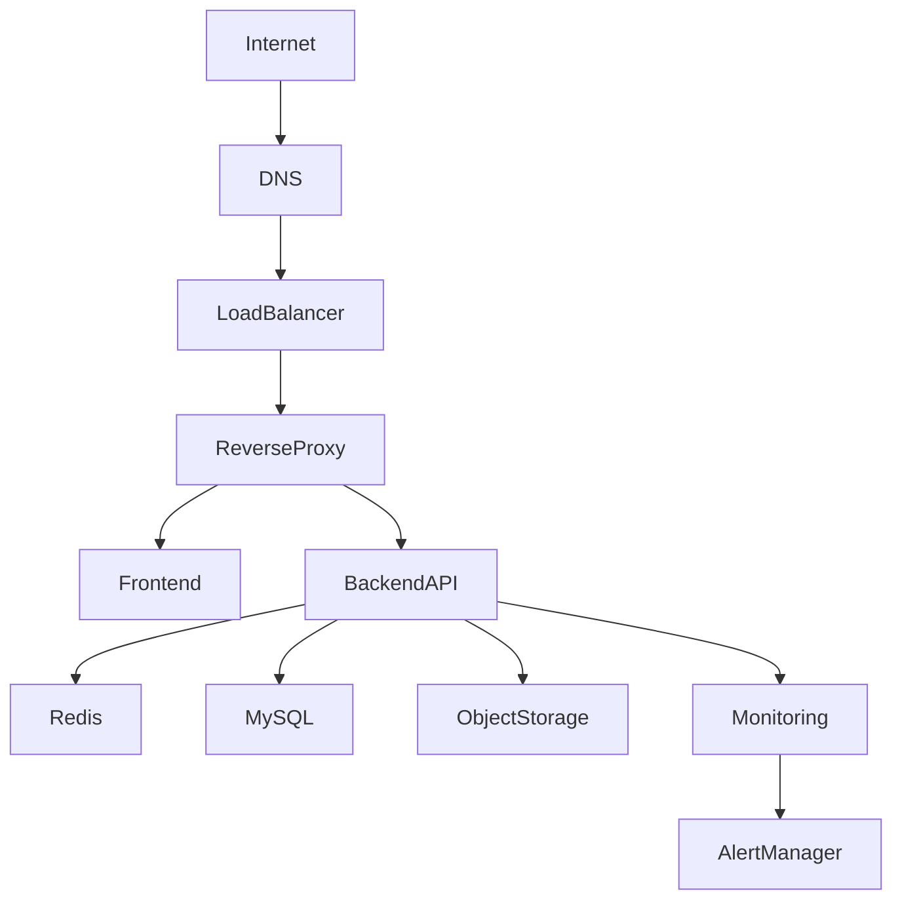

---

# 10. Network Segmentation

Infrastructure dipisahkan menjadi beberapa zona jaringan.

```text
Public Network

↓

DMZ

↓

Application Network

↓

Database Network

↓

Backup Network
```

---

## Access Policy

| Network | Accessible From |
|----------|-----------------|
| Public | Internet |
| DMZ | Public |
| Application | Internal Only |
| Database | Application Only |
| Backup | Administrator Only |

---

## Firewall Rules

- Database hanya menerima koneksi dari Backend.
- Redis hanya menerima koneksi dari Backend.
- Monitoring hanya menerima koneksi internal.
- SSH hanya dapat diakses melalui VPN atau Bastion Host.

---

# 11. Capacity Planning

Infrastructure dirancang untuk berkembang secara bertahap.

## Initial Deployment

| Component | Instance |
|-----------|----------|
| Frontend | 2 |
| Backend API | 2 |
| Redis | 1 |
| MySQL | 1 Primary + 1 Replica |
| Monitoring | 1 |

---

## Horizontal Scaling

Komponen berikut dapat ditambah tanpa perubahan aplikasi.

- Frontend
- Backend API
- Background Worker
- Reverse Proxy

---

## Vertical Scaling

Komponen berikut dapat ditingkatkan kapasitasnya sesuai kebutuhan.

- MySQL
- Redis
- Object Storage
- Monitoring Server

---

## Future Expansion

Deployment telah dipersiapkan untuk mendukung:

- Multi Region
- Multi Availability Zone
- Kubernetes Auto Scaling
- Read Replica Database
- CDN Integration
- Disaster Recovery Site

---

# 12. Summary

Part 2 menjelaskan arsitektur infrastruktur Parakita yang terdiri atas **Cloud Architecture**, **Environment Architecture**, **Server Specification**, **Load Balancer**, **Reverse Proxy**, **Object Storage**, **DNS**, serta **Network Segmentation**. Infrastruktur dirancang mengikuti prinsip **Cloud Native Ready**, **Infrastructure as Code**, **High Availability**, dan **Horizontal Scalability**, sehingga mampu mendukung operasional klinik multi-cabang dengan tingkat ketersediaan tinggi, keamanan yang baik, serta kemudahan ekspansi di masa mendatang.

---

**End of Part 2**

**Next Document**

**Part 3 — Container Architecture (Docker Strategy, Docker Images, Docker Compose, Container Communication, Health Check, Resource Allocation, Scaling Strategy, Container Security, Startup Sequence, Deployment Pipeline)**

# Parakita Software Architecture Document (SAD)

# 24 - Deployment

| Document Information | |
|----------------------|----------------------------------------------|
| Project | Parakita - Dental Clinic Management System |
| Document | 24 - Deployment |
| Part | 3 of 12 |
| Version | 1.0.0 |
| Status | Draft |
| Document Type | Deployment Architecture Specification |
| Architecture Style | Clean Architecture + Domain Driven Design + Modular Monolith |
| Frontend | Next.js + TypeScript |
| Backend | Express.js + TypeScript |
| Database | MySQL |
| Container Platform | Docker + Kubernetes |
| Container Registry | GitHub Container Registry |
| Last Updated | July 2026 |

---

# Table of Contents (Part 3)

1. Container Architecture Overview
2. Docker Strategy
3. Container Images
4. Docker Compose Architecture
5. Container Communication
6. Health Check Strategy
7. Resource Allocation
8. Scaling Strategy
9. Container Security
10. Startup & Shutdown Sequence
11. Deployment Pipeline
12. Summary

---

# 1. Container Architecture Overview

Seluruh komponen aplikasi Parakita dijalankan menggunakan container agar deployment menjadi konsisten pada seluruh environment.

Keuntungan penggunaan container:

- Environment Consistency
- Fast Deployment
- Easy Rollback
- Isolation
- Scalability
- Portability
- Immutable Deployment

---

## Container Architecture

```text
                Docker Host

 ┌──────────────────────────────────────┐

     Reverse Proxy Container

               │

 ┌─────────────┴─────────────┐

 Frontend              Backend API

               │

      Background Worker

               │

     Redis      MySQL

 └──────────────────────────────────────┘
```

---

## Design Principles

Container mengikuti prinsip berikut.

- One Process per Container
- Immutable Image
- Stateless Application
- Externalized Configuration
- Independent Scaling
- Health Check by Default

---

# 2. Docker Strategy

Deployment menggunakan Docker sebagai runtime container.

---

## Docker Goals

- Reproducible Build
- Consistent Runtime
- Small Image Size
- Fast Startup
- Secure Base Image
- Multi-stage Build

---

## Container List

| Container | Purpose |
|------------|----------------------------|
| frontend | Next.js Application |
| backend | Express REST API |
| worker | Background Jobs |
| redis | Cache & Queue |
| mysql | Database |
| nginx | Reverse Proxy |

---

## Build Strategy

Setiap aplikasi memiliki Dockerfile masing-masing.

```
apps/

├── frontend/

│   └── Dockerfile

├── backend/

│   └── Dockerfile

└── worker/

    └── Dockerfile
```

---

## Multi-stage Build

Semua image menggunakan multi-stage build.

```text
Builder Stage

↓

Compile

↓

Install Production Dependencies

↓

Runtime Image
```

Keuntungan:

- Image lebih kecil
- Build lebih cepat
- Mengurangi attack surface

---

# 3. Container Images

Semua image menggunakan semantic versioning.

---

## Image Naming Convention

```
parakita/frontend:1.0.0

parakita/backend:1.0.0

parakita/worker:1.0.0
```

---

## Registry

Image disimpan pada Container Registry.

Contoh:

```
ghcr.io/parakita/frontend

ghcr.io/parakita/backend

ghcr.io/parakita/worker
```

---

## Versioning

| Tag | Description |
|------|-------------|
| latest | Latest Stable |
| develop | Development Build |
| staging | Staging Release |
| v1.0.0 | Production Release |

---

## Image Policy

Image yang sudah dipublikasikan tidak boleh dimodifikasi.

Perubahan dilakukan dengan membuat image baru.

---

# 4. Docker Compose Architecture

Docker Compose digunakan untuk environment lokal dan development.

---

## Service Overview

```yaml
services:

  frontend

  backend

  worker

  mysql

  redis

  nginx
```

---

## Communication Flow

```text
Frontend

↓

Backend API

↓

Redis

↓

MySQL
```

---

## Shared Network

Semua container berada pada network internal.

```
parakita-network
```

---

## Shared Volume

Volume digunakan untuk:

- MySQL Data
- Uploaded Files
- Logs

---

## Persistent Volume

| Volume | Purpose |
|----------|----------------|
| mysql-data | Database |
| uploads | User Documents |
| logs | Application Logs |

---

# 5. Container Communication

Komunikasi antar container menggunakan Docker Network.

---

## Internal Communication

```text
frontend

↓

backend

↓

redis

↓

mysql
```

---

## Communication Rules

- Frontend hanya mengakses Backend.
- Backend dapat mengakses Redis.
- Backend dapat mengakses MySQL.
- Worker dapat mengakses Redis dan MySQL.
- MySQL tidak dapat diakses langsung dari Frontend.

---

## Internal DNS

Container saling berkomunikasi menggunakan nama service.

Contoh:

```
http://backend:3000

redis:6379

mysql:3306
```

---

# 6. Health Check Strategy

Setiap container wajib menyediakan endpoint health check.

---

## Frontend

```http
GET /
```

---

## Backend

```http
GET /health
```

---

## Worker

Worker mengirim heartbeat secara berkala.

---

## Redis

Menggunakan perintah:

```
PING
```

---

## MySQL

Menggunakan:

```
mysqladmin ping
```

---

## Health Status

| Status | Description |
|----------|----------------|
| Healthy | Ready menerima request |
| Starting | Masih startup |
| Unhealthy | Perlu restart |

---

# 7. Resource Allocation

Setiap container memiliki batas resource.

---

## Frontend

| Resource | Value |
|----------|-------|
| CPU | 500m |
| Memory | 512 MB |

---

## Backend

| Resource | Value |
|----------|-------|
| CPU | 1000m |
| Memory | 1 GB |

---

## Worker

| Resource | Value |
|----------|-------|
| CPU | 500m |
| Memory | 512 MB |

---

## Redis

| Resource | Value |
|----------|-------|
| CPU | 500m |
| Memory | 1 GB |

---

## MySQL

| Resource | Value |
|----------|-------|
| CPU | 2 Core |
| Memory | 4 GB |

---

# 8. Scaling Strategy

Beberapa container bersifat stateless sehingga dapat diskalakan secara horizontal.

---

## Horizontal Scaling

Dapat ditambah menjadi beberapa instance.

- Frontend
- Backend API
- Worker
- Reverse Proxy

---

## Vertical Scaling

Dilakukan untuk:

- MySQL
- Redis

---

## Scaling Example

```text
Frontend

2 → 6 Instance

Backend

2 → 10 Instance

Worker

1 → 5 Instance
```

---

## Stateless Principle

Container aplikasi tidak menyimpan data lokal.

Seluruh data berada pada:

- Database
- Redis
- Object Storage

---

# 9. Container Security

Seluruh container mengikuti standar keamanan.

---

## Security Policy

- Non-root User
- Read-only Filesystem (bila memungkinkan)
- Minimal Base Image
- No Hardcoded Secret
- Image Scanning
- Signed Images

---

## Secret Management

Konfigurasi sensitif tidak disimpan di image.

Contoh:

- Database Password
- JWT Secret
- SMTP Password
- API Keys

Seluruh secret diberikan melalui environment variable atau Kubernetes Secret.

---

## Network Isolation

Container database tidak dapat diakses langsung dari jaringan publik.

---

## Image Scanning

Pipeline CI/CD melakukan pemeriksaan:

- Known CVE
- Vulnerable Package
- High Risk Dependency
- Outdated Library

---

# 10. Startup & Shutdown Sequence

Container memiliki urutan startup agar dependensi tersedia sebelum aplikasi berjalan.

---

## Startup Flow

```text
Network

↓

MySQL

↓

Redis

↓

Backend API

↓

Worker

↓

Frontend

↓

Reverse Proxy
```

---

## Shutdown Flow

```text
Reverse Proxy

↓

Frontend

↓

Worker

↓

Backend

↓

Redis

↓

MySQL
```

---

## Graceful Shutdown

Backend menerima sinyal penghentian dan:

- Menolak request baru.
- Menyelesaikan request aktif.
- Menutup koneksi database.
- Menutup koneksi Redis.
- Keluar secara aman.

---

# 11. Deployment Pipeline

Container image dibangun secara otomatis melalui pipeline CI/CD.

---

## Pipeline Flow

```text
Developer Push

↓

GitHub

↓

Build Image

↓

Run Unit Test

↓

Security Scan

↓

Push Image

↓

Deploy

↓

Health Check

↓

Completed
```

---

## Image Lifecycle

```text
Source Code

↓

Build

↓

Test

↓

Scan

↓

Registry

↓

Deployment

↓

Monitoring
```

---

## Rollback

Apabila deployment gagal:

- Deployment dihentikan.
- Image sebelumnya dijalankan kembali.
- Health Check divalidasi ulang.
- Insiden dicatat pada deployment log.

---

# 12. Summary

Part 3 menjelaskan arsitektur container Parakita menggunakan **Docker** sebagai standar runtime aplikasi. Dokumen ini mencakup strategi penggunaan Docker, struktur image, komunikasi antar container, Docker Compose untuk lingkungan pengembangan, health check, alokasi resource, strategi scaling, keamanan container, urutan startup, serta pipeline deployment. Dengan pendekatan **Immutable Container**, **Stateless Application**, dan **Container First**, Parakita siap dijalankan secara konsisten pada lingkungan Development, Staging, maupun Production serta menjadi fondasi implementasi Kubernetes pada bagian berikutnya.

---

**End of Part 3**

**Next Document**

**Part 4 — Kubernetes Architecture (Namespace Strategy, Deployment, StatefulSet, Service, Ingress, ConfigMap, Secret, Persistent Volume, HPA, Helm, Kubernetes Deployment Diagram)**

# Parakita Software Architecture Document (SAD)

# 24 - Deployment

| Document Information | |
|----------------------|----------------------------------------------|
| Project | Parakita - Dental Clinic Management System |
| Document | 24 - Deployment |
| Part | 4 of 12 |
| Version | 1.0.0 |
| Status | Draft |
| Document Type | Deployment Architecture Specification |
| Architecture Style | Clean Architecture + Domain Driven Design + Modular Monolith |
| Container Platform | Kubernetes |
| Package Manager | Helm |
| Container Runtime | Docker |
| Last Updated | July 2026 |

---

# Table of Contents (Part 4)

1. Kubernetes Architecture Overview
2. Namespace Strategy
3. Workload Architecture
4. Service Architecture
5. Ingress Architecture
6. Configuration Management
7. Persistent Storage
8. Auto Scaling Strategy
9. Helm Deployment
10. Kubernetes Security
11. Kubernetes Deployment Diagram
12. Summary

---

# 1. Kubernetes Architecture Overview

Production deployment Parakita menggunakan Kubernetes sebagai platform orkestrasi container.

Kubernetes bertanggung jawab terhadap:

- Container Scheduling
- Self Healing
- Auto Scaling
- Rolling Deployment
- Secret Management
- Service Discovery
- High Availability

---

## Kubernetes Objectives

- Zero Downtime Deployment
- Automatic Recovery
- High Availability
- Resource Isolation
- Automated Scaling
- Declarative Infrastructure

---

## High Level Architecture

```text
Internet

↓

Load Balancer

↓

Ingress Controller

↓

Kubernetes Cluster

├── Frontend Pods

├── Backend Pods

├── Worker Pods

├── Redis

└── MySQL

↓

Persistent Storage
```

---

## Cluster Characteristics

| Component | Value |
|-----------|-------|
| Control Plane | Managed |
| Worker Node | Multiple |
| Container Runtime | Docker Compatible |
| Scheduler | Kubernetes |
| Service Discovery | Internal DNS |
| Secret Management | Kubernetes Secret |

---

# 2. Namespace Strategy

Deployment dipisahkan menggunakan Namespace agar setiap environment terisolasi.

---

## Namespace Structure

| Namespace | Purpose |
|-----------|------------------------|
| development | Internal Development |
| qa | QA Environment |
| staging | Pre Production |
| production | Production |
| monitoring | Monitoring Stack |
| ingress | Ingress Controller |

---

## Namespace Diagram

```text
Cluster

├── development

├── qa

├── staging

├── production

├── monitoring

└── ingress
```

---

## Benefits

- Resource Isolation
- Independent Deployment
- Environment Separation
- Independent Secret
- Independent ConfigMap

---

# 3. Workload Architecture

Parakita menggunakan beberapa jenis Kubernetes workload.

---

## Deployment

Digunakan untuk aplikasi stateless.

- Frontend
- Backend API
- Worker

---

## StatefulSet

Digunakan untuk aplikasi yang membutuhkan persistent identity.

- MySQL
- Redis (opsional)

---

## CronJob

Digunakan untuk pekerjaan terjadwal.

Contoh:

- Daily Backup
- Cleanup Log
- Generate Report
- Send Reminder
- Archive Audit Log

---

## Job

Digunakan untuk pekerjaan satu kali.

Contoh:

- Database Migration
- Data Import
- Restore Backup

---

## Replica Strategy

| Workload | Replica |
|----------|----------|
| Frontend | 2 |
| Backend | 2 |
| Worker | 2 |
| MySQL | 1 Primary |
| Redis | 1 |

---

# 4. Service Architecture

Service digunakan sebagai endpoint internal antar workload.

---

## Service Types

| Type | Purpose |
|------|------------------------------|
| ClusterIP | Internal Communication |
| NodePort | Development Only |
| LoadBalancer | External Access |
| Headless | StatefulSet |

---

## Internal Communication

```text
Frontend Service

↓

Backend Service

↓

Redis Service

↓

MySQL Service
```

---

## Service Discovery

Komunikasi menggunakan DNS internal.

Contoh:

```
backend.production.svc.cluster.local

redis.production.svc.cluster.local

mysql.production.svc.cluster.local
```

---

## Communication Rules

- Frontend → Backend
- Backend → Redis
- Backend → MySQL
- Worker → Redis
- Worker → MySQL

---

# 5. Ingress Architecture

Ingress menjadi gerbang utama trafik HTTP/HTTPS.

---

## Responsibilities

- TLS Termination
- Host Routing
- Path Routing
- SSL Redirect
- Rate Limiting
- Compression

---

## Routing Example

| Host | Service |
|------|------------------------|
| app.parakita.com | Frontend |
| api.parakita.com | Backend API |
| admin.parakita.com | Admin Portal |

---

## Request Flow

```text
User

↓

Ingress

↓

Frontend

↓

Backend API
```

---

## TLS Configuration

Seluruh host menggunakan HTTPS.

Minimal standar:

- TLS 1.2+
- Modern Cipher
- Automatic Certificate Renewal

---

# 6. Configuration Management

Konfigurasi aplikasi dipisahkan dari image container.

---

## ConfigMap

Digunakan untuk konfigurasi non-rahasia.

Contoh:

- Application Name
- Timezone
- Feature Flag
- Default Locale

---

## Secret

Digunakan untuk data sensitif.

Contoh:

- JWT Secret
- Database Password
- SMTP Password
- Redis Password
- API Key

---

## Environment Variable Flow

```text
ConfigMap

↓

Deployment

↓

Container
```

---

## Secret Flow

```text
Secret

↓

Deployment

↓

Application
```

---

# 7. Persistent Storage

Komponen stateful menggunakan Persistent Volume.

---

## Persistent Volume Usage

| Component | Storage |
|------------|----------------|
| MySQL | Persistent Volume |
| Redis | Persistent Volume |
| Uploaded Files | Object Storage |
| Backup | Persistent Volume |

---

## Storage Class

Storage mengikuti kemampuan platform cloud yang digunakan.

Karakteristik:

- SSD
- Dynamic Provisioning
- Expansion Support
- Snapshot Support

---

## Persistent Volume Claim

```text
PVC

↓

Persistent Volume

↓

Storage Provider
```

---

## Backup Strategy

Persistent Volume menjadi sumber utama backup.

Backup dilakukan secara:

- Daily
- Weekly
- Monthly

---

# 8. Auto Scaling Strategy

Kubernetes mendukung scaling otomatis.

---

## Horizontal Pod Autoscaler

Autoscaler digunakan pada:

- Backend API
- Frontend
- Worker

---

## Scaling Metrics

- CPU Usage
- Memory Usage
- Request Rate
- Queue Length (Worker)

---

## Example Policy

```text
Minimum Replica

2

↓

Target CPU

70%

↓

Maximum Replica

10
```

---

## Cluster Scaling

Jika kapasitas node tidak mencukupi maka Cluster Autoscaler dapat menambahkan Worker Node baru.

---

# 9. Helm Deployment

Helm digunakan untuk mempermudah deployment.

---

## Helm Structure

```text
helm/

└── parakita/

    ├── Chart.yaml

    ├── values.yaml

    ├── templates/

    └── charts/
```

---

## Values File

Setiap environment memiliki konfigurasi sendiri.

```
values-dev.yaml

values-qa.yaml

values-staging.yaml

values-production.yaml
```

---

## Helm Benefits

- Versioning
- Reusable Template
- Rollback
- Parameterized Deployment
- Easy Upgrade

---

## Release Flow

```text
Helm Chart

↓

Values

↓

Template Rendering

↓

Kubernetes Manifest

↓

Cluster
```

---

# 10. Kubernetes Security

Keamanan deployment mengikuti praktik terbaik Kubernetes.

---

## RBAC

Hak akses dipisahkan berdasarkan peran.

| Role | Permission |
|------|---------------------------|
| Developer | Development Namespace |
| QA | QA Namespace |
| DevOps | All Deployment |
| Administrator | Cluster Admin |

---

## Pod Security

Seluruh Pod mengikuti prinsip:

- Non-root User
- Read Only Root Filesystem (bila memungkinkan)
- Drop Linux Capabilities
- Resource Limit
- Liveness Probe
- Readiness Probe

---

## Network Policy

Komunikasi hanya diperbolehkan sesuai kebutuhan.

Contoh:

- Backend → Database
- Backend → Redis
- Worker → Database

Akses lain ditolak.

---

## Secret Protection

Secret:

- Tidak disimpan di Git Repository
- Tidak dimasukkan ke Docker Image
- Diakses melalui Kubernetes Secret
- Dapat dirotasi tanpa membangun image baru

---

# 11. Kubernetes Deployment Diagram

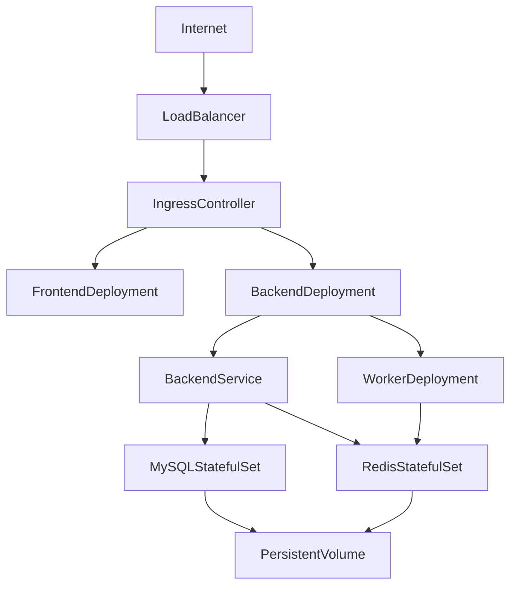

---

## Kubernetes Component Summary

| Component | Purpose |
|------------|------------------------------|
| Namespace | Environment Isolation |
| Deployment | Stateless Application |
| StatefulSet | Stateful Service |
| Service | Internal Networking |
| Ingress | External Routing |
| ConfigMap | Configuration |
| Secret | Sensitive Configuration |
| PVC | Persistent Storage |
| HPA | Auto Scaling |
| Helm | Package Management |

---

# 12. Summary

Part 4 mendefinisikan arsitektur Kubernetes untuk Parakita, mencakup **Namespace Strategy**, **Deployment**, **StatefulSet**, **Service**, **Ingress**, **ConfigMap**, **Secret**, **Persistent Volume**, **Horizontal Pod Autoscaler**, serta **Helm Chart**. Arsitektur ini memungkinkan deployment yang **highly available**, **self-healing**, **scalable**, dan **secure**, sekaligus mendukung proses **rolling update**, **rollback**, dan **automated operations** pada seluruh environment dari Development hingga Production.

---

**End of Part 4**

**Next Document**

**Part 5 — CI/CD Pipeline (Git Strategy, Branching Model, GitHub Actions, Build Pipeline, Testing Pipeline, Security Scan, Artifact Repository, Release Strategy, Rollback, Deployment Approval)**

# Parakita Software Architecture Document (SAD)

# 24 - Deployment

| Document Information | |
|----------------------|----------------------------------------------|
| Project | Parakita - Dental Clinic Management System |
| Document | 24 - Deployment |
| Part | 5 of 12 |
| Version | 1.0.0 |
| Status | Draft |
| Document Type | Deployment Architecture Specification |
| Architecture Style | Clean Architecture + Domain Driven Design + Modular Monolith |
| Source Control | GitHub |
| CI/CD Platform | GitHub Actions |
| Artifact Registry | GitHub Container Registry (GHCR) |
| Last Updated | July 2026 |

---

# Table of Contents (Part 5)

1. CI/CD Overview
2. Git Strategy
3. Branching Model
4. GitHub Actions Workflow
5. Build Pipeline
6. Testing Pipeline
7. Security & Quality Pipeline
8. Artifact Repository
9. Release Strategy
10. Rollback Strategy
11. Deployment Approval Flow
12. Summary

---

# 1. CI/CD Overview

Parakita menerapkan **Continuous Integration (CI)** dan **Continuous Delivery (CD)** untuk memastikan setiap perubahan kode dapat dibangun, diuji, dan dideploy secara konsisten.

Tujuan utama CI/CD adalah:

- Mengurangi human error
- Mempercepat proses deployment
- Menjamin kualitas kode
- Memastikan build dapat direproduksi
- Mendukung rollback dengan cepat
- Menyediakan deployment yang dapat diaudit

---

## CI/CD Principles

- Automation First
- Build Once, Deploy Many
- Immutable Artifact
- Continuous Testing
- Secure Pipeline
- Deployment Traceability
- Fast Rollback
- Zero Manual Build

---

## High-Level Pipeline

```text
Developer

↓

Git Push

↓

GitHub

↓

CI Pipeline

↓

Build

↓

Test

↓

Security Scan

↓

Publish Artifact

↓

CD Pipeline

↓

Deploy

↓

Health Check

↓

Completed
```

---

# 2. Git Strategy

Seluruh source code disimpan dalam satu repository Git.

---

## Repository Structure

```text
parakita/

├── apps/

│   ├── frontend

│   ├── backend

│   └── worker

├── packages/

├── helm/

├── docker/

├── docs/

└── .github/
```

---

## Commit Convention

Commit mengikuti format Conventional Commits.

Contoh:

```
feat: add billing payment validation

fix: resolve login timeout

refactor: simplify invoice calculation

docs: update deployment guide

test: add patient service unit test
```

---

## Version Control Rules

- Semua perubahan melalui Pull Request
- Tidak boleh commit langsung ke branch Production
- Merge dilakukan setelah review
- Setiap merge menghasilkan Audit Trail

---

# 3. Branching Model

Parakita menggunakan pendekatan Git Flow yang disederhanakan.

---

## Branch Structure

| Branch | Purpose |
|---------|----------------------------|
| main | Production |
| develop | Active Development |
| feature/* | New Feature |
| release/* | Release Preparation |
| hotfix/* | Production Fix |

---

## Workflow

```text
feature

↓

develop

↓

release

↓

main

↓

tag
```

---

## Branch Rules

### main

- Protected Branch
- Production Only
- Tag Release

---

### develop

- Integration Branch
- Daily Development

---

### feature/*

- Short Lived
- Single Feature
- Pull Request Required

---

### hotfix/*

Digunakan untuk perbaikan darurat pada Production.

---

# 4. GitHub Actions Workflow

GitHub Actions digunakan sebagai automation engine.

---

## Workflow List

| Workflow | Trigger |
|----------|---------------------------|
| CI | Push / Pull Request |
| Build | Merge to Develop |
| Staging Deploy | Release Branch |
| Production Deploy | Merge to Main |
| Rollback | Manual Trigger |

---

## Workflow Sequence

```text
Push

↓

Checkout Source

↓

Install Dependency

↓

Lint

↓

Test

↓

Build

↓

Security Scan

↓

Build Docker Image

↓

Push Registry

↓

Deploy
```

---

## Pipeline Trigger

| Event | Pipeline |
|--------|----------|
| Push Feature | CI |
| Pull Request | CI |
| Merge Develop | Development Deploy |
| Release Branch | Staging Deploy |
| Merge Main | Production Deploy |

---

# 5. Build Pipeline

Pipeline build menghasilkan artifact yang siap dideploy.

---

## Build Steps

1. Checkout Source
2. Install Dependencies
3. Restore Cache
4. Compile Application
5. Run Unit Test
6. Build Docker Image
7. Tag Image
8. Push Image

---

## Build Flow

```text
Source Code

↓

Install Packages

↓

Compile

↓

Build Image

↓

Push Registry
```

---

## Build Output

| Artifact | Description |
|-----------|-------------|
| Frontend Image | Next.js |
| Backend Image | Express API |
| Worker Image | Background Worker |

---

## Version Tag

Contoh:

```
v1.0.0

v1.1.0

v1.2.3
```

---

# 6. Testing Pipeline

Setiap build wajib melalui proses pengujian otomatis.

---

## Testing Stages

| Stage | Required |
|---------|----------|
| Lint | ✔ |
| Unit Test | ✔ |
| Integration Test | ✔ |
| Build Verification | ✔ |

---

## Pipeline

```text
Lint

↓

Unit Test

↓

Integration Test

↓

Coverage Report

↓

Build
```

---

## Coverage Target

| Test | Target |
|------|---------|
| Domain | ≥ 90% |
| Application | ≥ 85% |
| API | ≥ 80% |

---

## Failed Test Policy

Apabila salah satu pengujian gagal:

- Pipeline dihentikan
- Artifact tidak dibuat
- Deployment dibatalkan

---

# 7. Security & Quality Pipeline

Pipeline melakukan validasi keamanan dan kualitas sebelum deployment.

---

## Static Code Analysis

Meliputi:

- Code Smell
- Complexity
- Dead Code
- Duplicate Code

---

## Dependency Scan

Pemeriksaan dilakukan terhadap:

- Vulnerable Package
- Known CVE
- Outdated Dependency

---

## Container Scan

Image diperiksa terhadap:

- Critical Vulnerability
- High Severity
- OS Package Vulnerability

---

## Secret Detection

Pipeline menolak commit yang mengandung:

- Password
- API Key
- Private Key
- Token
- Database Credential

---

## Quality Gate

Pipeline hanya dapat dilanjutkan apabila:

- Semua test berhasil
- Tidak ada vulnerability kritis
- Quality gate terpenuhi

---

# 8. Artifact Repository

Artifact deployment disimpan pada Container Registry.

---

## Stored Artifact

- Frontend Image
- Backend Image
- Worker Image
- Helm Chart

---

## Registry Structure

```text
ghcr.io/parakita/

├── frontend

├── backend

├── worker

└── helm
```

---

## Artifact Rules

- Immutable
- Versioned
- Signed
- Traceable

---

## Retention Policy

| Artifact | Retention |
|-----------|-----------|
| Development | 30 Hari |
| Staging | 90 Hari |
| Production | Permanent |

---

# 9. Release Strategy

Deployment dilakukan secara bertahap.

---

## Release Flow

```text
Develop

↓

QA

↓

Staging

↓

Production
```

---

## Release Types

| Type | Description |
|--------|--------------------------|
| Patch | Bug Fix |
| Minor | New Feature |
| Major | Breaking Change |

---

## Production Release

Tahapan release:

1. Freeze Branch
2. Build
3. Test
4. Security Scan
5. Staging Validation
6. Approval
7. Production Deployment
8. Monitoring

---

## Release Version

Mengikuti Semantic Versioning.

```
MAJOR.MINOR.PATCH
```

Contoh:

```
2.4.1
```

---

# 10. Rollback Strategy

Rollback dilakukan apabila deployment gagal atau ditemukan masalah kritis.

---

## Rollback Trigger

- Health Check Failed
- Critical Error
- Service Unavailable
- Performance Regression
- Failed Smoke Test

---

## Rollback Flow

```text
Deployment

↓

Health Check

↓

Failed

↓

Rollback Previous Version

↓

Validation

↓

Completed
```

---

## Rollback Rules

- Menggunakan artifact sebelumnya
- Database migration harus kompatibel
- Rollback harus terdokumentasi
- Insiden dicatat dalam deployment log

---

# 11. Deployment Approval Flow

Deployment ke Production memerlukan proses persetujuan.

---

## Approval Matrix

| Environment | Approval |
|-------------|----------------|
| Development | Automatic |
| QA | Automatic |
| Staging | DevOps |
| Production | DevOps + Product Owner |

---

## Deployment Workflow

```text
Pipeline Success

↓

Manual Approval

↓

Deploy Production

↓

Smoke Test

↓

Health Check

↓

Completed
```

---

## Post Deployment Validation

Setelah deployment berhasil dilakukan:

- Health Check
- Smoke Test
- API Validation
- Database Connectivity
- Monitoring Dashboard
- Error Log Review

---

## Audit Trail

Setiap deployment mencatat:

- Version
- Build Number
- Commit SHA
- Deployment Time
- Triggered By
- Approved By
- Environment
- Rollback Status

---

# 12. Summary

Part 5 mendefinisikan proses **Continuous Integration** dan **Continuous Delivery (CI/CD)** Parakita menggunakan **GitHub**, **GitHub Actions**, dan **GitHub Container Registry**. Dokumen ini mencakup strategi Git, model branching, pipeline build dan pengujian, validasi keamanan, pengelolaan artifact, strategi release, rollback, serta mekanisme approval deployment. Dengan pipeline yang sepenuhnya otomatis dan terdokumentasi, Parakita dapat melakukan deployment secara **aman**, **konsisten**, **traceable**, dan **reliable** pada seluruh environment mulai dari Development hingga Production.

---

**End of Part 5**

**Next Document**

**Part 6 — Environment Configuration (Environment Variables, Secret Management, Feature Flag, External Services, SMTP, Redis, MySQL, Object Storage, Logging, Monitoring)**

# Parakita Software Architecture Document (SAD)

# 24 - Deployment

| Document Information | |
|----------------------|----------------------------------------------|
| Project | Parakita - Dental Clinic Management System |
| Document | 24 - Deployment |
| Part | 6 of 12 |
| Version | 1.0.0 |
| Status | Draft |
| Document Type | Deployment Architecture Specification |
| Architecture Style | Clean Architecture + Domain Driven Design + Modular Monolith |
| Configuration Management | Environment Variables + Kubernetes ConfigMap & Secret |
| Last Updated | July 2026 |

---

# Table of Contents (Part 6)

1. Environment Configuration Overview
2. Environment Variables
3. Secret Management
4. Feature Flag Management
5. External Services Configuration
6. Database Configuration
7. Cache & Queue Configuration
8. Object Storage Configuration
9. Logging & Monitoring Configuration
10. Configuration Loading Strategy
11. Configuration Security Guidelines
12. Summary

---

# 1. Environment Configuration Overview

Parakita menggunakan konfigurasi yang terpisah dari source code sehingga setiap environment dapat memiliki parameter operasional yang berbeda tanpa memerlukan perubahan kode aplikasi.

Konfigurasi dikelompokkan menjadi:

- Application Configuration
- Infrastructure Configuration
- Security Configuration
- External Service Configuration
- Monitoring Configuration

---

## Configuration Principles

Deployment mengikuti prinsip berikut.

- Twelve-Factor App
- Externalized Configuration
- Environment Isolation
- Secret Separation
- Immutable Container
- Secure Configuration
- Least Privilege
- Configuration Validation

---

## Configuration Flow

```text
Environment

↓

ConfigMap

↓

Secret

↓

Application Startup

↓

Runtime Configuration
```

---

# 2. Environment Variables

Seluruh konfigurasi runtime disediakan melalui environment variable.

---

## Configuration Categories

| Category | Description |
|----------|-------------|
| Application | Nama aplikasi, port |
| Database | MySQL Connection |
| Redis | Cache Connection |
| Storage | Object Storage |
| Authentication | JWT |
| SMTP | Email |
| Monitoring | Metrics & Logging |
| Feature Flag | Experimental Feature |

---

## Standard Variables

| Variable | Description |
|-----------|-------------|
| NODE_ENV | Runtime Environment |
| APP_NAME | Application Name |
| APP_PORT | Service Port |
| APP_URL | Public URL |
| LOG_LEVEL | Logging Level |
| TZ | Timezone |

---

## Backend Variables

```
NODE_ENV=production

APP_PORT=3000

APP_URL=https://api.parakita.com

LOG_LEVEL=info
```

---

## Frontend Variables

```
NEXT_PUBLIC_API_URL=https://api.parakita.com

NEXT_PUBLIC_APP_NAME=Parakita

NEXT_PUBLIC_TIMEZONE=Asia/Jakarta
```

---

## Environment Separation

Setiap environment memiliki file konfigurasi masing-masing.

```
.env.development

.env.qa

.env.staging

.env.production
```

---

# 3. Secret Management

Seluruh data sensitif dipisahkan dari konfigurasi biasa.

---

## Secret Categories

- Database Password
- JWT Secret
- Refresh Token Secret
- SMTP Password
- Redis Password
- API Keys
- Object Storage Access Key
- Object Storage Secret Key

---

## Secret Storage

| Environment | Storage |
|-------------|----------------------------|
| Local | Local Secret File |
| Development | Kubernetes Secret |
| QA | Kubernetes Secret |
| Staging | Kubernetes Secret |
| Production | Kubernetes Secret |

---

## Secret Flow

```text
Secret

↓

Kubernetes Secret

↓

Pod

↓

Application
```

---

## Secret Rotation

Secret harus dapat diganti tanpa membangun ulang Docker Image.

Contoh:

- JWT Secret Rotation
- SMTP Password Rotation
- Database Password Rotation
- API Key Rotation

---

## Secret Rules

- Tidak boleh disimpan di Git Repository.
- Tidak boleh ditulis ke log.
- Tidak boleh di-hardcode.
- Hanya dapat diakses oleh workload yang membutuhkan.

---

# 4. Feature Flag Management

Feature Flag digunakan untuk mengaktifkan atau menonaktifkan fitur tertentu tanpa deployment ulang.

---

## Use Cases

- Beta Feature
- Experimental Module
- Gradual Rollout
- Emergency Disable
- Regional Feature

---

## Example Configuration

```
FEATURE_INSURANCE=true

FEATURE_TELEDENTISTRY=false

FEATURE_AI_REPORT=false
```

---

## Feature Lifecycle

```text
Development

↓

Testing

↓

Gradual Rollout

↓

Production

↓

Default Feature
```

---

## Benefits

- Safe Release
- Easy Rollback
- Incremental Deployment
- A/B Testing Ready

---

# 5. External Services Configuration

Parakita terintegrasi dengan beberapa layanan eksternal.

---

## External Services

| Service | Purpose |
|----------|----------------------------|
| SMTP | Email Notification |
| Object Storage | File Storage |
| Payment Gateway | Online Payment |
| SMS Gateway | OTP Notification |
| WhatsApp API | Patient Notification |

---

## SMTP Configuration

```
SMTP_HOST

SMTP_PORT

SMTP_USERNAME

SMTP_PASSWORD

SMTP_TLS
```

---

## Payment Gateway Configuration

```
PAYMENT_PROVIDER

MERCHANT_ID

API_KEY

SECRET_KEY

CALLBACK_URL
```

---

## External Timeout

| Service | Timeout |
|----------|----------|
| SMTP | 30 Seconds |
| Payment Gateway | 60 Seconds |
| Storage | 30 Seconds |
| SMS | 20 Seconds |

---

## Retry Policy

Seluruh komunikasi eksternal menerapkan:

- Retry
- Exponential Backoff
- Timeout
- Circuit Breaker

---

# 6. Database Configuration

Database menggunakan konfigurasi yang berbeda pada setiap environment.

---

## Connection Variables

```
DB_HOST

DB_PORT

DB_NAME

DB_USERNAME

DB_PASSWORD
```

---

## Pool Configuration

| Parameter | Value |
|-----------|--------|
| Max Pool | 30 |
| Min Pool | 5 |
| Idle Timeout | 300 Seconds |
| Connection Timeout | 30 Seconds |

---

## Migration

Migration hanya dijalankan melalui pipeline deployment.

Developer tidak diperbolehkan menjalankan migration langsung pada Production.

---

## Readiness Validation

Saat startup aplikasi melakukan pemeriksaan:

- Database Reachable
- Schema Valid
- Migration Completed

---

# 7. Cache & Queue Configuration

Redis digunakan sebagai cache dan message queue.

---

## Redis Variables

```
REDIS_HOST

REDIS_PORT

REDIS_PASSWORD

REDIS_DATABASE
```

---

## Redis Usage

- Cache
- Session
- Queue
- Background Job
- Rate Limiter

---

## Connection Policy

- Auto Reconnect
- Connection Pool
- Health Check
- Timeout Detection

---

## Queue Configuration

Worker menggunakan queue terpisah.

```
notification

report

billing

appointment
```

---

# 8. Object Storage Configuration

Seluruh file diunggah ke Object Storage.

---

## Configuration

```
STORAGE_PROVIDER

STORAGE_ENDPOINT

ACCESS_KEY

SECRET_KEY

BUCKET_NAME
```

---

## Storage Structure

```text
patients/

documents/

radiology/

invoice/

reports/

exports/
```

---

## Upload Rules

- Maksimum ukuran file dikonfigurasi.
- MIME Type divalidasi.
- Nama file dibuat unik.
- Metadata disimpan pada database.

---

## File Lifecycle

```text
Upload

↓

Validation

↓

Object Storage

↓

Metadata Database

↓

Access URL
```

---

# 9. Logging & Monitoring Configuration

Seluruh aplikasi menghasilkan log terstruktur.

---

## Logging Variables

```
LOG_LEVEL

LOG_FORMAT

LOG_OUTPUT
```

---

## Log Level

| Level | Purpose |
|--------|----------|
| Error | Critical Error |
| Warn | Warning |
| Info | Operational Event |
| Debug | Development |
| Trace | Detailed Debugging |

---

## Monitoring Variables

```
METRICS_ENABLED=true

HEALTH_CHECK_ENABLED=true

TRACING_ENABLED=true
```

---

## Health Endpoint

```http
GET /health
```

---

## Metrics Endpoint

```http
GET /metrics
```

---

# 10. Configuration Loading Strategy

Konfigurasi dimuat saat aplikasi dijalankan.

---

## Startup Flow

```text
Application Start

↓

Load Environment

↓

Load ConfigMap

↓

Load Secret

↓

Validate Configuration

↓

Initialize Services

↓

Ready
```

---

## Validation Rules

Aplikasi gagal dijalankan apabila:

- Secret tidak tersedia.
- Database configuration tidak lengkap.
- Storage configuration tidak valid.
- JWT Secret kosong.
- SMTP configuration tidak valid.

---

## Fail Fast

Konfigurasi yang tidak valid menyebabkan aplikasi berhenti saat startup.

---

# 11. Configuration Security Guidelines

Konfigurasi mengikuti standar keamanan.

---

## Security Principles

- Least Privilege
- Secret Isolation
- Encryption in Transit
- Encryption at Rest
- Secret Rotation
- Configuration Audit

---

## Sensitive Data Policy

Data berikut tidak boleh muncul pada:

- Log
- Stack Trace
- Error Response
- Monitoring Dashboard

Contoh:

- Password
- API Key
- JWT Secret
- Access Token
- Database Credential

---

## Configuration Audit

Perubahan konfigurasi harus terdokumentasi.

Audit mencatat:

- Environment
- Configuration Version
- Changed By
- Changed At
- Approval
- Deployment Version

---

# 12. Summary

Part 6 mendefinisikan strategi pengelolaan konfigurasi deployment Parakita menggunakan **Environment Variables**, **ConfigMap**, dan **Kubernetes Secret**. Dokumen ini mencakup pengelolaan konfigurasi aplikasi, secret management, feature flag, database, Redis, object storage, layanan eksternal, logging, monitoring, serta mekanisme validasi konfigurasi saat startup. Dengan pendekatan **Externalized Configuration**, **Fail Fast**, dan **Secure by Default**, setiap environment dapat dikelola secara konsisten, aman, dan mudah dipelihara tanpa mengubah Docker Image maupun source code.

---

**End of Part 6**

**Next Document**

**Part 7 — BPMN Deployment Process (Release Process, Production Deployment, Rollback Process, Hotfix Process, Database Migration, Blue-Green Deployment, Canary Deployment, Incident Recovery, BPMN Diagram)**

# Parakita Software Architecture Document (SAD)

# 24 - Deployment

| Document Information | |
|----------------------|----------------------------------------------|
| Project | Parakita - Dental Clinic Management System |
| Document | 24 - Deployment |
| Part | 7 of 12 |
| Version | 1.0.0 |
| Status | Draft |
| Document Type | Deployment Architecture Specification |
| Focus | BPMN Deployment Process |
| Last Updated | July 2026 |

---

# Table of Contents (Part 7)

1. Deployment Process Overview
2. Release Management Process
3. Production Deployment Process
4. Rollback Process
5. Hotfix Deployment Process
6. Database Migration Process
7. Blue-Green Deployment Process
8. Canary Deployment Process
9. Incident Recovery Process
10. Deployment Roles & Responsibilities
11. BPMN Diagrams
12. Summary

---

# 1. Deployment Process Overview

Deployment Process mendefinisikan alur operasional mulai dari perubahan source code hingga aplikasi tersedia di Production.

Seluruh deployment mengikuti prinsip:

- Automation First
- Approval Before Production
- Zero Downtime Deployment
- Versioned Release
- Rollback Ready
- Fully Auditable

---

## Deployment Lifecycle

```text
Development

↓

Build

↓

Testing

↓

Staging

↓

Approval

↓

Production Deployment

↓

Validation

↓

Monitoring
```

---

## Objectives

Deployment Process bertujuan untuk:

- Memastikan deployment konsisten.
- Meminimalkan downtime.
- Mengurangi human error.
- Menyediakan rollback cepat.
- Menjamin kualitas release.
- Mendukung audit operasional.

---

# 2. Release Management Process

Release Management mengatur bagaimana perubahan dikumpulkan, divalidasi, dan dipublikasikan.

---

## Workflow

```text
Feature Development

↓

Code Review

↓

Merge to Develop

↓

CI Pipeline

↓

QA Testing

↓

Release Candidate

↓

Staging

↓

Approval

↓

Production
```

---

## BPMN Flow

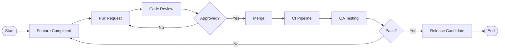

---

## Release Approval

| Stage | Approval |
|---------|----------|
| Feature Merge | Reviewer |
| Staging | QA |
| Production | DevOps + Product Owner |

---

# 3. Production Deployment Process

Deployment Production hanya dilakukan setelah seluruh validasi berhasil.

---

## Deployment Steps

1. Build Production Artifact
2. Publish Container Image
3. Validate Image
4. Deploy Kubernetes
5. Wait for Readiness
6. Execute Smoke Test
7. Verify Monitoring
8. Release Completed

---

## BPMN Flow

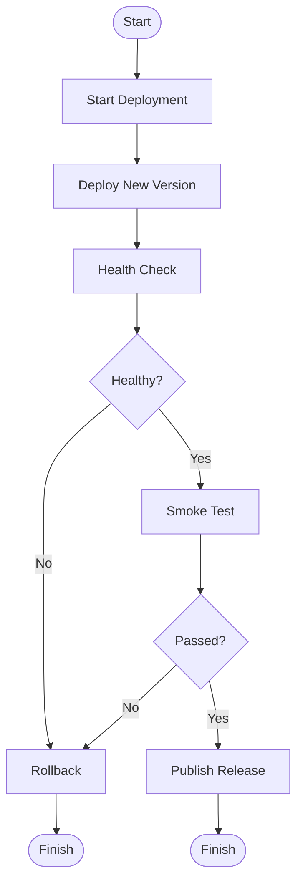

---

## Success Criteria

Deployment dinyatakan berhasil apabila:

- Semua Pod Ready
- Health Check berhasil
- Smoke Test berhasil
- Error Rate normal
- CPU & Memory stabil
- Monitoring tidak menunjukkan alert kritis

---

# 4. Rollback Process

Rollback dilakukan apabila deployment menyebabkan gangguan layanan.

---

## Rollback Trigger

- Failed Health Check
- Pod Crash Loop
- API Error
- Database Error
- High Error Rate
- Failed Smoke Test

---

## Rollback Flow

```text
Deployment Failure

↓

Stop Rollout

↓

Restore Previous Image

↓

Health Check

↓

Monitoring

↓

Deployment Closed
```

---

## BPMN Flow

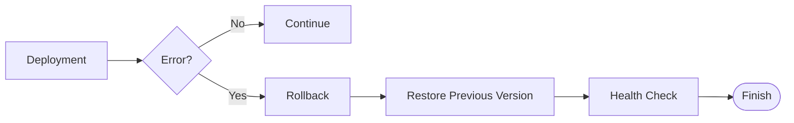

---

## Rollback Rules

- Menggunakan image release sebelumnya.
- Tidak mengubah data bisnis.
- Database migration harus kompatibel.
- Seluruh aktivitas dicatat pada deployment log.

---

# 5. Hotfix Deployment Process

Hotfix digunakan untuk memperbaiki masalah kritis pada Production.

---

## Trigger

- Critical Bug
- Security Vulnerability
- Production Incident
- Data Corruption Risk

---

## Workflow

```text
Production Issue

↓

Hotfix Branch

↓

Fix

↓

CI Pipeline

↓

Testing

↓

Approval

↓

Production Deployment

↓

Merge Back
```

---

## BPMN Diagram

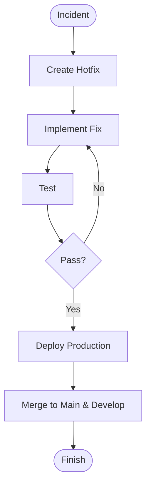

---

# 6. Database Migration Process

Migration dilakukan bersamaan dengan deployment menggunakan pipeline otomatis.

---

## Migration Principles

- Version Controlled
- Repeatable
- Transactional (jika didukung)
- Backward Compatible
- Tested di Staging

---

## Workflow

```text
Backup Database

↓

Run Migration

↓

Validation

↓

Application Startup

↓

Smoke Test
```

---

## BPMN Diagram

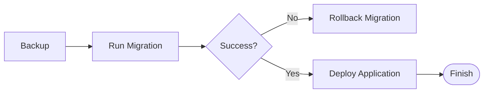

---

## Migration Rules

- Tidak dijalankan manual di Production.
- Wajib memiliki rollback plan.
- Harus diuji pada Staging.
- Perubahan skema terdokumentasi.

---

# 7. Blue-Green Deployment Process

Blue-Green Deployment digunakan untuk mengurangi downtime saat deployment.

---

## Strategy

```text
Blue Environment

(Current Production)

↓

Deploy

↓

Green Environment

↓

Validation

↓

Traffic Switch

↓

Blue Standby
```

---

## BPMN Diagram

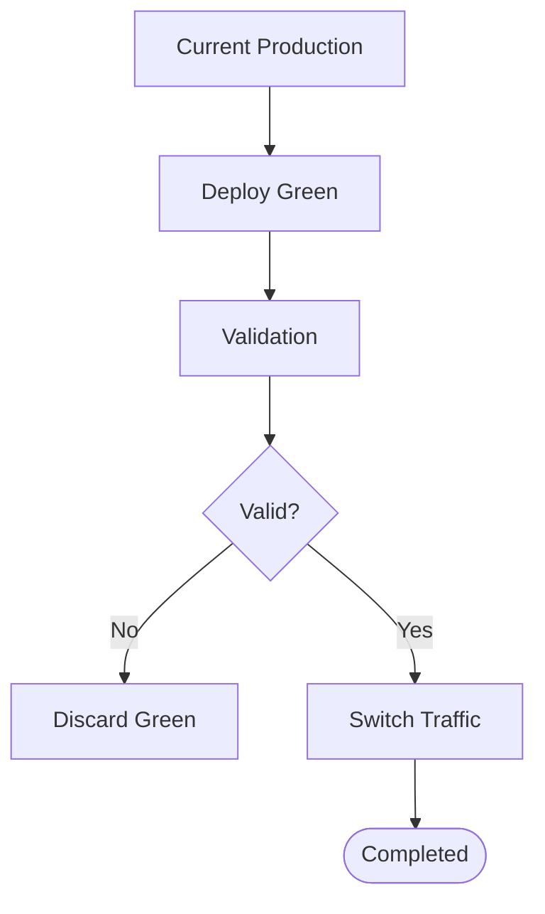

---

## Benefits

- Zero Downtime
- Instant Rollback
- Production Validation
- Reduced Deployment Risk

---

# 8. Canary Deployment Process

Canary Deployment digunakan untuk mengurangi risiko dengan mendistribusikan trafik secara bertahap.

---

## Rollout Strategy

| Stage | Traffic |
|---------|----------|
| Stage 1 | 5% |
| Stage 2 | 25% |
| Stage 3 | 50% |
| Stage 4 | 100% |

---

## BPMN Diagram

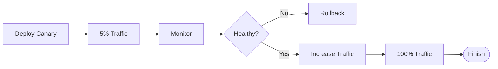

---

## Monitoring Metrics

Selama Canary Deployment dipantau:

- Error Rate
- Latency
- CPU Usage
- Memory Usage
- Request Success Rate
- Business KPI

---

# 9. Incident Recovery Process

Apabila deployment menyebabkan insiden, dilakukan proses pemulihan.

---

## Recovery Workflow

```text
Incident

↓

Detection

↓

Impact Analysis

↓

Rollback

↓

Recovery

↓

Verification

↓

Post Incident Review
```

---

## BPMN Diagram

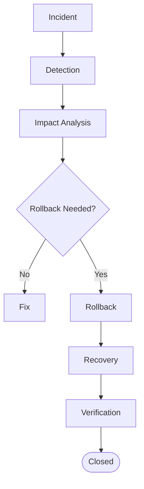

---

## Recovery Validation

Recovery dianggap selesai apabila:

- Semua layanan kembali normal.
- Error Rate stabil.
- Monitoring normal.
- Database konsisten.
- Pengguna dapat kembali mengakses sistem.

---

# 10. Deployment Roles & Responsibilities

| Role | Responsibility |
|------|----------------|
| Developer | Implementasi fitur dan perbaikan bug |
| Reviewer | Code Review |
| QA Engineer | Functional & Regression Testing |
| DevOps Engineer | CI/CD, Deployment, Rollback |
| Product Owner | Approval Release Production |
| System Administrator | Infrastruktur & Monitoring |
| Security Engineer | Security Validation |

---

## RACI Matrix

| Activity | Dev | QA | DevOps | PO |
|----------|:---:|:--:|:------:|:--:|
| Build | R | | A | |
| Testing | C | R | | |
| Staging Deploy | | C | R | |
| Production Approval | | | C | A |
| Production Deploy | | | R | |
| Rollback | C | | R | A |

**Legend:**

- **R** = Responsible
- **A** = Accountable
- **C** = Consulted

---

# 11. BPMN Diagrams

## End-to-End Deployment Process

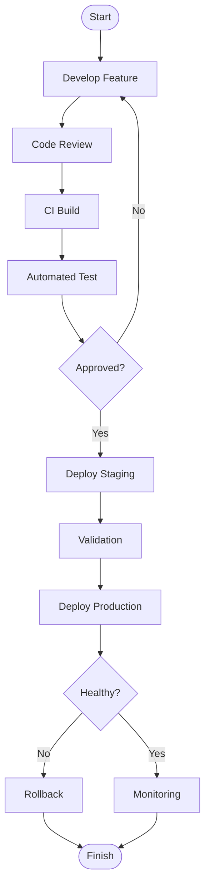

---

## Overall Deployment Lifecycle

```text
Planning

↓

Development

↓

Testing

↓

Release

↓

Deployment

↓

Validation

↓

Monitoring

↓

Maintenance
```

---

# 12. Summary

Part 7 mendefinisikan proses bisnis deployment Parakita menggunakan pendekatan BPMN. Dokumen ini mencakup **Release Management**, **Production Deployment**, **Rollback**, **Hotfix**, **Database Migration**, **Blue-Green Deployment**, **Canary Deployment**, serta **Incident Recovery**. Seluruh proses dirancang untuk mendukung deployment yang **otomatis**, **aman**, **minim downtime**, **mudah diaudit**, dan **siap dipulihkan** apabila terjadi kegagalan, sehingga operasional sistem tetap andal pada lingkungan Production.

---

**End of Part 7**

**Next Document**

**Part 8 — Security Deployment (Network Security, Firewall, WAF, SSL/TLS, IAM, RBAC, Secret Rotation, Vulnerability Management, Compliance)**

# Parakita Software Architecture Document (SAD)

# 24 - Deployment

| Document Information | |
|----------------------|----------------------------------------------|
| Project | Parakita - Dental Clinic Management System |
| Document | 24 - Deployment |
| Part | 8 of 12 |
| Version | 1.0.0 |
| Status | Draft |
| Document Type | Deployment Architecture Specification |
| Focus | Security Deployment Architecture |
| Last Updated | July 2026 |

---

# Table of Contents (Part 8)

1. Security Deployment Overview
2. Network Security Architecture
3. Firewall Architecture
4. Web Application Firewall (WAF)
5. SSL/TLS Security
6. Identity & Access Management (IAM)
7. Role-Based Access Control (RBAC)
8. Secret Management & Rotation
9. Vulnerability Management
10. Security Compliance
11. Security Deployment Checklist
12. Summary

---

# 1. Security Deployment Overview

Deployment Security memastikan seluruh komponen Parakita berjalan dalam lingkungan yang aman, terlindungi dari ancaman eksternal, serta memenuhi standar keamanan organisasi.

Tujuan utama:

- Protect Infrastructure
- Protect Application
- Protect Patient Data
- Secure Network Communication
- Secure Configuration
- Continuous Security Monitoring
- Compliance Readiness

---

## Security Principles

Deployment mengikuti prinsip:

- Defense in Depth
- Least Privilege
- Zero Trust
- Secure by Default
- Encryption Everywhere
- Continuous Monitoring
- Auditability
- Principle of Minimal Exposure

---

## Security Layers

```text
Internet

↓

WAF

↓

Firewall

↓

Load Balancer

↓

Ingress

↓

Application

↓

Database

↓

Backup
```

---

# 2. Network Security Architecture

Jaringan dipisahkan berdasarkan zona keamanan untuk membatasi akses antar komponen.

---

## Security Zones

```text
Internet

↓

DMZ

↓

Application Network

↓

Data Network

↓

Management Network
```

---

## Network Responsibilities

| Zone | Purpose |
|------|---------------------------|
| DMZ | Public Entry Point |
| Application | Backend Services |
| Data | Database & Redis |
| Management | Monitoring & Administration |

---

## Access Policy

| Source | Destination | Allowed |
|---------|-------------|---------|
| Internet | Load Balancer | ✔ |
| Load Balancer | Ingress | ✔ |
| Ingress | Backend API | ✔ |
| Backend API | MySQL | ✔ |
| Backend API | Redis | ✔ |
| Internet | Database | ✘ |
| Internet | Redis | ✘ |

---

## Security Objectives

- Isolate critical services
- Prevent lateral movement
- Restrict administrative access
- Protect internal resources

---

# 3. Firewall Architecture

Firewall digunakan untuk mengontrol seluruh trafik masuk dan keluar.

---

## Firewall Layers

```text
Internet Firewall

↓

Cloud Firewall

↓

Host Firewall

↓

Container Network Policy
```

---

## Inbound Rules

| Port | Service | Status |
|------|---------|--------|
| 80 | HTTP (Redirect) | Allowed |
| 443 | HTTPS | Allowed |
| 22 | SSH | Restricted |
| 3306 | MySQL | Internal Only |
| 6379 | Redis | Internal Only |

---

## Outbound Rules

Backend hanya diperbolehkan mengakses:

- SMTP Server
- Object Storage
- Payment Gateway
- SMS Gateway
- Monitoring Endpoint

---

## Firewall Best Practices

- Default Deny
- Explicit Allow
- Logging Enabled
- Regular Rule Review
- Automated Rule Validation

---

# 4. Web Application Firewall (WAF)

WAF melindungi aplikasi dari serangan pada layer HTTP/HTTPS.

---

## WAF Functions

- SQL Injection Protection
- Cross Site Scripting (XSS) Protection
- Remote Code Execution Detection
- HTTP Protocol Validation
- Request Filtering
- IP Reputation Filtering
- Rate Limiting

---

## Request Flow

```text
Client

↓

WAF

↓

Load Balancer

↓

Ingress

↓

Application
```

---

## Protection Rules

| Attack Type | Protected |
|-------------|-----------|
| SQL Injection | ✔ |
| Cross Site Scripting | ✔ |
| Command Injection | ✔ |
| Directory Traversal | ✔ |
| File Inclusion | ✔ |
| Brute Force | ✔ |
| Bot Traffic | ✔ |

---

# 5. SSL/TLS Security

Seluruh komunikasi antar pengguna dan aplikasi menggunakan HTTPS.

---

## TLS Policy

| Parameter | Value |
|-----------|-------|
| Minimum TLS | 1.2 |
| Preferred TLS | 1.3 |
| Certificate | Trusted CA |
| Auto Renewal | Enabled |

---

## HTTPS Flow

```text
Client

↓

TLS Handshake

↓

Encrypted Connection

↓

Application
```

---

## Certificate Management

Sertifikat harus:

- Valid
- Trusted
- Automatically Renewed
- Monitored Before Expiration

---

## HTTP Security Headers

- Strict-Transport-Security
- X-Frame-Options
- X-Content-Type-Options
- Referrer-Policy
- Content-Security-Policy
- Permissions-Policy

---

# 6. Identity & Access Management (IAM)

IAM mengatur autentikasi dan otorisasi administrator yang mengelola deployment.

---

## Identity Sources

- Organization Account
- Single Sign-On (SSO)
- Multi-Factor Authentication (MFA)

---

## Administrative Roles

| Role | Responsibility |
|------|----------------|
| DevOps Engineer | Deployment |
| Infrastructure Engineer | Cluster Management |
| Security Engineer | Security Policy |
| System Administrator | Server Maintenance |

---

## Authentication Policy

- MFA Required
- Strong Password Policy
- Session Timeout
- Account Lockout
- Audit Logging

---

## Access Lifecycle

```text
User Request

↓

Approval

↓

Role Assignment

↓

Periodic Review

↓

Revocation
```

---

# 7. Role-Based Access Control (RBAC)

RBAC membatasi hak akses berdasarkan peran.

---

## Kubernetes RBAC

| Role | Access |
|------|--------|
| Developer | Development Namespace |
| QA | QA Namespace |
| DevOps | Deployment Management |
| Security | Audit & Security Policy |
| Cluster Admin | Full Cluster Access |

---

## Least Privilege Principle

Pengguna hanya diberikan izin minimum yang diperlukan untuk menjalankan tugasnya.

---

## Service Account

Setiap workload menggunakan Service Account terpisah.

Contoh:

```
frontend-sa

backend-sa

worker-sa

migration-sa
```

---

## RBAC Review

Hak akses ditinjau secara berkala untuk memastikan tidak ada akses yang berlebihan.

---

# 8. Secret Management & Rotation

Secret harus dikelola secara aman sepanjang siklus hidup aplikasi.

---

## Secret Categories

- Database Credentials
- JWT Secret
- API Keys
- SMTP Credentials
- Redis Password
- Object Storage Credentials

---

## Secret Lifecycle

```text
Create

↓

Encrypt

↓

Store

↓

Deploy

↓

Rotate

↓

Revoke
```

---

## Rotation Policy

| Secret | Rotation |
|---------|----------|
| API Key | 90 Hari |
| JWT Secret | Sesuai Kebijakan |
| Database Password | 180 Hari |
| SMTP Password | 180 Hari |

---

## Secret Protection

- Tidak disimpan di repository.
- Tidak dicetak ke log.
- Tidak ditampilkan pada dashboard.
- Diakses melalui Kubernetes Secret.
- Dienkripsi saat penyimpanan.

---

# 9. Vulnerability Management

Kerentanan harus dideteksi dan ditangani sebelum deployment.

---

## Security Scan

Pipeline melakukan pemeriksaan terhadap:

- Source Code
- Dependency
- Container Image
- Kubernetes Manifest

---

## Vulnerability Severity

| Severity | Action |
|----------|--------|
| Critical | Deployment Blocked |
| High | Review Required |
| Medium | Scheduled Fix |
| Low | Monitoring |

---

## Patch Management

Patch keamanan diterapkan melalui proses:

```text
Detection

↓

Risk Assessment

↓

Testing

↓

Deployment

↓

Verification
```

---

## Continuous Monitoring

Monitoring dilakukan terhadap:

- CVE Database
- Container Registry
- Dependency Updates
- Operating System Updates

---

# 10. Security Compliance

Deployment mengikuti kebijakan keamanan organisasi.

---

## Compliance Objectives

- Protect Patient Information
- Maintain Audit Trail
- Secure Infrastructure
- Secure Data Transmission
- Secure Authentication

---

## Audit Requirements

Audit mencatat:

- Login
- Deployment
- Configuration Changes
- Secret Access
- Permission Changes
- Rollback
- Administrative Activity

---

## Compliance Controls

| Control | Status |
|----------|--------|
| Encryption in Transit | ✔ |
| Encryption at Rest | ✔ |
| Audit Logging | ✔ |
| Access Control | ✔ |
| Backup Protection | ✔ |
| Secret Protection | ✔ |

---

# 11. Security Deployment Checklist

Sebelum deployment Production dilakukan, seluruh pemeriksaan berikut harus diselesaikan.

---

## Infrastructure

- Firewall aktif
- WAF aktif
- TLS valid
- DNS benar
- Network Policy diterapkan

---

## Application

- Security Scan berhasil
- Dependency terbaru
- Tidak ada Critical Vulnerability
- Health Check berhasil

---

## Kubernetes

- Secret tersedia
- ConfigMap valid
- RBAC diperiksa
- Resource Limit diterapkan
- Image berasal dari Registry resmi

---

## Database

- Backup selesai
- Koneksi terenkripsi
- Migration tervalidasi

---

## Operations

- Monitoring aktif
- Alert aktif
- Audit Logging aktif
- Rollback Plan tersedia

---

# 12. Summary

Part 8 menjelaskan arsitektur keamanan deployment Parakita yang mencakup **Network Security**, **Firewall**, **Web Application Firewall (WAF)**, **SSL/TLS**, **Identity & Access Management (IAM)**, **Role-Based Access Control (RBAC)**, **Secret Management**, **Vulnerability Management**, serta **Security Compliance**. Pendekatan keamanan ini menerapkan prinsip **Defense in Depth**, **Least Privilege**, **Zero Trust**, dan **Secure by Default**, sehingga seluruh komponen deployment terlindungi dari ancaman umum, memiliki mekanisme audit yang lengkap, dan siap mendukung kebutuhan operasional sistem secara aman.

---

**End of Part 8**

**Next Document**

**Part 9 — Monitoring & Observability (Logging Architecture, Metrics Collection, Distributed Tracing, Alerting, Grafana, Prometheus, Loki, SLA Monitoring, Incident Dashboard)**

# Parakita Software Architecture Document (SAD)

# 24 - Deployment

| Document Information | |
|----------------------|----------------------------------------------|
| Project | Parakita - Dental Clinic Management System |
| Document | 24 - Deployment |
| Part | 9 of 12 |
| Version | 1.0.0 |
| Status | Draft |
| Document Type | Deployment Architecture Specification |
| Focus | Monitoring & Observability |
| Last Updated | July 2026 |

---

# Table of Contents (Part 9)

1. Monitoring & Observability Overview
2. Logging Architecture
3. Metrics Collection
4. Distributed Tracing
5. Alerting Strategy
6. Monitoring Stack
7. Dashboard & Visualization
8. Health Check & Service Monitoring
9. SLA/SLI/SLO Monitoring
10. Incident Monitoring
11. Monitoring Operational Checklist
12. Summary

---

# 1. Monitoring & Observability Overview

Monitoring dan Observability memastikan seluruh komponen Parakita dapat dipantau secara real-time sehingga gangguan dapat dideteksi, dianalisis, dan ditangani secepat mungkin.

Tujuan utama:

- System Visibility
- Early Problem Detection
- Root Cause Analysis
- Capacity Planning
- Performance Optimization
- Service Reliability
- Operational Audit

---

## Observability Pillars

Deployment menggunakan tiga pilar observability.

```text
Logs

↓

Metrics

↓

Traces
```

Ketiga komponen saling melengkapi untuk memberikan gambaran menyeluruh terhadap kondisi sistem.

---

## Monitoring Objectives

- Mendeteksi kegagalan layanan
- Memantau performa aplikasi
- Mengukur utilisasi resource
- Menyediakan dashboard operasional
- Menghasilkan alert otomatis
- Mendukung analisis insiden

---

# 2. Logging Architecture

Seluruh layanan menghasilkan **structured log** yang dikirim ke sistem logging terpusat.

---

## Log Sources

| Source | Description |
|----------|--------------------------|
| Frontend | Browser & Server Log |
| Backend API | Application Log |
| Worker | Background Job Log |
| MySQL | Database Log |
| Redis | Cache Log |
| Kubernetes | Pod & Cluster Log |
| Reverse Proxy | Access Log |

---

## Logging Flow

```text
Application

↓

Structured Log

↓

Log Collector

↓

Central Log Storage

↓

Dashboard
```

---

## Log Format

Setiap log minimal memuat:

- Timestamp
- Log Level
- Service Name
- Environment
- Request ID
- Correlation ID
- User ID (bila tersedia)
- Message

---

## Log Levels

| Level | Purpose |
|---------|------------------------|
| TRACE | Detailed Execution |
| DEBUG | Development |
| INFO | Normal Operation |
| WARN | Warning |
| ERROR | Recoverable Error |
| FATAL | Critical Failure |

---

## Log Retention

| Environment | Retention |
|-------------|-----------|
| Development | 14 Hari |
| QA | 30 Hari |
| Staging | 30 Hari |
| Production | 180 Hari |

---

# 3. Metrics Collection

Metrics digunakan untuk mengukur kesehatan dan performa sistem.

---

## Infrastructure Metrics

- CPU Usage
- Memory Usage
- Disk Usage
- Disk IOPS
- Network Throughput
- Node Availability

---

## Application Metrics

- Request Count
- Response Time
- Active Session
- Error Rate
- API Throughput
- Queue Length

---

## Database Metrics

- Active Connection
- Slow Query
- Replication Delay
- Transaction Count
- Buffer Usage

---

## Business Metrics

- Login Count
- Appointment Created
- Invoice Generated
- Payment Processed
- Prescription Created
- Medical Record Updated

---

## Metrics Flow

```text
Application

↓

Metrics Exporter

↓

Prometheus

↓

Grafana Dashboard
```

---

# 4. Distributed Tracing

Distributed Tracing digunakan untuk melacak perjalanan request antar layanan.

---

## Trace Flow

```text
Client

↓

Frontend

↓

Backend API

↓

Database

↓

Response
```

---

## Trace Information

Setiap trace memuat:

- Trace ID
- Span ID
- Parent Span
- Request Duration
- Service Name
- Error Status

---

## Trace Benefits

- Root Cause Analysis
- Latency Analysis
- Dependency Visualization
- Service Performance Analysis

---

# 5. Alerting Strategy

Alert dikirim secara otomatis ketika metrik melebihi ambang batas.

---

## Alert Categories

| Category | Example |
|-----------|----------------------|
| Availability | Service Down |
| Performance | High Latency |
| Resource | CPU High |
| Database | Connection Failure |
| Security | Failed Login |
| Infrastructure | Node Unreachable |

---

## Alert Severity

| Severity | Response |
|-----------|-----------|
| Critical | Immediate Action |
| High | Within 30 Minutes |
| Medium | Business Hours |
| Low | Scheduled Review |

---

## Notification Channel

- Email
- Slack
- Microsoft Teams
- SMS (Critical)
- PagerDuty (Optional)

---

## Alert Flow

```text
Metric Threshold

↓

Alert Manager

↓

Notification

↓

Engineer

↓

Resolution
```

---

# 6. Monitoring Stack

Deployment menggunakan monitoring stack modern yang terintegrasi.

---

## Components

| Component | Responsibility |
|------------|-----------------------------|
| Prometheus | Metrics Collection |
| Grafana | Dashboard |
| Loki | Log Aggregation |
| Alertmanager | Alert Notification |
| Node Exporter | Server Metrics |
| cAdvisor | Container Metrics |

---

## Monitoring Architecture

```text
Application

↓

Prometheus Exporter

↓

Prometheus

↓

Grafana

↓

Operations Dashboard
```

---

## Exporters

- Node Exporter
- MySQL Exporter
- Redis Exporter
- Kubernetes Metrics
- Application Metrics Exporter

---

# 7. Dashboard & Visualization

Dashboard memberikan tampilan kondisi sistem secara real-time.

---

## Infrastructure Dashboard

Menampilkan:

- CPU
- Memory
- Disk
- Network
- Kubernetes Node
- Pod Status

---

## Application Dashboard

Menampilkan:

- Request per Second
- API Response Time
- Error Rate
- Active User
- Queue Length

---

## Business Dashboard

Menampilkan:

- Appointment Today
- Active Patients
- Revenue
- Payment Status
- Invoice Statistics

---

## Dashboard Hierarchy

```text
Executive Dashboard

↓

Operations Dashboard

↓

Application Dashboard

↓

Infrastructure Dashboard
```

---

# 8. Health Check & Service Monitoring

Seluruh layanan menyediakan endpoint health check.

---

## Standard Endpoint

```http
GET /health
```

---

## Health Check Categories

| Check | Description |
|---------|-----------------------|
| Liveness | Service Running |
| Readiness | Ready for Traffic |
| Startup | Startup Completed |

---

## Backend Validation

Health Check memverifikasi:

- Database Connection
- Redis Connection
- Storage Availability
- Queue Status

---

## Monitoring Flow

```text
Health Probe

↓

Application

↓

Healthy?

↓

Dashboard
```

---

# 9. SLA / SLI / SLO Monitoring

Monitoring digunakan untuk memastikan kualitas layanan memenuhi target operasional.

---

## Service Level Indicators (SLI)

- Availability
- Latency
- Error Rate
- Request Success Rate

---

## Service Level Objectives (SLO)

| Indicator | Target |
|------------|---------|
| Availability | 99.9% |
| API Success Rate | ≥ 99% |
| Average Response Time | < 500 ms |
| Error Rate | < 1% |

---

## Service Level Agreement (SLA)

Contoh target operasional:

| Service | SLA |
|----------|------|
| Web Application | 99.9% |
| API | 99.9% |
| Authentication | 99.95% |
| Billing | 99.95% |

---

## Availability Formula

```text
Availability (%) =

(Uptime / Total Time)

× 100%
```

---

# 10. Incident Monitoring

Monitoring mendukung proses penanganan insiden secara cepat.

---

## Incident Lifecycle

```text
Detection

↓

Alert

↓

Investigation

↓

Mitigation

↓

Recovery

↓

Postmortem
```

---

## Incident Dashboard

Dashboard menampilkan:

- Active Incident
- Open Alert
- Service Status
- Deployment Status
- Error Trend
- Response Time Trend

---

## Post Incident Metrics

Setelah insiden selesai dilakukan evaluasi:

- Mean Time to Detect (MTTD)
- Mean Time to Acknowledge (MTTA)
- Mean Time to Recovery (MTTR)
- Root Cause
- Preventive Action

---

# 11. Monitoring Operational Checklist

## Infrastructure

- Node Healthy
- Storage Available
- Network Stable
- TLS Certificate Valid

---

## Kubernetes

- Pod Ready
- Deployment Successful
- No CrashLoopBackOff
- Resource Usage Normal

---

## Database

- Replication Healthy
- Backup Successful
- Slow Query Normal
- Connection Stable

---

## Application

- Health Check Passed
- Error Rate Normal
- API Response Stable
- Queue Processing Normal

---

## Operations

- Dashboard Accessible
- Alert Working
- Log Collection Running
- Metrics Collection Running
- Tracing Enabled

---

# 12. Summary

Part 9 mendefinisikan arsitektur **Monitoring & Observability** untuk Parakita yang mencakup **Logging**, **Metrics Collection**, **Distributed Tracing**, **Alerting**, **Monitoring Stack**, **Dashboard**, **Health Check**, **SLA/SLI/SLO Monitoring**, serta **Incident Monitoring**. Dengan pendekatan observability yang terintegrasi, tim operasional dapat mendeteksi gangguan lebih dini, melakukan analisis akar penyebab secara cepat, memantau performa aplikasi secara real-time, dan menjaga kualitas layanan sesuai target operasional.

---

**End of Part 9**

**Next Document**

**Part 10 — Backup & Disaster Recovery (Backup Strategy, Database Backup, Object Storage Backup, Recovery Procedure, RTO, RPO, Multi-region Strategy, Disaster Recovery Testing, Business Continuity)**

# Parakita Software Architecture Document (SAD)

# 24 - Deployment

| Document Information | |
|----------------------|----------------------------------------------|
| Project | Parakita - Dental Clinic Management System |
| Document | 24 - Deployment |
| Part | 10 of 12 |
| Version | 1.0.0 |
| Status | Draft |
| Document Type | Deployment Architecture Specification |
| Focus | Backup & Disaster Recovery |
| Last Updated | July 2026 |

---

# Table of Contents (Part 10)

1. Backup & Disaster Recovery Overview
2. Backup Strategy
3. Database Backup
4. Object Storage Backup
5. Recovery Procedure
6. Recovery Time Objective (RTO)
7. Recovery Point Objective (RPO)
8. Multi-Region & Disaster Recovery Architecture
9. Disaster Recovery Testing
10. Business Continuity Planning
11. Backup & Recovery Operational Checklist
12. Summary

---

# 1. Backup & Disaster Recovery Overview

Backup & Disaster Recovery (DR) memastikan data dan layanan Parakita dapat dipulihkan ketika terjadi kegagalan sistem, kehilangan data, bencana infrastruktur, maupun insiden keamanan.

Tujuan utama:

- Protect Business Data
- Prevent Data Loss
- Ensure Service Availability
- Minimize Downtime
- Support Business Continuity
- Meet Recovery Objectives

---

## Disaster Scenarios

Strategi DR dirancang untuk menghadapi:

- Hardware Failure
- Database Corruption
- Human Error
- Application Failure
- Network Failure
- Storage Failure
- Cyber Security Incident
- Cloud Infrastructure Failure

---

## Disaster Recovery Lifecycle

```text
Incident

↓

Detection

↓

Assessment

↓

Recovery Decision

↓

Restore

↓

Validation

↓

Business Resumption
```

---

# 2. Backup Strategy

Backup dilakukan secara otomatis melalui pipeline operasional.

---

## Backup Scope

| Component | Backup |
|------------|---------|
| MySQL Database | ✔ |
| Uploaded Documents | ✔ |
| Object Storage | ✔ |
| Application Configuration | ✔ |
| Kubernetes Manifest | ✔ |
| Helm Chart | ✔ |
| Audit Log | ✔ |

---

## Backup Schedule

| Backup Type | Schedule |
|--------------|-----------|
| Full Backup | Weekly |
| Incremental Backup | Daily |
| Transaction Log | Every 15 Minutes |
| Configuration Backup | Every Deployment |

---

## Backup Policy

- Automated Backup
- Encrypted Backup
- Versioned Backup
- Immutable Backup
- Offsite Backup
- Backup Verification

---

## Backup Flow

```text
Production

↓

Backup Service

↓

Encrypted Archive

↓

Backup Repository

↓

Verification
```

---

# 3. Database Backup

Database merupakan aset paling kritikal sehingga memiliki strategi backup khusus.

---

## Backup Components

- Database Schema
- Business Data
- User Data
- Audit Trail
- Stored Procedures
- Scheduled Jobs

---

## Backup Types

| Type | Purpose |
|---------|--------------------------|
| Full Backup | Complete Database |
| Incremental Backup | Changed Data |
| Transaction Log | Point-in-Time Recovery |

---

## Database Backup Flow

```text
MySQL

↓

Snapshot

↓

Compression

↓

Encryption

↓

Backup Storage
```

---

## Backup Validation

Setiap backup diverifikasi dengan:

- File Integrity
- Backup Size
- Checksum
- Restore Simulation

---

# 4. Object Storage Backup

Seluruh dokumen pengguna disimpan pada Object Storage yang mendukung versioning.

---

## Stored Objects

- Patient Documents
- Medical Images
- Consent Forms
- Invoice PDF
- Reports
- Export Files

---

## Backup Strategy

- Object Versioning
- Cross Storage Replication
- Daily Snapshot
- Lifecycle Management

---

## Storage Lifecycle

```text
Upload

↓

Primary Storage

↓

Replication

↓

Archive

↓

Retention
```

---

## Retention Policy

| Object Type | Retention |
|--------------|-----------|
| Medical Document | Permanent |
| Invoice PDF | Permanent |
| Export Report | 180 Days |
| Temporary Upload | 30 Days |

---

# 5. Recovery Procedure

Recovery dilakukan sesuai prosedur yang terdokumentasi.

---

## Recovery Workflow

```text
Incident

↓

Impact Assessment

↓

Select Recovery Point

↓

Restore Data

↓

Application Recovery

↓

Validation

↓

Resume Service
```

---

## Recovery Sequence

1. Restore Infrastructure
2. Restore Database
3. Restore Object Storage
4. Deploy Application
5. Validate Configuration
6. Run Smoke Test
7. Resume Production

---

## Recovery Validation

Recovery dinyatakan berhasil apabila:

- Database konsisten
- Application Healthy
- API dapat diakses
- User Login berhasil
- Monitoring normal
- Business Process berjalan

---

# 6. Recovery Time Objective (RTO)

Recovery Time Objective (RTO) adalah target waktu maksimal pemulihan layanan setelah terjadi gangguan.

---

## RTO Target

| Service | Target |
|----------|---------|
| Authentication | 30 Minutes |
| Patient Management | 60 Minutes |
| Appointment | 60 Minutes |
| Billing | 60 Minutes |
| Medical Record | 60 Minutes |
| Reporting | 120 Minutes |

---

## Recovery Priority

```text
Authentication

↓

Database

↓

Backend API

↓

Frontend

↓

Reporting
```

---

## Recovery Classification

| Priority | Description |
|-----------|-------------|
| Critical | Immediate Recovery |
| High | Within 1 Hour |
| Medium | Same Business Day |
| Low | Planned Recovery |

---

# 7. Recovery Point Objective (RPO)

Recovery Point Objective (RPO) menentukan jumlah maksimum data yang dapat hilang ketika terjadi bencana.

---

## RPO Target

| Component | Target |
|------------|---------|
| MySQL | 15 Minutes |
| Uploaded Files | 15 Minutes |
| Configuration | Latest Version |
| Audit Log | 15 Minutes |

---

## Point-in-Time Recovery

Database mendukung pemulihan hingga titik waktu tertentu menggunakan:

- Full Backup
- Incremental Backup
- Transaction Log

---

## Recovery Sources

```text
Full Backup

↓

Incremental Backup

↓

Transaction Log

↓

Recovered Database
```

---

# 8. Multi-Region & Disaster Recovery Architecture

Deployment mendukung pengembangan menuju Disaster Recovery Site.

---

## Architecture

```text
Primary Region

↓

Replication

↓

Secondary Region

↓

Standby Infrastructure
```

---

## DR Components

| Component | Strategy |
|------------|-----------|
| Database | Replication |
| Object Storage | Cross Region |
| Container Image | Registry Replication |
| Backup | Multi Region |
| DNS | Failover |

---

## Failover Flow

```text
Primary Failure

↓

Health Check Failed

↓

Activate DR Site

↓

DNS Switch

↓

Service Restored
```

---

## DR Objectives

- Geographic Redundancy
- Data Replication
- Automatic Failover Ready
- Minimal Data Loss

---

# 9. Disaster Recovery Testing

Strategi DR harus diuji secara berkala.

---

## Testing Schedule

| Test | Frequency |
|-------|-----------|
| Backup Verification | Daily |
| Restore Test | Monthly |
| Database Recovery | Quarterly |
| Full DR Simulation | Annually |

---

## Recovery Test Flow

```text
Create Backup

↓

Restore Environment

↓

Verify Data

↓

Application Test

↓

Report
```

---

## Validation Checklist

- Backup dapat dipulihkan
- Database konsisten
- File tersedia
- API berjalan
- Login berhasil
- Monitoring normal

---

## Documentation

Setiap pengujian menghasilkan laporan yang mencatat:

- Tanggal pengujian
- Durasi recovery
- Hasil validasi
- Permasalahan
- Rekomendasi perbaikan

---

# 10. Business Continuity Planning

Business Continuity Planning (BCP) memastikan operasional klinik tetap berjalan selama proses pemulihan.

---

## Business Continuity Objectives

- Maintain Essential Services
- Protect Patient Care
- Minimize Operational Impact
- Ensure Data Availability
- Maintain Regulatory Compliance

---

## Continuity Strategy

```text
Incident

↓

Business Impact Analysis

↓

Recovery Activation

↓

Essential Services

↓

Normal Operation
```

---

## Critical Business Services

| Service | Priority |
|----------|----------|
| Patient Registration | Critical |
| Appointment | Critical |
| Medical Record | Critical |
| Billing | High |
| Pharmacy | High |
| Reporting | Medium |

---

## Communication Plan

Selama proses recovery dilakukan komunikasi kepada:

- Internal Operations Team
- Clinic Management
- Technical Support
- End Users (jika diperlukan)

---

# 11. Backup & Recovery Operational Checklist

## Backup

- Backup berhasil
- Backup terenkripsi
- Backup tervalidasi
- Backup tersimpan pada lokasi cadangan

---

## Recovery

- Recovery Plan tersedia
- Recovery Point dipilih
- Restore berhasil
- Smoke Test berhasil

---

## Infrastructure

- Database Healthy
- Storage Healthy
- Kubernetes Healthy
- Monitoring aktif

---

## Validation

- Login berhasil
- API tersedia
- Data konsisten
- Dokumen dapat diakses
- Audit Log tersedia

---

## Documentation

- Recovery Time dicatat
- Root Cause didokumentasikan
- Lesson Learned diperbarui
- Improvement Plan dibuat

---

# 12. Summary

Part 10 mendefinisikan strategi **Backup & Disaster Recovery** Parakita yang mencakup **Backup Strategy**, **Database Backup**, **Object Storage Backup**, **Recovery Procedure**, **Recovery Time Objective (RTO)**, **Recovery Point Objective (RPO)**, **Multi-Region Disaster Recovery**, **Disaster Recovery Testing**, serta **Business Continuity Planning**. Arsitektur ini memastikan data dan layanan penting dapat dipulihkan secara cepat, aman, dan terukur sehingga operasional klinik tetap berjalan dengan gangguan seminimal mungkin ketika terjadi insiden atau bencana.

---

**End of Part 10**

**Next Document**

**Part 11 — Deployment Checklist (Pre-Deployment Checklist, Infrastructure Validation, Database Validation, API Validation, Frontend Validation, Security Validation, Performance Validation, Smoke Test, Go-Live Checklist, Post-Deployment Validation)**


# Parakita Software Architecture Document (SAD)

# 24 - Deployment

| Document Information | |
|----------------------|----------------------------------------------|
| Project | Parakita - Dental Clinic Management System |
| Document | 24 - Deployment |
| Part | 11 of 12 |
| Version | 1.0.0 |
| Status | Draft |
| Document Type | Deployment Architecture Specification |
| Focus | Deployment Checklist & Go-Live Validation |
| Last Updated | July 2026 |

---

# Table of Contents (Part 11)

1. Deployment Checklist Overview
2. Pre-Deployment Checklist
3. Infrastructure Validation
4. Database Validation
5. API Validation
6. Frontend Validation
7. Security Validation
8. Performance Validation
9. Smoke Test Checklist
10. Go-Live Checklist
11. Post-Deployment Validation
12. Summary

---

# 1. Deployment Checklist Overview

Deployment Checklist digunakan sebagai panduan operasional untuk memastikan seluruh proses deployment berjalan aman, konsisten, dan terdokumentasi.

Tujuan utama:

- Memastikan kesiapan deployment
- Mengurangi risiko kegagalan
- Memastikan kualitas release
- Mendukung audit operasional
- Menjamin kesiapan rollback

---

## Deployment Validation Flow

```text
Planning

↓

Pre-Deployment Validation

↓

Deployment

↓

Smoke Test

↓

Go Live

↓

Post Deployment Validation
```

---

## Checklist Principles

- Repeatable
- Auditable
- Automated Whenever Possible
- Risk-Based
- Documented
- Approval Driven

---

# 2. Pre-Deployment Checklist

Seluruh item berikut harus diverifikasi sebelum deployment dimulai.

---

## Release Readiness

| Item | Status |
|------|--------|
| Release Notes Complete | □ |
| Version Number Assigned | □ |
| Artifact Available | □ |
| Helm Chart Updated | □ |
| Container Image Published | □ |

---

## CI/CD Validation

- Build berhasil
- Unit Test lulus
- Integration Test lulus
- Security Scan lulus
- Quality Gate terpenuhi

---

## Operational Readiness

- Deployment Window disetujui
- Tim Operasional tersedia
- Rollback Plan tersedia
- Monitoring aktif
- Backup terbaru tersedia

---

# 3. Infrastructure Validation

Infrastruktur diverifikasi sebelum deployment.

---

## Kubernetes Validation

| Component | Validation |
|-----------|------------|
| Cluster Healthy | □ |
| Node Ready | □ |
| Namespace Available | □ |
| Storage Healthy | □ |
| Ingress Ready | □ |

---

## Resource Validation

Periksa:

- CPU Capacity
- Memory Capacity
- Persistent Volume
- Network Connectivity
- DNS Resolution

---

## Infrastructure Checklist

- Semua Pod Running
- Tidak ada CrashLoopBackOff
- Resource Usage normal
- Certificate valid
- Time Synchronization normal

---

# 4. Database Validation

Database harus siap menerima deployment baru.

---

## Validation Items

| Item | Status |
|------|--------|
| Database Online | □ |
| Replication Healthy | □ |
| Backup Completed | □ |
| Migration Script Verified | □ |
| Connection Test Passed | □ |

---

## Migration Validation

Pastikan:

- Migration telah diuji
- Rollback migration tersedia
- Tidak ada konflik skema
- Estimasi durasi migration diketahui

---

## Data Integrity

Verifikasi:

- Referential Integrity
- Primary Key
- Foreign Key
- Index Status
- Storage Capacity

---

# 5. API Validation

API harus berfungsi normal setelah deployment.

---

## API Checklist

- Health Endpoint tersedia
- Authentication berjalan
- Authorization benar
- REST Endpoint dapat diakses
- Error Handling sesuai

---

## Functional Validation

| Test | Status |
|------|--------|
| Login | □ |
| CRUD Patient | □ |
| Appointment | □ |
| Billing | □ |
| Medical Record | □ |

---

## API Health

```http
GET /health

Response

200 OK
```

---

# 6. Frontend Validation

Frontend diverifikasi terhadap fungsi utama aplikasi.

---

## UI Validation

- Login Screen
- Dashboard
- Navigation
- Responsive Layout
- Theme
- Error Page

---

## Functional Test

| Module | Status |
|---------|--------|
| Authentication | □ |
| Patient | □ |
| Appointment | □ |
| Billing | □ |
| Pharmacy | □ |

---

## Browser Compatibility

Minimal pengujian pada:

- Google Chrome
- Mozilla Firefox
- Microsoft Edge
- Safari (jika diperlukan)

---

# 7. Security Validation

Validasi keamanan dilakukan sebelum Go-Live.

---

## Security Checklist

- TLS Certificate Valid
- Secret Loaded
- RBAC Applied
- Firewall Active
- WAF Active

---

## Authentication Validation

Pastikan:

- JWT valid
- Session Management benar
- MFA (bila digunakan) berfungsi
- Password Policy diterapkan

---

## Security Scan

Tidak boleh terdapat:

- Critical Vulnerability
- Exposed Secret
- Insecure Configuration
- Unauthorized Access

---

# 8. Performance Validation

Performa diverifikasi agar memenuhi target operasional.

---

## Performance Metrics

| Metric | Target |
|---------|---------|
| API Response | < 500 ms |
| Login | < 2 Seconds |
| Dashboard Load | < 3 Seconds |
| CPU Usage | < 70% |
| Memory Usage | < 80% |

---

## Validation Steps

- Response Time
- Throughput
- Resource Utilization
- Database Performance
- Queue Processing

---

## Load Verification

Pastikan aplikasi tetap stabil pada beban operasional yang diperkirakan.

---

# 9. Smoke Test Checklist

Smoke Test dilakukan segera setelah deployment selesai.

---

## Critical Business Flow

- Login
- Logout
- Create Patient
- Create Appointment
- Create Invoice
- Receive Payment
- Generate Report

---

## Smoke Test Workflow

```text
Deployment

↓

Health Check

↓

Critical Function Test

↓

Monitoring

↓

Go Live
```

---

## Acceptance Criteria

Smoke Test berhasil apabila:

- Semua fungsi utama berjalan
- Tidak ada error kritis
- Monitoring normal
- Log tidak menunjukkan anomali

---

# 10. Go-Live Checklist

Deployment Production dinyatakan selesai setelah seluruh checklist terpenuhi.

---

## Go-Live Verification

| Item | Status |
|------|--------|
| Deployment Successful | □ |
| Smoke Test Passed | □ |
| Monitoring Active | □ |
| Alert Active | □ |
| Dashboard Healthy | □ |

---

## Operational Validation

- Error Rate normal
- CPU & Memory stabil
- Database sehat
- Redis sehat
- Background Worker berjalan

---

## Communication

Setelah Go-Live:

- Tim Operasional diberi notifikasi
- Release Notes dipublikasikan
- Deployment Log diperbarui
- Stakeholder diinformasikan (bila diperlukan)

---

# 11. Post-Deployment Validation

Validasi dilakukan selama periode observasi setelah Go-Live.

---

## Monitoring Period

Observasi dilakukan terhadap:

- API Availability
- Response Time
- Error Rate
- Resource Usage
- Business Transaction

---

## Operational Checklist

- Tidak ada alert kritis
- Tidak ada peningkatan error
- Queue diproses normal
- Backup tetap berjalan
- Audit Log tercatat

---

## Deployment Report

Laporan deployment minimal memuat:

| Information | Description |
|-------------|-------------|
| Release Version | Versi aplikasi |
| Deployment Time | Waktu deployment |
| Duration | Durasi deployment |
| Environment | Target environment |
| Deployed By | Pelaksana deployment |
| Approved By | Pemberi persetujuan |
| Result | Success / Failed |
| Rollback | Ya / Tidak |

---

## Continuous Improvement

Setelah deployment selesai dilakukan:

- Review hasil deployment
- Identifikasi kendala
- Dokumentasikan lesson learned
- Perbarui prosedur bila diperlukan

---

# 12. Summary

Part 11 mendefinisikan **Deployment Checklist** Parakita yang mencakup **Pre-Deployment Checklist**, **Infrastructure Validation**, **Database Validation**, **API Validation**, **Frontend Validation**, **Security Validation**, **Performance Validation**, **Smoke Test**, **Go-Live Checklist**, serta **Post-Deployment Validation**. Checklist ini menjadi standar operasional untuk memastikan setiap deployment dilakukan secara konsisten, aman, terdokumentasi, dan memenuhi kualitas yang diharapkan sebelum maupun sesudah sistem digunakan pada lingkungan Production.

---

**End of Part 11**

**Next Document**

**Part 12 — Deployment Summary & Architecture Decision Record (Deployment Architecture Summary, Technology Decisions, Operational Readiness, Risks & Mitigation, Future Improvements, ADR Summary, Final Conclusion)**

# Parakita Software Architecture Document (SAD)

# 24 - Deployment

| Document Information | |
|----------------------|----------------------------------------------|
| Project | Parakita - Dental Clinic Management System |
| Document | 24 - Deployment |
| Part | 12 of 12 |
| Version | 1.0.0 |
| Status | Draft |
| Document Type | Deployment Architecture Specification |
| Focus | Deployment Summary & Architecture Decision Record (ADR) |
| Last Updated | July 2026 |

---

# Table of Contents (Part 12)

1. Deployment Architecture Summary
2. Technology Decisions
3. Architecture Decision Records (ADR)
4. Operational Readiness
5. Risk Assessment & Mitigation
6. Scalability & Future Improvements
7. Deployment Best Practices
8. Operational Runbook Summary
9. Final Architecture Overview
10. Lessons Learned
11. Final Recommendations
12. Conclusion

---

# 1. Deployment Architecture Summary

Deployment Architecture Parakita dirancang untuk menyediakan platform yang **aman**, **andal**, **mudah dipelihara**, dan **siap berkembang** seiring peningkatan jumlah klinik, pengguna, serta transaksi.

Arsitektur deployment mengadopsi prinsip:

- Cloud Native
- Containerized Deployment
- Kubernetes Orchestration
- Immutable Infrastructure
- Infrastructure as Code
- Continuous Delivery
- Observability
- Security by Design

---

## High-Level Deployment Architecture

```text
Users

↓

DNS

↓

Load Balancer

↓

Ingress Controller

↓

Frontend

↓

Backend API

↓

Redis

↓

MySQL

↓

Persistent Storage

↓

Backup Repository
```

---

## Deployment Characteristics

| Characteristic | Implementation |
|----------------|----------------|
| Container Platform | Docker |
| Orchestration | Kubernetes |
| Deployment Strategy | Rolling Update |
| Package Management | Helm |
| Configuration | ConfigMap & Secret |
| Monitoring | Prometheus + Grafana |
| Logging | Loki |
| CI/CD | GitHub Actions |

---

# 2. Technology Decisions

Berikut adalah keputusan teknologi utama pada deployment Parakita.

---

## Infrastructure Stack

| Area | Technology |
|------|------------|
| Container | Docker |
| Orchestration | Kubernetes |
| Package Manager | Helm |
| Reverse Proxy | NGINX Ingress |
| Load Balancer | Cloud Load Balancer |
| Container Registry | GitHub Container Registry |

---

## Data Platform

| Component | Technology |
|------------|------------|
| Database | MySQL |
| Cache | Redis |
| Object Storage | S3 Compatible Storage |
| Backup | Encrypted Object Storage |

---

## Observability Stack

| Component | Technology |
|------------|------------|
| Metrics | Prometheus |
| Dashboard | Grafana |
| Logging | Loki |
| Alerting | Alertmanager |
| Node Metrics | Node Exporter |

---

## Security Stack

| Component | Technology |
|------------|------------|
| TLS | TLS 1.2+ / TLS 1.3 |
| WAF | Web Application Firewall |
| Authentication | JWT |
| Authorization | RBAC |
| Secret Storage | Kubernetes Secret |

---

# 3. Architecture Decision Records (ADR)

Dokumen ini merangkum keputusan arsitektur utama yang mendasari deployment.

---

## ADR-001

### Decision

Menggunakan Docker sebagai standar packaging aplikasi.

### Reason

- Konsisten di semua environment
- Mudah dipindahkan
- Mendukung CI/CD

---

## ADR-002

### Decision

Menggunakan Kubernetes sebagai platform deployment.

### Reason

- High Availability
- Auto Scaling
- Self Healing
- Rolling Update

---

## ADR-003

### Decision

Menggunakan Helm untuk deployment.

### Reason

- Template yang dapat digunakan ulang
- Versioning
- Rollback mudah
- Konfigurasi per environment

---

## ADR-004

### Decision

Menggunakan GitHub Actions untuk CI/CD.

### Reason

- Integrasi langsung dengan repository
- Pipeline otomatis
- Mendukung deployment multi-environment

---

## ADR-005

### Decision

Menggunakan Prometheus, Grafana, dan Loki untuk observability.

### Reason

- Open Source
- Terintegrasi dengan Kubernetes
- Mendukung monitoring, metrics, dan logging terpusat

---

# 4. Operational Readiness

Sistem dianggap siap beroperasi apabila seluruh persyaratan berikut terpenuhi.

---

## Infrastructure Readiness

- Kubernetes Cluster Healthy
- Node Ready
- Storage Available
- Load Balancer Active
- DNS Resolved

---

## Application Readiness

- Frontend Running
- Backend Running
- Worker Running
- Database Connected
- Redis Connected

---

## Operational Readiness

- Monitoring aktif
- Logging aktif
- Alert aktif
- Backup aktif
- Health Check aktif

---

## Security Readiness

- TLS valid
- Secret tersedia
- RBAC diterapkan
- Firewall aktif
- WAF aktif

---

# 5. Risk Assessment & Mitigation

Berikut risiko utama pada deployment beserta strategi mitigasinya.

| Risk | Impact | Mitigation |
|------|--------|------------|
| Node Failure | High | Multi-node Kubernetes Cluster |
| Database Failure | Critical | Backup & Recovery Plan |
| Deployment Failure | High | Rolling Update & Rollback |
| Certificate Expired | High | Automatic Renewal |
| Secret Exposure | Critical | Kubernetes Secret & RBAC |
| Container Vulnerability | High | Image Scanning |
| Resource Exhaustion | High | Horizontal Pod Autoscaler |
| Human Error | Medium | Automated CI/CD & Approval Workflow |

---

## Risk Management Process

```text
Identify Risk

↓

Assess Impact

↓

Mitigation Plan

↓

Monitoring

↓

Review
```

---

# 6. Scalability & Future Improvements

Deployment dirancang agar dapat berkembang tanpa perubahan arsitektur yang signifikan.

---

## Planned Improvements

- Multi-Region Deployment
- Multi-Cluster Kubernetes
- Service Mesh
- GitOps Deployment
- Automatic Disaster Recovery
- Multi-Tenant Deployment
- Auto Scaling berdasarkan Business Metrics
- AI-Based Infrastructure Monitoring

---

## Scalability Roadmap

```text
Single Cluster

↓

Multi Node

↓

Multi Zone

↓

Multi Region

↓

Global Deployment
```

---

# 7. Deployment Best Practices

Standar operasional deployment Parakita.

---

## General Practices

- Immutable Container Image
- Infrastructure as Code
- Versioned Deployment
- Automated Pipeline
- Zero Downtime Deployment
- Continuous Monitoring
- Secure Secret Management

---

## Operational Practices

- Selalu lakukan backup sebelum deployment.
- Lakukan deployment melalui pipeline resmi.
- Hindari perubahan manual pada Production.
- Gunakan release version yang terdokumentasi.
- Siapkan rollback plan untuk setiap release.

---

## Security Practices

- Principle of Least Privilege
- Encrypted Communication
- Secret Rotation
- Vulnerability Scanning
- Regular Security Review

---

# 8. Operational Runbook Summary

Runbook memberikan panduan operasional untuk aktivitas rutin.

---

## Routine Operations

| Activity | Frequency |
|-----------|-----------|
| Health Check | Continuous |
| Backup Verification | Daily |
| Log Review | Daily |
| Capacity Review | Weekly |
| Patch Management | Monthly |
| Disaster Recovery Test | Annually |

---

## Incident Response

```text
Alert

↓

Investigation

↓

Mitigation

↓

Recovery

↓

Verification

↓

Postmortem
```

---

## Maintenance Activities

- Upgrade Kubernetes
- Rotate Secret
- Renew Certificate
- Update Container Image
- Review Security Policy

---

# 9. Final Architecture Overview

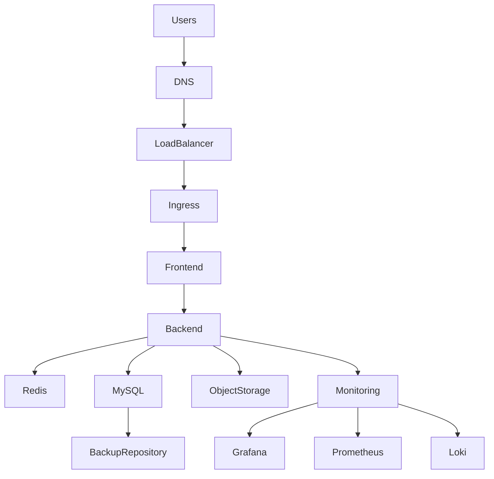

---

## End-to-End Deployment Lifecycle

```text
Planning

↓

Development

↓

CI Pipeline

↓

Testing

↓

Security Scan

↓

Artifact

↓

Deployment

↓

Monitoring

↓

Maintenance
```

---

# 10. Lessons Learned

Implementasi deployment modern memberikan beberapa manfaat utama.

---

## Technical Benefits

- Deployment lebih cepat
- Rollback lebih mudah
- Monitoring lebih lengkap
- Skalabilitas meningkat
- Infrastruktur lebih konsisten

---

## Operational Benefits

- Downtime berkurang
- Risiko human error menurun
- Audit lebih mudah
- Release lebih terkontrol
- Pemulihan insiden lebih cepat

---

## Continuous Improvement

Proses deployment dievaluasi secara berkala berdasarkan:

- Incident Review
- Deployment Metrics
- Performance Trend
- Security Assessment
- Feedback Tim Operasional

---

# 11. Final Recommendations

Rekomendasi untuk pengembangan deployment berikutnya.

---

## Short-Term

- Meningkatkan otomatisasi pipeline
- Menambahkan dashboard operasional
- Menyempurnakan alerting
- Memperluas smoke test otomatis

---

## Medium-Term

- Implementasi GitOps
- Canary Deployment penuh
- Service Mesh
- Centralized Policy Management

---

## Long-Term

- Multi-Region Active-Active
- Self-Healing Automation
- AI-Assisted Capacity Planning
- Predictive Incident Detection
- Fully Autonomous Deployment

---

# 12. Conclusion

Dokumen **24 – Deployment** mendefinisikan arsitektur deployment Parakita secara menyeluruh, mulai dari penyusunan container, orkestrasi Kubernetes, strategi CI/CD, pengelolaan konfigurasi, keamanan, observability, backup dan disaster recovery, hingga prosedur operasional deployment.

Arsitektur ini dibangun berdasarkan prinsip **Cloud Native**, **Containerization**, **Infrastructure as Code**, **Continuous Delivery**, **Security by Design**, dan **Operational Excellence**, sehingga mampu mendukung kebutuhan operasional sistem klinik gigi yang membutuhkan ketersediaan tinggi, keamanan data, kemudahan pemeliharaan, dan skalabilitas jangka panjang.

Dengan selesainya Part 12, dokumen **24 – Deployment** telah mencakup seluruh aspek penting deployment lifecycle, mulai dari perencanaan hingga operasional berkelanjutan, serta menjadi acuan utama bagi tim Development, DevOps, QA, Security, dan Operations dalam mengelola deployment Parakita secara konsisten dan terdokumentasi.

---

# Document Completion

**Document:** 24 – Deployment

**Status:** ✅ Completed

## Coverage Summary

- ✅ Deployment Architecture
- ✅ Docker & Containerization
- ✅ Kubernetes Deployment
- ✅ CI/CD Pipeline
- ✅ Environment Configuration
- ✅ BPMN Deployment Process
- ✅ Security Deployment
- ✅ Monitoring & Observability
- ✅ Backup & Disaster Recovery
- ✅ Deployment Checklist
- ✅ Architecture Decision Records (ADR)
- ✅ Operational Readiness & Future Roadmap

---

**End of Document**

**24 – Deployment — COMPLETED**