# Parakita Software Architecture Document (SAD)

# 25 - Security

| Document Information | |
|----------------------|----------------------------------------------|
| Project | Parakita - Dental Clinic Management System |
| Document | 25 - Security |
| Part | 1 of 12 |
| Version | 1.0.0 |
| Status | Draft |
| Document Type | Security Architecture Specification |
| Architecture Style | Clean Architecture + Domain Driven Design + Modular Monolith |
| Frontend | Next.js + TypeScript |
| Backend | Express.js + TypeScript |
| Database | MySQL |
| Authentication | JWT + RBAC |
| Last Updated | July 2026 |

---

# Table of Contents (Part 1)

1. Introduction
2. Purpose
3. Security Objectives
4. Security Principles
5. Security Architecture Overview
6. Defense in Depth Strategy
7. Trust Boundaries
8. Threat Model Overview
9. Security Domains
10. Security Components
11. Security Responsibilities
12. Security Standards
13. Security Checklist
14. Summary

---

# 1. Introduction

## 1.1 Overview

Security merupakan fondasi utama dalam pengembangan Parakita Dental Clinic Management System. Sistem ini mengelola berbagai informasi sensitif seperti identitas pasien, rekam medis elektronik (EMR), transaksi keuangan, data pengguna, dan konfigurasi operasional klinik.

Dokumen Security Architecture mendefinisikan standar keamanan yang diterapkan pada seluruh modul sistem untuk memastikan:

- Kerahasiaan (Confidentiality)
- Integritas (Integrity)
- Ketersediaan (Availability)
- Akuntabilitas (Accountability)
- Auditability
- Compliance

Seluruh desain keamanan mengikuti prinsip **Security by Design**, **Least Privilege**, dan **Zero Trust Architecture**, sehingga keamanan menjadi bagian dari arsitektur sejak tahap perancangan, bukan hanya tambahan pada tahap implementasi.

---

## 1.2 Background

Sistem informasi klinik merupakan target potensial terhadap berbagai ancaman keamanan, seperti:

- Pencurian data pasien
- Kebocoran rekam medis
- Penyalahgunaan hak akses
- Manipulasi transaksi keuangan
- Serangan terhadap API
- Malware dan ransomware
- Insider Threat
- Credential Theft

Karena itu, Parakita menerapkan keamanan berlapis pada seluruh lapisan sistem mulai dari pengguna hingga infrastruktur.

---

## 1.3 Design Philosophy

Prinsip utama keamanan pada Parakita meliputi:

- Security by Design
- Defense in Depth
- Zero Trust
- Principle of Least Privilege
- Secure by Default
- Privacy by Design
- Fail Secure
- Immutable Audit Trail
- Continuous Monitoring

---

# 2. Purpose

Dokumen ini bertujuan untuk menjadi standar implementasi keamanan pada seluruh komponen sistem Parakita.

Dokumen digunakan oleh:

- Solution Architect
- Backend Developer
- Frontend Developer
- DevOps Engineer
- Infrastructure Engineer
- QA Security Tester
- IT Auditor

Dokumen ini menjadi referensi utama untuk implementasi keamanan aplikasi, API, database, jaringan, deployment, serta operasional sistem.

---

# 3. Security Objectives

Security Architecture dikembangkan untuk mencapai tujuan berikut.

## 3.1 Confidentiality

Menjamin bahwa data hanya dapat diakses oleh pengguna yang memiliki hak akses.

Contoh:

- Data EMR hanya dapat diakses oleh tenaga medis yang berwenang.
- Informasi finansial hanya dapat diakses oleh Finance dan Owner.

---

## 3.2 Integrity

Menjamin bahwa data tidak dapat dimodifikasi tanpa otorisasi.

Contoh:

- Invoice yang telah dibayar tidak dapat diubah.
- Audit Log tidak dapat dimodifikasi.

---

## 3.3 Availability

Menjamin sistem tetap tersedia selama jam operasional klinik.

Target:

- High Availability
- Automatic Recovery
- Backup Strategy
- Disaster Recovery

---

## 3.4 Accountability

Seluruh aktivitas pengguna harus dapat ditelusuri.

Setiap aktivitas mencatat:

- User
- Branch
- IP Address
- Device
- Timestamp
- Action

---

## 3.5 Compliance

Mendukung kebutuhan kepatuhan terhadap standar keamanan dan perlindungan data yang berlaku.

---

# 4. Security Principles

Seluruh modul mengikuti prinsip keamanan berikut.

| Principle | Description |
|-----------|-------------|
| Least Privilege | Hak akses minimum sesuai kebutuhan |
| Need to Know | Data hanya diberikan jika diperlukan |
| Zero Trust | Tidak ada entitas yang dipercaya secara otomatis |
| Secure by Default | Konfigurasi awal selalu aman |
| Fail Secure | Kegagalan sistem tidak membuka celah keamanan |
| Defense in Depth | Perlindungan berlapis |
| Audit by Default | Seluruh aktivitas dicatat |
| Immutable Record | Data audit tidak dapat dimodifikasi |

---

# 5. Security Architecture Overview

Arsitektur keamanan diterapkan pada setiap lapisan sistem.

```text
                 Internet
                     │
                     ▼
              HTTPS / TLS
                     │
                     ▼
          Reverse Proxy / Firewall
                     │
                     ▼
            Authentication Layer
                     │
                     ▼
             Authorization (RBAC)
                     │
                     ▼
            Application Services
                     │
                     ▼
             Domain Layer (DDD)
                     │
                     ▼
             Repository Layer
                     │
                     ▼
             MySQL Database
                     │
                     ▼
         Backup & Audit Repository
```

---

## Security Layers

| Layer | Protection |
|--------|------------|
| Network | Firewall, HTTPS |
| Transport | TLS Encryption |
| Identity | JWT Authentication |
| Authorization | RBAC |
| Application | Validation & Business Rules |
| Data | Encryption & Backup |
| Audit | Immutable Audit Trail |
| Infrastructure | Monitoring & Logging |

---

# 6. Defense in Depth Strategy

Parakita menggunakan pendekatan **Defense in Depth**, yaitu perlindungan berlapis pada seluruh komponen.

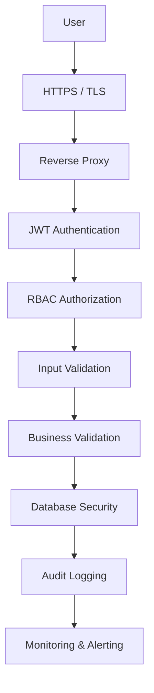

---

## Layer Protection

| Layer | Security Control |
|--------|------------------|
| Network | Firewall |
| Transport | TLS |
| Identity | JWT |
| Authorization | RBAC |
| Validation | DTO Validation |
| Domain | Business Rules |
| Database | Least Privilege |
| Logging | Audit Trail |
| Monitoring | SIEM Ready |

---

# 7. Trust Boundaries

Parakita membagi sistem ke dalam beberapa Trust Boundary untuk membatasi akses antar komponen.

```text
┌────────────────────────────┐
│        Internet Zone        │
└─────────────┬───────────────┘
              │
              ▼
┌────────────────────────────┐
│      Reverse Proxy Zone    │
└─────────────┬───────────────┘
              │
              ▼
┌────────────────────────────┐
│    Application Zone        │
│  Next.js + Express API     │
└─────────────┬───────────────┘
              │
              ▼
┌────────────────────────────┐
│      Database Zone         │
│          MySQL             │
└─────────────┬───────────────┘
              │
              ▼
┌────────────────────────────┐
│ Backup & Monitoring Zone   │
└────────────────────────────┘
```

Seluruh komunikasi antar zona harus menggunakan mekanisme autentikasi dan otorisasi yang sesuai.

---

# 8. Threat Model Overview

Ancaman keamanan yang menjadi perhatian dalam Parakita meliputi:

| Threat | Mitigation |
|---------|------------|
| Credential Theft | JWT, Password Hashing |
| SQL Injection | Parameterized Query, ORM |
| XSS | Output Encoding |
| CSRF | JWT + SameSite Cookie (opsional) |
| Broken Access Control | RBAC |
| Brute Force | Rate Limiting |
| Session Hijacking | Token Expiration |
| Data Leakage | Encryption |
| Insider Threat | Audit Trail |
| Ransomware | Backup & Recovery |

---

## STRIDE Mapping

| Category | Example |
|----------|---------|
| Spoofing | Credential Theft |
| Tampering | Invoice Modification |
| Repudiation | Denial of Action |
| Information Disclosure | EMR Leak |
| Denial of Service | API Flooding |
| Elevation of Privilege | Unauthorized Role Escalation |

---

# 9. Security Domains

Keamanan diterapkan pada beberapa domain utama.

| Domain | Description |
|---------|-------------|
| Identity Security | Authentication & Session |
| Access Security | RBAC |
| API Security | REST API Protection |
| Application Security | Secure Coding |
| Database Security | Data Protection |
| Infrastructure Security | Server & Network |
| Audit Security | Logging |
| Operational Security | Monitoring & Incident Response |

---

# 10. Security Components

Komponen keamanan utama pada Parakita.

| Component | Purpose |
|-----------|---------|
| JWT Authentication | Identitas pengguna |
| RBAC Engine | Hak akses |
| Password Hashing | Proteksi kredensial |
| Audit Logger | Pencatatan aktivitas |
| Rate Limiter | Perlindungan brute force |
| Validation Layer | Validasi input |
| TLS | Enkripsi komunikasi |
| Backup Service | Pemulihan data |
| Monitoring Service | Deteksi insiden |
| Secret Management | Penyimpanan kredensial aplikasi |

---

# 11. Security Responsibilities

| Component | Responsibility |
|-----------|----------------|
| Frontend | Input Validation, Secure Storage |
| Backend API | Authentication & Authorization |
| Domain Layer | Business Validation |
| Repository | Safe Database Access |
| Database | Access Control |
| DevOps | Infrastructure Security |
| Security Auditor | Compliance Review |
| System Administrator | Operational Security |

---

# 12. Security Standards

Parakita mengacu pada praktik terbaik dan standar berikut.

| Standard | Purpose |
|----------|---------|
| OWASP Top 10 | Application Security |
| OWASP ASVS | Verification Standard |
| CWE | Secure Coding Reference |
| NIST Cybersecurity Framework | Risk Management |
| ISO/IEC 27001 | Information Security Management |
| CIS Benchmarks | Infrastructure Hardening |

Standar ini menjadi acuan dalam proses desain, implementasi, pengujian, dan audit keamanan.

---

# 13. Security Checklist

## Architecture

- Security by Design diterapkan
- Defense in Depth diterapkan
- Zero Trust diterapkan
- Trust Boundary didefinisikan

---

## Identity

- JWT Authentication
- RBAC
- Least Privilege
- Session Timeout

---

## Application

- DTO Validation
- Input Sanitization
- Business Validation
- Audit Logging

---

## Database

- Parameterized Query
- Least Privilege Account
- Backup
- Encryption Ready

---

## Infrastructure

- HTTPS Only
- Firewall
- Reverse Proxy
- Monitoring
- Centralized Logging

---

# 14. Summary

Part 1 mendefinisikan fondasi **Security Architecture** untuk Parakita Dental Clinic Management System. Dokumen ini menetapkan tujuan keamanan, prinsip desain, arsitektur berlapis, trust boundary, domain keamanan, komponen inti, tanggung jawab setiap lapisan, serta standar keamanan yang menjadi acuan implementasi. Dengan pendekatan **Security by Design**, **Defense in Depth**, **Zero Trust**, dan **Least Privilege**, seluruh modul Parakita dirancang untuk melindungi data klinik, rekam medis, transaksi finansial, serta aktivitas pengguna secara menyeluruh sekaligus mendukung audit, kepatuhan, dan pengembangan sistem di masa depan.

---

**End of Part 1**

**Next Part**

**Part 2 — Authentication & Identity Security**

# Parakita Software Architecture Document (SAD)

# 25 - Security

| Document Information | |
|----------------------|----------------------------------------------|
| Project | Parakita - Dental Clinic Management System |
| Document | 25 - Security |
| Part | 2 of 12 |
| Version | 1.0.0 |
| Status | Draft |
| Document Type | Security Architecture Specification |
| Architecture Style | Clean Architecture + Domain Driven Design + Modular Monolith |
| Frontend | Next.js + TypeScript |
| Backend | Express.js + TypeScript |
| Database | MySQL |
| Authentication | JWT + RBAC |
| Last Updated | July 2026 |

---

# Table of Contents (Part 2)

1. Identity Management
2. Authentication Architecture
3. User Identity Model
4. JWT Authentication
5. Access Token
6. Refresh Token
7. Session Management
8. Password Security Policy
9. Multi-Factor Authentication (MFA) Ready
10. Login Flow
11. Logout Flow
12. Token Lifecycle
13. Device Management
14. Credential Storage
15. Authentication Sequence Diagram
16. Authentication Checklist
17. Summary

---

# 1. Identity Management

## Overview

Identity Management bertanggung jawab memastikan setiap pengguna yang mengakses Parakita dapat diidentifikasi secara unik sebelum memperoleh akses ke sistem.

Setiap identitas pengguna terdiri dari:

- User Account
- Role
- Branch Assignment
- Status
- Credential
- Session
- Authentication History

Seluruh proses autentikasi dilakukan sebelum proses Authorization (RBAC).

---

## Identity Components

| Component | Description |
|-----------|-------------|
| User | Identitas utama pengguna |
| Credential | Username & Password |
| Role | Hak akses |
| Branch | Cabang aktif |
| Session | Login aktif |
| Device | Informasi perangkat |
| Authentication Log | Riwayat login |

---

# 2. Authentication Architecture

Authentication menggunakan pendekatan stateless berbasis JWT.

```text
             User

               │

               ▼

        Login Endpoint

               │

               ▼

 Password Verification

               │

               ▼

      Generate JWT

      + Refresh Token

               │

               ▼

      Authenticated User

               │

               ▼

 Protected REST API
```

---

## Authentication Layers

| Layer | Responsibility |
|--------|----------------|
| Login API | Verifikasi identitas |
| Password Hasher | Validasi password |
| JWT Service | Membuat token |
| Session Service | Mengelola sesi |
| Audit Logger | Mencatat login |

---

# 3. User Identity Model

Setiap akun memiliki identitas unik.

## Identity Attributes

| Field | Description |
|--------|-------------|
| User ID | UUID |
| Username | Login ID |
| Email | Email pengguna |
| Password Hash | Password terenkripsi |
| Role ID | Hak akses |
| Branch ID | Cabang aktif |
| Status | Active / Suspended |
| Last Login | Login terakhir |

---

## User Status

| Status | Meaning |
|----------|---------|
| Active | Dapat login |
| Inactive | Tidak dapat login |
| Suspended | Diblokir sementara |
| Locked | Terlalu banyak percobaan login |
| Deleted | Soft Delete |

---

# 4. JWT Authentication

Parakita menggunakan JSON Web Token (JWT) sebagai mekanisme autentikasi utama.

JWT digunakan untuk:

- REST API
- Mobile API
- Internal Service API

---

## JWT Payload

```json
{
  "sub": "user-id",
  "username": "doctor01",
  "role": "Doctor",
  "branchId": "UUID",
  "sessionId": "UUID",
  "iat": 1722400000,
  "exp": 1722403600
}
```

---

## JWT Characteristics

| Item | Value |
|------|-------|
| Algorithm | HS256 / RS256 Ready |
| Expiration | 60 Minutes |
| Signed | Yes |
| Encrypted | Optional |
| Revocable | Yes |

---

# 5. Access Token

Access Token digunakan untuk mengakses API.

Karakteristik:

- Berlaku singkat
- Tidak disimpan di database
- Harus dikirim pada setiap request

Header:

```http
Authorization: Bearer <access_token>
```

---

## Access Token Rules

- Berlaku selama 60 menit.
- Tidak boleh digunakan setelah logout.
- Harus diverifikasi pada setiap request.
- Tidak boleh disimpan di Local Storage apabila menggunakan arsitektur berbasis cookie.

---

# 6. Refresh Token

Refresh Token digunakan untuk memperoleh Access Token baru tanpa login ulang.

---

## Characteristics

| Property | Value |
|----------|-------|
| Expiration | 7 Days |
| Stored | Database |
| Revocable | Yes |
| Rotation | Enabled |

---

## Refresh Flow

```text
Access Token Expired

↓

Refresh Token Validation

↓

Generate New Access Token

↓

Update Refresh Token

↓

Continue Session
```

---

## Refresh Token Rules

- Satu refresh token untuk satu sesi.
- Token lama di-revoke setelah rotasi.
- Refresh token yang dicuri tidak boleh dapat digunakan kembali.

---

# 7. Session Management

Walaupun JWT bersifat stateless, Parakita tetap mengelola sesi pengguna.

Session digunakan untuk:

- Logout
- Device Tracking
- Session Revocation
- Audit

---

## Session Attributes

| Field | Description |
|--------|-------------|
| Session ID | UUID |
| User ID | Pemilik sesi |
| Device | Browser / Mobile |
| IP Address | Login IP |
| Login Time | Waktu login |
| Expired Time | Masa berlaku |
| Status | Active / Revoked |

---

## Session Lifecycle

```text
Login

↓

Session Created

↓

JWT Issued

↓

API Access

↓

Logout / Expired

↓

Session Revoked
```

---

# 8. Password Security Policy

Password harus memenuhi standar keamanan berikut.

## Minimum Requirement

- Minimal 8 karakter
- Mengandung huruf besar
- Mengandung huruf kecil
- Mengandung angka
- Mengandung karakter khusus

---

## Password Storage

Password tidak pernah disimpan dalam bentuk plaintext.

Menggunakan:

- bcrypt
- Salt
- Configurable Cost Factor

---

## Password Rules

- Tidak boleh sama dengan username.
- Tidak boleh menggunakan password lama.
- Password reset menghasilkan token sementara.
- Password tidak pernah dikirim kembali melalui API.

---

# 9. Multi-Factor Authentication (MFA) Ready

Versi awal Parakita menggunakan autentikasi satu faktor (password), namun arsitektur telah disiapkan untuk MFA.

Metode yang dapat didukung:

- TOTP Authenticator
- Email OTP
- SMS OTP
- Hardware Token (Future)

---

## MFA Flow

```text
Username + Password

↓

Credential Valid

↓

OTP Challenge

↓

OTP Verification

↓

Login Success
```

---

# 10. Login Flow

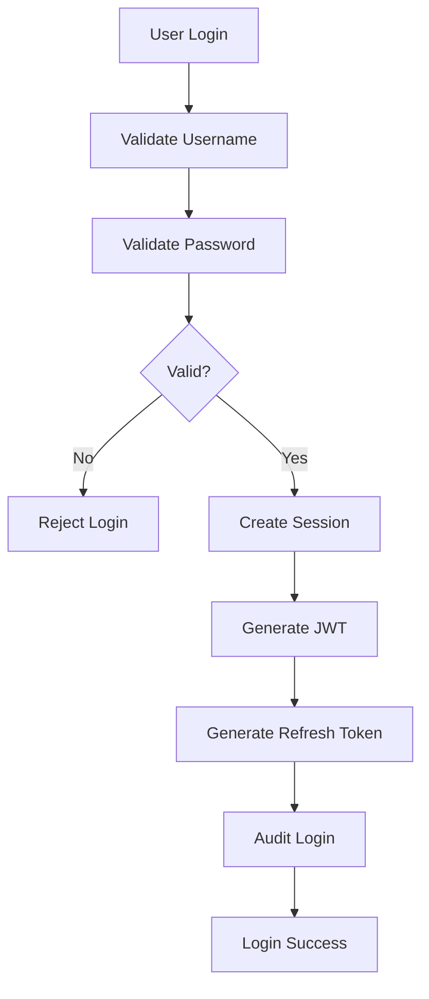

---

## Failed Login

Apabila autentikasi gagal:

- Tambahkan Login Attempt.
- Catat Audit Log.
- Terapkan Rate Limiting.
- Lock Account setelah batas tertentu.

---

# 11. Logout Flow

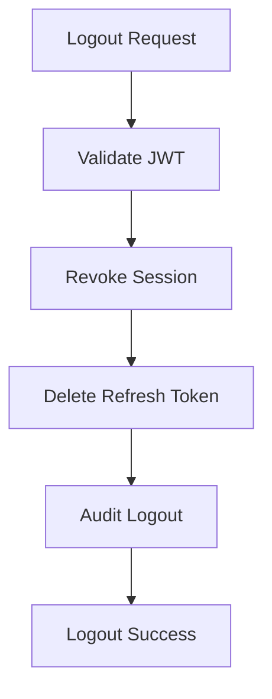

---

# 12. Token Lifecycle

```text
User Login

↓

Access Token

↓

API Access

↓

Expired

↓

Refresh Token

↓

New Access Token

↓

Continue

↓

Logout

↓

Revoke Session
```

---

## Token Expiration

| Token | Duration |
|---------|----------|
| Access Token | 60 Minutes |
| Refresh Token | 7 Days |

---

# 13. Device Management

Setiap sesi menyimpan informasi perangkat.

Informasi yang dicatat:

- Browser
- Operating System
- Device Type
- IP Address
- User Agent
- Login Time

---

## Device Policy

- Setiap login menghasilkan Session baru.
- Administrator dapat mencabut Session tertentu.
- Pengguna dapat melihat daftar perangkat aktif (future enhancement).

---

# 14. Credential Storage

## Password

Menggunakan:

- bcrypt
- Salt
- Hash

---

## Secret Key

Disimpan melalui Environment Variable.

Contoh:

```text
JWT_SECRET

JWT_REFRESH_SECRET

PASSWORD_SALT_ROUNDS
```

---

## Secret Management Rules

- Tidak boleh di-hardcode.
- Tidak boleh disimpan di repository Git.
- Environment Production menggunakan Secret Management.

---

# 15. Authentication Sequence Diagram

```mermaid
sequenceDiagram

participant User
participant Frontend
participant AuthAPI
participant UserRepository
participant JWTService
participant SessionRepository

User->>Frontend: Login

Frontend->>AuthAPI: POST /auth/login

AuthAPI->>UserRepository: Find User

UserRepository-->>AuthAPI: User

AuthAPI->>AuthAPI: Verify Password

AuthAPI->>SessionRepository: Create Session

SessionRepository-->>AuthAPI

AuthAPI->>JWTService: Generate Token

JWTService-->>AuthAPI

AuthAPI-->>Frontend: JWT + Refresh Token

Frontend-->>User: Login Success
```

---

# 16. Authentication Checklist

## Identity

- Unique User ID
- Role Assignment
- Branch Assignment
- User Status Validation

---

## Authentication

- JWT Authentication
- Refresh Token
- Password Hashing
- Session Tracking

---

## Session

- Session Revocation
- Device Tracking
- Login History
- Logout History

---

## Password

- bcrypt
- Salt
- Complexity Validation
- Password Reset

---

## Security

- Audit Log
- Rate Limiting
- Account Lockout
- Token Expiration
- Secret Management

---

# 17. Summary

Part 2 mendefinisikan mekanisme **Authentication & Identity Security** pada Parakita. Arsitektur menggunakan **JWT Authentication**, **Refresh Token Rotation**, **Session Management**, dan **RBAC Ready** untuk memastikan setiap pengguna teridentifikasi secara unik sebelum mengakses sistem. Seluruh kredensial diamankan menggunakan **bcrypt**, sesi dapat dicabut (revoked), aktivitas login dan logout diaudit, serta desain telah dipersiapkan untuk mendukung **Multi-Factor Authentication (MFA)** dan pengelolaan perangkat pada pengembangan berikutnya.

---

**End of Part 2**

**Next Part**

**Part 3 — Authorization & RBAC**

# Parakita Software Architecture Document (SAD)

# 25 - Security

| Document Information | |
|----------------------|----------------------------------------------|
| Project | Parakita - Dental Clinic Management System |
| Document | 25 - Security |
| Part | 3 of 12 |
| Version | 1.0.0 |
| Status | Draft |
| Document Type | Security Architecture Specification |
| Architecture Style | Clean Architecture + Domain Driven Design + Modular Monolith |
| Frontend | Next.js + TypeScript |
| Backend | Express.js + TypeScript |
| Database | MySQL |
| Authentication | JWT + RBAC |
| Last Updated | July 2026 |

---

# Table of Contents (Part 3)

1. Authorization Overview
2. Authorization Architecture
3. Role Based Access Control (RBAC)
4. User Role Model
5. Permission Model
6. Module Authorization Matrix
7. Resource Level Authorization
8. Branch Isolation
9. Row-Level Security
10. Approval Matrix
11. API Authorization
12. UI Authorization
13. Authorization Flow
14. Sequence Diagram
15. Authorization Checklist
16. Summary

---

# 1. Authorization Overview

## Overview

Authorization menentukan **apa yang boleh dilakukan** oleh pengguna setelah berhasil melewati proses Authentication.

Parakita menerapkan **Role Based Access Control (RBAC)** sebagai mekanisme utama pengendalian hak akses.

Setiap request akan melalui tahapan berikut:

```text
Authentication

↓

Session Validation

↓

JWT Validation

↓

Role Validation

↓

Permission Validation

↓

Business Validation

↓

Resource Access
```

Authorization dilakukan pada:

- API Endpoint
- Application Service
- Domain Service
- User Interface
- Report Access
- Menu Navigation

---

## Authorization Objectives

- Mencegah akses tanpa hak.
- Mengisolasi data antar cabang.
- Mendukung Approval Workflow.
- Mendukung Audit Trail.
- Meminimalkan risiko privilege escalation.

---

# 2. Authorization Architecture

```text
                 User

                  │

                  ▼

          JWT Authentication

                  │

                  ▼

          Authorization Guard

                  │

                  ▼

          Role Verification

                  │

                  ▼

      Permission Verification

                  │

                  ▼

      Branch Validation

                  │

                  ▼

      Business Rule Validation

                  │

                  ▼

          Resource Access
```

---

## Authorization Layers

| Layer | Responsibility |
|--------|----------------|
| JWT Guard | Memvalidasi token |
| Role Guard | Memvalidasi role |
| Permission Guard | Memvalidasi permission |
| Branch Guard | Memvalidasi cabang |
| Domain Policy | Validasi aturan bisnis |
| Audit Logger | Mencatat akses |

---

# 3. Role Based Access Control (RBAC)

Parakita menggunakan RBAC untuk memisahkan hak akses berdasarkan peran pengguna.

## Core Roles

| Role | Description |
|------|-------------|
| Administrator | Akses penuh |
| Owner | Monitoring & Reporting |
| Clinic Manager | Operasional cabang |
| Doctor | Pelayanan medis |
| Dentist Assistant | Pendamping dokter |
| Nurse | Tindakan keperawatan |
| Registration | Registrasi pasien |
| Cashier | Billing & Payment |
| Finance | Keuangan |
| Inventory Staff | Gudang |
| Laboratory | Laboratorium |
| Radiology | Radiologi |

---

## RBAC Principles

- User dapat memiliki satu atau lebih Role.
- Role terdiri atas kumpulan Permission.
- Permission diberikan berdasarkan kebutuhan pekerjaan.
- Semua perubahan Role dicatat pada Audit Trail.

---

# 4. User Role Model

```text
User

│

├── Role

│      ├── Permission

│      ├── Permission

│      └── Permission

│

└── Branch Assignment
```

---

## Example

```text
User

↓

Cashier

↓

Billing Module

↓

Create Invoice

↓

Receive Payment

↓

Refund (Need Approval)
```

---

# 5. Permission Model

Permission merupakan unit terkecil hak akses.

Format standar:

```text
module.resource.action
```

Contoh:

```text
patient.read

patient.create

patient.update

patient.delete

billing.invoice.create

billing.invoice.read

billing.payment.create

billing.refund.approve

inventory.stock.adjust

report.finance.view
```

---

## CRUD Permission

| Action | Description |
|----------|-------------|
| Create | Membuat data |
| Read | Melihat data |
| Update | Mengubah data |
| Delete | Soft Delete |
| Approve | Menyetujui |
| Export | Export Data |
| Print | Cetak |
| Close | Closing |
| Void | Void |
| Refund | Refund |

---

# 6. Module Authorization Matrix

| Module | Registration | Doctor | Cashier | Finance | Manager | Admin |
|---------|--------------|---------|----------|----------|----------|-------|
| Dashboard | R | R | R | R | R | R |
| Patient | CRUD | R | R | R | CRUD | CRUD |
| Reservation | CRUD | R | R | R | CRUD | CRUD |
| Queue | CRUD | R | R | R | CRUD | CRUD |
| EMR | R | CRUD | R | R | R | CRUD |
| Billing | R | Discount | CRUD | Closing | Approval | CRUD |
| Inventory | R | R | R | R | CRUD | CRUD |
| Reporting | R | R | R | CRUD | CRUD | CRUD |
| Administration | - | - | - | R | CRUD | CRUD |

Keterangan:

- R = Read
- CRUD = Create, Read, Update, Delete

---

# 7. Resource Level Authorization

Selain berdasarkan modul, sistem juga memvalidasi hak akses terhadap resource tertentu.

Contoh:

## Invoice

```text
billing.invoice.read

billing.invoice.create

billing.invoice.update

billing.invoice.void

billing.invoice.close
```

---

## Patient

```text
patient.read

patient.update

patient.photo.upload

patient.merge
```

---

## EMR

```text
emr.create

emr.sign

emr.close

emr.reopen
```

---

# 8. Branch Isolation

Parakita mendukung operasional multi-cabang.

Setiap pengguna hanya dapat mengakses data cabang yang menjadi kewenangannya.

```mermaid
flowchart LR

User

-->

JWT

-->

Branch Validation

-->

Branch Data

-->

Access Granted
```

---

## Branch Rules

- User memiliki Branch Assignment.
- Administrator dapat mengakses seluruh cabang.
- Owner memiliki akses lintas cabang.
- Manager hanya mengakses cabangnya.
- Dokter dapat ditugaskan ke lebih dari satu cabang.

---

# 9. Row-Level Security

Selain validasi Role, sistem juga menerapkan pembatasan berdasarkan data.

Contoh:

Dokter hanya dapat melihat:

- EMR pasien yang ditanganinya.
- Jadwal praktik sendiri.
- Riwayat tindakan sendiri.

Cashier hanya dapat melihat:

- Invoice cabangnya.
- Payment cabangnya.

---

## Row-Level Validation

```text
User

↓

Role Validation

↓

Branch Validation

↓

Ownership Validation

↓

Record Access
```

---

# 10. Approval Matrix

Beberapa aktivitas memerlukan persetujuan tambahan.

| Activity | Cashier | Manager | Finance | Admin |
|----------|----------|----------|----------|-------|
| Apply Discount | ✔ | ✔ | ✖ | ✔ |
| Refund | Request | Approve | Verify | ✔ |
| Void Invoice | Request | Approve | Verify | ✔ |
| Deposit Adjustment | ✖ | Approve | ✔ | ✔ |
| Close Daily Cash | ✖ | ✔ | ✔ | ✔ |

---

## Approval Principles

- Approval tidak boleh dilakukan oleh pembuat transaksi sendiri.
- Seluruh approval dicatat.
- Approval menghasilkan Audit Log.
- Approval dapat menggunakan mekanisme dual control.

---

# 11. API Authorization

Setiap endpoint memiliki permission yang spesifik.

Contoh:

| Endpoint | Permission |
|----------|------------|
| GET /patients | patient.read |
| POST /patients | patient.create |
| GET /billing/invoices | billing.invoice.read |
| POST /billing/payments | billing.payment.create |
| POST /billing/refunds | billing.refund.create |
| POST /billing/refunds/{id}/approve | billing.refund.approve |
| GET /reports/finance | report.finance.view |

---

## Authorization Middleware

```text
Incoming Request

↓

JWT Guard

↓

Role Guard

↓

Permission Guard

↓

Branch Guard

↓

Controller
```

---

# 12. UI Authorization

Frontend menggunakan permission yang sama dengan Backend.

Komponen UI yang dikontrol:

- Sidebar Menu
- Dashboard Widget
- Button
- Form
- Action Menu
- Export Button
- Print Button
- Approval Button

---

## Example

```text
Permission:

billing.invoice.create

↓

Show Button

"Create Invoice"
```

Tanpa permission tersebut, tombol tidak akan ditampilkan.

---

# 13. Authorization Flow

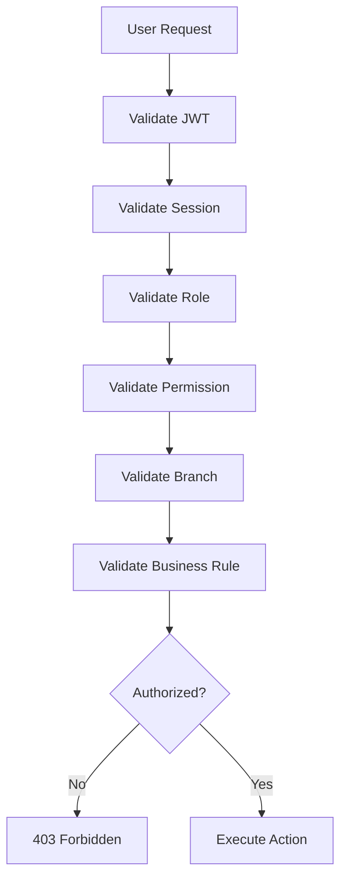

---

# 14. Sequence Diagram

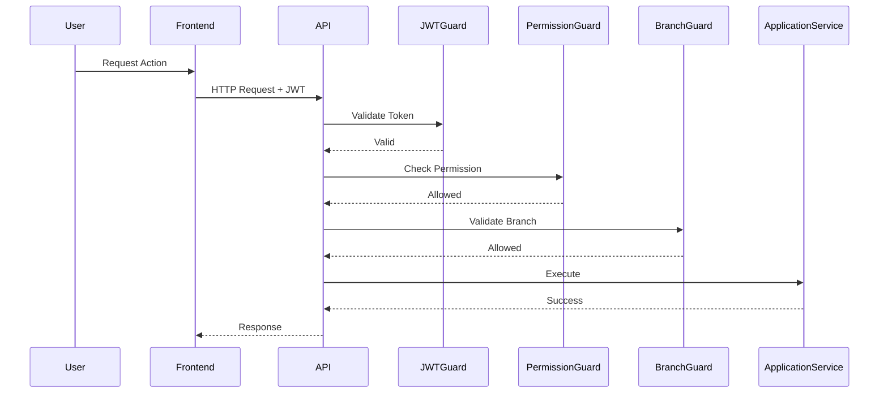

---

# 15. Authorization Checklist

## Identity

- JWT Validation
- Session Validation
- User Status Validation

---

## RBAC

- Role Validation
- Permission Validation
- Least Privilege
- Role Assignment

---

## Resource

- Resource Permission
- Ownership Validation
- Branch Validation
- Row-Level Security

---

## Approval

- Approval Matrix
- Dual Control
- Audit Trail
- Segregation of Duties

---

## UI

- Menu Authorization
- Button Authorization
- Feature Authorization
- Route Protection

---

# 16. Summary

Part 3 mendefinisikan **Authorization & Role Based Access Control (RBAC)** pada Parakita. Sistem menggunakan model **Role → Permission → Resource** untuk mengendalikan akses pengguna terhadap modul, data, API, dan antarmuka aplikasi. Selain validasi berbasis role, Parakita menerapkan **Branch Isolation**, **Row-Level Security**, **Approval Matrix**, serta **Least Privilege Principle** untuk memastikan setiap pengguna hanya dapat mengakses data dan menjalankan operasi sesuai kewenangannya. Seluruh proses otorisasi dicatat dalam **Audit Trail** guna mendukung keamanan, kepatuhan, dan investigasi operasional.

---

**End of Part 3**

**Next Part**

**Part 4 — API Security**

# Parakita Software Architecture Document (SAD)

# 25 - Security

| Document Information | |
|----------------------|----------------------------------------------|
| Project | Parakita - Dental Clinic Management System |
| Document | 25 - Security |
| Part | 4 of 12 |
| Version | 1.0.0 |
| Status | Draft |
| Document Type | Security Architecture Specification |
| Architecture Style | Clean Architecture + Domain Driven Design + Modular Monolith |
| Frontend | Next.js + TypeScript |
| Backend | Express.js + TypeScript |
| Database | MySQL |
| Authentication | JWT + RBAC |
| Last Updated | July 2026 |

---

# Table of Contents (Part 4)

1. API Security Overview
2. Secure Communication (HTTPS & TLS)
3. API Authentication
4. API Authorization
5. Request Validation
6. Input Sanitization
7. Output Encoding
8. CORS Policy
9. CSRF Protection
10. API Rate Limiting
11. API Gateway Ready Architecture
12. Webhook Security
13. API Security Headers
14. API Security Flow
15. API Security Checklist
16. Summary

---

# 1. API Security Overview

## Overview

REST API merupakan pintu utama komunikasi antara Frontend, Mobile Application, serta layanan internal Parakita.

Seluruh endpoint API harus memenuhi prinsip:

- Secure by Default
- Authentication First
- Authorization Always
- Validate Every Request
- Audit Every Action
- Fail Secure

API tidak mempercayai request apa pun tanpa proses autentikasi dan validasi yang memadai.

---

## Security Objectives

- Mencegah akses tanpa otorisasi.
- Menjamin integritas request.
- Melindungi data sensitif selama transmisi.
- Mengurangi risiko eksploitasi API.
- Mendukung audit dan monitoring.

---

# 2. Secure Communication (HTTPS & TLS)

Seluruh komunikasi menggunakan HTTPS.

```text
Client

↓

HTTPS

↓

Reverse Proxy

↓

Express API
```

---

## TLS Requirements

| Item | Value |
|------|-------|
| Protocol | TLS 1.2 Minimum |
| Recommended | TLS 1.3 |
| HTTP | Redirect ke HTTPS |
| HSTS | Enabled |
| Certificate | Trusted CA |

---

## TLS Rules

- HTTP tidak diperbolehkan pada Production.
- Sertifikat harus valid.
- Self-signed hanya untuk Development.
- Cipher lama harus dinonaktifkan.

---

# 3. API Authentication

Semua endpoint menggunakan JWT Authentication kecuali endpoint publik yang telah ditentukan.

Header:

```http
Authorization: Bearer <access_token>
```

---

## Authentication Flow

```text
Incoming Request

↓

JWT Validation

↓

Session Validation

↓

User Status Validation

↓

Continue
```

---

## Public Endpoint

Contoh endpoint yang dapat diakses tanpa JWT:

- Login
- Refresh Token
- Health Check
- Public Configuration

Semua endpoint lainnya memerlukan autentikasi.

---

# 4. API Authorization

Setelah Authentication berhasil, sistem melakukan Authorization.

Tahapan:

```text
JWT

↓

Role Validation

↓

Permission Validation

↓

Branch Validation

↓

Business Validation

↓

Controller
```

---

## Authorization Policy

| Validation | Required |
|------------|----------|
| JWT | ✔ |
| Role | ✔ |
| Permission | ✔ |
| Branch | ✔ |
| Business Rule | ✔ |

---

# 5. Request Validation

Seluruh request divalidasi menggunakan DTO (`class-validator`).

---

## Validation Rules

- UUID Validation
- Enum Validation
- String Length
- Numeric Range
- Date Validation
- Required Field Validation

---

## Example DTO

```typescript
class CreatePatientDto {

    @IsString()
    fullName: string;

    @IsDateString()
    birthDate: string;

    @IsEnum(Gender)
    gender: Gender;

}
```

---

## Validation Pipeline

```text
HTTP Request

↓

DTO Validation

↓

Business Validation

↓

Application Service
```

---

# 6. Input Sanitization

Seluruh input pengguna harus dibersihkan sebelum diproses.

---

## Sanitization Rules

- Trim whitespace.
- Normalisasi karakter Unicode bila diperlukan.
- Tolak karakter kontrol yang tidak valid.
- Escape karakter berbahaya sesuai konteks.
- Validasi panjang input.
- Validasi format.

---

## Protected Input

- Search Keyword
- Patient Name
- Notes
- Doctor Notes
- Invoice Remarks
- EMR Narrative

---

# 7. Output Encoding

Output harus di-encode sesuai konteks untuk mencegah XSS.

---

## Context

| Context | Protection |
|----------|------------|
| HTML | HTML Encoding |
| JSON | JSON Serialization |
| URL | URL Encoding |
| Attribute | Attribute Encoding |

---

## Response Rules

- Jangan mengembalikan stack trace.
- Jangan mengembalikan SQL Error.
- Jangan mengembalikan Secret.
- Gunakan pesan error standar.

---

# 8. CORS Policy

Cross-Origin Resource Sharing (CORS) dikonfigurasi secara eksplisit.

---

## Allowed Origins

Contoh:

```text
https://app.parakita.id

https://admin.parakita.id

https://mobile.parakita.id
```

---

## CORS Policy

| Setting | Value |
|----------|-------|
| Origin | Whitelist |
| Methods | GET, POST, PATCH, DELETE |
| Credentials | Allowed (jika diperlukan) |
| Wildcard Origin | Tidak digunakan pada Production |

---

# 9. CSRF Protection

Karena API menggunakan JWT Bearer Token, risiko CSRF lebih rendah dibanding session-cookie tradisional.

Namun apabila menggunakan HttpOnly Cookie, maka CSRF Protection harus diaktifkan.

---

## Protection Strategy

- SameSite Cookie
- CSRF Token
- Origin Validation
- Referer Validation

---

## Applicable Scenario

| Authentication | CSRF Required |
|----------------|---------------|
| Bearer Token | Tidak wajib |
| HttpOnly Cookie | Wajib |

---

# 10. API Rate Limiting

Rate limiting digunakan untuk mencegah brute force dan abuse.

---

## Default Policy

| Endpoint | Limit |
|----------|-------|
| Login | 5 request / menit / IP |
| Refresh Token | 20 request / menit |
| Search | 100 request / menit |
| Standard API | 300 request / menit |
| File Upload | 20 request / menit |

---

## Rate Limit Response

```http
429 Too Many Requests
```

---

## Protection

- IP Based
- User Based
- Endpoint Based
- Burst Protection

---

# 11. API Gateway Ready Architecture

Walaupun menggunakan Modular Monolith, API dirancang agar siap berada di belakang API Gateway.

```text
Internet

↓

API Gateway

↓

Authentication

↓

Authorization

↓

Express API

↓

Application Services
```

---

## Gateway Features

- TLS Termination
- Rate Limiting
- Request Logging
- API Key (Future)
- IP Filtering

---

# 12. Webhook Security

Webhook digunakan untuk integrasi layanan eksternal (misalnya Payment Gateway pada pengembangan berikutnya).

---

## Validation

- HMAC Signature
- Timestamp Validation
- Replay Protection
- IP Whitelist
- Event Verification

---

## Webhook Flow

```text
Webhook Request

↓

Verify Signature

↓

Validate Timestamp

↓

Validate Event

↓

Process Request
```

---

# 13. API Security Headers

Header keamanan harus dikirim pada setiap response.

---

## Recommended Headers

| Header | Purpose |
|----------|---------|
| Strict-Transport-Security | HTTPS Enforcement |
| X-Content-Type-Options | MIME Sniffing Protection |
| X-Frame-Options | Clickjacking Protection |
| Referrer-Policy | Referrer Control |
| Content-Security-Policy | XSS Mitigation |
| Permissions-Policy | Browser Feature Restriction |

---

## Example Response Header

```http
Strict-Transport-Security:
max-age=31536000

X-Content-Type-Options:
nosniff

X-Frame-Options:
DENY

Referrer-Policy:
strict-origin-when-cross-origin
```

---

# 14. API Security Flow

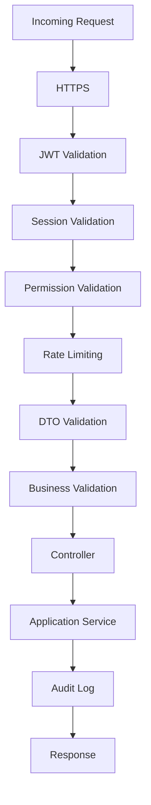

---

## API Request Lifecycle

| Step | Validation |
|------|------------|
| HTTPS | TLS |
| Authentication | JWT |
| Authorization | RBAC |
| Request | DTO Validation |
| Domain | Business Rules |
| Logging | Audit Trail |

---

# 15. API Security Checklist

## Communication

- HTTPS Only
- TLS 1.2+
- HSTS Enabled
- Trusted Certificate

---

## Authentication

- JWT Validation
- Refresh Token
- Session Validation
- Token Expiration

---

## Authorization

- RBAC
- Permission Validation
- Branch Validation
- Row-Level Security

---

## Validation

- DTO Validation
- Input Sanitization
- Output Encoding
- Standard Error Response

---

## Protection

- Rate Limiting
- CORS
- CSRF Strategy
- Security Headers
- Webhook Signature Validation

---

## Monitoring

- Audit Log
- Request Logging
- Failed Authentication Log
- API Metrics

---

# 16. Summary

Part 4 mendefinisikan mekanisme **API Security** pada Parakita yang mencakup komunikasi terenkripsi menggunakan **HTTPS/TLS**, **JWT Authentication**, **RBAC Authorization**, validasi request berbasis DTO, sanitisasi input, pengamanan output, konfigurasi CORS, strategi CSRF, Rate Limiting, keamanan Webhook, serta penggunaan Security Headers. Seluruh endpoint dirancang mengikuti prinsip **Secure by Default**, **Authentication First**, dan **Defense in Depth**, sehingga siap diimplementasikan pada arsitektur **Clean Architecture** dan mendukung integrasi melalui **API Gateway** di masa mendatang.

---

**End of Part 4**

**Next Part**

**Part 5 — Data Security**

# Parakita Software Architecture Document (SAD)

# 25 - Security

| Document Information | |
|----------------------|----------------------------------------------|
| Project | Parakita - Dental Clinic Management System |
| Document | 25 - Security |
| Part | 5 of 12 |
| Version | 1.0.0 |
| Status | Draft |
| Document Type | Security Architecture Specification |
| Architecture Style | Clean Architecture + Domain Driven Design + Modular Monolith |
| Frontend | Next.js + TypeScript |
| Backend | Express.js + TypeScript |
| Database | MySQL |
| Authentication | JWT + RBAC |
| Last Updated | July 2026 |

---

# Table of Contents (Part 5)

1. Data Security Overview
2. Data Classification
3. Sensitive Data Protection
4. Personally Identifiable Information (PII)
5. Encryption at Rest
6. Encryption in Transit
7. Database Security
8. Secret & Key Management
9. Backup Security
10. Data Retention Policy
11. Secure Data Deletion
12. Data Masking
13. Data Security Architecture
14. Data Security Checklist
15. Summary

---

# 1. Data Security Overview

## Overview

Data merupakan aset terpenting dalam Parakita. Sistem menyimpan berbagai jenis informasi yang memiliki tingkat sensitivitas berbeda, mulai dari data publik hingga rekam medis pasien.

Strategi Data Security bertujuan untuk:

- Menjaga kerahasiaan data.
- Mencegah manipulasi data.
- Melindungi data selama transmisi.
- Mengamankan data saat disimpan.
- Mendukung audit dan kepatuhan.

---

## Security Principles

- Confidentiality
- Integrity
- Availability
- Privacy by Design
- Least Privilege
- Encryption by Default
- Auditability

---

# 2. Data Classification

Seluruh data diklasifikasikan berdasarkan tingkat sensitivitas.

| Classification | Description | Example |
|---------------|-------------|---------|
| Public | Dapat diakses publik | Landing Page Configuration |
| Internal | Operasional internal | Master Data |
| Confidential | Data bisnis | Invoice, Stock |
| Restricted | Data sangat sensitif | EMR, Password Hash, Refresh Token |

---

## Classification Matrix

| Data | Classification |
|------|----------------|
| Patient Profile | Confidential |
| Medical Record | Restricted |
| Prescription | Restricted |
| Billing | Confidential |
| Finance | Confidential |
| User Credential | Restricted |
| Audit Log | Restricted |
| System Configuration | Internal |

---

# 3. Sensitive Data Protection

Data sensitif memerlukan perlindungan tambahan.

## Sensitive Data

- Medical Record
- Diagnosis
- Treatment History
- Laboratory Result
- Radiology Result
- Insurance Information
- Payment Information
- Authentication Credential

---

## Protection Strategy

| Data | Protection |
|------|------------|
| Password | bcrypt Hash |
| JWT Secret | Environment Secret |
| Refresh Token | Hash / Secure Storage |
| EMR | Database Access Control |
| Audit Log | Immutable Storage |

---

# 4. Personally Identifiable Information (PII)

PII adalah informasi yang dapat mengidentifikasi individu.

---

## PII Examples

- Patient Name
- National ID Number
- Passport Number
- Phone Number
- Email Address
- Home Address
- Date of Birth
- Emergency Contact

---

## PII Rules

- Hanya ditampilkan kepada pengguna yang berwenang.
- Tidak dicatat dalam log aplikasi.
- Tidak dikirim ke layanan pihak ketiga tanpa otorisasi.
- Tidak digunakan sebagai bagian dari URL.

---

## PII Protection

| Mechanism | Purpose |
|-----------|---------|
| RBAC | Membatasi akses |
| TLS | Melindungi transmisi |
| Audit Trail | Melacak akses |
| Data Masking | Menyembunyikan data |

---

# 5. Encryption at Rest

Data yang disimpan harus dilindungi dari akses tidak sah.

---

## Encryption Scope

| Storage | Protection |
|----------|------------|
| Database Disk | Full Disk Encryption |
| Backup | AES-256 Encryption |
| File Storage | Server Encryption |
| Secret Storage | Secret Management |

---

## Encryption Policy

- Production menggunakan encrypted storage.
- Backup selalu dienkripsi.
- Portable media harus dienkripsi.
- Database server berada pada storage terenkripsi.

---

# 6. Encryption in Transit

Seluruh komunikasi antar komponen menggunakan koneksi terenkripsi.

```text
Browser

↓

TLS

↓

Reverse Proxy

↓

Express API

↓

TLS

↓

Database (Optional Internal TLS)
```

---

## Communication Security

| Communication | Protection |
|---------------|------------|
| Browser → API | HTTPS |
| Mobile → API | HTTPS |
| API → Database | Internal Secure Network / TLS |
| Backup Transfer | Encrypted |

---

## TLS Policy

- TLS 1.2 Minimum
- TLS 1.3 Recommended
- HTTP Redirect ke HTTPS
- HSTS Enabled

---

# 7. Database Security

Database merupakan lapisan penyimpanan utama seluruh data.

---

## Database Access Rules

- Tidak dapat diakses langsung dari Internet.
- Hanya Application Server yang dapat terkoneksi.
- Menggunakan akun dengan hak akses minimum.
- Audit akses database diaktifkan.

---

## Database Security Controls

| Control | Description |
|----------|-------------|
| Least Privilege | Hak akses minimum |
| Strong Authentication | Credential aman |
| Connection Restriction | Internal Network |
| Audit Logging | Aktivitas database |
| Backup Encryption | Backup aman |

---

## Database Account Policy

| Account | Privilege |
|----------|-----------|
| Application | CRUD sesuai kebutuhan |
| Migration | Schema Modification |
| Read Only | Reporting |
| Administrator | Maintenance |

---

# 8. Secret & Key Management

Secret tidak boleh disimpan di source code.

---

## Managed Secrets

- JWT Secret
- Refresh Token Secret
- Database Password
- SMTP Password
- Storage Credential
- API Key

---

## Storage Strategy

```text
Application

↓

Environment Variable

↓

Secret Management

↓

Encrypted Storage
```

---

## Secret Rules

- Tidak di-hardcode.
- Tidak dikirim melalui email.
- Tidak dicatat pada log.
- Memiliki rotasi berkala.
- Dipisahkan per environment.

---

# 9. Backup Security

Backup merupakan bagian dari strategi keamanan data.

---

## Backup Scope

- Database
- Uploaded Files
- Configuration
- Audit Log

---

## Backup Rules

- Backup harian.
- Backup terenkripsi.
- Backup diuji secara berkala.
- Salinan backup disimpan pada lokasi berbeda.
- Backup memiliki kontrol akses.

---

## Backup Retention

| Backup | Retention |
|----------|-----------|
| Daily | 30 Hari |
| Weekly | 12 Minggu |
| Monthly | 12 Bulan |
| Yearly | 7 Tahun |

---

# 10. Data Retention Policy

Setiap jenis data memiliki kebijakan retensi.

| Data | Retention |
|------|-----------|
| Medical Record | Permanent |
| Patient Profile | Permanent |
| Billing | Permanent |
| Audit Log | Permanent |
| Login History | 2 Tahun |
| System Log | 1 Tahun |

---

## Retention Principles

- Tidak menghapus data yang diwajibkan oleh regulasi.
- Mendukung kebutuhan audit.
- Mendukung investigasi insiden.
- Menggunakan Soft Delete bila sesuai.

---

# 11. Secure Data Deletion

Data yang boleh dihapus harus melalui prosedur yang aman.

---

## Deletion Policy

- Soft Delete sebagai mekanisme utama.
- Hard Delete hanya untuk data sementara atau teknis.
- Penghapusan dicatat pada Audit Trail.
- Penghapusan memerlukan otorisasi.

---

## Deletion Flow

```text
Delete Request

↓

Authorization

↓

Soft Delete

↓

Audit Log

↓

Retention Policy
```

---

# 12. Data Masking

Data sensitif tidak selalu ditampilkan secara penuh.

---

## Example

| Data | Display |
|------|----------|
| Phone | 0812****5678 |
| Email | jo*****@mail.com |
| National ID | ********1234 |
| Credit Reference | ********9988 |

---

## Masking Rules

- Digunakan pada UI.
- Digunakan pada laporan tertentu.
- Tidak mengubah data asli.
- Berdasarkan hak akses pengguna.

---

# 13. Data Security Architecture

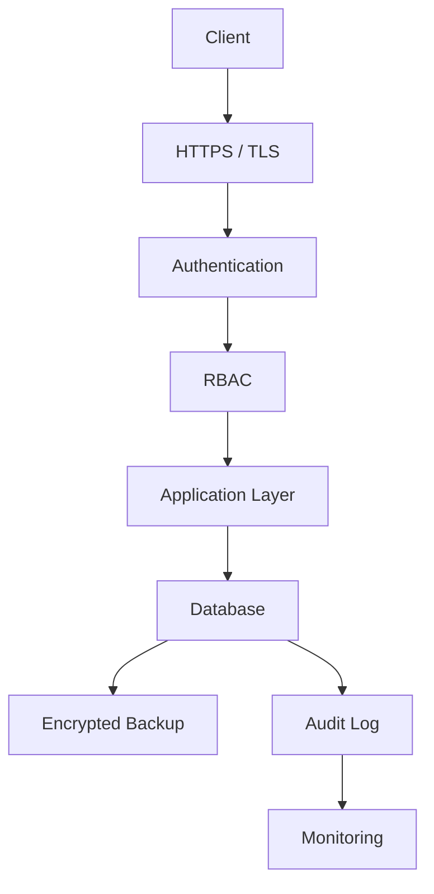

---

## Security Layers

| Layer | Protection |
|---------|------------|
| Communication | TLS |
| Authentication | JWT |
| Authorization | RBAC |
| Database | Least Privilege |
| Storage | Encryption |
| Backup | AES-256 |
| Monitoring | Audit Trail |

---

# 14. Data Security Checklist

## Classification

- Data Classification
- Sensitive Data Identification
- PII Identification

---

## Protection

- Encryption at Rest
- Encryption in Transit
- RBAC
- Data Masking

---

## Database

- Internal Access Only
- Least Privilege
- Audit Logging
- Secure Credential

---

## Backup

- Encrypted Backup
- Retention Policy
- Recovery Test
- Offsite Storage

---

## Secret Management

- Environment Variable
- Secret Rotation
- No Hardcoded Secret
- Secure Storage

---

# 15. Summary

Part 5 mendefinisikan **Data Security** pada Parakita yang mencakup klasifikasi data, perlindungan data sensitif dan PII, enkripsi saat penyimpanan (*Encryption at Rest*) maupun transmisi (*Encryption in Transit*), keamanan database, pengelolaan secret, keamanan backup, kebijakan retensi data, mekanisme penghapusan aman, serta data masking. Dengan menerapkan prinsip **Privacy by Design**, **Least Privilege**, **Encryption by Default**, dan **Auditability**, Parakita memastikan bahwa data pasien, rekam medis, transaksi finansial, dan informasi operasional terlindungi sepanjang siklus hidupnya serta siap memenuhi kebutuhan audit dan kepatuhan.

---

**End of Part 5**

**Next Part**

**Part 6 — Infrastructure Security**

# Parakita Software Architecture Document (SAD)

# 25 - Security

| Document Information | |
|----------------------|----------------------------------------------|
| Project | Parakita - Dental Clinic Management System |
| Document | 25 - Security |
| Part | 6 of 12 |
| Version | 1.0.0 |
| Status | Draft |
| Document Type | Security Architecture Specification |
| Architecture Style | Clean Architecture + Domain Driven Design + Modular Monolith |
| Frontend | Next.js + TypeScript |
| Backend | Express.js + TypeScript |
| Database | MySQL |
| Deployment | Docker + Nginx Reverse Proxy |
| Last Updated | July 2026 |

---

# Table of Contents (Part 6)

1. Infrastructure Security Overview
2. Infrastructure Security Architecture
3. Server Hardening
4. Docker Security
5. Network Security
6. Reverse Proxy Security
7. Firewall Configuration
8. Environment Security
9. Cloud Readiness
10. Infrastructure Monitoring
11. Vulnerability Management
12. Disaster Recovery Readiness
13. Infrastructure Security Checklist
14. Summary

---

# 1. Infrastructure Security Overview

## Overview

Infrastructure Security melindungi seluruh komponen infrastruktur yang menjalankan Parakita, mulai dari server aplikasi, container Docker, jaringan internal, reverse proxy, database, hingga mekanisme monitoring.

Tujuan utama:

- Menjamin ketersediaan layanan (Availability)
- Mencegah akses tidak sah
- Mengurangi attack surface
- Memastikan deployment yang aman
- Mendukung monitoring dan incident response

---

## Infrastructure Components

```text
Internet
      │
      ▼
Firewall
      │
      ▼
Reverse Proxy (Nginx)
      │
      ▼
Docker Network
      │
 ┌────┴────┐
 ▼         ▼
Frontend  Backend API
              │
              ▼
          MySQL Database
              │
              ▼
      Backup & Monitoring
```

---

# 2. Infrastructure Security Architecture

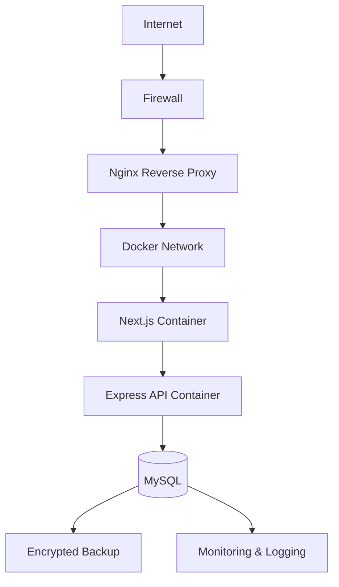

---

## Security Layers

| Layer | Protection |
|--------|------------|
| Internet | TLS |
| Network | Firewall |
| Reverse Proxy | Nginx Security |
| Container | Docker Isolation |
| Database | Internal Network Only |
| Backup | Encryption |
| Monitoring | Centralized Logging |

---

# 3. Server Hardening

Seluruh server Production harus mengikuti proses hardening sebelum digunakan.

---

## Hardening Checklist

- Gunakan sistem operasi yang masih didukung.
- Terapkan patch keamanan secara berkala.
- Nonaktifkan layanan yang tidak digunakan.
- Gunakan SSH Key Authentication.
- Nonaktifkan login root melalui SSH.
- Terapkan prinsip Least Privilege untuk akun sistem.
- Sinkronisasi waktu menggunakan NTP.
- Aktifkan audit log sistem.

---

## SSH Policy

| Setting | Value |
|----------|-------|
| Password Login | Disabled |
| Root Login | Disabled |
| SSH Key | Required |
| Default Port | Configurable |
| Idle Timeout | Enabled |

---

# 4. Docker Security

Parakita dijalankan menggunakan Docker sehingga setiap service diisolasi dalam container.

---

## Container Architecture

```text
Docker Host

├── Nginx

├── Frontend

├── Backend API

├── MySQL

└── Monitoring Agent
```

---

## Docker Security Rules

- Gunakan image resmi atau image yang telah diverifikasi.
- Jalankan container sebagai non-root user.
- Gunakan image minimal (misalnya Alpine) bila memungkinkan.
- Jangan menyimpan secret di Docker Image.
- Gunakan volume terpisah untuk data persisten.
- Batasi kemampuan (*capabilities*) container sesuai kebutuhan.
- Aktifkan restart policy.

---

## Docker Best Practices

| Practice | Description |
|----------|-------------|
| Read Only Filesystem | Jika memungkinkan |
| Resource Limit | CPU & Memory Limit |
| Network Isolation | Internal Docker Network |
| Image Scan | Vulnerability Scanning |
| Image Version | Tag tetap (hindari `latest`) |

---

# 5. Network Security

Seluruh komunikasi jaringan dibatasi berdasarkan kebutuhan layanan.

---

## Network Segmentation

```text
Internet

↓

Firewall

↓

DMZ

↓

Application Network

↓

Database Network
```

---

## Network Rules

| Source | Destination | Allowed |
|----------|-------------|----------|
| Internet | Nginx | HTTPS |
| Nginx | Backend API | HTTP Internal |
| Backend API | Database | MySQL |
| Database | Internet | Denied |

---

## Security Principles

- Default Deny.
- Hanya port yang diperlukan dibuka.
- Database tidak diekspos ke Internet.
- Komunikasi internal menggunakan jaringan privat.

---

# 6. Reverse Proxy Security

Nginx berfungsi sebagai Reverse Proxy dan lapisan keamanan pertama.

---

## Responsibilities

- TLS Termination
- Request Forwarding
- Security Headers
- Request Size Limitation
- Rate Limiting
- Static Asset Delivery

---

## Security Configuration

| Setting | Value |
|----------|-------|
| HTTPS Only | Enabled |
| HTTP Redirect | Enabled |
| HSTS | Enabled |
| Request Size Limit | Configured |
| Rate Limit | Enabled |

---

## Example Flow

```text
Internet

↓

HTTPS

↓

Nginx

↓

Backend API
```

---

# 7. Firewall Configuration

Firewall membatasi akses ke server berdasarkan port dan sumber koneksi.

---

## Allowed Ports

| Port | Service | Public |
|------|---------|--------|
| 80 | HTTP (Redirect) | Yes |
| 443 | HTTPS | Yes |
| 22 | SSH | Restricted |
| 3306 | MySQL | No |
| 3000 | Backend | No |
| 3001 | Frontend | No |

---

## Firewall Policy

- Default Deny.
- Izinkan hanya port yang dibutuhkan.
- Batasi akses SSH berdasarkan IP bila memungkinkan.
- Catat percobaan koneksi yang ditolak.

---

# 8. Environment Security

Konfigurasi aplikasi dipisahkan berdasarkan environment.

---

## Environment

- Development
- Testing
- Staging
- Production

---

## Configuration Policy

| Item | Development | Production |
|------|-------------|------------|
| Debug Mode | Enabled | Disabled |
| Detailed Error | Enabled | Disabled |
| HTTPS | Optional | Required |
| Secret | Local `.env` | Secret Management |
| Logging | Verbose | Sanitized |

---

## Secret Rules

- Tidak disimpan di Git Repository.
- Tidak dicetak ke log.
- Dipisahkan antar environment.
- Mendukung rotasi secret.

---

# 9. Cloud Readiness

Arsitektur dirancang agar dapat dipindahkan ke lingkungan cloud tanpa perubahan besar.

---

## Cloud-Compatible Components

- Docker Container
- Stateless API
- External Configuration
- Object Storage Ready
- Reverse Proxy
- Health Check Endpoint

---

## Cloud Security Considerations

- IAM Integration (Future)
- Managed Secret Service
- Managed Database
- Load Balancer
- Auto Scaling Ready

---

# 10. Infrastructure Monitoring

Monitoring memastikan infrastruktur tetap sehat dan aman.

---

## Monitored Metrics

| Component | Metrics |
|-----------|---------|
| Server | CPU, Memory, Disk |
| Docker | Container Status |
| API | Response Time |
| Database | Connection, Query |
| Nginx | Request Rate |
| Storage | Capacity |

---

## Alerts

- Server Down
- Disk Full
- Memory High
- CPU High
- Database Offline
- Container Restart
- TLS Certificate Expiration

---

# 11. Vulnerability Management

Infrastruktur harus dipantau terhadap kerentanan keamanan.

---

## Security Activities

- Patch Operating System
- Dependency Update
- Docker Image Scanning
- Vulnerability Assessment
- Penetration Testing
- Configuration Review

---

## Patch Policy

| Severity | Response Time |
|----------|---------------|
| Critical | ≤ 24 Jam |
| High | ≤ 7 Hari |
| Medium | ≤ 30 Hari |
| Low | Scheduled Maintenance |

---

# 12. Disaster Recovery Readiness

Infrastructure Security mendukung proses pemulihan bencana.

---

## Recovery Components

- Daily Backup
- Encrypted Backup
- Recovery Documentation
- Recovery Testing
- Monitoring
- Configuration Backup

---

## Recovery Flow

```text
Infrastructure Failure

↓

Incident Response

↓

Restore Backup

↓

System Validation

↓

Go Live
```

---

# 13. Infrastructure Security Checklist

## Server

- OS Hardening
- Security Patch
- SSH Key Authentication
- Root Login Disabled

---

## Docker

- Verified Image
- Non-Root Container
- Resource Limit
- Internal Network

---

## Network

- Firewall Enabled
- Default Deny
- Database Internal Only
- TLS Enabled

---

## Reverse Proxy

- HTTPS Only
- HSTS
- Security Headers
- Rate Limiting

---

## Environment

- Secret Management
- Separate Configuration
- Production Debug Disabled
- Environment Isolation

---

## Monitoring

- Centralized Logging
- Infrastructure Metrics
- Alerting
- Vulnerability Scanning

---

# 14. Summary

Part 6 menjelaskan **Infrastructure Security** pada Parakita yang mencakup hardening server, keamanan Docker, segmentasi jaringan, konfigurasi reverse proxy, firewall, pengamanan environment, kesiapan cloud, monitoring infrastruktur, manajemen kerentanan, serta kesiapan disaster recovery. Infrastruktur dirancang mengikuti prinsip **Defense in Depth**, **Least Privilege**, dan **Secure by Default**, sehingga setiap lapisan—mulai dari jaringan hingga container dan database—memiliki kontrol keamanan yang saling melengkapi untuk menjaga ketersediaan, integritas, dan kerahasiaan layanan Parakita.

---

**End of Part 6**

**Next Part**

**Part 7 — Application Security**

# Parakita Software Architecture Document (SAD)

# 25 - Security

| Document Information | |
|----------------------|----------------------------------------------|
| Project | Parakita - Dental Clinic Management System |
| Document | 25 - Security |
| Part | 7 of 12 |
| Version | 1.0.0 |
| Status | Draft |
| Document Type | Security Architecture Specification |
| Architecture Style | Clean Architecture + Domain Driven Design + Modular Monolith |
| Frontend | Next.js + TypeScript |
| Backend | Express.js + TypeScript |
| Database | MySQL |
| Security Reference | OWASP Top 10 2021 |
| Last Updated | July 2026 |

---

# Table of Contents (Part 7)

1. Application Security Overview
2. Secure Development Lifecycle (SDL)
3. OWASP Top 10 Mitigation
4. Secure Coding Standards
5. Input Validation
6. Output Encoding
7. Injection Prevention
8. File Upload Security
9. Dependency Security
10. Security Headers
11. Error Handling & Information Disclosure
12. Security Logging
13. Application Security Flow
14. Application Security Checklist
15. Summary

---

# 1. Application Security Overview

## Overview

Application Security berfokus pada perlindungan aplikasi Parakita terhadap berbagai ancaman yang berasal dari kesalahan implementasi kode, validasi input yang tidak memadai, konfigurasi yang tidak aman, maupun eksploitasi aplikasi.

Keamanan diterapkan pada seluruh lapisan aplikasi:

- Frontend
- REST API
- Application Layer
- Domain Layer
- Repository Layer

---

## Security Objectives

- Mengurangi attack surface.
- Mencegah eksploitasi aplikasi.
- Menjamin integritas proses bisnis.
- Melindungi data pengguna.
- Mendukung pengembangan yang aman (*Secure SDLC*).

---

# 2. Secure Development Lifecycle (SDL)

Seluruh proses pengembangan mengikuti Secure Development Lifecycle.

```text
Requirement

↓

Architecture Review

↓

Threat Modeling

↓

Secure Coding

↓

Code Review

↓

Security Testing

↓

Deployment

↓

Monitoring
```

---

## SDL Activities

| Phase | Security Activity |
|--------|-------------------|
| Planning | Security Requirement |
| Design | Threat Modeling |
| Development | Secure Coding |
| Testing | SAST, DAST |
| Deployment | Security Configuration |
| Operation | Monitoring & Patch |

---

# 3. OWASP Top 10 Mitigation

Parakita mengadopsi mitigasi terhadap risiko pada OWASP Top 10 (2021).

| OWASP Risk | Mitigation |
|-------------|------------|
| Broken Access Control | JWT + RBAC + Branch Isolation |
| Cryptographic Failures | TLS + bcrypt + Encryption |
| Injection | Parameterized Query + Validation |
| Insecure Design | Security by Design |
| Security Misconfiguration | Hardened Configuration |
| Vulnerable Components | Dependency Scanning |
| Identification & Authentication Failures | JWT + Session Management |
| Software & Data Integrity Failures | Signed Build & CI/CD Validation |
| Security Logging Failures | Audit Logging |
| SSRF | URL Validation & Network Restriction |

---

# 4. Secure Coding Standards

Seluruh kode harus mengikuti standar Secure Coding.

---

## General Principles

- Validate all input.
- Encode all output.
- Never trust client-side validation.
- Use parameterized query.
- Do not expose internal implementation.
- Fail securely.
- Log security events.

---

## Coding Rules

| Rule | Description |
|------|-------------|
| No Hardcoded Secret | Secret menggunakan Environment Variable |
| Strong Typing | Gunakan TypeScript |
| DTO Validation | Validasi seluruh request |
| Immutable DTO | Hindari perubahan data input |
| Exception Handling | Standardized Error Response |

---

# 5. Input Validation

Seluruh input harus melalui dua lapisan validasi:

1. Technical Validation
2. Business Validation

---

## Technical Validation

Menggunakan:

- DTO
- `class-validator`
- Type Validation
- Required Validation
- Enum Validation
- UUID Validation

---

## Business Validation

Contoh:

- Pasien tidak boleh memiliki nomor rekam medis duplikat.
- Invoice tidak dapat dibayar dua kali.
- Jadwal dokter tidak boleh bertabrakan.

---

## Validation Flow

```text
Request

↓

DTO Validation

↓

Business Validation

↓

Application Service
```

---

# 6. Output Encoding

Semua output harus disesuaikan dengan konteks penggunaannya untuk mencegah Cross-Site Scripting (XSS).

---

## Output Context

| Context | Encoding |
|----------|----------|
| HTML | HTML Encoding |
| JSON | JSON Serialization |
| URL | URL Encoding |
| Attribute | Attribute Encoding |

---

## Response Policy

- Tidak mengembalikan stack trace.
- Tidak mengembalikan query database.
- Tidak mengembalikan secret.
- Tidak mengembalikan path internal server.

---

# 7. Injection Prevention

Injection merupakan salah satu ancaman utama terhadap aplikasi.

---

## SQL Injection Prevention

- Gunakan ORM atau Query Builder.
- Gunakan parameterized query.
- Hindari string concatenation.
- Validasi seluruh input.

---

## Command Injection Prevention

- Hindari menjalankan command shell jika tidak diperlukan.
- Gunakan whitelist untuk parameter.
- Validasi seluruh input.

---

## NoSQL Injection (Future Ready)

Apabila di masa depan menggunakan NoSQL:

- Gunakan driver resmi.
- Validasi tipe data.
- Tolak operator yang tidak diizinkan.

---

## Injection Protection Matrix

| Attack | Mitigation |
|---------|------------|
| SQL Injection | Parameterized Query |
| Command Injection | Whitelist Validation |
| LDAP Injection | Escaping |
| XPath Injection | Parameter Validation |

---

# 8. File Upload Security

Beberapa modul mendukung unggahan dokumen, foto pasien, hasil laboratorium, dan radiologi.

---

## Allowed Files

| Type | Example |
|------|----------|
| Image | JPG, PNG, WEBP |
| PDF | Medical Document |
| Office | Optional (Future) |

---

## Validation Rules

- Validasi MIME Type.
- Validasi ekstensi.
- Batasi ukuran file.
- Gunakan nama file acak (UUID).
- Simpan di luar direktori publik bila memungkinkan.

---

## Upload Security Flow

```text
Upload File

↓

Validate Size

↓

Validate MIME Type

↓

Virus Scan (Future)

↓

Store File

↓

Audit Log
```

---

# 9. Dependency Security

Library pihak ketiga harus dikelola secara aman.

---

## Policy

- Gunakan library resmi.
- Hindari library yang tidak terawat.
- Lakukan pembaruan berkala.
- Pindai kerentanan secara otomatis.

---

## Security Activities

| Activity | Frequency |
|----------|-----------|
| npm audit | Setiap Build |
| Dependency Scan | CI/CD |
| Version Review | Bulanan |
| Patch Update | Berdasarkan Severity |

---

## Package Management Rules

- Lock dependency version.
- Review sebelum upgrade mayor.
- Hapus dependency yang tidak digunakan.
- Dokumentasikan dependency kritikal.

---

# 10. Security Headers

Response HTTP harus menyertakan header keamanan.

---

## Required Headers

| Header | Purpose |
|----------|---------|
| Strict-Transport-Security | HTTPS Enforcement |
| Content-Security-Policy | XSS Protection |
| X-Frame-Options | Clickjacking Prevention |
| X-Content-Type-Options | MIME Sniffing Prevention |
| Referrer-Policy | Referrer Restriction |
| Permissions-Policy | Browser Feature Restriction |

---

## Example

```http
Strict-Transport-Security:
max-age=31536000

Content-Security-Policy:
default-src 'self'

X-Frame-Options:
DENY

X-Content-Type-Options:
nosniff
```

---

# 11. Error Handling & Information Disclosure

Error harus memberikan informasi yang cukup kepada pengguna tanpa membocorkan detail internal sistem.

---

## Standard Error Response

```json
{
  "success": false,
  "error": {
    "code": "VALIDATION_ERROR",
    "message": "Invalid request."
  }
}
```

---

## Error Handling Policy

- Jangan tampilkan stack trace.
- Jangan tampilkan SQL query.
- Jangan tampilkan konfigurasi server.
- Jangan tampilkan secret.
- Catat detail teknis hanya pada log internal.

---

# 12. Security Logging

Aktivitas keamanan harus dicatat untuk mendukung audit dan investigasi.

---

## Logged Events

- Login Success
- Login Failure
- Logout
- Password Change
- Permission Denied
- File Upload
- Failed Validation
- Suspicious Activity

---

## Log Attributes

| Field | Description |
|--------|-------------|
| Timestamp | Waktu kejadian |
| User ID | Pengguna |
| Session ID | Sesi |
| IP Address | Alamat IP |
| User Agent | Informasi perangkat |
| Event | Jenis aktivitas |
| Severity | Tingkat keparahan |

---

# 13. Application Security Flow

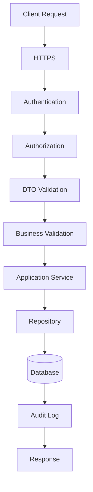

---

## Security Layers

| Layer | Protection |
|---------|------------|
| Communication | HTTPS |
| Identity | JWT |
| Authorization | RBAC |
| Validation | DTO Validation |
| Domain | Business Rule Validation |
| Persistence | Parameterized Query |
| Monitoring | Audit Logging |

---

# 14. Application Security Checklist

## Development

- Secure Coding Standard
- Code Review
- TypeScript Strict Mode
- No Hardcoded Secret

---

## Validation

- DTO Validation
- Business Validation
- Input Sanitization
- Output Encoding

---

## Protection

- SQL Injection Prevention
- Command Injection Prevention
- XSS Protection
- File Upload Validation

---

## Dependency

- npm audit
- Dependency Scanning
- Version Lock
- Regular Update

---

## Logging

- Security Events
- Audit Trail
- Standard Error Response
- Monitoring Ready

---

# 15. Summary

Part 7 mendefinisikan **Application Security** pada Parakita dengan menerapkan prinsip **Secure Development Lifecycle (SDL)**, standar **Secure Coding**, mitigasi **OWASP Top 10**, validasi input berlapis, pencegahan berbagai jenis injection, pengamanan file upload, pengelolaan dependency yang aman, penggunaan security headers, serta mekanisme error handling dan security logging. Seluruh lapisan aplikasi dirancang mengikuti prinsip **Security by Design**, **Fail Secure**, dan **Defense in Depth**, sehingga keamanan menjadi bagian integral dari proses pengembangan dan operasional aplikasi.

---

**End of Part 7**

**Next Part**

**Part 8 — Audit & Logging Security**

# Parakita Software Architecture Document (SAD)

# 25 - Security

| Document Information | |
|----------------------|----------------------------------------------|
| Project | Parakita - Dental Clinic Management System |
| Document | 25 - Security |
| Part | 8 of 12 |
| Version | 1.0.0 |
| Status | Draft |
| Document Type | Security Architecture Specification |
| Architecture Style | Clean Architecture + Domain Driven Design + Modular Monolith |
| Frontend | Next.js + TypeScript |
| Backend | Express.js + TypeScript |
| Database | MySQL |
| Logging Strategy | Centralized Audit & Security Logging |
| Last Updated | July 2026 |

---

# Table of Contents (Part 8)

1. Audit & Logging Security Overview
2. Audit Trail Architecture
3. Security Event Logging
4. Authentication Logging
5. Authorization Logging
6. API Logging
7. Database Audit Logging
8. Log Storage & Retention
9. Log Integrity Protection
10. Centralized Logging & SIEM Readiness
11. Monitoring & Alerting
12. Audit & Logging Flow
13. Audit & Logging Checklist
14. Summary

---

# 1. Audit & Logging Security Overview

## Overview

Audit & Logging Security memastikan seluruh aktivitas penting dalam sistem Parakita dapat direkam, ditelusuri, dan dianalisis untuk mendukung keamanan, investigasi insiden, kepatuhan, dan audit operasional.

Audit log berbeda dengan application log.

| Log Type | Purpose |
|----------|---------|
| Audit Log | Mencatat aktivitas pengguna |
| Application Log | Mencatat proses aplikasi |
| Security Log | Mencatat kejadian keamanan |
| Infrastructure Log | Mencatat aktivitas server |

---

## Objectives

- Mendukung investigasi insiden.
- Menjamin akuntabilitas pengguna.
- Memenuhi kebutuhan audit.
- Mendukung monitoring keamanan.
- Mendeteksi aktivitas abnormal.

---

# 2. Audit Trail Architecture

Seluruh aktivitas penting dicatat secara otomatis.

```text
User Action

↓

Authentication

↓

Authorization

↓

Business Process

↓

Audit Logger

↓

Audit Database
```

---

## Audit Architecture

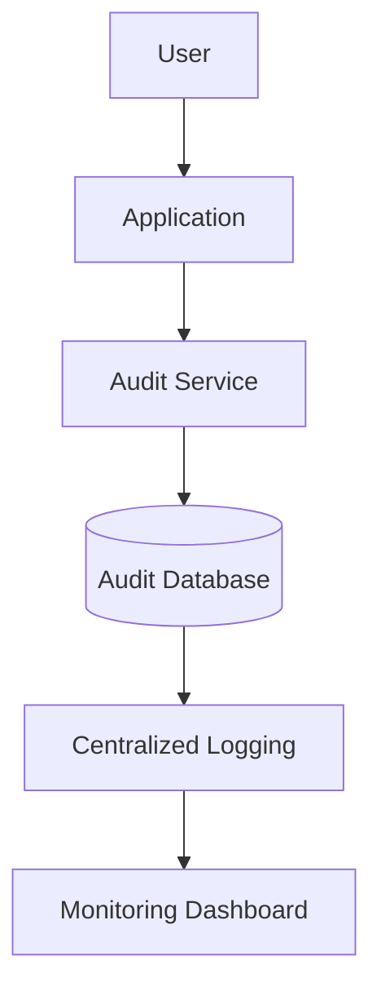

---

## Audit Principles

- Immutable Record
- Timestamped
- Traceable
- Tamper Evident
- Centralized

---

# 3. Security Event Logging

Event keamanan harus selalu dicatat.

---

## Logged Security Events

| Event | Logged |
|--------|---------|
| Login Success | ✔ |
| Login Failure | ✔ |
| Logout | ✔ |
| Password Change | ✔ |
| Password Reset | ✔ |
| JWT Validation Failure | ✔ |
| Permission Denied | ✔ |
| Account Locked | ✔ |
| Session Revoked | ✔ |
| Suspicious Activity | ✔ |

---

## Security Severity

| Severity | Description |
|----------|-------------|
| Info | Aktivitas normal |
| Warning | Aktivitas mencurigakan |
| Error | Kesalahan aplikasi |
| Critical | Ancaman keamanan |

---

# 4. Authentication Logging

Seluruh aktivitas autentikasi dicatat.

---

## Logged Information

| Field | Description |
|--------|-------------|
| User ID | Pengguna |
| Username | Username |
| Login Time | Waktu login |
| Logout Time | Waktu logout |
| Session ID | UUID |
| IP Address | IP pengguna |
| User Agent | Browser/Device |
| Result | Success/Failed |

---

## Login Audit Example

```text
Timestamp:
2026-07-31 09:15:32

User:
doctor01

Action:
LOGIN_SUCCESS

IP:
192.168.10.25

Branch:
Jakarta Pusat
```

---

# 5. Authorization Logging

Seluruh proses otorisasi juga harus direkam.

---

## Logged Events

- Permission Granted
- Permission Denied
- Branch Validation Failed
- Unauthorized Access
- Approval Granted
- Approval Rejected

---

## Authorization Log Fields

| Field | Description |
|--------|-------------|
| User ID | Pengguna |
| Permission | Permission yang diperiksa |
| Resource | Resource yang diakses |
| Result | Allow / Deny |
| Timestamp | Waktu |

---

# 6. API Logging

Semua request API dicatat untuk kebutuhan monitoring dan troubleshooting.

---

## API Log Contents

| Field | Description |
|--------|-------------|
| Timestamp | Waktu request |
| Method | HTTP Method |
| Endpoint | API Endpoint |
| User ID | Pengguna |
| Session ID | Session |
| Response Code | HTTP Status |
| Response Time | Latency |
| IP Address | Client IP |

---

## Sensitive Data Policy

API Log **tidak boleh** menyimpan:

- Password
- JWT Token
- Refresh Token
- Secret
- Credit Information
- Medical Narrative lengkap

---

## API Flow

```text
Incoming Request

↓

Authentication

↓

Authorization

↓

Controller

↓

Response

↓

API Logger
```

---

# 7. Database Audit Logging

Database mencatat perubahan terhadap data penting.

---

## Audited Tables

- Patient
- Medical Record
- Invoice
- Payment
- Inventory
- User
- Role
- Permission

---

## Audit Operations

| Operation | Logged |
|-----------|---------|
| INSERT | ✔ |
| UPDATE | ✔ |
| DELETE (Soft Delete) | ✔ |
| APPROVAL | ✔ |
| LOGIN | Reference Only |

---

## Audit Record

| Field | Description |
|--------|-------------|
| Table | Nama tabel |
| Record ID | Primary Key |
| Action | INSERT / UPDATE |
| Before | Nilai sebelumnya |
| After | Nilai setelah perubahan |
| User | Pelaku |
| Timestamp | Waktu |

---

# 8. Log Storage & Retention

Log harus disimpan secara aman.

---

## Storage Strategy

```text
Application

↓

Log Collector

↓

Central Log Storage

↓

Archive

↓

Backup
```

---

## Retention Policy

| Log | Retention |
|------|-----------|
| Audit Log | Permanent |
| Security Log | 7 Tahun |
| Application Log | 1 Tahun |
| Access Log | 1 Tahun |

---

## Storage Rules

- Log dienkripsi bila diperlukan.
- Backup log dilakukan secara berkala.
- Log hanya dapat diakses oleh personel berwenang.
- Log tidak boleh dimodifikasi.

---

# 9. Log Integrity Protection

Integritas log sangat penting untuk kebutuhan audit.

---

## Protection Mechanism

- Append Only
- Timestamp Validation
- Access Control
- Backup
- Hash Verification (Future)

---

## Integrity Principles

- Tidak boleh dihapus secara manual.
- Tidak boleh diubah setelah tersimpan.
- Seluruh akses terhadap log juga dicatat.

---

# 10. Centralized Logging & SIEM Readiness

Arsitektur mendukung integrasi dengan solusi SIEM.

---

## Supported Sources

- Backend API
- Nginx
- Docker
- Database
- Authentication
- Audit Service
- Operating System

---

## SIEM Architecture

```text
Application

↓

Central Log

↓

SIEM

↓

Alert

↓

Security Team
```

---

## Future Integration

- ELK Stack
- OpenSearch
- Grafana Loki
- Microsoft Sentinel
- Splunk

---

# 11. Monitoring & Alerting

Monitoring dilakukan terhadap aktivitas yang berpotensi mengindikasikan ancaman.

---

## Alert Conditions

| Event | Alert |
|--------|-------|
| Login Failure > Threshold | ✔ |
| Multiple Permission Denied | ✔ |
| Suspicious IP | ✔ |
| Database Connection Failure | ✔ |
| High Error Rate | ✔ |
| Container Restart | ✔ |
| Disk Full | ✔ |

---

## Alert Flow

```text
Security Event

↓

Log Collector

↓

Monitoring

↓

Alert Engine

↓

Administrator
```

---

# 12. Audit & Logging Flow

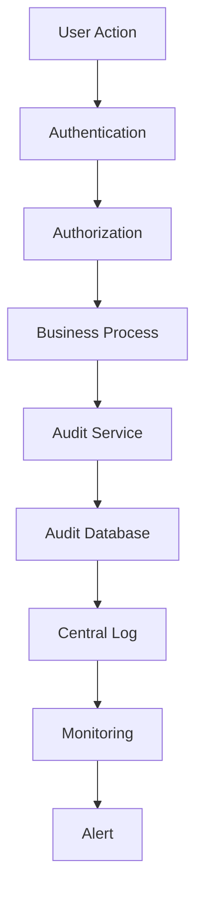

---

## Logging Pipeline

| Stage | Activity |
|--------|----------|
| Authentication | Login Log |
| Authorization | Permission Log |
| Business Process | Audit Log |
| Infrastructure | Server Log |
| Monitoring | Alert |

---

# 13. Audit & Logging Checklist

## Audit

- User Activity Logged
- CRUD Activity Logged
- Approval Logged
- Timestamp Recorded

---

## Authentication

- Login Success
- Login Failure
- Logout
- Session Revocation

---

## Authorization

- Permission Validation
- Permission Denied
- Branch Validation
- Approval History

---

## API

- Request Log
- Response Log
- Response Time
- HTTP Status

---

## Security

- Immutable Audit Trail
- Centralized Logging
- Log Retention
- SIEM Ready
- Monitoring & Alerting

---

# 14. Summary

Part 8 mendefinisikan **Audit & Logging Security** pada Parakita yang mencakup arsitektur audit trail, pencatatan aktivitas autentikasi, otorisasi, API, dan database, pengelolaan penyimpanan log, perlindungan integritas log, serta kesiapan integrasi dengan platform **SIEM**. Seluruh aktivitas penting direkam secara **immutable**, dapat ditelusuri, dan hanya dapat diakses oleh pihak yang berwenang. Dengan strategi **Centralized Logging**, **Security Event Monitoring**, dan **Alerting**, Parakita mampu mendukung investigasi insiden, pemenuhan kebutuhan audit, serta deteksi dini terhadap aktivitas yang mencurigakan.

---

**End of Part 8**

**Next Part**

**Part 9 — Incident Response**

# Parakita Software Architecture Document (SAD)

# 25 - Security

| Document Information | |
|----------------------|----------------------------------------------|
| Project | Parakita - Dental Clinic Management System |
| Document | 25 - Security |
| Part | 9 of 12 |
| Version | 1.0.0 |
| Status | Draft |
| Document Type | Security Architecture Specification |
| Architecture Style | Clean Architecture + Domain Driven Design + Modular Monolith |
| Frontend | Next.js + TypeScript |
| Backend | Express.js + TypeScript |
| Database | MySQL |
| Security Domain | Incident Response |
| Last Updated | July 2026 |

---

# Table of Contents (Part 9)

1. Incident Response Overview
2. Incident Classification
3. Incident Detection
4. Alerting Mechanism
5. Incident Response Workflow
6. Incident Containment
7. Recovery Process
8. Digital Forensics
9. Evidence Collection
10. Post-Incident Review
11. Security Playbook
12. Incident Response Flow
13. Incident Response Checklist
14. Summary

---

# 1. Incident Response Overview

## Overview

Incident Response (IR) merupakan serangkaian proses untuk mendeteksi, menganalisis, mengendalikan, memulihkan, dan mengevaluasi insiden keamanan yang terjadi pada sistem Parakita.

Tujuan utama Incident Response adalah:

- Meminimalkan dampak insiden.
- Menjaga keberlangsungan operasional klinik.
- Melindungi data pasien.
- Memastikan pemulihan berjalan cepat.
- Mendukung investigasi dan audit.

---

## Incident Response Lifecycle

```text
Preparation

↓

Detection

↓

Analysis

↓

Containment

↓

Eradication

↓

Recovery

↓

Post Incident Review
```

---

## Incident Response Principles

- Early Detection
- Rapid Containment
- Evidence Preservation
- Controlled Recovery
- Continuous Improvement

---

# 2. Incident Classification

Seluruh insiden dikategorikan berdasarkan tingkat keparahan.

## Severity Level

| Severity | Description | Target Response |
|----------|-------------|-----------------|
| Critical | Layanan utama berhenti atau terjadi kebocoran data | ≤ 30 Menit |
| High | Gangguan besar terhadap operasional | ≤ 1 Jam |
| Medium | Gangguan terbatas | ≤ 4 Jam |
| Low | Dampak kecil | ≤ 1 Hari |

---

## Incident Categories

| Category | Example |
|----------|---------|
| Authentication | Brute Force Login |
| Authorization | Unauthorized Access |
| Infrastructure | Server Down |
| Network | DDoS Attack |
| Application | SQL Injection Attempt |
| Database | Database Corruption |
| Malware | Ransomware Detection |
| Data | Data Leakage |
| Configuration | Misconfiguration |
| Third Party | External Integration Failure |

---

# 3. Incident Detection

Insiden dapat dideteksi melalui berbagai sumber monitoring.

---

## Detection Sources

- Audit Log
- Security Log
- Application Log
- Nginx Log
- Database Log
- Docker Monitoring
- Infrastructure Monitoring
- User Report

---

## Detection Events

| Event | Detection |
|--------|-----------|
| Multiple Login Failure | ✔ |
| JWT Validation Failure | ✔ |
| Permission Denied Spike | ✔ |
| API Error Spike | ✔ |
| Database Failure | ✔ |
| High CPU Usage | ✔ |
| Disk Full | ✔ |
| Container Restart Loop | ✔ |

---

# 4. Alerting Mechanism

Ketika insiden terdeteksi, sistem menghasilkan notifikasi kepada administrator.

---

## Alert Levels

| Level | Notification |
|--------|--------------|
| Critical | Immediate |
| High | Immediate |
| Medium | Scheduled |
| Low | Daily Summary |

---

## Notification Channels

- Email
- Dashboard Notification
- Monitoring Console
- Webhook (Future)
- Chat Integration (Future)

---

## Alert Workflow

```text
Security Event

↓

Monitoring Engine

↓

Alert Engine

↓

Administrator

↓

Incident Ticket
```

---

# 5. Incident Response Workflow

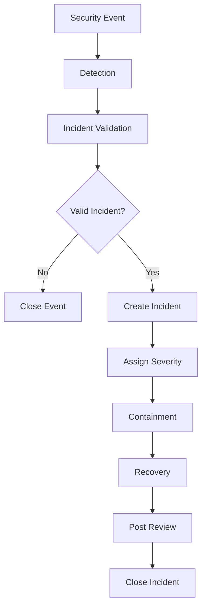

---

## Response Phases

| Phase | Activity |
|--------|----------|
| Detection | Identifikasi insiden |
| Validation | Verifikasi kejadian |
| Containment | Membatasi dampak |
| Recovery | Mengembalikan layanan |
| Review | Evaluasi insiden |

---

# 6. Incident Containment

Containment bertujuan mencegah penyebaran dampak insiden.

---

## Containment Actions

- Menonaktifkan akun yang disusupi.
- Mencabut sesi (session revocation).
- Memblokir alamat IP.
- Mengisolasi container yang terdampak.
- Menonaktifkan endpoint tertentu.
- Menghentikan integrasi sementara.

---

## Containment Matrix

| Incident | Action |
|----------|--------|
| Credential Theft | Revoke Session |
| Brute Force | Block IP |
| Malware | Isolate Server |
| API Abuse | Rate Limit |
| Data Leak | Disable Access |
| Compromised User | Lock Account |

---

# 7. Recovery Process

Setelah ancaman berhasil dikendalikan, sistem dipulihkan.

---

## Recovery Activities

- Restore Service
- Restore Database
- Restore Backup
- Validate Integrity
- User Acceptance Verification
- Resume Operation

---

## Recovery Flow

```text
Containment

↓

Root Cause Fixed

↓

Restore System

↓

Validation

↓

Monitoring

↓

Production
```

---

## Recovery Validation

| Item | Validation |
|------|------------|
| Database | Integrity Check |
| API | Functional Test |
| Authentication | Login Test |
| Billing | Transaction Test |
| EMR | Record Validation |

---

# 8. Digital Forensics

Investigasi dilakukan untuk mengetahui penyebab utama insiden.

---

## Forensic Objectives

- Menentukan akar penyebab.
- Mengidentifikasi dampak.
- Menentukan ruang lingkup.
- Menyimpan bukti.
- Mendukung audit.

---

## Sources

- Audit Log
- Security Log
- API Log
- Database Audit
- Infrastructure Log
- Docker Log

---

# 9. Evidence Collection

Seluruh bukti harus dijaga integritasnya.

---

## Evidence Types

| Evidence | Example |
|----------|---------|
| Audit Log | User Activity |
| Authentication Log | Login History |
| Database Snapshot | Before Recovery |
| Configuration | Environment |
| Application Log | Error Detail |
| Network Log | Firewall Log |

---

## Evidence Principles

- Timestamp Preservation
- Chain of Custody
- Read-Only Storage
- Backup Evidence
- Access Restriction

---

## Evidence Flow

```text
Incident

↓

Collect Evidence

↓

Secure Storage

↓

Analysis

↓

Investigation Report
```

---

# 10. Post-Incident Review

Setelah insiden selesai, dilakukan evaluasi menyeluruh.

---

## Review Activities

- Root Cause Analysis
- Timeline Review
- Impact Assessment
- Corrective Action
- Preventive Action
- Documentation Update

---

## Deliverables

- Incident Report
- Root Cause Analysis
- Recovery Report
- Improvement Plan
- Security Recommendation

---

# 11. Security Playbook

Playbook memberikan panduan respons untuk insiden yang umum terjadi.

---

## Credential Compromise

1. Lock Account.
2. Revoke Session.
3. Force Password Reset.
4. Audit User Activity.
5. Verify Login Source.

---

## SQL Injection Attempt

1. Block Request.
2. Review API Log.
3. Verify Database Integrity.
4. Patch Vulnerability.
5. Monitor Repeat Attack.

---

## Malware Detection

1. Isolate Host.
2. Preserve Evidence.
3. Scan System.
4. Restore Clean Backup.
5. Resume Operation.

---

## Data Leakage

1. Disable Access.
2. Preserve Evidence.
3. Assess Impact.
4. Notify Management.
5. Implement Corrective Action.

---

# 12. Incident Response Flow

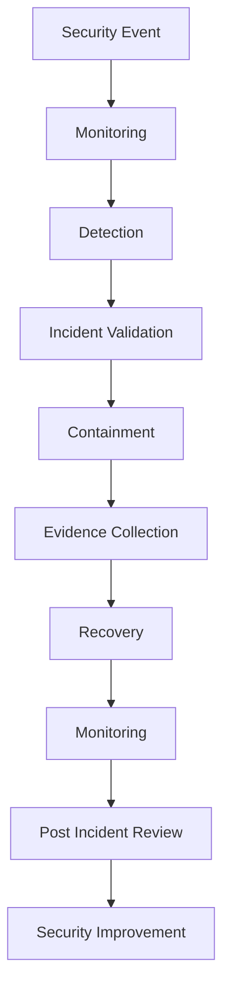

---

## Response Pipeline

| Stage | Activity |
|--------|----------|
| Detection | Alert Generation |
| Validation | Incident Confirmation |
| Containment | Isolate Threat |
| Recovery | Restore Service |
| Review | Improve Security |

---

# 13. Incident Response Checklist

## Detection

- Monitoring Active
- Alert Generated
- Incident Validated
- Severity Assigned

---

## Containment

- Session Revoked
- Account Locked
- IP Blocked
- Service Isolated

---

## Recovery

- Backup Restored
- Database Validated
- API Verified
- Monitoring Enabled

---

## Investigation

- Audit Log Collected
- Evidence Preserved
- Root Cause Identified
- Incident Report Created

---

## Improvement

- Security Patch Applied
- Documentation Updated
- Monitoring Improved
- Playbook Updated

---

# 14. Summary

Part 9 mendefinisikan **Incident Response** pada Parakita yang mencakup klasifikasi insiden, mekanisme deteksi, proses alerting, workflow penanganan insiden, containment, recovery, digital forensics, pengumpulan bukti, evaluasi pasca-insiden, dan security playbook. Dengan pendekatan yang terstruktur, Parakita mampu merespons insiden keamanan secara cepat, menjaga kontinuitas operasional klinik, melindungi data pasien, serta mendukung proses investigasi, audit, dan peningkatan keamanan secara berkelanjutan.

---

**End of Part 9**

**Next Part**

**Part 10 — Compliance**

# Parakita Software Architecture Document (SAD)

# 25 - Security

| Document Information | |
|----------------------|----------------------------------------------|
| Project | Parakita - Dental Clinic Management System |
| Document | 25 - Security |
| Part | 10 of 12 |
| Version | 1.0.0 |
| Status | Draft |
| Document Type | Security Architecture Specification |
| Architecture Style | Clean Architecture + Domain Driven Design + Modular Monolith |
| Frontend | Next.js + TypeScript |
| Backend | Express.js + TypeScript |
| Database | MySQL |
| Security Domain | Compliance & Governance |
| Last Updated | July 2026 |

---

# Table of Contents (Part 10)

1. Compliance Overview
2. Security Governance
3. Regulatory Compliance
4. Privacy Compliance
5. Access Governance
6. Data Governance
7. Security Policy Management
8. Risk Management
9. Internal Security Audit
10. Third-Party Compliance
11. Compliance Monitoring
12. Compliance Architecture
13. Compliance Checklist
14. Summary

---

# 1. Compliance Overview

## Overview

Compliance memastikan bahwa Parakita memenuhi persyaratan hukum, regulasi, kebijakan internal, serta standar keamanan yang berlaku selama pengembangan dan operasional sistem.

Penerapan compliance bertujuan untuk:

- Melindungi data pasien.
- Memastikan operasional yang aman.
- Mendukung audit internal maupun eksternal.
- Mengurangi risiko hukum dan operasional.
- Meningkatkan kepercayaan pengguna.

---

## Compliance Principles

- Accountability
- Transparency
- Privacy by Design
- Security by Design
- Continuous Improvement
- Risk-Based Approach

---

# 2. Security Governance

Security Governance mendefinisikan struktur pengelolaan keamanan informasi.

---

## Governance Objectives

- Menetapkan kebijakan keamanan.
- Menentukan tanggung jawab.
- Mengawasi implementasi kontrol keamanan.
- Melakukan evaluasi berkala.
- Mengelola risiko keamanan.

---

## Governance Structure

```text
Management

↓

Security Policy

↓

Security Standard

↓

Security Procedure

↓

Technical Implementation

↓

Audit & Monitoring
```

---

## Governance Roles

| Role | Responsibility |
|------|----------------|
| Management | Menetapkan kebijakan |
| System Administrator | Implementasi keamanan |
| Application Administrator | Pengelolaan pengguna |
| Developer | Secure Development |
| Auditor | Audit Kepatuhan |

---

# 3. Regulatory Compliance

Parakita dirancang agar dapat mendukung pemenuhan regulasi yang berlaku di Indonesia dan standar internasional apabila diperlukan.

---

## Applicable References

| Regulation / Standard | Scope |
|-----------------------|-------|
| UU Perlindungan Data Pribadi (UU PDP) | Perlindungan Data Pribadi |
| Permenkes terkait Rekam Medis Elektronik | Rekam Medis |
| ISO/IEC 27001 (Reference) | Information Security Management |
| OWASP Top 10 | Application Security |
| CIS Controls (Reference) | Security Best Practices |

---

## Compliance Strategy

- Data Protection
- Audit Trail
- Access Control
- Encryption
- Backup
- Incident Response

---

# 4. Privacy Compliance

Perlindungan privasi menjadi bagian utama dalam pengelolaan data pasien.

---

## Privacy Principles

- Data Minimization
- Purpose Limitation
- Lawful Processing
- Confidentiality
- Accountability
- Transparency

---

## Privacy Controls

| Control | Description |
|----------|-------------|
| RBAC | Membatasi akses data |
| Audit Trail | Melacak akses |
| Data Masking | Menyembunyikan PII |
| Encryption | Melindungi data |
| Consent Support | Mendukung persetujuan bila diperlukan |

---

## Privacy Requirements

- Data pasien hanya diakses oleh pihak berwenang.
- Akses terhadap PII dicatat.
- Data tidak dibagikan tanpa otorisasi yang sesuai.
- Pengelolaan data mengikuti kebijakan retensi.

---

# 5. Access Governance

Pengelolaan hak akses dilakukan secara terstruktur.

---

## Access Lifecycle

```text
User Created

↓

Role Assigned

↓

Permission Granted

↓

Periodic Review

↓

Role Updated

↓

Account Disabled
```

---

## Access Control Principles

- Least Privilege
- Need to Know
- Separation of Duties
- Role-Based Access Control
- Periodic Access Review

---

## Access Review

| Activity | Frequency |
|----------|-----------|
| User Review | Quarterly |
| Role Review | Quarterly |
| Permission Review | Quarterly |
| Administrator Review | Monthly |

---

# 6. Data Governance

Data Governance memastikan kualitas, keamanan, dan konsistensi data.

---

## Governance Objectives

- Data Quality
- Data Consistency
- Data Integrity
- Data Ownership
- Data Security

---

## Data Ownership

| Data | Owner |
|------|-------|
| Patient | Clinic Management |
| Medical Record | Authorized Doctor |
| Billing | Finance |
| Inventory | Inventory Manager |
| Audit Log | System Administrator |

---

## Governance Controls

- Data Validation
- Master Data Management
- Backup
- Audit Trail
- Version Control

---

# 7. Security Policy Management

Kebijakan keamanan harus terdokumentasi dan ditinjau secara berkala.

---

## Policy Categories

- Password Policy
- Authentication Policy
- Authorization Policy
- Backup Policy
- Logging Policy
- Incident Response Policy
- Secure Development Policy
- Data Protection Policy

---

## Policy Lifecycle

```text
Create Policy

↓

Approval

↓

Implementation

↓

Review

↓

Revision

↓

Re-Approval
```

---

## Review Schedule

| Policy | Review |
|---------|--------|
| Security Policy | Annual |
| Password Policy | Annual |
| Incident Response | Annual |
| Backup Policy | Annual |

---

# 8. Risk Management

Risk Management membantu mengidentifikasi dan mengurangi risiko keamanan.

---

## Risk Assessment Process

```text
Identify Risk

↓

Analyze Risk

↓

Evaluate Impact

↓

Mitigation

↓

Monitoring
```

---

## Risk Categories

| Category | Example |
|----------|---------|
| Infrastructure | Server Failure |
| Application | Vulnerability |
| Authentication | Credential Theft |
| Database | Data Corruption |
| Network | DDoS Attack |
| Human | Human Error |

---

## Risk Treatment

- Avoid
- Reduce
- Transfer
- Accept

---

# 9. Internal Security Audit

Audit internal dilakukan untuk memastikan implementasi kontrol keamanan berjalan sesuai kebijakan.

---

## Audit Scope

- Authentication
- Authorization
- Infrastructure
- Database
- API Security
- Audit Trail
- Backup
- Incident Response

---

## Audit Activities

| Activity | Frequency |
|----------|-----------|
| Access Review | Quarterly |
| Security Review | Quarterly |
| Vulnerability Review | Quarterly |
| Configuration Review | Semi-Annual |
| Full Security Audit | Annual |

---

# 10. Third-Party Compliance

Layanan pihak ketiga yang terintegrasi harus memenuhi persyaratan keamanan yang relevan.

---

## Third-Party Examples

- SMTP Provider
- Object Storage
- Payment Gateway (Future)
- WhatsApp Gateway
- SMS Gateway

---

## Third-Party Security Requirements

- HTTPS/TLS Support
- Authentication Mechanism
- API Security
- Availability SLA
- Incident Notification
- Access Logging

---

## Vendor Assessment

| Assessment | Required |
|------------|----------|
| Security Review | ✔ |
| Risk Assessment | ✔ |
| SLA Review | ✔ |
| Data Processing Review | ✔ |

---

# 11. Compliance Monitoring

Kepatuhan dipantau secara berkelanjutan.

---

## Monitoring Activities

- Access Monitoring
- Audit Log Review
- Security Event Monitoring
- Vulnerability Monitoring
- Backup Verification
- Policy Compliance Review

---

## Compliance Metrics

| Metric | Target |
|---------|---------|
| Critical Patch SLA | 100% |
| Failed Backup | 0 |
| Unauthorized Access | 0 |
| Audit Completion | 100% |
| Security Review | On Schedule |

---

# 12. Compliance Architecture

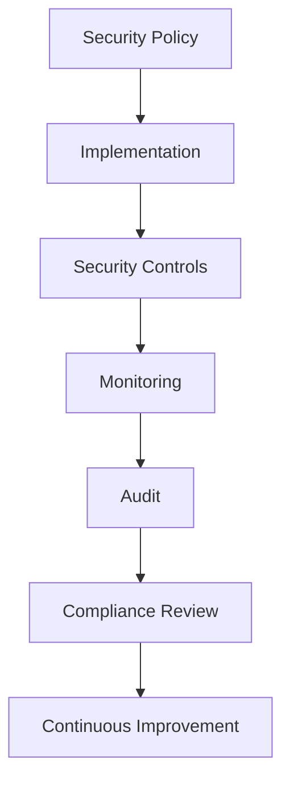

---

## Governance Cycle

| Phase | Activity |
|--------|----------|
| Policy | Define |
| Implementation | Apply |
| Monitoring | Observe |
| Audit | Verify |
| Improvement | Enhance |

---

# 13. Compliance Checklist

## Governance

- Security Policy
- Security Roles
- Documented Procedures
- Regular Review

---

## Privacy

- PII Protection
- Data Masking
- Audit Trail
- Encryption

---

## Access

- RBAC
- Least Privilege
- Access Review
- Separation of Duties

---

## Risk

- Risk Assessment
- Risk Treatment
- Monitoring
- Documentation

---

## Audit

- Internal Audit
- Compliance Review
- Security Monitoring
- Continuous Improvement

---

# 14. Summary

Part 10 mendefinisikan **Compliance & Security Governance** pada Parakita yang mencakup tata kelola keamanan, kepatuhan terhadap regulasi, perlindungan privasi, pengelolaan hak akses, tata kelola data, manajemen kebijakan keamanan, manajemen risiko, audit internal, pengelolaan keamanan pihak ketiga, serta pemantauan kepatuhan secara berkelanjutan. Seluruh proses dirancang untuk mendukung penerapan **Security Governance**, **Privacy by Design**, dan **Continuous Improvement**, sehingga sistem dapat memenuhi kebutuhan operasional, audit, dan kepatuhan sepanjang siklus hidup aplikasi.

---

**End of Part 10**

**Next Part**

**Part 11 — Security Testing**

# Parakita Software Architecture Document (SAD)

# 25 - Security

| Document Information | |
|----------------------|----------------------------------------------|
| Project | Parakita - Dental Clinic Management System |
| Document | 25 - Security |
| Part | 11 of 12 |
| Version | 1.0.0 |
| Status | Draft |
| Document Type | Security Architecture Specification |
| Architecture Style | Clean Architecture + Domain Driven Design + Modular Monolith |
| Frontend | Next.js + TypeScript |
| Backend | Express.js + TypeScript |
| Database | MySQL |
| Security Domain | Security Testing & Validation |
| Last Updated | July 2026 |

---

# Table of Contents (Part 11)

1. Security Testing Overview
2. Security Testing Strategy
3. Secure SDLC Integration
4. Static Application Security Testing (SAST)
5. Dynamic Application Security Testing (DAST)
6. Dependency & Container Scanning
7. Penetration Testing
8. Authentication & Authorization Testing
9. Infrastructure Security Testing
10. Security Regression Testing
11. Vulnerability Management Workflow
12. Security Testing Matrix
13. Security Testing Checklist
14. Summary

---

# 1. Security Testing Overview

## Overview

Security Testing memastikan bahwa seluruh kontrol keamanan yang telah dirancang benar-benar berfungsi sesuai tujuan dan mampu melindungi aplikasi Parakita dari berbagai ancaman keamanan.

Testing dilakukan sepanjang Software Development Lifecycle (SDLC), bukan hanya sebelum sistem diproduksi.

---

## Objectives

- Memvalidasi implementasi kontrol keamanan.
- Menemukan kerentanan sejak dini.
- Mengurangi risiko eksploitasi.
- Mendukung proses Secure SDLC.
- Menjamin kualitas implementasi keamanan.

---

## Security Testing Principles

- Shift Left Security
- Continuous Testing
- Risk-Based Testing
- Defense in Depth Validation
- Continuous Improvement

---

# 2. Security Testing Strategy

Security Testing dilakukan secara berlapis.

```text
Developer

↓

Static Analysis

↓

Dependency Scan

↓

Unit Test

↓

Integration Test

↓

Dynamic Test

↓

Penetration Test

↓

Production Monitoring
```

---

## Testing Layers

| Layer | Testing |
|--------|----------|
| Source Code | SAST |
| Dependency | Dependency Scan |
| API | DAST |
| Authentication | Security Test |
| Authorization | RBAC Test |
| Infrastructure | Infrastructure Assessment |
| Production | Continuous Monitoring |

---

# 3. Secure SDLC Integration

Security menjadi bagian dari setiap fase pengembangan.

| SDLC Phase | Security Activity |
|------------|-------------------|
| Requirement | Security Requirement |
| Design | Threat Modeling |
| Development | Secure Coding |
| Build | SAST & Dependency Scan |
| Testing | DAST |
| Release | Security Review |
| Operation | Monitoring |

---

## Secure Build Pipeline

```text
Developer Commit

↓

Code Review

↓

Build

↓

SAST

↓

Dependency Scan

↓

Unit Test

↓

Integration Test

↓

Deploy
```

---

# 4. Static Application Security Testing (SAST)

SAST dilakukan terhadap source code tanpa menjalankan aplikasi.

---

## Objectives

- Menemukan insecure coding.
- Mendeteksi hardcoded secret.
- Menemukan SQL Injection risk.
- Menemukan XSS risk.
- Menemukan insecure configuration.

---

## SAST Coverage

| Component | Checked |
|-----------|----------|
| API | ✔ |
| Domain | ✔ |
| Infrastructure Code | ✔ |
| Configuration | ✔ |
| Dockerfile | ✔ |

---

## Common Findings

- Hardcoded Password
- Hardcoded JWT Secret
- Unsafe SQL Query
- Weak Validation
- Insecure Exception Handling

---

# 5. Dynamic Application Security Testing (DAST)

DAST dilakukan terhadap aplikasi yang sedang berjalan.

---

## Objectives

- Menguji endpoint API.
- Menguji autentikasi.
- Menguji otorisasi.
- Menguji validasi input.
- Menguji konfigurasi keamanan.

---

## DAST Test Scope

| Area | Tested |
|------|---------|
| Login API | ✔ |
| REST API | ✔ |
| File Upload | ✔ |
| Session Management | ✔ |
| Error Handling | ✔ |

---

## Example Attack Simulation

- SQL Injection
- Cross Site Scripting
- Broken Authentication
- Path Traversal
- Invalid Token
- Parameter Tampering

---

# 6. Dependency & Container Scanning

Dependency pihak ketiga harus diperiksa secara berkala.

---

## Dependency Scan

- npm audit
- Known CVE
- Deprecated Package
- License Review

---

## Docker Image Scan

| Component | Validation |
|-----------|------------|
| Base Image | Verified |
| CVE Scan | Required |
| Package Update | Required |
| Root User | Not Allowed |

---

## Scan Frequency

| Activity | Frequency |
|----------|-----------|
| Build | Every Build |
| CI/CD | Every Pipeline |
| Production | Scheduled |

---

# 7. Penetration Testing

Penetration Testing dilakukan secara berkala untuk menguji keamanan sistem secara menyeluruh.

---

## Test Scope

- Authentication
- Authorization
- REST API
- Infrastructure
- File Upload
- Session Management
- Configuration
- Business Logic

---

## Types

| Type | Description |
|------|-------------|
| Black Box | Tanpa informasi sistem |
| Grey Box | Informasi terbatas |
| White Box | Akses penuh terhadap sistem |

---

## Recommended Frequency

- Sebelum Go-Live
- Setelah perubahan besar
- Minimal 1 kali per tahun

---

# 8. Authentication & Authorization Testing

Kontrol autentikasi dan otorisasi diuji secara khusus.

---

## Authentication Test Cases

- Valid Login
- Invalid Password
- Expired JWT
- Revoked Session
- Locked Account
- Refresh Token
- Multiple Login
- Session Expiration

---

## Authorization Test Cases

| Scenario | Expected |
|----------|----------|
| Access Own Branch | Allow |
| Access Other Branch | Deny |
| Missing Permission | Deny |
| Invalid Role | Deny |
| Admin Access | Allow |

---

## RBAC Validation

```text
User

↓

JWT

↓

Role

↓

Permission

↓

Branch

↓

Resource
```

---

# 9. Infrastructure Security Testing

Infrastructure juga harus diuji.

---

## Validation Scope

- Firewall
- Reverse Proxy
- Docker
- TLS Configuration
- Database Access
- Secret Management
- Backup

---

## Infrastructure Checklist

| Control | Tested |
|----------|---------|
| HTTPS | ✔ |
| Firewall | ✔ |
| Docker Isolation | ✔ |
| Database Isolation | ✔ |
| SSH Configuration | ✔ |

---

# 10. Security Regression Testing

Setiap perubahan aplikasi harus dipastikan tidak merusak kontrol keamanan yang telah ada.

---

## Regression Scope

- Login
- JWT
- RBAC
- File Upload
- Validation
- Audit Log
- API Security
- Security Headers

---

## Trigger

- Feature Release
- Bug Fix
- Framework Upgrade
- Dependency Upgrade
- Configuration Change

---

# 11. Vulnerability Management Workflow

Kerentanan yang ditemukan harus ditangani secara terstruktur.

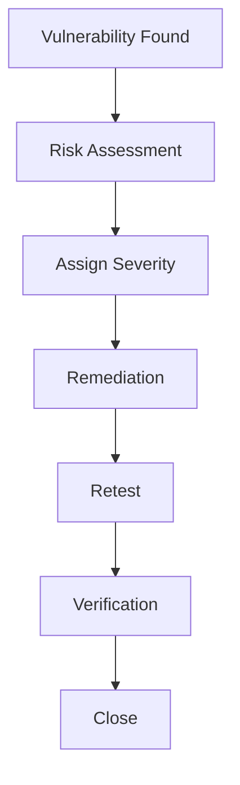

---

## Severity Matrix

| Severity | Response |
|----------|----------|
| Critical | ≤ 24 Jam |
| High | ≤ 7 Hari |
| Medium | ≤ 30 Hari |
| Low | Planned Maintenance |

---

## Workflow Principles

- Prioritization
- Risk-Based Remediation
- Verification
- Documentation

---

# 12. Security Testing Matrix

| Security Area | SAST | DAST | PenTest | Regression |
|---------------|------|------|----------|------------|
| Authentication | ✔ | ✔ | ✔ | ✔ |
| Authorization | ✔ | ✔ | ✔ | ✔ |
| REST API | ✔ | ✔ | ✔ | ✔ |
| Input Validation | ✔ | ✔ | ✔ | ✔ |
| File Upload | ✔ | ✔ | ✔ | ✔ |
| Infrastructure | - | ✔ | ✔ | ✔ |
| Docker | ✔ | - | ✔ | ✔ |
| Dependency | ✔ | - | - | ✔ |

---

# 13. Security Testing Checklist

## Development

- Secure Code Review
- SAST
- Dependency Scan
- Secret Detection

---

## API

- DAST
- JWT Validation
- RBAC Validation
- Input Validation

---

## Infrastructure

- Docker Scan
- Firewall Test
- TLS Validation
- Reverse Proxy Review

---

## Operations

- Penetration Testing
- Vulnerability Assessment
- Security Regression
- Monitoring

---

## Compliance

- Security Report
- Vulnerability Tracking
- Retest Evidence
- Audit Documentation

---

# 14. Summary

Part 11 mendefinisikan **Security Testing & Validation** pada Parakita yang mencakup strategi pengujian keamanan di seluruh siklus pengembangan, integrasi Secure SDLC, penggunaan **SAST**, **DAST**, dependency dan container scanning, penetration testing, pengujian autentikasi dan otorisasi, validasi keamanan infrastruktur, security regression testing, serta workflow pengelolaan kerentanan. Pendekatan ini memastikan bahwa setiap perubahan pada aplikasi tetap mempertahankan kontrol keamanan yang telah dirancang dan mendukung proses **Continuous Security Improvement**.

---

**End of Part 11**

**Next Part**

**Part 12 — Security Best Practices & Conclusion**

# Parakita Software Architecture Document (SAD)

# 25 - Security

| Document Information | |
|----------------------|----------------------------------------------|
| Project | Parakita - Dental Clinic Management System |
| Document | 25 - Security |
| Part | 12 of 12 |
| Version | 1.0.0 |
| Status | Draft |
| Document Type | Security Architecture Specification |
| Architecture Style | Clean Architecture + Domain Driven Design + Modular Monolith |
| Frontend | Next.js + TypeScript |
| Backend | Express.js + TypeScript |
| Database | MySQL |
| Document Scope | Security Best Practices & Conclusion |
| Last Updated | July 2026 |

---

# Table of Contents (Part 12)

1. Security Best Practices
2. Secure Development Guidelines
3. Operational Security Guidelines
4. Security Governance Recommendations
5. Security Maturity Roadmap
6. Security Architecture Principles
7. Security Metrics (KPI)
8. Future Security Enhancements
9. Security Reference Standards
10. Conclusion

---

# 1. Security Best Practices

Parakita menerapkan pendekatan **Security by Design** sehingga keamanan menjadi bagian dari seluruh siklus hidup aplikasi, mulai dari perancangan, pengembangan, deployment, hingga operasional.

---

## Core Principles

- Security by Design
- Secure by Default
- Least Privilege
- Defense in Depth
- Zero Trust Mindset
- Privacy by Design
- Continuous Improvement

---

## Best Practices Summary

| Area | Best Practice |
|------|---------------|
| Authentication | JWT + Refresh Token + Session Validation |
| Authorization | RBAC + Branch Isolation |
| Communication | HTTPS + TLS 1.2+ |
| Password | bcrypt Hash |
| Secrets | Environment Variable / Secret Management |
| Database | Least Privilege |
| Logging | Centralized Audit Trail |
| Backup | Encrypted Backup |
| Monitoring | Security Event Monitoring |

---

# 2. Secure Development Guidelines

Seluruh pengembangan mengikuti standar Secure Development Lifecycle (Secure SDLC).

---

## Development Principles

- Validasi seluruh input.
- Encode seluruh output sesuai konteks.
- Gunakan parameterized query.
- Hindari hardcoded secret.
- Terapkan TypeScript Strict Mode.
- Gunakan DTO Validation.
- Lakukan code review sebelum merge.

---

## Development Checklist

| Activity | Required |
|----------|----------|
| Threat Modeling | ✔ |
| Code Review | ✔ |
| SAST | ✔ |
| Dependency Scan | ✔ |
| Unit Test | ✔ |
| Integration Test | ✔ |
| Security Testing | ✔ |

---

## Coding Recommendations

- Gunakan immutable object bila memungkinkan.
- Hindari penggunaan library yang tidak dipelihara.
- Terapkan prinsip Single Responsibility.
- Tangani exception secara konsisten.
- Dokumentasikan keputusan keamanan.

---

# 3. Operational Security Guidelines

Keamanan operasional harus dijaga setelah aplikasi diproduksi.

---

## Daily Operations

- Monitoring aplikasi.
- Monitoring server.
- Monitoring database.
- Monitoring audit log.
- Verifikasi backup.
- Review security alert.

---

## Operational Checklist

| Activity | Frequency |
|----------|-----------|
| Backup Verification | Daily |
| Security Log Review | Daily |
| Infrastructure Monitoring | Continuous |
| Dependency Review | Monthly |
| Vulnerability Scan | Monthly |
| Penetration Test | Annual |

---

## Operational Recommendations

- Terapkan Change Management.
- Gunakan Principle of Least Privilege.
- Dokumentasikan seluruh perubahan produksi.
- Rotasi secret secara berkala.
- Uji prosedur pemulihan bencana.

---

# 4. Security Governance Recommendations

Governance memastikan kontrol keamanan tetap efektif sepanjang siklus hidup sistem.

---

## Governance Areas

- Security Policy
- Access Governance
- Risk Management
- Incident Response
- Compliance Monitoring
- Security Awareness

---

## Recommended Reviews

| Review | Frequency |
|---------|-----------|
| Access Review | Quarterly |
| Security Policy | Annual |
| Risk Assessment | Annual |
| Disaster Recovery Test | Annual |
| Security Architecture Review | Annual |

---

# 5. Security Maturity Roadmap

Roadmap berikut dapat digunakan sebagai acuan peningkatan kapabilitas keamanan.

---

## Level 1 — Foundational

- HTTPS
- JWT Authentication
- RBAC
- Audit Log
- Backup
- Secure Coding

---

## Level 2 — Managed

- SIEM Integration
- Centralized Logging
- Vulnerability Scanning
- Automated Backup Validation
- Infrastructure Monitoring

---

## Level 3 — Advanced

- Web Application Firewall (WAF)
- Intrusion Detection System (IDS)
- Intrusion Prevention System (IPS)
- Security Automation
- Threat Intelligence

---

## Level 4 — Optimized

- Zero Trust Architecture
- Security Orchestration (SOAR)
- AI-Assisted Threat Detection
- Continuous Compliance Monitoring
- Automated Incident Response

---

# 6. Security Architecture Principles

Seluruh arsitektur keamanan Parakita mengikuti prinsip-prinsip berikut.

---

## Architectural Principles

### Defense in Depth

Keamanan diterapkan pada setiap lapisan aplikasi, jaringan, dan infrastruktur.

---

### Least Privilege

Setiap pengguna dan layanan hanya memperoleh hak akses minimum yang diperlukan.

---

### Fail Secure

Apabila terjadi kegagalan, sistem tetap berada pada kondisi yang aman.

---

### Secure by Default

Konfigurasi bawaan selalu mengutamakan keamanan.

---

### Zero Trust

Tidak ada pengguna, perangkat, atau layanan yang dipercaya secara otomatis tanpa proses verifikasi.

---

### Separation of Duties

Aktivitas penting seperti approval, refund, dan administrasi dipisahkan antar peran untuk mengurangi risiko penyalahgunaan.

---

# 7. Security Metrics (KPI)

Keamanan perlu diukur secara berkala menggunakan indikator yang terdefinisi.

---

## Recommended KPI

| Metric | Target |
|---------|---------|
| Critical Vulnerability Resolution | ≤ 24 Jam |
| High Vulnerability Resolution | ≤ 7 Hari |
| Backup Success Rate | ≥ 99% |
| Failed Login Investigation | 100% |
| Audit Log Availability | 100% |
| TLS Certificate Validity | 100% |
| Security Patch Compliance | 100% |
| Disaster Recovery Test Success | 100% |

---

## Monitoring Dashboard

Dashboard keamanan dapat menampilkan:

- Login Failure Trend
- Active Session
- API Error Rate
- Failed Authorization
- Container Health
- Database Availability
- Backup Status
- Security Alert Summary

---

# 8. Future Security Enhancements

Beberapa peningkatan keamanan dapat dipertimbangkan pada fase pengembangan berikutnya.

---

## Application Security

- Multi-Factor Authentication (MFA)
- Passwordless Authentication
- Adaptive Authentication
- Device Trust Verification

---

## Infrastructure Security

- Web Application Firewall (WAF)
- Distributed Denial of Service (DDoS) Protection
- Container Runtime Protection
- Kubernetes Security (jika migrasi ke orchestration)

---

## Monitoring

- SIEM Integration
- Security Analytics
- Threat Intelligence Feed
- Behavioral Analytics

---

## Data Protection

- Database Field-Level Encryption
- Hardware Security Module (HSM)
- Key Management Service (KMS)
- Data Loss Prevention (DLP)

---

## Compliance

- ISO/IEC 27001 Certification
- SOC 2 Readiness
- Continuous Compliance Monitoring
- Automated Audit Reporting

---

# 9. Security Reference Standards

Dokumen ini disusun dengan mengacu pada praktik terbaik industri sebagai referensi arsitektur keamanan.

---

## Reference Standards

| Standard | Purpose |
|----------|---------|
| OWASP Top 10 | Application Security Risks |
| OWASP ASVS | Application Security Verification |
| OWASP API Security Top 10 | API Security |
| CIS Controls | Security Best Practices |
| ISO/IEC 27001 | Information Security Management |
| NIST Cybersecurity Framework | Security Governance |
| Zero Trust Architecture | Modern Access Control |

---

## Security Domains Covered

- Authentication
- Authorization
- API Security
- Data Security
- Infrastructure Security
- Application Security
- Audit & Logging
- Incident Response
- Compliance
- Security Testing

---

# 10. Conclusion

Security Architecture Parakita dirancang sebagai bagian integral dari keseluruhan Software Architecture dengan mengadopsi prinsip **Defense in Depth**, **Least Privilege**, **Security by Design**, dan **Zero Trust**. Dokumen ini mendefinisikan kontrol keamanan pada seluruh lapisan sistem, mulai dari autentikasi, otorisasi, API, aplikasi, data, infrastruktur, audit, hingga tata kelola keamanan.

Melalui penerapan **JWT Authentication**, **Role-Based Access Control (RBAC)**, **Branch Isolation**, **Encryption**, **Audit Trail**, **Incident Response**, serta **Security Testing** yang terintegrasi dengan **Secure SDLC**, Parakita menyediakan fondasi keamanan yang kuat untuk mendukung operasional klinik gigi secara aman, andal, dan mudah diaudit.

Dokumen ini juga menyediakan roadmap peningkatan keamanan sehingga arsitektur dapat berkembang seiring pertumbuhan sistem, kebutuhan regulasi, dan ancaman keamanan yang terus berubah. Dengan demikian, Security Architecture menjadi landasan penting dalam menjaga **Confidentiality**, **Integrity**, **Availability**, serta perlindungan data pasien sepanjang siklus hidup aplikasi.

---

# Document Completion

Dokumen **25 - Security** telah selesai.

## Document Coverage

- Authentication
- Authorization (RBAC)
- API Security
- Data Security
- Infrastructure Security
- Application Security
- Audit & Logging
- Incident Response
- Compliance & Governance
- Security Testing
- Security Best Practices
- Security Roadmap

---

## Related SAD Documents

- 01 — Introduction
- 02 — Architectural Drivers
- 03 — Architecture Overview
- 04 — Quality Attributes
- 05 — Technology Stack
- 06 — System Context
- 07 — Use Case View
- 08 — Domain Model
- 09 — Module Decomposition
- 10 — Database Design
- 11 — API Design
- 12 — Frontend Architecture
- 13 — Backend Architecture
- 14 — Integration Architecture
- 15 — Infrastructure
- 16 — Module Billing
- 17–24 — Supporting Architecture Documents
- **25 — Security**

---

**End of Document**

**Security Document Completed Successfully**